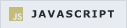
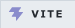

# 🐶 Bulldog's House

<p align="center">
  <a href="https://hyeonseok93.github.io/" style="text-decoration:none;"><picture><source media="(prefers-color-scheme: dark)" srcset="assets/readme_badges/dark/github-pages.png" /></picture></a>&#8194;<a href="https://bulldog93.tistory.com/" style="text-decoration:none;"><picture><source media="(prefers-color-scheme: dark)" srcset="assets/readme_badges/dark/tistory.png" /></picture></a><br />
  <a href="https://hyeonseok93.github.io/">https://hyeonseok93.github.io/</a>
  ·
  <a href="https://bulldog93.tistory.com/">https://bulldog93.tistory.com/</a>
</p>

<p align="center">
  <picture></picture>
</p>

<p align="center">
  나만의 블로그 스킨을 만들고, GitHub Pages와 티스토리에 배포하기 위한 저장소입니다.<br />
  소스는 하나고, GitHub Pages는 백업 블로그 · 티스토리는 메인 블로그로 같은 구조가 올라갑니다.
</p>

<p align="center">
  <strong>✨ 들어오셔서 확인해보세요!!! ✨</strong>
</p>

<br />

## 🛠 기술 스택

<p align="center">
  <picture>
    <source media="(prefers-color-scheme: dark)" srcset="assets/badges/dark/html5.png" />
    
  </picture>
  <picture>
    <source media="(prefers-color-scheme: dark)" srcset="assets/badges/dark/css3.png" />
    
  </picture>
  <picture>
    <source media="(prefers-color-scheme: dark)" srcset="assets/badges/dark/javascript.png" />
    
  </picture>
  <picture>
    <source media="(prefers-color-scheme: dark)" srcset="assets/badges/dark/vite.png" />
    
  </picture>
  <picture>
    <source media="(prefers-color-scheme: dark)" srcset="assets/badges/dark/tailwindcss.png" />
    
  </picture>
  <picture>
    <source media="(prefers-color-scheme: dark)" srcset="assets/badges/dark/githubactions.png" />
    
  </picture>
</p>

<br />

## 💻 실행/빌드 명령어

<table align="center">
  <thead>
    <tr>
      <th align="left">명령어</th>
      <th align="left">용도</th>
    </tr>
  </thead>
  <tbody>
    <tr>
      <td><code>npm install</code></td>
      <td>의존성 설치</td>
    </tr>
    <tr>
      <td><code>npm run dev</code></td>
      <td>로컬 개발 (Vite HMR)</td>
    </tr>
    <tr>
      <td><code>npm run build:gh-pages</code></td>
      <td>배포용 빌드 → <code>dist/gh-pages/</code></td>
    </tr>
    <tr>
      <td><code>npm run build:tistory</code></td>
      <td>티스토리 스킨 → <code>dist/tistory/</code></td>
    </tr>
  </tbody>
</table>

<br />

## 📂 프로젝트 구조 (Project Folder Structure)

```text
Hyeonseok93.github.io/
┣━━ 📂 assets/                        # 정적 에셋 (이미지/뱃지 등)
┃   ┣━━ 📂 badges/dark/               # README 기술 스택 뱃지 (다크)
┃   ┣━━ 📂 badges/light/              # README 기술 스택 뱃지 (라이트)
┃   ┗━━ 📂 readme_badges/             # README 플랫폼 뱃지 (dark/light)
┣━━ 📂 content/
┃   ┗━━ 📂 posts/                     # 글 원본 (category/slug/index.md)
┣━━ 📂 scripts/                       # 빌드/생성/검증 스크립트
┃   ┣━━ 📄 build-posts.js             # 글 HTML + manifest 생성
┃   ┣━━ 📄 generate-sources.js        # CategoryTree · Article 셸 생성
┃   ┣━━ 📄 template-engine.js         # 레이아웃 컴파일 엔진
┃   ┗━━ 📄 validate-gh-pages.js       # gh-pages 결과 검증
┣━━ 📂 src/                           # 대시보드/글 UI 소스
┃   ┣━━ 📂 components/                # HTML 컴포넌트
┃   ┣━━ 📂 features/                  # 기능별 모듈
┃   ┣━━ 📂 styles/                    # 스타일 조각
┃   ┣━━ 📂 templates/                 # 템플릿 원본
┃   ┗━━ 📂 data/
┃       ┗━━ 📄 categories.json        # 카테고리 라벨/트리
┣━━ 📂 public/
┃   ┗━━ 📂 posts/                     # 생성된 글 HTML (gitignore)
┣━━ 📂 dist/                          # 빌드 산출물
┃   ┣━━ 📂 gh-pages/                  # GitHub Pages 배포 산출물
┃   ┗━━ 📂 tistory/                   # 티스토리 스킨 산출물
┗━━ 📄 build-html.js                  # 타깃별 HTML 출력 (index/dist)
```

---

## 📄 글 작성

아래 순서대로 작성하면 됩니다.

### 1) 폴더 구조

```text
content/posts/
┣━━ 📂 category-name/                  # 카테고리 ID (categories.json과 일치)
┃   ┗━━ 📂 post-slug/                  # 포스트 slug (URL 폴더명)
┃       ┣━━ 📄 index.md                # 본문 (필수)
┃       ┣━━ 🖼️ thumbnail.png           # 목록/상단 썸네일 (선택)
┃       ┣━━ 🖼️ fig1.png                # 본문 이미지 (선택, 같은 폴더에 배치)
┃       ┗━━ 🖼️ fig2.png
┗━━ ...
```

- **카테고리 폴더명** → `src/data/categories.json`의 ID와 동일
- **포스트 폴더명** → URL slug (`/posts/post-slug/`)
- **본문 이미지** → 별도 `images/` 폴더 없이 포스트 폴더에 두고, 본문에서는 `./fig1.png`처럼 상대 경로로 참조

### 2) 작성 순서

1. `content/posts/{category}/{slug}/` 폴더 생성
2. `index.md` 작성 + 필요하면 `thumbnail.png`, `fig1.png` 등 같은 폴더에 추가
3. `npm run dev` 또는 `npm run build:gh-pages`로 확인 후 push

> [!TIP]
> 빌드/개발 명령을 실행하면 `public/posts/`, `src/data/posts-manifest.js`가 자동 생성되며(gitignore 대상),  
> 글 미리보기는 `npm run dev` 실행 후 `http://localhost:5173/posts/{slug}/`에서 확인할 수 있습니다.

### 3) frontmatter(메타데이터) 예시

`index.md` 상단에 아래처럼 메타데이터를 넣어주면 됩니다.

```markdown
---
title: 글 제목
date: 2026-07-07
tags: [tag1, tag2]
thumbnail: thumbnail.png   # 생략 시 폴더 안 thumbnail.* 자동 탐색
---
```

본문 첫 부분은 카테고리 목록 요약(최대 3줄)으로 자동 표시됩니다.

- frontmatter의 `category` / `slug`는 생략 가능 (폴더 구조 우선)

> [!IMPORTANT]
> 티스토리에 업로드할 때는 frontmatter(`---` 블록)를 제거하고 본문만 붙여넣으세요.  
> 태그도 frontmatter의 `tags`를 그대로 쓰지 말고, 티스토리 에디터에서 별도로 입력해야 합니다.

---

## 🚀 배포 (GitHub Pages + Tistory)

`main` 브랜치에 push하면 GitHub Actions가 `npm run build:all`을 실행합니다.

### 자동으로 되는 것

- **GitHub Pages**: `dist/gh-pages/`가 자동 배포됩니다.
- **티스토리 스킨 빌드**: `dist/tistory/`가 빌드되고, `tistory-skin` 아티팩트가 생성됩니다.

### 직접 해야 하는 것 (티스토리 업로드)

1. 저장소 **Actions** → 최신 실행 → **Artifacts** → `tistory-skin` 다운로드
2. 티스토리 관리자 **꾸미기 → 스킨 → 스킨 등록**으로 이동
3. 다운로드한 zip을 풀고, 안의 파일들을 티스토리 스킨 등록 화면에 업로드
   - 루트 파일: `index.xml`, `skin.html`, `style.css`, `preview.gif`
   - `images/` 폴더: 내부 전체 파일 (`images/tistory.js` 포함)
4. 저장 후 스킨 이름 입력 → **보관함**에서 적용

> [!TIP]
> 업로드 파일 목록은 로컬에서 `npm run tistory:upload-list`로 확인할 수 있습니다. 티스토리 포스팅은 `index.md` 본문 내용을 그대로 복사해 붙여넣고, 이미지는 티스토리 에디터에서 별도로 업로드해 넣으면 됩니다.

GitHub Pages 설정: **Settings → Pages → Source: GitHub Actions**

---

## 🧭 빌드 흐름 이해하기

이 프로젝트는 **글 원본(Markdown) + 템플릿**을 합쳐 GitHub Pages용 결과물과 Tistory 스킨 결과물을 각각 만들어냅니다.

1. **원본 준비**
   - 글 원본: `content/posts/`
   - 카테고리 구조: `src/data/categories.json`
   - 공통 레이아웃: `src/templates/article-shell.source.html`, `src/layout.html`
2. **생성 단계**
   - `scripts/generate-sources.js`가 카테고리/아티클 관련 생성 파일을 갱신
   - `scripts/build-posts.js`가 글 HTML과 manifest를 생성
3. **출력 단계**
   - GitHub Pages 출력: `dist/gh-pages/`
   - Tistory 출력: `dist/tistory/`

---

## 🔧 어디를 수정해야 하나?

<table align="center">
  <thead>
    <tr>
      <th align="left">바꾸고 싶은 내용</th>
      <th align="left">수정할 파일</th>
    </tr>
  </thead>
  <tbody>
    <tr>
      <td>카테고리 트리/이름</td>
      <td><code>src/data/categories.json</code></td>
    </tr>
    <tr>
      <td>글 본문/썸네일/이미지</td>
      <td><code>content/posts/{category}/{slug}/</code></td>
    </tr>
    <tr>
      <td>글 페이지 공통 구조</td>
      <td><code>src/templates/article-shell.source.html</code></td>
    </tr>
    <tr>
      <td>홈/사이드바/레이아웃 구조</td>
      <td><code>src/layout.html</code>, <code>src/components/</code></td>
    </tr>
    <tr>
      <td>빌드 동작 자체</td>
      <td><code>scripts/template-engine.js</code>, <code>scripts/build-posts.js</code></td>
    </tr>
  </tbody>
</table>
