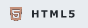
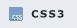
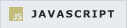

# 🐶 Bulldog's House

<p align="center">
  <a href="https://hyeonseok93.github.io/" style="text-decoration:none;"><picture><source media="(prefers-color-scheme: dark)" srcset=".github/readme/badges/dark/github-pages.png" /></picture></a><br />
  <a href="https://hyeonseok93.github.io/">https://hyeonseok93.github.io/</a>
</p>

<p align="center">
  <picture></picture>
</p>

<p align="center">
  논문, 프로젝트, 그리고 루키즈 5기 기록을 시리즈로 모아 두는 블로그입니다.
</p>

<br />

## 🛠 Built With

<p align="center">
  <picture>
    <source media="(prefers-color-scheme: dark)" srcset=".github/readme/badges/dark/html5.png" />
    
  </picture>
  <picture>
    <source media="(prefers-color-scheme: dark)" srcset=".github/readme/badges/dark/css3.png" />
    
  </picture>
  <picture>
    <source media="(prefers-color-scheme: dark)" srcset=".github/readme/badges/dark/javascript.png" />
    
  </picture>
  <picture>
    <source media="(prefers-color-scheme: dark)" srcset=".github/readme/badges/dark/githubactions.png" />
    
  </picture>
</p>

<br />

## 💻 Commands

| 명령어 | 용도 |
|---|---|
| `npm install` | 의존성 설치 |
| `npm run dev` | 빌드 후 `http://localhost:4173` 미리보기. `content/`, `src/`, `scripts/`가 바뀌면 다시 빌드 |
| `npm run build` | `content/` → `dist/gh-pages/` 생성 |
| `npm run check` | 빌드 결과 검사 (없는 파일 · 깨진 링크 · 외부 리소스 · 글 주소) |
| `npm run build:gh-pages` | build + check. `main` push 시 GitHub Actions가 실행 |

> PowerShell에서 `npm.ps1` 실행 정책 오류가 나면 `npm.cmd run …` 을 사용합니다.

<br />

## 📂 Project Structure

```text
Hyeonseok93.github.io/
┣━━ 📂 content/
┃   ┣━━ 📄 site.json                  # 시리즈 정보 (일지 단계, 프로젝트 종류, 논문 요약, 루키즈 트랙)
┃   ┗━━ 📂 posts/{category}/{slug}/   # 글 원본 (index.md + 이미지)
┣━━ 📂 scripts/
┃   ┣━━ 📄 build.js                   # 전체 빌드
┃   ┣━━ 📄 check.js                   # 빌드 결과 검사
┃   ┣━━ 📄 dev.js                     # 로컬 미리보기 서버
┃   ┗━━ 📂 lib/                       # 글 읽기 · 본문 가공 · 이미지(WebP) · 페이지 템플릿
┣━━ 📂 src/
┃   ┣━━ 📂 css/                       # base · home · list · post (하나로 합쳐 배포)
┃   ┣━━ 📂 js/                        # 검색, 필터, 목차 등 페이지 스크립트
┃   ┗━━ 📂 assets/                    # 폰트(Pretendard, Fira Code), 아이콘, 마스코트
┗━━ 📂 dist/gh-pages/                 # 배포 산출물 (gitignore)
```

### 주소

| 페이지 | 주소 |
|---|---|
| 홈 | `/` |
| 논문 요약 | `/papers/` |
| 개인 프로젝트 | `/projects/` |
| 루키즈 5기 일지 / 프로젝트 | `/rookies/log/`, `/rookies/projects/` |
| 글 | `/posts/{slug}/` |

<br />

## 📄 Writing Posts

### 1) 폴더

```text
content/posts/
┣━━ 📂 papers/                 # 논문 요약
┣━━ 📂 personal-web/           # 개인 프로젝트 (웹)
┣━━ 📂 personal-toy/           # 개인 프로젝트 (그 외)
┣━━ 📂 rookies-offline/        # 루키즈 5기 일지 (slug 끝이 dayN)
┣━━ 📂 rookies-showcase/       # 루키즈 5기 프로젝트
┗━━ 📂 legal/                  # 개인정보 처리방침 등 (hidden)
    ┗━━ 📂 {slug}/
        ┣━━ 📄 index.md
        ┣━━ 🖼️ thumbnail.png   # 카드 · 표지 이미지
        ┗━━ 🖼️ fig1.png        # 본문 이미지, 본문에서는 ./fig1.png
```

이미지는 PNG/JPG 원본을 그대로 두면 빌드할 때 WebP로 바꿔서 배포합니다 (카드용 640px, 본문 · 표지 최대 1600px).

### 2) frontmatter

```markdown
---
title: "[TOY] 이름 — 한 줄 설명"
date: 2026-07-07
tags:
  - electron
  - react
thumbnail: thumbnail.png
hidden: false        # true면 목록 · 검색에서 빠지고 주소로만 열림

# 프로젝트 글(개인 · 루키즈)만: 제목 아래 정보 카드에 표시
repo: https://github.com/Hyeonseok93/저장소이름
store: https://chromewebstore.google.com/detail/…   # 있으면
deploy:                                             # 있으면
  domain: example.com
  live: false        # false면 "운영 종료"로 표시
---
```

### 3) 시리즈별로 함께 고칠 곳 (`content/site.json`)

| 새 글 | site.json |
|---|---|
| 개인 프로젝트 | 웹 앱 · 크롬 확장이면 `projects.kindBySlug`에 추가 (없으면 데스크톱 앱) |
| 논문 요약 | `papers.summaries`에 문제 · 방법 · 결과 한 줄씩 |
| 루키즈 일지 | 단계 범위(`rookies.log.phases`) 안의 Day면 그대로 |
| 루키즈 프로젝트 | `rookies.projects.track`에 이름 · 단계 · 설명 · 스택 |


<br />

## 🚀 Deploy

`main`에 push하면 GitHub Actions가 `npm run build:gh-pages`를 실행하고 `dist/gh-pages/`를 배포합니다.
(Settings → Pages → Source: GitHub Actions)
