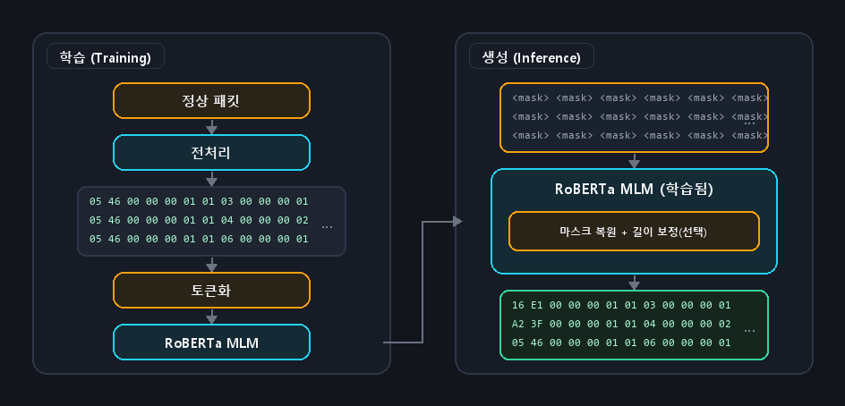
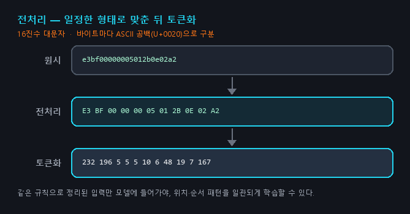
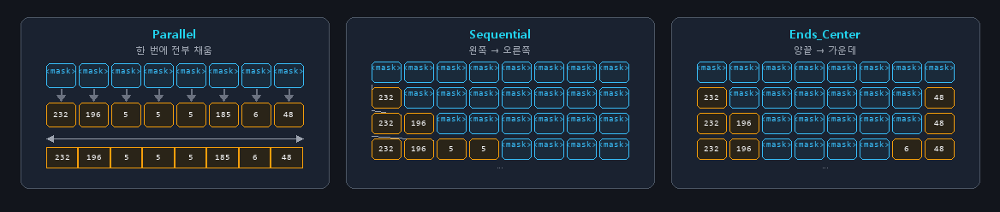
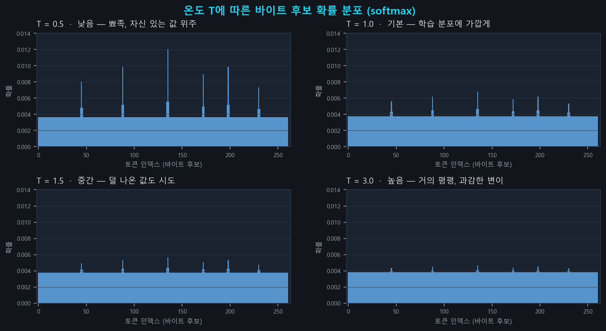

---

# 핵심 요약

- **문제:** 공장·발전소 장비는 멈추면 사고로 이어질 수 있어, **실행 중에만 드러나는 약점**을 찾기 위해 이상한 입력을 넣어 보는 **퍼징(동적 분석)** 이 필요합니다. 그런데 Modbus/TCP처럼 형식이 엄격한 통신에서는 **바이트를 무작위로 바꾼 입력**은 입구에서 바로 걸러지고, **규격서 기반으로 템플릿**을 짜 두는 방식은 제조사마다 통신 방식이 달라 사람 손이 많이 갑니다.

- **방법:** **공격 패킷 없이, 정상 패킷만** 모아 RoBERTa에 “이 위치에는 보통 이런 바이트가 온다”는 패턴을 가르칩니다. 그다음 빈 칸(`<mask>`)을 채워 **새 패킷을 생성**합니다. 통신 규격서나 패킷을 읽는 코드를 사람이 미리 짜 두지 않고 진행하며, [RoBERTa Quadrant Mapping 기반 ICS 독점 프로토콜 이상 탐지](https://hyeonseok93.github.io/posts/roberta-quadrant-mapping-ics/)와 같이 **1바이트=1토큰**으로 바이트 자리를 유지합니다. 생성할 때는 **빈 칸을 한 번에 채울지, 한 칸씩 채우며 문맥을 다시 볼지**로 속도와 형식 맞춤을 고르고, **변이 강도(온도)** 로 안전한 값 위주와 다양한 변이 사이를 조절합니다.

- **결과:** Modbus/TCP 실험에서 제안 방식은 **규격서 기반보다 서버 안쪽을 더 깊게·더 다양하게** 검사했고, **랜덤 변이보다 형식을 지키면서도 의미 있는 탐색**을 더 잘했습니다. 설정에 따라 **하루 수백만 건**까지 보내는 속도도 나왔습니다. 빈 칸을 **한 번에** 채울지 **한 칸씩** 채울지, 그리고 변이 강도(온도)로 속도와 탐색 폭을 조절할 수 있으며, 학습 패킷만 바꿔도 **그 현장 트래픽에 맞는** 입력이 나옵니다.

# 서론. 공장 장비 퍼징이 왜 어려운가

## 1. 공장 장비는 왜 보안 테스트가 까다로운가

일반 IT와 산업 제어 현장은 운용 전제가 다릅니다.

| 항목 | 산업 제어 현장의 특성 |
| --- | --- |
| **멈추면 사고** | 발전·제조 설비는 멈추는 순간 물리적 피해로 이어질 수 있습니다. |
| **타이밍이 중요** | 밀리초 단위 제어가 중요해, 무거운 암호화·인증을 얹기 어렵습니다. |
| **오래 쓰는 장비** | 수명이 10~20년 단위이고, 계획 정비 외 패치가 어렵습니다. |
| **제조사가 제각각** | 세대·제조사가 다른 장비가 한 망에 섞여, 표준 보안을 일괄 적용하기 힘듭니다. |

그래서 배포 전 **정적 분석**(소스를 보고 검사)에 많이 의존해 왔습니다. 그런데 실행 중에만 드러나는 버그나 **소스가 공개되지 않은 펌웨어**는 정적 분석만으로는 한계가 큽니다. **실행 중인 대상에 입력을 넣어 보는 동적 분석**이 그 빈틈을 메우는 보완 수단으로 거론되며, 산업 제어에서도 **퍼징**이 자주 이야기되는 이유가 여기 있습니다.

## 2. 퍼징이란 무엇인가

**퍼징(Fuzzing)** 은 실행 중인 대상에 변이 입력을 반복해서 넣어 보고, 크래시·예외 동작을 찾는 **동적 분석**입니다. 소스나 통신 규격서가 부족해도, 네트워크로 닿을 수 있는 대상을 실행 상태에서 검증할 수 있습니다.

> 💡 **쉽게 말하면**  
> 프로그램·장비에 엉뚱한 입력을 많이 넣어 보고, **언제 이상하게 반응하는지** 관찰하는 테스트입니다.

아이디어는 단순하지만, 산업 제어에 그대로 적용하면 **입력을 많이 넣는다**는 전제부터 걸림돌을 만나는 경우가 많습니다.

## 3. 입구에서 걸리는 문제

가장 흔한 걸림돌이 **패킷을 읽는 입구**입니다. Modbus/TCP 같은 산업용 통신은 **포맷 제약이 엄격**합니다. 헤더·길이·명령 코드가 어긋나면 입구에서 패킷이 버려집니다.

- **랜덤 변이 기반** 퍼징은 빠르지만 패킷 형태가 쉽게 깨져, 상당수가 입구에서 걸러집니다.
- **규격서 기반** 퍼징은 형식은 잘 맞추지만, 제조사마다 통신 방식이 달라 템플릿을 사람이 짜야 합니다.

그렇다면 **규격서나 패킷을 읽는 코드를 사람이 미리 짜 두지 않고도**, 입구를 통과할 만한 입력을 안정적으로 만들 방법은 없을까?

## 4. 이 논문이 던진 질문

한 걸음 물러 서 보면, 프로토콜도 결국 **규칙이 있는 데이터**입니다. 헤더·길이·명령 코드가 맞아야 통과하니, 자연어의 **문법**과도 닮았습니다. 그렇다면 패킷 흐름을 **하나의 언어**로 보고, **정상 트래픽만**으로 그 규칙을 익힐 수 있지 않을까요?

**마스킹 언어 모델(Masked Language Model, MLM)** 은 일부를 가려 두고 나머지를 맞추며 문법을 배웁니다. 정상 패킷으로 학습하면 **어느 정도 형식은 지키면서** 살짝 어긋난 입력을 뽑을 수 있고, 규격서나 패킷을 읽는 코드를 새로 짜지 않아도 입구를 통과할 만한 퍼징 입력을 만들 여지가 있습니다. 논문은 이 아이디어를 이렇게 질문으로 정리합니다.

> 통신 규격서 없이, **정상 패킷만**으로 **MLM** 을 사용해 퍼징 입력을 생성할 수 있을까?  
> MLM을 사용했을 때 **유효성·다양성·속도**를 조절할 수 있을까?

# 제안 기법. 정상 패킷만으로 문법을 익히고, 빈칸을 채워 새 입력을 만든다

## 1. 전체 파이프라인

제안 시스템은 **학습(Training)** 과 **생성(Inference)** 으로 나뉩니다.

**정상 패킷**을 **1바이트=1토큰**으로 학습하고, 추론 때는 `<mask>`를 **복원 순서·온도**에 맞게 채운 뒤 필요하면 길이 필드를 고쳐 전송합니다.

## 2. 1바이트 = 1토큰

자연어 RoBERTa의 byte-level BPE를 패킷에 그대로 쓰면 **바이트 경계가 무너집니다.** Modbus/TCP에서는 **몇 번째 바이트에 어떤 값이 오는지**가 핵심이라, **1바이트 = 1토큰**으로 자리를 그대로 유지합니다.

같은 hex 입력을 두 방식으로 토큰화하면 이렇게 달라집니다.

| 구분 | BPE (문자열처럼) | 1바이트 = 1토큰 |
| --- | --- | --- |
| **입력** | `E3 BF 00 00 00 05 01 2B 0E 02 A2` | `E3 BF 00 00 00 05 01 2B 0E 02 A2` |
| **토큰화 결과** | `ĠE` `3` `ĠBF` `Ġ00` `Ġ00` `Ġ00` `Ġ05` `Ġ01` `Ġ2` `B` `Ġ0` `E` `Ġ02` `ĠA` `2` | `E3` `BF` `00` `00` `00` `05` `01` `2B` `0E` `02` `A2` |
| **토큰 수** | 11바이트 → **15토큰** | 11바이트 → **11토큰** |
| **`E3` 한 바이트** | `ĠE` + `3`으로 **쪼개짐** | `E3` **그대로** |
| **`2B` 한 바이트** | `Ġ2` + `B`로 **쪼개짐** | `2B` **그대로** |
| **`00` `03`이 이웃할 때** | `003`처럼 **한 덩어리**가 될 수 있음 | 7번째 = `03`, 8번째 = `00` … **자리 유지** |

## 3. 전처리

수집한 패킷은 표기 방식이 제각각일 수 있습니다. 붙어 있는 소문자 hex, 공백 없는 문자열, 대소문자 혼용 등 **같은 바이트라도 겉모습이 다르게** 들어오기 쉽습니다. 모델이 **일관된 문맥**을 익히려면, 학습 전에 **항상 같은 형태**로 맞춰 두는 전처리가 필요합니다.

전처리는 크게 두 단계입니다. 먼저 바이트열을 **대문자 16진수 두 자리 + 공백**으로 나누고, 이어서 §2에서 말한 것처럼 **1바이트=1토큰**으로 ID에 옮깁니다. 이렇게 하면 패킷마다 겉표기는 달라도, 모델이 보는 입력 **형식은 항상 같아집니다.**

## 4. 정상 트래픽으로 패턴 익히기

퍼징 입력을 만들려면, 먼저 **정상 패킷이 어떻게 생겼는지**를 알아야 합니다. 이 논문은 **공격 패킷 없이**, 수집한 **정상 Modbus/TCP만**으로 그걸 익힙니다. 방법은 **빈칸 채우기**와 비슷합니다. 패킷에서 몇 칸을 가려 두고, 앞뒤 바이트를 보며 **“이 자리에는 뭐가 와야 하지?”** 를 맞혀 보게 합니다. 예를 들어 패킷 일부가 아래와 같다고 합시다.

| 구분 | 바이트 |
| --- | --- |
| **그대로** | `05` `01` `03` `00` `00` `00` `01` |
| **가린 뒤** | `05` `<mask>` `03` `00` `<mask>` `00` `01` |
| **맞혀야 할 것** | 2번째 = `01`, 5번째 = `00` |

2번째 칸은 앞의 `05`·뒤의 `03`을 보고, 5번째 칸은 앞뒤 `00`을 보고 채웁니다. 이런 식으로 반복하면 모델은 **“7번째 자리에는 보통 `03`이 온다”** 처럼, **자리마다 익숙한 값**을 익힙니다. 한 패킷에서 **약 30%** 정도만 가리고, 다음 학습 라운드에는 **다른 칸**을 가립니다. 같은 패킷도 빈칸 위치를 바꿔 여러 번 보면, 한두 자리만 외우지 않고 **문맥 전체**를 배우게 됩니다. 이 학습이 끝나면 §5처럼 **처음부터 `<mask>`만 있는 패킷**을 주고, 배운 대로 칸을 채워 **새 입력**을 만듭니다.

## 5. 복원 순서 — Parallel, Sequential, Ends_Center

추론 단계에서는 학습 때 익힌 패턴을 써서 `<mask>`를 실제 바이트로 바꿉니다. 이 **복원** 과정에서 **어느 정도 형식은 지키면서** 안쪽만 살짝 어긋난 패킷이 나오고, **문맥을 한 번만 보고 채울지·채울 때마다 다시 볼지**에 따라 **형식 준수·다양성·속도**가 달라집니다.

핵심은 **순서 그 자체**보다, 빈 칸을 채울 때 **문맥을 몇 번 참고하느냐**입니다.

**Parallel** — 빈칸을 **한 번에** 채웁니다. 처음 본 문맥만 보고 모든 칸을 동시에 고르니 **가장 빠르고** 변이도 다양하지만, 칸끼리 서로 맞물려야 하는 자리에서는 형식이 어긋나기 쉽습니다.

**Sequential** — **왼쪽에서 오른쪽**으로 한 칸씩 채웁니다. 한 칸을 채울 때마다 **이미 채운 값까지 문맥에 넣고** 다음 칸을 고르니 형식이 잘 맞지만, 칸 수만큼 모델을 반복 호출해야 해서 느립니다.

**Ends_Center** — **왼쪽과 오른쪽을 번갈아** 한 칸씩 채웁니다. Sequential처럼 **채울 때마다 문맥을 갱신**하되, 바깥쪽에서 안쪽으로 좁혀 가며 복원합니다. Modbus/TCP처럼 헤더·길이가 전체 틀을 잡고 본문이 그 안을 채우는 구조에 맞는 절충입니다.

## 6. 샘플링 온도

`<mask>` 한 칸을 채울 때, 모델은 “이 자리에 올 수 있는 값”마다 **점수**를 매깁니다. **softmax**로 점수를 확률로 바꾼 뒤 그중 하나를 뽑는데, 여기에 **온도 T**를 넣으면 그 확률 곡선의 날카로움을 조절할 수 있습니다. T가 **낮을수록** 자신 있는 값에 확률이 몰려 보수적으로 고르고, T가 **높을수록** 덜 나온 값에도 기회가 넓어져 **얼마나 과감하게 뽑을지**를 바꿀 수 있습니다.

- **낮은 온도** — 모델이 자신 있는 값 위주로 고릅니다. 패킷 형식이 잘 맞는 편입니다.
- **높은 온도** — 덜 자주 나오는 값도 골라 냅니다. 다양해지지만, 형식이 깨질 확률도 함께 올라갑니다.

실험에서는 여러 온도를 따로 돌려 보기도 하고, 한 번에 섞어 쓰는 설정도 함께 비교했습니다.

# 실험. libmodbus 서버에 24시간 퍼징

## 1. 무엇을, 무엇과 비교했나

**대상** — `libmodbus`로 만든 **연구용 Modbus/TCP 서버**입니다. 기능 코드를 넓게 처리하도록 구성했고, 서버가 어떤 코드 경로를 탔는지 재기 위해 커버리지 계측을 붙였습니다. 각 설정마다 **24시간** 동일 서버에 패킷을 보냈습니다.

**학습 데이터는 두 종류**였습니다. 하나는 명세를 바탕으로 만든 **생성된 정상 패킷(CSS)** 이고, 다른 하나는 **소규모 태양광 발전소**에서 뽑은 **실측 패킷(ICS)** 입니다. 같은 모델이라도 **무엇을 학습했느냐**에 따라 어떤 패킷을 만들어 내는지도 달라지는지 보기 위해서입니다.

**비교군**은 크게 세 갈래입니다.

- **제안 방식** — 복원 순서(Parallel / Sequential / Ends_Center)와 온도를 바꿔 가며 여러 설정을 시험했습니다.
- **명세 기반** — Modbus/TCP 명세를 사람이 템플릿으로 짜 두고 필드를 변이하는 **전통적인 방식**입니다.
- **랜덤 변이 기반** — 정상 패킷을 시드로 두고 **바이트를 무작위로 바꿔** 만드는 방식입니다. 길이만 맞추거나 헤더 일부를 복구하는 보정 버전도 함께 비교했습니다.

# 결과. 명세 기반·랜덤 변이와의 비교

24시간 동일 서버에 패킷을 쏘아 본 뒤, 제안 방식이 **어디서 확실히 앞섰는지**를 정리하면 다음과 같습니다.

| 항목 | 비교군 | 제안 방식 |
| --- | --- | --- |
| **탐색 깊이** | 명세 기반은 분기 커버리지 **30% 안팎**. 랜덤 변이는 숫자는 비슷해 보여도 **절반 가까이 입구에서 떨어져** 서버에 닿는 입력이 적음 | **40%대**까지 상승 |
| **처리량** | 명세 기반도 빠른 편 | **Parallel** + 낮은 온도로 하루 **400만 건** 가까이. 속도를 유지하면서 위 탐색 깊이도 노릴 수 있는 설정이 있음 |
| **형식 + 다양성** | 명세 기반은 파싱은 통과하지만 유니크 **53%**. 랜덤 변이(보정)는 **Invalid 99%**로 읽기·쓰기를 거의 검사하지 못함 | 파싱 실패를 낮게 유지하면서 유니크 **90% 이상** |
| **의미 있는 변이 위치** | 명세 기반은 본문만, 랜덤 변이는 헤더까지 깨뜨려 입구에서 막히기 쉬움 | **헤더는 안정적으로 두고 본문에서 예외를 유도** |
| **현장 맞춤** | 환경이 바뀌면 템플릿·규칙을 다시 짜야 함 | 학습 패킷만 바꿔도 기능 코드 분포가 달라져, **수작업 템플릿 없이** 그 환경에 맞는 퍼징 가능 |

한 설정이 모든 지표에서 1등은 아닙니다. 다만 **“많이·깊게·형식 유지·다양하게·현장에 맞게”를 한 축에서 고르게 조절**할 수 있다는 점이, 비교군이 각각 한쪽만 잘하는 것과 다른 점입니다.

## 1. 서버 안을 얼마나 깊게 들어갔나

가장 먼저 본 것은 **서버 코드의 얼마나 많은 부분을 실제로 실행했는가**입니다. 같은 24시간 동안, 제안 방식이 서버 안쪽까지 더 깊게 들어갔는지를 보는 지표입니다.

규격서 기반 방식은 형식은 잘 맞췄지만, 사람이 짜 둔 템플릿 안에서 **비슷한 경로만 반복**하는 경향이 있었습니다. 실제로 서버 코드의 **약 30%** 정도만 건드렸고, 같은 24시간에도 **안쪽까지는 덜 들어갔다**는 뜻입니다.

랜덤 변이 기반은 **패킷의 약 62%가 입구에서 바로 버려졌습니다.** 입구를 통과한 것만 놓고 보면 서버 코드의 **약 38%**를 건드려 제안 방식과 비슷해 보이지만, **서버까지 도착한 패킷 수 자체가 적어** 같은 시간에 **실제로 서버를 검사한 양**은 줄어듭니다.

제안 방식은 온도 **1.5** 정도에서 서버 코드의 **약 40~42%**까지 들어갔습니다. 복원 방식(Parallel / Sequential / Ends_Center)끼리 차이는 **1%p 안팎**으로 작지만, **규격서 기반보다 약 10%p** 더 깊고, 입구에서 많이 걸러지는 랜덤 변이보다 **실질적으로 더 많이 탐색**합니다. 핵심은 **규격서·수작업 템플릿 없이**도, 정상 트래픽만으로 **서버 안쪽까지 더 깊게** 들어갈 수 있다는 점입니다.

## 2. 하루에 몇 개나 보냈나

빈 칸을 **한 번에** 채우는 설정(Parallel), 특히 온도를 낮게 둔 경우는 **가장 빨랐습니다.** 하루 **약 404만 건**, 초당 **47건** 가까이 만들었습니다. 규격서 기반(**약 260만 건/일**)보다 많고, 랜덤 변이 기반(보정)과도 **비슷하거나 더 많이** 보냈습니다. **문맥을 한 번만 보고** GPU에서 빈칸을 한꺼번에 채우기 때문입니다.

반면 한 칸씩 채우며 **문맥을 매번 다시 보는** 설정(Sequential)·왼쪽·오른쪽을 번갈아 채우는 설정(Ends_Center)은 하루 **30만 건 전후**, 초당 **3~4건**으로 느립니다. 대신 형식이 잘 맞고, 서버 안쪽을 더 깊게·더 알차게 검사하는 쪽에 가깝습니다. 제안 방식만 **빠르게 많이 보내기**와 **형식을 더 잘 맞추기**를 **설정 하나로 갈아탈** 수 있다는 점이 비교군과 다릅니다.

다만 **많이 보냈다**고 해서 자동으로 **깊게 들어갔다**는 뜻은 아닙니다. 속도와 깊이는 따로 봐야 합니다.

## 3. 패킷은 제대로 먹혔나, 매번 달랐나

서버가 패킷을 어떻게 받아들였는지도 봤습니다.

| 방식 | 파싱 실패 | 정상 처리 | 유니크 / 기타 | 한줄 요약 |
| --- | --- | --- | --- | --- |
| **명세 기반** | **0%** | **6~7%** (예외·오류 **93%**) | 유니크 **53%** | 형식은 맞지만 비슷한 입력을 반복하기 쉬움 |
| **랜덤 변이 기반** | **62%** | — | 통과분만 보면 다양 | 절반 가까이 입구에서 탈락, 서버 도달 비율이 낮음 |
| **랜덤 변이 기반 (보정)** | 거의 통과 | **0.2%** 미만 (예외 **99%**) | — | 형식만 맞고 의미 있는 탐색은 거의 없음 |
| **제안 방식** (온도 **1.0~1.5**) | **3~26%** | **13~39%** | 유니크 **91~94%** | 명세보다 다양하고, 랜덤보다 서버에 더 많이 닿으며, 보정판보다 실제 처리 비율이 높음 |

온도를 너무 올리면 다양해지지만 형식이 깨지고, 너무 내리면 안전하지만 변이가 줄어듭니다. **Parallel** 기준으로 보면, 온도 **0.5**에서는 파싱 실패가 **0.01%** 수준이고 유니크 패킷 비율은 **89%** 안팎이었습니다. **1.5**로 올리면 유니크는 **94%** 가까이 되지만 파싱 실패도 **26%**까지 늘었고, **2.0**에서는 유니크 **99%** 대신 파싱 실패가 **60%** 넘게 갔습니다. 실험에서 실용적인 구간은 **중간 온도** 쪽이었습니다.

## 4. 헤더와 본문, 어디를 건드렸나

Modbus/TCP 패킷은 **헤더(MBAP)** — Transaction ID, Protocol ID, Length, Unit ID — 와 **본문(PDU)** — Function Code와 Data — 로 나뉩니다.

명세 기반 방식은 **헤더 오류 0%**, **본문 오류 93%**로, 헤더는 그대로 두고 **본문만** 이상하게 보냅니다. 랜덤 변이 기반은 **헤더·본문 모두** 깨뜨려 **입구에서 막히거나** 의미 없는 변이가 섞입니다.

제안 방식은 **낮은 온도**에서 **헤더 오류 0.1% 미만**, **본문 오류 55~58%**로, **형식은 통과시키고 본문에서 버그를 찾는** 방향에 가깝습니다. 명세 기반과 같이 헤더를 살리면서도, 온도를 조절해 **본문 변이 강도**를 바꿀 수 있습니다. 랜덤 변이가 헤더까지 망가뜨려 버리는 것과 달리, **입구를 통과한 뒤 안쪽 로직**을 검사하기 쉽습니다.

## 5. 읽기·쓰기 명령은 얼마나 건드렸나

현장에서 민감한 건 코일·레지스터를 **읽고 쓰는** 기능 코드입니다.

명세 기반 방식은 읽기/쓰기 비중은 있지만 **Write OOB(범위 밖 쓰기) 70%**에 치우쳐, **한쪽 예외만 반복**하기 쉽습니다. 랜덤 변이 기반 (보정)은 **Invalid 99%**로 **읽기·쓰기 명령을 거의 쓰지 못합니다.**

제안 방식은 **T=1.0**에서 **Write OK 약 15%**, **Read OK 약 5%**, **Invalid 16~23%**로, **정상·범위 밖·무효**가 섞인 입력을 안정적으로 만들었습니다. 현장에서 민감한 **코일·레지스터 읽기/쓰기**를, 명세 기반처럼 한쪽으로만 치우치지도 않고, 랜덤 변이처럼 아예 검사하지도 못하는 문제를 피할 수 있었습니다.

## 6. 학습 데이터만 바꿔도 패턴이 바뀐다

같은 RoBERTa 구조라도, **무엇을 학습했느냐**에 따라 만드는 패킷 분포가 달라졌습니다.

**CSS(명세 기반으로 생성된 정상 패킷)** 로 학습하면 지원하는 기능 코드 전반에 **고르게** 패킷이 나갑니다. **ICS(태양광 발전소 실측 패킷)** 로 학습하면, 현장에서 자주 보이는 **0x03, 0x04, 0x06** 같은 코드 쪽으로 변이가 **자연스럽게 몰립니다.**

명세 기반·랜덤 변이 기반은 프로토콜이나 환경이 바뀔 때마다 **사람이 템플릿·규칙을 다시 짜야** 합니다. 제안 방식은 **학습 패킷만 갈아 끼우고 재학습**하면 그 환경에 맞는 퍼저가 됩니다. Parser-free의 실질적 이점은 **“정상 트래픽만 있으면, 그 현장 문법을 그대로 퍼저로 쓸 수 있다”**는 점입니다.

# 마치며

## 한계

**단일 패킷 모델링 (State Blindness)** — 한 패킷 단위, 즉 단일 패킷으로만 현재 진행되고 있는데, 다단계 로그인·핸드셰이킹·세션 상태가 긴 프로토콜에서는 앞뒤 문맥이 끊깁니다.

**데이터 의존성** — 학습 패킷에 없던 기능 코드·조합은 구조적으로 잘 나오지 않습니다. 탐색 경계가 코퍼스에 묶입니다.

**연산 비용** — Sequential·Ends_Center는 마스크 길이만큼 forward가 필요합니다. 12층 RoBERTa-base는 경량화·증류·GPU 선택이 실무 과제로 남습니다.

## 정리

복잡한 파서·수작업 명세 없이, **정상 트래픽의 문맥**만으로 퍼징 입력을 만들려 한 연구입니다. **1바이트=1토큰** Parser-free 설계는 [RoBERTa Quadrant Mapping 기반 ICS 독점 프로토콜 이상 탐지](https://hyeonseok93.github.io/posts/roberta-quadrant-mapping-ics/)와 같은 전제이고, 여기서는 **복원 순서**와 **온도**라는 두 조절 축으로 생성기를 다룹니다.

실험에서는 명세·랜덤 변이 기반 퍼저와 **비슷하거나 더 나은 탐색**, Parallel 계열의 **높은 처리량**, 중간 온도에서의 **형식·다양성 균형**을 확인했습니다. 학습 데이터가 바뀌면 그 시스템·현장에 맞춘 퍼징도 가능하지만, 데이터가 부족하거나 학습에 없던 기능·조합은 **구조적으로 잘 만들어 내지 못하는** MLM의 한계도 함께 드러납니다. 강점과 약점이 분명한 만큼, 그 약점을 줄이는 것이 이어질 연구의 목표입니다.

---

<table class="article-ref-table">
  <thead>
    <tr>
      <th>논문</th>
      <th>실험 대상</th>
    </tr>
  </thead>
  <tbody>
    <tr>
      <td>석사학위논문 — RoBERTa 기반 ICS 프로토콜 퍼징 입력 생성 및 제어 기법 (부경대, 2026)</td>
      <td>Modbus/TCP (<code>libmodbus</code> 연구 서버)</td>
    </tr>
  </tbody>
</table>
