---

# 핵심 요약

- **문제:** 발전소·공장에서는 이상한 통신을 빨리 잡아야 하는데, 제조사마다 **통신 방식이 제각각**이라 “몇 번째 바이트가 무슨 뜻인지”를 현장마다 새로 정의하기 어렵습니다. 게다가 “이건 공격이다”라고 붙여 둔 데이터도 거의 없어 **정답 라벨로 가르치기**도 어렵고, 형식만 멀쩡한 공격은 **패킷만 보면 놓치기** 쉽습니다.

- **방법:** **공격 데이터 없이, 평소 패킷·평소 로그만**으로 RoBERTa를 각각 학습합니다. 그다음 두 쪽의 “이상한 정도” 점수를 **네 칸 지도(사분면)** 에 올려, **이상한지**와 **어디가 이상한지**를 같이 봅니다. 통신 규격서를 사람이 미리 풀어 두지 않고 시작하는 방식입니다.

- **결과:** 복잡한 통신 규격서나 수작업 룰을 짜 두지 않고도, **평소 데이터만으로 학습**해 이상을 잡을 수 있음을 보였습니다. 그중 **형식은 정상인데 값만 조작한 공격(FDIA)** 은 “패킷은 정상 · 로그만 이상”인 **Q2**에 몰려, 패킷만 보면 놓칠 수 있는 공격을 로그 쪽이 잡아 냈습니다. **명세·룰을 학습으로 대체**하고, **패킷과 로그를 함께 봐야 하는 이유**를 실험으로 보여 준 연구입니다.

# 서론. 공장·설비 이상 탐지가 왜 어려운가

## 1. 공장 네트워크는 왜 까다로운가

일반 IT와 산업 제어 현장은 전제가 다릅니다. 웹 서비스는 잠깐 내려가도 다시 올리면 되지만, 발전소나 상수도 설비는 **멈추는 순간 사고**로 이어질 수 있습니다.

게다가 현장에는 Modbus/TCP처럼 오래 쓰이지만 **규격서가 공개되지 않거나, 제조사마다 다르게 구현된 통신 방식**이 많습니다. 현장마다 “패킷을 어떻게 읽을지”를 새로 짜고 규칙을 손봐야 하니, **이미 만들어 둔 이상 탐지 체계**를 다른 현장으로 옮기기도 어렵습니다.

여기에 한 가지가 더 있습니다. 실제 운영에서는 **“이건 공격이다”라고 라벨 붙인 데이터**를 모으기가 거의 불가능에 가깝습니다. 그래서 이 연구는 공격 샘플 없이 **평소 트래픽과 평소 로그만**으로 모델을 학습하는 방식을 택했습니다.

> 💡 **쉽게 말하면**  
> 공장 망은 “잠깐 멈춰도 되는 웹”과 다릅니다. 장비끼리 말하는 방식도 제각각이고, 공격 라벨도 거의 없습니다. 그래서 **평소에 보이던 정상만** 기억해 두고, 그로부터 벗어난 것을 이상으로 보는 접근이 필요합니다.

## 2. 패킷만 보면 되지 않나?

직관적으로는 네트워크 패킷만 보면 될 것 같습니다. 헤더·길이·명령 코드가 규격과 안 맞으면 바로 걸러지니까요.

하지만 현실은 그렇게 단순하지 않습니다. 산업 현장에서는 Modbus/TCP뿐 아니라 IEC-104, DNP3처럼 **여러 산업용 통신 방식**이 쓰이지만, 기본 형태는 대체로 같습니다. **요청을 보내고 응답을 받는** 상호작용이 중심입니다.

그래서 **어느 쪽이 침해됐는지**에 따라, 이상 징후가 드러나는 위치가 달라집니다.

- **요청을 보내는 쪽**(상위 제어 화면·제어기 등)이 침해된 경우 → 비정상 명령·설정값이 **요청 트래픽**에 실릴 수 있습니다.
- **응답을 보내는 쪽**(현장 제어 장비, 게이트웨이 등)이 침해된 경우 → 패킷 형식은 멀쩡한데 **응답 안의 값**만 조작될 수 있습니다. (가짜 값을 심는 공격이 대표적)

겉보기 완벽한 패킷은 네트워크 침입 탐지를 통과할 수 있고, 로그는 **누락·지연·조작**으로 탐지 자체를 무력화할 수도 있습니다. 그래서 **한쪽만** 보면 사각이 생깁니다.

> 💡 **쉽게 말하면**  
> 이상이 항상 “헤더·길이·명령 코드가 규격과 안 맞는다”로만 나타나지 않습니다. **요청 쪽이 문제인지, 응답 쪽이 문제인지**에 따라 네트워크·시스템 로그 중 **한쪽에만** 흔적이 남을 수 있습니다. 그래서 **패킷과 로그를 함께** 봐야 합니다.

## 3. 이 논문이 던진 질문

연구 질문은 이렇게 정리됩니다.

> 통신 규격서를 사람이 미리 풀어 두지 않고도, 평소 패킷·평소 로그의 **평소 패턴**만 학습해서 이상을 잡을 수 있을까?  
> 그리고 그 이상이 **네트워크 쪽인지, 시스템(앱/제어 로직) 쪽인지, 둘 다인지** 구분할 수 있을까?

이 질문에 답하기 위해 **RoBERTa Quadrant Mapping** 프레임워크를 설계했습니다. 이름은 거창하지만, 핵심은 **패킷과 로그를 각각 가르친 뒤, 네 칸 지도로 어디가 이상한지 보여 주는 것**입니다.

# 제안 기법. 패킷과 로그를 각각 “언어”로 가르치고, 네 칸 지도로 해석한다

## 1. 전체 파이프라인

제안 시스템의 흐름은 **학습** 과 **추론** 으로 나뉩니다.

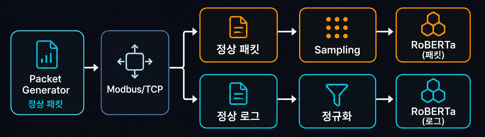

평소 패킷·로그로 RoBERTa를 각각 학습합니다. 전처리는 채널마다 다릅니다.

### 샘플링 — 학습 데이터에서 **패턴이 골고루** 들어가도록 구성하는 단계입니다.

빈칸 맞히기 학습(MLM)은 **자주 보는 패턴에만 익숙해지기** 쉽습니다. Modbus 트래픽처럼 특정 명령 코드·길이 조합이 압도적으로 많으면, 희귀하지만 **정상인 패턴**을 이상으로 오인할 수 있습니다. 그래서 학습 전에 **어떤 패턴을 얼마나 넣을지**를 조절합니다.

- **Basic** — 수집된 데이터 **전체**를 있는 그대로 씁니다. (원본 비율 유지)
- **OverSampling** — 부족한 희귀 패턴을 **복제**해서, 패턴별 개수를 맞춥니다.
- **Balance** — 여러 패턴을 **골고루 골라** 비율을 균등하게 맞춥니다.

실험에서는 **Balance**가 가장 좋았습니다. 희귀 정상 패턴까지 골고루 학습되니, 한쪽에만 치우치는 일이 줄고 이상 탐지가 안정됐습니다.

### 정규화 — 타임스탬프·세션 ID처럼 **매번 바뀌는 값**을 `<TIME>`, `<SESSION>` 등으로 치환해, 로그의 **무슨 일이 일어났는지**만 남기는 단계입니다.

정규화가 왜 필요한지는 **아래 §2**에서 자세히 설명합니다.

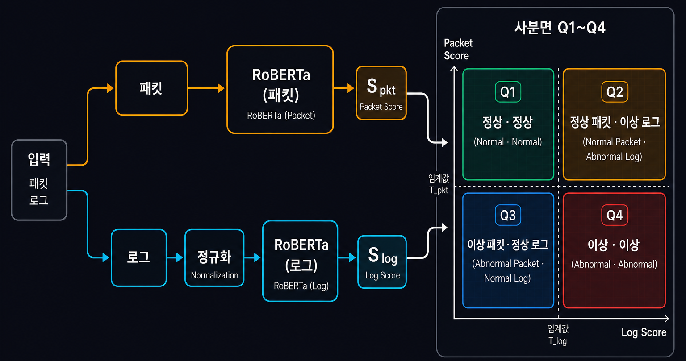

추론 때는 두 채널의 이상 점수를 **네 칸 지도(Q1~Q4)** 에 올려 탐지와 원인 해석을 동시에 합니다.

---

### 형식을 미리 정의하지 않고 시작하기 — 통신 규격서를 사람이 안 짜고 간다

기존 산업 제어 이상 탐지는 보통 이렇게 갑니다. 통신 규격서를 분석하고 → 필드 의미를 사람이 정의하고 → 패킷을 읽는 코드와 규칙을 짜고 → 그 위에서 탐지합니다. 제조사마다 통신 방식이 다른 환경에서는 이 전처리 비용이 통째로 다시 듭니다.

**이 논문의 핵심 전제 중 하나가 “형식을 미리 정의하지 않고 시작”입니다.** Transaction ID가 몇 번째 바이트인지, 로그 한 줄이 어떤 이벤트 템플릿인지 **사람이 미리 정의하지 않습니다.** **원시 바이트**와 **원문 로그**를 그대로 모델에 넣고, 평소 데이터의 문맥 패턴만 학습합니다. 통신 방식이 바뀌어도 패킷을 읽는 코드를 새로 짤 필요 없이, **데이터만 바꿔 재학습**하는 쪽으로 갑니다.

이 전제 위에서 패킷 모델과 로그 모델은 **각각 따로** 학습하고, 추론 때 나온 이상 점수(`S_pkt`, `S_log`)만 **네 칸 지도**로 합칩니다.

전체 흐름은 네 단계로 나뉩니다.

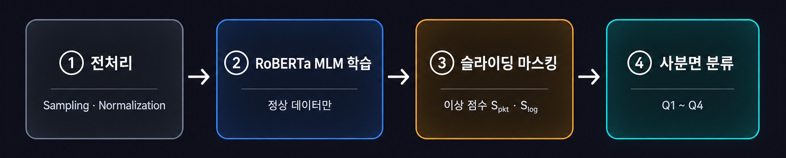

- **① 전처리** — 패킷은 **샘플링**, 로그는 **정규화**로 각 채널에 맞게 정리합니다.
- **② RoBERTa 빈칸 맞히기 학습** — **평소 데이터만**으로 패킷·로그 모델을 따로 학습해, “이 문맥에서 이 토큰이 자연스러운가”를 익힙니다.
- **③ 슬라이딩 마스킹** — 학습된 모델이 각 자리를 한 번씩 가려 보고, “평소와 얼마나 다른지” **점수**를 냅니다. 패킷·로그 각각 `S_pkt`, `S_log`가 됩니다.
- **④ 네 칸 분류** — 두 점수를 가로·세로 축에 올려 **Q1~Q4**로 나누고, 탐지와 **원인 해석**을 동시에 합니다.

> 💡 **쉽게 말하면**  
> 평소만 보고 “평소 문법”을 익힌 뒤, 새 입력이 그 문법에서 얼마나 벗어났는지 점수를 매깁니다. 패킷 점수와 로그 점수를 **가로·세로 축**에 올려, **어디가 이상한지**까지 같이 읽습니다.

## 2. 패킷과 로그를 왜 다르게 쪼개나

패킷이랑 로그는 둘 다 RoBERTa에 넣지만, **모델에 넣기 전에 쪼개는 방식이 달라야** 합니다. 같은 방식으로 쪼개면 한쪽이 망가집니다.

### 패킷: 1바이트 = 1토큰

Modbus 패킷은 **악보**에 가깝습니다. 중요한 건 7번째 칸에 `0x03`이 온다는 **자리**입니다. 그래서 `0x03`은 **바이트 하나 = 조각 하나**로 보는 게 맞고, 문자열처럼 `0`과 `3`을 글자로 쪼개거나 옆 바이트와 합치면 안 됩니다.

실제 정상 패킷 일부를 보면 이렇습니다.

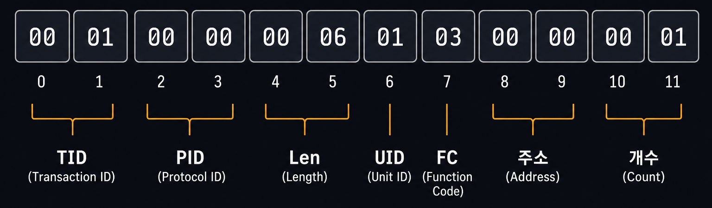

자연어 RoBERTa는 보통 **자주 나오는 조각끼리 묶는 방식(BPE)** 으로 문자열을 쪼갭니다. `"hello"` 안에서 `he` + `llo`처럼요.

그런데 위 패킷에 그 방식을 그대로 쓰면 이런 일이 납니다.

| 방식 | `00 03`이 어떻게 보이나 |
| --- | --- |
| 문자열처럼 조각 묶기 | `00`과 `3`이 붙어 `003` 같은 토큰이 될 수도 있음 → **몇 번째 바이트인지** 흐려짐 |
| 1바이트 = 1토큰 | 7번째 = `03`, 8번째 = `00` … **자리가 그대로 유지** |

Modbus/TCP에서 중요한 건 “단어”가 아니라 **몇 번째 바이트에 어떤 값이 오는가**입니다. 읽기/쓰기 명령 코드 한 바이트만 `0x03` → `0x10`으로 바뀌어도 공격이 될 수 있거든요.

그래서 `0x00`~`0xFF` 각 바이트를 **조각 하나**로 매핑하는 방식을 썼습니다.

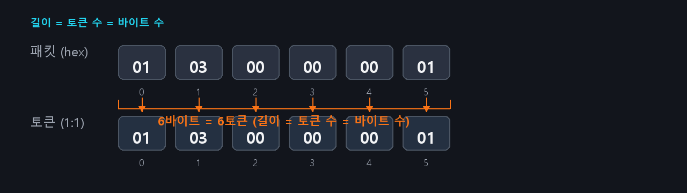

이렇게 하면 **길이 = 토큰 수 = 바이트 수**가 성립합니다. 통신 규격서를 사람이 짜 주지 않아도, 모델은 평소 데이터만 보며 “7번째 자리에는 보통 `03`이 온다” 같은 **위치·순서 패턴**을 스스로 익힙니다. (퍼징 논문에서도 같은 철학으로 1바이트=1토큰을 썼습니다.)

### 로그: 정규화 후 조각 묶기

로그는 패킷과 반대로 **텍스트**에 가깝습니다. `"Read register"`, `"Write coil"`처럼 **반복되는 문장 패턴**이 중요합니다.

문제는 **매번 바뀌는 값**입니다.

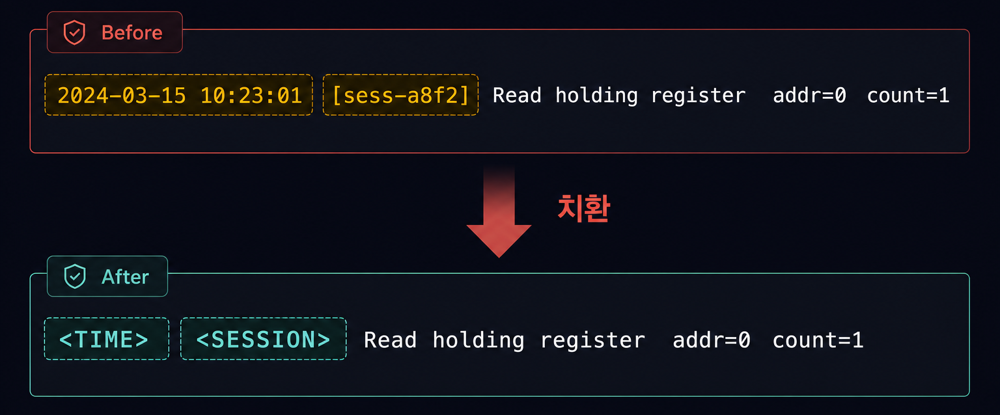

줄마다 시간·세션 ID만 다르고 **하는 일은 똑같은** 정상 로그입니다. 그런데 이걸 그대로 두면 모델 입장에선 “어? 매번 다른 토큰이네?” → **이상하다**고 착각합니다. 가짜 이상(오탐)이 폭발합니다.

그래서 **1단계: 정규화** — 바뀌는 값만 뽑아서 스페셜 토큰으로 치환합니다.

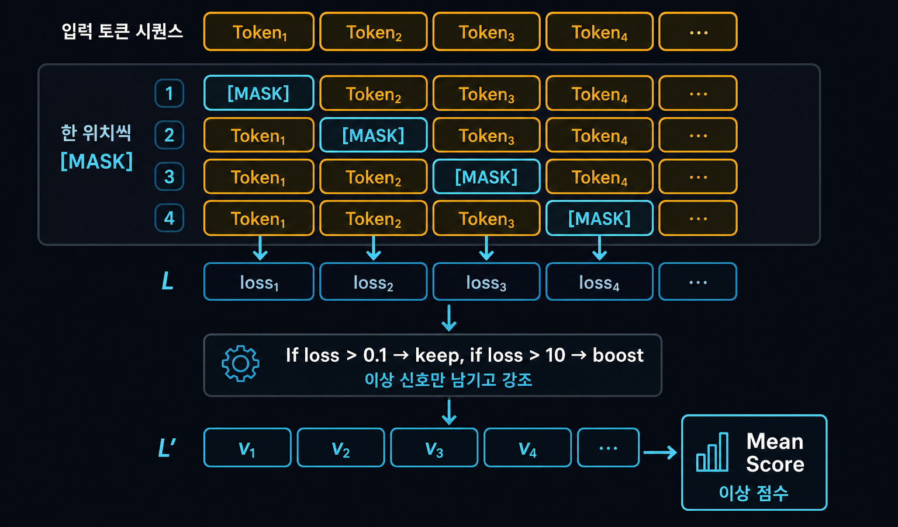

`<TIME>`, `<SESSION>`, IP·포트 등도 같은 방식으로 통일합니다. 이제 모델이 보는 건 **“무슨 일이 일어났는지”**이지, “몇 시 몇 분인지”가 아닙니다.

**2단계: 자주 나오는 조각끼리 묶기** — 정규화된 문장을 RoBERTa 방식으로 쪼갭니다. `"Read"` + `" holding"`처럼 자주 나오는 조각을 묶어서, **이벤트·동작·필드 조합** 같은 진짜 문맥만 남깁니다.

| | 패킷 | 로그 |
| --- | --- | --- |
| **데이터 성격** | 바이트 스트림, **위치**가 중요 | 텍스트, **문장 패턴**이 중요 |
| **쪼개는 방식** | 1바이트 = 1토큰 (경계 유지) | 정규화 → 조각 묶기 (노이즈 제거 후 패턴 학습) |
| **한 줄 요약** | “몇 번째 칸에 뭐가 오나” | “어떤 동작이 반복되나” |

패킷은 **자리를 지키는 게** 목표고, 로그는 **의미 없는 변동을 지우는 게** 목표입니다. 그래서 쪼개는 방식을 둘로 나눴습니다.

## 3. 정상 데이터만으로 배우는 RoBERTa 빈칸 맞히기

학습 데이터는 **정상 패킷과 정상 로그만**입니다. 공격 라벨이 없어도 됩니다.

RoBERTa-Base(12 layer, hidden 768)에 마스킹 비율 **30%**를 적용하고, 에포크마다 마스크 위치를 바꾸는 **동적 마스킹**으로 학습했습니다. 학습 때는 가려진 토큰을 맞히도록 하고, 추론 때는 반대로 생각합니다. **“이 문맥에서 이 토큰이 얼마나 자연스러운가?”** — 학습된 모델이 매긴 점수가 클수록 이상에 가깝다고 봅니다.

> 💡 **쉽게 말하면**  
> 정상 데이터만 수천 번 읽힌 모델에게 “이 바이트/이 로그 줄, 문맥상 맞아?”를 묻는 겁니다. 평소와 많이 다르면 점수가 커지고, 그걸 이상 신호로 씁니다.

## 4. 슬라이딩 마스킹 — 1바이트 변조도 놓치지 않기

추론 때는 시퀀스 **각 위치를 한 번씩** 가리고, 학습된 모델이 그 자리마다 “평소와 얼마나 다른지” 점수를 냅니다. 명령 코드 한 바이트만 바뀌어도 해당 자리 점수가 튀기 때문에, **국소 변조**를 잡을 수 있습니다.

대신 비용이 듭니다. 길이가 N이면 추론을 N번 해야 합니다. 공장 현장에 실시간으로 바로 얹기엔 부담이 있고, 이건 논문에서도 한계로 적어 두었습니다.

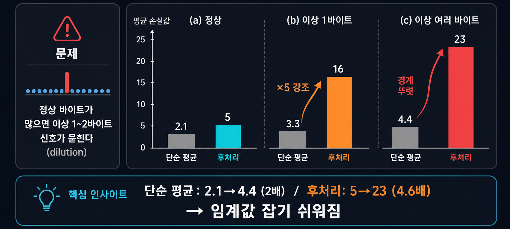

그림 흐름은 이렇게 읽으면 됩니다.

- **입력 시퀀스** — 패킷 바이트나 로그 토큰을 한 줄로 펼칩니다.
- **슬라이딩 [MASK]** — 각 위치를 **한 번씩** 가리고, 학습된 모델이 나머지 문맥만 보고 “이 자리가 평소와 맞는지” 점수를 냅니다.
- **위치별 점수 (L)** — “이 자리에 이 값이 얼마나 자연스러운가”를 위치마다 점수로 냅니다.
- **후처리** — 점수가 **0.1 이하**면 정상으로 보고 빼고, **10 초과**면 이상 신호로 **키웁니다**. (§5에서 자세히)
- **Mean Score** — 남은 점수를 합쳐 패킷·로그 각각의 **이상 점수** `S_pkt`, `S_log`를 만듭니다.

## 5. 점수 후처리 — 이 논문에서 가장 고민한 부분

여기가 성능 차이를 만든 핵심입니다.

### 문제: 단순 평균이면 이상 신호가 묻힌다

슬라이딩 마스킹으로 위치마다 점수를 모으면, **대부분의 바이트는 “정상”**이라 점수가 0에 가깝습니다. 그런데 **딱 1~2바이트만** 이상이면 어떻게 될까요?

**비유:** 100명 중 98명이 “괜찮아요”(점수 ≈ 0)라고 하고, 2명만 “이상해요!”(점수 큼)라고 외쳐도, **전체 평균**을 내면 “그냥 다들 괜찮네?” 수준이 됩니다. 이상 신호가 정상 바이트에 **희석**되는 겁니다. 그래서 단순 평균만으로는 임계값을 어디에 둬야 할지 애매합니다.

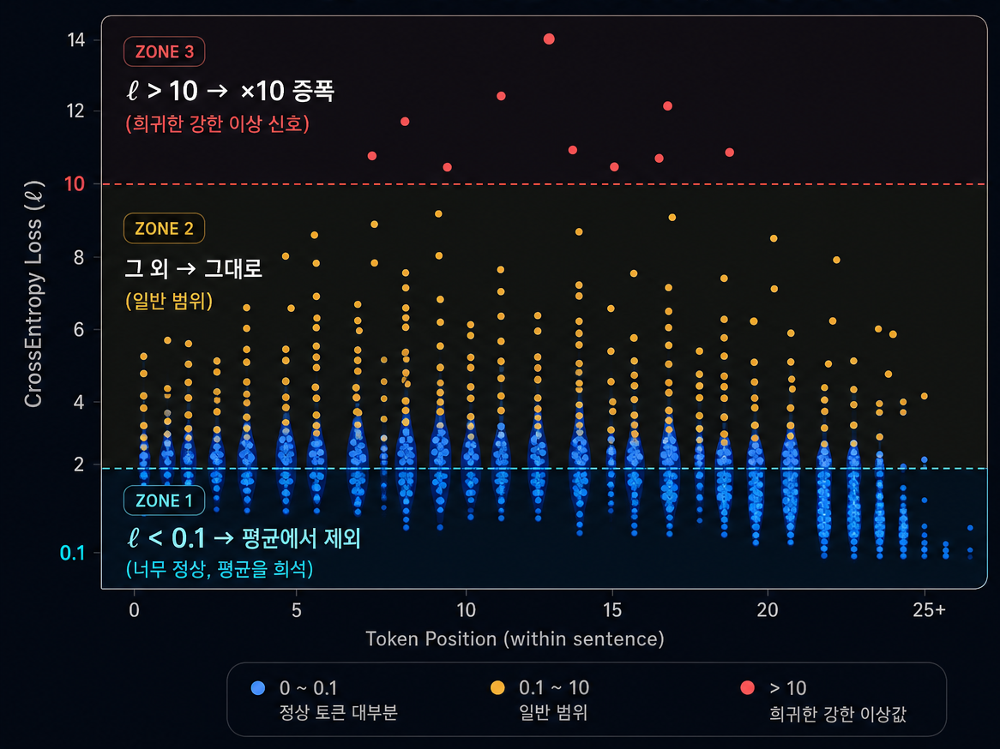

그림처럼 **(a) 정상**은 단순 평균 2.1 → 후처리 5, **(b) 이상 1바이트**는 3.3 → **16**, **(c) 이상 여러 바이트**는 4.4 → **23**입니다. 단순 평균은 2.1에서 4.4로 **겨우 2배**밖에 차이가 안 나는데, 후처리 후에는 5에서 23으로 **경계가 뚜렷**해집니다.

### 해결: “너무 정상”은 빼고, “확실히 이상”은 키운다

위치별 점수마다 아래 규칙을 적용한 뒤, 남은 값만 평균냅니다.

1. **점수 < 0.1** → 평균에서 **뺀다**. “너무 정상”이라 오히려 평균을 끌어내리는 자리입니다.
2. **점수 > 10** → **점수 × 10**으로 **키운다**. 드물게 크게 튀는 값 = 강한 이상 신호입니다.
3. **그 외** → 그대로 씁니다.

**10을 기준으로 삼은 이유**도 그림에 나옵니다. RoBERTa-base와 산업 제어용 정상 모델 모두에서 자리별 점수는 **0~5에 몰리고**, 10을 넘는 값은 **매우 드뭅니다.** 그래서 10을 넘으면 “평소 분포 밖의 강한 신호”로 보고 키우는 겁니다.

> 💡 **쉽게 말하면**  
> 평균을 낼 때 **잡음(너무 정상인 토큰)은 빼고**, **진짜 수상한 토큰만 크게 반영**해서, 정상과 이상 점수가 확 벌어지게 만든 겁니다.

## 6. 네 칸 지도 — 탐지에서 해석으로

패킷 이상 점수 `S_pkt`와 로그 이상 점수 `S_log`를 각각 임계값과 비교해 정상/이상으로 나눕니다. 두 판단을 조합하면 네 가지 경우가 나옵니다.

| 칸 | 패킷 | 로그 | 실무에서 읽는 법 |
| :---: | :---: | :---: | --- |
| **Q1** | 정상 | 정상 | 기준선 — 둘 다 평소와 비슷 |
| **Q2** | 정상 | **이상** | 패킷 형식은 OK, **앱/제어 로직에서 예외** |
| **Q3** | **이상** | 정상 | **네트워크는 수상**, 로그는 조용 (스캔·회피) |
| **Q4** | **이상** | **이상** | 양쪽 다 이상 → **즉시 대응** |

기존 침입 탐지가 “침입!” 한 마디만 외친다면, 이건 **어디가 이상한지 지도**를 같이 주는 셈입니다. Q2면 애플리케이션 로그부터, Q3면 네트워크 규칙·패킷 형식부터 보면 됩니다.

# 실험. 데이터셋을 어떻게 만들었나

## 1. 패킷 데이터

**CICModbusDataset2023**의 정상 시나리오에서 상위 제어 쪽(`185.175.0.3`)과 현장 장비 쪽(`185.175.0.5`) 사이 요청·응답 패킷을 추출해 사용했습니다.

## 2. 로그 데이터 — 직접 구축한 이유

CIC 데이터셋에는 **맞춰 둔 서버 로그가 없습니다.** 패킷과 로그를 같이 평가하려면 **시점·내용이 맞는 쌍**이 필요한데, 공개 데이터만으로는 불가능했습니다.

그래서 다음 과정으로 로그를 직접 만들었습니다.

1. Docker에 `pymodbus`와 커스텀 응답 서버 구성
2. 정상 요청 패킷을 **다시 보내기(Replay)**
3. 요청–응답 단위로 **디버그 로그 수집**

패킷만 가지고 논문을 끝낼 수도 있었지만, “패킷+로그를 같이 본다”가 이 연구의 핵심이었기 때문에 이 작업은 필수였습니다.

## 3. 테스트 데이터와 공격 시나리오

테스트셋은 정상 시퀀스에 **CICModbusDataset2023에 포함된 공격 패킷**을 골라 **간헐적으로 삽입**하는 방식으로 구성했습니다. **같은 공격을 대량으로 반복하는 유형은 제외**했습니다. “얼마나 많이 왔나”는 단순 통계로도 잡히지만, 본 연구가 보고 싶었던 건 **내용·구조 이상**이었기 때문입니다.

데이터셋에서 사용한 공격 유형은 다섯 가지입니다.

- Payload Injection — 본문에 이상한 값을 넣는 공격
- Length Manipulation — 길이를 조작하는 공격
- Stacked Modbus Frames — 프레임을 겹쳐 넣는 공격
- **False Data Injection Attack (FDIA)** — 형식은 정상인데 **값만 조작**하는 공격
- Reconnaissance — 정찰성 트래픽

# 결과. 가짜 값 공격이 Q2에 모인 이유

## 1. 네 칸 실험 — 이 논문의 진짜 메시지

이 논문에서 **네 칸 지도 실험**이 핵심 메시지라고 봅니다. “이상이다”에서 끝나지 않고, **패킷 쪽인지 로그 쪽인지**를 같이 보여 주는지가 이 연구의 차별점입니다.

  <figure class="article-figure-row__item">
    <figcaption class="article-figure-row__caption">요청(Request) 구간</figcaption>
    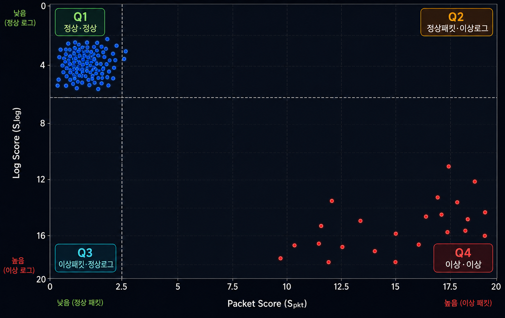
  </figure>
  <figure class="article-figure-row__item">
    <figcaption class="article-figure-row__caption">응답(Response) 구간 — 가짜 값 공격이 Q2에 몰린다</figcaption>
    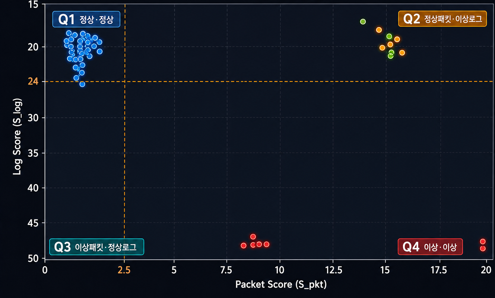
  </figure>

**요청** — 요청 구간에서는 샘플이 주로 **Q1(정상)** 과 **Q4(양쪽 이상)** 에 모입니다. **Q2·Q3는 비어 있습니다.** 요청 단계에서는 패킷과 로그가 **같은 방향으로 판단**되는 경우가 많았습니다.

**응답** — 응답 구간에서는 이야기가 달라집니다. **Q2(패킷 정상 · 로그 이상)** 에 샘플이 많이 몰렸고, 해당 샘플은 **전부 가짜 값 공격(FDIA)** 이었습니다.

가짜 값 공격은 **응답 패킷의 형식 자체는 정상**입니다. 명령 코드, 길이, 필드 배치는 Modbus 규격대로라 **패킷 모델** 입장에선 “문법상 자연스럽다”고 통과시킬 수 있습니다.

문제는 **값** 쪽입니다. 이번 실험 환경의 서버(현장 장비/게이트웨이)에는 **허용 범위를 벗어난 값을 미리 걸러 주는 검증·제한 로직이 없었습니다.** 그래서 물리적으로 말이 안 되는 제어 변수 값이 들어와도, 네트워크 패킷으로는 그냥 “정상 응답”처럼 보입니다.

대신 **제어 애플리케이션**이 그 값을 처리하려다 평소와 다른 동작을 합니다. 범위 밖 값을 받아들이거나, 예외 처리를 시도하거나, 비정상 상태를 기록하는 식으로 **평소엔 안 보이던 처리 흔적**이 남습니다. **로그 모델**은 바로 이 “평소엔 안 보이던 처리 흔적”을 이상으로 포착합니다. 패킷은 정상인데 로그만 튀니까 **Q2**에 모이는 겁니다.

**패킷만 보면 놓칠 수 있는 공격**을, 로그 채널과 네 칸 지도가 잡아 냅니다. 반대로 Q3는 “네트워크는 수상한데 로그는 조용한” 케이스인데, 이번 데이터셋에서는 관찰되지 않았습니다. 설계상으로는 패킷·로그가 **서로의 사각을 보완**하는 구조입니다.

> 💡 **쉽게 말하면**  
> 가짜 값 공격은 **겉보기 멀쩡한 응답**에 **이상한 값**만 심습니다. 패킷 검사만으로는 통과할 수 있고, **로그에 남는 평소와 다른 처리 흔적**을 같이 봐야 잡힙니다. 그게 Q2입니다.

# 마치며

## 한계

남는 과제도 있습니다.

**연산 비용** — 슬라이딩 마스킹은 시퀀스 길이에 비례해 추론 횟수가 늘어납니다. 공장 현장에 실시간으로 바로 얹기엔 부담이 있고, 경량화나 샘플링 추론 같은 후속 연구가 필요합니다.

**데이터 의존성** — “평소만 학습”은 현실적이지만, 학습 데이터가 그 현장의 평소 분포를 충분히 대표하지 못하면 오탐이 납니다. Balance 샘플링으로 완화했지만, 다른 현장으로 옮기는 검증은 별도로 필요합니다.

**범위** — 실험은 Modbus/TCP에 집중되어 있습니다. IEC-104, DNP3 등 다른 산업용 통신으로의 확장, 그리고 네 칸 지도가 “어느 토큰이 왜 이상인지”까지 가는 **설명 가능성 강화**는 다음 단계입니다.

## 이 논문이 남기는 것

처음 질문으로 돌아가 보면, 이 연구가 하려던 일은 단순했습니다.

> 통신 규격서 없이, 공격 라벨 없이, **평소만으로** 이상을 잡을 수 있을까?  
> 그리고 그 이상이 **네트워크 쪽인지, 시스템 쪽인지** 구분할 수 있을까?

**RoBERTa Quadrant Mapping**은 이 두 질문에 동시에 답하려는 프레임워크입니다. 형식 정의·룰 유지비를 줄이고, 패킷·로그를 **각각의 언어**로 학습한 뒤, 네 칸 지도로 **해석까지** 이어 줍니다.

기술적으로 기억할 만한 지점은 세 가지입니다.

- **쪼개는 방식을 둘로** — 패킷은 1바이트=1토큰, 로그는 정규화 후 조각 묶기. 같은 RoBERTa라도 **넣는 방식**이 달라야 합니다.
- **점수 후처리** — “너무 정상”은 빼고 “확실히 이상”은 키워, **1바이트 변조**도 묻히지 않게 했습니다.
- **네 칸 지도** — `S_pkt`와 `S_log`를 가로·세로에 놓아, 탐지와 **원인 해석**을 한 번에 합니다.

하지만 논문을 읽고 나서 현장에 가져갈 메시지는 숫자보다 **가짜 값 공격과 Q2** 쪽에 더 가깝습니다.

응답 패킷은 멀쩡해 보이는데, 서버에 범위 검증이 없으면 말이 안 되는 값도 그냥 처리되고, **평소와 다른 로그**만 남습니다. 패킷 모델만 쓰면 통과시킬 수 있는 시나리오를, 로그 채널이 받쳐 주고 네 칸 지도가 **“패킷은 정상, 로그가 이상”**이라고 짚어 줍니다. 요청에서는 Q1·Q4로 양분되고, 응답에서 Q2가 드러나는 것 — 이게 **패킷과 로그를 왜 같이 봐야 하는지**를 가장 직관적으로 보여 줍니다.

## 정리

복잡한 형식 정의나 수작업 룰 없이, **평소 데이터의 평소 패턴**을 학습해서 이상을 잡으려 한 연구입니다. 패킷과 로그에 각각 적용했고, 요청·응답 양쪽에서 이상이 어디에 드러나는지 같이 보려는 게 핵심이었습니다. 여기서 정리한 “형식을 미리 정의하지 않고 시작”하는 RoBERTa 설계는, 동일 모델을 바탕으로 프로토콜 퍼징 연구로도 확장하고 있습니다.

---

<table class="article-ref-table">
  <thead>
    <tr>
      <th>논문</th>
      <th>데이터셋</th>
    </tr>
  </thead>
  <tbody>
    <tr>
      <td><a href="https://doi.org/10.6109/jkiice.2026.30.1.141">DOI 10.6109/jkiice.2026.30.1.141</a></td>
      <td><a href="https://www.unb.ca/cic/datasets/modbus-2023.html">CICModbusDataset2023</a></td>
    </tr>
  </tbody>
</table>
