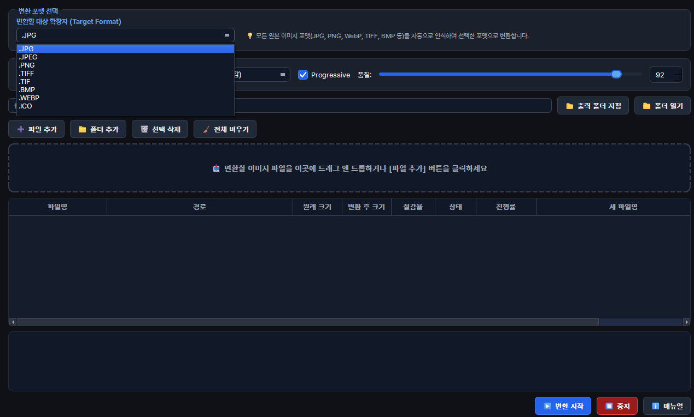

---

# 서론

웹 퍼블리싱이나 프로젝트 개발 시 다양한 포맷의 이미지를 변환해야 하는 경우가 많습니다. 웹 변환 사이트는 대량 파일 업로드 제한이나 개인정보 유출 우려가 있고, 포토샵 같은 대형 툴은 실행 자체가 무겁습니다.

**Image Converter**는 PySide6와 Pillow 라이브러리를 기반으로 제작된 **다중 포맷 일괄 이미지 변환 및 압축 최적화 데스크톱 유틸리티**입니다. 드래그 앤 드롭으로 수십/수백 장의 이미지를 추가하여 JPG, PNG, WEBP, TIFF, BMP, ICO 포맷으로 고속 변환하며, 포맷별 세부 인코딩 옵션을 정밀하게 제어할 수 있습니다.

<figure class="article-figure-center article-figure-center--wide">
  
</figure>

📦 **GitHub:** [MINI_ImageConverter](https://github.com/Hyeonseok93/MINI_ImageConverter)

# 1. 왜 만들었나

* **안전하고 빠른 로컬 일괄 변환:** 외부 서버 업로드 없이 로컬 PC에서 즉시 대량의 이미지를 변환하고 싶었습니다.
* **포맷별 정밀 인코딩 제어:** 단순 확장자 변경이 아니라 JPEG 크로마 서브샘플링, WEBP 탐색 깊이, ICO 멀티 레이어 세트 등 전문적인 압축 파라미터를 직접 다루고자 했습니다.
* **UI 프리징 없는 쾌적한 작업:** 수백 장의 대용량 이미지를 변환할 때 프로그램이 멈추거나 튕기지 않고 실시간 진행 상황을 확인하고 싶었습니다.

# 2. 구조 및 아키텍처

UI 렌더링 스레드와 무거운 이미지 인코딩 백그라운드 스레드를 명확히 분리하여 설계했습니다.

```text
MINI_ImageConverter/
┣━━ 📄 ImageConverterApp.py    # 프로그램 진입점 및 기본 설정 초기화
┣━━ 📄 ImageConverterCore.py   # Pillow 기반 포맷 변환 엔진 & 인코딩 옵션 처리
┣━━ 📄 ImageConverterUi.py     # PySide6 메인 UI, ConvertWorker (QThread), 커스텀 테이블 뷰
┗━━ 📄 build.bat               # PyInstaller 단일 .exe 자동 빌드 파이프라인
```

# 3. 핵심 구현 디테일

### ① 포맷별 정밀 인코딩 옵션 엔진

단순 확장자 바꾸기가 아니라, Pillow 저장 인자를 UI와 맞춰 두었습니다. 옵션 모델은 `SaveOptions`이고, 실제 저장은 `convert_file()` / `EXT_TO_PILFMT`가 담당합니다. 대상 포맷을 고르면 `dst_combo` → `_on_dst_changed()` → `opts_stack`(`PAGE_INDEX`)로 **그 포맷 전용 패널**만 보입니다. BMP는 조절 항목이 없어 옵션 그룹을 숨깁니다.

* **JPEG:** 품질 **1~100**(기본 92), 크로마 서브샘플링 `4:2:0` / `4:2:2` / `4:4:4`, Progressive 플래그. EXIF·ICC 유지 체크와 별도로, 코어에서는 `optimize=True`를 항상 켭니다. 알파가 있으면 `flatten_to_rgb`(흰 배경)로 맞춘 뒤 저장합니다.
* **PNG:** zlib 압축 **0~9**(기본 6), Palette Optimize(기본 ON), EXIF·ICC 유지.
* **WEBP:** 손실/무손실 전환(무손실이면 품질 위젯 비활성), 품질 **1~100**(기본 90), Method(탐색 깊이) **0~6**(기본 4).
* **TIFF:** 압축 `tiff_deflate` / `tiff_lzw` / `packbits` / `raw`(기본 deflate), EXIF·ICC 유지.
* **ICO:** `"set"` 모드면 256→16px 멀티 레이어 세트(`ICO_SET_SIZES_DESC`, 정사각·투명 패딩 `pad_to_square_rgba`), `"original"`이면 한 장(최대 256) + 필요 시 `_save_single_ico_with_fallback`.

메타 체크박스는 `_sync_meta_checkboxes()`로 포맷이 바뀌어도 `opt_keep_exif` / `opt_keep_icc` 읽기 경로가 같게 맞춰져 있습니다.

### ② `QThread` 기반 비동기 일괄 변환 파이프라인

대량·고해상도 변환이 UI를 멈추지 않도록, 인코딩은 백그라운드로 빼 두었습니다.

* `ConvertWorker(QThread)`가 `Core.convert_file(..., progress_cb, cancelled, options=...)`를 돌립니다. 시그널은 `progress_signal` · `finished_signal` · `error_signal`이고, `cancel()`로 `_cancelled`를 올립니다.
* 진행률 메시지는 대략 **열기(5%) → 전처리(30%) → 저장(60%, ICO는 세트/단장 문구) → 완료(100%)** 순입니다.
* 배치는 `_on_start()`에서 `SaveOptions`를 한 번 만든 뒤 **`_run_next_row()`로 순차** 실행합니다. 워커는 한 번에 하나라, 끝날 때마다 다음 행으로 넘어갑니다(병렬 아님).
* 이미 `완료`인 행은 건너뛰고, `대기` / `오류` / `취소됨` / `진행중`만 다시 돌릴 수 있습니다. 중지는 `_on_stop()` → `stop_requested` + `worker.cancel()` → 상태 `취소됨`.

# 4. UI/UX 및 편의 기능

목록·진행·출력 경로까지, 일괄 작업에 맞춰 두었습니다.

* **드래그 앤 드롭:** `setAcceptDrops(True)`. 탐색기에서 파일/폴더를 올리면 `_add_paths()`로 들어갑니다. 변환 중에는 드롭·추가·삭제를 `_guard_not_converting`으로 막습니다. 드롭 존(`#dropZone`)은 드래그 중 하이라이트됩니다.
* **확장자 필터:** `SUPPORTED_EXTS`(jpg/jpeg/png/tiff/tif/bmp/webp/ico)만 남깁니다. 폴더 추가는 `os.walk` 후 같은 필터입니다. 미지원·중복·잘못된 경로는 로그에 남깁니다.
* **행 상태:** 영어 뱃지가 아니라 테이블 상태 열에 **`대기` → `진행중` / `진행중: {msg}` → `완료` | `오류` | `취소됨`** 으로 표시합니다. 진행률 열에는 `QProgressBar`가 붙습니다.
* **출력 경로:** 비우면 원본 옆에 저장하고, 지정하면 그 폴더로 갑니다. 이름 충돌 시 덮어쓰지 않고 `ensure_unique_path()`로 `name (1).ext`처럼 피합니다. 변환 후 용량·절감율은 `human_size` / `calc_savings`로 표에 갱신됩니다.
* **기타:** 출력 폴더 열기, 다크 Fusion + Pretendard, 경로 말줄임 델리게이트, 하단 로그, 단일 인스턴스 락(`ImageConverterApp`).
