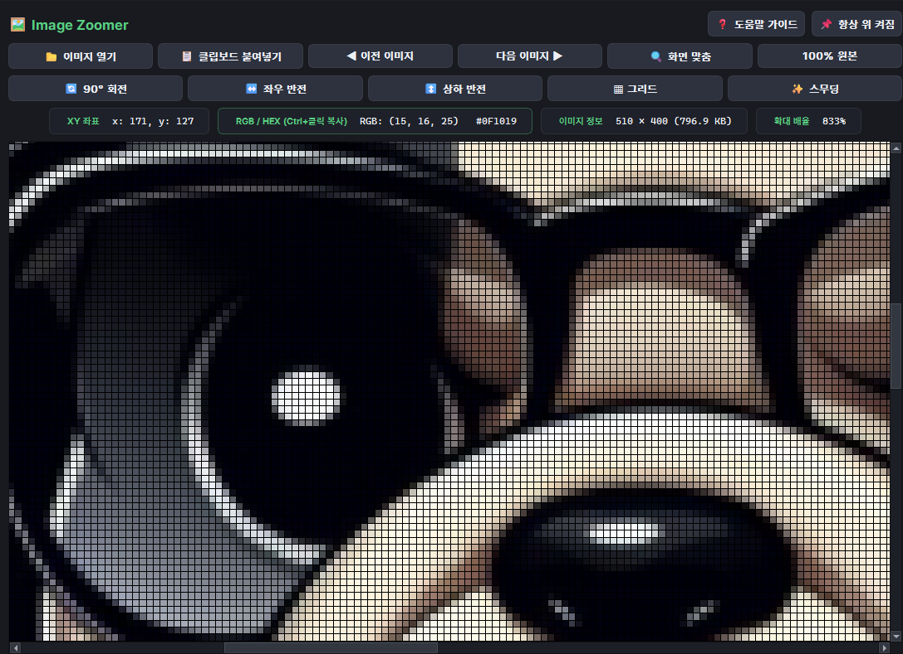

---

# 서론

픽셀 아트, UI 스프라이트, 고해상도 그래픽 에셋을 검수할 때 기본 이미지 뷰어는 확대를 하면 픽셀 경계가 뭉개지거나(Bilinear Smoothing) 1px 단위의 정확한 격자를 파악하기 어렵습니다. 게다가 대부분의 사진 앱은 **확대 상한**이 정해져 있어서, “한 픽셀만 더 크게”가 필요할 때 벽에 막힙니다.

사실 이 툴은 [Color Picker](https://github.com/Hyeonseok93/MINI_ColorPicker)랑 **세트로** 만들었습니다. 화면 어디든 찍는 피커와, 파일·클립보드 이미지를 끝까지 확대해서 보는 뷰어. 피커 쪽에 돋보기(Magnifier)를 붙이고 나서는 “굳이 둘 다?”라는 생각도 들지만, 돋보기는 **커서 주변의 작은 ROI**이고 Zoomer는 **이미지 전체를 끝없이(사실상 102400%까지) 확대**하는 쪽입니다. 픽셀 한 칸의 경계를 화면 가득 채워야 할 때는 여전히 이쪽이 필요합니다.

**Image Zoomer**는 PySide6 `QGraphicsView` 기반의 **픽셀 정밀 뷰어**입니다. Nearest(선명) / Smooth 토글, 자동·강제 격자, 회전·반전(표시만), 좌표·색 추출, 폴더 순회와 클립보드 붙여넣기를 한 창에 모았습니다.

<figure class="article-figure-center article-figure-center--wide">
  
</figure>

📦 **GitHub:** [MINI_ImageZoomer](https://github.com/Hyeonseok93/MINI_ImageZoomer)

# 1. 왜 만들었나

* **도트가 뭉개지지 않는 확대:** 기본 뷰어의 부드러운 보간 대신, 고배율에서도 픽셀이 각진 그대로 보이게.
* **1px 격자 확인:** 인접 픽셀 경계가 어디인지 눈으로 바로 잡기.
* **편집기 없이 빠른 변환 확인:** 포토샵을 열지 않고 `R` / `H` / `V`로 회전·반전만 잠깐 보고 싶을 때.
* **클립보드·폴더 순회:** 캡처 `Ctrl+V`로 바로 띄우고, `←`/`→`로 같은 폴더 이미지를 넘기며 검수.

# 2. 구조 및 아키텍처

```text
ImageZoomer/
┣━━ 📄 ImageZoomerApp.py     # 진입점, Pretendard, 단일 인스턴스 락
┣━━ 📄 ImageZoomerCore.py    # ImageModel, ZoomController, 폴더 인접 파일
┣━━ 📄 ImageZoomerUi.py      # PixelView(줌/팬/격자) + 2줄 툴바
┗━━ 📄 build.bat             # PyInstaller 단일 .exe
```

* `ImageModel` — 파일·클립보드 로드, `pixel_color` / `hex_color`, 동일 폴더 이미지 목록·인접 경로(순환).
* `ZoomController` — 배율 clamp·퍼센트 표시·스텝 배율.
* `PixelView` — `QGraphicsView` 위 휠 줌, 드래그 팬, foreground 격자, 표시용 회전·반전.

# 3. 핵심 구현 디테일

### ① Nearest vs Smooth — Qt 변환 모드 토글
기본은 **선명(Nearest에 해당하는 `FastTransformation`)**. `S` 또는 `✨ 스무딩`을 켜면 `SmoothTransformation` + `SmoothPixmapTransform`으로 전환합니다.

* **선명(기본):** 픽셀 경계가 칼같이 유지 → 픽셀 아트·스프라이트 검수
* **스무딩:** 사진·고해상도 감상에 가까운 보간

API 이름은 Qt의 `Fast` / `Smooth`이고, UI 라벨은 “스무딩”입니다. “NearestNeighbor”라는 별도 클래스는 없습니다.

### ② 격자(Grid) — 자동 ≥8×, 강제 `G`
`PixelView.drawForeground`에서 정수 픽셀 경계에 1px cosmetic 선을 그립니다.

* **자동:** 디바이스 기준 1이미지픽셀이 **8px 이상**일 때 (`grid_threshold_device_px`)
* **강제:** `G` / `▦ 그리드` → `always_show_grid`
* 보이는 영역이 너무 크면(대략 `vis.width()*px > 12000` 등) 성능을 위해 그리기를 건너뜁니다.

“항상 격자”가 아니라 **고배율에서만 보이게** 한 게 포인트입니다.

### ③ 줌 — 사실상 “끝없이”, 상한은 102400%
`ZoomController`는 `min_scale=0.05`(5%) ~ `max_scale=1024`(**= 102400%**)로 clamp합니다. OS 사진 앱의 “최대 확대”보다 훨씬 넉넉해서, 체감상 끝을 잘 못 느끼는 수준입니다.

* 휠: 커서 아래 고정(`AnchorUnderMouse`), 기본 스텝 `1.15`
* 수정키로 휠 감도 변경 — Ctrl `1.40` / Shift `1.25` / Alt `1.07`
* `+`/`-`, `1`(100%), `0`(맞춤), 더블클릭으로 100%↔맞춤 토글

### ④ 회전·반전은 **표시용** `QTransform`
`R`(90° CW), `H`(좌우), `V`(상하)는 `QImage` 픽셀을 다시 쓰지 않고 뷰 변환만 바꿉니다. 뷰포트 중앙의 씬 좌표를 유지한 채 적용하고, **새 파일을 열면 `reset_transforms()`**로 초기화됩니다. “저장용 편집기”가 아니라 “검수용 미리보기”라는 전제입니다.

### ⑤ 커서 좌표·색 + 복사
호버 시 `ImageModel.pixel_color` → 상태줄 `XY` / `RGB` / `#RRGGBB`(대문자).

* **Ctrl+좌클릭** — 즉시 클립보드 + 토스트 (`RGB(r,g,b) #RRGGBB`)
* **Ctrl+C** / RGB 박스 클릭 — **마지막으로 호버한** 색 복사 (이미지 위를 한 번이라도 지나야 함)

# 4. UI/UX 및 편의 기능

### 단축키·툴바
| 동작 | 키 / UI |
|------|---------|
| 90° 회전 / 좌우·상하 반전 | `R` / `H` / `V` |
| 격자 / 스무딩 | `G` / `S` |
| 줌 ± · 100% · 맞춤 | `+`/`-` · `1` · `0` |
| 폴더 이전·다음 | `←`/`→` (목록 **순환**) |
| 클립보드 이미지 | `Ctrl+V` / `📋 클립보드 붙여넣기` |
| 항상 위 | 핀 버튼 (**기본 ON**) |
| 도움말 | `F1` 또는 `?` |

### 그 밖의 디테일
* **드래그 앤 드롭**으로 파일 열기
* **단일 인스턴스** 뮤텍스 — 두 번째 실행 시 기존 창으로 포커스
* 폴더 순회는 현재 파일과 **같은 디렉터리**의 이미지 확장자만, 인덱스를 `%`로 wrap
* Color Picker의 돋보기가 “지금 커서 주변”이라면, Zoomer는 “파일·캡처 전체를 **최대 배율까지** 펼쳐 보는” 역할 — 세트로 둘 때 겹치면서도 겹치지 않는 지점입니다.
