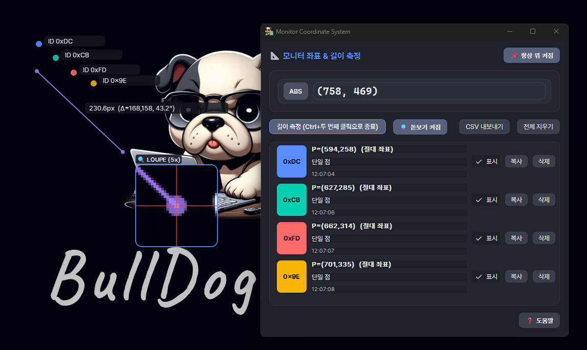

---

# 서론

멀티 모니터 환경에서 프론트엔드 UI를 정렬하거나, 자동화 매크로 스크립트를 작성할 때 화면 위 두 지점 사이의 정확한 픽셀 거리, 각도, 절대 좌표를 확인해야 하는 순간이 자주 발생합니다.

**Monitor Coordinate System**은 PySide6와 Win32 API(`ctypes`)를 기반으로 제작된 **모니터 절대 좌표계 및 기하 거리·각도 측정 데스크톱 유틸리티**입니다. 멀티 모니터 전체 영역에 걸친 음수 가상 좌표계를 지원하며, 5배 돋보기와 `Shift` 스냅 기능으로 1px 오차 없는 정밀 측정을 제공합니다.

<figure class="article-figure-center article-figure-center--wide">
  
</figure>

📦 **GitHub:** [MINI_MonitorCoordinateSystem](https://github.com/Hyeonseok93/MINI_MonitorCoordinateSystem)

# 1. 왜 만들었나

* **멀티 모니터 가상 스크린 좌표 파악:** 주 모니터의 좌측이나 상단에 위치한 보조 모니터는 음수 좌표계(`-X`, `-Y`)를 가집니다. 이를 직관적으로 측정하고 계산할 수 있는 도구가 필요했습니다.
* **픽셀 거리와 각도 동시 측정:** 두 점을 클릭하여 유클리드 픽셀 거리(`px`), $\Delta X/\Delta Y$, 기울기 각도($0^\circ \sim 360^\circ$)를 한눈에 확인하고 싶었습니다.
* **수평/수직/45도 정밀 스냅:** 자(Ruler)처럼 정확한 직선 및 대각선 거리를 잴 수 있는 스냅 가이드가 필요했습니다.

# 2. 구조 및 아키텍처

```text
MonitorCoordinateSystem/
┣━━ 📄 MonitorCoordinateSystemApp.py    # 진입점, Pretendard, pynput 전역 훅, 단일 인스턴스
┣━━ 📄 MonitorCoordinateSystemCore.py   # Win32 가상 스크린·캡처·거리/각도
┣━━ 📄 MonitorCoordinateSystemUi.py     # MainWindow + MeasureOverlay(클릭스루 오버레이)
┗━━ 📄 build.bat                        # PyInstaller 단일 .exe
```

* `App` — `pynput` 마우스/키보드 리스너, Ctrl 상태, 측정 암(arm)
* `Core` — `GetSystemMetrics` 가상 데스크탑, `GetCursorPos`, GDI 캡처, `distance_px` / `angle_deg`
* `MeasureOverlay` — 가상 스크린 크기 투명 창, 선·점·돋보기 그리기 (입력은 받지 않음)

# 3. 핵심 구현 디테일

### ① Win32 Virtual Screen — 음수 좌표가 “정상”
모니터별 API를 돌지 않고, Windows **가상 데스크탑** 한 장을 씁니다.

* `get_virtual_screen_rect()` → `SM_XVIRTUALSCREEN` / `Y` / `CX` / `CY`
* 주 모니터 좌상단이 `(0, 0)`. 왼쪽·위쪽 모니터는 **음수** origin
* 커서·클릭은 `GetCursorPos` / `pynput` — 둘 다 이 가상 좌표계와 맞춤
* 오버레이는 `_sync_virtual_geometry()`로 그 전체 rect를 덮음

“절대 좌표는 항상 ≥0”이라는 가정은 여기서 **깨집니다**. 좌측 모니터 `-1200` 같은 값이 나와야 매크로·UI 정렬이 맞습니다.

### ② DPI — Qt HiDPI 끄고 Win32로 창을 박음
`QApplication` 전에 `QT_ENABLE_HIGHDPI_SCALING=0`, `QT_AUTO_SCREEN_SCALE_FACTOR=0`으로 **1 Qt 단위 ≈ 1 물리 px**을 노립니다. 오버레이 위치는 Qt `move`만 믿지 않고 `SetWindowPos` + `HWND_TOPMOST`(`set_native_window_rect`)로 다시 고정합니다. 로컬 좌표 변환도 `GetWindowRect` origin을 우선합니다 (`_overlay_origin` → `_to_local`).

HiDPI를 켜 두면 Qt 논리 좌표와 Win32 물리 좌표가 어긋나서 선·돋보기가 커서에서 빗나갑니다.

### ③ 기하 — 거리, 각도, Shift 스냅
시작 $(x_1,y_1)$ · 끝 $(x_2,y_2)$:

* **거리:** $d = \sqrt{\Delta x^2 + \Delta y^2}$ (`distance_px`)
* **각도:** `atan2(-\Delta y, \Delta x)` → **0°~360°, +X(오른쪽) 기준** (`angle_deg`) — 나침반/모니터 로컬이 아님
* **Shift 스냅:** `_snap_point`가 각도를 **π/4 간격**(0°·45°·90°·…)으로 잠가 수평·수직·대각만 재게 함

단위는 **물리 px만**. 모니터 상대 `%`나 CSS DIP는 없습니다. 라인 컨텍스트에는 `width`/`height` **px** CSS 스니펫 복사가 있습니다.

### ④ 클릭스루 오버레이 + 전역 Ctrl+클릭
`MeasureOverlay` 플래그: `Frameless` · `WindowStaysOnTop` · `Tool` · `WA_TranslucentBackground` · **`WA_TransparentForMouseEvents`**.

그리기만 하고 **마우스는 통과**합니다. 입력은 `App`의 `pynput` 훅이 담당:

* **Ctrl + 좌클릭** — 점 기록 / (길이 측정 모드면) 두 점 라인
* **ESC** — 진행 중 라인 취소 (`handle_escape` → `overlay.cancel`)
* 메인 창 HWND 안 클릭은 `contains_native_point`로 무시

README의 “전역 단축키”는 `RegisterHotKey`가 아니라 **이 Ctrl+클릭 훅**에 가깝습니다.

### ⑤ 5× 돋보기 & ~60 FPS HUD
`_draw_loupe`: GDI `BitBlt`로 커서 주변 **32×32**를 잡아 **5배** 확대 + 십자선. 측정/따라가기 중 `QTimer` ~16ms로 다시 그리고, 커서 위치는 `QCursor`가 아니라 Win32를 씁니다. 저장된 선·점은 ID 라벨과 함께 `paintEvent`에서 다시 올립니다.

# 4. UI/UX 및 편의 기능

### 측정 플로우
| 동작 | 방법 |
|------|------|
| 점 찍기 | **Ctrl + 좌클릭** (기본) |
| 길이 측정 | UI에서 **길이 측정** 암 → Ctrl+클릭 두 번 |
| 스냅 | 드래그/끝점 잡을 때 **Shift** |
| 취소 | **ESC** |
| 메인 창 고정 | 핀 (**기본 ON**, 오버레이는 항상 topmost) |

### 복사·내보내기
* 점: `(x, y)` / JSON `{id,x,y}`
* 라인: plain / JSON / **CSS `width`·`height` px**
* 라이브 HUD: ABS `({x}, {y})` 실시간
* CSV: `*_px`, `angle_deg` — UTF-8-BOM 또는 CP949
* 세션: `assets/session_history.json`에 누적, ID는 `0x00`–`0xFF` (**256개 풀** — 가득 차면 새 측정 차단)

### 상주·기타
* **트레이 최소화** — 작업표시줄을 비우고 단축(Ctrl+클릭)으로 계속 측정
* **단일 인스턴스** 뮤텍스 `Global\MINI_MonitorCoordinateSystem_…`
* Help / 토스트로 복사·에러 피드백

매크로·자동화에 넘길 때는 “주 모니터 기준 절대 px + 왼쪽 모니터는 음수”만 기억하면, 이 툴이 찍은 값과 Windows API가 말하는 좌표가 같은 언어를 씁니다.
