---
title: "[TOY] NetSentinel — Windows 개인용 네트워크 모니터"
date: 2026-09-08
tags:
  - electron
  - react
  - typescript
  - vite
  - windows
thumbnail: thumbnail.png
repo: https://github.com/Hyeonseok93/MINI_NetSentinel
---

# 서론

작업 중 “지금 이 프로세스가 어디로 붙고 있지?”, “갑자기 패킷이 튀었는데 뭐지?”를 보고 싶을 때가 있습니다. 작업 관리자나 Wireshark는 강력하지만, **원격 IP · 국가 · 앱 · 일일 사용량 · 수동 차단**을 한 화면에서 가볍게 보고 싶어서 만들었습니다. 자동으로 위협을 판정하거나 막는 보안 제품이 아니라, **내가 보고 판단하는 개인용 모니터**입니다.

**NetSentinel**은 Windows **Electron + React + Vite + TypeScript** 기반의 **개인용 네트워크 모니터**입니다. Npcap이 있으면 패킷·바이트까지, 없으면 Netstat로 TCP/UDP 연결 목록을 보여 주며, GeoIP 국가 라벨과 **수동** Windows Firewall 차단 도우미를 제공합니다.

<figure class="article-figure-center article-figure-center--wide">
  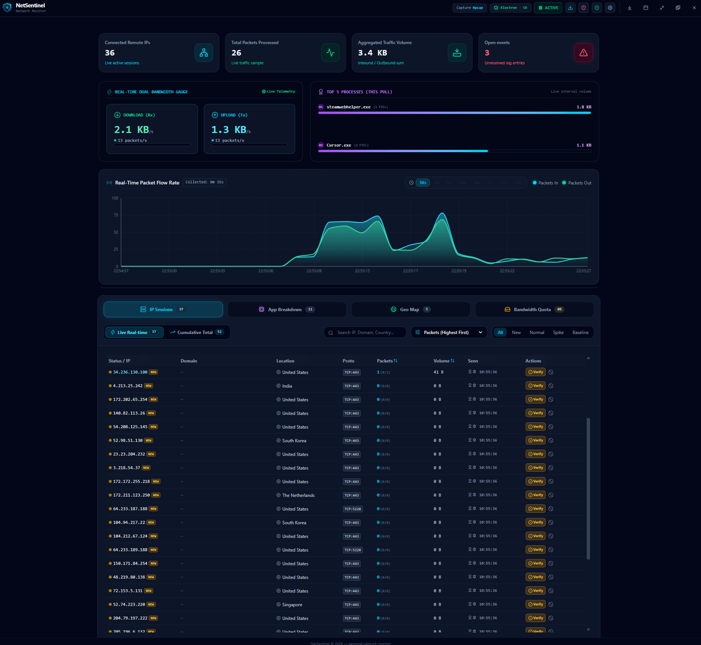
</figure>

# 1. 왜 만들었나

* **가벼운 실시간 시야:** Wireshark급 분석 전에, 지금 붙은 **원격 IP·프로세스·속도**만 빠르게 보고 싶었습니다.
* **Live / Cumulative 분리:** “지금 폴에 보이는 것”과 “이번 실행에서 한 번이라도 본 것”을 탭으로 나누고 싶었습니다.
* **앱·국가 허브:** IP 목록만으로는 부족해서, **프로세스별·국가별** 집계도 한곳에서 보고 싶었습니다.
* **임계값 이벤트만:** Spike / NEW_IP는 **패킷 속도·첫 발견 신호**이지 멀웨어 판정이 아닙니다. 자동 차단은 하지 않습니다.
* **수동 멤버십:** Trusted / Verified / Blacklist로 내가 표시하고, 방화벽 규칙은 **직접** 넣을 때만 적용하고 싶었습니다.

# 2. 구조 및 아키텍처

Electron **main**이 캡처·방화벽·스토어를 담당하고, **renderer**(React)는 폴링·도메인 스토어·UI만 맡습니다. IPC 채널은 `shared/ipc-channels.json` 허용 목록으로 고정됩니다.

```text
MINI_NetSentinel/
┣━━ 📂 electron/                 # main / preload / float / user-store IPC
┣━━ 📂 scripts/
┃   ┣━━ telemetry-core.cjs       # netstat + Npcap 병합 → 텔레메트리
┃   ┣━━ npcap-capture.cjs        # 라이브 캡처 (koffi → wpcap.dll)
┃   ┣━━ firewall-windows.cjs     # netsh IN/OUT 차단 규칙
┃   └━━ lib/                     # bindings, geoip, user-store
┣━━ 📂 shared/                   # ipc-channels.json, famous-ips.json
┣━━ 📂 src/
┃   ┣━━ 📂 components/           # Hub, Settings, FloatingHud, …
┃   ┣━━ 📂 hooks/                # 모니터링·플로트·스냅샷
┃   └━━ 📂 services/
┃       ┣━━ realPacketEngine.ts  # 엔진 파사드·폴 루프
┃       └━━ 📂 packetEngine/     # 세션·멤버십·쿼터·스파이크 등
┣━━ 📂 data/                     # GeoLite2-Country.mmdb, dev-user-store
┗━━ 📄 package.json
```

캡처 흐름은 대략 다음과 같습니다.

```text
netstat (항상)  ──세션 인벤토리──▶  telemetry-core
Npcap (있으면) ──IP별 바이트/패킷──▶  telemetry-core (merge)
telemetry-core  ──get-live-netstat──▶  RealPacketEngine → Hub UI
UI (수동 Block) ──firewall-block-ip──▶  netsh AdvFirewall 규칙
```

# 3. 핵심 구현 디테일

### ① Npcap 우선, Netstat 폴백

`scripts/telemetry-core.cjs`가 Npcap 사용 가능 여부를 확인합니다. 되면 `captureMode = 'npcap'`으로 간격별 바이트·패킷을 붙이고, 실패·미설치면 **`'netstat'`**만 유지합니다. Netstat 모드에서는 볼륨이 **의도적으로 ≈ 0**입니다(추정하지 않음).

Npcap은 `scripts/lib/npcap-bindings.cjs`가 **koffi**로 `wpcap.dll`을 로드하고, `npcap-capture.cjs`가 프레임을 폴링해 원격 IP별 델타를 만듭니다. TCP ESTABLISHED와 실주소 UDP를 중심으로 보며, 같은 IP에 둘 다 있으면 `TCP+UDP`로 합칩니다.

### ② Allowlisted IPC

채널 목록은 `shared/ipc-channels.json`이 단일 소스입니다. preload·메인 핸들러·렌더러 타입이 여기에 맞춰지고, 목록 밖 `invoke`는 거절됩니다. 텔레메트리(`get-live-netstat`), 어댑터 선택, 방화벽, `user-store-get/set`, 플로트 창 전환이 여기에 포함됩니다.

### ③ 멤버십 해석 — Trusted / Verified / Blacklist

`sessionMembership.ts`가 상태 우선순위를 정합니다. **blocked → trusted/verified → spike 힌트 → 그 외 `new`**.  
Trusted에는 `shared/famous-ips.json` 기본값(예: DNS)과 사용자 추가가 들어가고, Verified는 사용자가 “정상”으로 표시한 IP입니다. **자동 위협 차단 훅은 없습니다.** 설정에 `autoBlockSuspicious`가 있어도 로드 시 제거됩니다.

### ④ 수동 방화벽 + 롤백

Blacklist에서 Block하면 `firewallStore.ts`가 UI에 낙관 반영 후 IPC로 `firewall-windows.cjs`를 호출합니다. `netsh advfirewall`로 **`NetSentinel Block OUT/IN <ip>`** 규칙을 넣고, OS 적용이 실패하면 UI 차단을 되돌립니다. 관리자 권한이 필요합니다.

### ⑤ Spike / NEW_IP / History / 일일 쿼터

| 신호 | 의미 | 저장 |
|------|------|------|
| **TRAFFIC_SPIKE** | 단일 IP가 Settings의 pkts/s 임계 초과 | Event log — **RAM만** |
| **NEW_IP** | 이번 실행에서 첫 발견 (기본 off) | Event log — **RAM만** |
| **Spike History** | 차트 급증 시점의 top 앱·IP 스냅샷 | History 탭 — **RAM만** |
| **Daily quota** | 성공한 폴의 바이트 합 (로컬 자정 리셋) | `%APPDATA%/NetSentinel/store/quota-daily.json` |

멤버십·모니터링 설정은 각각 `membership.json`, `monitoring-config.json`에 영속화됩니다. Spike는 **멀웨어 분류가 아닙니다.**

### ⑥ Floating HUD

Navbar에서 플로트로 들어가면 main이 약 **410×370** always-on-top 창으로 줄고, `FloatingHud`만 렌더합니다. RX/TX 스파크라인, 세션·미해결 이벤트, top 프로세스/IP, 일일 쿼터 바를 한눈에 보고, Expand로 전체 UI로 돌아갑니다.

# 4. 화면으로 보는 기능

### 4.1 관리자 · Npcap 안내

첫 실행 시 관리자·Npcap 안내가 뜹니다. 전체 캡처·방화벽이 필요하면 **Restart as Admin**, 목록만 보려면 **Continue Limited**(Netstat 인벤토리)를 고를 수 있습니다.

<figure class="article-figure-center article-figure-center--wide">
  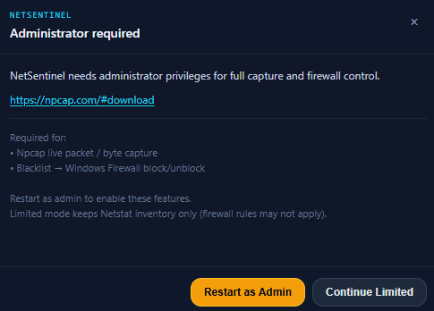
</figure>

* **Restart as Admin:** Npcap 라이브 패킷/바이트 캡처와 Blacklist → Windows Firewall 차단을 켭니다.
* **Continue Limited:** Netstat 연결 목록만 유지합니다. 방화벽 규칙은 적용되지 않을 수 있습니다.
* **Npcap:** 미설치면 [npcap.com](https://npcap.com/#download)에서 받을 수 있습니다.

### 4.2 메인 대시보드

<figure class="article-figure-center article-figure-center--wide">
  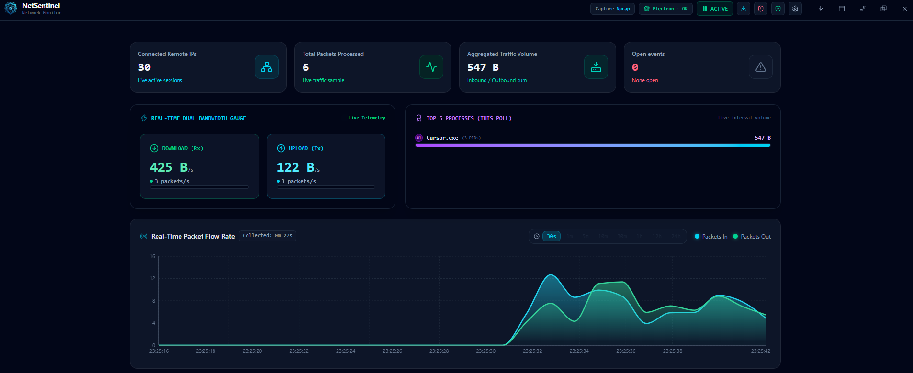
</figure>

* **요약 카드:** Connected Remote IPs, Total Packets, Aggregated Traffic, Open Events를 상단에 표시합니다.
* **Rx / Tx 게이지:** 현재 수신·송신 속도와 패킷/초를 나란히 봅니다.
* **Top processes:** 이번 폴 기준 트래픽이 큰 프로세스를 막대로 보여 줍니다.
* **Packets In/Out 차트:** 짧은 시간창(예: 30s) 흐름과 Collected 경과를 확인합니다.
* **캡처 상태:** 헤더에 Npcap / Electron OK / ACTIVE(일시정지)가 보입니다.

### 4.3 모니터링 설정

<figure class="article-figure-center article-figure-center--wide">
  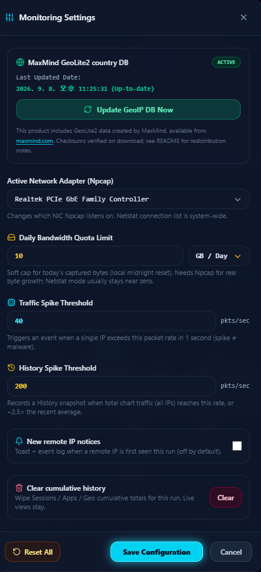
</figure>

* **GeoLite2 Country DB:** 상태·마지막 갱신, **Update GeoIP DB Now**.
* **Active Network Adapter:** Npcap이 들을 NIC 선택 (연결 목록은 시스템 전체).
* **Daily Bandwidth Quota:** 오늘 캡처 바이트 soft cap (정확 측정은 Npcap).
* **Traffic Spike / History Spike:** Event용 pkts/s와 History 스냅샷용 임계·상대 급증.
* **New remote IP notices:** 첫 발견 토스트·이벤트 (기본 꺼짐).
* **Clear cumulative history:** 이번 실행 Cumulative만 비우고 Live는 유지.

### 4.4 IP Sessions

<figure class="article-figure-center article-figure-center--wide">
  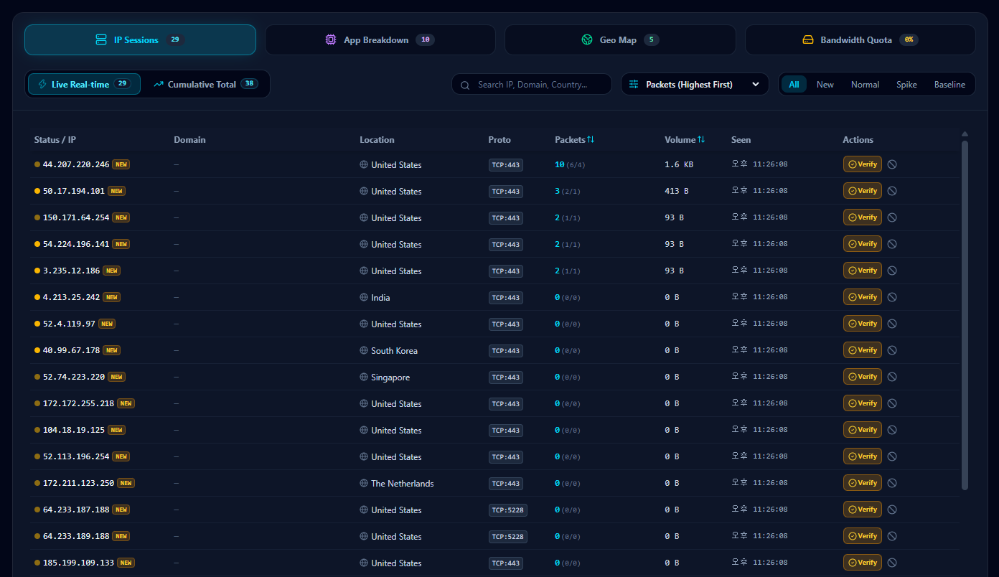
</figure>

* **Live / Cumulative:** 현재 폴 vs 이번 실행 누적 세션을 탭으로 전환합니다.
* **검색·정렬·필터:** IP·도메인·국가 검색, Packets 정렬, All / New / Normal / Spike / Baseline.
* **행 정보:** 원격 IP, Geo 국가, Proto(예: TCP:443), 패킷·볼륨, Seen 시각.
* **Verify / Block:** Verified로 표시하거나 Blacklist·방화벽 쪽으로 넘깁니다.
* **NEW 뱃지:** 이번 실행에서 처음 본 IP를 강조합니다(위협 판정 아님).

### 4.5 App Breakdown

<figure class="article-figure-center article-figure-center--wide">
  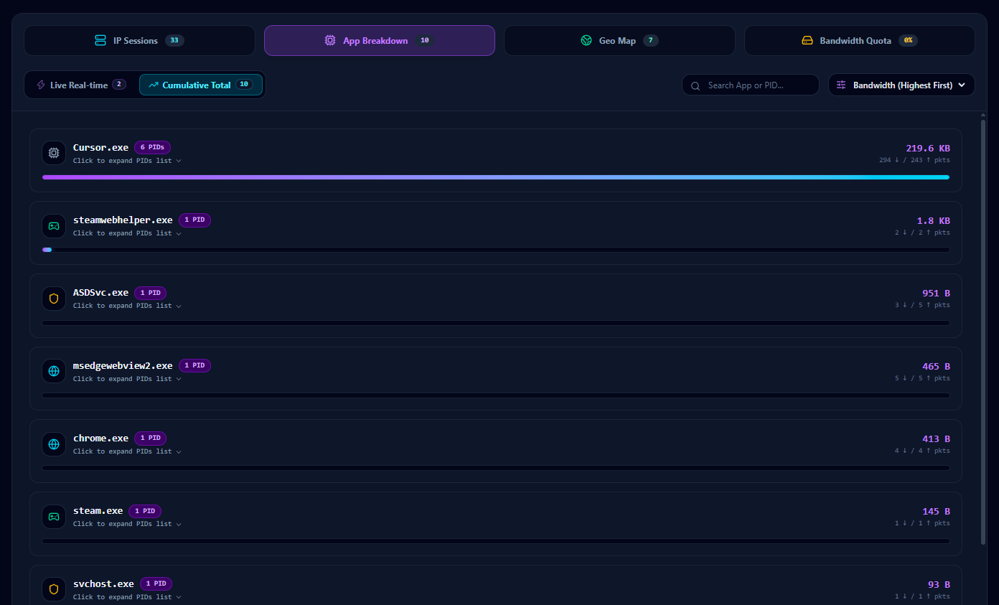
</figure>

* **프로세스 카드:** 실행 파일명, PID 수, ↓/↑ 패킷, 대역폭 막대.
* **Live / Cumulative:** 실시간 폴과 이번 실행 합산을 나눕니다.
* **PID 펼치기:** 카드에서 PID 목록을 확장해 어떤 인스턴스인지 확인합니다.
* **검색·정렬:** 앱/PID 검색, Bandwidth 높은 순 등.

### 4.6 Geo Map

<figure class="article-figure-center article-figure-center--wide">
  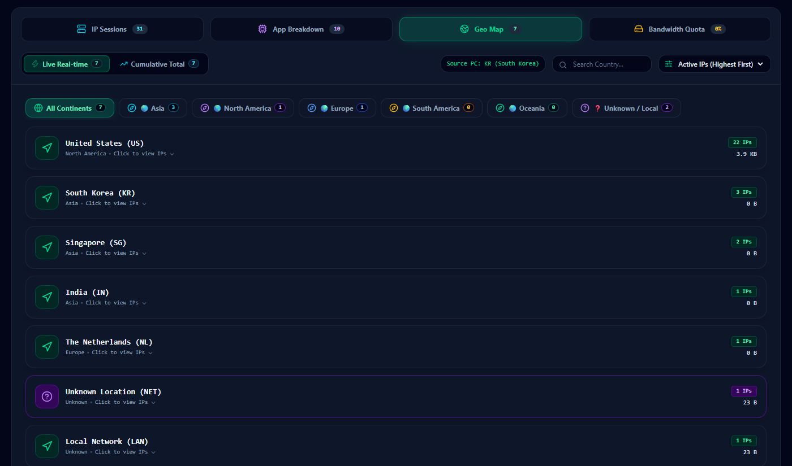
</figure>

* **국가 카드:** GeoLite2 기준 국가·대륙, Active IP 수, 볼륨.
* **대륙 필터:** Asia / North America / Europe / Unknown·LAN 등.
* **Source PC:** 내 공인 위치 힌트(예: KR).
* **Click to view IPs:** 해당 국가에 묶인 원격 IP를 펼칩니다.
* **Unknown / LAN:** Geo 실패·사설망을 따로 모아 둡니다.

### 4.7 Daily Bandwidth Quota

<figure class="article-figure-center article-figure-center--wide">
  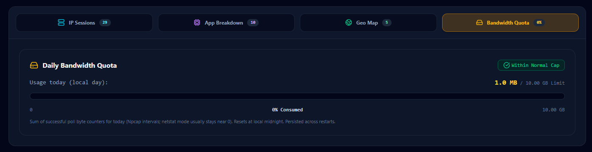
</figure>

* **오늘 사용량:** 로컬 캘린더 데이 기준 사용량 / Limit (예: 1.0 MB / 10 GB).
* **Within Normal Cap:** soft cap 대비 상태 뱃지와 진행 바.
* **Npcap 합산:** 성공한 폴 바이트 합(Netstat 모드는 보통 ≈ 0). 자정 리셋, 재시작 후에도 `quota-daily.json`에 유지.

### 4.8 Event Log

<figure class="article-figure-center article-figure-center--wide">
  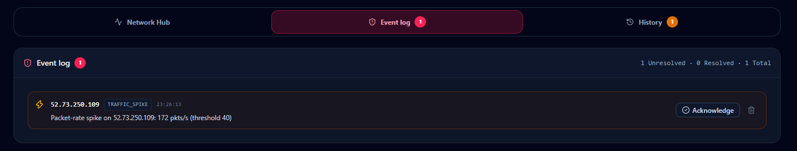
</figure>

* **Unresolved / Resolved:** 스파이크·NEW_IP 등 이벤트를 목록으로 쌓습니다(RAM, 상한 있음).
* **TRAFFIC_SPIKE 예시:** `Packet-rate spike on <IP>: 172 pkts/s (threshold 40)`.
* **Acknowledge / 삭제:** 확인 처리하거나 항목을 지웁니다.
* **자동 차단 없음:** 이벤트는 알림일 뿐, 방화벽 규칙이 자동으로 생기지 않습니다.

### 4.9 Spike History

<figure class="article-figure-center article-figure-center--wide">
  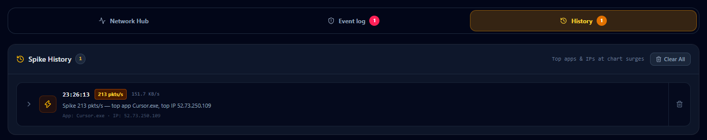
</figure>

* **급증 스냅샷:** 차트 트래픽이 History 임계(또는 최근 평균 대비 급증)일 때 기록합니다.
* **Top app / Top IP:** 예) `Spike 213 pkts/s — top app Cursor.exe, top IP 52.73.250.109`.
* **Clear All:** 이번 실행 History만 비웁니다(디스크 영속 아님).

### 4.10 Firewall Blacklist Manager

<figure class="article-figure-center article-figure-center--wide">
  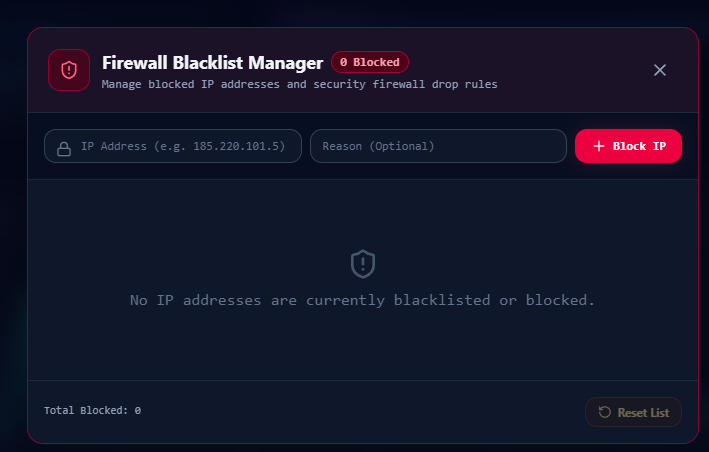
</figure>

* **Block IP:** 주소(+ 선택 Reason)를 넣고 Windows Firewall IN/OUT 규칙을 추가합니다.
* **목록·Reset:** 현재 차단 목록 관리, Reset List로 비우기.
* **관리자 필요:** 권한·Npcap Limited 모드에서는 규칙이 적용되지 않을 수 있습니다.
* **규칙명:** `NetSentinel Block OUT/IN <ip>`.

### 4.11 Trusted / Verified Hub

<figure class="article-figure-center article-figure-center--wide">
  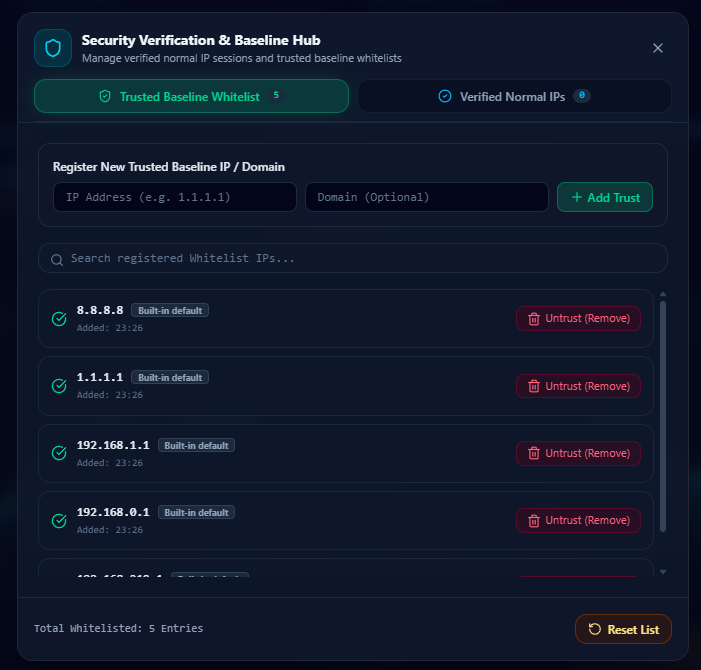
</figure>

* **Trusted Baseline Whitelist:** 기본 DNS 등 Built-in + 사용자 Trust 추가.
* **Verified Normal IPs:** 세션에서 Verify한 “정상” IP 목록.
* **Add Trust / Untrust:** IP·도메인(선택) 등록과 제거.
* **Baseline 필터:** IP Sessions에서 Trusted는 Baseline/Normal 쪽으로 분류됩니다.

### 4.12 Floating HUD

<figure class="article-figure-center article-figure-center--wide">
  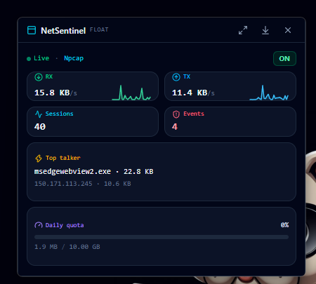
</figure>

* **항상 위 미니 창:** Live·Npcap 상태, 모니터 ON/OFF.
* **RX / TX + 스파크라인:** 지금 속도만 빠르게 확인.
* **Sessions / Events:** 활성 세션 수와 미해결 이벤트 수.
* **Top talker:** 대역폭 큰 프로세스와 대표 원격 IP.
* **Daily quota 바:** soft cap 대비 사용량(경고·초과 구간 색).
* **Expand:** 전체 Network Hub UI로 복귀.

# 5. 한계 · 설치 · 사용 흐름

### 한계 (중요)

* **IPv4 TCP+UDP** 중심입니다. IPv6 가시성은 약합니다.
* **Spike / NEW_IP ≠ 멀웨어 판정**입니다. 패킷 속도·인벤토리 신호일 뿐입니다.
* 차단은 **수동** Trusted / Verified / Blacklist만 지원합니다.
* 일일 쿼터는 Npcap 폴 바이트 합 기준이라, Netstat 모드에서는 거의 0에 가깝습니다.
* GeoLite2-Country는 MaxMind 데이터입니다. 배포·갱신 시 EULA/귀속을 확인하고, NetSentinel은 MaxMind와 무관합니다.

### 사전 요구

| 항목 | 설명 |
|------|------|
| OS | Windows 10 / 11 |
| Npcap | 권장 — [npcap.com](https://npcap.com/) (없으면 Netstat 목록 위주) |
| Administrator | 방화벽 규칙 추가/삭제 시 |
| Node.js | 개발·빌드용 |

### 설치 · 실행

```bash
git clone https://github.com/Hyeonseok93/MINI_NetSentinel.git
cd MINI_NetSentinel
npm install
npm run dev
```

포터블 빌드: `npm run build:exe` → `release/NetSentinel/`. **폴더 전체**를 배포하세요. `.exe`만 복사하면 Electron 런타임이 없어 실행되지 않습니다. 코드 사이닝이 없어 SmartScreen 경고가 날 수 있습니다.

영속 경로(포터블/Electron): `%APPDATA%/NetSentinel/store/` (`monitoring-config.json`, `membership.json`, `quota-daily.json`).

### 사용 흐름

1. 관리자·Npcap 안내에서 **Restart as Admin** 또는 **Continue Limited**를 선택합니다.
2. 메인 대시보드에서 Rx/Tx·차트·Top process를 확인합니다.
3. Settings에서 NIC·일일 쿼터·Spike 임계값을 맞춥니다.
4. IP Sessions / Apps / Geo / Quota 허브로 트래픽을 분류해 봅니다.
5. 필요하면 Event·History로 급증을 확인하고, Trusted·Blacklist로 **수동** 분류·차단합니다.
6. 작업 중에는 FLOAT HUD로 요약만 띄워 둘 수 있습니다.
