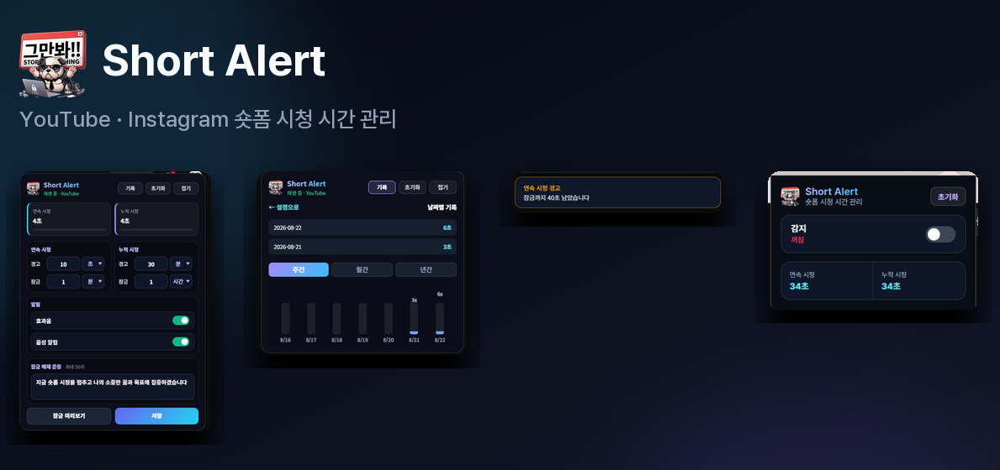
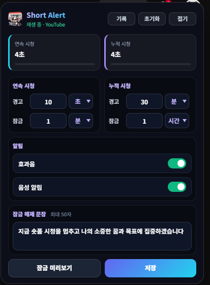
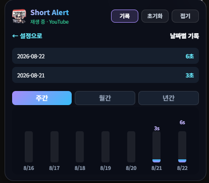
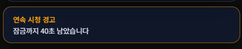
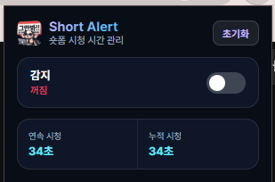

---

# 서론

YouTube Shorts나 Instagram Reels·Stories는 **짧은 영상 + 무한 스크롤** 구조라, “한 편만 더”가 금방 30분·1시간으로 이어지기 쉽습니다. 스마트폰 스크린타임은 보이는데, **PC 브라우저에서 숏폼만** 따로 재는 도구는 많지 않았습니다. 타이머 앱으로 전체 PC 사용 시간을 재면 숏폼이 아닌 작업까지 섞이고, 반대로 사이트 차단만 하면 필요할 때까지 막혀 버립니다.

**Shorts Alert**는 Chrome Manifest V3 기반 **숏폼 시청 시간 모니터 & 알림 확장**입니다. 재생 중인 숏폼만 **연속·누적** 시청 시간을 재고, 경고 토스트와 문장 입력형 잠금 화면으로 과몰입을 끊을 수 있습니다. 설정·시청 기록은 `chrome.storage.local`에만 저장하며 **서버로 전송하지 않습니다**.

<figure class="article-figure-center article-figure-center--wide">
  
</figure>

📦 **GitHub:** [MINI_ShortsAlert](https://github.com/Hyeonseok93/MINI_ShortsAlert)  
🛒 **Chrome Web Store:** _준비 중… (심사 통과 후 설치 링크 추가 예정)_

# 1. 왜 만들었나

* **숏폼만 골라 재기:** 일반 탭·롱폼 영상은 제외하고, Shorts / Reels·Stories **재생 중**일 때만 타이머가 올라가게 하고 싶었습니다.
* **연속 vs 누적 한도:** “이번에 연속으로 얼마나 봤는지”와 “오늘 하루 총합”을 **각각** 경고·잠금할 수 있게 하고 싶었습니다.
* **브라우저 안에서 끊기:** 별도 앱 없이 YouTube·Instagram **페이지 위**에서 설정·기록·알림을 보고 싶었습니다.
* **로컬 프라이버시:** 시청 시간·해제 문장·기록을 **내 브라우저에만** 두고, 계정·서버 업로드 없이 쓰고 싶었습니다.

# 2. 구조 및 아키텍처

MV3에서는 백그라운드가 **Service Worker**라 페이지가 닫혀도 타이머·저장을 이어 가야 했습니다. 그래서 **백그라운드 = 시간 집계**, **콘텐츠 스크립트 = 재생 감지 + UI** 로 나눴습니다.

```text
MINI_ShortsAlert/
┣━━ 📄 manifest.json          # MV3, host_permissions, content_scripts
┣━━ 📄 background.js          # Service Worker — 1초 tick, 저장, 잠금 트리거
┣━━ 📄 content.js             # 메시지 허브, 위젯·디톡스 오케스트레이션
┣━━ 📂 js/
┃   ┣━━ utils.js              # 플랫폼 감지, 시간 포맷, 한도 키, storage 헬퍼
┃   ┣━━ videoDetector.js      # <video> 재생 상태·SPA 네비게이션 감지
┃   ┣━━ widget.js             # 플로팅 설정·기록 UI
┃   ┣━━ detoxOverlay.js       # 경고 토스트·잠금 오버레이
┃   ┗━━ historyChart.js       # 날짜별 목록·주/월/년 차트
┣━━ 📄 popup.html/js/css      # 툴바 팝업 — 마스터 on/off, 초기화
┗━━ 📄 styles.css             # 위젯·토스트·잠금 스타일
```

메시지 흐름은 대략 다음과 같습니다.

```text
videoDetector  ──video-status-changed──▶  background.js (tick + persist)
background.js  ──timer-tick / trigger-*──▶  content.js → widget / detoxOverlay
popup.js       ──master-switch / reset───▶  background.js
```

# 3. 핵심 구현 디테일

### ① 플랫폼 감지 — Shorts·Reels만 대상

`utils.js`의 `detectPlatform(url)`이 URL을 보고 대상 여부를 판별합니다.

* **YouTube:** 경로에 `/shorts`가 있을 때만 `'shorts'`
* **Instagram:** 홈(`/`), 탐색, 게시물(`/p/`), Reels·Stories 경로일 때 `'instagram'`

일반 YouTube 롱폼·프로필 등은 **false**라 타이머·위젯이 붙지 않습니다. content script는 두 도메인에 주입되지만, **숏폼 페이지가 아니면** `videoDetector`가 위젯을 제거하고 `isPlaying: false`를 보고합니다.

### ② 재생 감지 — `<video>` 이벤트 + SPA 네비게이션

`videoDetector.js`는 페이지의 모든 `<video>`에 `play` / `playing` / `pause` / `ended` 리스너를 붙입니다. `paused`가 아니고 `readyState >= 2`이면 재생 중으로 봅니다.

YouTube·Instagram은 **SPA**라 주소만 바뀌고 새로고침이 없습니다. 그래서 `yt-navigate-finish`, `popstate`, `history.pushState` / `replaceState` 후킹, 1초 폴링을 함께 씁니다. 탭이 `document.hidden`이거나 브라우저 포커스를 잃으면 재생 중이어도 **일시 정지**로 처리하고, **20초 유예**(`leaveGrace`) 뒤 연속 시청(`sessionSeconds`)을 0으로 리셋합니다.

### ③ 백그라운드 타이머 — 연속·누적 이중 한도

`background.js`가 1초 `setInterval`로 집계합니다.

| 카운터 | 의미 | 기본값 (예) |
|--------|------|-------------|
| `sessionSeconds` | 이번 연속 시청 | 한도 60초, 경고 10초마다 |
| `todayTotalSeconds` | 오늘 누적 시청 | 한도 3600초, 경고 1800초마다 |

`isPlaying && !detoxActive`일 때만 초가 올라갑니다. 자정이 지나면 `lastResetDate`로 **일일 리셋**하고, `historyRecords`에 날짜별 초·잠금 횟수를 남깁니다(최대 90일). Service Worker가 죽을 수 있어 `chrome.alarms` 1분 keepalive로 ticker를 다시 깨웁니다. `persist()`는 5초마다 배치 저장하고, 기록 스냅샷이 바뀔 때만 `historyRecords`를 갱신합니다.

경고는 `isWarningIntervalTick`으로 **경고 간격마다** 토스트를 띄우고, 한도 도달 시 `trigger-detox`로 잠금을 보냅니다. **연속 한도**와 **누적 한도**는 별도이며, 누적 잠금은 하루에 한 번(`dailyLockShown`)까지입니다.

### ④ 디톡스 UI — 토스트 · 잠금 · 해제 문장

`detoxOverlay.js`가 페이지 위에 DOM을 그립니다.

* **경고 토스트:** 연속/누적 남은 시간 안내, 선택적 비프음·TTS(`speechSynthesis`, `ko-KR`)
* **잠금 오버레이:** 한도 도달 시 `<video>` 일시정지, 전면 오버레이 표시
* **해제:** 사용자가 설정한 **확언 문장**(최대 50자)을 그대로 입력해야 `unlock-session` → `sessionSeconds` 리셋

잠금 중에는 `detoxActive`라 tick이 멈추고, 해제 후에만 다시 재생 시간이 쌓입니다.

### ⑤ 플로팅 위젯 & 시청 기록

`widget.js`가 `#shorts-guard-floating` 루트를 만들고, 연속/누적 한도·경고·효과음·TTS·해제 문장을 **저장** 버튼으로 `chrome.storage.local`에 씁니다. 시간 입력은 시·분·초 단위 셀렉트로 받고 `decomposeSeconds`로 기본 단위를 맞춥니다.

`historyChart.js`는 날짜별 목록과 **주간(7일) / 월간(12개월) / 년간(10년)** 막대 차트를 SVG로 그립니다. 위젯은 접기(`isWidgetMinimized`) 상태를 storage에 유지합니다.

### ⑥ 팝업 — 마스터 스위치

툴바 `popup`에서 **감지 on/off**, 연속·오늘 시청 실시간 표시, **전체 초기화**(설정·타이머·기록 리셋)를 합니다. `isEnabled: false`면 content 쪽 위젯이 제거되고 tick도 멈춥니다.

# 4. 화면으로 보는 기능

### 4.1 설정 & 한도 관리

<figure class="article-figure-center article-figure-center--wide">
  
</figure>

* **연속 / 누적 이중 한도:** 연속 시청·오늘 누적 각각 **경고 간격**과 **잠금 한도**를 시·분·초 단위로 지정합니다.
* **실시간 미터:** 재생 중일 때 연속·누적 게이지와 디지털 타이머가 1초마다 갱신됩니다.
* **알림·해제 문장:** 효과음·TTS on/off, 잠금 해제용 **확언 문장**(최대 50자)을 저장합니다.
* **접기 / 펼치기:** 우측 플로팅 위젯을 최소화해 Shorts·Reels 화면을 가리지 않게 할 수 있습니다.

### 4.2 시청 기록 & 차트

<figure class="article-figure-center article-figure-center--wide">
  
</figure>

* **날짜별 목록:** `YYYY-MM-DD` 단위로 시청 시간과 **잠금 횟수**를 표시합니다(최대 90일 보관).
* **주간 / 월간 / 년간 차트:** SVG 막대 차트로 습관 추이를 한눈에 봅니다.
* **로컬만 저장:** `historyRecords`는 `chrome.storage.local`에만 쌓이며 외부로 전송하지 않습니다.

### 4.3 시청 경고 알림

<figure class="article-figure-center article-figure-center--wide">
  
</figure>

* **연속 / 누적 경고:** 설정한 경고 간격마다 **잠금까지 남은 시간**을 토스트로 안내합니다.
* **효과음 · 음성:** 비프음과 `speechSynthesis`(한국어 TTS)를 선택적으로 재생합니다.
* **잠금 전 단계:** 한도에 도달하기 전에 미리 끊을 수 있도록, 잠금 오버레이보다 가볍게 표시됩니다.

### 4.4 확장 프로그램 팝업

<figure class="article-figure-center article-figure-center--wide">
  
</figure>

* **마스터 스위치:** 툴바 아이콘에서 **감지 on/off** — 끄면 위젯·tick이 모두 멈춥니다.
* **실시간 요약:** **연속 시청**·**오늘 누적** 시간을 팝업에서 바로 확인합니다.
* **전체 초기화:** 설정·타이머·기록을 기본값으로 되돌리는 확인 모달을 제공합니다.

# 5. UI/UX 및 프라이버시

### 권한

| 권한 | 용도 |
|------|------|
| `storage` | 설정·시청 기록 로컬 저장 |
| `tabs` | 활성 탭 URL·메시지 전달 |
| `alarms` | Service Worker keepalive |
| `youtube.com` / `instagram.com` | 숏폼 페이지에 위젯·타이머 주입 |

계정 로그인·원격 서버 전송은 없습니다. 데이터는 **기기 브라우저 안**에만 남습니다.

### 설치

Chrome Web Store 심사는 **대기 중**입니다. 지금은 저장소를 클론한 뒤 `chrome://extensions` → 개발자 모드 → **압축해제된 확장 프로그램 로드**로 `MINI_ShortsAlert` 루트를 선택하면 됩니다. 코드를 수정했다면 확장 **새로고침** 후 해당 탭을 새로고침하세요.

### 사용 흐름

1. YouTube Shorts 또는 Instagram(홈·탐색·게시물·릴스·스토리)에서 숏폼을 재생합니다.
2. 화면 우측 위젯에서 연속/누적 한도·알림·해제 문장을 설정하고 **저장**합니다.
3. 경고 시간·잠금 한도에 도달하면 토스트 또는 잠금 화면이 표시됩니다.
4. 툴바 아이콘 팝업에서 확장 on/off·초기화를 할 수 있습니다.
