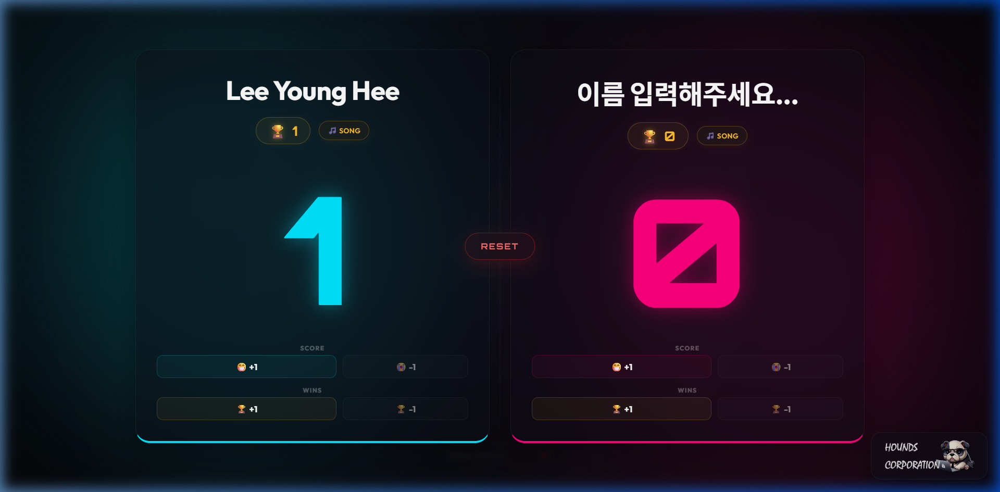
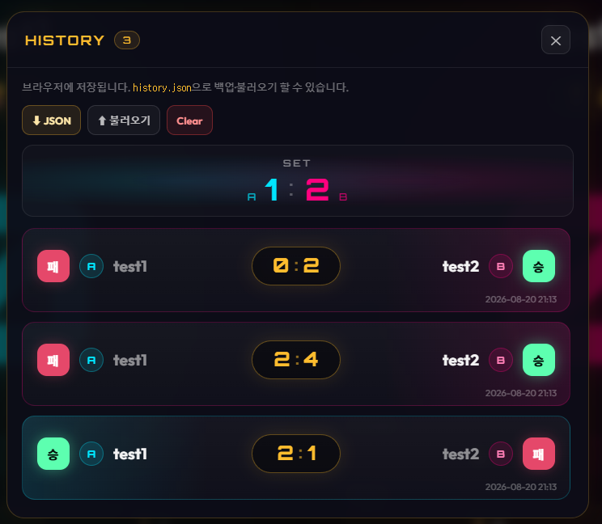
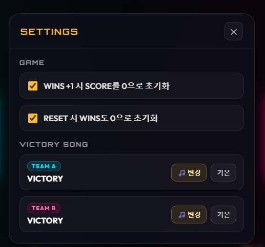

---

# 서론

여자친구와 둘이서 보드게임이나 카드게임을 즐길 때, 종이와 펜으로 점수를 적거나 복잡한 앱을 켜는 것이 번거로웠습니다. 앱스토어 설치나 백엔드 서버 없이 어떤 기기(태블릿, 노트북, 폰)에서든 브라우저 탭 하나로 즉시 점수를 카운트하고, 세트를 이길 때마다 각자 지정한 승리 테마곡(`VICTORY.mp3`)이 재생되어 게임의 몰입감을 높이고자 만들었습니다.

**Web ScoreBoard**는 순수 HTML, CSS, JavaScript로 제작된 **보드게임용 반응형 웹 점수판**입니다. 브라우저를 새로고침해도 플레이어 이름과 세트 스코어가 유지되며, 팀별 커스텀 승리 축하 음악 등록 및 전적 히스토리 관리/JSON 백업을 지원합니다.

📦 **GitHub:** [MINI_WebScoreBoard](https://github.com/Hyeonseok93/MINI_WebScoreBoard)

# 1. 구조 및 특징

외부 라이브러리나 무거운 프레임워크 없이 브라우저 순정 API로만 구성되었습니다.

```text
MINI_WebScoreBoard/
┣━━ 📂 assets/            # 기본 승리 음악(VICTORY.mp3), 아이콘, 시드 데이터
┣━━ 📄 ScoreBoard.html    # 시맨틱 구조 및 점수판 레이아웃
┣━━ 📄 style.css          # 네온 다크 테마 및 반응형 카드 스타일링
┗━━ 📄 script.js          # 게임 상태 관리, LocalStorage & IndexedDB 동기화, Audio 제어
```

# 2. 핵심 구현 디테일

### ① LocalStorage & IndexedDB 이원화 스토리지 설계
브라우저를 새로고침하거나 창을 닫았다가 다시 열어도 게임 흐름이 끊기지 않도록, 데이터의 크기와 성격에 맞춰 스토리지를 분리했습니다:
* **LocalStorage:** 플레이어 이름, 점수(`SCORE`), 세트 승수(`WINS`), 게임 룰 설정, 전적 히스토리 JSON 데이터를 실시간으로 동기화합니다.
* **IndexedDB (`ScoreboardDB`):** 사용자가 직접 등록한 수 MB 단위의 커스텀 승리 음원 파일(Blob)을 LocalStorage의 5MB 용량 한도 걱정 없이 브라우저에 안전하게 영구 저장합니다. `URL.createObjectURL`로 즉시 재생하고, 메모리 누수를 방지하기 위해 `URL.revokeObjectURL`로 수명 주기를 관리합니다.

### ② HTML5 Audio 제어 & 부드러운 Fade-out
* 세트 승리 시(WINS +1) 해당 팀의 승리 테마곡(`assets/VICTORY.mp3` 또는 IndexedDB에 등록된 커스텀 음원)을 자동 재생하며, 화면 하단에 트랙 정보가 담긴 `Now Playing` 위젯이 나타납니다.
* 게임 리셋이나 음악 정지 시 소리가 뚝 끊기는 이질감을 방지하기 위해, 볼륨을 $1.0 \to 0.0$으로 서서히 줄이며 정지하는 **오디오 페이드아웃(Fade-out)** 인터벌을 구현했습니다.

### ③ 전적 대결 카드(A vs B) & JSON 양방향 백업
* 매 세트가 끝날 때마다 중앙에 대결 결과 카드(양 팀의 점수 및 승/패 색상 뱃지, 타임스탬프)가 시간순으로 기록됩니다.
* 전적 히스토리를 `history.json` 파일로 내보내거나(Export), 기존 기록을 다시 불러오는(Import) 기능을 지원합니다.

# 3. 화면으로 보는 기능

### 3.1 메인 점수판 (Main Dashboard)

<figure class="article-figure-center article-figure-center--wide">
  
</figure>

* **실시간 스코어보드:** 좌우 양 팀의 플레이어 이름, 현재 세트 점수(`SCORE`), 누적 승수(`WINS`)를 `+1`/`-1` 버튼으로 직관적으로 조작합니다.
* **중앙 RESET 컨트롤:** 중앙의 RESET 버튼으로 현재 세트 점수를 초기화하고 재생 중인 음악을 부드럽게 멈춥니다.
* **Now Playing 플로팅 바:** 승리 시 하단에 곡명과 재생 상태를 시각화합니다.

### 3.2 전적 히스토리 (History Modal)

<figure class="article-figure-center article-figure-center--wide">
  
</figure>

* **세트 스코어 집계 배너:** 상단에 현재 전체 세트 스코어(`A:1 vs B:2`)를 시각적으로 강조합니다.
* **매치 결과 카드:** WINS +1 때마다 판별 스코어와 승/패가 컬러 뱃지로 기록되며 최신순으로 스크롤됩니다.
* **JSON 백업 & 복원:** `JSON 다운로드`로 기록을 백업하거나 `불러오기`로 이전 대결 전적을 복원할 수 있습니다.

### 3.3 환경설정 (Settings Modal)

<figure class="article-figure-center article-figure-center--wide">
  
</figure>

* **게임 룰 토글:**
  * `WINS +1 시 SCORE를 0으로 초기화`: 세트 승리 시 점수 자동 리셋
  * `RESET 시 WINS도 0으로 초기화`: 중앙 RESET 시 세트 승수까지 함께 초기화
* **VICTORY SONG (커스텀 승리곡 등록):** Team A와 Team B 각각 원하는 음원 파일을 브라우저 IndexedDB에 개별 등록하거나 기본곡으로 복구할 수 있습니다.

# 4. UI/UX 및 인터랙션 디테일

* **인라인 이름 편집:** 별도 모달 없이 카드 위의 플레이어 이름을 클릭해 즉시 수정하고 자동 저장됩니다.
* **승리 네온 글로우(Glow):** 세트를 따낸 팀의 카드 테두리에 사이버펑크 스타일의 네온 컬러가 발광하는 시각적 애니메이션을 제공합니다.
* **반응형 레이아웃:** 스마트폰 세로 화면부터 태블릿, PC 와이드 모니터까지 유연하게 대응하는 Flexbox/CSS Grid 레이아웃을 적용했습니다.
