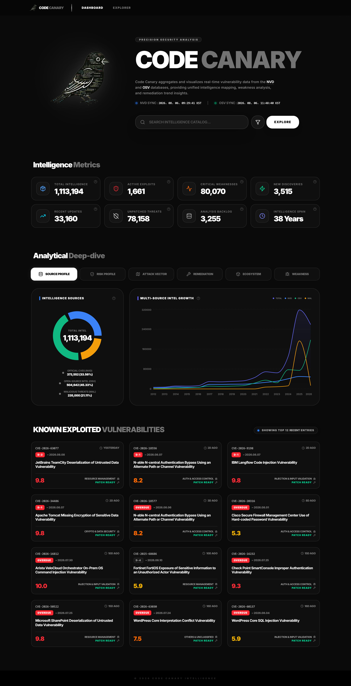

---

# 서론

**NVD**에서 정식으로 부여하는 CVE와, **오픈소스 생태계에서 부여하는 OSV**(GHSA 등)를 **한곳에서 보고, 서로 비교하고, 전체 흐름으로 분석**해 보고 싶어서 시작한 프로젝트입니다. 출처마다 사이트를 오가며 목록만 훑는 방식으로는 같은 취약점이 어떻게 이어지는지, 카탈로그 전체에서 무엇이 늘고 있는지가 잘 보이지 않았습니다.

그래서 **수집 → 정제 → 분석·시각화**까지 한 번에 이어지게 만들었습니다. **Code Canary**는 NVD·OSV 피드를 Medallion(**bronze → silver → gold**)으로 올린 뒤, 공개 Explorer와 운영자용 Roost 콘솔에서 탐색·집계·파이프라인 실행까지 묶은 **취약점 인텔리전스 웹**입니다.

React(Vite) 프론트와 Spring Boot API, Python Worker가 나뉘어 있고, PostgreSQL · Redis · Docker Compose(로컬) · Terraform · AWS ECS(배포)를 중심으로 대시보드 · 탐색 · 인증 · 잡 큐를 다룹니다.

📦 **GitHub:** [WEB_Code-Canary](https://github.com/Hyeonseok93/WEB_Code-Canary)

# 1. 메인 화면

<figure class="article-figure-center article-figure-center--wide">
  
</figure>

대시보드 첫 화면은 NVD·OSV 동기화 시각, 카탈로그 규모·심각도·KEV 같은 요약 카드, 소스별 비중·성장 차트, Known Exploited 목록을 한곳에 둡니다. 상단 검색은 Explorer로 이어지고, 운영자 콘솔(Roost)은 별도 경로로 분리되어 있습니다.

# 2. 왜 만들었나

### NVD와 OSV를 한곳에서 보고 싶었다

NVD에서 부여하는 **공식 CVE**와, 오픈소스 쪽에서 쌓이는 **OSV**(GHSA 등)는 출처·ID·표현이 다릅니다. 사이트를 나눠 보면 같은 취약점이 어떻게 이어지는지, 카탈로그 전체에서 무엇이 커지는지가 잘 안 보입니다. **한 화면에서 모아 보고, 비교하고, 규모·심각도·소스 비중 같은 전체 분석까지** 해보고 싶어서 Code Canary를 잡았습니다.

### 백엔드와 DB를 한 바퀴 돌리고 싶었다

**SK 쉴더스 루키즈 5기** 프로젝트에서도 백엔드를 아예 안 한 것은 아니지만, 체감상 **프론트에 조금 더 치우쳐** 있었습니다. 그 다음에 개인적으로는 API·잡·인증 같은 **백엔드를 전체적으로** 한 번 해보고 싶었고, 동시에 **데이터베이스**도 제대로 다뤄 보고 싶었습니다.

### 복잡하고 유기적인 데이터로 만들고 싶었다

그래서 CRUD만 도는 단순 도메인보다, NVD·OSV처럼 **관계가 얽힌 데이터를 수집·정제·집계**하는 쪽이 맞다고 봤습니다. 피드가 서로 다른 스키마로 들어오고, 정규화한 뒤에도 탐색·차트·파이프라인 상태가 한 제품 안에서 이어져야 해서, 백엔드·DB·Worker를 같이 밀어 볼 수 있는 주제였습니다.

---

다음 글에서는 **핵심 기능**부터 정리할 예정입니다. Medallion(**bronze → silver → gold**), NVD·OSV를 묶는 Explorer, 장시간 파이프라인을 돌리는 **Roost** 콘솔이 여기에 해당합니다.
