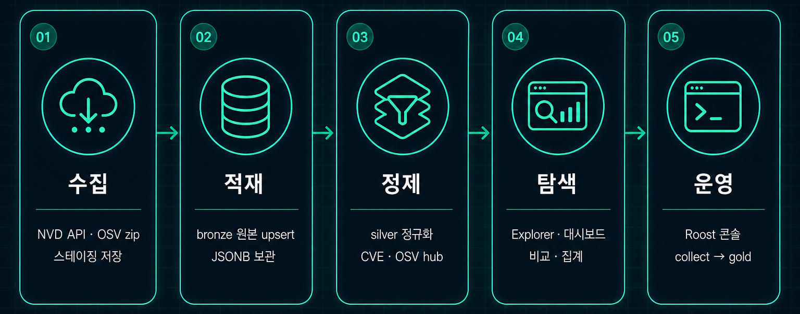
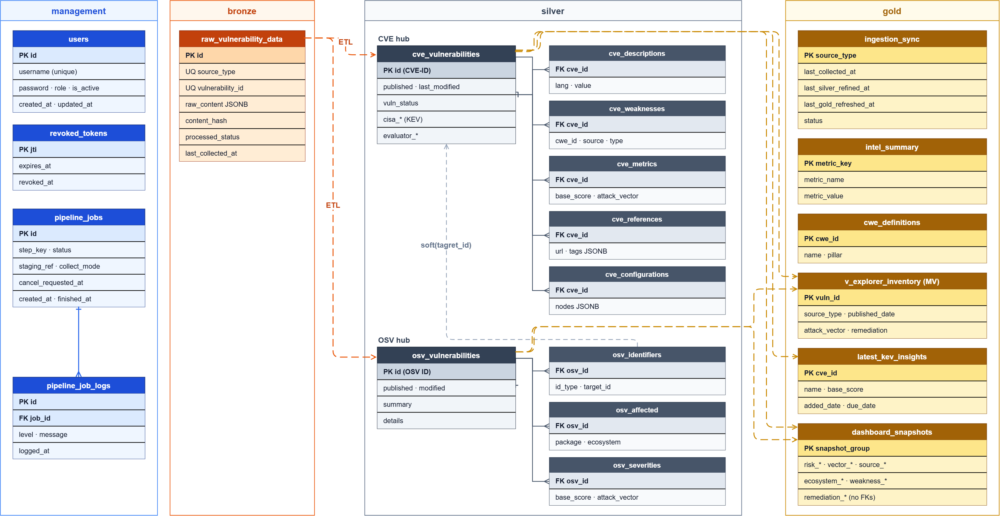

---

# 서론

**NVD**에서 정식으로 부여하는 CVE와, **오픈소스 생태계에서 부여하는 OSV**(GHSA 등)를 **한곳에서 보고, 서로 비교하고, 전체 흐름으로 분석**해 보고 싶어서 시작한 프로젝트입니다. 출처마다 사이트를 오가며 목록만 훑는 방식으로는 같은 취약점이 어떻게 이어지는지, 카탈로그 전체에서 무엇이 늘고 있는지가 잘 보이지 않았습니다.

그래서 **수집 → 정제 → 분석·시각화**까지 한 번에 이어지게 만들었습니다. **Code Canary**는 NVD·OSV 피드를 Medallion(**bronze → silver → gold**)으로 올린 뒤, 공개 Explorer와 운영자용 Roost 콘솔에서 탐색·집계·파이프라인 실행까지 묶은 **취약점 인텔리전스 웹**입니다.

React(Vite) 프론트와 Spring Boot API, Python Worker가 나뉘어 있고, PostgreSQL · Redis · Docker Compose(로컬) · Terraform · AWS ECS(배포)를 중심으로 대시보드 · 탐색 · 인증 · 잡 큐를 다룹니다.

📦 **GitHub:** [WEB_Code-Canary](https://github.com/Hyeonseok93/WEB_Code-Canary)

# 1. 메인 화면

<figure class="article-figure-center article-figure-center--wide">
  
</figure>

대시보드 첫 화면은 NVD·OSV 동기화 시각, 카탈로그 규모·심각도·KEV 같은 요약 카드, 소스별 비중·성장 차트, Known Exploited 목록을 한곳에 둡니다. 상단 검색은 Explorer로 이어지고, 운영자 콘솔(Roost)은 별도 경로로 분리되어 있습니다.

# 2. 왜 만들었나

### NVD와 OSV를 한곳에서 보고 싶었다

NVD에서 부여하는 **공식 CVE**와, 오픈소스 쪽에서 쌓이는 **OSV**(GHSA 등)는 출처·ID·표현이 다릅니다. 사이트를 나눠 보면 같은 취약점이 어떻게 이어지는지, 카탈로그 전체에서 무엇이 커지는지가 잘 안 보입니다. **한 화면에서 모아 보고, 비교하고, 규모·심각도·소스 비중 같은 전체 분석까지** 해보고 싶어서 Code Canary를 잡았습니다.

### 백엔드와 DB를 한 바퀴 돌리고 싶었다

**SK 쉴더스 루키즈 5기** 프로젝트에서도 백엔드를 아예 안 한 것은 아니지만, 체감상 **프론트에 조금 더 치우쳐** 있었습니다. 그 다음에 개인적으로는 API·잡·인증 같은 **백엔드를 전체적으로** 한 번 해보고 싶었고, 동시에 **데이터베이스**도 제대로 다뤄 보고 싶었습니다.

### 복잡하고 유기적인 데이터로 만들고 싶었다

그래서 CRUD만 도는 단순 도메인보다, NVD·OSV처럼 **관계가 얽힌 데이터를 수집·정제·집계**하는 쪽이 맞다고 봤습니다. 피드가 서로 다른 스키마로 들어오고, 정규화한 뒤에도 탐색·차트·파이프라인 상태가 한 제품 안에서 이어져야 해서, 백엔드·DB·Worker를 같이 밀어 볼 수 있는 주제였습니다.

# 3. 서비스 흐름

Code Canary의 핵심 흐름은 피드를 받는 데서 끝나지 않습니다. **수집 → 적재 → 정제 → 탐색 → 운영**으로 이어지며, 공개 Explorer·대시보드와 운영자 Roost가 같은 파이프라인 결과 위에서 만납니다.

<figure class="article-figure-center article-figure-center--full">
  
</figure>

### 1. NVD·OSV 피드를 수집한다

Worker가 NVD API와 OSV `all.zip`을 받아 `/data` 스테이징에 baseline으로 쌓습니다. NVD는 full / incremental 모드를 두고, OSV는 zip과 manifest를 함께 둡니다.

### 2. bronze에 원본을 적재한다

스테이징 JSON을 **bronze.`raw_vulnerability_data`** 로 upsert합니다. `source_type` + `vulnerability_id`와 content-hash로 중복을 다루고, 원본은 JSONB로 남깁니다. 정제 전 상태는 `PENDING` / `PROCESSED` / `ERROR`로 추적합니다.

### 3. silver로 정규화한다

bronze 배치를 DB 함수로 풀어 **CVE hub · OSV hub**와 child 테이블(설명·CWE·CVSS·패키지 영향 등)에 넣습니다. 화면이 바로 조인하기 어려운 원본 스키마를, 검색·상세용 표 형태로 맞추는 단계입니다.

### 4. Explorer와 대시보드에서 탐색한다

silver를 집계해 **gold** 스냅샷·Explorer MV를 갱신하면, 공개 SPA는 gold만 읽어 목록·상세·차트·KEV를 보여 줍니다. NVD와 OSV를 같은 Explorer에서 넘나들며 비교하는 지점입니다.

### 5. Roost에서 파이프라인을 운영한다

장시간 collect / load / silver / gold 는 Roost Control Plane에서 단계를 큐에 넣고, Job Monitor로 진행·성공·실패를 봅니다. 운영자만 로그인하며, JWT(HttpOnly 쿠키)로 세션을 유지합니다.

이 과정에서 React 화면은 Spring Boot REST API를 호출하고, 적재·정제는 Python Worker가 PostgreSQL·`/data`를 다룹니다. 로컬은 Docker Compose, 배포는 ECS · EFS · RDS · Redis 위에 같은 흐름을 올립니다.

# 4. 도메인 · ERD

핵심은 **management(운영) · bronze(원본) · silver(정규화) · gold(화면용)** 네 스키마로 층을 나눈 Medallion입니다. 관계·상태는 아래와 ERD에 맞춰 정리합니다.

<figure class="article-figure-center article-figure-center--full">
  
</figure>

### 핵심 엔티티

| 층 | 테이블 | 역할 |
|----|--------|------|
| **management** | `users` | 운영자 계정. username · password · `ROLE_ADMIN` · 활성 여부 |
| **management** | `revoked_tokens` | 로그아웃·폐기 JWT `jti` |
| **management** | `pipeline_jobs` / `pipeline_job_logs` | Roost 잡 큐·로그. `step_key` · status · staging_ref · collect_mode |
| **bronze** | `raw_vulnerability_data` | NVD/OSV 원본 JSONB. `(source_type, vulnerability_id)` · content_hash · processed_status |
| **silver** | `cve_vulnerabilities` | CVE hub. description · weakness · metrics · reference · configuration child |
| **silver** | `osv_vulnerabilities` | OSV hub. identifiers · affected · severities child |
| **silver** | `osv_identifiers` | ALIAS/RELATED 등. `target_id`로 CVE와 **soft link** |
| **gold** | `v_explorer_inventory` (MV) | Explorer 목록·필터용 통합 inventory |
| **gold** | `dashboard_snapshots` / `intel_summary` | 대시보드 차트·요약 지표 |
| **gold** | `latest_kev_insights` | CISA KEV 인사이트 |
| **gold** | `ingestion_sync` | 소스별 collect · silver · gold 시각·상태 |

### 관계와 설계 선택

1. **bronze**는 원본을 통째로 남기고, silver refine이 끝난 행만 `PROCESSED`로 올립니다. 원본 추적과 재정제를 끊지 않기 위함입니다.
2. **silver**는 CVE와 OSV를 **각각의 hub + CASCADE child**로 둡니다. 스키마가 다른 두 피드를 한 마스터 테이블에 억지로 합치지 않습니다.
3. OSV → CVE는 FK가 아니라 `osv_identifiers.target_id` **soft link**입니다. 모든 OSV가 CVE를 갖지 않고, ID 표기도 제각각이라 강제 FK보다 탐색·조인에 유리합니다.
4. **gold**는 화면 API가 읽는 층입니다. Explorer·대시보드는 bronze/silver를 직접 조인하지 않고 MV·스냅샷을 봅니다.
5. **management**의 `pipeline_jobs`는 데이터 hub와 분리합니다. 파이프라인 실행 이력이 취약점 카탈로그 스키마를 오염시키지 않게 하려는 선택입니다.

bronze / silver / gold를 **일부러 나눈** 이유입니다. 원본 보관 · 정규화 검색 · 차트용 집계를 한 테이블에 섞으면 “다시 받기 / 다시 풀기 / 화면만 갱신”이 한꺼번에 꼬입니다. **원본 = bronze**, **표 = silver**, **화면 = gold**로 역할을 갈랐습니다.

# 5. 주요 API

프론트가 쓰는 REST는 `/api` 아래에 모았습니다. **공개 analytics / Explorer** 와 **운영자(admin) 파이프라인** 을 권한으로 갈랐고, 아래는 **실제 컨트롤러 매핑** 기준 요약입니다. 로그인 JWT는 HttpOnly 쿠키로 두고, 상태 변경이 있는 호출은 CSRF 토큰을 함께 씁니다.

### Auth · Session

| Method | Endpoint | 설명 |
|--------|----------|------|
| GET | `/api/auth/csrf` | CSRF 헤더명 · 토큰 발급 (공개) |
| POST | `/api/auth/login` | 운영자 로그인 · JWT 쿠키 발급 · IP/계정 rate limit |
| GET | `/api/admin/session` | 세션 조회. 비로그인·비관리자면 anonymous |
| POST | `/api/admin/logout` | 로그아웃 · `jti` revoke + 쿠키 삭제 (인증 필요) |

공개 회원가입 API는 두지 않았습니다. 운영자 계정은 `management.users`에 두고 Roost만 로그인합니다.

### Analytics · Explorer (공개)

대시보드·Explorer는 gold 스냅샷·MV를 읽습니다. `/api/analytics/**` 는 인증 없이 열려 있고, Redis 레이트 리밋으로 남용을 막습니다.

| Method | Endpoint | 설명 |
|--------|----------|------|
| GET | `/api/analytics/metrics` | 요약 지표 (`intel_summary`) |
| GET | `/api/analytics/sync` | NVD·OSV ingestion sync 시각·상태 |
| GET | `/api/analytics/dashboard` | 대시보드 소스·리스크 등 집계 |
| GET | `/api/analytics/vector` | Attack vector 분석 |
| GET | `/api/analytics/ecosystem` | 생태계 분석 |
| GET | `/api/analytics/weakness` | CWE/약점 분석 |
| GET | `/api/analytics/remediation` | 조치·패치 관련 분석 |
| GET | `/api/analytics/kev-insights` | 최신 KEV 인사이트 목록 |
| GET | `/api/analytics/explorer` | Explorer 목록·필터·페이징 (`ExplorerQueryParams`) |
| GET | `/api/analytics/explorer/{vulnId}` | 취약점 상세 (NVD/OSV 통합) |

### Admin · Pipeline (ROLE_ADMIN)

Roost Control Plane · Job Monitor가 호출합니다. `/api/admin/**` 은 `ROLE_ADMIN` 만 허용합니다.

| Method | Endpoint | 설명 |
|--------|----------|------|
| GET | `/api/admin/pipeline/status` | NVD/OSV/gold 단계 상태·카운트 |
| GET | `/api/admin/pipeline/activity` | 최근 잡 로그 (`limit`, 기본 50) |
| GET | `/api/admin/pipeline/staging` | NVD·OSV staging baseline 목록 |
| POST | `/api/admin/pipeline/jobs` | 잡 enqueue (`stepKey` · stagingRef · collectMode) → `202 Accepted` |
| POST | `/api/admin/pipeline/jobs/stop` | collect 단계 중단 요청 |
| POST | `/api/admin/pipeline/jobs/stuck/release` | stuck running 잡 해제 |

Worker는 이 API로 쌓인 `pipeline_jobs`를 폴링해 collect / load / silver / gold 를 실행합니다. 백엔드는 **오케스트레이션·권한·조회** 에 머물고, 무거운 적재·정제는 Worker SQL이 담당합니다.

---

다음 글에서는 **핵심 기능**을 더 깊게 정리할 예정입니다. Medallion 배치 설계, Explorer 통합 검색, Roost 잡 오케스트레이션이 여기에 해당합니다.
