---

# 서론

**NVD**에서 정식으로 부여하는 CVE와, **오픈소스 생태계에서 부여하는 OSV**(GHSA 등)를 **한곳에서 보고, 서로 비교하고, 전체 흐름으로 분석**해 보고 싶어서 시작한 프로젝트입니다. 출처마다 사이트를 오가며 목록만 훑는 방식으로는 같은 취약점이 어떻게 이어지는지, 카탈로그 전체에서 무엇이 늘고 있는지가 잘 보이지 않았습니다.

그래서 **수집 → 정제 → 분석·시각화**까지 한 번에 이어지게 만들었습니다. **Code Canary**는 NVD·OSV 피드를 Medallion(**bronze → silver → gold**)으로 올린 뒤, 공개 Explorer와 운영자용 Roost 콘솔에서 탐색·집계·파이프라인 실행까지 묶은 **취약점 인텔리전스 웹**입니다.

React(Vite) 프론트와 Spring Boot API, Python Worker가 나뉘어 있고, PostgreSQL · Redis · Docker Compose(로컬) · Terraform · AWS ECS(배포)를 중심으로 대시보드 · 탐색 · 인증 · 잡 큐를 다룹니다.

📦 **GitHub:** [WEB_Code-Canary](https://github.com/Hyeonseok93/WEB_Code-Canary)

# 1. 메인 화면

<figure class="article-figure-center article-figure-center--wide">
  
</figure>

대시보드 첫 화면은 NVD·OSV 동기화 시각, 카탈로그 규모·심각도·KEV 같은 요약 카드, 소스별 비중·성장 차트, Known Exploited 목록을 한곳에 둡니다. 상단 검색은 Explorer로 이어지고, 운영자 콘솔(Roost)은 별도 경로로 분리되어 있습니다.

# 2. 왜 만들었나

### NVD와 OSV를 한곳에서 보고 싶었다

NVD에서 부여하는 **공식 CVE**와, 오픈소스 쪽에서 쌓이는 **OSV**(GHSA 등)는 출처·ID·표현이 다릅니다. 사이트를 나눠 보면 같은 취약점이 어떻게 이어지는지, 카탈로그 전체에서 무엇이 커지는지가 잘 안 보입니다. **한 화면에서 모아 보고, 비교하고, 규모·심각도·소스 비중 같은 전체 분석까지** 해보고 싶어서 Code Canary를 잡았습니다.

### 백엔드와 DB를 한 바퀴 돌리고 싶었다

**SK 쉴더스 루키즈 5기** 프로젝트에서도 백엔드를 아예 안 한 것은 아니지만, 체감상 **프론트에 조금 더 치우쳐** 있었습니다. 그 다음에 개인적으로는 API·잡·인증 같은 **백엔드를 전체적으로** 한 번 해보고 싶었고, 동시에 **데이터베이스**도 제대로 다뤄 보고 싶었습니다.

### 복잡하고 유기적인 데이터로 만들고 싶었다

그래서 CRUD만 도는 단순 도메인보다, NVD·OSV처럼 **관계가 얽힌 데이터를 수집·정제·집계**하는 쪽이 맞다고 봤습니다. 피드가 서로 다른 스키마로 들어오고, 정규화한 뒤에도 탐색·차트·파이프라인 상태가 한 제품 안에서 이어져야 해서, 백엔드·DB·Worker를 같이 밀어 볼 수 있는 주제였습니다.

# 3. 서비스 흐름

Code Canary의 핵심 흐름은 피드를 받는 데서 끝나지 않습니다. **수집 → 적재 → 정제 → 탐색 → 운영**으로 이어지며, 공개 Explorer·대시보드와 운영자 Roost가 같은 파이프라인 결과 위에서 만납니다.

<figure class="article-figure-center article-figure-center--full">
  
</figure>

### 1. NVD·OSV 피드를 수집한다

Worker가 NVD API와 OSV `all.zip`을 받아 `/data` 스테이징에 baseline으로 쌓습니다. NVD는 full / incremental 모드를 두고, OSV는 zip과 manifest를 함께 둡니다.

### 2. bronze에 원본을 적재한다

스테이징 JSON을 **bronze.`raw_vulnerability_data`** 로 upsert합니다. `source_type` + `vulnerability_id`와 content-hash로 중복을 다루고, 원본은 JSONB로 남깁니다. 정제 전 상태는 `PENDING` / `PROCESSED` / `ERROR`로 추적합니다.

### 3. silver로 정규화한다

bronze 배치를 DB 함수로 풀어 **CVE hub · OSV hub**와 child 테이블(설명·CWE·CVSS·패키지 영향 등)에 넣습니다. 화면이 바로 조인하기 어려운 원본 스키마를, 검색·상세용 표 형태로 맞추는 단계입니다.

### 4. Explorer와 대시보드에서 탐색한다

silver를 집계해 **gold** 스냅샷·Explorer MV를 갱신하면, 공개 SPA는 gold만 읽어 목록·상세·차트·KEV를 보여 줍니다. NVD와 OSV를 같은 Explorer에서 넘나들며 비교하는 지점입니다.

### 5. Roost에서 파이프라인을 운영한다

장시간 collect / load / silver / gold 는 Roost Control Plane에서 단계를 큐에 넣고, Job Monitor로 진행·성공·실패를 봅니다. 운영자만 로그인하며, JWT(HttpOnly 쿠키)로 세션을 유지합니다.

이 과정에서 React 화면은 Spring Boot REST API를 호출하고, 적재·정제는 Python Worker가 PostgreSQL·`/data`를 다룹니다. 로컬은 Docker Compose, 배포는 ECS · EFS · RDS · Redis 위에 같은 흐름을 올립니다.

# 4. 도메인 · ERD

핵심은 **management(운영) · bronze(원본) · silver(정규화) · gold(화면용)** 네 스키마로 층을 나눈 Medallion입니다. 관계·상태는 아래와 ERD에 맞춰 정리합니다.

<figure class="article-figure-center article-figure-center--full">
  
</figure>

### 핵심 엔티티

| 층 | 테이블 | 역할 |
|----|--------|------|
| **management** | `users` | 운영자 계정. username · password · `ROLE_ADMIN` · 활성 여부 |
| **management** | `revoked_tokens` | 로그아웃·폐기 JWT `jti` |
| **management** | `pipeline_jobs` / `pipeline_job_logs` | Roost 잡 큐·로그. `step_key` · status · staging_ref · collect_mode |
| **bronze** | `raw_vulnerability_data` | NVD/OSV 원본 JSONB. `(source_type, vulnerability_id)` · content_hash · processed_status |
| **silver** | `cve_vulnerabilities` | CVE hub. description · weakness · metrics · reference · configuration child |
| **silver** | `osv_vulnerabilities` | OSV hub. identifiers · affected · severities child |
| **silver** | `osv_identifiers` | ALIAS/RELATED 등. `target_id`로 CVE와 **soft link** |
| **gold** | `v_explorer_inventory` (MV) | Explorer 목록·필터용 통합 inventory |
| **gold** | `dashboard_snapshots` / `intel_summary` | 대시보드 차트·요약 지표 |
| **gold** | `latest_kev_insights` | CISA KEV 인사이트 |
| **gold** | `ingestion_sync` | 소스별 collect · silver · gold 시각·상태 |

### 관계와 설계 선택

1. **bronze**는 원본을 통째로 남기고, silver refine이 끝난 행만 `PROCESSED`로 올립니다. 원본 추적과 재정제를 끊지 않기 위함입니다.
2. **silver**는 CVE와 OSV를 **각각의 hub + CASCADE child**로 둡니다. 스키마가 다른 두 피드를 한 마스터 테이블에 억지로 합치지 않습니다.
3. OSV → CVE는 FK가 아니라 `osv_identifiers.target_id` **soft link**입니다. 모든 OSV가 CVE를 갖지 않고, ID 표기도 제각각이라 강제 FK보다 탐색·조인에 유리합니다.
4. **gold**는 화면 API가 읽는 층입니다. Explorer·대시보드는 bronze/silver를 직접 조인하지 않고 MV·스냅샷을 봅니다.
5. **management**의 `pipeline_jobs`는 데이터 hub와 분리합니다. 파이프라인 실행 이력이 취약점 카탈로그 스키마를 오염시키지 않게 하려는 선택입니다.

bronze / silver / gold를 **일부러 나눈** 이유입니다. 원본 보관 · 정규화 검색 · 차트용 집계를 한 테이블에 섞으면 “다시 받기 / 다시 풀기 / 화면만 갱신”이 한꺼번에 꼬입니다. **원본 = bronze**, **표 = silver**, **화면 = gold**로 역할을 갈랐습니다.

# 5. 주요 API

프론트가 쓰는 REST는 `/api` 아래에 모았습니다. **공개 analytics / Explorer** 와 **운영자(admin) 파이프라인** 을 권한으로 갈랐고, 아래는 **실제 컨트롤러 매핑** 기준 요약입니다. 로그인 JWT는 HttpOnly 쿠키로 두고, 상태 변경이 있는 호출은 CSRF 토큰을 함께 씁니다.

### Auth · Session

| Method | Endpoint | 설명 |
|--------|----------|------|
| GET | `/api/auth/csrf` | CSRF 헤더명 · 토큰 발급 (공개) |
| POST | `/api/auth/login` | 운영자 로그인 · JWT 쿠키 발급 · IP/계정 rate limit |
| GET | `/api/admin/session` | 세션 조회. 비로그인·비관리자면 anonymous |
| POST | `/api/admin/logout` | 로그아웃 · `jti` revoke + 쿠키 삭제 (인증 필요) |

공개 회원가입 API는 두지 않았습니다. 운영자 계정은 `management.users`에 두고 Roost만 로그인합니다.

### Analytics · Explorer (공개)

대시보드·Explorer는 gold 스냅샷·MV를 읽습니다. `/api/analytics/**` 는 인증 없이 열려 있고, Redis 레이트 리밋으로 남용을 막습니다.

| Method | Endpoint | 설명 |
|--------|----------|------|
| GET | `/api/analytics/metrics` | 요약 지표 (`intel_summary`) |
| GET | `/api/analytics/sync` | NVD·OSV ingestion sync 시각·상태 |
| GET | `/api/analytics/dashboard` | 대시보드 소스·리스크 등 집계 |
| GET | `/api/analytics/vector` | Attack vector 분석 |
| GET | `/api/analytics/ecosystem` | 생태계 분석 |
| GET | `/api/analytics/weakness` | CWE/약점 분석 |
| GET | `/api/analytics/remediation` | 조치·패치 관련 분석 |
| GET | `/api/analytics/kev-insights` | 최신 KEV 인사이트 목록 |
| GET | `/api/analytics/explorer` | Explorer 목록·필터·페이징 (`ExplorerQueryParams`) |
| GET | `/api/analytics/explorer/{vulnId}` | 취약점 상세 (NVD/OSV 통합) |

### Admin · Pipeline (ROLE_ADMIN)

Roost Control Plane · Job Monitor가 호출합니다. `/api/admin/**` 은 `ROLE_ADMIN` 만 허용합니다.

| Method | Endpoint | 설명 |
|--------|----------|------|
| GET | `/api/admin/pipeline/status` | NVD/OSV/gold 단계 상태·카운트 |
| GET | `/api/admin/pipeline/activity` | 최근 잡 로그 (`limit`, 기본 50) |
| GET | `/api/admin/pipeline/staging` | NVD·OSV staging baseline 목록 |
| POST | `/api/admin/pipeline/jobs` | 잡 enqueue (`stepKey` · stagingRef · collectMode) → `202 Accepted` |
| POST | `/api/admin/pipeline/jobs/stop` | collect 단계 중단 요청 |
| POST | `/api/admin/pipeline/jobs/stuck/release` | stuck running 잡 해제 |

Worker는 이 API로 쌓인 `pipeline_jobs`를 폴링해 collect / load / silver / gold 를 실행합니다. 백엔드는 **오케스트레이션·권한·조회** 에 머물고, 무거운 적재·정제는 Worker SQL이 담당합니다.

# 6. 인프라 아키텍처

로컬은 Docker Compose로 같은 FE · BE · Worker · Postgres · Redis를 돌리고, 배포는 **Terraform(`Canary-infra/`)으로 AWS를 잡은 뒤 ECS Fargate**에 올립니다. 리전은 **서울(`ap-northeast-2`)** 입니다. 진입은 Route53 · CloudFront · WAF(옵션) · ALB, 컴퓨트는 ECS 세 서비스, 상태는 RDS · ElastiCache · EFS에 둡니다. CI는 GitHub Actions → ECR → ECS rolling deploy입니다.

<figure class="article-figure-center article-figure-center--full">
  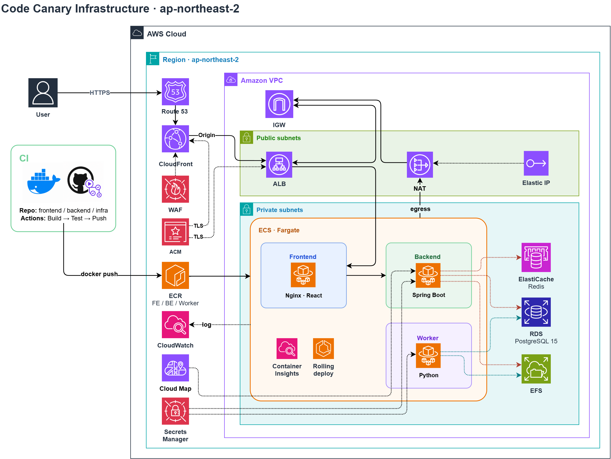
</figure>

### 구성의 축

| 축 | 역할 |
|----|------|
| **Terraform** | VPC · Public/Private · IGW · NAT · ALB · ECS · EFS · RDS · Redis · CloudFront · WAF · Route53 · ACM · Secrets · CloudWatch · Cloud Map |
| **ECS Fargate 3서비스** | Frontend(Nginx · React), Backend(Spring Boot), Worker(Python) |
| **Route53 · CloudFront · ACM** | DNS · CDN · TLS. WAF는 CloudFront에 붙는 옵션 |
| **EFS `/data`** | NVD/OSV 스테이징 baseline. Backend·Worker가 공유 마운트 |
| **RDS · ElastiCache** | PostgreSQL 15(Medallion), Redis 7(레이트 리밋 · 로그인 잠금) |
| **GitHub Actions → ECR → ECS** | FE/BE/Worker 이미지 push 후 rolling deploy · circuit breaker |

루키즈 최종(ONDE · ARGUS)이 EC2 · compose 중심이었다면, Code Canary는 **서버리스 컨테이너(Fargate)** 로 FE · BE · Worker를 나눴습니다. 장시간 collect/load는 Worker 태스크가 맡고, 화면·API는 그 결과를 RDS · EFS에서 읽습니다.

### Public / Private 분리

**Public subnet**에는 외부 진입점인 **ALB**와 Private 아웃바운드용 **NAT Gateway(+EIP)** 를 둡니다. **Private subnet**에는 **ECS Fargate** 태스크(Frontend · Backend · Worker)와 **RDS · Redis · EFS** 를 둡니다.

사용자는 ALB(또는 앞단 CloudFront)까지만 닿고, DB · 캐시 · 스테이징 파일 · Worker는 사설망 안에 둡니다. Private에서 ECR pull · NVD/OSV 수집이 필요할 때는 **NAT → IGW**로만 나가게 해 공격 표면을 좁혔습니다.

### 요청 라우팅

사용자 요청은 대략 다음 순서입니다.

```text
Browser
  → Route53
  → CloudFront (+ WAF, ACM TLS)   # go-live 시 tfvars로 활성
  → Public ALB
       /*        → ECS Frontend  → Nginx :80 (SPA)
                     /api/*      → Backend (Cloud Map upstream)
```

ALB 기본 타깃은 Frontend입니다. Nginx가 SPA를 서빙하고 `/api/*` 를 Backend로 프록시합니다. 운영자 콘솔 경로·로그인·`/api/admin/**` 은 신뢰 IP allowlist로 좁히는 구성을 둡니다.

Backend · Worker가 상태에 붙는 모습은 대략 이렇게입니다.

```text
Backend (Spring Boot)
  → RDS PostgreSQL     (management · bronze · silver · gold)
  → ElastiCache Redis  (레이트 리밋 · 로그인 잠금)
  → EFS /data          (staging 목록 조회 등)
  → Cloud Map          (서비스 디스커버리)

Worker (Python)
  → EFS /data          (collect baseline · load 원본)
  → RDS PostgreSQL     (bronze upsert · silver/gold SQL)
  → (egress) NAT → IGW (NVD API · OSV zip · ECR)
```

로컬 Compose의 볼륨·네트워크를 클라우드에서는 **EFS · RDS · Redis · NAT** 로 대응시킨 형태입니다. 컨테이너를 갈아끼워도 `/data` 스테이징과 DB 카탈로그는 남습니다.

### CI/CD — 이미지와 ECS rolling

프론트 · 백엔드 · Worker 모두 Linux 이미지로 올리고, 배포 파이프라인은 대략 한 갈래입니다.

```text
[FE / BE / Worker]
GitHub Actions
  → Docker build · push → ECR (frontend / backend / worker)
  → ECS service update
       rolling deploy · circuit breaker
```

시크릿은 워크플로에 박지 않고 **Secrets Manager** 에서 태스크 정의로 주입합니다. Container Insights · CloudWatch 로그로 태스크 상태를 보고, go-live 때는 HTTPS · CloudFront · WAF · operator CIDR을 Terraform tfvars에서 켭니다.

### Secret · 운영 경계

DB 비밀번호 · JWT · NVD API Key처럼 민감한 값은 이미지·레포에 하드코딩하지 않고 Secrets Manager 쪽으로 둡니다. 태스크 역할에는 ECR pull · 시크릿 읽기 · CloudWatch · EFS 등 필요한 권한만 최소로 붙입니다.

공개 analytics는 열어 두되, Roost(운영자 SPA · 로그인 · admin API)는 **IP allowlist** 로 막습니다. Redis가 죽어 레이트 리밋·로그인 잠금을 못 지키면 로그인을 열어 두지 않는 쪽(fail-closed)으로 맞췄습니다.

### 리소스 요약

| 구분 | 연동 | 역할 |
|------|------|------|
| 네트워크 | VPC / Public·Private / IGW / NAT | 진입점과 Fargate · 데이터 계층 분리 |
| DNS · 엣지 | Route53 / CloudFront / WAF / ACM | 도메인 · CDN · TLS · (옵션) WAF |
| 로드밸런서 | ALB | Frontend 타깃 · HTTP→HTTPS |
| 컴퓨트 | ECS Fargate (FE · BE · Worker) | SPA · API · 파이프라인 잡 |
| 데이터 | RDS PostgreSQL 15 / ElastiCache Redis 7 / EFS | Medallion · 리밋 · `/data` 스테이징 |
| 배포 · 관측 | ECR / Secrets Manager / Cloud Map / CloudWatch | 이미지 · 시크릿 · 디스커버리 · 로그 |

로컬 Compose와 클라우드가 **같은 세 프로세스 + Postgres + Redis + `/data`** 를 공유하는 점이 이 인프라의 축입니다. 차이는 오케스트레이션이 Docker인지 ECS인지, 볼륨이 로컬 bind인지 EFS인지뿐입니다.

# 7. 핵심 구현

인프라·라우팅은 **6번**에서, API 표면은 **5번**에서 다뤘으므로, 여기서는 앱에서 **왜 그렇게 짰는지**만 깊게 갑니다. **Medallion 배치**, **Explorer 통합 inventory**, **Roost 잡 큐** 세 축입니다.

### Medallion 배치 — collect · load · silver · gold

피드를 “한 번에 DB에 넣고 화면까지” 돌리면 재수집·재정제·차트 갱신이 한 트랜잭션처럼 꼬입니다. 그래서 단계를 **step_key**로 갈라 Worker만 실행하게 했습니다. FE · BE · Worker가 같은 키(`nvd-collect` … `gold-refresh`)를 공유합니다.

| Step key | 역할 |
|----------|------|
| `nvd-collect` / `osv-collect` | NVD API · OSV `all.zip` → `/data` baseline |
| `nvd-load` / `osv-load` | baseline → bronze upsert (`staging_ref` 필요) |
| `nvd-silver` / `osv-silver` | `silver.refine_*_batch` 루프 (기본 5k) |
| `gold-refresh` | 스냅샷·`v_explorer_inventory` · `intel_summary` 갱신 |

- **Collect ≠ Load** — 받기는 `/data`의 `NVD_BASELINE_*` / `OSV_BASELINE_*` 에만 쌓습니다. NVD는 full / incremental, OSV는 zip+manifest입니다. 적재는 운영자가 staging을 고른 뒤 별도 잡으로 돌립니다.
- **Bronze idempotency** — canonical JSON의 SHA-256 `content_hash`로 동일 본문은 skip하고, 바뀐 행만 upsert한 뒤 `processed_status='PENDING'`으로 되돌립니다. “다시 받아도 안 바뀐 CVE”를 재정제하지 않기 위함입니다.
- **Silver batch** — `PENDING|ERROR`만 partial index로 집어 `refine_*_batch`에 넘깁니다. 배치가 끝나면 남은 PENDING이 있으면 finalize가 실패해, 반쯤 정제된 상태로 gold를 돌리지 않게 막습니다.
- **Gold full refresh** — silver를 조인해 스냅샷·MV를 통째로 갱신합니다. 공개 API는 bronze/silver를 직접 조인하지 않고 이 층만 읽습니다.

효과는 **다시 받기 / 다시 풀기 / 화면만 갱신**을 서로 다른 잡으로 돌릴 수 있다는 점입니다.

### Explorer 통합 inventory — MV · soft link

NVD CVE와 OSV(GHSA 등)를 한 목록에서 보고 싶었지만, silver hub 스키마는 다릅니다. 억지로 한 마스터 테이블에 합치지 않고, **`gold.v_explorer_inventory`** 에 `cve_enriched` ∪ `osv_enriched` 를 올린 뒤 Explorer는 MV만 조회합니다.

- **목록 계약** — `ExplorerQueryParams`(검색·source·vector·severity·ecosystem·severity·KEV·기간) → `search_vector @@ plainto_tsquery` + 필터. 페이지 기본 50건.
- **중복 CVE 제거** — OSV 중 ID가 `CVE-%`인 행은 NVD가 이미 갖고 있으므로 inventory에서 빼, 같은 CVE가 두 줄로 나오지 않게 했습니다.
- **상세** — `GET /api/analytics/explorer/{vulnId}`가 MV 메타를 읽고, 소스에 따라 silver child(설명·CVSS·CWE·affected 등)를 병렬로 붙입니다.
- **Soft link** — OSV→CVE FK는 두지 않습니다. 모든 OSV가 CVE를 갖지 않고 ID 표기도 제각각이라, `osv_identifiers`의 ALIAS/RELATED `target_id`로 상세에서만 건너뛰게 했습니다.

“한 화면에서 비교”는 **UI 라우트를 하나로 모은 것**이고, 저장은 여전히 CVE hub · OSV hub가 갈라져 있습니다.

### Roost 잡 큐 — enqueue · claim · cancel

장시간 collect/load/silver/gold를 API 요청 스레드에서 돌리면 타임아웃·중복 실행이 납니다. Roost는 **큐에만 넣고**, Worker가 폴링해 실행합니다.

- **Enqueue** — `POST /api/admin/pipeline/jobs` → `management.pipeline_jobs`(`queued`, `step_key`, `staging_ref`, `collect_mode`). 동시에 active(queued/running)는 하나입니다. 새 잡을 넣기 전에 stale running을 먼저 회수합니다.
- **Claim** — Worker가 `FOR UPDATE SKIP LOCKED`로 다음 잡을 집고, heartbeat(기본 60s) · cancel watcher(2s)를 켠 뒤 `run_step` 핸들러를 호출합니다. heartbeat가 오래된 running은 stale로 실패 처리합니다.
- **Stop** — collect 단계만 `cancel_requested_at`을 받습니다. queued면 즉시 실패, running이면 Worker가 `JobCancelledError`로 빠져나옵니다. load/silver/gold는 중간에 끊으면 카탈로그가 반쯤 깨질 수 있어 중단 API를 열지 않았습니다.
- **Stuck release** — 운영자가 직접 running을 일괄 실패 처리하고 collect 쪽 `ingestion_sync`를 리셋합니다.
- **Auth 경계** — `/api/analytics/**` 공개, `/api/admin/**` 은 `ROLE_ADMIN` + JWT(HttpOnly 쿠키) + CSRF. Redis 레이트 리밋·로그인 잠금이 죽으면 로그인을 열어 두지 않습니다(fail-closed).

세 축을 한 줄로 모으면, **스테이징·bronze 해시로 원본을 지키고 → silver 배치로 정규화하고 → gold MV로 공개 탐색하며 → Roost 큐로만 무거운 잡을 돌린다**는 흐름입니다.

# 8. 화면으로 보는 기능

대시보드 Analytical Deep-dive 탭부터 Explorer · Roost까지, 공개 탐색과 운영 화면이 어떻게 이어지는지 봅니다. (홈 상단 동기화·메트릭·KEV 카드는 **1. 메인 화면**의 `fig1`과 같습니다.)

### 1. Source Profile — 소스 비중 · 성장

Analytical Deep-dive의 첫 탭입니다. 도넛으로 OSV · NVD · MAL 비중과 총 intel 건수를 보고, 오른쪽 시계열로 소스별 성장(2012–2026)을 봅니다. gold 대시보드 집계를 그대로 읽는 화면입니다.

<figure class="article-figure-center article-figure-center--wide">
  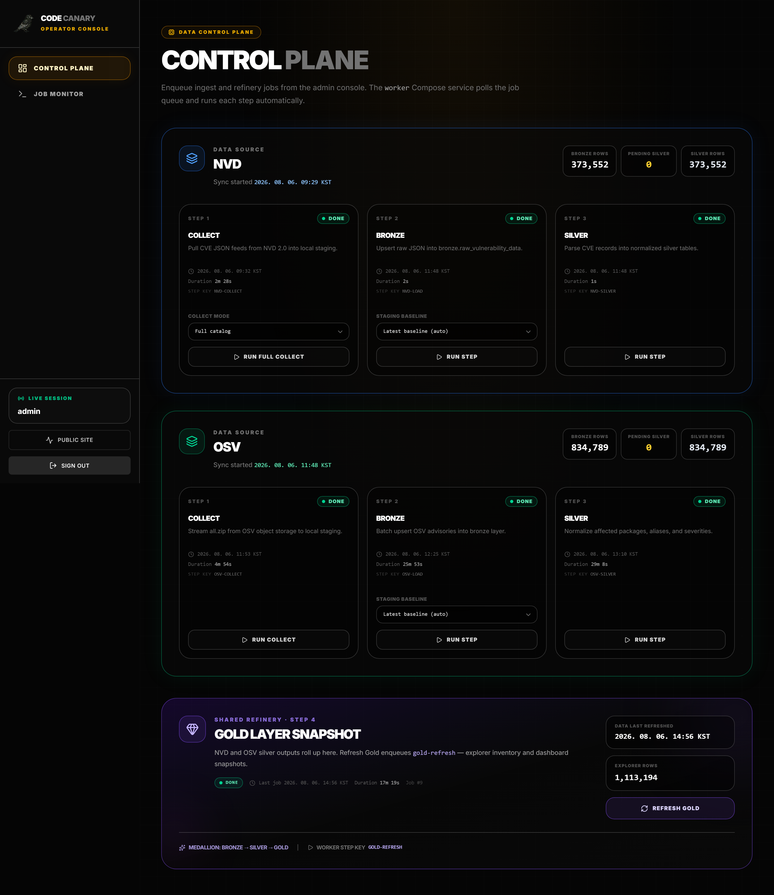
</figure>

### 2. Risk Profile — 심각도 · 유입 타임라인

심각도(Critical~Low) 비중과 연도별 유입 추이를 나란히 둡니다. 평균 점수와 severity band가 한눈에 보이게 해, “지금 카탈로그가 얼마나 위험한지”를 먼저 잡습니다.

<figure class="article-figure-center article-figure-center--wide">
  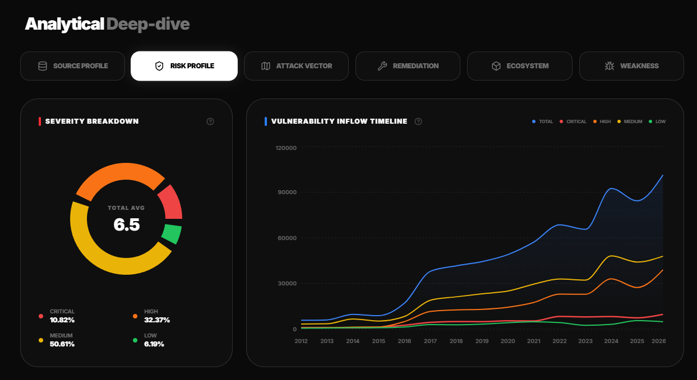
</figure>

### 3. Attack Vector — 벡터 분포 · 진화

NETWORK · LOCAL · ADJACENT · PHYSICAL 분포와, 같은 축의 연도별 진화 차트입니다. `/api/analytics/vector` gold 집계를 화면으로 옮긴 탭입니다.

<figure class="article-figure-center article-figure-center--wide">
  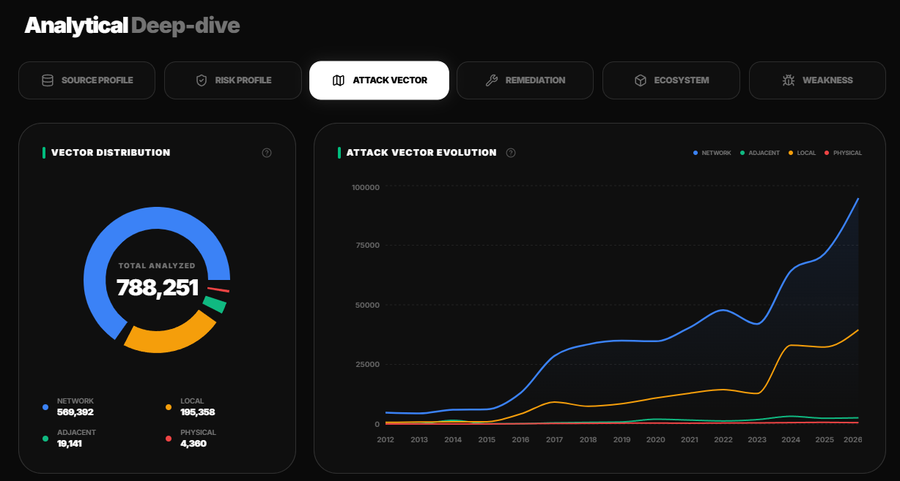
</figure>

### 4. Remediation — 조치 준비도 · 성숙 추이

Patch Ready · Unpatched · Solution Provided 등 조치 상태 비중과, 연도별 stacked 추이입니다. “얼마나 많은 건이 패치 가능한지”를 카탈로그 단위로 봅니다.

<figure class="article-figure-center article-figure-center--wide">
  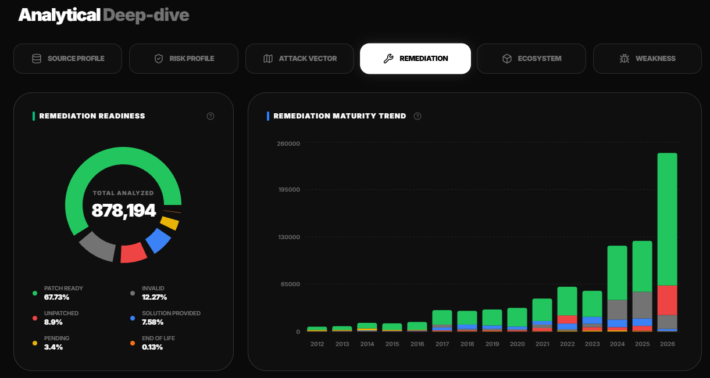
</figure>

### 5. Ecosystem — 생태계 분포 · 연간 추이

npm · Ubuntu · Debian · PyPI 등 생태계별 건수·비율 표와 stacked 연간 추이입니다. OSV affected 쪽이 특히 잘 보이는 탭입니다.

<figure class="article-figure-center article-figure-center--wide">
  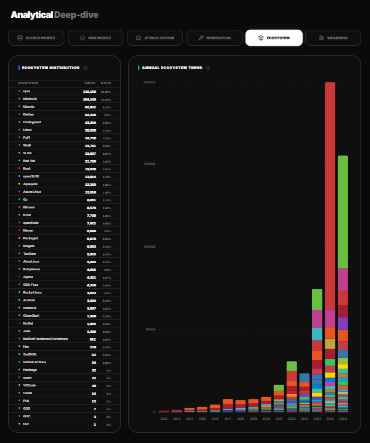
</figure>

### 6. Weakness — CWE · 카테고리

왼쪽 pillar(Injection · Memory Safety · Auth 등)로 묶고, 오른쪽 테이블에 CWE ID · 이름 · 건수를 둡니다. 검색으로 약점을 좁힐 수 있습니다.

<figure class="article-figure-center article-figure-center--wide">
  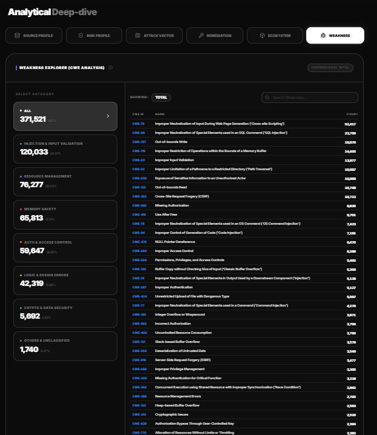
</figure>

### 7. Inventory Explorer — 통합 목록

NVD·OSV(·MAL)를 한 피드로 스크롤합니다. 카드마다 소스 배지·ID·날짜·KEV due·요약과 CVSS · status · vector · remediation · weakness · ecosystem 칩이 붙습니다. gold `v_explorer_inventory` 목록 API 결과입니다.

<figure class="article-figure-center article-figure-center--wide">
  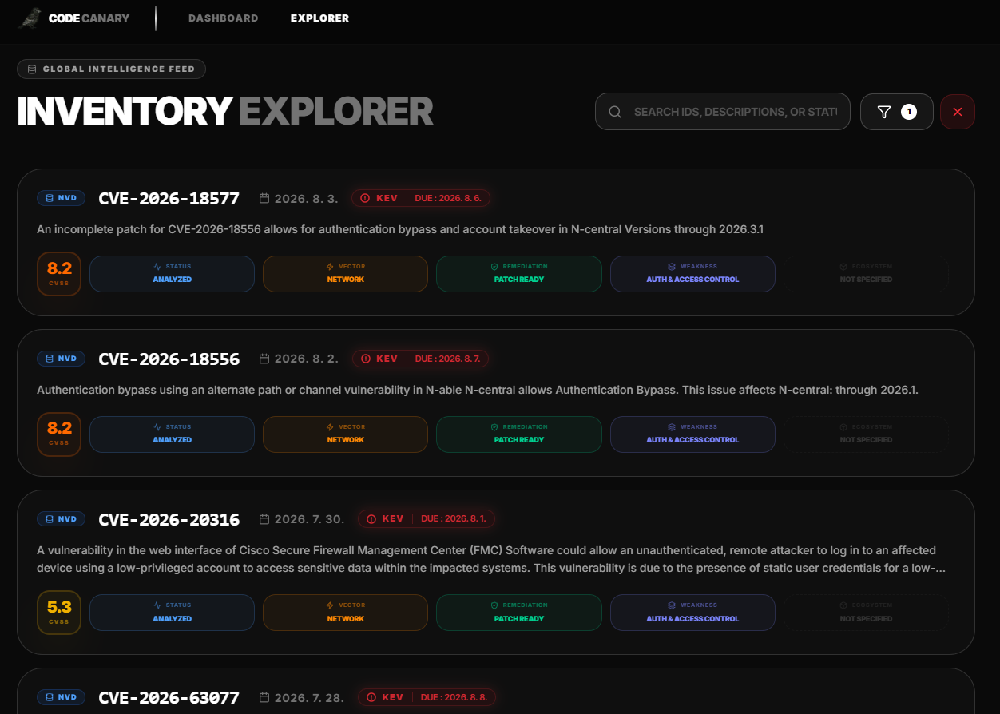
</figure>

### 8. Explorer 필터 — severity · source · KEV

검색 옆 필터 패널입니다. severity · source · vector · status · remediation · weakness · ecosystem · 게시일 구간 · **CISA KEV ONLY** 토글이 `ExplorerQueryParams`와 1:1로 맞습니다.

<figure class="article-figure-center article-figure-center--wide">
  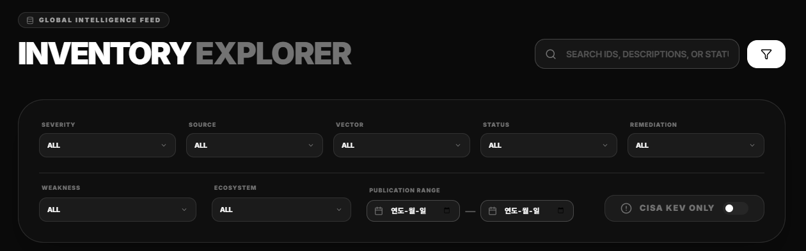
</figure>

### 9. Explorer 상세 — CVSS · Attack Context · KEV

목록에서 한 건을 고르면 같은 라우트 상세로 들어갑니다. CVSS 게이지·Exploitability/Impact, Attack Context, Impact, CWE, 영향 제품, 참고 링크가 이어지고, KEV면 Required Action 블록이 붙습니다. soft link(ALIAS/RELATED)로 다른 ID로 넘어갈 수 있습니다.

<figure class="article-figure-center article-figure-center--wide">
  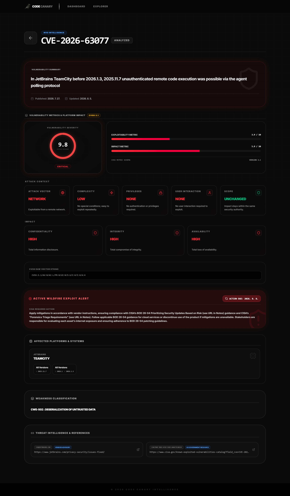
</figure>

### 10. Roost Control Plane — 단계별 enqueue

운영자 로그인 뒤 Control Plane입니다. NVD · OSV 각각 Collect → Bronze(load) → Silver 카드와, 아래 공유 **Gold Layer Snapshot**이 있습니다. staging · collect mode를 고른 뒤 RUN / REFRESH GOLD로 `pipeline_jobs`에 넣고, Worker step key가 카드에 그대로 보입니다.

<figure class="article-figure-center article-figure-center--wide">
  
</figure>

### 11. Job Monitor — Worker Activity · 로그

Job Monitor의 Worker Activity입니다. `pipeline_job_logs`를 시간순으로 보여 주고(auto-refresh), Control Plane에서 넣은 collect/load/silver/gold 시작·성공·실패를 추적합니다.

<figure class="article-figure-center article-figure-center--wide">
  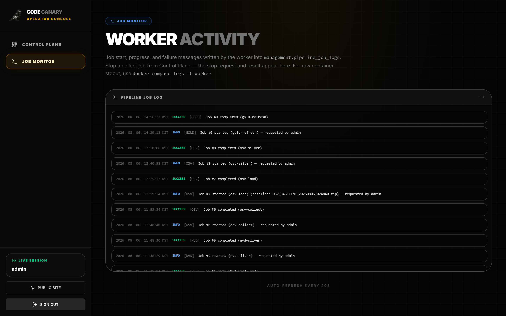
</figure>

공개 Deep-dive · Explorer와 운영 Roost가 같은 Medallion(gold) 결과 위에 얹혀 있고, 화면만 경로·권한으로 갈라져 있습니다.

# 9. 중요했던 고민 — 보안 경계와 Medallion

기능을 붙이다 보면 “일단 되게”만 남기기 쉽습니다. Code Canary에서는 **누가 무엇을 만질 수 있는지**, 그리고 **백만 건을 어떻게 집계할지**가 먼저 벽에 부딪혔고, 그 두 축을 따로 붙잡아 두었습니다.

### 정보보안 — 공개 탐색과 운영을 갈라 막기

취약점 카탈로그는 공개해도, **파이프라인을 돌리는 손**은 공개하면 안 됩니다. 그래서 보안은 “기능 하나”가 아니라 **표면을 나누는 일**로 잡았습니다.

**인증 · 세션**

- 운영자 JWT는 `localStorage`가 아니라 **HttpOnly 쿠키**(`SameSite=Strict`, path를 admin API로 한정)에 둡니다. XSS로 스크립트가 읽어도 토큰이 JS에 없습니다.
- 상태 변경은 **CSRF double-submit**과 함께 갑니다. CORS는 쓰지 않고 Nginx same-origin 프록시로 FE·BE를 묶었습니다.
- 로그아웃 때는 `jti`를 `revoked_tokens`에 넣어, 쿠키가 남아 있어도 재사용하지 못하게 했습니다.
- Spring Security는 `/api/admin/**`에 `ROLE_ADMIN`을 요구하고, **나머지 API는 `denyAll`** 입니다. “열어 둔 줄 몰랐던 엔드포인트”를 기본값으로 막았습니다.

**남용 · 장애 시 열리지 않기**

- 로그인 실패 잠금 · admin/analytics 레이트 리밋은 **Redis sliding window**입니다. Redis가 죽으면 한도를 건너뛰지 않고 **요청을 거절(fail-closed)** 합니다. “캐시가 없으니 일단 통과”가 로그인·스크래핑에 바로 구멍이 되기 때문입니다.
- Nginx에도 login · admin · analytics 구간별 `limit_req`를 두고, 신뢰 프록시 CIDR 밖의 `X-Forwarded-For`는 믿지 않습니다.

**운영 표면 · 엣지**

- 콘솔 경로는 `/admin` 고정이 아니라 빌드 시 시크릿으로 넣고(`VITE_ADMIN_*`, 기본 `/roost`), `robots.txt`·noindex로 검색 노출을 줄였습니다.
- go-live 때는 **operator CIDR allowlist**(Nginx · WAF)로 `/roost` · `/api/auth/login` · `/api/admin/**` 을 신뢰 IP만 통과시키게 둡니다. HTTPS · CloudFront · WAF Common/KnownBadInputs도 tfvars로 켭니다.
- RDS·Redis는 Private, Backend는 Cloud Map으로만 찾고, 시크릿은 Secrets Manager(로컬은 Docker secrets)로 주입합니다. Actuator는 health만 노출합니다.

**데이터 · 입력 경계**

- Explorer 검색은 길이·페이지 상한과 LIKE escape로 과한 쿼리를 막고, staging baseline·zip 경로는 정규식·path-safe 검사로 traversal을 막습니다.
- silver refine은 bronze에 `PENDING`/`ERROR`가 남아 있으면 “정제 완료”로 올리지 않습니다. 반쯤 깨진 카탈로그를 gold에 올리는 쪽이 더 위험하다고 봤습니다.

정리하면, analytics는 공개 조회로 두고 Roost·admin은 인증·한도·IP로 막았으며, Redis나 시크릿이 빠져도 로그인이 그냥 통과하지 않게 맞춰 두었습니다.

### 데이터베이스 — 타임아웃에서 만난 Medallion

처음에는 Medallion이라는 이름을 몰랐습니다. NVD·OSV를 **정제해서 표로만** DB에 넣으면 된다고 생각했습니다. 정규화된 silver만 있어도 Explorer 상세는 그럭저럭 나왔습니다.

문제는 **통계**였습니다. 카탈로그가 **약 100만 건**에 가까워지자, 대시보드용으로 silver를 그때그때 `GROUP BY` · 연도별 trend · 소스 비중을 돌리면 쿼리가 길어지고 **타임아웃**이 반복됐습니다. “정제만 잘하면 화면은 빠르다”는 가정이 깨진 순간입니다.

그래서 먼저 떠올린 해법은 단순했습니다. **대시보드·Deep-dive용 집계 테이블을 따로 두자.** 화면은 매번 원본(또는 silver)을 전수 스캔하지 말고, 미리 만들어 둔 분포·trend·요약만 읽으면 됩니다. Explorer 목록도 조인이 무거운 순간이 있어, 나중에 **통합 inventory MV**로 검색 레이어를 분리했습니다.

그 구조를 정리하다 보니, 이미 데이터 엔지니어링에서 쓰는 이름과 같았습니다. **bronze(원본 보관) → silver(정규화 표) → gold(소비·집계)**. “통계용 테이블을 떼 둔다”가 곧 gold이고, 받기·풀기·화면 갱신을 잡으로 가른 이유가 여기에 맞닿아 있습니다.

- **bronze** — 원본 JSONB와 content-hash. 다시 받아도 안 바뀐 건 skip, 바뀐 건 `PENDING`으로 재정제.
- **silver** — CVE/OSV hub + child. 상세·조인의 기준 표.
- **gold** — `intel_summary` · dashboard snapshots · `v_explorer_inventory`. 공개 API가 실제로 읽는 층.

원본을 한 테이블에 다 욱여넣고 화면마다 집계하면, 수집 한 번이 통계·검색·운영 이력까지 한꺼번에 흔듭니다. **층이 나뉘어 있어야** “다시 받기 / 다시 풀기 / 차트만 갱신”이 가능해졌고, 100만 건 위에서 대시보드가 버티는 이유도 같습니다. Medallion을 교과서에서 고른 게 아니라, **타임아웃을 피하려다 층이 생기고, 나중에 이름이 붙은** 쪽에 가깝습니다.

보안 쪽은 운영 API·콘솔 접근을 줄이는 일이었고, Medallion은 집계·검색을 silver 전수 스캔에서 빼내는 일이었습니다. 둘 다 기능을 붙인 뒤에야 제대로 손댄 부분입니다.

# 10. 마무리 소감

루키즈 이후로는 화면만 잘 보이게 만드는 쪽이 익숙했습니다. Code Canary는 그다음으로, **React · Spring Boot · Python Worker · Postgres · Redis · Compose · Terraform/ECS** 를 한 레포에서 혼자 이어서 돌려 본 프로젝트입니다. NVD와 OSV를 한곳에서 보고 싶다는 목적에서 시작했지만, 실제로는 피드 수집·적재·정제·공개 Explorer·운영 Roost까지 맞추는 일이 더 컸습니다. API 경로만 열어 두는 것과, 백만 건에 가까운 카탈로그가 대시보드·검색으로 버티게 만드는 일은 달랐습니다.

설계를 바꾼 건 문서보다 **실데이터** 쪽이 많았습니다. silver에 정제만 잘 넣으면 화면은 빠를 줄 알았는데, 통계 쿼리가 타임아웃 나면서 집계 계층을 따로 두게 됐고, 그게 나중에 Medallion과 같다는 걸 알았습니다. NVD 메트릭에 CVSS가 아닌 SSVC가 섞여 `varchar`가 깨지거나, Windows CRLF 때문에 프론트 entrypoint가 죽거나, read-only rootfs에서 nginx 설정을 고치려다 막히는 식의 문제도 스펙 밖이었습니다. “스키마대로 넣으면 된다”가 아니라, **피드·컨테이너·런타임이 가정과 다를 때 어디를 고칠지**를 계속 고르는 과정에 가까웠습니다.

혼자 전 층을 밀다 보니 프론트·백엔드·DB·인프라 중 한곳만 편할 때 다른 곳이 바로 티가 났습니다. 그래도 NVD·OSV를 같은 Explorer에서 넘나들고, Roost에서 파이프라인을 나눠 돌리며, 공개 조회와 운영 콘솔을 권한으로 가른 형태까지는 스스로 끝까지 맞춰 볼 수 있었습니다. 다음에도 복잡한 데이터를 다루게 된다면, 이번처럼 **먼저 돌아가게 만든 뒤 실데이터가 가리키는 경계를 다시 긋는** 순서를 더 일찍 의식하고 싶습니다.
