---

# 서론

**암기를 도와주는 웹 서비스**를 만들고 싶어서 시작한 프로젝트입니다. 처음에는 HTML · `localStorage` 수준으로 아주 단순하게 페이션스(다층) 플래시카드 플레이만 돌렸고, 그다음 **프론트·백엔드를 나눠** 계정·덱·진행도·엑셀까지 붙인 형태로 올렸습니다. 학습 규칙 자체는 이미 쓰이던 페이션스형 암기 방식을 웹에 옮긴 것이고, 그 컨셉을 제가 고안한 것은 아닙니다.

한 장씩만 넘기는 암기가 아니라, **여러 층(레벨)에 카드를 나눠 두고** “기억 / 까먹음 / 다음”으로 올려·내리는 **페이션스형 학습 보드**입니다. **Patience Flashcard**는 로그인 후 공용 시드 덱과 개인 덱을 고르고, 같은 엔진으로 학습·진행도를 저장합니다.

지금은 React(Vite) 프론트와 Spring Boot API, PostgreSQL(유저·덱·카드·`study_progress`), 이메일 OTP 가입과 JWT(HttpOnly 쿠키)로 구성되어 있고, 로컬은 Docker Compose로 FE · BE · DB · Mailpit까지 한 번에 올립니다.

📦 **GitHub:** [WEB_Patience-Flashcard](https://github.com/Hyeonseok93/WEB_Patience-Flashcard)

# 1. 메인 화면

<figure class="article-figure-center article-figure-center--wide">
  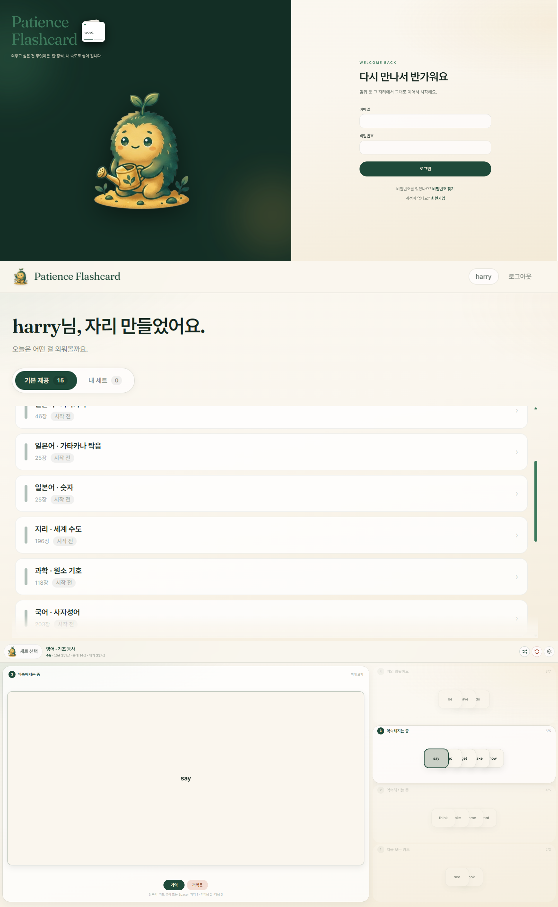
</figure>

첫 흐름은 **가입·로그인 → 세트 선택(기본 제공 / 내 세트) → 다층 플레이**입니다. 기본 제공 덱은 누구나 읽고 플레이만 하고, 내 세트는 이름 변경·카드 CRUD·xlsx 교체까지 됩니다. 진행 중이던 덱은 목록에서 이어하기·랜덤·순서 시작으로 다시 들어갈 수 있습니다.

# 2. 왜 만들었나

### 암기를 도와주는 웹을 만들고 싶었다

자격증·단어처럼 **반복해서 외워야 하는 것**을, 브라우저에서 같은 규칙으로 돌리고 싶었습니다. 한 장 넘기기보다 **층에 쌓아 두고 기억·까먹음으로 올리고 내리는** 페이션스형 보드가 그 목적에 맞아서, 그걸 웹으로 옮기는 쪽을 골랐습니다.

### 처음엔 아주 단순했다

첫 버전은 서버 없이 **정적 페이지 + 로컬 저장**만으로 플레이를 돌리는 형태였습니다. 세트 가져오기와 보드만 되면 된다고 보고, 인증·DB·권한은 두지 않았습니다. “일단 암기 루프가 돌아가게”가 우선이었습니다.

### 프론트·백엔드로 제대로 올렸다

쓰다 보니 계정마다 진행도를 남기고, 기본 제공 세트와 내가 만든 세트를 가르고, 엑셀로 카드를 넣고 빼고 싶어졌습니다. 그래서 React SPA와 Spring Boot API · PostgreSQL로 나눠 **가입(OTP) · JWT 세션 · BUILTIN/USER 덱 · study_progress · xlsx** 까지 붙인 서비스 형태로 업그레이드했습니다. Nginx가 SPA와 `/api`를 묶고, 로컬 메일은 Mailpit(`/mail`)으로 확인합니다.

# 3. 서비스 흐름

Patience의 핵심 흐름은 보드만 돌리는 데서 끝나지 않습니다. **가입 · OTP → 로그인 → 세트 선택 → 다층 플레이 → 진행 저장 · (내 세트) 편집**으로 이어지며, 공용 시드와 개인 덱이 같은 플레이 엔진 위에서 만납니다.

<figure class="article-figure-center article-figure-center--full">
  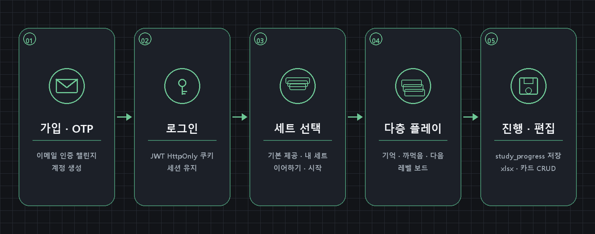
</figure>

### 1. 가입 · OTP로 계정을 만든다

이메일로 OTP 챌린지를 보내고 검증한 뒤 가입합니다. 로컬에서는 Mailpit(`/mail`)으로 메일을 확인하고, 공개 환경에서는 실제 SMTP를 씁니다.

### 2. 로그인으로 세션을 연다

로그인 후 JWT를 **HttpOnly 쿠키**로 둡니다. React는 `/api`를 통해 Spring Boot를 호출하고, Nginx가 SPA와 API를 같은 오리진으로 묶습니다.

### 3. 세트를 고른다

**기본 제공(BUILTIN)** 과 **내 세트(USER)** 탭에서 덱을 고릅니다. 활성 진행이 있으면 이어하기가 보이고, 랜덤·순서 시작도 여기서 고릅니다.

### 4. 다층 보드로 학습한다

카드를 층에 나눠 두고 기억이면 위로, 까먹으면 아래로 보냅니다. “다음”으로 대기열에서 새 카드를 끌어오며, 프론트 `engine` / `actions`가 이 규칙을 구현합니다.

### 5. 진행을 남기고 내 세트를 고친다

`(user, deck)` 단위 `study_progress`에 levels/queue와 클리어 횟수를 저장합니다. 내 세트만 이름 변경·카드 CRUD·xlsx 교체가 되고, BUILTIN은 읽기·플레이만 됩니다.

# 4. 도메인 · ERD

핵심은 **users · decks · cards · study_progress** 와 인증용 **email_challenges · rate_limit_events** 입니다. 덱은 `BUILTIN`(공용 시드)과 `USER`(소유자)로 갈라지고, 진행도는 `(user_id, deck_id)` 단위로 남습니다.

<figure class="article-figure-center article-figure-center--full">
  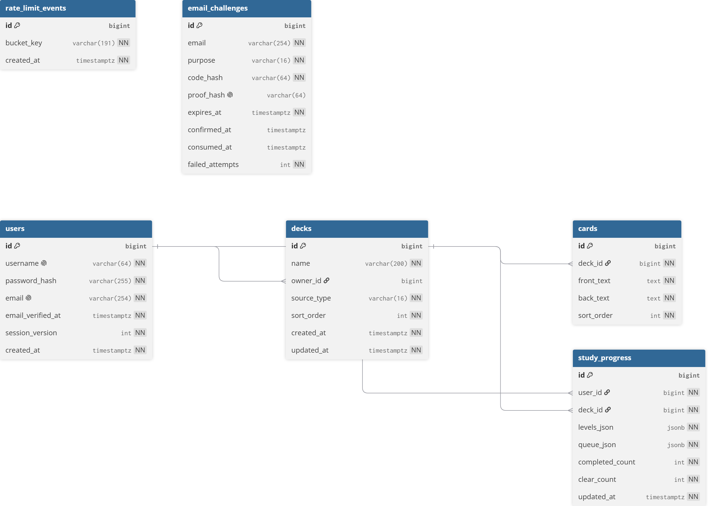
</figure>

### 핵심 엔티티

| 테이블 | 역할 |
|--------|------|
| **users** | 계정. username · email · password_hash · `session_version`(리셋 시 JWT 무효) |
| **email_challenges** | 가입·비밀번호 재설정 OTP 챌린지 |
| **rate_limit_events** | IP/버킷 기준 요청 한도 |
| **decks** | `source_type = BUILTIN \| USER`. BUILTIN은 `owner_id` null |
| **cards** | 덱 소속 front/back/`sort_order` |
| **study_progress** | 층·대기열 JSON + completed/clear count. `(user, deck)` 유니크 |

### 관계

1. **users 1—N decks** — USER 덱만 `owner_id`로 연결. BUILTIN은 소유자 없음.  
2. **decks 1—N cards** — 카드는 덱 삭제 시 CASCADE.  
3. **users × decks 1—1 study_progress** — 플레이 상태와 클리어 횟수를 계정·덱 단위로 보관.  
4. **email_challenges / rate_limit_events** — 유저 FK 없이 이메일·버킷 키로 인증 흐름을 보조합니다.

# 5. 주요 API

프론트가 쓰는 REST는 `/api` 아래에 모았습니다. 아래는 **실제 컨트롤러 매핑** 기준 요약입니다. 로그인·세션은 JWT를 **HttpOnly 쿠키**로 두고, 응답 body에는 토큰을 넣지 않습니다. 덱·진행·카드 변경 API는 로그인 사용자만 호출합니다.

### Auth · Session

| Method | Endpoint | 설명 |
|--------|----------|------|
| GET | `/api/auth/username-available` | 사용자명 사용 가능 여부 (형식·중복, rate limit) |
| GET | `/api/auth/email-available` | 이메일 형식 검사 (enumeration 완화 — 존재 여부는 노출하지 않음) |
| POST | `/api/auth/email-challenge` | 가입용 OTP 메일 발송 |
| POST | `/api/auth/email-confirm` | OTP 검증 · proof 쿠키/상태 준비 |
| POST | `/api/auth/signup` | 회원가입 · JWT 쿠키 발급 |
| POST | `/api/auth/login` | 로그인 · JWT HttpOnly 쿠키 발급 |
| POST | `/api/auth/forgot-password` | 비밀번호 재설정 OTP 발송 |
| POST | `/api/auth/reset-password` | OTP·새 비밀번호로 재설정 · `session_version` 증가 |
| POST | `/api/auth/logout` | 로그아웃 · 쿠키 클리어 |
| GET | `/api/auth/me` | 현재 세션 사용자 |

가입 전에는 **이메일 챌린지 → 확인 → signup** 순이고, 재설정도 같은 OTP 경로를 씁니다. IP 기준 `rate_limit_events`로 남용을 막습니다.

### Decks · Cards · xlsx

| Method | Endpoint | 설명 |
|--------|----------|------|
| GET | `/api/decks/builtin` | 기본 제공(BUILTIN) 세트 목록 |
| GET | `/api/decks/mine` | 내 세트(USER) 목록 |
| GET | `/api/decks/{deckId}` | 접근 가능한 덱 상세(카드 포함) |
| POST | `/api/decks` | 빈 내 세트 생성 |
| POST | `/api/decks/{deckId}/copy` | 접근 가능한 덱을 내 세트로 복사 |
| POST | `/api/decks/import` | xlsx 업로드로 내 세트 생성 (`multipart`) |
| GET | `/api/decks/{deckId}/export` | 내 세트 xlsx 다운로드 |
| PUT | `/api/decks/{deckId}/name` | 내 세트 이름 변경 |
| PUT | `/api/decks/{deckId}/import` | 내 세트 카드를 xlsx로 교체 |
| POST | `/api/decks/{deckId}/cards` | 카드 추가 |
| PUT | `/api/decks/{deckId}/cards/{cardId}` | 카드 수정 |
| DELETE | `/api/decks/{deckId}/cards/{cardId}` | 카드 삭제 |
| DELETE | `/api/decks/{deckId}` | 내 세트 삭제 |

조회·복사는 **BUILTIN 또는 본인 USER**만 (`requireAccessible`). 이름 변경·엑셀 교체·카드 CRUD·삭제는 **본인 USER**만 (`requireOwnedUserDeck`) — BUILTIN 수정은 403입니다. xlsx는 원본을 보관하지 않고 파싱한 카드만 DB에 넣으며, 용량·행 수·셀 길이를 서버에서 검증합니다.

### Progress

| Method | Endpoint | 설명 |
|--------|----------|------|
| GET | `/api/decks/{deckId}/progress` | 내 진행도 조회 (levels/queue · clear 등) |
| PUT | `/api/decks/{deckId}/progress` | 진행도 upsert (플레이 중 저장) |
| DELETE | `/api/decks/{deckId}/progress` | 플레이 상태 리셋 (`clear_count`는 정책에 따라 유지) |

진행도는 `(user_id, deck_id)` 단위입니다. 활성 진행이 있을 때만 세트 목록에 **이어하기**가 보이고, 클리어 stub여도 완료 스냅샷이면 승리 화면을 복원할 수 있게 맞춰 두었습니다.

# 6. 인프라 아키텍처

공개 클라우드에 올려 서비스를 돌리려 만든 프로젝트는 아닙니다. **로컬에서 쓰기**가 목적이고, 인프라도 그 범위에 맞춰 두었습니다. FE·BE Dockerfile과 Compose로 한 번에 올리고, GitHub Actions CI로 프론트 lint·test·build와 백엔드 `gradlew test`까지 돌리는 정도입니다. Terraform·ECS 같은 배포 스택은 없습니다.

```text
Browser ──► nginx (FE :80)
               ├─ static SPA (React)
               ├─ /api/*  ──► Spring Boot (:8080) ──► PostgreSQL
               └─ /mail/  ──► Mailpit (로컬 인증 메일 UI)
```

로컬 Compose는 **frontend · backend · db · mailpit** 을 올립니다. nginx가 SPA를 서빙하고 `/api`는 Spring Boot로, `/mail`은 Mailpit UI로 넘깁니다. 공개 배포를 가정한다면 Mailpit을 빼고 실제 SMTP를 쓰고, `SPRING_PROFILES_ACTIVE=prod` 와 고유 `JWT_SECRET` / DB 비밀번호 / HTTPS 쿠키를 맞추면 됩니다. Actuator health는 밖에 열지 않는 쪽을 권장합니다.

# 7. 핵심 기능

API·도메인·Compose는 앞에서 다뤘으므로, 여기서는 앱에서 **왜 그렇게 짰는지**만 잡습니다. **다층 학습 엔진**, **BUILTIN/USER 권한**, **진행도 보존**, **메일 OTP**, **xlsx** 다섯 축입니다.

### 다층(레벨) 페이션스형 학습 엔진

이미 쓰이던 페이션스 플래시카드 규칙을 웹에 옮긴 것입니다. 컨셉을 새로 고안한 것은 아니고, 카드를 층에 쌓아 두고 기억하면 위로·까먹으면 아래로 보내는 보드를 React에서 돌립니다.

- 프론트 `engine` / `actions`가 규칙의 구현 출처이고, 서버에는 카드 **id** 기준으로 진행을 저장합니다.
- 시작 시 층 수(2~4)를 고르고, 클리어 횟수는 덱별 배지로 남깁니다.
- “다음”으로 대기열에서 새 카드를 끌어오며, 클리어 시 승리 화면으로 이어집니다.

한 장 넘기기 UI가 아니라 **같은 규칙을 브라우저·계정·진행도와 묶은 것**이 이 앱의 중심입니다.

### BUILTIN / USER 덱 분리와 소유권

시드 덱은 모두가 읽고 플레이만 하고, 내 세트만 수정·엑셀·삭제가 됩니다. API에서 조회·변경 경로를 갈라 두었습니다.

- `requireAccessible` — 공용(BUILTIN) 또는 본인 USER 덱만 조회·진행·복사.
- `requireOwnedUserDeck` — 이름 변경·카드 CRUD·xlsx·삭제는 USER+본인만 (BUILTIN은 403, 타인 덱은 404).

목록의 **기본 제공 / 내 세트** 탭이 이 권한 모델과 그대로 맞습니다.

### 진행도 JSON + 클리어 이력

`study_progress`에 levels/queue JSON과 `completed_count` / `clear_count`를 둡니다. `(user_id, deck_id)`마다 한 줄입니다.

- 활성 진행이 있을 때만 세트 목록에 **이어하기**가 보입니다.
- 카드 편집·리셋은 플레이 상태만 비우고 `clear_count`는 남길 수 있습니다.
- 클리어 stub(`exists=false`)여도 완료 스냅샷이면 새로고침 시 승리 화면을 복원합니다.

보드 상태는 프론트에서 돌리고, **이어하기·클리어 배지**만 서버에 맡기는 형태입니다.

### 메일 OTP 가입 · 비밀번호 재설정

가입 전 메일 인증을 두고, 재설정도 같은 OTP 검증 경로를 씁니다. JWT는 HttpOnly 쿠키로만 둡니다.

- 이메일 가용성은 형식만 검사하고, 챌린지·SMTP 실패 응답 본문을 통일해 enumeration을 완화합니다.
- IP 기준 `rate_limit_events`로 남용을 막고, 비밀번호 재설정 시 `session_version`을 올려 기존 JWT를 무효화합니다.
- 로컬은 Mailpit(`/mail`)으로 OTP를 확인하고, 공개 시에는 실제 SMTP로 바꿉니다.

### xlsx 가져오기 · 내보내기

내 세트를 엑셀로 만들고 고치기 쉽게 두었습니다. 원본 파일은 보관하지 않고 파싱한 카드만 DB에 넣습니다.

- 용량·행 수·셀 길이를 서버에서 검증합니다.
- import로 새 세트를 만들거나, 기존 내 세트를 xlsx로 **교체**할 수 있습니다.
- export는 본인 USER 덱만 가능합니다.

다섯 축을 한 줄로 모으면, **페이션스 보드를 FE에서 돌리고 → BUILTIN/USER로 권한을 가르고 → study_progress로 이어하기·클리어를 남기며 → OTP·JWT로 계정을 열고 → xlsx로 카드를 넣는다**는 흐름입니다.

# 8. 화면으로 보는 기능

가입·세트·플레이·편집·게이트까지, 화면이 코드·API와 어떻게 이어지는지 봅니다. (세트 선택·플레이 전체 분위기는 **1. 메인 화면**의 `fig1`과 같습니다.)

### 1. 로그인 — Welcome back

`/login`입니다. `AuthStage`로 좌측 마스코트·카피와 우측 폼을 나누고, `AuthForm`이 이메일·비밀번호를 받아 `api.login` → JWT HttpOnly 쿠키 후 `/`로 보냅니다. 이미 세션이 있으면 `Navigate`로 홈으로 보냅니다.

<figure class="article-figure-center article-figure-center--wide">
  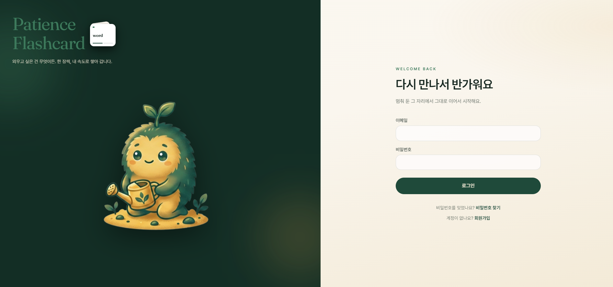
</figure>

하단에서 **비밀번호 찾기**(`/forgot-password`)와 **회원가입**(`/signup`)으로 갈립니다. 가입·재설정 직후 `location.state.notice`가 있으면 같은 레이아웃 위에 안내 배너를 띄웁니다.

### 2. 회원가입 — OTP 후 자리 만들기

`/signup`도 같은 `AuthStage`를 쓰고, 본문은 `SignupForm`입니다. 닉네임은 영문 소문자·숫자 3–10자(`usernameRules` + `username-available`), 메일은 형식 검사 뒤 **인증하기**로 `email-challenge` → 6자리 확인(`email-confirm`)까지 끝나야 **자리 만들기**가 열립니다.

<figure class="article-figure-center article-figure-center--wide">
  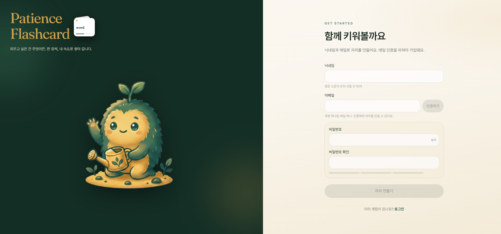
</figure>

가입 성공 시 `rememberJustJoined`로 홈 인사(“자리 만들었어요”)를 한 번 띄우고, 비밀번호 필드는 `NewPasswordFields`로 확인·강도 UI를 맞춥니다. 로컬 OTP는 Mailpit(`/mail`)에서 확인합니다.

### 3. 세트 선택 — 기본 제공 / 내 세트

로그인 홈(`/`)은 `DecksPage`입니다. `GET /api/decks/builtin` · `mine`을 병렬로 받아 탭을 나눕니다. 카드마다 장 수·`시작 전` / 이어하기·클리어 횟수 배지가 붙고, 고른 뒤 하단 바로 순서·랜덤 시작(`LevelPicker`로 2~4층) 또는 이어하기를 고릅니다.

<figure class="article-figure-center article-figure-center--wide">
  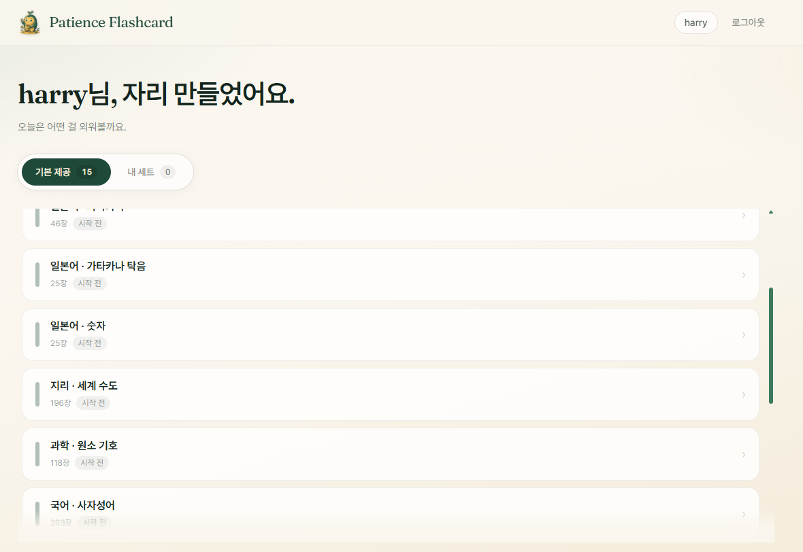
</figure>

헤더에 유저명·로그아웃이 있고, 기본 제공은 읽기·플레이·복사만, 내 세트는 편집·엑셀·삭제가 열립니다.

### 4. 내 세트 — 빈 세트 · 엑셀 가져오기

내 세트 탭이 비어 있으면 “여기는 아직 비어 있어요” 안내와 함께 **새 세트 만들기** 패널이 보입니다. 이름 입력 후 `POST /api/decks`(빈 세트 → 편집으로 이동) 또는 `POST /api/decks/import`(xlsx)입니다.

<figure class="article-figure-center article-figure-center--wide">
  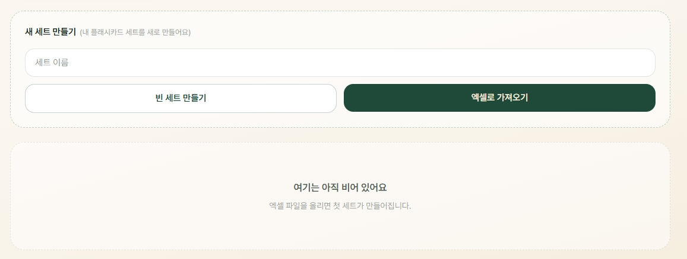
</figure>

### 5. 엑셀 가져오기 안내

**엑셀로 가져오기**에 올리면 A열 앞면 · B열 뒷면 예시 툴팁이 뜹니다. 세트 이름을 비우면 파일명을 쓰고, 서버는 파싱한 카드만 DB에 넣습니다(원본 미보관 · 용량·행·셀 검증).

<figure class="article-figure-center article-figure-center--wide">
  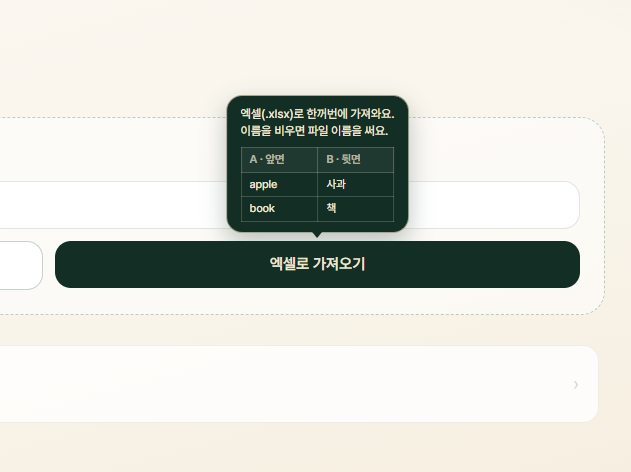
</figure>

### 6. 세트 편집 — 이름 · 교체 · 카드 CRUD

`/decks/:deckId/edit` (`EditDeckPage`). USER 덱만 열리고, BUILTIN·타인 덱은 게이트로 막습니다. 이름 저장(`PUT .../name`), 엑셀 교체(`PUT .../import` — 진행 초기화·클리어 횟수 유지 안내), 앞/뒷면으로 카드 추가·수정·삭제가 한 화면에 있습니다.

<figure class="article-figure-center article-figure-center--wide">
  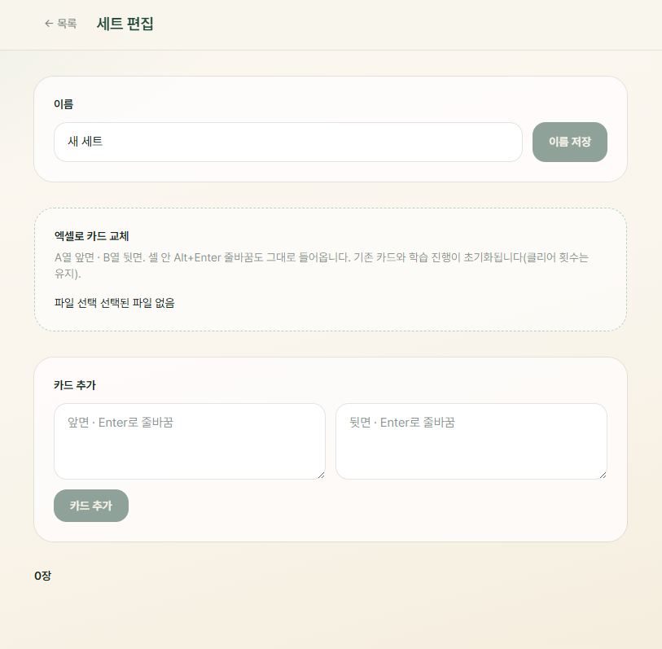
</figure>

### 7. 카드 UI 설정 — 클래식과 확대

플레이 설정 패널(`usePlaySettings` · `layout.ts`)입니다. **클래식**이 원래 형태에 가깝고, 오프라인에서 카드를 넘기던 상황과는 화면이 달라서, 웹에서 현재 장·층이 더 잘 보이게 **확대** 모드를 따로 두었습니다. 여기서 클래식/확대를 고르고, **이번만 앞뒤 바꾸기**(세션만 · progress 미저장), 글자·크기·앞/뒤 배경·글자색도 맞춥니다. 레이아웃·색은 로컬에 두고, 보드 진행만 서버에 남깁니다.

<figure class="article-figure-center article-figure-center--wide">
  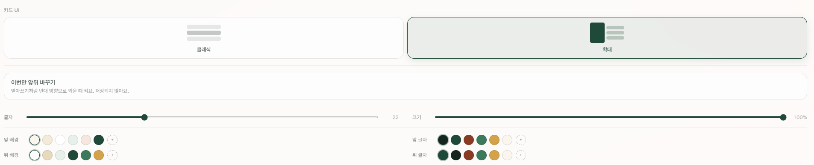
</figure>

### 8. 플레이 — 확대 · 가로 화면

`/play/:deckId`에서 확대를 켠 뒤, **가로로 넓은 화면**에 맞춘 배치입니다. `engine` / `actions`가 층·대기열·기억·까먹음·다음을 돌리고, 진행은 `study_progress`에 카드 id JSON으로 upsert합니다. 현재 카드를 크게 왼쪽(또는 주 영역)에 두고, 층별 스택은 오른쪽에 나란히 둡니다(`min-width: 1024px`, `useDesktopGlance`).

<figure class="article-figure-center article-figure-center--wide">
  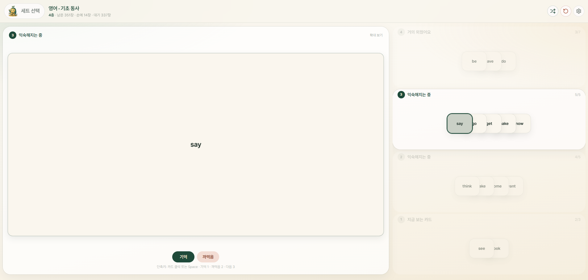
</figure>

헤더에 남은/손/대기 장 수, 셔플·리셋·설정이 있고, 단축키는 Space·기억 1 · 까먹음 2 (1층에서는 **다음** 3)입니다. 층 한도는 `limitsFor`(1층 3 · 맨 위 7 · 중간 5)입니다.

### 9. 플레이 — 확대 · 세로·모바일 화면

같은 확대 모드라도 **세로로 긴 화면·모바일**에서는 배치가 바뀝니다. 현재 카드를 위에 두고, 층 버킷은 아래(또는 좁은 폭에 맞게 compact)로 쌓아 한 화면에 맞춰 둡니다. 규칙은 같고 레이아웃만 뷰포트에 맞춘 것입니다. 1층(“지금 보는 카드”)에서만 **다음**이 보이며 대기열에서 손을 채우고, 위층에서는 기억·까먹음만 있습니다.

<figure class="article-figure-center article-figure-center--wide">
  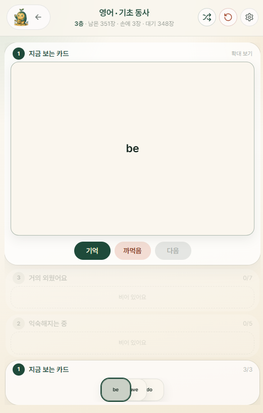
</figure>

### 10. Access Denied — 세트 게이트

타인 USER 덱·BUILTIN 편집 등 권한이 없으면 `DeckGateError`가 403용 마스코트 화면을 띄웁니다. “여기는 못 들어가요” / “이 세트에 접근할 수 없습니다.” 후 **세트 선택으로** `/`로 돌아갑니다. `requireAccessible` / `requireOwnedUserDeck`과 UI가 맞습니다.

<figure class="article-figure-center article-figure-center--wide">
  
</figure>

### 11. Error 404

없는 라우트는 `ErrorPage`(`path="*"`)입니다. “길을 잃었어요”와 함께 **홈으로** / **로그인**으로 빠져나갑니다. 세트 권한 거부와 라우트 미스를 화면에서 갈라 둔 것입니다.

<figure class="article-figure-center article-figure-center--wide">
  
</figure>

# 9. 중요했던 고민 — 진행도 보존과 인증 경계

기능을 붙이다 보면 “일단 플레이만 되면”으로 넘기기 쉽습니다. Patience에서는 **학습 상태가 새로고침·이탈에 날아가지 않는지**, 그리고 **계정·덱을 누가 만질 수 있는지**가 먼저 벽에 부딪혔고, 점검(`AUDIT_FIXES`)으로 그 두 축을 다시 잡았습니다.

### 진행도 — F5 · 이탈 · 클리어가 상태를 지우지 않게

가장 위험했던 건 플레이 중 **새로고침만 해도 진행이 통째로 초기화**되던 버그였습니다. 순서·랜덤·층수를 `?shuffle=&levels=`처럼 URL에 남겨 두면, F5 때 마운트가 다시 `resetProgress`를 타 저장된 보드가 사라졌습니다.

- 시작 의도(`readStartIntent`)는 마운트 때 **한 번만** 읽고, 바로 `navigate(..., { replace: true })`로 쿼리를 지웁니다. StrictMode 이중 실행은 `n=` 논스 + `sessionStorage` one-shot으로 막았습니다.
- 인게임 초기화·랜덤은 URL 리로드 대신 제자리에서 `resetProgress` 후 스냅샷을 다시 만듭니다.
- 저장은 400ms 디바운스라, “세트 선택”으로 나가면 cleanup이 대기 중 PUT을 취소할 수 있었습니다. 언마운트 때 미저장분이 있으면 `keepalive` **beacon**으로 flush하고, 리셋은 타이머를 먼저 비운 뒤 await해 늦은 PUT이 DELETE를 되살리지 않게 했습니다.
- 클리어 후에는 levels/queue가 비어 `exists=false`여도, `completedCount`가 있으면 **승리 화면**으로 복원합니다. 카드 편집·엑셀 교체는 play JSON만 비우고 `clear_count`는 남깁니다. upsert SQL에서는 덱 크기에 **처음** 도달할 때만 클리어 횟수를 +1 합니다.

보드 규칙은 프론트에 두고, 서버는 `(user, deck)` JSON을 **믿을 수 있는 이어하기·클리어 이력**으로만 쓰게 맞춘 셈입니다. 진행도 body도 `@Size`·층·카드 id·`completedCount + inPlay == deckSize`까지 검증해 쓰레기 JSONB를 막습니다.

### 인증 · 남용 — enumeration을 줄이고 세션을 끊기

로컬 취미앱이라도, 메일·로그인 응답이 “가입 여부”를 흘리면 그대로  Enumeration이 됩니다. 그래서 인증 표면은 **문구를 통일하고, 시크릿은 prod에서 실패**하게 잡았습니다.

- `email-available`은 형식만 보고, challenge·비밀번호 찾기·SMTP 실패도 **같은 성공 본문**(decoy 포함)을 줍니다. signup은 proof 검증 **뒤**에야 이메일 중복을 봅니다. 로그인은 없는 이메일도 dummy bcrypt로 비용을 맞춥니다.
- 비밀번호 재설정·로그아웃 시 `session_version`을 올려 JWT claim `sv`와 어긋나면 거부합니다. 만료된 쿠키도 지울 수 있게 logout은 `permitAll`입니다.
- OTP·로그인 쪽은 IP 기준 `rate_limit_events`(DB `RateLimiter`)로 한도를 두고, 만료 챌린지는 housekeeping으로 지웁니다.
- `prod`에서 개발용 JWT 기본값이 보이면 **부팅 실패**합니다. Compose는 FE·DB·API를 `127.0.0.1`에만 바인딩했습니다.

CSRF는 끈 채 `SameSite=Lax` HttpOnly 쿠키로 완화하는 수준이고, 공개 배포를 가정하면 HTTPS·실제 SMTP·한도를 다시 보면 됩니다. 취미 범위에서는 “알려진 키로 안 뜨고, 메일로 가입 여부를 안 흘리는” 쪽이 우선이었습니다.

### 소유권 — BUILTIN 403 · 타인 404 · 게이트 UI

시드 덱과 내 세트를 같은 `decks` 테이블에 두면, 수정 API가 404만 주면 **없는 id와 남의 id**가 구분되지 않습니다.

- `requireOwnedUserDeck`은 id로 찾은 뒤 BUILTIN이면 **403**, 타인 소유면 **404**로 갈라 IDOR 힌트를 줄였습니다. 조회·진행·복사는 `requireAccessible`(공용 또는 본인)입니다.
- FE `DeckGateError`도 HTTP 403일 때만 ACCESS DENIED 마스코트를 쓰고, 네트워크·일반 로드 실패는 중립 UI로 나눴습니다(fig13).
- 덱 이름 UNIQUE는 `LOWER(name)`로 맞춰 IgnoreCase 앱과 DB를 일치시켰고, 목록 카드 수는 덱마다 count 치던 N+1을 `group by` 한 방으로 줄였습니다. 진행 저장은 `ON CONFLICT` 원자 upsert입니다.

정리하면, 점검은 기능을 더 붙이기보다 **이미 있는 학습 루프를 지우지 않게 하고**, **계정·덱 경계를 응답·UI까지 일치**시키는 쪽이었습니다. 화면의 이어하기·클리어 배지·게이트는 그 결과물입니다.

# 10. 마무리 소감

처음에는 **아버지를 도와드리려고** 바닐라 HTML · CSS · JS만으로, 저장은 `localStorage`에만 두는 형태로 만들었습니다. 보드가 돌아가고 세트를 담을 수 있으면 된다고 봤고, 그때도 대충 넘긴 게 아니라 쓸 수 있게 맞춰 두었습니다. 다만 브라우저·기기 안에만 묶여 있는 한계가 분명해서, **조금 더 발전시켜 보자**는 쪽으로 이어졌습니다.

그걸 **본격적으로** 웹 서비스처럼 올려 보니, 생각보다 신경 쓸 일이 많았습니다. 계정마다 진행을 남기려면 인증과 DB가 필요하고, 공용 시드와 내 세트를 가르려면 권한이 필요하고, 엑셀로 카드를 넣으면 검증·교체·클리어 이력이 따라옵니다. 보드 규칙 자체보다 **새로고침에 진행이 날아가지 않게 하는 일**, **메일 응답이 가입 여부를 흘리지 않게 하는 일**, **BUILTIN과 남의 세트를 응답·UI까지 갈라 막는 일**이 더 오래 붙잡았습니다. 로컬 Compose로 쓰는 앱인데도, “일단 되게”만으로는 이어하기와 클리어 배지가 믿을 수 없었습니다.

그래도 단순했던 암기 루프를 React · Spring Boot · PostgreSQL · JWT · OTP · xlsx까지 한 줄로 이어 보면서, 작은 학습 도구에도 **상태 보존과 경계**가 제품의 절반이라는 걸 체감했습니다. 클라우드에 올려 서비스하려던 프로젝트는 아니지만, 로컬에서 계정·세트·진행도까지 묶인 형태로 쓸 수 있게는 맞춰 두었습니다. 처음에 바닐라로 성심껏 짜 둔 루프가 있었기에, 그 위에 올리는 방향도 흐트러지지 않았습니다.
