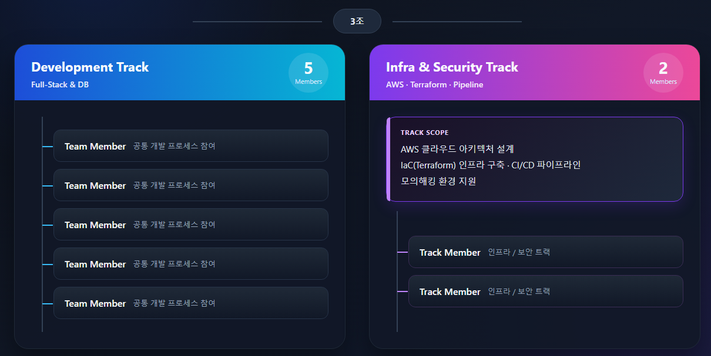
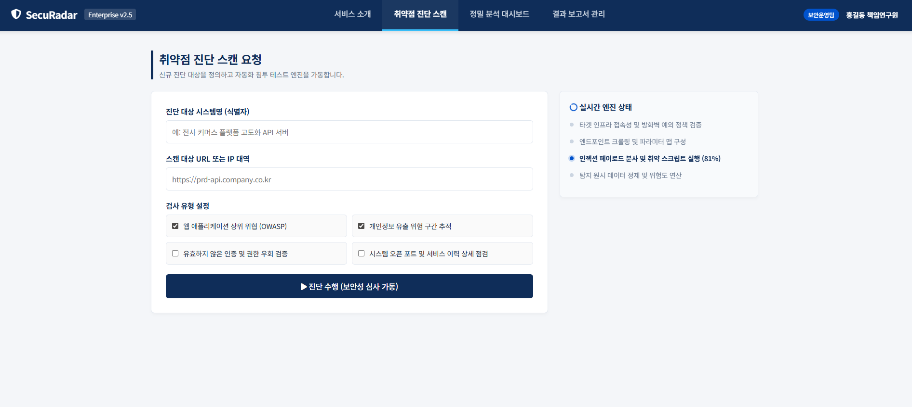

---

> **"약 4개월간의 온라인 교육과 3번의 미니 프로젝트를 거쳐, 드디어 이제 2개월 반의 최종 프로젝트라는 SK쉴더스 루키즈 과정의 마지막 장을 시작합니다!"**
>
> 제시된 네 가지 주제 — **딥페이크**, **보안관제**, **이상탐지**, **취약점 진단** — 중에서, 클라우드 인프라 구축과 보안 역량을 가장 깊이 있게 증명할 수 있는 **취약점 진단** 주제를 최종 프로젝트로 선택했습니다. 우리 팀이 맡게 된 과제는 **[클라우드 구축을 통한 취약점 진단 및 모의해킹]**입니다. 앞으로 진행될 프로젝트의 여정과 기술적 도전, 그리고 치열했던 고민의 흔적들을 이곳 개발일지에 생생하게 기록해 나가고자 합니다. 많은 응원 부탁드립니다!

## 1. 치열했던 아이디에이션: 개발과 보안의 융합

이번 프로젝트의 가장 큰 핵심은 **'개발(Development)'**과 **'취약점 진단(Vulnerability Diagnosis)'**이라는 두 가지 핵심 주제를 하나의 유기적인 프로젝트로 녹여내는 것이었습니다.

처음에는 두 영역을 어떻게 결합해야 할지 막막했지만, 멘토님께 우리 팀의 계획을 명확히 설명해 드리고 정교한 피드백을 받기 위해 선제적으로 빠른 기획과 아키텍처 구상을 시작했습니다.

## 2. 프로젝트 방향성의 전환

초기 기획과 비교해 서비스의 비즈니스 모델과 아키텍처 방향성에 큰 변화가 있었습니다.

- **기존 방향 (Before):** Hospital EMR(전자의무기록) 서비스를 먼저 클라우드에 개발·포팅한 후, 해당 시스템을 대상으로 취약점 진단 및 모의해킹 수행
- **변경 방향 (After):** **취약점 진단 및 보안 모니터링 서비스를 원스톱으로 제공하는 '보안 SaaS(Software as a Service) 플랫폼' 개발**

### 전환의 이유

단순히 특정 서비스를 만들고 공격하는 것에 그치지 않고, **보안 솔루션 아키텍처를 직접 개발하고 서비스화하는 경험**이 인프라 구축, 보안 자동화, 웹 풀스택 개발을 한 프로젝트에서 다룰 수 있어 우리 팀에 더 맞는 방향이라고 판단했습니다.

## 3. 효율적인 협업을 위한 팀 R&R (Role & Responsibility) 및 규칙 정립

소통을 거쳐 가장 효율적이고 공평한 기능 중심의 조직 체계를 구성했습니다.

- **개발(Full-Stack & DB) 트랙 (5명):**
  - **팀 리더:** 코드 통합 담당 및 전체 개발 프로세스 참여.
  - **개발 팀원 (4명):** 공통 개발 프로세스 참여.
- **인프라/보안(Infra) 트랙 (2명):** AWS 클라우드 아키텍처 설계, IaC(Terraform) 인프라 구축, 파이프라인 및 모의해킹 환경 지원.
- **팀 운영 규칙:** 쉬는 시간은 고정하지 않고 작업 컨디션에 따라 유동적으로 운영합니다.

## 4. 오늘의 주요 성과: UI/UX 기본 프레임워크 수립 및 협업을 위한 인프라 구축

- **기획의 시각화:** 서비스의 뼈대가 될 핵심 화면(대시보드, 취약점 스캔 요청 페이지, 리포트 출력 등)에 대한 **기본적인 UI/UX 틀(Wireframe)을 설계**했습니다.

  

- **공용 저장소 및 협업 도구 개설:**
  - **구글 드라이브 구축:** 아키텍처 다이어그램, 회의록, 기획서, 멘토링 피드백 자료 등 비코드(Non-code) 자산을 공유하고 아카이빙할 수 있는 공간 생성 완료.
  - **GitHub 레포지토리 연동:** 코드 버전 관리, 기능별 브랜치 전략(Git-flow) 적용, Issue 및 Pull Request 기반의 팀 공통 저장소 구축 완료.
  - **노션 페이지 개설 및 전체 개발 일정 정리**
- **기초 기획 및 설계 완료 (작성 완료 산출물):**
  - **프로젝트 수행계획서:** 서비스 소개 및 세부 범위 설정.
  - **요구사항 정의서**
  - **기능 명세서:** 핵심 기능(스캔 기능, 취약점 분석 기능, 보고서 작성 기능 및 대시보드 시각화) 구체화 및 정의.
  - **서비스 흐름 설계:** 서비스 흐름 분석 진행 (서비스 구상도 및 시나리오는 제외).
  - **도메인(Entity, Table) 설계서**
  - **API 설계서:** 공통 에러 코드를 포함한 API 규격 정의.
  - **파이프라인 설계서**
  - **목업(UI 화면 설계)**

## 5. Next Step: 각자의 레이어에서 계획 구상하기 (진행 및 대기 업무)

- **진행 중인 업무:**
  - **프로젝트 계획서(애자일 방법론) 보완:** 인프라 파트에서 작성 및 보완 진행.
  - **시스템 아키텍처 정의서 보완:** 인프라 파트에서 작성 및 보완 진행.
- **대기 중인 업무:**
  - **Spring Boot 프로젝트 생성 (Spring Initializr):** 개발 초기 구조 빌드 세팅 진행 예정.
  - **Vite 프로젝트 생성:** 프론트엔드 초기 구조 빌드 세팅 진행 예정.
