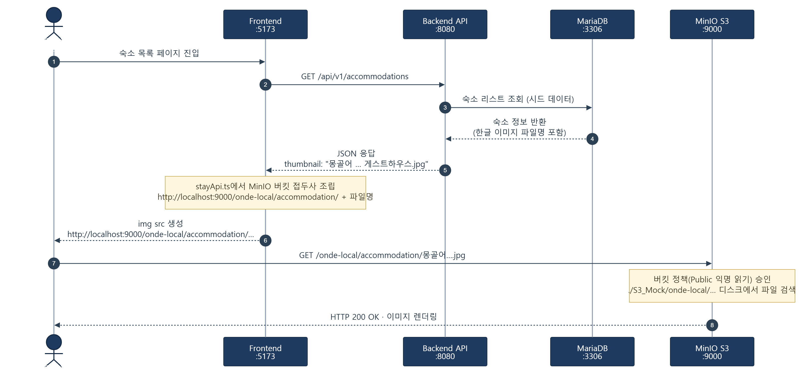

---

# 서론

> **"클라이언트 단의 임시 로직과 하드코딩 연산식을 전면 제거하고, 실제 데이터베이스와 실시간으로 연동되는 프로덕션 레벨의 예약 파이프라인을 구축했습니다. 대용량 재고 조회를 위한 MariaDB 복합 인덱스 튜닝과 오픈소스 스토리지 MinIO를 이용한 로컬 Mock S3 환경 셋업을 완수했으며, 관리자 3계층 권한(RBAC) 세분화 및 에러 핸들링 고도화를 통해 플랫폼 '온데(onde)'의 아키텍처를 견고하게 다졌습니다."**
>
> 클라이언트 임시 로직을 제거하고 DB 실시간 달력 API·RBAC 3계층 권한·MinIO Mock S3 로컬 인프라까지 한 번에 맞춰 온데(onde) 아키텍처를 견고히 다졌습니다.

# 1. 프론트엔드 예약 흐름 개선 및 실시간 데이터베이스 달력 동기화

기존에 클라이언트 사이드에서 정적으로 처리되던 예약 대기 및 할증 계산 로직을 전면 제거하고, 실시간 데이터베이스 연동 기반의 **공개 달력 API 파이프라인**을 연동하여 예약 흐름을 고도화했습니다.

## ① 공개 달력 조회 API 신설 및 배포

- **비로그인 공개 API 구축:** 기존 판매자 권한 전용 경로 대신, 일반 회원 및 비로그인 방문자도 토큰 없이 실시간 월별 요금표를 볼 수 있도록 **`GET /api/v1/inventory/calendar`** 엔드포인트를 백엔드 `InventoryController.java`에 신설했습니다. 이 API는 타겟 타입(`ROOM`/`CAR`), 식별자(`targetId`), 연월(`month`)을 파라미터로 받아 MariaDB의 `inventory` 테이블 데이터를 안전하게 조회합니다.
- **무중단 컨테이너 반영:** 로컬 인프라 환경에 소스코드를 즉시 동기화하기 위해 `docker compose up -d --build api` 명령을 수행하여 새로운 백엔드 API 서비스 컨테이너(`app.jar`)를 무중단 빌드 및 배포 완료했습니다.

## ② 달력 정보 실시간 동적 동기화 및 요금 연산

- **실시간 동적 로딩:** 사용자가 숙소/렌터카 상세 모달(`StayDetailModal.tsx`, `CarDetailModal.tsx`)에서 달력을 넘기거나 창을 열 때마다 백엔드 API를 비동기 호출하여 데이터베이스의 일별 요금 정보를 그대로 가져오도록 연동했습니다.
- **정밀한 실제가 합산 연산:** 기존의 일률적인 임시 주말 할증 공식(숙소 +20%, 렌터카 +15%) 연산 로직을 전면 제거했습니다. 이제 사용자가 선택한 범위 내 **각 날짜별 실제 데이터베이스 요금(주말 요금, 시즌 가격 등)을 개별 합산**하여 최종 결제 합계를 투명하고 정확하게 산출합니다.
- **재고 수량 시각화 및 마감 연계:** 달력 날짜 그리드 하단에 `"N개 남음"`(숙소) / `"N대 남음"`(렌터카) 형태의 잔여 재고 수치를 파란색 미니 텍스트로 표기하고 시인성을 높였습니다. 재고가 `0` 이하이거나 백엔드에서 `isClosed: true`로 마감 처리된 날짜는 즉시 **「예약마감」** 배너가 활성화되며 날짜 선택이 불가능하도록 비활성화 처리했습니다.
- **예약 방어 로직 강화:** 금액 포맷 표기 단위 오류(나누기 1000  10000)를 수정하여 95,000원이 `9.5만` 형태로 올바르게 노출되도록 조정했습니다. 또한 날짜를 한 곳만 클릭했을 때 `NaN` 오류가 노출되던 문제를 차단하고, 일정 미완료 상태에서 예약을 시도하면 경고 토스트 메시지를 출력하고 차단하도록 로직을 수정했습니다. 불필요했던 모달 내 마일리지 연동 패널은 전면 삭제하여 화면을 컴팩트하게 정돈했습니다.

# 2. 비즈니스 도메인 UX 고도화 및 포트원 실결제 연동

## ① 숙소 추천 카드 디자인 고도화 (`StayCard UI`)

- **한국어 주소 변환 파서:** 기존 서버 응답값의 영문 국가/도시명을 프론트엔드 내 상수 데이터(`TRAVEL_DESTINATIONS`)와 매핑하여 `대한민국 · 서울` 형태의 친절한 한국어 주소로 변환 출력되도록 개선했습니다.
- **글래스모피즘 배지 배치:** 변환된 위치 정보를 카드 이미지 좌측 상단에 반투명 글래스모피즘 배지(`bg-black/45`, `backdrop-blur-md`)로 플로팅했습니다. 텍스트 우측이 잘리는 현상을 막기 위해 패딩 여백을 넓히고 자간을 최적화했습니다.
- **레이아웃 정돈:** 평점 배지(` 4.8`)를 우측 상단에 수려하게 시각화하고, 숙소 유형 배지는 파스텔톤 블루 배지로 이미지 하단에 독립 배치했습니다. 타이틀 하단의 불필요한 서브 설명글 영역을 전면 삭제하여 숙소명이 중복 노출되던 결함을 근본적으로 해결하고 여백을 축소했습니다.
- **검색 조건 연동:** 메인 검색창에서 투숙객이 설정한 객실 수와 인원 파라미터가 상세 모달 및 결제창까지 유연하게 연결되도록 바인딩을 조정하고, 선택 객실 수만큼 단가가 비례하여 곱연산되도록 전역 로직을 수정했습니다.

## ② 렌터카 모델 단위 그룹화 및 다중 차량 캘린더 통합

- **모델별 데이터 그룹화:** 개별 차량 단위로 무분별하게 노출되던 리스트에서 렌터카 회사명을 완전히 제거하고, 차종 모델명(`car.name`) 기준으로 데이터를 그룹화하여 대표 차량 카드만 표시하도록 리팩토링했습니다. 대표 카드에는 `예약 가능 차량: N대` 배지가 노출됩니다.
- **통합 캘린더 알고리즘:** 상세 페이지 진입 시 해당 모델 그룹에 속한 모든 차량의 예약 달력 정보를 백엔드에서 동시에 조회(`Promise.allSettled`)하여 일별 잔여 재고를 합산해 보여주는 병합 알고리즘을 추가했습니다. 선택 날짜에 가용한 개별 차량의 번호판 선택 그리드 UI를 도입하여, 최종적으로 특정 차량의 `carId`로 예약을 체결하도록 전송 로직을 개선했습니다.

## ③ 여행자 보험 결제창 연동 및 보증서 프리뷰 카드 신설

- **포트원 결제 파이프라인 연결:** 여행자 보험 가입 즉시 가짜 완료 처리되던 목업 로직을 전면 차단하고, 포트원 통합 결제 창 (`/payment`)으로 보험 예약 정보(신청액, 약관, 기간)를 전달하여 결제 과정을 거치도록 유기적으로 연동했습니다.
- **안심 케어 보증서 UI:** 사진 이미지가 없는 보험 상품의 시각적 요소를 대체하기 위해, 다크 네이비 테마와 황금빛 그라데이션, `shield-halved` 안심 아이콘이 조합된 고급스러운 프리미엄 보증서 프리뷰 카드를 결제창에 신설하여 결제 신뢰감을 고조시켰습니다. 보험료 계산기 하단 약관 동의 체크박스는 수직 중앙 정렬(`items-center`)로 정밀 보정했습니다.

# 3. 권한(RBAC) 보안 가드 정밀화 및 세션 관리 계층 보강

백오피스 아키텍처의 인가 절차를 강화하고, 세션 만료 및 취소 프로세스에서 발생하던 사용자 여정의 충돌 현상을 정밀 복구했습니다.

## ① 권한 헬퍼 모듈 신설 및 접근 제어 강화 (`adminPermissions.ts`)

- **3계층 RBAC 정밀 구현:** 본사 관리자 권한을 `USER_ADMIN`, `SELLER_ADMIN`, `SUPER_ADMIN`으로 명확히 세분화하고 권한 헬퍼 모듈을 신설했습니다. 백엔드 DB와 Spring Security 권한 명칭 간 불일치(`ROLE_SALES_ADMIN`  `ROLE_SELLER_ADMIN`)로 인해 발생하던 500 에러를 Enum 값 조정을 통해 근본적으로 해결했습니다.
- **메뉴 조건부 은폐 및 403 처리:** `USER_ADMIN`(일반 관리자)의 경우 상품 검수에서 승인·반려·CSV 추출 버튼을 비활성화하고 «조회 전용» 배지를 표시하며, 사이드바에서 LBS 마커 탭을 은폐했습니다.
- **백오피스 인터셉터 보완:** 권한이 없는 하위 페이지(예: USER_ADMIN의 정산 탭 접근) 진입 차단 시, Axios 인터셉터를 통해 백오피스 화면 전체가 하얗게 멈추지 않고 `"해당 기능을 수행할 권한이 없습니다."` 토스트 메시지만 안전하게 노출되도록 제어했습니다.

## ② 에러 페이지 백오피스 동적 복귀 라우팅 (`errorNavigation.ts`)

- 500 에러 페이지 진입 시 `sessionStorage`에 직전 백오피스 진입 경로를 동적으로 캐싱하는 `saveErrorReturnPath` 로직을 구축했습니다.
- 이를 통해 에러 화면에서 «메인으로 돌아가기» 버튼을 클릭 시, 무조건 초기 메인 페이지로 튕기는 것이 아니라 **[기존 작업 중이던 백오피스 URL]  [역할별 기본 대시보드 경로(`/seller` 또는 `/admin`)]  [일반 고객 메인 홈(`/`)]** 순으로 스마트하게 단계별 안전 복귀하도록 네비게이션을 완성했습니다.

## ③ 로그아웃 타이밍 픽스 및 필터링 최적화

- **인터셉터 충돌 해결:** 마이페이지나 백오피스에서 로그아웃 시 401(로그인 필요) 라우터 가드와 Axios 전역 인터셉터가 중복 작동하여 `/401` 안내 페이지로 비정상 리다이렉트되던 현상을 픽스했습니다. `logoutToHome()` 플래그를 도입해 의도적 로그아웃 구간에서는 에러 리다이렉트를 생략하고 즉시 안전하게 홈 화면으로 세션을 정리하도록 보정했습니다.
- **마이페이지 무중단 갱신:** 실시간 예약 및 가입 목록을 불러올 때 취소 완료(`CANCEL`/`cancelled`) 상태인 항목들과 새로 취소 조치한 예약 ID 캐시를 유기적으로 필터링하여, 새로고침 없이 즉시 목록에서 숨겨지는 최적화 UX를 적용했습니다.
- **접근 차단 가딩:** 세션 역할이 `SELLER` 또는 `ADMIN`인 권한 있는 사용자가 일반 고객용 메인 페이지에 진입할 경우, 차단 경고 토스트(`잘못된 접근입니다.`) 출력과 함께 전용 대시보드로 즉각 강제 리다이렉트(Bounce) 시키는 장치를 배치했습니다.

# 4. 인프라 트랙: 로컬 개발 환경용 Mock S3(MinIO) 인프라 구축 및 데이터 튜닝

상용 배포 환경과의 환경 불일치를 해소하고 고비용의 AWS 리소스 사용을 방지하기 위해, 로컬 호스트 환경에 Amazon S3 API 표준 규격과 완벽히 호환되는 **고성능 오픈소스 오브젝트 스토리지 MinIO 인프라**를 배포하고 데이터 볼륨 매핑을 완료했습니다.

## ① 전체 렌더링 데이터 흐름도 (Data Flow Diagram)

로컬 셋업 환경에서 마스터 데이터와 이미지 파일이 연동되어 브라우저 화면에 렌더링되기까지의 흐름을 구조화했습니다.

<figure class="article-figure-center article-figure-center--full">
  
</figure>

## ② 도커 오케스트레이션 및 Flyway 마이그레이션 튜닝

- **인프라 레거시 호환성 확보:** `docker-compose.yml`에서 MinIO 컨테이너 이미지 스펙을 `RELEASE.2022-05-08T23-50-31Z`로 지정하여 물리 디스크 호스트 경로(`./S3_Mock`)와 컨테이너 내부 경로(`/data`) 간의 안정적인 파일 시스템(FS) 모드 볼륨 매핑을 선언했습니다.
- **DB 벌크 시딩 자동화 및 해싱:** 로컬 인프라 구동 즉시 17개 도메인 테이블의 CSV 벌크 데이터가 자동 인서트되는 `db-seeder` 환경을 구축했습니다. `members.csv` 초기 적재 데이터의 중복 유니크 키 충돌을 방지하기 위해 Null(`\N`) 매핑 방식을 고도화하고 비밀번호를 표준 BCrypt 해시 방식으로 안전하게 사전 인코딩했습니다.
- **대용량 달력 조회 인덱스 최적화:** 대량의 날짜별 재고/가격 테이블 조회 성능을 극대화하기 위해 MariaDB 내 `inventory` 테이블에 target_type, target_id, date를 묶는 복합 인덱스를 생성하는 **Flyway 스크립트(`V8__Add_Inventory_Index.sql`)**를 새롭게 반영했습니다.
- **이미지 깨짐 보정:** 백엔드 응답값 결함을 방지하기 위해 프론트엔드(`stayApi.ts`, `carApi.ts`) 단에서 로컬 MinIO 호스트 도메인 프리픽스를 동적으로 결합해 주는 경로 조립 함수를 추가하고 차종별 고유 이미지 파일명 딕셔너리(`CAR_IMAGE_MAP`)를 선언하여 브로큰 링크를 방지했습니다.
- **Vite 개발 서버 환경 보완:** 파일 변경 사항 HMR 감지가 누락될 수 있는 가상화 환경을 보완하고자 `vite.config.ts` 설정 파일에 `watch.usePolling: true` 및 `interval: 100` 옵션을 명시하여 개발 편의성을 높였습니다.

# 5. 기능 영역별 최종 상태 점검

| 분류       | 세부 작업 내용                                                       |     담당자      |     상태      |
| :--------- | :------------------------------------------------------------------- | :-------------: | :-----------: |
| **프론트** | 실시간 요금 곱연산 적용, 렌터카 모델 그룹화 및 보험 보증서 카드 구현 |     김현석      | **완료** |
| **백엔드** | 비로그인 달력 조회 API 신설 및 MemberRole Enum 정합성 보정           |     홍지호      | **완료** |
|            | 본사 관리자 3계층 인가 로직 및 취소/필터링 후속 API 빌드             |     이예린      | **완료** |
| **데이터** | 17개 테이블 셋 벌크 데이터 가공 및 members 계정 해싱 시딩 구축       |     장성욱      | **완료** |
| **인프라** | MinIO 레거시 FS 컨테이너 셋업 및 Flyway V8 복합 인덱스 튜닝          | 유지수 / 박진아 | **완료** |

# 6. Next Step: 완벽한 통신 결합 및 실전 웹 취약점 진단 시나리오 가동

로컬 가상화 인프라 셋업과 데이터베이스 동적 렌더링 파이프라인이 완비되었으므로, 인프런 강의 진도에 발맞추어 본격적인 모의해킹 및 웹 취약점 진단 단계로 진입합니다.

- **전 구간 실서버 통합 검증:** 로그인  실시간 조건 검색  다중 차량/객실 재고 달력 확인  포트원 결제  백오피스 정산 대시보드 반영으로 이어지는 전체 흐름 통합 테스트 실행.
- **실전 컴플라이언스 웹 취약점 스캔 착수:** Burp Suite 프록시 도구의 Intercept 및 Repeater 모듈을 가동하여 플랫폼 내부의 SQL Injection(인증 우회, 데이터 조회), 파라미터 변조, 결제 가격 위변조, 권한 우회(BOLA) 취약점을 도출하기 위한 수동 모의해킹 시나리오 수립 및 실전 진단 가동.
