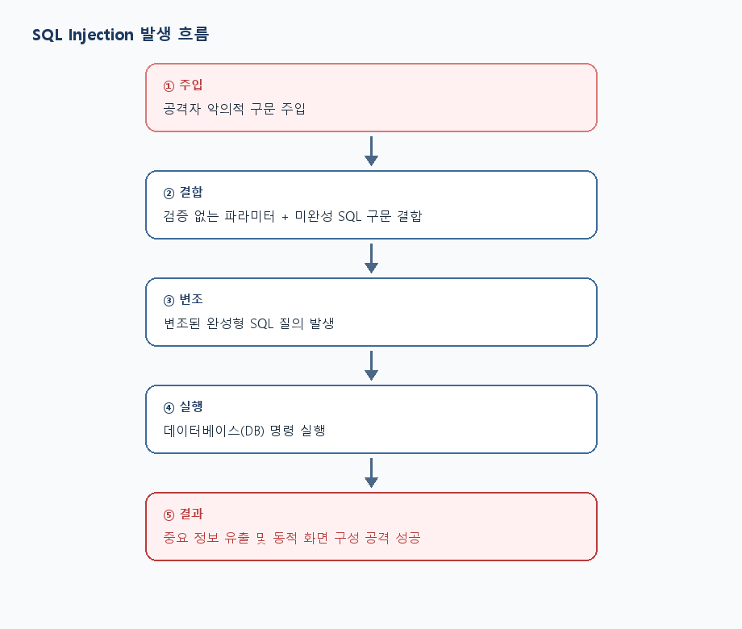
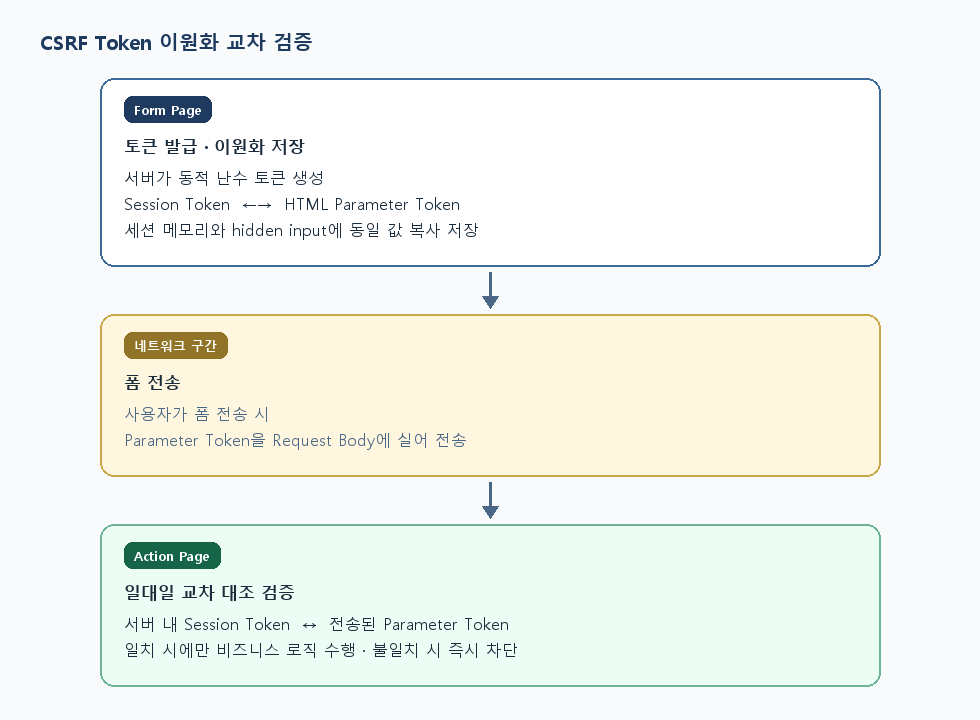

---

# 서론

> **"프론트엔드와 백엔드 간의 최종 결합 상태를 점검하고, 데이터 무결성을 위한 스키마 대수술을 단행했습니다. Flyway 중복 마이그레이션 이슈 해결과 PortOne 실결제 연동을 완료하는 동시에, 인프런 보안 학습을 바탕으로 시스템을 파괴하는 SQL Injection 심화 공격(UNION/BLIND)의 세부 메커니즘과 CSRF 토큰 교차 검증 방어 아키텍처를 완벽하게 정리했습니다."**
>
> Flyway 스키마 개편과 PortOne 실결제 결합을 마무리하는 동시에, UNION/BLIND SQL Injection과 CSRF 토큰 교차 검증 방어 구조를 정리했습니다.

# 1. 프로젝트 데이터 무결성을 위한 백엔드 코어 스키마 개편 및 LBS 정밀화

백엔드 전 모듈 통합 이후 발생한 세부 명세 불일치를 해소하고, 데이터베이스 물리 계층과 공간 데이터의 정확도를 프로덕션 레벨로 끌어올리기 위해 데이터베이스 구조 개편을 단행했습니다.

## ① 핵심 도메인 스키마 수정 및 형상 관리 최적화

- **정산 및 객실 스펙 확장:** 판매자 정산 및 계정 관리를 고도화하기 위해 `seller_account` 구조를 `V1` 테이블 초기 형성에 최종 추가 반영했습니다. 또한 숙소 상세 옵션 다각화를 위해 `rooms` 테이블 스펙에 신규 비즈니스 컬럼을 확장하는 `V5` 마이그레이션 스크립트를 정밀 적용했습니다.
- **Flyway 버전 파이프라인 충돌 해결:** 개발팀 병렬 머지 과정에서 형상 관리가 꼬이며 발생한 `V9` 중복 스키마 리스크를 발견했습니다. 시스템 인스턴스 셧다운 없이 정합성을 맞추기 위해 중복 구간을 구조적으로 격리하여 **`V10` 버전으로 마이그레이션을 분리 세이빙**하는 데 성공했습니다.

## ② 지리 공간 데이터(LBS) 정밀화 및 프론트엔드 최적화

- **좌표 데이터 전면 교체:** 지도 탐색 화면(`MapPage.tsx`)의 핀 포인트 오차를 완전히 제로화하기 위해, 데이터베이스 내에 적재되어 있던 숙소 위도 및 경도 좌표값을 전면 수정했습니다. 구글 드라이브를 통해 공유된 최신 정제 합본 CSV 데이터를 기반으로 데이터베이스 인프라 마이그레이션을 완수했습니다.
- **숙소 레이지 로딩(Lazy Loading) 이식:** 대량의 지리 데이터 및 최신 숙소 리스트 로드 시 브라우저 오버헤드를 방지하기 위해 `IntersectionObserver` 기반의 **숙소 카드 레이지 로딩 아키텍처를 추가 이식**하여 렌더링 성능을 극대화했습니다.

# 2. 비즈니스 파이프라인 최종 결합: PortOne 실결제 및 커뮤니티 고도화

- **엔드투엔드 실결제 인터록 연동:** 가상 환경의 응답에 의존하던 결제 흐름을 탈피하여, 프론트엔드 포트원 결제창 요청과 백엔드 데이터베이스의 `payments/prepare` 및 `validate` 검증 계층 간의 **실결제 연동 파이프라인 최종 결합을 완료**했습니다.
- **여행기(Community) 도메인 수정:** 사용자 UX 피드백을 반영하여 여행기 피드 커뮤니티 작성 및 수정 폼의 데이터 바인딩 예외 처리를 정돈했습니다.

# 3. [보안 선행 학습] SQL Injection 심화 공격 메커니즘 분석

10일차에 학습한 단순 로그인 인증 우회를 넘어, 데이터베이스 내에 숨겨진 중요 마스터 정보를 통째로 탈취하고 시스템 권한을 장악하는 심화 공격 기법의 원리를 체계적으로 정립했습니다.

## ① 취약점 발생 원인의 재확인

사용자 입력값(파라미터)이 숫자형이든 문자형이든 관계없이, 입력값에 대한 **적절한 검증이나 필터링 없이 미완성 SQL 구문과 그대로 결합(Concatenation)**되어 데이터베이스 엔진으로 전송될 때 발생합니다. 이로 인해 변조된 SQL 질의가 데이터베이스에서 그대로 실행되고, 결과에 따라 화면이 동적으로 구성되면서 공격이 성공하게 됩니다.

<figure class="article-figure-center article-figure-center--full">
  
</figure>

## ② UNION-Based SQL Injection (데이터 조회 공격)

하나의 쿼리 결과에 다른 쿼리의 결과를 합쳐서 반환하는 `UNION` 연산자의 특성을 악용하여 데이터베이스의 민감 테이블을 추출하는 파괴적인 기법입니다.

- **공격 성립의 2대 필수 조건:**
  1. 원래의 쿼리가 조회하는 컬럼의 개수와 `UNION SELECT` 뒤에 붙일 쿼리의 **컬럼 개수가 정확히 일치**해야 합니다. (일치하지 않을 경우 Syntax/Column Mismatch 에러 발생)
  2. 각각 대조되는 컬럼의 **데이터 타입이 상호 호환** 가능해야 문법 오류 없이 데이터가 화면에 출력됩니다.
- **실전 공격 프로세스:**
  1. `ORDER BY 1, 2, 3...` 연산이나 `UNION SELECT 1, 2, 3...` 대입을 통해 원본 쿼리의 출력 컬럼 개수를 먼저 알아냅니다.
  2. 원본 파라미터 값에 존재하지 않는 인덱스(예: `idx = -1`)를 주입하여 원래의 데이터 결과셋을 비워버립니다.
  3. `UNION SELECT null, column, null FROM target_table` 형태로 주입하여, 정상적인 화면의 텍스트 출력 칸에 공격자가 원하는 민감 테이블 데이터(주민번호, 비밀번호 등)가 다이내믹하게 강제 렌더링되도록 유도합니다.
- **로컬 파일 무단 열람 연계:** DBMS의 시스템 권한 함수인 `LOAD_FILE('/etc/passwd')` 등을 `UNION` 구문에 병합 주입하여, 데이터베이스 서버 디스크 내부의 중요 환경 설정 파일까지 브라우저 화면으로 무단 탈취할 수 있습니다.

## ③ Blind-Based SQL Injection (데이터 추론 공격)

오류 메시지도 노출되지 않고, 화면에 `UNION`처럼 데이터 결과가 직접 뿌려지지도 않는 폐쇄적인 환경에서 사용되는 정밀 추론 기법입니다.

- **공격 원리:** 데이터가 직접 출력되지는 않지만, 공격자가 던진 질의 조건의 **참(True)과 거짓(False) 여부에 따라 웹 페이지의 응답 반응(성공 메시지 가시성, 혹은 응답 지연 시간)이 미세하게 달라지는 점**을 이용합니다. 스무고개 방식으로 데이터베이스의 참 값을 한 글자씩 유추해 나갑니다.
- **핵심 추론 함수 활용:**
  - `SUBSTRING(문자열, 시작위치, 길이)`: 대상 데이터의 특정 자릿수 글자 하나만을 정밀 추출합니다.
  - `ASCII(문자)`: 추출한 문자를 아스키 숫자 코드로 변환하여 부등호 비교 연산(`>`, `<`, `=`)이 가능하게 만듭니다.
  - **추론 메커니즘 예시:**
    ```sql
    -- 관리자 비밀번호의 1번째 글자 아스키코드가 100보다 큰지 참/거짓 판별
    SELECT * FROM members WHERE id='admin' AND ASCII(SUBSTRING(password, 1, 1)) > 100#
    ```
    이 조건 결과에 따라 달라지는 웹 애플리케이션의 반응을 누적 계산하여, 툴이나 스크립트를 통해 최종 평문 데이터를 완벽하게 복원해 냅니다.

# 4. [보안 방어 대책] Prepared Statement 시큐어 코딩 및 CSRF 토큰 검증

## ① 원천 차단 처방전: Prepared Statement 컴파일 엔진 적용

SQL Injection을 물리적으로 완전 방어하는 기법은 **Prepared Statement(매개변수화 쿼리)**의 도입입니다.

- **방어 원리:** 문자열을 단순히 이어 붙이는 방식(Concatenation)과 달리, 데이터베이스 엔진이 SQL 쿼리의 뼈대와 구조를 **먼저 컴파일하여 고정**합니다. 그 후 사용자의 입력값은 쿼리 구조에 영향을 주지 못하는 단순한 **'데이터 리터럴(값)'**으로만 맵핑되어 안전하게 처리됩니다.
- **개발 가이드:** MyBatis 환경에서 스트링 치환 방식인 `${parameter}` 방식의 가용을 전면 배제하고, Prepared Statement 파라미터 바인딩 방식인 **`#{parameter}`** 구문 사용을 의무화해야 함을 명확히 정의했습니다.

## ② CSRF(사이트 간 요청 위조) Token 교차 검증 구조

사용자의 브라우저 권한을 악용해 원치 않는 변조 요청을 강제 송신하는 CSRF 공격을 방어하기 위한 **Form Page와 Action Page 간 이원화 교차 검증 프로세스**를 정립했습니다.

<figure class="article-figure-center article-figure-center--full">
  
</figure>

1. **Form Page 계층 (토큰 발급 및 분배):** 인증된 사용자가 안전한 입력/수정 화면에 진입하면, 백엔드 엔진은 즉시 유추 불가능한 암호학적 랜덤 난수 토큰을 발급합니다. 이 토큰은 웹 서버 메모리 내부인 **`세션(Session) Token`**에 바인딩됨과 동시에, HTML 문서 내의 **`파라미터(Parameter) Token`** 영역(`<input type="hidden">`)에 복사되어 클라이언트로 이원화 배분됩니다.
2. **네트워크 구간 (요청 발생):** 사용자가 전송 버튼을 누르면, 브라우저는 HTML 폼 내부에 은닉되어 있던 `파라미터 Token` 값을 HTTP Request Body 파라미터에 실어 서버로 송신합니다.
3. **Action Page 계층 (교차 유효성 검증):** 요청을 수신한 백엔드 컨트롤러는 서버 메모리에 안전하게 보관 중이던 `세션 Token`과 클라이언트가 패킷 Body에 담아 보낸 `파라미터 Token` 값을 **일대일 동기화 대조 연산(`=`)**으로 비교합니다. 두 값이 완벽하게 일치할 때만 비즈니스 로직을 정상 수행하고, 토큰이 누락되었거나 일치하지 않는 위조 요청은 즉시 무력화 차단합니다.

# 5. 기능 영역별 최종 상태 점검

| 분류       | 세부 작업 내용                                           | 담당자 |     상태      | 비고                       |
| :--------- | :------------------------------------------------------- | :----: | :-----------: | :------------------------- |
| **백엔드** | `seller_account` V1 및 `rooms` V5 신규 컬럼 스키마 반영  | 이예린 | **완료** | DB 코어 고도화 완료        |
|            | Flyway 중복 마이그레이션 이슈 해소 및 V10 스키마 분리    | 홍지호 | **완료** | 형상 관리 결함 정비        |
| **프론트** | 숙소 목록 대용량 렌더링 최적화를 위한 LazyLoading 도입   | 김현석 | **완료** | UI 스크롤 성능 최적화      |
| **데이터** | 숙소 위도/경도 LBS 데이터 정밀 교정 및 최신 CSV 반영     | 장성욱 | **완료** | 지도 탐색 좌표 오차 제어   |
| **통합**   | PortOne SDK 기반 실결제 파이프라인 엔드투엔드 최종 결합  | 개발팀 | **완료** | FE-BE 결제 인터록 연동     |
| **보안**   | SQL Injection 심화 공격 분석 및 CSRF 토큰 검증 이론 정립 | 개발팀 | **완료** | 인프런 기반 선행 학습 완수 |
| **대기**   | 렌터카 지점 선택 기능 추가 (프론트엔드, 백엔드)          | 개발팀 | **대기** | 차주 스프린트 연동         |
|            | 판매자 항공 캘린더 `sellerId`·공항 필터 로직 구현        | 홍지호 | **대기** | 백엔드 쿼리 보완 예정      |
|            | 유저 관리자용 여행기 커뮤니티 악의적 게시글 강제 삭제    | 이예린 | **대기** | 권한별 기능 차단 바인딩    |
|            | 판매자 페이지 내 3대 상품 등록, 수정, 삭제 기능 구현     | 김현석 | **대기** | 프론트 CRUD UI 빌드 대기   |

# 6. Next Step: 메인 브랜치 머지 및 프로덕션 배포 거버넌스 수립

- **메인 브랜치 최종 통합 및 Lock-In:** 프론트엔드와 백엔드 간의 실시간 API 통신 테스트 무결성이 확인됨에 따라, 각 기능 브랜치의 코드들을 공통 원격 저장소의 `main` 브랜치에 전격 병합(Merge) 및 최종 업로드 처리.
- **통합 기술 명세서 작성:** 코드가 메인에 안착하는 즉시 이예린(BACKEND) 팀원과 김현석(FRONTEND) 팀원을 필두로 전체 플랫폼 아키텍처 토폴로지와 실행 표준을 규정하는 공동 `README.md` 작성에 착수.
- **클라우드 실배포 타당성 확정:** 인프라 파트(지수, 진아)와 협의하여 현재 작성이 완료된 Dockerfile 및 `docker-compose.yml` 패키지 설정을 기반으로 실제 AWS 인프라 환경 상용 배포 가동 여부를 최종 결정 및 가동.
- **실전 웹 취약점 진단 및 수동 모의해킹 가동:** 플랫폼 '온데'의 전 구간 시스템 결합이 완료됨에 따라, 6월 8일부터 Burp Suite 프록시 툴을 활용하여 우리 시스템 내부의 파라미터 변조, 결제 가격 위변조, SQL Injection, BOLA 취약점을 도출하기 위한 본격적인 취약점 진단 시나리오 가동.
