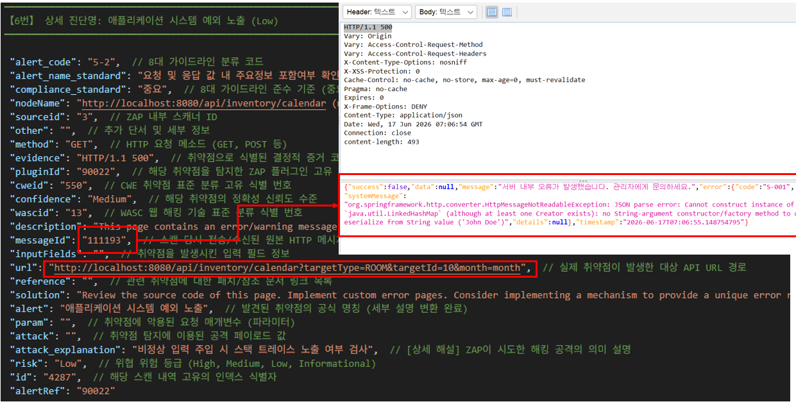
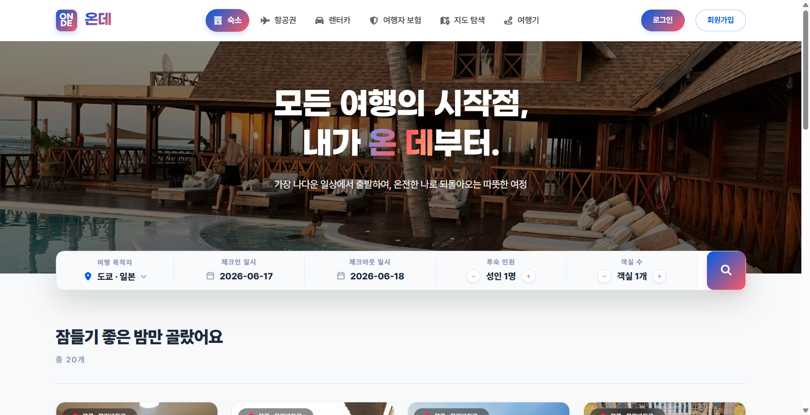
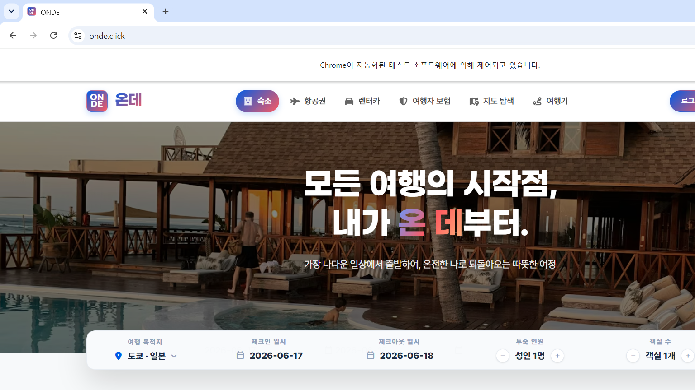
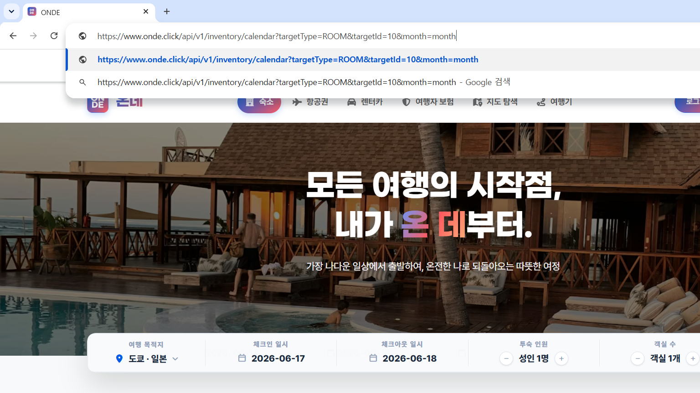
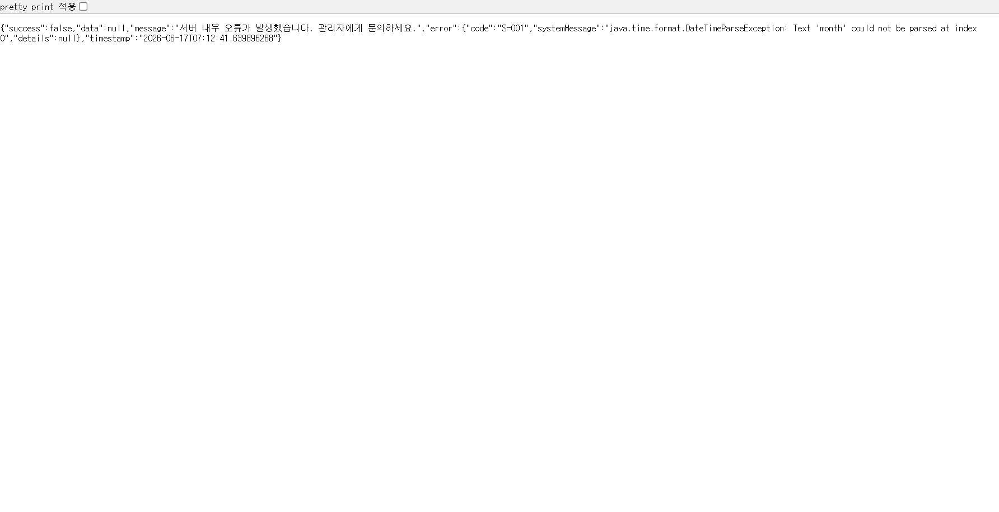

---

# 서론

> **"이전 단계에서 정한 1인 전 과정(End-to-End) 통합 개발 방식을 바탕으로 아르고스(Argus) 플랫폼의 3주 일정을 정했습니다. 장대현 멘토님께 배포된 온데(Onde) 플랫폼과 아르고스의 3단계 사양을 점검받고 실전 진단 방법론 강의를 들었습니다. 또 온데에 첫 동적 스캔(DAST)을 실행해 Swagger 주입으로 API를 추적할 수 있는지, 500 응답이 버퍼 오버플로우로 잡히는 오탐이 어느 정도인지, Selenium 증적 캡처가 가능한지 점검했습니다."**
>
> 3주 WBS를 확정하고 멘토링에서 온데·아르고스 3단계 사양을 검증받은 뒤, 온데 대상 최초 DAST로 API 추적·오탐 양상·증적 캡처 가능성을 평가했습니다.

# 1. 아르고스(Argus) 3주 일정별 단기 계획(WBS) 확정

1인 통합 파이프라인 개발을 효율적으로 진행하기 위해, 프로젝트 최종 인도일까지의 **3주간 일자별 세부 WBS 계획**을 다음과 같이 정리했습니다.

### 아르고스 3주간의 통합 개발 및 배포 계획

- **1주차: 인터페이스 표준화 및 통합 뼈대 완성**
  - **Day 1:** 프로젝트 시작 회의 및 내부 JSON 데이터 규격 확정 & 기본 데이터 모델 설계
  - **Day 2:** 3개 팀 핵심 환경 구성 및 파이프라인 직렬 연동성 실증 검사
  - **Day 3~5:** 7인 개발자(B1~B7) 독립 브랜치 기반 병렬 개발 시작 및 진행 (1~3일차)
- **2주차: 병렬 개발 지속 및 전체 결합 QA**
  - **Day 6~7:** 7인 개발자(B1~B7) 독립 브랜치 병렬 개발 진행 (4~5일차)
  - **Day 8:** 독립 브랜치 병렬 개발 완료 및 기능 구현 마무리 (6일차)
  - **Day 9:** 개별 모듈 통합 병합(Merge) 및 레지스트리 일괄 등록
  - **Day 10:** **28개 파이프라인 전체 결합 QA** 및 정상 실행력 확보
- **3주차: 플랫폼 연동 및 최종 테스트베드 검수**
  - **Day 11:** Celery 비동기 큐 & 백그라운드 태스크 및 FastAPI REST API 통합 연동
  - **Day 12:** Jinja2 템플릿 기반 대량 데이터 매핑 및 최종 한글 보고서 엔진 마감
  - **Day 13~15:** 테스트베드 연동 검증, 최종 버그 픽싱 및 배포 스크립트 실행, 최종 결과 보고서 검수 완료

# 2. 2차 주간 멘토링 보고: 온데(Onde) 플랫폼 점검 및 아르고스 3단계 사양 확정

장대현 멘토님께 클라우드에 배포 완료된 온데(Onde) 여행 플랫폼 화면을 직접 시연해 드리고 시스템 구조도(`Onde_Architecture.pdf`)를 바탕으로 심층 점검을 받았습니다. 아울러, 취약점 진단 플랫폼 아르고스의 계획을 공유하고 3단계 코어 파이프라인 스펙을 확정했습니다.

### ① 진단 대상 '온데(Onde)' 플랫폼 기능 개선 및 취약점 격리 주입

알파 테스트 결과와 인프라 구성도를 보완하기 위해 도메인별 기능 확장과 취약점 테스트베드 주입에 대한 피드백을 받았습니다.

- **사용자(User) 도메인 확장:** 여행기 리뷰 내에 '비밀 댓글 기능'과 '여행기 수정 기능'을 새로 만들고, 개인정보(전화번호 수정, 비밀번호 변경 등) 마이페이지 프로필 관리 기능을 추가 반영했습니다.
- **판매자(Seller) 권한 및 대시보드 정비:** 판매자 기능은 `Seller Admin`에서 일괄 수행할 수 있도록 권한 부여 체계를 확립합니다. 정산 승인 관리 화면에서 총 매출액뿐만 아니라 상세 내역을 파악할 수 있는 '판매자 대시보드'와 판매자가 상품 값을 임의 조작하지 못하도록 고정 단가 대비 할인율만 조정할 수 있는 비즈니스 로직을 구축합니다. 판매자가 관리자에게 파트너 신청 후 최종 승인이 떨어지기 전 파라미터를 조작하여 임의 승인 상태로 변조시키는 취약점과 국세청 사업자 등록 번호 진위 확인 버튼 우회 결함도 검증용으로 유지합니다.
- **관리자(Admin) 도메인 분리:** 보안을 위해 사용자 로그인 창과 관리자 로그인 창이 합쳐진 구조를 없애고 **로그인 페이지를 분리**하며 IP 접근 제어와 2차 인증(2FA)을 기획에 반영했습니다. 관리자 패널에서 가입 사용자의 상세 정보(이름 등)를 볼 수 있게 보완하고, 서버가 분리된 만큼 사용자 도메인과 관리자 도메인 2개로 나누기로 했습니다.
- **온데 취약점 맵 설계:** 고정 가격 상태에서 투숙객 수와 객실 수를 조작하여 최종 결제 단가를 위조하는 **금액 및 파라미터 변조 취약점**, **마일리지 무단 조작 결함**, 타 사용자의 식별자(ID) 조작을 통해 마이페이지 정보에 무단 접근할 수 있는 **IDOR 취약점**을 배치합니다. PDF 출력 기능 등에서 발생하는 단순 경로 조작 행위는 제외하되, 실제 패킷 덤프 기반으로 추적 가능한 **SSRF, 파일 인클루전(File Inclusion), 중요 정보 파일 다운로드 취약점**을 명확히 심어둡니다. 또한 메인 검색창 등의 입력 데이터 처리부에는 **Reflected XSS** 취약점이 성립되도록 열어두고 데이터 마스킹 필터를 연계 검증하기로 했습니다.

### ② 아르고스(Argus) 플랫폼 계획 및 3단계 상세 명세

- **STEP 01. 탐지 및 AI 우선순위 산정:** 여러 보안 취약점을 스캔하고 AI가 비즈니스 맥락을 분석해 우선순위를 정합니다. OWASP ZAP(동적)을 중심으로 하고, Semgrep(정적)·SSL Labs(인프라)는 참고·선택 옵션으로 결함 로그를 모을 수 있습니다. (Semgrep은 MVP 핵심이 아니라 보류·참고 축입니다.)
- **STEP 02. Selenium 증거 캡처:** 1단계에서 우선순위가 정해진 주요 취약점들을 시각적 증거로 캡처하여 개발자에게 직관적으로 제공합니다. 취약점이 실제 위협으로 이어지는지 확인하기 위해 **Selenium Headless 브라우저가 모의 공격 시나리오를 자동으로 실행(Attack Replay)**하며, XSS 공격으로 경고창이 팝업되거나 비정상 페이지로 리다이렉트되는 순간 등의 브라우저 렌더링 화면을 캡처하여 시각 자료를 확보합니다.
- **STEP 03. 조치 가이드 및 리포팅:** 획득된 취약점 데이터와 스크린샷 증적을 종합하여 **SK쉴더스 Web/API 취약점 진단 가이드 항목(8개 그룹 28개 항목)**과 탐지된 취약점을 1:1로 매핑하여 체계적으로 분류합니다. Java, Python, PHP 등 언어 및 프레임워크별 구체적인 코드 수정 예시를 제공하며, 기술팀용 상세 증적 자료와 경영진용 종합 요약이 모두 포함된 SK쉴더스 대응 한글 PDF 보고서(사용자/판매자 보고서, 관리자 보고서 총 2종)를 원클릭으로 최종 발행합니다.

# 3. [취약점 진단 특강 강의] 실전 모의해킹 방법론 핵심 요약

대면 멘토링 세션 중 장대현 멘토님께서 진행해 주신 실전 보안 진단 필드의 방법론, 증적 확보 기준, 컴플라이언스 체계에 대한 집중 강의 내용을 요약 정돈했습니다.

- **동적 진단 중심 및 정적 키워드 추적:** 실제 웹/API 보안 진단은 구동 중인 애플리케이션 패킷을 제어하는 **동적 진단 위주로 대부분 수행**됩니다. 소스코드 기반의 정적 진단을 실행할 때는 시스템 내부의 모든 입출력 포인트(Input/Output Point)를 전수 식별해 낸 다음, 데이터가 전송되고 처리되는 핵심 제어 키워드인 **`GET`**, **`SET`**, **`IN`**, **`OUT`**의 흐름을 추적하여 로직을 진단해야 합니다.
- **인코딩 분석 및 권한 검증:** 패킷 내부에 은닉되거나 변조된 파라미터가 포함되어 있을 때, 그것이 **Base64 인코딩** 형태인지 등을 정확히 파악하고 디코딩하여 대조해야 취약점 여부를 가려낼 수 있으며, 일반 권한 상승 취약점도 `Burp Suite` 프록시를 활용한 서버 사이드 체크 검증 과정을 필수로 거쳐야 합니다.
- **응답 값(Response) 증적의 중요성:** 취약점 증적 스크린샷을 확보할 때, 단순히 변조한 파라미터를 전송한 '요청 값(Request)' 화면만 캡처하면 가치가 낮습니다. **악성 스크립트나 공격 구문이 시스템을 거쳐 실제로 나온 '응답 값(Response)' 화면과 브라우저 실행 화면의 스크린샷을 확보하는 일이 실무에서 더 중요**합니다.
- **보안 진단 절차 5단계:** 표준 관리는 **[보안진단 신청(담당자)  진단 수행(진단자)  취약점 조치(담당자)  이행점검 수행(진단자)  보안진단 완료]**의 5단계 파이프라인으로 움직여야 합니다. 진단 기준 치명도는 **`긴급`**, **`중요`**, **`일반`** 3단계 등급으로 나누어 관리하며, 기준 판정이 다소 애매모호한 취약점의 경우에는 컴플라이언스상 `8-1` 그룹으로 제외 분기하여 관리합니다.
- **심화 위협 및 명령어 침투 메커니즘:** 소프트웨어 패치 배포 전 빈틈을 타서 공격하는 **제로데이(Zero-Day) 취약점**의 위협 속성을 이해하고, 객체 복원 시 악성 로직을 기동시키는 **역직렬화(Deserialization)** 공격 원리와 공개 출처 인텔리전스인 **OSINT** 기법을 정립했습니다. 또한 SQL Injection을 통해 서버 내 시스템 명령어를 제어하는 **`xp_cmdshell`** 확장 프로시저의 침투 원리를 파악했습니다.

# 4. 온데 대상 최초 DAST 가능성 평가: API 추적 · 오탐 양상 · 증적 캡처

19일차에 확정한 동적 분석(DAST) 집중 전략이 온데(`onde.click`)에서 실제로 통하는지 보기 위해, 최초 자동화 스캔을 걸고 API 추적·정/오탐 구분·Selenium 증적까지 가능 여부를 점검했습니다.

### ① API 추적 가능성: ZAP Spider 한계와 Swagger 주입

- **Spider만으로는 한계:** OWASP ZAP의 내장 크롤러인 'Spider'만으로 진단 경로를 모으려 했으나, 사전 컨텍스트가 없으면 깊은 API URL을 잘 찾지 못해 진단 범위가 좁아졌습니다.
- **Swagger 주입으로 추적 가능 확인:** 서버가 빌드하는 **`swagger.json`을 ZAP에 주입**하면 스캐너가 API 경로를 빠짐없이 식별·추적할 수 있음을 확인했습니다. 이후 온데 DAST는 Swagger 명세 주입을 기본으로 가져가기로 했습니다.

### ② 오탐 가능성 평가: 500 응답 → 버퍼 오버플로우로 잡히는 경우

- **관측:** `swagger.json` 주입 후 동적 스캔 결과 **취약점 의심 항목 466건**이 나왔고, 그중 상당수가 '버퍼 오버플로우'로 분류되었습니다.
- **판단:** 서버가 비정상 입력에 대해 HTTP 500 또는 오류 페이지를 돌려준 것을, 스캐너가 심각한 오동작·버퍼 오버플로우 성공으로 오인한 오탐(False Positive)으로 보았습니다.
- **시사점:** 기본 정책만으로는 정탐·오탐을 가르기 어렵습니다. 500·에러 템플릿을 걸러내는 스캔 규칙·정책이 있어야 DAST 결과가 실무에 쓸 만해진다는 점을 이번 평가에서 확인했습니다.

### ③ 실제 탐지 가능성: 오류 페이지 정보 노출(6-1) 패킷 확인

오탐만 있는 것은 아니었습니다. 비정상 입력 시 디버그 예외가 노출되는 **"6-1. 오류 페이지를 통한 정보 노출 여부(Application Error Disclosure)"**는 패킷으로 재현·확인할 수 있었습니다.

<figure class="article-figure-center">
  
</figure>

- **패킷 확인:** 스캔 결과 JSON의 `messageId (111190)`로 매핑된 패킷을 열어보면 **`HTTP/1.1 500`**과 함께 응답 바디(`systemMessage`)에 **`HttpMessageNotReadableException: JSON parse error...`**가 그대로 나옵니다. DAST로 6-1을 잡을 수 있다는 점과, 에러 표준화가 필요하다는 점을 함께 확인했습니다.

### ④ 증적 캡처 가능성: Selenium 순차 스크린샷

- **가능 범위 확인:** ZAP 결과를 Selenium에 넘겨, 단순한 경로를 따라가며 순차 스크린샷을 찍는 것까지는 가능했습니다. 진단 경로를 시각 증적으로 남기는 파이프라인의 최소 동작은 검증된 셈입니다.

  <figure class="article-figure-row__item">
    
  </figure>
  <figure class="article-figure-row__item">
    
  </figure>

  <figure class="article-figure-row__item">
    
  </figure>
  <figure class="article-figure-row__item">
    
  </figure>

# 5. 다음 단계: 스캔 정책 다듬기와 SK 가이드라인 룰셋 매핑

최초 DAST로 API 추적·오탐 양상·실탐(6-1)·증적 캡처 가능성을 확인했으니, 다음부터는 결과를 쓸 수 있는 수준으로 규칙을 다듬습니다.

- **ZAP 스캔 정책(Scan Policy) 튜닝:** 500 응답 등 오탐을 걸러내고 실제 예외·오동작을 구분하는 규칙을 정리합니다.
- **SK쉴더스 가이드라인 동기화:** 가이드라인에 맞는 취약점만 잡히도록 규칙을 수정·적용할 예정.
