---

# 서론

> **"진단 대상 여행 플랫폼 '온데(Onde)' 실서버 환경을 대상으로 첫 수동 패킷 분석과 웹/API 보안 취약점 진단을 진행했습니다. 처음으로 Burp Suite 프록시 도구를 켜고 원본 패킷을 가로채 가이드라인과 대조하다 보니, 경험이 부족해 단순한 변조 형식을 맞추는 데도 시간이 많이 걸렸습니다. 특히 서버 예외 처리 분기처럼 보안 판단 기준이 모호해 밤새 팀원들과 고민하며 정리한 진단 결과를 기록합니다. 전체 8개 진단 그룹 중 이제 막 '1번 대분류 항목의 일부'를 수행했을 뿐이며, 멘토님 가이드를 반영해 각 대분류별 '대표 Case 1개만 증적 사진 위치를 지정'하고 나머지는 요약 설명으로 정리했습니다."**
>
> 온데 실서버를 대상으로 첫 수동 패킷 분석을 진행했습니다. Burp Suite로 가이드라인 1번 대분류 항목을 대조하며 정리한 진단 결과를 기록합니다.

# 1. 초보 진단자의 솔직한 고충과 시행착오

이론으로만 접하던 웹 해킹 취약점을 실제 서비스에 적용하려니 시작부터 어려웠습니다. 프록시 도구의 요청/응답 패킷 구조를 자세히 살피는 요령이 부족해 파라미터를 바꾸고 세션을 유지하는 데 시간이 많이 걸렸습니다.

특히 쿼리나 입력창에 악성 구문을 넣었을 때 서버가 **HTTP 500 Internal Server Error**를 반환하며 내부 디버그 예외 정보를 노출하는 현상을 보고, 이를 단순 개발 로직 오류로 볼지 가이드라인상 정보 노출 취약점으로 분류할지 판단 기준이 모호해 새벽까지 논의하기도 했습니다. 큰 진단 기준표 앞에서 경험 부족을 느끼며, 우선 확인된 결함부터 명확히 정리하기로 했습니다.

# 2. [1-1] XSS / CSRF 공격 가능성 (중요)

- **문제점 요약:** 사용자가 입력하는 주요 피드, 댓글, 프로필, 상품 정보 등록 시 백엔드 서버 측의 입/출력값 정제 및 변환 필터링 로직이 누락되어 악성 스크립트와 특수문자가 DB에 원본 그대로 저장되는 결함이 있습니다. React 자체 이스케이프 방어로 브라우저 단의 실행은 일차 차단되나, API 조회 응답값(JSON)에 날것의 HTML 태그가 가공 없이 반환되므로 향후 렌더링 방식 변경이나 관리자 페이지 연계 시 사용자의 세션을 위협하는 **Stored XSS(저장형 크로스 사이트 스크립팅)** 취약점으로 이어지는 잠재적 결함입니다.

### ── Case 1. 여행기 내 글쓰기 입력 값 검증 부재

- **대상 URL:** `POST /user-api/api/v1/posts` (파라미터: `title`, `content`)

  <figure class="article-figure-row__item">
    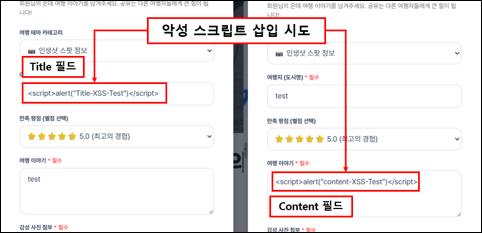
  </figure>
  <figure class="article-figure-row__item">
    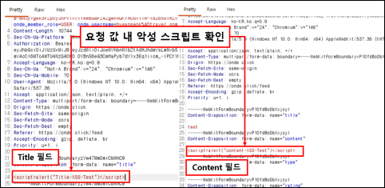
  </figure>

  <figure class="article-figure-row__item">
    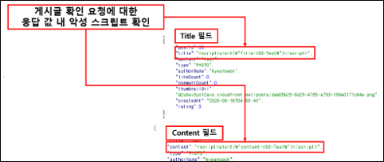
  </figure>
  <figure class="article-figure-row__item">
    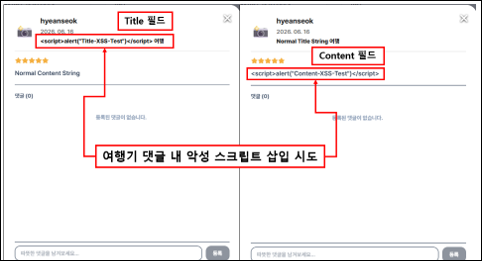
  </figure>

### ── Case 2. 여행기 댓글 쓰기 내 입력 값 검증 부재

- **대상 URL:** `POST /user-api/api/v1/posts/{postId}/comments` (파라미터: `content`)
- **내용:** 사용자가 댓글을 등록할 때 필터링이 누락되어 DB 및 응답 JSON에 날것의 태그가 가공 없이 반환됩니다.

### ── Case 3. 프로필 수정 내 입력 값 검증 부재

- **대상 URL:** `PATCH /api/v1/members/me/profile`, `PATCH /api/v1/seller/profile` (파라미터: `name`, `nickname`)
- **내용:** 사용자 및 판매자 프로필 관리창에서 이름과 닉네임 변경 시 스크립트 검증 코드가 결여되어 응답값에 그대로 노출됩니다.

### ── Case 4. 판매자 상품 등록 내 입력 값 검증 부재

- **대상 URL:** `POST /api/v1/seller/accommodations` (`name`, `description`), `POST /api/v1/seller/cars` (`modelName`)
- **내용:** 파트너 백오피스에서 숙소 등록 및 렌터카 등록 시 매물 정보 입력 단에 대한 필터링이 누락되어 있습니다.

### ── Case 5. 회원가입 내 입력 값 검증 문제점

- **대상 URL:** `POST /user-api/api/v1/auth/signup` (파라미터: `name`, `nickname`)
- **내용:** 일반 회원가입 등록 API 호출 시 가입자 이름과 닉네임 파라미터에 특수문자 및 태그 정제 처리가 누락되어 있습니다.

###  해결방안

모든 입/출력 값 검증은 서버 측에서 수행해야 하며, 특수문자(`<`  `&lt;`, `>`  `&gt;`, `(`  `&#40;`, `)`  `&#41;`, `#`  `&#35;`, `&`  `&amp;`, `'`  `&#39;`, `"`  `&quot;`)에 대한 표준 치환 필터를 설정하거나 대소문자 구분 없는 XSS 키워드 비교 함수를 필수 적용해야 합니다.

# 3. [1-2] 삽입 (Injection) 공격 가능성 (중요)

- **문제점 요약:** 사용자가 커뮤니티 게시글 조회 API의 `status` 파라미터에 악성 SQL 구문을 주입하는 경우, 입력값 검증 부재로 인해 시스템 내부에서 해당 입력값이 데이터베이스 명령어로 직접 실행되는 취약점이 있습니다. 이로 인해 공격자는 권한 우회를 통한 비공개 게시글 조회는 물론, 데이터베이스 내 전체 테이블 목록 및 회원 테이블에 저장된 민감한 이메일, 비밀번호 해시값 등을 무단으로 유출할 수 있는 위험이 있습니다.

### ── 여행기 조회 API status 파라미터 주입

- **대상 URL:** `GET /user-api/api/v1/posts` (파라미터: `status`)

  <figure class="article-figure-row__item">
    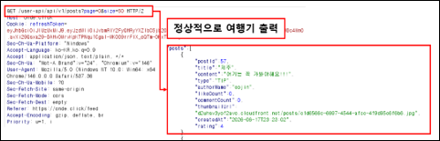
  </figure>
  <figure class="article-figure-row__item">
    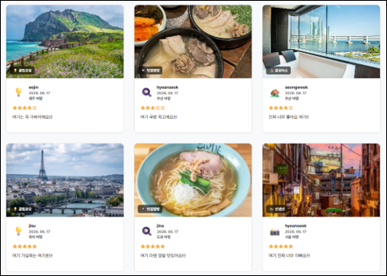
  </figure>

  <figure class="article-figure-row__item">
    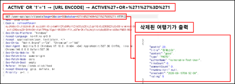
  </figure>
  <figure class="article-figure-row__item">
    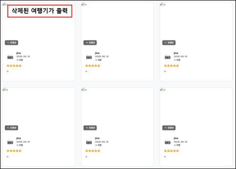
  </figure>

###  해결방안

입력되는 모든 값에 대한 유효성 검사를 수행하여 쿼테이션 문자(`'`, `"`)를 이스케이프 처리해야 합니다. Java 환경에서는 `PreparedStatement` 클래스를 활용해 매개변수 바인딩 처리를 수행해야 하며, MyBatis 등 SQL Mapper 사용 시 **`$` 형태의 동적 문자열 치환을 지양하고 `#` 형태의 안전한 바인딩 구문을 사용**해야 합니다.

# 4. [1-3] 파라미터 값 및 히든(hidden) 필드 조작 가능성 (중요)

- **문제점 요약:** 서버 측에서 비즈니스 검증 및 인가 프로세스를 누락하여, 클라이언트가 전송하는 고유 파라미터(금액, 마일리지, 식별자 자원) 값을 가로채 임의로 변경하더라도 백엔드가 원래 데이터와 대조하지 않고 그대로 수용 및 처리해 버리는 논리적 결함 체인입니다.

### ── Case 1. 결제 요청 금액 파라미터 조작을 통한 우회 결제

- **대상 URL:** `POST /user-api/api/v1/reservations/flights` (파라미터: `totalPrice`)

  <figure class="article-figure-row__item">
    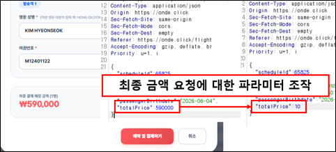
  </figure>
  <figure class="article-figure-row__item">
    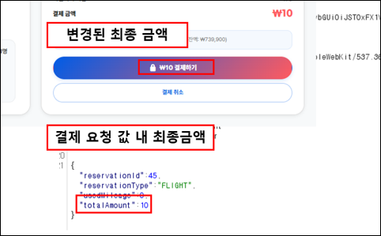
  </figure>
  <figure class="article-figure-row__item">
    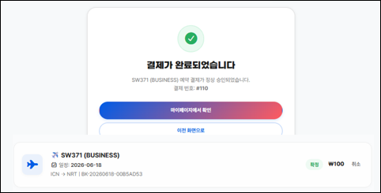
  </figure>

### ── Case 2. 음수 마일리지 파라미터 조작을 통한 결제 금액 왜곡 결함

- **대상 URL:** `POST /user-api/api/v1/payments/prepare` (파라미터: `usedMileage`)
- **내용:** 마일리지 사용량 인자에 음수(`-`) 값을 무단 주입 시 백엔드 차감 연산 과정에서 수식이 덧셈으로 오작동하여 실제 결제 금액을 정가보다 비정상적으로 높게 조작 및 왜곡시키는 결함입니다.

### ── Case 3. 예약 요청 회원 식별자 파라미터 조작을 통한 타인 명의 도용 결함 (설명 요약)

- **대상 URL:** `POST /user-api/api/v1/accommodations/reservations/rooms` 또는 `/cars` (파라미터: `memberId`)
- **내용:** 현재 로그인 세션(JWT)과 Body 데이터의 소유권을 대조하지 않아, `memberId`를 타인 식별자로 위조하면 서버가 이를 거르지 못하고 데이터베이스 상에 해당 타인의 명의로 예약을 무단 대리 등록해 버립니다.

### ── Case 4. 매물 식별 파라미터 조작을 통한 타인 소유 상품 정보 무단 변조 결함 (설명 요약)

- **대상 URL:** `PATCH /user-api/api/v1/seller/inventory/calendar` (파라미터: `propertyKey` -> `"stay-[ID]"` / `"car-[ID]"`)
- **내용:** 판매자 재고/요금 관리 시 소유권 인가 검증이 결여되어, 요청 바디의 `propertyKey`를 경쟁 업체의 매물 고유 코드로 변조 송신하면 타인의 상품 가격을 조작하거나 품절 처리시킬 수 있습니다.

###  해결방안

결제 금액 파라미터를 그대로 수용하지 말고 백엔드가 DB에서 직접 원래 상품 가격을 가져와 직접 연산 대조해야 하며, 마일리지는 범위 필터를 적용해야 합니다. 또한 **전송된 식별자(memberId, propertyKey) 정보가 현재 요청 헤더의 JWT 토큰에서 인가 및 복호화하여 추출한 실제 로그인 사용자 식별자와 정확하게 일치하는지 상호 소유권 검증 로직을 구현**해야 합니다.

# 5. [1-4] SSRF / File Inclusion 공격 가능성 (중요)

- **문제점 요약:** 파일 경로 및 외부 자원 호출 주소를 파라미터 인자로 전달받을 때 목적지 도메인 및 경로 조작 문자열에 대한 유효성 검증 장치가 부재하여, 서버 권한을 경유한 파일 탈취 및 내부 네트워크 침투가 성립되는 취약점입니다.

### ── Case 1. 템플릿 경로 조작을 통한 로컬 파일 유출 결함

- **대상 URL:** `POST /user-api/api/v1/report/integrated` (파라미터: `template`)

  <figure class="article-figure-row__item">
    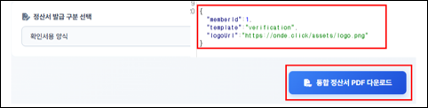
  </figure>
  <figure class="article-figure-row__item">
    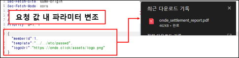
  </figure>
  <figure class="article-figure-row__item">
    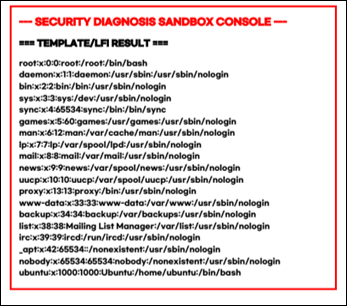
  </figure>

### ── Case 2. 로고 이미지 주소 조작을 통한 내부망 요청 위조 결함

- **대상 URL:** `POST /user-api/api/v1/report/integrated` (파라미터: `logoUrl`)
- **내용:** 리포트 생성 시 호출하는 `logoUrl` 파라미터에 클라우드 내부 인프라 메타데이터 주소(`169.254.169.254/latest/meta-data/`)를 위조 입력하면, 서버가 대신 접속하여 획득한 기밀 인프라 자격 증명 정보를 PDF 문서 내에 그대로 노출시키는 SSRF 결함입니다.

###  해결방안

경로 조작 문자(`../../`) 및 NULL meta Character를 필터링해야 하며, 파일 조회 시 실제 상대 경로 참조 대신 사전에 정의된 인덱싱 참조값 구조를 활용해야 합니다. 외부 URL 수용 시 **White List 방식의 신뢰 도메인 허용 로직을 구현**하고 `file://`, `dict://` 등의 위험 프로토콜 스키마 동작을 제한해야 합니다.

# 6. [1-5] 검증되지 않은 리다이렉트와 포워드 (일반)

- **문제점 요약:** 비인가 임시 개발 출처 헤더를 주입하여 실서버 API와 통신을 요청할 때 백엔드 전역 구성 규칙에 임시 로컬 호스트 대역이 승인된 채 배포된 결함이 존재합니다. 이로 인해 동일출처정책(SOP)을 우회하여 서비스 내 개인정보 및 비즈니스 데이터를 무단 탈취할 수 있는 위협이 존재합니다.

### ── CORS 전역 오설정을 통한 통제 정책 우회

- **대상 URL:** `/**` (백엔드 전체 API 경로의 `Origin` 헤더)

<figure class="article-figure-center">
  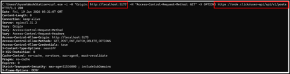
</figure>

###  해결방안

통합 설정부에서 임시 테스트용 로컬 호스트 허용 규칙을 모두 제거하고, 승인된 공식 운영 도메인 대역만 요청 가능하도록 엄격히 한정해야 합니다.

# 7. 결론 및 다음 계획

처음 수행해보는 웹 취약점 진단이라 초반 툴 세팅과 변조 패킷 구조 정렬 단계에서 노하우가 부족해 수많은 시간을 소비하는 시행착오가 있었습니다. 또한 고의적으로 포맷을 오염시켜 던졌을 때 서버가 뿜어내는 HTTP 500 디버그 정보 노출 에러를 6-1번 취약점으로 연계 매핑해야 하는지 등의 모호한 판단 경계선 때문에 밤새 고민이 많았습니다.

전체 **8개 그룹 28개 항목** 기준표에 대조해 보니, 오늘 정리한 시나리오 결과도 **겨우 '1번 대분류 항목(입/출력 값 검증 부재)의 절반 정도'를 끝낸 상태**임을 알게 됐습니다.

- **Next Step (이어서 계속 취약점 진단 진행):**
  - 남은 가이드라인 항목(패스워드 정책, 오류 페이지 정보 노출 등)을 같은 방식으로 이어서 진단합니다.
  - 입/출력 검증 구간에서 나온 500·스택 노출 케이스를 6-1 등과 매핑해 정리합니다.