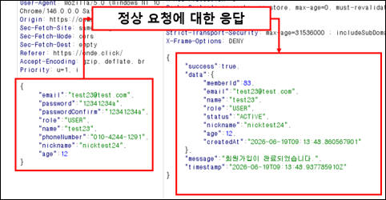
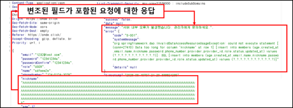
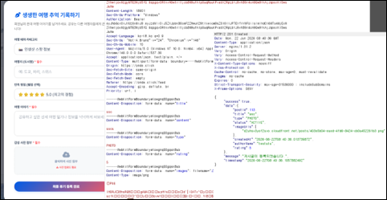
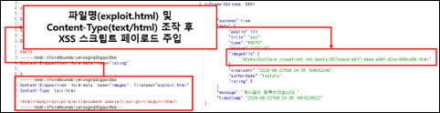
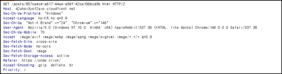
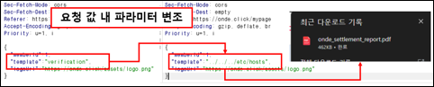
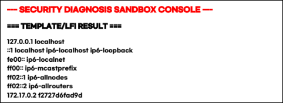
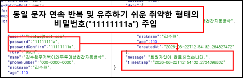

---

# 서론

> **"자동 진단 플랫폼 아르고스(Argus)의 동적 스캔 기준을 정하기 위해, 진단 대상 여행 플랫폼 '온데(Onde)'를 대상으로 첫 전체 취약점 진단을 진행했습니다. 이번에는 비즈니스 로직에 연결된 파라미터가 매우 많아 매핑하는 과정이 쉽지 않았습니다. 처음 분석하는 대량의 스캔 패킷이라 경험이 부족해 시간이 예상보다 오래 걸렸고, 예외 처리 필터의 기준도 모호해 여러 시행착오를 거치며 작성한 취약점 진단 상세 결과를 공유합니다."**
>
> 비즈니스 로직에 얽힌 대량의 파라미터를 매핑하며 1-6, 2-1, 2-2, 3-1 항목 진단을 완료했습니다. 초보 진단자의 시행착오와 핵심 결함 요약을 공유합니다.

# 1. 초보 진단자의 솔직한 시행착오 고백

이전의 단순한 주입 공격 검증을 넘어, 웹 애플리케이션의 모든 입력 데이터 크기, 형식, 무결성 제약조건을 검증하는 단계로 들어가니 말 그대로 '파라미터 지옥'이었습니다. 각 도메인(회원, 프로필, 커뮤니티, 항공, 숙소, 렌터카, 결제, 보험)마다 요청 DTO에 묶인 인자가 너무 많아, Burp Suite 프록시로 패킷 구조를 하나씩 분석하고 바꾸는 데 시간이 많이 걸렸습니다.

특히 규격을 초과하는 데이터를 찌르거나 잘못된 형식을 넣었을 때 백엔드 단에서 이를 400 에러(Bad Request)로 안전하게 끊어내지 못하고 데이터베이스 계층까지 도달하여 **HTTP 500 내부 서버 오류(Internal Server Error)**를 터뜨리는 현상을 마주했을 때 고충이 컸습니다. 내부 개발 오류 로그나 디버그 예외 정보가 응답 바디를 통해 외부에 적나라하게 노출되는 현상을 보며, 조치 기준과 오탐 필터링 규칙을 정교하게 다듬어야 할 필요성을 절실히 깨달았습니다. 대면 멘토링 특강에서 배운 내용을 기반으로, 발견된 코어 결함들의 상세 진단 내역을 명확히 요약 정돈했습니다.

# 2. [1-6] 입력 값 크기 및 무결성 검증오류 (중요)

- **문제점 요약:** 각 비즈니스 API를 처리하는 백엔드 요청 DTO의 입력 필드에 문자열 최대 길이와 수치 유효 범위 검증이 전반적으로 빠져 있습니다. 이 때문에 데이터베이스에 정의된 컬럼 크기나 규격을 넘는 대용량 데이터, 비정상 타입이 들어오면 미리 예외 처리하지 못하고 DB 계층에서 무결성 오류가 발생합니다. 결과적으로 **HTTP 500 내부 서버 오류**가 발생하고 백엔드의 SQL 실행 오류 로그와 상세 스택 트레이스 정보가 외부 응답 데이터에 필터링 없이 노출되는 문제가 전체 도메인에서 확인됐습니다.

### ── Case 1. 회원 가입 요청 시 필드 크기 제한 누락 결함

- **대상 URL:** `POST /user-api/api/v1/auth/signup` (파라미터: `nickname`, `name`, `phoneNumber`, `role`)
- **상세 내용:** 회원 가입 API 호출 시 전송되는 요청 DTO의 `nickname`, `name`, `phoneNumber` 문자열 입력 필드에 대해 최대 길이 제한 검증 로직이 빠져 있어 무결성 예외를 유발하고 내부 기밀 메시지를 노출합니다.

  <figure class="article-figure-row__item">
    
  </figure>
  <figure class="article-figure-row__item">
    
  </figure>

### ── Case 2. 프로필 수정 요청 시 필드 크기 제한 누락 결함

- **대상 URL:** `PATCH /user-api/api/v1/members/me/profile`, `PATCH /api/v1/seller/profile` (파라미터: `nickname`, `name`)
- **상세 내용:** 일반 사용자 및 파트너 셀러 프로필 변경 API의 이름, 닉네임 필드 크기 제한 누락으로 초과 데이터 주입 시 DB 무결성 예외 및 500 Error 로그 노출 결함이 확인되었습니다.

### ── Case 3. 게시글 작성 및 수정 요청 시 필드 크기 및 무결성 검증 누락 결함

- **대상 URL:** `POST /user-api/api/v1/posts`, `PUT /user-api/api/v1/posts/{postId}` (파라미터: `title`, `content`, `rating`, `type`, `images`)
- **상세 내용:** 새로운 커뮤니티 피드 생성 및 정정 시 제목(`title`) 필드의 최대 허용 크기(VARCHAR(200)) 검증 누락으로 대용량 데이터 전송 시 내부 SQL 실행 오류가 유출됩니다.

### ── Case 4. 항공권 예약 등록 요청 시 입력 필드 크기 및 무결성 검증 누락 결함

- **대상 URL:** `POST /user-api/api/v1/flights/booking` (파라미터: `scheduleId`, `passengerName`, `passengerPassport`, `seatClass`, `totalPrice`)
- **상세 내용:** 항공권 예약 인자 전반의 규격 및 금액 범위 검증 부재로 조작된 결제 수치 주입 시 내부 DB 에러 로그를 응답에 표출합니다.

### ── Case 5. 결제 준비 및 검증 요청 시 입력 범위 검증 누락 결함

- **대상 URL:** `POST /user-api/api/v1/payments/prepare`, `POST /user-api/api/v1/payments/validate` (파라미터: `reservationId`, `reservationType`, `usedMileage`, `totalAmount`, `impUid`, `pgAmount`)
- **상세 내용:** 가상 환경의 사후 결제 위변조 검증 API 호출 시 식별자 및 거래 수치에 한도를 초과하는 비정상 인자 전달 시 내부 연산 오류(500)가 유출됩니다.

### ── Case 6. 댓글 작성 및 수정 요청 시 입력 범위 검증 누락 결함

- **대상 URL:** `POST /user-api/api/v1/posts/{postId}/comments`, `PUT /user-api/api/v1/posts/{postId}/comments` (파라미터: `content`, `isSecret`)
- **상세 내용:** 댓글 등록/수정 시 본문 내용(`content`) 문자열이 유효한 UTF-8 포맷이 아니거나 `isSecret`에 불리언 외의 비정상 값 주입 시 안전하게 거르지 못하고 내부 서버 예외를 반환합니다.

### ── Case 7. 상품 예약 요청 시 입력 데이터 형식 및 수치 검증 누락 결함

- **대상 URL:** 숙소/항공/렌터카/보험 예약 등록 및 계산 API 전반 (`POST /user-api/api/v1/accommodations/rooms/reservations` 등) (파라미터: `memberId`, `roomId`, `checkinDate`, `checkOutDate`, `guests`, `startDate`, `endDate`, `carId`, `productId` 등)
- **상세 내용:** 각종 날짜 필드가 올바른 YYYY-MM-DD 형식인지 검증하지 않으며, 숫자형 필드에 비정상 타입을 대입 시 400 Bad Request 처리를 못 하고 상세 스택 트레이스 결과값을 배출합니다.

### ── Case 8. 판매자 정보 등록 시 입력 데이터 검증 누락 결함

- **대상 URL:** `POST /user-api/api/v1/seller/accommodations`, `POST /user-api/api/v1/seller/cars`, `POST /user-api/api/v1/seller/flights` (파라미터: `name`, `category`, `location`, `businessLicense`, `latitude`, `longitude`, `licensePlate`, `modelName`, `flightNumber`, `departureAirport` 등)
- **상세 내용:** 판매자가 파트너 매물 및 스케줄 등록 시 데이터 타입 제약 장치가 누락되어 포맷이 오염된 인자가 전달될 경우 최상위 500 오류를 노출합니다.

### ── Case 9. 목록 조회 및 검색 요청 시 입력 데이터 형식 검증 누락 결함

- **대상 URL:** 매물 검색, 지도 목록 조회, 피드 리스트 GET API 전반 (`GET /user-api/api/v1/accommodations/search` 등) (파라미터: `checkin`, `checkOut`, `guests`, `page`, `size`, `dates`, `swLat`, `swLng` 등)
- **상세 내용:** 페이징 및 좌표 쿼리 스트링 변수에 의도적으로 포맷이 파괴된 대용량 문자열 인자(`page=AAAAAAAAAAAAAAAAAAAA...`)를 주입 시, String에서 Integer로의 데이터 타입 캐스팅 오류 본문을 평문 출력하는 정보 노출이 식별되었습니다.

### 해결방안

백엔드 요청 DTO 객체 내부 문자열 필드 전체에 데이터베이스 물리 규격에 맞춘 최대 제한 길이 검증 어노테이션(예: `@Size(max = 100)`)을 명시하고, 날짜/수치형 변수에는 `@Min`, `@Positive` 및 형식 제약 조건을 바인딩하여 컨트롤러 진입 단계에서 즉시 400 Bad Request로 안전 차단해야 합니다. 예외 발생 시 내부 쿼리 구조나 프레임워크 명세가 포함된 `systemMessage`가 외부로 전달되지 않도록 서버 전역 예외 처리기(`Exception Handler`) 설정을 함께 보완해야 합니다.

# 3. [2-1] 악성코드파일 업로드 (중요)

- **문제점 요약:** Onde 플랫폼의 이미지 파일 업로드 기능에서 파일 확장자와 실제 바이너리 파일 타입(MIME Type)을 검증하지 않습니다. 이 때문에 공격자가 우회 웹셸 스크립트(`.jsp`)나 크로스 사이트 공격 코드가 숨은 스크립트 파일(`.html`, `.svg`)을 제한 없이 파일 스토리지(S3/MinIO)에 올릴 수 있고, 공개 다운로드 경로를 직접 호출하면 원격 코드 실행(RCE) 및 저장형 XSS 공격으로 이어질 수 있는 심각한 결함입니다.

### ── 여행기 작성 내 이미지 파일 우회 업로드 검증

- **대상 URL:** `POST /user-api/api/v1/posts`, `PUT /user-api/api/v1/posts/{postId}`, `POST /user-api/api/v1/seller/accommodations`, `POST /user-api/api/v1/seller/cars` (파라미터: `images`, `thumbnail`)
- **상세 내용:** 파일 업로드 기능 호출 시 실제 파일 타입에 대한 유효성 검증이 존재하지 않아, 악성 코드가 포함된 스크립트 파일이 제한 없이 스토리지에 업로드 및 실행될 수 있는 위협을 유발합니다.

  <figure class="article-figure-row__item">
    
  </figure>
  <figure class="article-figure-row__item">
    
  </figure>
  <figure class="article-figure-row__item">
    
  </figure>

###  해결방안

서버 측 파일 처리 모듈에서 대소문자를 구분하지 않는 화이트리스트 기반 확장자 검증(이미지 포맷인 JPG, GIF, PNG 등만 허용)을 구현하고, 이중 확장자(`.jpg.jsp`)나 특수문자 기호(`.`)를 이용한 우회 기법을 막아야 합니다. 파일명 내 경로 조작과 파싱 오작동을 일으키는 특수문자도 막고, 업로드 파일의 최소/최대 용량 제한(Size Limit)을 설정해야 합니다. 최종 저장 경로는 웹서버 하위 디렉터리가 아닌 별도 드라이브나 독립 스토리지 서버로 분리하고, 해당 공간의 실행 권한(Execute)을 거부해야 합니다.

# 4. [2-2] 중요 정보 파일 다운로드 가능성 (중요)

- **문제점 요약:** 마이페이지 내에서 통합 예약/정산 내역 PDF 보고서를 빌드하고 내려받는 API 호출 시, 내부 파일 시스템이 참조하는 요청 DTO 바디 상의 템플릿 경로(`template`) 인자에 대한 상위 디렉터리 탐색 차단 검증 로직이 빠져 있습니다. 공격자가 상위 폴더 접근 문자열(`../`)의 Path Traversal 구문을 인젝션할 시, 서버 내부 환경설정 파일(`.env` 또는 `application.yml`) 및 내부 주요 네트워크 식별 정보 자산을 통째로 포함한 PDF 결과물을 생성 및 다운로드하게 만들어 기밀 데이터를 고스란히 유출시키는 결함입니다.

### ── 통합 명세서 다운로드 template 경로 조작 진단

- **대상 URL:** `POST /user-api/api/v1/report/integrated` (파라미터: `template`)
- **상세 내용:** PDF 생성 및 다운로드 API 호출 시 바디 DTO의 `template` 필드에 대한 경로 검증 누락으로, 기밀 파일 내용을 통째로 포함한 PDF 명세서를 다운로드하게 만드는 결함입니다.

  <figure class="article-figure-row__item">
    
  </figure>
  <figure class="article-figure-row__item">
    
  </figure>

###  해결방안

다운로드 및 참조할 파일 경로를 정하는 파라미터에 경로 조작을 일으키는 특수문자(`../`, `/`, `\`, `%` 등)가 들어왔는지 서버에서 검사해야 합니다. 또 클라이언트가 서버 내부의 실제 파일명이나 물리 경로를 직접 넣지 못하게 하고, 서버에 미리 정한 안전한 화이트리스트 인덱스 코드 값만 받아 내부에서 매핑하는 '파일 간접 참조 방식'을 적용해야 합니다.

# 5. [3-1] 패스워드 정책 유무 및 반영 여부 (일반)

- **문제점 요약:** 회원 가입 및 비밀번호 변경 비즈니스 컨트롤러 단에서 수집되는 `password` 필드에 대해, 생성 시 필수적으로 요구되는 강력한 패스워드 복잡도 규칙 및 최소/최대 자릿수 길이 제약 조건 검증 로직이 백엔드 DTO 검증 계층에 반영되어 있지 않습니다. 이로 인해 연속 반복되거나 예측 가능한 단순 비밀번호 문자열을 기입하더라도 정상 회원으로 가입 승인이 떨어지며, 향후 무차별 대입 공격(Brute Force) 등 전개 시 타인의 계정이 손쉽게 탈취당할 수 있는 결함입니다.

### ── 회원 가입 등록 패스워드 규칙 검증 누락 진단 (대표 - 증적 사진 포함)

- **대상 URL:** `POST /user-api/api/v1/auth/signup` (파라미터: `password`)
- **상세 내용:** 패스워드 필드에 대해 강력한 암호 조합 복잡도 및 제약 조건이 누락되어 정상 계정 등록을 가동 허용하는 결함입니다.

<figure class="article-figure-center">
  
</figure>

###  해결방안

회원 가입 및 계정 정보 변경 로직 작동 시 패스워드의 안전성을 통제하기 위한 강력한 서버 검증 규칙(Server Side Validation)을 강제 선언해야 합니다. 대문자, 소문자, 숫자, 특수문자 중 2종류 이상 조합 시 10자리 이상, 3종류 이상 조합 시 8자리 이상의 복잡도 길이를 강제하고 초기값이나 취약 패스워드는 가입 단계에서 전면 반려해야 합니다. 동일 문자의 연속 반복 및 생일, 전화번호 기반 추측성 패턴 생성을 금지하고, 비밀번호 유효기간(일반 유저 60일, 관리자 분기별 1회) 정책 및 최근 사용 암호 재사용 차단 로직을 적용해야 합니다. 더불어 로그인 5회 실패 시 계정 잠금 통제 및 BCrypt 단방향 솔트 해시 암호화를 의무화해야 합니다.

# 6. 결론 및 다음 계획

이번 첫 수동 동적 진단을 통해 수많은 파라미터가 얽힌 웹 서비스의 입력값 검증 영역을 자세히 살펴볼 수 있었습니다. 경험 부족으로 패킷의 유효 인자를 매핑하고 500 에러 뒤에 숨은 스택트레이스 노출 결함을 진단 기준과 1:1로 맞추는 과정이 어려웠지만, 보안을 개발에 반영하는 방법을 배울 수 있었습니다.

SK쉴더스 가이드라인의 거대한 **8개 그룹 28개 항목 컴플라이언스 체계**에 대조해 보니, 오늘 밤샘 분석으로 도출해 낸 수많은 시나리오 데이터셋은 **겨우 대분류 항목의 일부 고지를 넘어선 상태**임을 실감했습니다. 진단 인프라 구축과 보안 가이드 만족을 위해 우리의 진단 여정은 중단 없이 계속 이어집니다.

- **Next Step (이어서 계속 취약점 진단 진행):**
