---

# 서론

> **"최종 프로젝트의 중요한 분수령인 중간 발표를 대비하여 그동안 달려온 기획, 개발, 진단 성과를 집대성한 중간 발표 PPT 산출물 빌드를 완료했습니다. 이번 일지에서는 AI 기반 개발 패러다임의 명암을 명확히 짚어낸 '프로젝트 개요'의 전반적인 세부 학술적 기획 배경부터, 핵심 아키텍처와 팀별 R&R 및 향후 로드맵의 요약본까지 중간 발표 자료의 핵심 정수를 일목요연하게 정리하고 시각 자산화가 필요한 배치 구간을 정의했습니다."**
>
> 최종 프로젝트 중간 발표를 대비해 기획·개발·진단 성과를 집대성한 PPT를 완성했습니다. 프로젝트 개요부터 ARGUS 3단계 파이프라인과 런칭 로드맵까지 핵심을 정리합니다.

<figure class="article-figure-center article-figure-center--wide">
  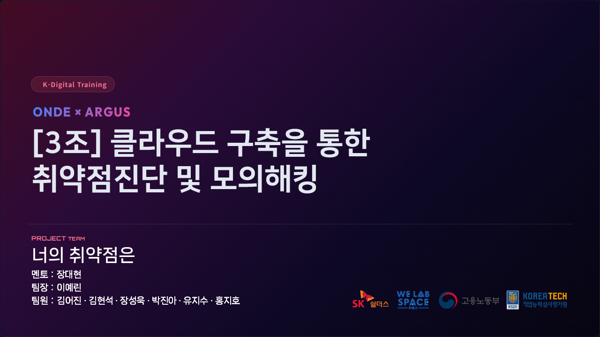
</figure>

# 1. 프로젝트 개요 (Project Overview) : 기획 배경과 패러다임 시프트

우리 팀(**너의 취약점은**)이 차세대 웹 취약점 자동 진단 플랫폼 **'아르고스(Argus)'**를 기획하게 된 핵심 문제의식과 학술적 배경을 슬라이드 전면에 전 수용하여 완벽히 내재화했습니다.

### ① 바이브 코딩(Vibe Coding)의 등장과 보안 착시 현상

- **바이브 코딩의 장점:** 2025년 안드레아 카파시(Andrej Karpathy)가 선언한 *"코딩을 느낌(Vibe)으로 한다"*는 패러다임처럼, 사용자의 자연어 요구사항만으로 AI가 구동 소스코드를 통째로 자동 생성하는 시대가 도래했습니다. 기획에서 상용 배포까지의 주기가 수일에서 수 시간으로 단축되며 Stack Overflow 2024 조사 결과 **이미 75.5%의 개발자가 AI 도구를 도입했거나 예정**인 것으로 드러났습니다.
- **바이브 코딩의 단점:** 그러나 정상 동작이 곧 안전의 증명은 아닙니다.
  - **NYU 연구 (Asleep at the Keyboard?):** GitHub Copilot이 생성한 코드의 **40%에서 보안 취약점이 발견**되었습니다. OpenSource의 취약한 패턴을 AI가 그대로 학습했기 때문입니다.
  - **Purdue 대학교 연구:** ChatGPT가 출력한 소프트웨어 엔지니어링 답변을 정밀 분석한 결과 **오류율이 무려 52%**에 달하는 것으로 증명되었습니다.
  - **Stanford 대학교 통제 실험 (2023):** AI 보조도구를 사용한 그룹(67%)이 미사용 그룹(33%)에 비해 **취약 코드를 작성할 확률이 2.0배(2x) 높게 측정**되었습니다. 심각한 점은 AI를 쓴 개발자들이 자신의 코드가 안전하다고 믿는 **'보안 착시 현상(Security Illusion)'과 과도한 오버컨피던스**에 빠져든다는 사실입니다.

  <figure class="article-figure-row__item">
    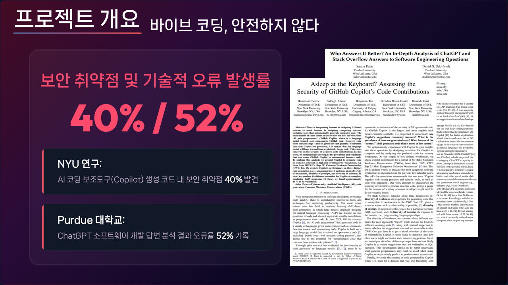
  </figure>
  <figure class="article-figure-row__item">
    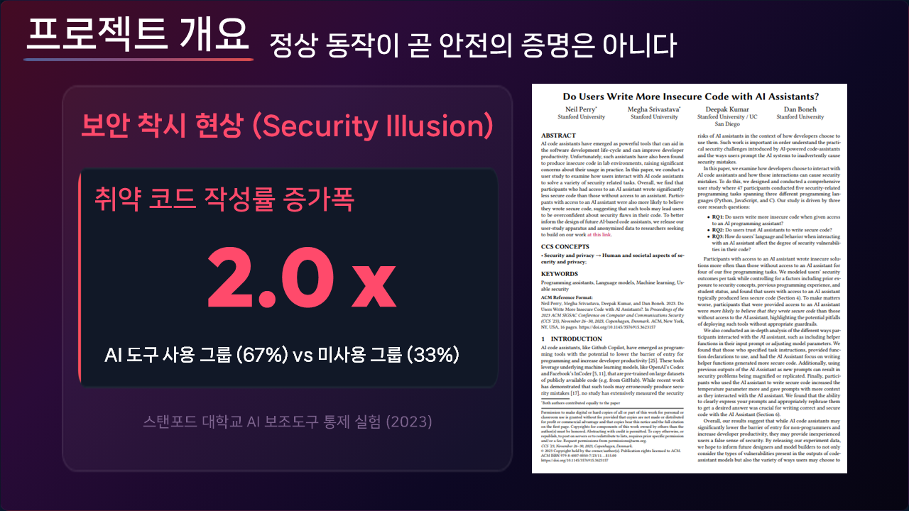
  </figure>

### ② 보안 패러다임의 전환과 상용/오픈소스 솔루션의 장벽

- **동작하지만 신뢰할 수 없는 코드:** 이제 AI가 관여한 모든 소스코드는 '동작하지만 신뢰할 수 없는 코드'로 간주해야 하며, 정밀 취약점 진단 프로세스는 선택이 아닌 생존을 위한 방파제입니다.
- **상용 보안 솔루션(Snyk, Checkmarx, Sparrow 등)의 장벽:** 높은 연간 수천만 원의 라이선스 고정 비용은 스타트업에게 감당하기 불가능하며, 난해한 CVSS 수치 나열과 보안 전문가 상주 전제 아키텍처는 주니어 개발자의 조치 진입 장벽을 높입니다.
- **오픈소스 도구(OWASP ZAP, Semgrep)의 한계:** 100% 가공되지 않은 영문 리포트 장벽, 파편화된 CLI 도구들을 수동 설정하고 취합하는 데 **진단 업무 시간의 40% 이상이 낭비**되는 비효율, 그리고 수천 건씩 쏟아지는 **과도한 오탐(False Positive) 피로감**으로 인해 조치를 포기하게 만듭니다.

  <figure class="article-figure-row__item">
    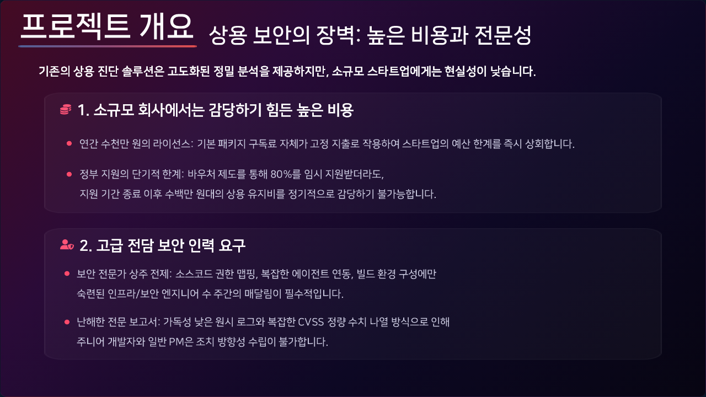
  </figure>
  <figure class="article-figure-row__item">
    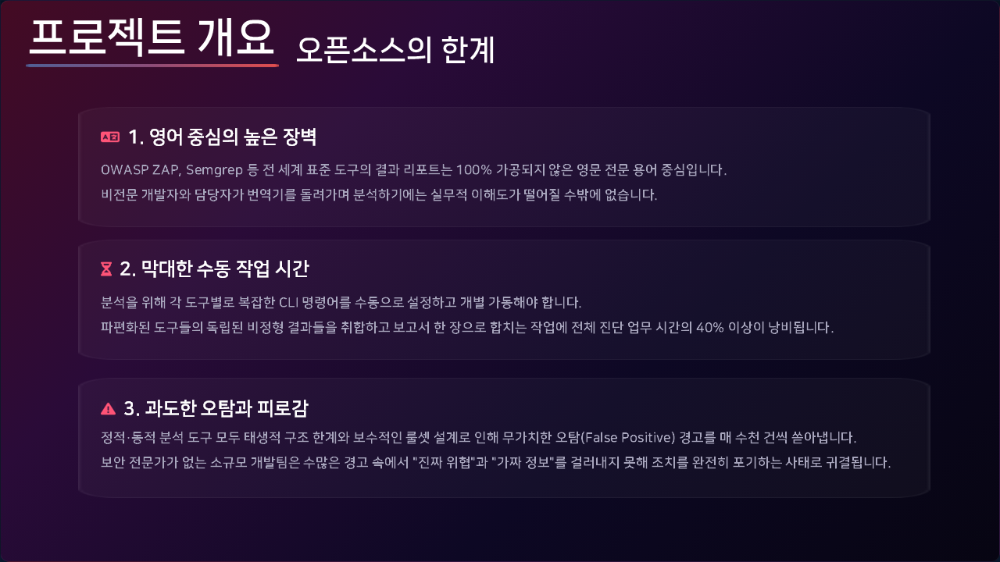
  </figure>

### ③ 우리 프로젝트의 지향점: ONDE 와 ARGUS

- **실증 대상 - ONDE (온데):** 우리가 자연어 기반 바이브 코딩으로 처음부터 직접 구축한 범용 여행 예약 서비스 플랫폼으로, 개발 과정에서 자연스럽게 수반되는 보안 취약점을 포착하기 위한 **최적의 타깃 실증 테스트베드**입니다.
- **진단 도구 - ARGUS (아르고스):** 연동 구조와 설정 장벽을 완전히 없애고, 최소한의 서비스 정보(URL, Swagger 명세)만 입력하면 **[ZAP 스캔  Selenium Replay 증적 캡처  한글 보고서 생성]**을 단일 파이프라인으로 관제하는 **웹 애플리케이션 취약점 진단 자동화 플랫폼**입니다.

# 2. 프로젝트 팀 구성 및 개발 전략 (Team & Strategy)

ONDE와 ARGUS의 효율적 딜리버리를 위해 아키텍처 특성에 맞춰 병렬 수평 개발 및 수직 모듈러 공정을 하이브리드로 채택했습니다.

- **ONDE 개발 전략:** 풀스택 5명과 인프라 2명이 협업하여 Presentation-Business-Infra 계층을 수평적으로 명확히 분리한 **계층형 아키텍처 기반 병렬 개발** 공정을 적용했습니다.
- **ARGUS 개발 전략:** 7명의 팀원 전원이 공통 백엔드 인터페이스 뼈대(Skeleton)를 공유하고, 28개 진단 룰셋 파이프라인을 기능별로 쪼개어 독립 개발한 뒤 결합하는 **수직적 슬라이스(Vertical Slicing) 모듈러 개발**을 진행 중입니다.

  <figure class="article-figure-row__item">
    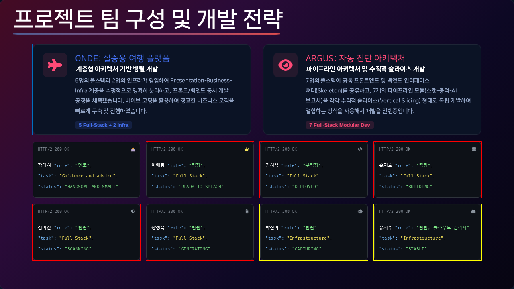
  </figure>
  <figure class="article-figure-row__item">
    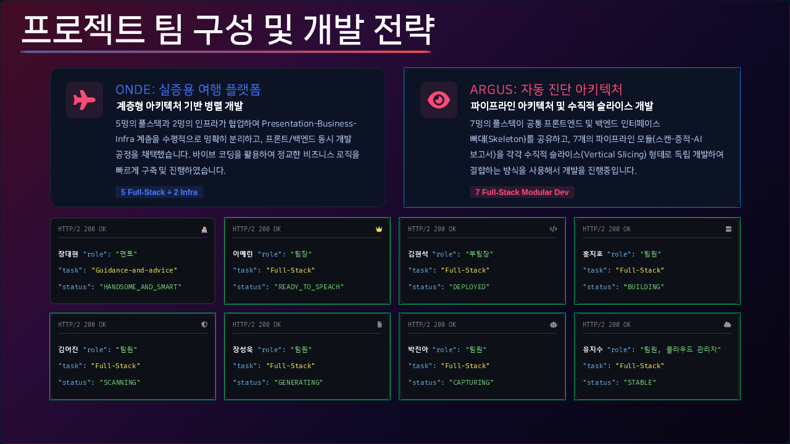
  </figure>

# 3. 프로젝트 수행 절차 및 방법 (Process & Implementation)

실증 대상인 ONDE의 세부 기능 도메인 명세와, 수동 진단으로 포획한 실제 결함 통계, 그리고 이에 대응하여 가동할 ARGUS 플랫폼의 내부 엔지니어링 메커니즘을 매핑했습니다.

### ① ONDE 페이지별 전체 기능 구조도

- **일반 사용자 포탈 (비인증/인증):** 숙소(지역/날짜/인원 무한스크롤 검색), 항공(편도/왕복 통합 검색), 렌터카(인벤토리 카드 제어), 여행자보험(담보 보장 실시간 비교 계산기), 지도(Leaflet 마커 매핑), 여행기 커뮤니티(그리드 피드 및 댓글), 결제(주문 정보 위변조 방지 검증 및 가상지갑 연동), 마이페이지(등급/마일리지 조회 및 거래 트래킹).
- **판매자 전용 백오피스:** 숙소/항공/렌터카 인벤토리 캘린더 UI 가격 제어, 매출 통계 대시보드(누적 매출 및 수수료율 연동 대차트), 정산 청산 계정 인프라(국세청 NTS API 연동 가이드 규격 세팅).
- **관리자 전용 백오피스 (격리):** 상품 검수 관리(입점 제안 도메인 승인/반려), 정산 승인 관리(1차 셀러/2차 슈퍼 어드민 심사 체계), 전사 예약 관제 및 직권 취소, GMV/매출 비중 종합 대시보드, 회원 권한 블랙리스트 제어, 여행기 블라인드 통제.

<figure class="article-figure-center article-figure-center--wide">
  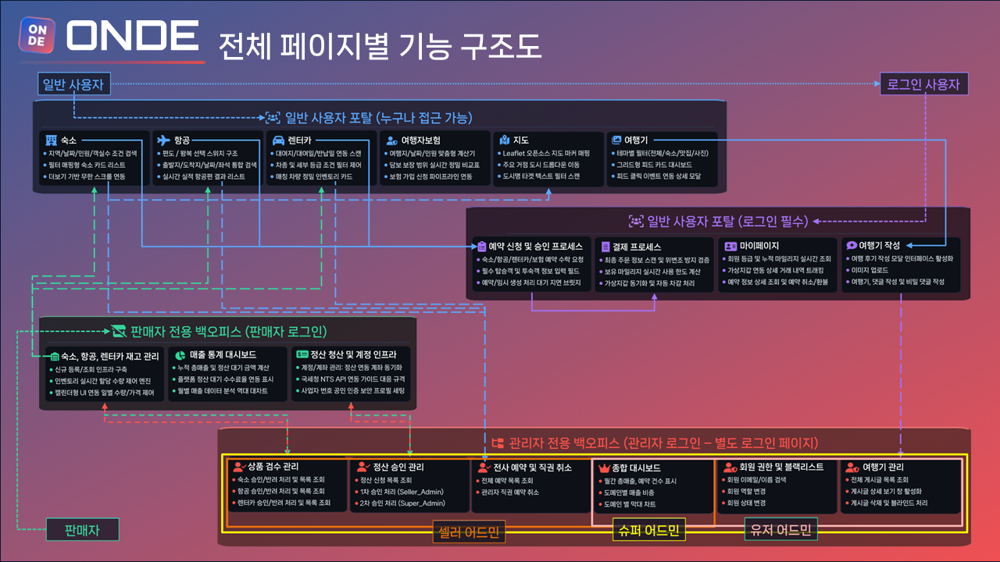
</figure>

### ② 수동 진단 기반 ONDE 최초 취약점 평가 통계

SK쉴더스 Web/API 개발 보안 가이드라인 28개 기준 항목을 수동 대입하여 교차 검증한 결과, **1. 입/출력 값 검증 부재(XSS, Injection, 파라미터 조작)**, **2. 취약한 파일 처리(악성코드 업로드, LFI)**, **6. 부적절한 오류 처리(오류 페이지 정보 노출)** 대분류 영역에서 치명적인 실전 결함이 대량 포획되어 완벽한 런칭 패드가 성립되었음을 입증했습니다.

# 4. ARGUS 3단계 통합 파이프라인 및 최종 런칭 로드맵

중간 발표의 하이라이트인 아르고스(Argus)의 고유 코어 테크놀로지 3단계와 7월 20일 최종 런칭(Launch) 프로덕션 스케줄을 확정했습니다.

###  ARGUS 코어 3단계 자동화 메커니즘

1. **PHASE 01. ENGINE CONTROL (FastAPI & ZAP):** 독립 실행되던 OWASP ZAP의 동적 진단 정책을 Python FastAPI 코드로 정밀 제어하며, 주입된 `swagger.json` 명세를 기반으로 DAST 탐지를 자동 트리거합니다.
2. **PHASE 02. EVIDENCE ACQUISITION (Selenium Replay):** 탐지된 페이로드를 Selenium Headless 브라우저가 실시간 시뮬레이션 및 재현하여, XSS 팝업창이나 권한 우회 페이지 진입 순간의 **실제 응답값 중심 해킹 검출 장면을 즉시 화면 캡처**합니다.
3. **PHASE 03. INTELLIGENT REPORTING (원클릭 한글 PDF):** GPT-4o 연산으로 500 에러 등의 오탐을 정제하고, 매핑된 조치 가이드와 시각 증적을 결합하여 경영진-기술팀 통합형 SK쉴더스/KISA 표준 규격 한글 PDF 보고서를 단 한 번의 클릭으로 자동 출고합니다.

<figure class="article-figure-center article-figure-center--wide">
  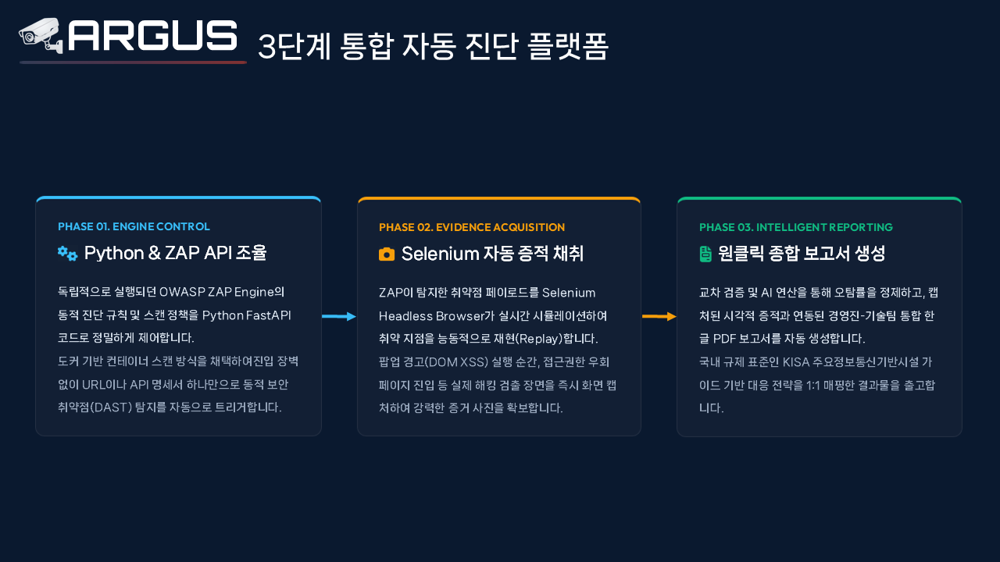
</figure>

### 최종 프로덕션 Launch 로드맵 타임라인

- **06.29~06.30 (인터페이스 표준화):** SQLModel 데이터 표준 계약 선언, ZAP Docker 및 Headless 크롬 세부 환경 직렬 연동성 실증 완료.
- **07.01~07.08 (동적 검증 & Replay 독립 개발):** 개발자 B1~B7 독립 브랜치 기반 28개 스캔 규칙 정제 튜닝 및 Selenium Replay 캡처 소스 28종 병렬 개발 전개.
- **07.09~07.10 (중앙 코드 병합 및 결합 QA):** Git 브랜치 메인 통합 병합, 룰 레지스트리 1:1 매핑 선언 및 28개 파이프라인 전수 결합 QA 안정성 100% 도달.
- **07.13~07.14 (비동기 아키텍처 연동):** Celery 비동기 분산 큐 및 Redis 미들웨어 최적화, scan.py 고유 UUID 라우터 연동 및 실시간 진척도 송출 시스템 완비.
- **07.15~07.17 (PDF 엔진 마감 및 종합 검수):** WeasyPrint 기반 한글 템플릿 매핑 CSS 최적화, Juice Shop 대상 모의 테스트베드 최종 예외 처리 및 트러블슈팅 정돈.
- **07.20 (FINAL LAUNCH):** ARGUS 통합 보안 진단 시스템 v1.0 정식 릴리즈 및 이관.

<figure class="article-figure-center article-figure-center--wide">
  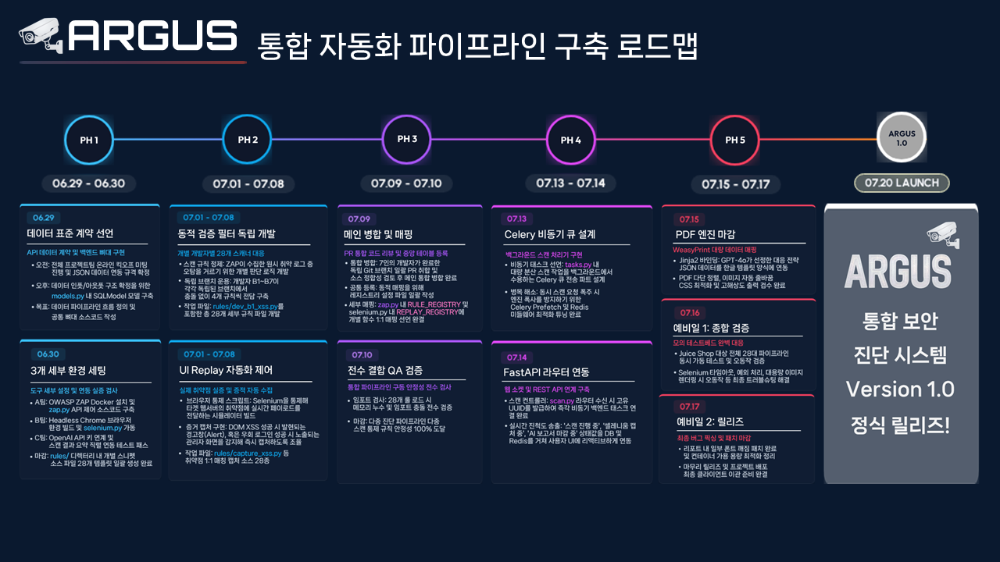
</figure>

# 5. Next Step: 중간 발표 장표 연습 & 취약점 진단

<figure class="article-figure-center article-figure-center--wide">
  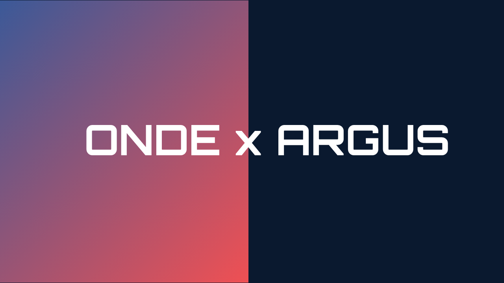
</figure>

- **중간 발표 연습:** 완성된 PPT를 토대로 중간 발표 연습
- **취약점 진단 지속:** 아직 완료 하지 못한 취약점 항목 지속 진단 진행
