---

# 서론

> **"진단 대상 여행 플랫폼 '온데(Onde)' 실서버 환경을 타깃으로 2차 전수 수동 취약점 진단을 완수했습니다. 이번 스프린트는 그야말로 끝없는 '파라미터 지옥'이었습니다. 회원가입, 결제 사전 검증, 상품 등록, 검색 쿼리 스트링까지 제어해야 할 인자와 필드가 너무나 많아 패킷을 하나하나 잡고 변조 대입하는 데 엄청난 시행착오와 시간이 소요되었습니다. 수동 웹 해킹 진단의 실전 노하우를 뼈저리게 체화하며 도출해 낸 3-2 항목부터 8-1 항목까지의 정밀 진단 상세 결과 요약본을 공유합니다."**
>
> 온데 실서버를 대상으로 2차 전수 수동 취약점 진단을 완수했습니다. 3-2부터 8-1까지의 정밀 진단 결과를 패킷 데이터 기반으로 요약합니다.

# 1. 취약한 접근통제 관리 (3-2 ~ 3-6)

### ── 3-2. 인증 실패 횟수 제한 (일반 - 취약)

- **문제점:** 로그인 API 호출 시 인증 실패 횟수를 누적하여 제어하는 임계치 보호 정책이 마련되어 있지 않습니다. 이로 인해 공격자가 올바른 패스워드를 찾아낼 때까지 자동화 툴을 가동하여 무제한으로 무차별 대입(Brute Force) 공격을 감행할 수 있는 심각한 결함이 존재합니다.

  <figure class="article-figure-row__item">
    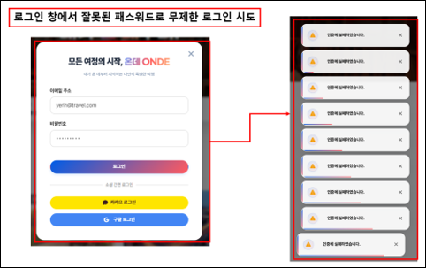
  </figure>
  <figure class="article-figure-row__item">
    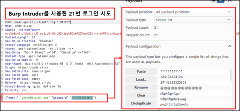
  </figure>
  <figure class="article-figure-row__item">
    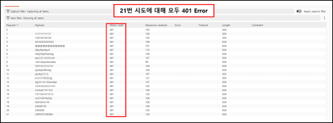
  </figure>

- ** 해결방안:** 로그인 실패 시 DB 내 실패 카운터를 누적하고, 5회 초과 시 계정 상태를 즉각 임시 잠금(`isLocked = true`) 처리해야 합니다. 또한 연속 인입을 차단하기 위해 로그인 패널에 CAPTCHA(캡차) 우회 방지 기술을 강제 결합할 것을 권고합니다.

### ── 3-3. 계정 정보 파악 가능성 (일반 - 취약)

비즈니스 로직 설계 미흡으로 인해 활성 유저의 계정 식별자 및 존재 여부가 대외 노출되는 3가지 케이스가 실증되었습니다.

- **Case 1 (댓글 목록 조회):** 비인증 유저가 댓글 목록을 가져올 때 응답 DTO 내부에 댓글 작성자의 DB 기본키 식별자(`memberId`)가 날것으로 출력되어 전체 회원 번호 구조가 손쉽게 유출됩니다.

  <figure class="article-figure-row__item">
    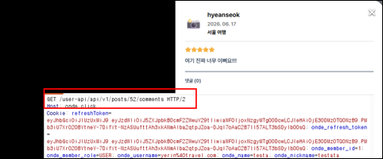
  </figure>
  <figure class="article-figure-row__item">
    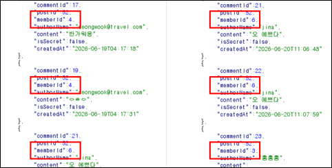
  </figure>

- **Case 2 (게시글 검색 SQLi):** 게시글 검색 필터 파라미터(`status`) 입력값이 쿼리문에 동적Concatenation 처리되어 있어, SQL 인젝션을 통해 회원 테이블 내 전체 가입자의 이메일 주소와 패스워드 암호 해시 원본이 통째로 노출됩니다.

- **Case 3 (이메일 중복 확인):** `/auth/check-email` API 검증 시, 미등록 주소는 200 OK와 사용 가능 메시지를 주지만 기등록 주소는 "이미 사용 중인 이메일입니다."라는 차별적 에러 평문을 반환하여 외부 공격자가 가입 유저 존재 여부를 무차별 열거(User Enumeration)해 갈 수 있습니다.

- ** 해결방안:** DTO 설계 시 불필요한 고유 시퀀스 번호를 전면 지우고 화면 노출용 닉네임만 배출하도록 최소화해야 합니다. 중복 체크 API 대역에는 IP당 요청 임계치 제한(Rate Limiting) 정책을 바인딩하여 자동화 탐색 기전을 차단해야 합니다.

### ── 3-4. 관리자 페이지 분리 여부 (일반 - 양호)

- **진단 결과:** 일반 사용자 서비스 도메인(`https://onde.click`)과 시스템 관리 백오피스 주소(`https://admin.onde.click`)가 물리 및 도메인 레벨에서 완벽하게 분리되어 작동하고 있습니다. 일반 경로를 통해 관리자 전용 주소진입 시 Nginx 프록시 단에서 404 차단 처리가 원천 기동되어 양호한 통제 상태를 보여줍니다.

  <figure class="article-figure-row__item">
    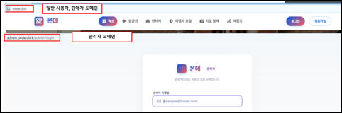
  </figure>
  <figure class="article-figure-row__item">
    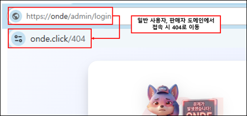
  </figure>

### ── 3-5. 검색엔진 정보 노출 가능성 (일반 - 취약)

- **문제점:** 구글이나 네이버 등 외부 검색엔진 로봇의 무단 크롤링을 통제하는 웹 표준 설정 파일인 `robots.txt`가 루트 디렉터리에 존재하지 않습니다. 더불어 관리자 로그인 및 판매자 콘솔 페이지 소스코드 내에도 로봇 검색 수집을 금지하는 noindex 메타 태그가 누락되어 있어, Google Dorking 고급 검색 기법에 의해 비공개 페이지 경로와 내부 인프라 식별자가 외부 인덱싱에 무단 노출될 위험이 상존합니다.

- ** 해결방안:** 웹 서비스 최상위 루트 경로에 무분별한 수집을 제한하는 표준 `robots.txt` 파일을 배치하고, 외부 노출이 차단되어야 하는 백오피스 및 파트너 포탈 소스 HTML 헤더 내에 `<meta name="robots" content="noindex, nofollow">` 규격을 명시적으로 삽입 가동해야 합니다.

### ── 3-6. 백업 파일 및 테스트 파일 존재 여부 (일반 - 양호)

- **진단 결과:** 개발 단계에서 소홀히 방치될 수 있는 임시 백업본(`.bak`, `.zip`, `.tmp`)이나 소스 backup, 테스트 더미 파일의 존재 여부를 파악하기 위해 총 60종의 전형적인 추측성 파일명 사전 파일셋을 Burp Intruder에 주입해 전수 조사를 감행했습니다. 다행히 모든 은닉 경로에 대해 400 또는 404 에러로 완벽히 예외 제어 응답이 차단 반환되어 안전함이 검증되었습니다.

# 2. 취약한 인증 및 세션 관리 (4-1 ~ 4-5)

### ── 4-1. 쿠키(Cookie) 및 웹 스토리지 조작 가능성 (일반 - 취약)

- **문제점:** 사용자 로그인 성공 시 서버 단에서 보안 속성이 부여된 헤더 쿠키를 주는 것처럼 설계했으나, 동일 토큰 명세 텍스트를 응답 JSON 바디(`data.accessToken`)에 평문으로 중복 배출하는 치명적인 결함이 발견되었습니다. 프론트엔드가 이를 받아 자바스크립트 접근이 허용된 평문 일반 쿠키(`onde_access_token`)로 브라우저에 중복 영속화하고 있어, 추후 XSS 공격 구문 주입 시 `HttpOnly` 방어벽이 완전히 우회 무력화되어 세션 토큰이 날것으로 탈취될 수 있는 상태입니다.

<figure class="article-figure-center">
  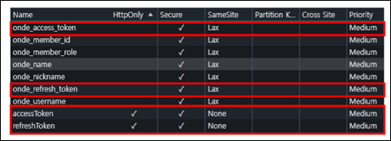
</figure>

- ** 해결방안:** 로그인 성공 응답 바디 JSON Response DTO 객체 구조에서 토큰 리턴 필드를 전면 제거하십시오. 프론트엔드 일반 스크립트 쿠키 적재 로직을 완전 폐기하고, Axios 통신 모듈에 `withCredentials: true`만 부여하여 브라우저 네트워크 단에서 서버가 발행한 안전한 보안 쿠키 세션만 자동 전송되도록 단일화 체계 패치를 권고합니다.

### ── 4-2. 인증(세션 및 토큰) 값 안전성 설정 여부 (일반 - 취약)

- **Case 1 (중요 인증 정보 클라이언트 노출):** 로그인 응답 패킷 바디 내에 유추하기 쉬운 회원 고유 일련번호(`memberId: 1`)를 가공 없이 노출하고 있으며, 디코딩이 가능한 JWT 페이로드 영역 내부에 유저 로그인 이메일 주소 명세(`sub`)를 평문으로 기재하는 설정 부실이 실증되었습니다.

- **Case 2 (로그아웃 시 서버 측 세션 미파기):** 백엔드 아키텍처에 로그아웃 처리를 통제하는 전용 만료 API가 부재합니다. 클라이언트 브라우저 쿠키만 지울 뿐, 탈취된 세션 토큰을 서버 사이드 캐시 메모리에서 강제 무효화(Blacklist) 처리하지 않아 이전 토큰을 재송신 시 유효시간 동안 정상 인가 승인이 떨어집니다.

- **Case 3 (중복 로그인 통제 미흡):** 동일 계정이 서로 다른 다중 IP 대역이나 이기종 VM 가상화 환경에서 중복으로 동시 커넥션을 수립해 인가 필터를 타격하더라도, 이를 감지하거나 기존 세션을 차단하는 동시 접속 제한 장치가 유실되어 있습니다.

- ** 해결방안:** 로그아웃(`POST /api/v1/auth/logout`) API를 신설하여 요청 즉시 Redis 인메모리 저장소에 해당 토큰을 유효 수명 동안 Blacklist 키로 등록 동기화하고 레코드를 소멸시켜야 합니다. JWT 토큰 발행 시 `sub` 영역의 이메일 값을 범용 고유 식별자(UUID)로 대체해 기밀성을 확보하십시오.

### ── 4-3. 접근제어 우회 가능성 확인 (일반 - 취약)

- **문제점 요약:** 비즈니스 인가 아키텍처 내에서 요청 파라미터 값과 현재 API 요청을 보낸 보안 컨텍스트 Principal 객체 간의 소유권 상호 비교 대조 검증 로직이 전무합니다. 이로 인해 파라미터 내의 고유 키 식별 값을 변조할 때 시스템 통제권을 통째로 우회당하는 2가지 치명적 IDOR(Broken Object Level Authorization) 결함 케이스가 도출되었습니다.

#### Case 1. 예약 요청 회원 식별자 파라미터 조작 명의 도용 (IDOR)

- 숙소 및 렌터카 예약 등록 패킷 바디 내의 `memberId` 값을 내 일련번호 대신 임의의 타인 시퀀스 번호(`memberId: 56`)로 조작 전송할 시, 서버가 소유주 대조를 하지 않고 타인의 명의와 가상 자산 계정으로 예약을 강제 바인딩 영속화시키는 결함이 존재합니다.

  <figure class="article-figure-row__item">
    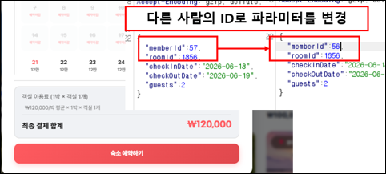
  </figure>
  <figure class="article-figure-row__item">
    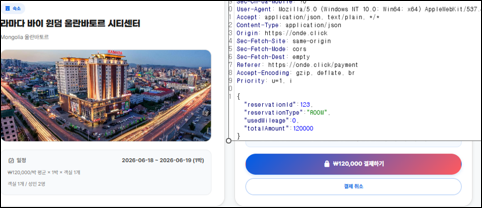
  </figure>

  <figure class="article-figure-row__item">
    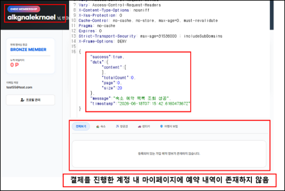
  </figure>
  <figure class="article-figure-row__item">
    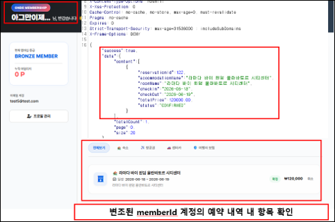
  </figure>

#### Case 2. 매물 식별 파라미터 조작 타인 상품 재고/요금 무단 변조 (BOLA)

- 파트너 셀러가 실시간 재고 및 단가를 제어하는 달력 설정 API 호출 시, 바디 인자인 매물 키 값(`propertyKey`)을 경쟁 파트너사의 숙소 고유 식별코드(`"stay-1"`)로 변조 송신하더라도 판매자 소유권 크로스 체크가 결여되어 있어 타인의 매물 가격을 100원으로 변조하거나 강제 품절시킬 수 있는 리스크가 존재합니다.

- ** 해결방안:** 수신된 DTO 내의 `memberId` 또는 매물 식별자로부터 추적된 셀러 ID 데이터와, 현재 HTTP 요청 헤더 JWT 토큰에서 복호화해 추출한 **인증 Security Context 내 Principal 사용자 고유 식별자가 물리적으로 일치하는지 비교 대조하는 인가 검증 인터셉터(Authorization Interceptor)를 의무 도입**하고, 불일치 시 403 Forbidden 예외를 반환하도록 리팩토링해야 합니다.

### ── 4-4. 비인증 상태로 중요 page접근 가능성 (일반 - 양호)

- **진단 결과:** 프론트엔드 라우터 계층(`App.tsx`) 단에서 공통 가드 모듈인 `<RequireAuth>` 및 `<RequireRole>` 아키텍처를 전방 배치하여 세션이 없는 비인증 주소 다이렉트 타이핑 진입 시 즉각 비인증 예외 페이지(`/401`)로 리다이렉트 통제하고 있습니다. 아울러 백엔드 코어 서버 역시 `SecurityConfig.java` 구성에 의해 토큰 부재 시 401 Unauthorized 상태 코드를 견고하게 연동 반환하므로 접근제어 우회가 원천 차단된 양호 상태입니다.

### ── 4-5. 일반계정 권한 상승 가능성 (일반 - 취약)

- **문제점:** 신규 회원가입을 처리하는 API 컨트롤러 레이어에서 DTO 인풋 데이터 검증 처리가 누락되어, 클라이언트 프록시 도구에서 송신하는 가입 정보 명세 내역의 역할 등급 파라미터(`role`)를 필터링 없이 그대로 영속화 계층에 매핑하고 있습니다. 일반 가입 요청 폼 패킷에 `"role": "SUPER_ADMIN"`, `"SELLER_ADMIN"` 항목을 강제 인젝션해 전송할 경우, 서버 단에서 이를 `USER` 권한으로 강제 리셋시키지 못하고 **최고 권한자 등급의 어드민 계정으로 즉시 무단 가입 승인 처리**해 버리는 치명적인 권한 상승 결함이 실증되었습니다.

- ** 해결방안:** 가입 등록 API 단에서 수용 가능한 권한 범위를 오직 화이트리스트 기반 일반 유저(`USER`) 및 일반 파트너(`SELLER`) 등급으로 엄격히 한정 제약하고, 관리자 권한군 파라미터 인입 시 즉각 요청을 거부하도록 에러 핸들링을 구축해야 합니다. 어드민 권한 할당은 대외 API 경로를 완전히 폐쇄하고 정용 DB 직권 SQL문이나 기 승인자의 백오피스 수동 임명을 통해서만 프로비저닝되도록 거버넌스를 개편해야 합니다.

# 3. 중요 정보 저장/전송 처리 미흡 & 부적절한 오류 처리 (5-1 ~ 6-2)

### ── 5-1. 소스코드 내 주요정보 노출 여부 (일반 - 취약)

- **문제점:** 백엔드 토큰 관리 컴포넌트 및 대칭키 암호화 유틸 클래스인 `AdminJwtTokenProvider.java`와 `AesUtil.java` 소스코드 내에 시스템 비밀키 유실 시를 대비한 Fallback 기본 문자열 상수가 날것의 평문 형태로 하드코딩 노출되어 있습니다. 인프라 구동 환경 변수 주입이 실패하더라도 서버가 크래시 없이 코드 내 기본 상수로 자동 구동되므로, 소스코드가 유출될 경우 공격자가 무단으로 토큰을 위조하거나 계좌번호 등의 민감 영속화 데이터를 일괄 복호화할 수 있는 보안 취약 요소입니다.

- ** 해결방안:** `@Value` 어노테이션 내 콜론(:) 구분자 뒤에 하드코딩 기재된 모든 디폴트 상수 키 문자열을 전면 삭제하십시오. 환경 변수 로드 누락 시 취약 키로 우회 구동되는 유해 패턴을 소멸시키고, 주 주입 에셋 부재 시 초기화 컨텍스트 단계에서 즉시 프로세스가 구동 실패하도록 **Fail-Fast 거버넌스 메커니즘**으로 전향해야 합니다.

### ── 5-2. 요청 및 응답 값 내 주요정보 포함여부 확인 (중요 - 취약)

- **문제점:** 프로필 조회 API 및 파트너 대시보드 관제용 API 통신 패킷 분석 결과, 인가된 해당 소유 당사자에게 내려가는 응답 데이터라는 이유로 이메일 계정명, 성명, 연락처, 그리고 금융 데이터인 **정산 은행명 및 정산 계좌번호 핵심 식별 정보가 아무런 마스킹(Masking) 필터 처리 없이 100% 평문 형태로 대외 유출**되는 결함이 존재합니다.

  <figure class="article-figure-row__item">
    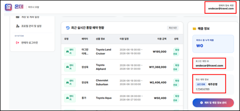
  </figure>
  <figure class="article-figure-row__item">
    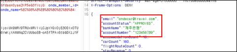
  </figure>

- ** 해결방안:** 개인정보 보호 조치 규정에 의거하여 DTO 매핑 직전 단계에 직렬화 마스킹 필터(이메일  `us***@travel.com`, 계좌번호  `123-***-7890`) 레이어를 탑재하여 비식별화 가공을 적용해야 합니다. 원본 금융 데이터의 전체 확인이나 변조 변경이 발생할 때만 비밀번호 2차 검증 절차(2FA)를 통과하도록 이중화 검증 플로우를 수립해야 합니다.

### ── 6-1. 오류페이지를 통한 정보 노출 여부 (일반 - 취약)

- **문제점 요약:** 백엔드 내부 예외 처리기 및 프론트엔드 Axios 리스너 단의 조치 미흡으로 인해 비정상 파라미터나 포맷 오염 인자가 주입되었을 때 최상위 에러 상태와 내부 시스템 아키텍처 명세를 고스란히 화면 및 응답에 노출하는 2가지 예외 노출 케이스가 수동 진단되었습니다.

#### Case 1. 웹 API 예외 발생 시 스택 트레이스 및 시스템 메시지 노출

- 자료형 매칭 오류를 유도하는 비정상 인자를 API 엔드포인트에 삽입 주입했을 때, 서버가 공통 바디 `systemMessage` 필드 내부에 자바 스프링 프레임워크 최상위 예외 클래스 스트링(`HttpMessageNotReadableException: JSON parse error...`)을 필터링 없이 리턴하여 시스템 기술 스택 내부 명세를 유출시킵니다.

  <figure class="article-figure-row__item">
    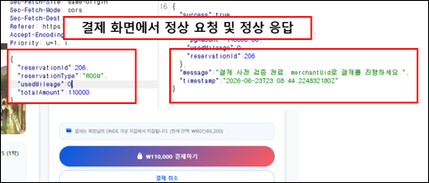
  </figure>
  <figure class="article-figure-row__item">
    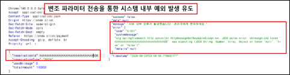
  </figure>

#### Case 2. 클라이언트 UI Toast 알림 내 원시 에러 메시지 노출 결함

- 프론트엔드 일반 뷰 계층에서 API 통신 예외 수신 시, Toast 알림 팝업 컴포넌트 스트링 파일에 정제된 한글 문장 처리를 하지 않고 서버가 배출한 원시 예외 메시지(`S-001 데이터베이스 실행 무결성 예외 발생 코드`)를 사용자 화면에 날것 그대로 렌더링 노출시킵니다.

- ** 해결방안:** 백엔드 글로벌 에러 핸들러(`@RestControllerAdvice`) 구조를 점검하여 최상위 시스템 예외 캐치 시 외부 출력 DTO 내에 `e.getMessage()` 반환 바인딩을 전면 전면 금지하고, 오직 기술팀 내부 로그 파일(`.log`)에만 상세 스택 트레이스를 기록하며 외부에는 안전한 범용 표준 메시지("서버 내부 오류가 발생했습니다.")만 전달하도록 캡슐화해야 합니다. 프론트엔드 역시 Axios Interceptor 레이어에서 원시 에러 문자열 매핑을 거부하고 정형화된 UI 가이드 안내 메시지만 띄우도록 제어해야 합니다.

### ── 6-2. 일괄적인 오류 처리 페이지 존재 여부 (일반 - 양호)

- **진단 결과:** 사용자 및 어드민 로그인 실패 처리 아키텍처 점검 결과, 미등록 계정명을 기입하든 혹은 등록된 이메일이지만 패스워드 문자가 불일치하든 상관없이 동일하게 `HTTP 401 Unauthorized` 상태 코드와 일관된 메시지인 **"인증에 실패하였습니다."**를 일괄 반환하도록 구조화되어 있습니다. 공격자가 에러 분기 차이를 통해 가입 계정을 유추 분석할 수 없도록 안전하게 통제되고 있습니다.

# 4. 취약한 컴포넌트 구성요소 & 기타 (7-1 ~ 8-1)

### ── 7-1. Client Request Method (일반 - 양호)

- **진단 결과:** 최전방 API 게이트웨이 및 웹 서버 구성 명세를 확인한 결과, 크로스 사이트 트래킹(Cross-Site Tracking) 공격의 무기가 될 수 있는 비인가 위험 메소드인 **`TRACE` 및 `TRACK` 방식 접근 시** 전방 로드밸런서(awselb/2.0) 및 Nginx 엔진 자체에서 요청을 거부하고 **HTTP 405 Not Allowed** 예외 패킷을 즉각 반환하며 진입을 완벽히 차단하고 있음을 실증 완료했습니다.

### ── 7-2. 파일 목록화 가능성 (일반 - 양호)

- **진단 결과:** 정적 웹 리소스 보관 레이어인 `/assets/`, `/images/` 등의 하위 디렉터리 경로를 대상으로 인덱스 파일 부재 시 폴더 목록이 노출되는 디렉터리 목록화(Directory Indexing) 위협을 동적 스캔했습니다. 다행히 Nginx 글로벌 환경 내에 `autoindex off;` 속성이 정밀 기동 중이며 하위 자산 폴더 접근 시 강제로 **HTTP 403 Forbidden** 코드가 출력되며 파일 구조 노출을 차단하고 있습니다.

### ── 7-3. 서버 헤더정보 노출 (일반 - 취약)

- **문제점 요약:** 비즈니스 통신 응답 패킷 헤더 구조 전수 조사 결과, 최전방 정적 자원 Nginx 웹 서버 및 AWS 로드밸런서의 원천 인프라 엔진 정보와 상세 빌드 버전 명세가 외부 필터 없이 노출되는 2대 결함 요소를 식별했습니다.
  - **Case 1 (웹서버 버전 노출):** 모든 정상 응답 패킷의 HTTP 헤더 `Server` 필드 값 내에 `nginx/1.31.2` 라는 구체적인 상세 버전 정보가 평문 노출되고 있어 CVE 취약점 타깃 공격의 표적이 됩니다.

<figure class="article-figure-center">
  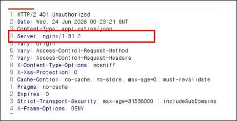
</figure>

- **Case 2 (로드밸런서 버전 노출):** 비정상적인 HTTP TRACE 요청 거부 시 튀어나오는 인프라 에러 패킷의 Server 헤더에 `awselb/2.0` 이라는 로드밸런서 고유 식별 정보 버전이 평문 유출됩니다.

<figure class="article-figure-center">
  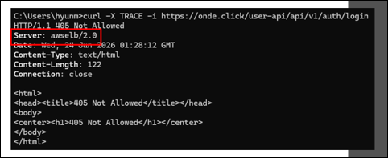
</figure>

- ** 해결방안:** Nginx 구성 스펙 파일(`nginx.conf`) 내에 `server_tokens off;` 지시어를 즉각 선언하여 버전 노출을 숨겨야 합니다. 한 단계 나아가 `headers-more-nginx-module` 에셋 확장 연동을 통해 Server 헤더 식별 지표 자체를 임의의 더미 가상 텍스트(`Server: WebServer`)로 전면 마스킹 오염 변경하여 재작성(Rewrite)할 것을 권고합니다.

### ── 7-4. 취약한 보안설정 (일반 - 취약)

- **문제점:** 애플리케이션 전역 교차 출처 리소스 공유(CORS) 정책 관리 소스코드 내에 모든 도메인 출처의 접근을 조건 없이 수용하는 위험한 와일드카드 매핑 구문이 제거되지 않은 채 배포되어 있습니다. 비록 상위의 스프링 시큐리티 필터가 1차적으로 invalid CORS request 차단을 수행하여 우회 공격을 막아서고 있으나, 백엔드 코어 설정 파일인 `WebConfig.java` 내에 전역 오설정 와일드카드가 잔재하므로 차후 형상 인프라 변경 시 위협의 불씨가 됩니다.

- ** 해결방안:** `WebConfig.java` 내의 모든 오리진 허용 와일드카드 구문 패턴을 즉시 영구 삭제하십시오. 연동이 승인된 Onde 공식 도메인 대역(`https://*.onde.click`)만을 화이트리스트 규격으로 명시하여 아키텍처 간 정합성을 일치시켜야 합니다.

### ── 8-1. 취약점 진단 항목에 정의되지 않은 취약점 (일반 - 취약)

- **Case 1 (Redis 무인증 커네션 결함):** 내부 가상 네트워크망 내부에서 분산 캐시 세션을 처리하는 Redis 인메모리 저장소 연동 설정 상 패스워드 비밀번호 검증 장치(`requirepass`)가 누락된 채 무인증(No Auth) 디폴트 상태로 구동 중입니다. 방화벽으로 외부 접속은 격리되어 있으나 웹셸 업로드 등으로 내부망 서브넷 권한을 취득한 공격자가 발생할 경우, Redis 기본 포트(6379)에 다이렉트 인입하여 세션 리프레시 토큰 및 이메일 인증 코드를 평문 탈취/변조할 수 있는 잠재적 취약 요소입니다.

- **Case 2 (Spring Boot Actuator 활성화 정보 노출):** 애플리케이션 빌드 구성 환경상, 상태 모니터링 엔드포인트인 Spring Boot Actuator 주요 기능들이 비활성화 처리되지 않고 노출 셋업되어 있습니다. Nginx 라우팅 필터에 의해 루트 HTML로 우회 차단 제어되고 있으나, 빌드 사양 상 `/actuator/env`, `/actuator/flyway` 기능이 활성화 상태이므로 프록시 규칙 변경 시 DB 스키마 마이그레이션 구조 및 내부 환경 변수가 단숨에 노출될 위험 요소를 내포하고 있습니다.

- ** 해결방안:** `redis.conf` 내에 `requirepass` 검증 지시어를 의무 적용하고 백엔드 환경 변수에 연동 비밀번호 설정을 하드닝하십시오. 또한 `application.yml` 구성 파일 내에 `management.endpoints.web.exposure.exclude=*` 속성을 추가하여 불필요한 Actuator 관리자 모니터링 디렉터리를 애플리케이션 레벨에서 명시적으로 삭제 차단 조치해야 합니다.

# 5. 일반 사용자, 판매자 취약점 진단 끝!!!

이번 3-2부터 8-1 항목까지의 수동 전수조사를 거치며, 비즈니스 로직에 엮인 대량의 인자들이 검증 부재 시 얼마나 연쇄 결함(금액 조작, 무제한 로그인, 권한 우회 상승, 소스코드 서명키 하드코딩 유출)으로 이어지는지 실전 패킷 데이터로 확인 할 수 있었습니다.

일반 사용자, 판매자 API에 대한 점검이 종료되어 이제 관리자 API에 대한 점검을 진행합니다!!

- **Next Step -> 관리자 API 취약점 진단!!**
