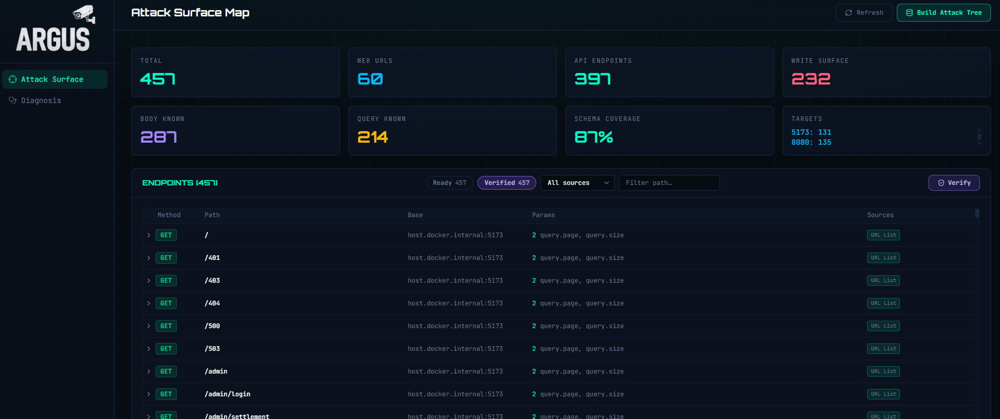
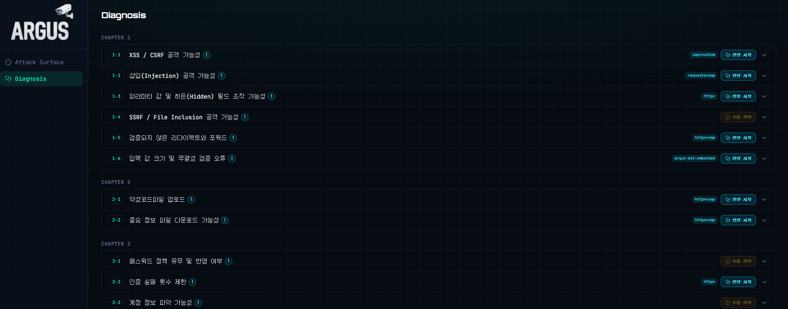
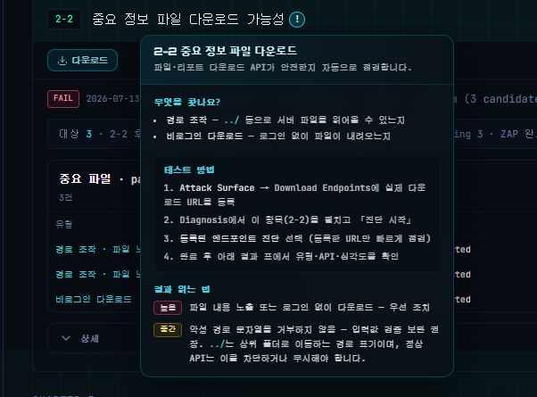
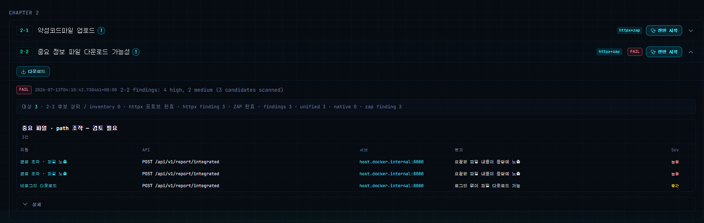

---

# 서론

> **"오늘은 아르고스(Argus) 대시보드 UI를 처음으로 글로 남깁니다. Day 37에서 Playwright 증적 캡처를 붙인 뒤, Attack Surface에서 ONDE 전용 하드코딩을 빼고 Diagnosis에서 섹션별 Findings·`!` 안내·결과 증적까지 한 화면에서 보이게 다듬었습니다."**
>
> 엔진 글만 쌓이면 “그래서 화면은?”이 비어 있어서, UI 네 장(Attack Surface / Diagnosis / 섹션 `!` / 결과·증적)을 앞에 두고, 그 아래 캡처·인벤토리 변경을 파일 기준으로 적습니다.

# 1. 오늘 한 일 요약

“진단만 돌리고 YAML만 남기는” 흐름에서, 대시보드로 **타깃 → 진단 → 안내 → 결과·증적**을 이어서 보게 맞춘 날입니다.

| 영역 | 한 일 |
|------|--------|
| **Attack Surface** | ONDE 기본값 제거, Base URL `kind`(api / frontend / api-and-frontend), 소스×URL 교차 결합 제거 |
| **Diagnosis** | 섹션별 Start·진행률·전용 Findings / 공통 Report, 보고서 Download 버튼만 먼저 배치 |
| **섹션 `!`** | 기존 9개 전용 팝오버 + `sectionInfoContent`로 나머지 섹션 설명 추가 |
| **증적** | 1-1 캡처 모듈 추가·정리, 1-2 엔진 보강, 2-1 캡처·재업로드 금지, 2-2 상세 샷 UI, 6-1 webcapture |
| **그 외** | 같은 섹션을 다시 돌릴 때 옛 PNG/replay 정리, 4-4 SPA fallback 오탐 수정, 1-6 유형별 대표 finding |

```text
Attack Surface에서 Base URL·인벤토리 입력
  → api-tree 구성
  → Diagnosis에서 섹션 Start
  → 리포트 YAML/JSON 저장
  → (지원 섹션) evidence 캡처 → data/report/{section}/evidence/
  → Findings / Report 패널에서 이미지 로드
  → 섹션 `!`로 진단 의미·수동 단계 안내
```

# 2. Attack Surface — ONDE에 안 묶이게 타깃 잡기

진단에 넣을 Base URL(역할 포함)·API/URL 리스트·OpenAPI를 모아 공격 표면 트리를 만드는 화면입니다. `config.yaml` / `config.docker.yaml` / `app/config.py`에서 ONDE 전용 앱 이름·문서 경로·기본 URL을 빼고, 빈 인벤토리에서 시작하도록 맞췄습니다. (`PLATFORM_INDEPENDENT_INVENTORY_CHANGES.md`)

## ① Base URL `kind`

| kind | 의미 |
|------|------|
| `api` | API origin |
| `frontend` | 프론트 origin |
| `api-and-frontend` | 둘 다 |

예전 JSON에 kind가 없으면 `api`로 읽습니다. 포트로 역할을 추정하지 않습니다. (예전 `5173=frontend`, `8080=api` 제거) 프론트가 8080이고 API가 3000이어도, 사용자가 고른 역할만 따릅니다. UI는 `BaseUrlsPanel.tsx`에서 역할과 함께 입력·표시합니다.

## ② 소스별 Base URL 결합

이전에는 API List / URL List가 API·Frontend URL과 교차로 붙었습니다. 이후 규칙은 아래와 같습니다.

```text
API List  → API 역할 Base URL만
OpenAPI   → servers[].url 또는 API 역할 Base URL
URL List  → Frontend 역할 Base URL만
```

Frontend Base가 없는데 상대 경로 URL List만 있으면 `localhost:5173`을 임의로 만들지 않고 미해결로 둡니다. OpenAPI도 server/API base가 없으면 임의 localhost를 만들지 않습니다. 관련 테스트는 `test_base_urls_service`, `test_inventory_source_roles`, `test_txt_list`에 보강했습니다.

## ③ 인벤토리를 다시 빌드할 때

새 endpoint 인벤토리 빌드가 성공하면 `api-tree-verified.json` / `verify-report.json` / `discover-progress.json` / `data/report/` 아래 이전 진단·evidence를 지웁니다. Base URL·테스트 계정·로그인 엔드포인트는 유지합니다. 저장소에 있던 기본 `login-endpoints.json` / `download-endpoints.json`도 빈 목록으로 바꿔, clone만 해도 특정 앱 값이 따라오지 않게 했습니다.

진단/스크린샷 모듈(`diagnosis/modules/**`, `screenshot/modules/**`)은 이 작업에서 건드리지 않았습니다. 앞단 인벤토리만 손본 것입니다.

<figure class="article-figure-center article-figure-center--full">
  
</figure>

# 3. Diagnosis — 섹션별 실행과 전용 Findings

가이드라인 섹션별로 Start를 누르고 진행률·옵션·리포트를 보는 화면입니다. 섹션을 펼치면 전용 Findings나 공통 Report가 붙고, 증거가 있는 항목은 캡처 PNG까지 이어집니다.

| 섹션 | 프론트 | 바뀐 점 |
|------|--------|---------|
| **1-1** | `G11FindingsPanel` / `G11FindingCard` | 캡처 summary와 finding id로 이미지 매칭, CSRF defenses·Evidence Req/Res |
| **1-2** | DiagnosisReportPanel + `G12SectionInfoPopover` | baseline→attack 다장 증거 표시 |
| **1-6** | `G16FindingsPanel` + `g16ReportView` | 증거 이미지 표시, 유형별 대표 finding |
| **2-1** | `GroupedG21FindingsPanel` + `FpCandidateSection` | 역할별 그룹, baseline 거부 오탐 후보(주황) |
| **2-2** | `G22FindingsPanel` + `G22ShotStack` | 상세 펼침 시 finding별 샷 세로 나열 |
| **6-1** | `G61FindingsPanel` | webcapture 증거 연결 |
| **공통** | `DiagnosisDownloadButton` | 리포트가 있으면 보고서 Download 버튼 표시(지금은 비활성) |

Download는 진단 결과를 **보고서 파일로 받는** 버튼입니다. 섹션이 열려 있고 리포트가 있을 때(`open && report`) 상단 왼쪽에 두고, `title="결과 다운로드 (준비 중)"`으로 Start와 비슷한 색만 맞춰 두었습니다. 실제 다운로드 API·보고서 양식은 아직 없습니다.

<figure class="article-figure-center article-figure-center--full">
  
</figure>

# 4. 섹션 `!` 도움말 — 전용 9개 + 공통 설명

진단 Start만 있고 “이 항목이 뭘 보는지 / 수동으로 뭘 더 봐야 하는지”가 안 보이면, 버튼만 있는 화면이 됩니다. 그래서 섹션 타이틀 옆에 `!`를 붙였습니다. (`SectionInfoPopoverShell` + `sectionInfoContent` + `sectionInfoPopoverLayout`)  
3-2 / 4-4 / 5-2 전용 팝오버는 먼저 들어왔고, 이후 공통 레이아웃으로 맞췄습니다.

## ① 어디까지 붙였나

**전용 컴포넌트(유지):** 1-2, 1-6, 2-2, 3-2, 4-4, 4-5, 5-2, 6-1, 7-4  
**공통 설명 추가 예:** 1-1, 1-3~1-5, 2-1, 3-1, 3-3~3-6, 4-1~4-3, 5-1, 6-2, 7-1~7-3, 8-1

`DiagnosisPage.SectionTitleInfoIcon` 우선순위:

1. 전용 `G*SectionInfoPopover`가 있으면 그것  
2. 없으면 `hasRegistrySectionInfo`일 때 `RegistrySectionInfoPopover`  
3. 둘 다 없으면 아이콘 없음  

## ② 배치·내용

`computeSectionInfoPopoverPos`는 기본적으로 아이콘 아래에 두고, 아래 공간이 부족하면 위로 뒤집되 CSS `bottom` 기준으로 아이콘에 붙게 해서 `top = iconY - maxHeight`처럼 멀리 떨어지는 현상을 막습니다. 긴 수동 진단 안내는 `maxHeight` + 내부 스크롤로 화면 안에 유지합니다.

내용은 섹션마다 제목 / 한 줄 설명 / 확인 포인트(finds) / (수동이면) `modeBadge: "수동 진단"` + 단계 목록 / 결과 해석(results)입니다. 기존 개별 팝오버도 같은 레이아웃을 쓰도록 맞춰, 스크롤 하단에서 카드가 아이콘과 멀어지거나 잘리던 문제를 줄였습니다.

<figure class="article-figure-center article-figure-center--full">
  
</figure>

# 5. 결과 패널과 증적 — 섹션별 캡처

진단이 끝나면 YAML만 쌓이던 단계에서, 결과 카드와 증거 이미지를 같이 보게 만드는 쪽입니다. Day 37의 자동 훅(1-2 / 2-2 / 7-4) 위에, 오늘은 1-1·2-1·6-1과 프론트 연결을 더 붙였습니다.

## ① 1-1 XSS / CSRF — 캡처 모듈 추가

`backend/screenshot/modules/1-1/`을 새로 넣었습니다. 라우트 탐색(`route_discovery`), 요청 리플레이(`replay`), 화면/패널 합성(`engine` / `renderer`)과 함께, 로그인 계정(`credentials.py`)·민감정보 가리기(`redaction.py`)도 같은 폴더에 둡니다.

- `selector.is_capturable`: Stored XSS·CSRF 이면서 `validation_status == "True Positive"`만 자동 캡처. Reflected/DOM/CORS는 리포트에는 남아도 이 캡처에는 안 탑니다.
- Stored XSS: UI 로그인 → route discovery → 사이트 샷 + payload 영역 스크롤 → Req/Res 보드 → dialog면 `01_site_alert.png`
- CSRF: 피해자 세션으로 forged request → 사이트 샷 없이 evidence 패널(`01_evidence.png`) 위주
- 실행: `diagnosis_service._run_g11_screenshot_capture`가 subprocess로 `capture.py`를 띄움. 진행률 phase=`screenshot` 동안 `running=True` 유지(스캔 끝나자마자 “완료”로 보이던 문제 방지)
- 결과 위치: `data/report/1-1/evidence/` — finding 폴더 + `capture-summary.json` / `capture.log`
- 운영에서 막힌 것: PIPE Broken pipe → 파일 로그, Linux `xvfb-run`, Docker `host.docker.internal`↔localhost. scanner/zap과 캡처 코드를 나눴습니다.

캡처가 실패해도 진단 status를 fail로 바꾸지 않습니다. info finding + `screenshot_capture` evidence로 시도 결과만 남깁니다. (Day 37과 같음)

## ② 1-2 Injection — related page / anchor 스크롤

`engine.py`에서 API path와 관련된 프론트 페이지를 찾습니다. Exact(실제 해당 API 요청) → Fuzzy(resource segment 점수, POST API도 GET 목록에 매칭 가능) → baseline 응답의 `ARGUS_*` / title·name·email 앵커로 스크롤. 캡처는 baseline site → … → `05_attack_evidence`로 전/후를 남깁니다. 경로는 `data/report/1-2/evidence/{finding_id}/`입니다.

## ③ 2-1 악성 업로드 — 재업로드는 막고, 샷만 갱신

문제 두 가지가 겹쳤습니다.

- 캐시가 있으면 캡처 전체를 스킵 → 같은 섹션을 다시 돌려도 옛 스크린샷만 남음  
- 매번 완전 재캡처 → 실서버에 악성 파일이 다시 쌓임  

나눈 처리:

```text
1. manifest 캐시가 있으면 Multipart HTTP Replay(실서버 재업로드)는 스킵
2. 저장된 request/response로 EvidenceCase를 복원
3. capture_case(화면 PNG)만 매 회차 다시 실행
```

| | 이전 | 이후 |
|--|------|------|
| manifest 캐시 | artifact만 반환, PNG 재생성 안 함 | manifest Req/Res로 `EvidenceCase` 복원 |
| 실서버 악성 업로드 | 스킵 | 스킵 유지 |
| 화면 PNG | 낡아도 그대로 | `capture_case`로 매 진단마다 새로 |
| `--force-replay` | 완전 재업로드+재캡처 | 동일 |

`_cleanup_stale_dirs`는 리포트에 없는 `2-1-*` 폴더를 지우되, 최근 60초 이내 수정 폴더는 건드리지 않습니다. 테스트는 `test_g21_capture_idempotency.py`에 “재업로드 1회 / 캡처 2회” 기대를 넣었습니다.

지금 로드 경로와 안 맞던 옛 프로토타입(`upload_judge` / `g21_zap_engine` 등, 대략 2천 줄)도 지웠고, `DiagnosisG21RunOptions`가 한 파일에 두 번 정의돼 httpx/zap/max_targets가 API에서 조용히 빠지던 문제·프론트 JSX 깨짐도 같이 고쳤습니다.

## ④ 2-2 — UI 연결 (캡처 엔진을 새로 쓴 건 아님)

백엔드 `screenshot/modules/2-2`가 이미 만든 증거를 상세 UI에 붙인 작업입니다. (`g22ReportView.ts`, `G22FindingsPanel.tsx`)

1. `capture-summary.json` 로드  
2. `indexG22CaptureShots`로 `finding_id` / `2-2-{hex10}` 키 Map  
3. `resolveG22ShotsForRow` — 행 findingId + 멤버 id + `g22StableFindingId`(백엔드 `stable_finding_id`와 같은 SHA-256)  
4. `G22ShotStack`으로 `main_site` / `baseline_evidence` / `attack_evidence` / `file_compare` 등 한글 라벨과 함께 세로 나열  

샷이 없는 finding은 기존 텍스트 상세만 보여 줍니다.

## ⑤ 1-6 / 6-1

- **1-6:** `FindingEvidence`의 `screenshot_rel_path` / `reproduction_flow[].rel_path`를 evidence API 이미지로 표시. 리포트는 `max_report_findings=50` 순서 자르기를 없애고, 취약 유형별 대표 1건 + `type_occurrences`로 바꿨습니다. (`g16_classification.convert_findings`)
- **6-1:** 커밋 제목의 “계정 3개”와 달리, 코드는 `DEFAULT_MAX_PER_GROUP = 3`(그룹당 sample URL 최대 3) × STEP1 before / STEP2 input / STEP3 result = 3장 세트 + 리포트에서 파싱한 인증 세션 1개가 중심입니다. HTML로 그린 가짜 Burp 보드가 아니라, `mss` / `PrintWindow`로 실제 Chrome 창을 OS에서 찍습니다. 결과: `…/6-1/evidence/webcapture/`

## ⑥ 증거 경로 한눈에

| 섹션 | Evidence 루트 | 프론트 로드 |
|------|---------------|-------------|
| 1-1 | `data/report/1-1/evidence/` | `/api/diagnosis/modules/1-1/evidence/...` |
| 1-2 | `data/report/1-2/evidence/` | evidence API + auto capture |
| 2-1 | `data/report/2-1/evidence/` | capture-summary + finding 폴더 |
| 2-2 | `data/report/2-2/evidence/` | `?path=capture-summary.json` + shot path |
| 4-4 / 5-2 | `data/report/{id}/evidence/` | scanner 안 캡처 + manifest |
| 6-1 | `…/6-1/evidence/webcapture/` | G61 / report panel |
| 1-6 | finding의 rel_path | `FindingEvidence` 이미지 |

<figure class="article-figure-center article-figure-center--full">
  
</figure>

# 6. UI 옆에서 같이 고친 것

## ① 같은 섹션을 다시 돌릴 때 옛 증적이 남는 문제

- **4-4 / 5-2:** `_clear_stale_evidence`로 최상위 `*.png` + `evidence_manifest.json`만 비움(하위 replay 해시 폴더는 보존). findings 0건이어도 캡처를 호출해, 취약점이 사라진 뒤에도 지난 회차 샷이 남지 않게 했습니다. 같은 작업에서 3-2 / 4-4 / 5-2 섹션 `!`도 같이 들어왔습니다.
- **ReplaySession:** 스캔 시작 시 `{section_id}-*` 디렉터리만 `rmtree`해, finding_id에 uuid가 섞여 회차마다 새 폴더만 생기던 기록을 정리합니다.
- **2-1:** HTTP replay(악성 재업로드)만 스킵하고 화면 샷은 매번 다시.

## ② 4-4 SPA fallback 오탐 (`page_rules.classify_unauth_page`)

프론트 origin으로 API를 찔렀더니 SPA history fallback `index.html` 200이 와서 무인증 노출로 잡히던 케이스를 걸렀습니다. 익명 응답 sha256이 공개 루트 `index.html`과 같고 보호 데이터 신호도 없으면:

| kind | 결과 |
|------|------|
| `frontend` | severity `info`, reason `client_side_guard_only` |
| API 등 | finding을 만들지 않음 (`None`) |

실제 JSON API 응답은 `index.html`과 바이트가 같지 않으므로, 이 조건만으로 데이터 유출 finding이 같이 사라지지는 않습니다.

## ③ 기동·빌드가 깨지던 것

- `diagnosis_service.run_section` g21 옵션 인자 중복 → 모듈 import 시점 SyntaxError로 백엔드가 안 뜸
- compose의 존재하지 않는 onde `env_file` 참조 제거
- DiagnosisPage `7-4`/`4-4` JSX 삼항 머지 잔재, G21 import 누락, 2-1 중복 핸들러 → npm/Docker 빌드 실패

로컬에서 UI를 띄워 볼 수 있게 같이 맞춰 두었습니다.

## ④ 루트에 잘못 올라간 로그·임시 파일 정리

루트에 커밋돼 있던 로그·메모 파일을 지우고 `.gitignore`에 올렸습니다.

| 파일 | 내용 |
|------|------|
| `backend_logs.txt` (~637KB), `diag_log.txt` (~407KB), `log.txt` 등 | 로그 덤프 |
| `g21_log.txt`, `old_g21.txt`, `diag_bug.txt` | 2-1·진단 쪽 임시 메모/덤프 |
| `fix.py` | 4-5 scanner 일회용 패치 스크립트 |
| `.DS_Store` | OS 메타 |

앱이 이 파일들을 쓰지는 않았습니다. ignore에 같은 경로를 막아, 로컬에서 다시 생겨도 커밋에 안 잡히게 했습니다.

# 7. 아직 남은 것

- Download 버튼은 달아 두었고, 진단 결과 **보고서 파일로 받기**는 아직입니다.
- 모든 가이드라인 섹션이 같은 수준의 캡처를 갖는 것은 아닙니다. (자동 훅·전용 패널이 섹션마다 다름)
- 1-1 자동 캡처는 Stored XSS·CSRF True Positive 중심입니다.
- 인벤토리에서 ONDE 하드코딩을 뺀 범위 밖: runs 구조·진단 초기화 UI·로그인 자동 탐색

# 8. 다음 작업: 진단 결과 보고서 다운로드

지금은 Diagnosis에 Download 버튼만 비활성으로 올려 둔 상태입니다. 다음엔 진단 결과(리포트·증적)를 **보고서 형태로 내려받는** 기능을 붙입니다.

* **다음 작업:**
  1. **보고서 양식 확정:** 진단 결과를 어떤 보고서 템플릿·파일 형식으로 뽑을지 후보를 고르고 양식을 고정합니다.
  2. **다운로드 모듈 구현:** 확정한 양식에 맞춰 `latest.yaml`·Findings·evidence 이미지를 묶어 보고서 파일을 생성하는 백엔드 모듈을 만듭니다.
  3. **UI 연동:** `DiagnosisDownloadButton`에 실제 export API를 연결해, 섹션을 펼친 뒤 버튼을 누르면 보고서가 내려가게 합니다.
