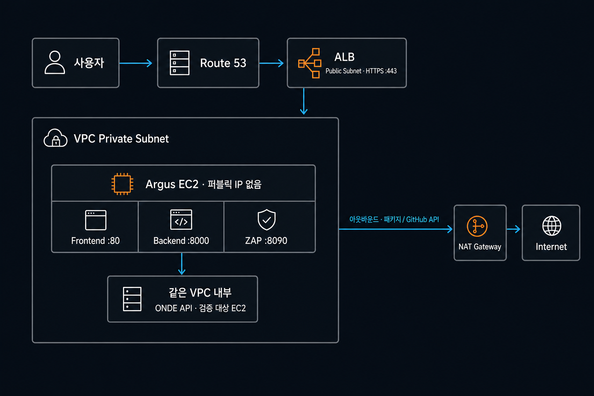

---

# 서론

> **"Day 39에서 섹션별 PDF 결과서·다운로드를 붙인 뒤, 오늘은 실서버 가동을 앞두고 아르고스(Argus)를 AWS 프라이빗 서브넷에 두는 배포 구조를 정리했습니다. 로컬 `docker-compose`와 `config.docker.yaml`에 남아 있던 localhost·사설 IP·`host.docker.internal` 값을 AWS VPC 기준으로 어떻게 바꿔야 하는지, EC2·ALB·보안 그룹은 어떻게 잡을지 코드와 함께 적어 둡니다."**
>
> 기능 통합은 거의 끝났고, 다음 주부터는 이 설계대로 EC2에 올리는 쪽으로 갑니다.

# 1. 오늘 한 일 요약

- **배포 토폴로지:** Argus EC2를 Private Subnet에 두고, 퍼블릭 ALB는 인바운드, NAT Gateway는 아웃바운드만 담당하도록 분리했습니다.
- **컨테이너 구조:** `argus-frontend` · `argus-backend` · `argus-zap`의 역할과 노출 포트를 다시 확인했습니다.
- **애플리케이션 설정:** `redirect_sink_base`, 진단 타깃, `ui_target`, CORS처럼 로컬 주소에 묶인 값을 AWS 기준으로 치환할 목록을 만들었습니다.
- **접근 통제:** EC2에는 퍼블릭 IP와 SSH 22번 포트를 열지 않고, SSM Session Manager로 접속하는 방향을 잡았습니다.
- **인프라 기준:** ZAP과 Playwright를 함께 돌릴 수 있도록 `t3.xlarge`, gp3 50GB를 시작점으로 정했습니다.
- **배포 방식:** 공유 볼륨과 순차 진단이 중심인 현재 구조에서는 EKS보다 단일 EC2 + Docker Compose가 단순하다고 판단했습니다.
- **실행 계획:** ECR, IAM, Secrets Manager, ALB Target Group, ACM, Route53까지 실제 배포 순서를 Runbook으로 정리했습니다.

# 2. 컨테이너 구조와 왜 Private Subnet인가

아르고스는 하나의 `docker-compose.yml` 아래 3개 컨테이너가 같이 돕니다.

| 컨테이너 | 이미지 | 포트 (내부 → 호스트) | 역할 |
|----------|--------|----------------------|------|
| **argus-frontend** | `nginx:alpine` | `80` → `5174` | React/Vite 대시보드 UI |
| **argus-backend** | `python:3.12-slim` (커스텀) | `8000` → `8001` | FastAPI 진단 오케스트레이터, PDF 빌더 |
| **argus-zap** | `zaproxy/zap-stable` | `8090` → `8090` | OWASP ZAP 프록시·능동 스캔 |

로컬에서는 편의를 위해 포트를 호스트에 노출해 두었지만, 실서버에서는 **진단 도구와 관제 화면을 인터넷에 직접 열지 않는 편이 낫습니다.** 악성 업로드·인젝션 페이로드를 실제로 쏘는 도구이기도 해서, Argus EC2 전체를 **Private Subnet**에 두고 ALB만 퍼블릭으로 받는 구조로 잡았습니다.



*Fig.1 — 퍼블릭 ALB만 외부 요청을 받고, Argus와 진단 대상은 같은 VPC의 Private Subnet에서 통신하는 구조*

**통신 원칙은 간단합니다.**

- **인바운드(사용자 → Argus):** EC2에 퍼블릭 IP를 주지 않고, Public Subnet의 ALB가 443에서 HTTPS를 끊은 뒤 프론트(80)·백엔드(8000)로 전달
- **진단 트래픽:** 같은 VPC 안 ONDE 서버 프라이빗 IP(8080, 8081 등)로 직접
- **아웃바운드:** ZAP 이미지 pull, GitHub Advisory API 등은 NAT Gateway 경유

# 3. AWS 배포 시 꼭 바꿔야 하는 코드·설정

로컬 기준으로 박혀 있는 값을 그대로 두면, 스캔·콜백·브라우저 API 호출이 한꺼번에 깨집니다. `config.docker.yaml`과 `main.py`에서 손볼 항목을 정리했습니다.

## ① `redirect_sink_base` (1-5 오픈 리다이렉트 콜백)

- **현재:** `http://host.docker.internal:8001/argus-redirect-sink`
- **AWS:** `https://<서비스 도메인>/argus-redirect-sink` 또는 VPC 내부에서만 접근 가능한 백엔드 주소

가이드라인 1-5 진단에서, 취약한 대상 서버가 리다이렉트를 따라 **Argus 백엔드로 콜백**을 보내는 주소입니다. `host.docker.internal`은 Docker Desktop 전용이라 EC2에서는 라우팅되지 않습니다. 외부 도메인을 쓴다면 ALB에서 `/argus-redirect-sink`를 백엔드 Target Group으로 보내야 하고, 내부 주소를 쓴다면 ONDE 서버가 해당 주소에 도달할 수 있는지 먼저 확인해야 합니다.

## ② `targets` · `inventory` 스캔 타깃

- **현재:** `http://192.168.0.61`, `:8080`, `:8081` 등 로컬 사설 대역
- **AWS:** `http://<ONDE EC2 프라이빗 IP>` 또는 VPC 내부 DNS 이름

동일 VPC Private Subnet에 있는 ONDE 실서버 주소로 바꿔야 ZAP·httpx 프록시 스캔이 타깃까지 도달합니다. IP를 설정 파일에 고정하면 인스턴스 교체 때 다시 수정해야 하므로, Route53 Private Hosted Zone이나 내부 서비스 디스커버리 이름을 쓰는 편이 운영에는 더 안전합니다.

## ③ `main.py` CORS `allow_origins`

현재는 `localhost:5173/5174`, `127.0.0.1`만 허용되어 있습니다.

```python
allow_origins=[
    "http://localhost:5173",
    "http://127.0.0.1:5173",
    "http://localhost:5174",
    ...
]
```

브라우저에서 ALB 도메인(예: `https://argus.example.com`)으로 대시보드를 열면, API 요청 origin이 달라져 **CORS에 막힙니다.** 실제 서비스 URL을 `allow_origins`에 추가해야 합니다.

## ④ `diagnosis_1_3` · `diagnosis_1_6`

- **`llm_interpret_enabled`:** 로컬 `true` → AWS `false`. LLM 해석·설명은 ONDE가 담당하므로 Argus에 중복 연산과 별도 API Secret을 둘 필요가 없습니다.
- **`ui_target` (1-6):** `http://host.docker.internal:5174` → 실제 브라우저가 접근하는 **ALB HTTPS URL**.

1-6은 Playwright로 UI를 두드리는 진단이라, `ui_target`이 실제 접속 가능한 주소와 같아야 합니다.

## ⑤ `docker-compose` 볼륨 (로컬 → EC2)

로컬 compose에는 개발 편의용 마운트가 많습니다.

- `..:/workspace:ro` — 상위 디렉터리 전체 read-only (1-1 라우트 탐색 fallback용)
- `./backend/app`, `diagnosis`, `screenshot`, `report` 등 소스 동기화

EC2 배포본에서는 **소스 live mount를 빼고**, 이미지에 코드를 bake하거나 `/home/ec2-user/argus`처럼 필요한 경로만 최소로 두는 쪽이 안전합니다. `backend/data`는 진단 산출물·PDF·업로드 Swagger가 쌓이므로 EBS 볼륨과 함께 유지합니다.

# 4. EC2·보안 그룹 설계

## EC2 스펙

| 항목 | 권장 | 이유 |
|------|------|------|
| **인스턴스** | `t3.xlarge` 이상 (4 vCPU, 16GB RAM) | ZAP(JVM) + FastAPI + 1-6 Playwright Chromium 다중 프로세스. 16GB 미만이면 스캔 중 OOM으로 컨테이너가 죽을 수 있음 |
| **EBS** | gp3 **50GB+** | `backend/data/`에 증적 PNG, PDF, Swagger 업로드가 계속 쌓임 |
| **퍼블릭 IP** | **없음** | ALB·NAT만 퍼블릭 |
| **접속** | **SSM Session Manager** | SSH 22 미개방 |

## Security Group (요지)

| 방향 | 프로토콜·포트 | 소스 / 목적지 | 목적 |
|------|---------------|---------------|------|
| Inbound | TCP 80 | ALB SG | 프론트 Nginx |
| Inbound | TCP 8000 | ALB SG | FastAPI |
| Inbound | TCP 22 | — | **열지 않음** (SSM 사용) |
| Outbound | TCP 80, 443 | `0.0.0.0/0` (NAT) | 이미지 pull, GitHub API |
| Outbound | TCP 8080, 8081 | ONDE VPC CIDR | 진단 트래픽 |
| Internal | TCP 8090 | `127.0.0.1` / compose 내부 | 백엔드 ↔ ZAP (대외 미노출) |

ZAP 포트 8090은 compose 네트워크 안에서 `ZAP_PROXY=http://zap:8090`으로만 쓰고, SG로 ALB에서 열 필요는 없습니다.

## ALB 라우팅과 헬스체크

한 ALB에서 프론트와 백엔드를 함께 서비스하려면 Listener Rule을 먼저 정해야 합니다.

- 기본 경로 `/`와 정적 파일은 **Frontend Target Group(:80)** 으로 전달합니다.
- `/api/*`, `/argus-redirect-sink`, 백엔드 다운로드 경로는 **Backend Target Group(:8000)** 으로 전달합니다.
- 프론트는 `/`, 백엔드는 별도 `/health` 같은 가벼운 엔드포인트를 헬스체크 대상으로 둡니다.
- ALB에서 HTTPS를 종료하고 EC2로 전달하더라도, 애플리케이션은 `X-Forwarded-Proto`를 기준으로 원래 요청이 HTTPS였음을 알 수 있어야 합니다.

프론트와 API를 같은 도메인 아래에 두면 브라우저 CORS 구성이 단순해집니다. 반대로 도메인을 분리한다면 허용 Origin을 와일드카드로 열기보다 실제 주소만 명시해야 합니다.

## Private Subnet이 동작하기 위한 전제

EC2만 Private Subnet에 넣는 것으로 끝나지는 않습니다.

- ALB는 서로 다른 가용 영역의 **Public Subnet 두 곳 이상**에 연결합니다.
- Private Subnet의 기본 경로 `0.0.0.0/0`은 NAT Gateway로 보내고, NAT Gateway는 Internet Gateway가 연결된 Public Subnet에 둡니다.
- ONDE 보안 그룹은 Argus 보안 그룹에서 오는 진단 포트만 허용합니다.
- 내부 도구라도 퍼블릭 ALB를 쓴다면 WAF IP Set, VPN, 사내 CIDR 제한 또는 별도 인증 계층 중 하나는 앞단에 두어야 합니다.

# 5. EKS 대신 EC2 + Docker Compose를 쓰는 이유

Kubernetes(EKS)도 검토했지만, 아르고스 특성상 **단일 EC2**가 비용·운영 모두 단순합니다.

1. **ZAP과 호스트 네트워크** — compose에서 `host.docker.internal:host-gateway`를 씁니다. EKS Pod에서는 `hostNetwork: true` 등 추가 설정이 필요하고, 격리 이점이 줄어듭니다.
2. **로컬 파일 공유** — 백엔드와 ZAP이 `./backend/data`를 같이 씁니다. EKS로 가면 EFS 등 공유 스토리지로 바꿔야 하고, I/O 지연·비용이 늘어납니다.
3. **수평 확장 필요 없음** — 한 번에 한 타깃을 순차 진단하는 내부 보안 도구입니다. Pod를 늘려도 ZAP 세션·프록시 쪽에서 병목이 생기고, EKS 고정 비용(컨트롤 플레인·노드)만 추가됩니다.

내부 진단 장비 한 대를 올리는 수준이면 Compose on EC2가 맞다고 정리했습니다.

# 6. 다음 주 AWS 배포 Runbook (10단계)

월요일부터 아래 순서로 진행할 예정입니다.

1. **ECR** — `argus/backend`, `argus/frontend` 리포지토리 생성 (ZAP은 Docker Hub 공식 이미지)
2. **IAM Role** — EC2에 SSM, ECR pull, Secrets Manager `argus/github-token` 읽기
3. **Secrets Manager** — 7-4 CVE 진단용 `GITHUB_TOKEN` 등록
4. **Security Group** — SSH 차단, ALB SG → 80·8000만 허용
5. **Private EC2** — `t3.xlarge`, gp3 50GB, 퍼블릭 IP 없이 기동
6. **SSM 접속** — Docker·Docker Compose 설치
7. **`config.docker.yaml`** — ONDE 프라이빗 IP, `redirect_sink_base`, `ui_target`, `llm_interpret_enabled: false` 반영
8. **`docker compose up -d`** — 3 컨테이너 기동·헬스체크
9. **ALB Target Group** — EC2 프라이빗 IP:80(프론트), :8000(백엔드) 등록
10. **ACM + Route53** — HTTPS 인증서 연결, 대시보드 접속·API CORS 최종 확인

실제 배포·HTTPS 검증까지는 다음 글에서 이어갑니다.

# 7. 배포 후 검증 기준

컨테이너가 `running`이라는 사실만으로 배포가 끝난 것은 아닙니다. 아래 항목이 모두 통과해야 실제 진단 흐름이 연결됐다고 볼 수 있습니다.

- [ ] Route53 도메인에서 ACM 인증서로 HTTPS 접속
- [ ] `/`는 프론트, `/api/*`와 결과서 다운로드는 백엔드로 라우팅
- [ ] Backend Target Group 헬스체크 정상
- [ ] 백엔드 컨테이너에서 `zap:8090` 연결
- [ ] Argus에서 ONDE 프라이빗 주소의 진단 포트 접근
- [ ] NAT Gateway를 통한 ECR·GitHub API 아웃바운드 접근
- [ ] Playwright가 실제 ALB URL을 열고 스크린샷 생성
- [ ] PDF·증적 파일이 EBS 볼륨에 남고 컨테이너 재시작 뒤에도 유지
- [ ] EC2 재부팅 후 Docker Compose 자동 재기동

# 8. 운영에서 놓치기 쉬운 부분

## Secrets와 권한

`GITHUB_TOKEN` 같은 값은 이미지·compose 파일·Git 이력에 넣지 않고 Secrets Manager에서 읽습니다. EC2 IAM Role도 전체 Secret 조회가 아니라 필요한 ARN 하나만 읽도록 제한합니다. ECR pull, SSM, CloudWatch Logs 역시 필요한 작업만 허용하는 정책으로 나누는 편이 좋습니다.

## 로그와 디스크

ZAP·Playwright·PDF 생성은 로그와 이미지 산출물을 빠르게 늘립니다. Docker 로그 회전 크기, `backend/data` 보존 기간, 오래된 증적 삭제 기준을 배포 전에 정해야 합니다. EBS 사용률과 메모리 부족은 기본 CloudWatch 지표만으로 부족할 수 있어 CloudWatch Agent나 별도 컨테이너 지표 수집도 검토합니다.

## 롤백과 비용

이미지는 `latest`만 쓰지 않고 배포 커밋 SHA나 버전 태그를 남겨야 이전 버전으로 즉시 되돌릴 수 있습니다. 또한 `t3.xlarge`와 NAT Gateway는 사용하지 않는 시간에도 비용이 발생하므로, 상시 서비스가 아닌 내부 데모 환경이라면 일정 기반 중지와 NAT 사용량 점검도 필요합니다.

# 9. 마무리

오늘은 PDF·다운로드 기능을 넘어, **Argus를 AWS Private Subnet에 올리기 위한 설계**를 코드 설정과 함께 문서로 남긴 날입니다. localhost·사설 IP·Docker Desktop 전용 호스트명을 AWS 주소체계로 바꾸는 것에서 시작해, ALB 경로 라우팅과 헬스체크, 접근 통제, 배포 후 검증, 로그·롤백 기준까지 확인했습니다.

아직 실제 배포 결과가 아니라 **배포 전 설계와 Runbook** 단계입니다. 다음 주에는 이 기준대로 EC2에 올리고, 예상과 달랐던 설정과 실제 리소스 사용량까지 확인해 후속 글로 남길 예정입니다.
