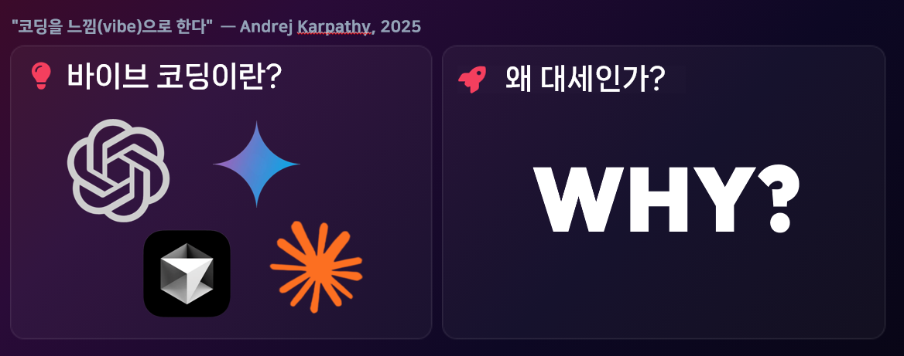
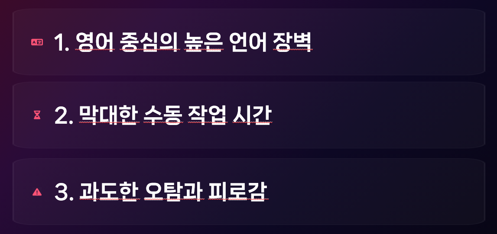
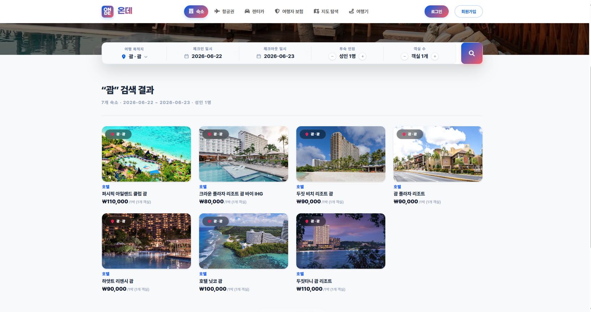
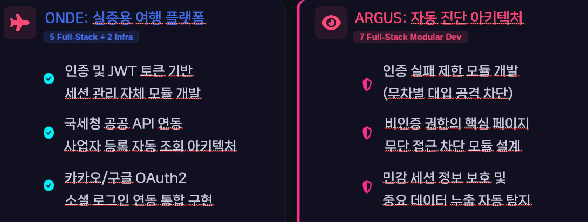
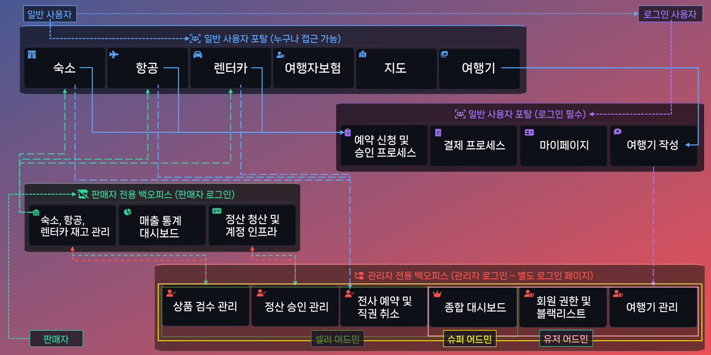
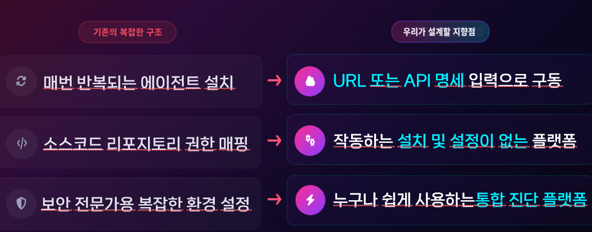
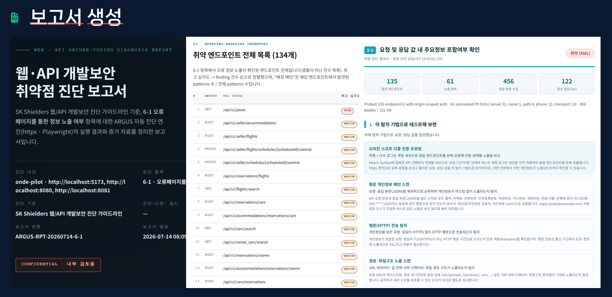
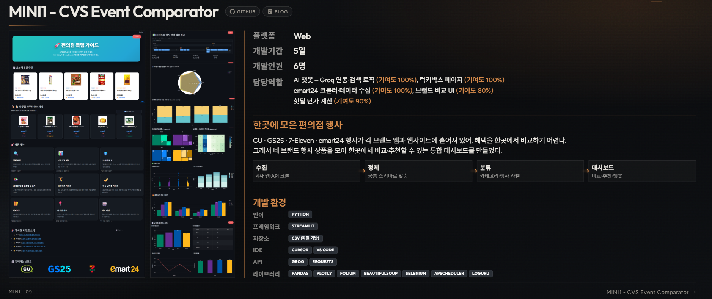
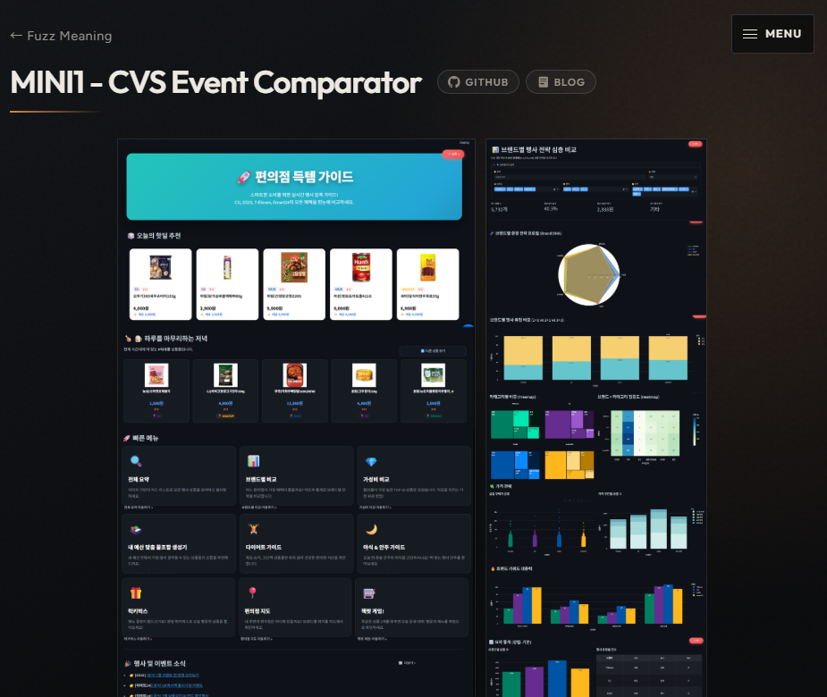

---

# 서론

> **"아르고스 인프라 구축은 다음 주 월요일부터 시작합니다. 오늘은 배포를 서두르기보다 최종 발표 PPT와 포트폴리오를 다시 보면서, 프로젝트를 처음 보는 사람도 문제·기여·결과를 한 흐름으로 이해할 수 있게 만드는 데 시간을 썼습니다."**
>
> 화면을 예쁘게 다듬는 작업처럼 보이지만, 실제로는 웹과 PDF의 차이, 반응형 레이아웃, 공통 내비게이션, 기술 스택 근거, README의 실행 방법까지 함께 맞추는 정리 작업이었습니다.

# 1. 오늘 작업의 방향

오늘의 중심은 새 기능보다 **정리와 전달**이었습니다.

- 최종 발표 PPT의 문장과 화면 배치를 다시 검토했습니다.
- 포트폴리오 MINI1 페이지에 실제 기여와 기술 흐름을 더 분명하게 적었습니다.
- 웹 포트폴리오를 19페이지 PDF로 내보내도 같은 구성이 유지되도록 출력 방식을 손봤습니다.
- 모바일·태블릿에서는 공통 내비게이션을 사이드 드로어로 바꾸고, 페이지별 깨짐을 정리했습니다.
- MATE README를 코드 기준으로 다시 작성하고 다크·라이트 기술 뱃지를 확장했습니다.
- 저장소에 직접 들어 있던 로컬 DB·JWT·Cloudinary 설정을 `.env`로 분리했습니다.
- GitHub Pages의 공용 Tech Stack에도 새 뱃지와 분류를 반영했습니다.

인프라 작업을 월요일로 미룬 대신, 발표·포트폴리오·문서가 서로 다른 설명을 하지 않도록 맞추는 날로 잡았습니다.

# 2. 최종 PPT — 이전 멘토링 피드백을 장표에 반영

오늘의 PPT 작업은 새로운 내용을 더 넣는 것보다, 이전 멘토링에서 받은 피드백을 실제 장표 구조에 반영하는 과정이었습니다. 공통된 지시는 **긴 설명을 줄이고, 핵심 내용과 실제 화면을 먼저 보여 달라**는 것이었습니다.

## ① 앞의 두 장은 텍스트를 과감하게 덜어내기

기존 장표는 바이브 코딩의 개념과 문제점을 긴 문장으로 설명하는 텍스트가 화면의 대부분을 차지했습니다. 이번에는 그 설명을 과감하게 걷어내고, 핵심 키워드와 이미지가 먼저 보이도록 다시 배치했습니다.

첫 장은 바이브 코딩을 대표하는 AI 도구와 “왜 대세인가?”라는 질문만 크게 남겼습니다. 자연어 명령이 소스코드로 바뀌는 흐름은 이미지로 보여 주고, 자세한 개념은 발표자가 말로 설명하는 방향입니다.

<figure class="article-figure-center article-figure-center--full">
  
</figure>

두 번째 장도 문제를 설명하던 문단을 없애고 세 가지 핵심 문구만 남겼습니다.

- **영어 중심의 높은 언어 장벽:** 기존 진단 도구의 결과와 보안 용어를 바로 이해하기 어려움
- **막대한 수동 작업 시간:** 설치·설정·대상 등록·결과 정리에 반복 작업이 많음
- **과도한 오탐과 피로감:** 많은 경고 중 실제 조치가 필요한 항목을 다시 골라야 함

<figure class="article-figure-center article-figure-center--full">
  
</figure>

## ② ONDE 소개는 실제 서비스 화면부터

ONDE 소개 장표는 기능 명세를 먼저 나열하지 않고, 실제로 동작하는 플랫폼 대시보드와 주요 서비스 화면을 앞에 배치하는 방향으로 바꿉니다. 진단 대상이 단순 샘플 애플리케이션이 아니라 항공·숙박·렌터카·예약·인증 흐름을 가진 완성형 서비스라는 점을 먼저 보여 준 뒤, 세부 기능은 발표자가 짧게 설명하도록 압축합니다.

<figure class="article-figure-center article-figure-center--full">
  
</figure>

## ③ 팀 구성은 한 페이지에 한 명씩

이전 팀 구성 장표는 7명의 이름과 역할을 작은 글씨로 한 화면에 간단히 보여 주는 수준이었습니다. 이번에는 **팀원 한 명에게 한 페이지를 할당**하고, 담당 기능과 실제 구현 내용을 더 구체적으로 보여 주는 방식으로 바꿨습니다.

각 페이지에서는 단순한 역할명 대신 ONDE와 Argus에서 맡은 기능을 나누고, 어떤 모듈을 설계·구현했는지까지 읽을 수 있게 구성했습니다. `fig4`는 이전 PPT에서 간단히 지나갔던 개인 담당 범위에 조금 더 힘을 준 수정 화면입니다.

<figure class="article-figure-center article-figure-center--full">
  
</figure>

## ④ ONDE 전체 기능 구조도는 큰 흐름만

ONDE의 모든 페이지와 세부 기능을 한 장에 설명하면 글씨가 작아지고 발표 시간도 길어집니다. 페이지 이름과 핵심 동작만 남기고, **사용자 진입 → 검색·예약 → 결제·마이페이지 → 관리자·판매자 기능**처럼 서비스의 큰 이동 경로만 짧게 브리핑하도록 줄입니다.

<figure class="article-figure-center article-figure-center--full">
  
</figure>

## ⑤ Argus 설명도 텍스트 대신 화면으로

Argus가 지향하는 방향도 기능 목록보다 **기존 과정이 어떻게 바뀌는가**로 비교했습니다.

- 에이전트를 매번 설치하는 구조 → **URL 또는 API 명세 입력으로 시작**
- 소스 저장소 권한 매핑과 복잡한 환경 설정 → **설치·설정 부담을 줄인 진단 흐름**
- 보안 전문가 중심의 복잡한 도구 → **개발자가 직접 확인할 수 있는 통합 진단 플랫폼**

<figure class="article-figure-center article-figure-center--full">
  
</figure>

Argus의 동작 단계를 설명할 때도 문장만 나열하지 않습니다. `fig5`는 Argus 설명 중 **3단계인 보고서 생성 화면**을 크게 보여 주는 장표입니다. 엔드포인트 인벤토리, 탐지 결과, 재현 정보와 대응방안이 실제 보고서에 어떻게 담기는지를 이미지로 먼저 보여 주고, 발표자가 화면을 짚어 가며 설명하는 방향으로 바꿨습니다.

<figure class="article-figure-center article-figure-center--full">
  
</figure>

# 3. 포트폴리오 — MINI1 페이지를 프로젝트 브리프로 재구성

MINI1 포트폴리오 화면은 하루 동안 가장 많이 손본 부분입니다. 처음에는 스크린샷과 소개 문장이 서로 공간을 다투었고, 브라우저 폭이 줄어들면 이미지·설명·기술 스택이 제각각 축소됐습니다.

## 프로젝트 첫 화면

첫 화면은 왼쪽에 서비스 화면 두 장, 오른쪽에 프로젝트 설명을 두는 구조로 다시 잡았습니다. 단순한 서비스 소개 대신 아래 정보가 한 화면에서 읽히도록 했습니다.

- 프로젝트 기간과 팀 구성
- 문제와 해결 방향
- 브랜드별 크롤러와 데이터 파이프라인
- 담당 역할과 실제 기여
- 개발 환경·라이브러리·저장 방식
- GitHub와 상세 블로그 링크

기술 스택도 Python·Streamlit 같은 큰 분류만 보여 주지 않고, Requests·BeautifulSoup·Selenium·Pandas·Plotly·Folium·APScheduler·Loguru처럼 실제 파이프라인에서 사용한 도구를 역할별로 나눴습니다. CSV 기반 저장은 Excel 아이콘만 보여 주는 대신 **파일 기반 데이터 흐름**이라는 의미가 드러나도록 설명을 붙였습니다.

## 개인 기여를 별도로 보이기

팀 프로젝트 전체 기능과 내가 맡은 부분이 섞이지 않도록 크롤러, 데이터 정제, 대시보드, 지도, 챗봇, 배치 흐름을 다시 확인했습니다. “프로젝트에 포함된 기능”과 “내가 설계·구현한 범위”를 구분해야 면접이나 발표에서 과장 없이 설명할 수 있기 때문입니다.

<figure class="article-figure-center article-figure-center--full">
  
</figure>

<figure class="article-figure-center article-figure-center--full">
  
</figure>

# 4. 웹과 PDF를 같은 결과물로 만들기

포트폴리오를 브라우저에서 볼 때와 PDF로 내보낼 때의 결과가 달랐습니다. 내비게이션 위치가 밀리거나, Works 하위 메뉴가 오른쪽으로 이동하고, 화면에 적용된 `transform`이 PDF 캡처에서는 다르게 계산되는 문제가 있었습니다.

처음에는 PDF 생성 시 DOM의 transform을 일괄 제거하는 방식으로 맞췄지만, 페이지가 늘어날수록 예외가 생겼습니다. 최종적으로는 페이지가 스스로 출력 준비 상태를 만들고, 내보내기 스크립트가 그 신호를 기다리도록 구조를 바꿨습니다.

```text
페이지 로드
→ 폰트 로딩 대기
→ 출력 모드 활성화
→ 2번의 animation frame 대기
→ exportReady 신호
→ Playwright 캡처
→ 19페이지 PDF 병합
```

Playwright Chromium이 없는 환경에서는 Microsoft Edge로 실행할 수 있는 fallback도 두었습니다. “내 컴퓨터에서는 된다”가 아니라, 포트폴리오 PDF를 다시 만들 때 같은 절차를 반복할 수 있게 스크립트로 남긴 것입니다.

# 5. 반응형 수정과 땜빵 코드 정리

모바일·태블릿에서는 데스크톱 상단 메뉴를 그대로 줄이는 대신, 공통 `SiteNav`가 사이드 드로어로 동작하도록 바꿨습니다. Cover·Profile·Works·Research·Papers·Rookies·Mini·Final·Connect가 같은 방식으로 열리고 닫히도록 공유 컴포넌트에서 처리했습니다.

페이지별로는 다음 부분을 확인했습니다.

- **Profile:** 패널을 JavaScript로 강제 축소하던 코드를 제거하고, 세로·가로 스크롤이 필요한 영역을 CSS로 분리
- **Journey:** 태블릿에서 타임라인 전체를 억지로 압축하지 않고 가로 스크롤로 탐색
- **Connect:** 중간 폭에서 애매하게 여러 열로 남지 않고 한 줄 세로 흐름으로 전환
- **MINI1:** 데스크톱 구간에서는 전체 슬라이드를 비례 축소하고, 태블릿 breakpoint부터 전용 레이아웃 사용
- **Works 메뉴:** 문서 흐름을 덮지 않도록 위치와 여백을 재조정

MINI1의 비례 축소 코드는 HTML 안의 임시 스크립트에서 `slide-fit.js`로 분리했습니다. 기준 너비·높이와 적용 구간을 `data-*` 속성으로 전달해, 페이지마다 계산 코드를 복사하지 않도록 했습니다.

# 6. MATE README — 코드와 문서의 차이를 다시 확인

MATE README는 CVS 프로젝트의 Overview처럼 **문제 → 서비스 흐름 → 기술 구조**가 보이도록 다시 작성했습니다. 모집글 작성, 지원, 수락·거절, 멤버 확정, 팀 전용 게시판으로 이어지는 사용자 흐름을 중심에 두고 프로필·댓글·관리자 기능을 연결했습니다.

Built With는 `package.json`, `pom.xml`, 실제 import와 설정 파일을 다시 확인한 뒤 작성했습니다. React·Vite·MUI·Zustand뿐 아니라 React Router, Axios, MSW, Spring Security, Hibernate, Thymeleaf, Cloudinary, Maven까지 다크·라이트 뱃지로 정리했습니다.

확인 과정에서 **의존성에만 있고 실제 런타임에서 꺼진 기술**도 있었습니다.

- Flyway는 의존성은 있지만 개발 환경에서 비활성이고 migration 파일이 없습니다.
- MSW mock 코드는 있지만 현재 앱 진입점에서는 비활성 상태입니다.
- Actuator와 Spring Boot Admin Client는 의존성만 있고 관리 엔드포인트 연결 설정은 없습니다.

README에는 이런 상태를 “사용 중”이라고 뭉뚱그리지 않고 현재 적용 수준까지 적었습니다.

# 7. 설정 파일에서 Secret 분리

README를 확인하다가 `application-dev.properties`에 로컬 DB 비밀번호, JWT Secret, Cloudinary API Secret이 직접 들어 있는 것도 발견했습니다. 현재 코드에서는 값을 제거하고 환경변수 참조로 바꿨습니다.

```properties
jwt.secret=${JWT_SECRET}
cloudinary.cloud-name=${CLOUDINARY_CLOUD_NAME}
cloudinary.api-key=${CLOUDINARY_API_KEY}
cloudinary.api-secret=${CLOUDINARY_API_SECRET}
```

로컬 값은 Git에서 제외되는 `.env`에 두고, 저장소에는 키 이름과 예시만 있는 `.env.example`을 남겼습니다. 단순히 파일에서 문자열을 지우는 것이 아니라 실행 방법도 README의 Getting Started에 맞춰 수정했습니다.

이 작업을 하면서 **코드를 공개 서비스로 운영하는지와 Secret을 공개 저장소에 둘 수 있는지는 별개의 문제**라는 점도 다시 확인했습니다. 사용하지 않는 서비스라도 외부 계정 자격 증명은 교체하거나 폐기할 수 있어야 합니다.

# 8. GitHub Pages 공용 자산 정리

MATE README에 필요한 뱃지를 프로젝트마다 새로 만들지 않고 GitHub Pages의 공용 뱃지 저장소를 기준으로 관리했습니다. 기존 뱃지는 복사해 사용하고, 없던 Cloudinary·Hibernate·MSW·Thymeleaf 뱃지는 다크·라이트 버전을 공용 저장소에 먼저 추가했습니다.

이후 GitHub Pages의 Tech Stack 필터에도 새 항목을 등록했습니다.

- **Backend:** Hibernate, Thymeleaf
- **DevOps:** Cloudinary
- **Tools & Testing:** Mock Service Worker

README 한 곳을 고치는 작업이 개인 사이트의 기술 스택 목록과 공용 이미지 자산 정리까지 이어진 셈입니다.

같은 흐름으로 Day 40의 AWS 배포 설계 글도 게시했습니다. ASCII 구조도는 `fig1.png` 아키텍처 이미지로 교체하고, ALB 라우팅·헬스체크·운영 안전장치·배포 후 검증 기준을 보강해 월요일 인프라 작업에서 다시 볼 수 있는 Runbook으로 정리했습니다.

# 9. 오늘 정리하면서 느낀 점

오늘은 기능 개발량보다 **결과물을 설명 가능한 상태로 만드는 일**이 더 컸습니다.

첫째, 웹 화면과 PDF는 같은 디자인을 공유해도 서로 다른 렌더링 환경입니다. 마지막에 캡처 옵션으로 억지로 맞추기보다, 페이지가 출력 상태를 명시하도록 설계해야 유지보수가 쉬웠습니다.

둘째, 반응형은 “작아지면 글씨를 줄인다”가 아니었습니다. 데스크톱에서는 비례 축소가 자연스럽지만, 태블릿부터는 내비게이션·타임라인·카드 흐름 자체가 바뀌어야 했습니다.

셋째, README의 기술 이름은 많을수록 좋은 것이 아니었습니다. 실제로 import했는지, 설정만 있는지, 현재 꺼져 있는지까지 확인해야 포트폴리오 문서가 과장되지 않습니다.

넷째, 발표 자료·포트폴리오·README는 별도 산출물이지만 결국 같은 프로젝트를 설명합니다. 세 곳의 역할·기술·성과가 다르면 질문을 받을 때 설명도 흔들립니다. 오늘은 그 차이를 줄이는 작업이었습니다.

# 10. 다음 작업

아르고스 인프라 구축은 다음 주 월요일부터 시작합니다. 오늘 만든 Day 40 Runbook을 기준으로 아래 순서부터 확인할 예정입니다.

1. ECR 이미지 저장소와 EC2 IAM Role 준비
2. Public/Private Subnet, ALB, NAT Gateway, Security Group 구성
3. Secrets Manager와 SSM Session Manager 연결
4. Docker Compose로 Frontend·Backend·ZAP 기동
5. ONDE 프라이빗 주소 진단과 GitHub API 아웃바운드 검증
6. HTTPS·CORS·헬스체크·PDF/증적 볼륨 확인

그 전까지는 최종 PPT 문장과 캡처 화면, 포트폴리오 PDF를 한 번 더 점검해 발표 자료와 실제 서비스 설명이 어긋나지 않게 마무리할 계획입니다.

# 11. 마무리

Day 41은 새 기능을 크게 붙인 날이라기보다, 지금까지 만든 것을 **보여 줄 수 있고 설명할 수 있는 결과물**로 바꾼 날입니다. 최종 PPT, 포트폴리오 웹·PDF, MATE README, GitHub Pages Tech Stack을 같은 기준으로 다시 확인했고, 그 과정에서 반응형 구조와 출력 코드, Secret 관리까지 함께 정리했습니다.

다음 주부터는 문서로 적어 둔 아르고스 AWS 구조를 실제 인프라로 옮기는 단계로 넘어갑니다.
