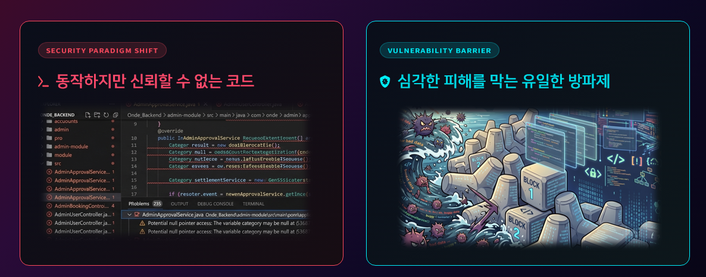
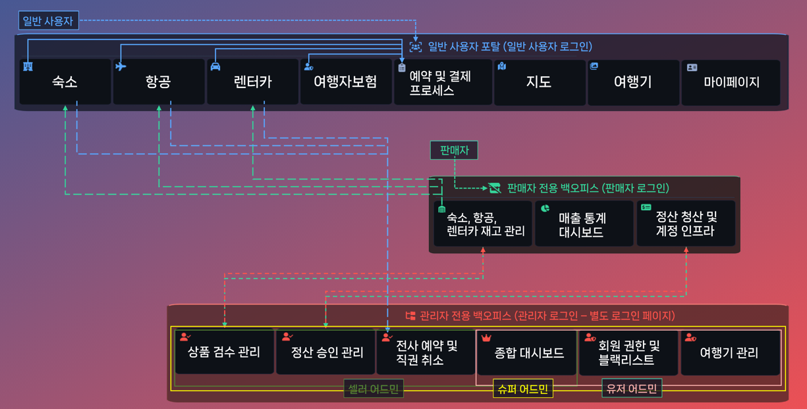
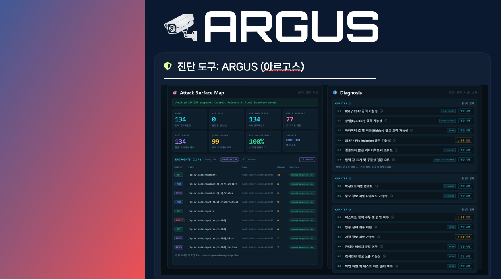
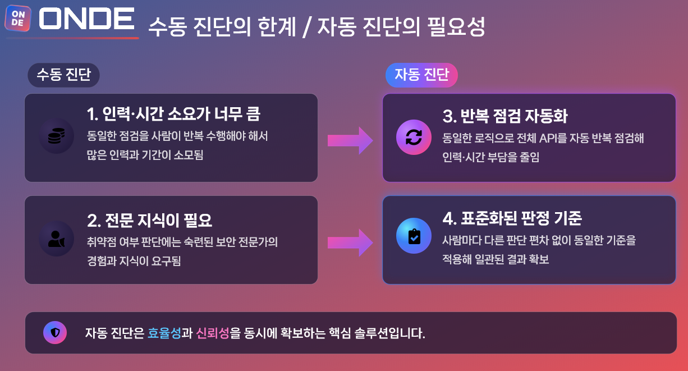

---

# 서론

> **"장대현 멘토님과 마지막 대면 멘토링을 했습니다. 최종 발표 PPT의 텍스트를 줄이고 핵심 화면 위주로 구성을 다시 잡으라는 피드백과 함께, 수동 진단 조치 결과 보완, Argus 자동 진단 기준(httpx / ZAP) 정리, 시연 영상 자막·하이라이트 보완 방향을 받아 반영했습니다."**
>
> 마지막 멘토링에서 최종 발표 PPT·대본·시연 영상 수정 포인트를 정리하고, 피드백별 반영 내용을 기록합니다.

# 1. 멘토링 개요

| 항목 | 내용 |
| --- | --- |
| **일시** | 최종 평가 전 대면 멘토링 / 기록일 2026년 7월 17일 |
| **멘토** | 장대현 멘토님 |
| **참석자** | 개발팀 전원 |
| **안건** | 최종 발표 PPT 텍스트 축소·구성 수정, 수동 진단 조치 결과 보완, Argus 탐지 기준(httpx / ZAP) 명시, 시연 영상 가시성 보완 |

# 2. 멘토링 핵심 피드백 ①: 최종 발표 PPT 줄이기와 구성 수정

멘토님께서는 슬라이드에 글이 많아 발표가 길어지고 전달력이 떨어질 수 있다고 보셨습니다. 긴 문장은 줄이고, 핵심 키워드와 화면이 먼저 보이도록 PPT와 대본을 다시 맞추라는 지시였습니다.

## ① 프로젝트 개요 — 대비가 보이게

대본 분량을 줄이고, 개요 슬라이드는 긴 설명보다 대비가 바로 보이도록 수정했습니다. ‘동작하지만 신뢰할 수 없는 코드’가 왜 위험한지 대본을 보강하고, 슬라이드에서는 두 메시지를 색으로 구분했습니다.

- **빨강:** 동작하지만 신뢰할 수 없는 코드
- **청록:** 심각한 피해를 막는 유일한 방파제

대기업 솔루션 비용을 감당하기 어려운 스타트업·소규모 팀의 현실을 보여주는 간단한 비용 예시도 추가해, Argus가 필요한 이유를 짧게 보강했습니다.

<figure class="article-figure-center article-figure-center--full">
  
</figure>

## ② 팀 소개·ONDE 구조도 — 세 시점으로 보이게

팀 소개는 7명 R&R을 처음부터 나열하던 방식을 접고, **팀 공통 개발 전략과 협업**을 먼저 말한 뒤 특이 사항만 개인으로 내려가도록 순서를 바꿨습니다.

ONDE 기능 구조도도 같은 방향입니다. 보여 주고 싶은 시점은 **일반 사용자 · 판매자 · 관리자** 세 가지인데, 기존에는 일반 사용자를 **비로그인 / 로그인**으로 나눠 그려 시점이 네 개처럼 보였습니다. 이번에는 일반 사용자 쪽을 한 흐름으로 합쳐 **세 시점**으로 보이게 수정했습니다.

<figure class="article-figure-center article-figure-center--full">
  
</figure>

## ③ Argus 소개 — 실제 진단 화면 확대

Argus 소개는 기능 목록보다 **실제 진단 UI**를 크게 확대했습니다. 공격 표면 지도와 챕터별 진단 항목이 한 화면에 보이면, 무엇을 자동으로 돌리는 도구인지 바로 전달됩니다.

<figure class="article-figure-center article-figure-center--full">
  
</figure>

## ④ 수동 진단의 한계 / 자동 진단의 필요성 — 앞으로 배치

세부 기능보다 **자동 진단이 왜 필요한지**를 앞 슬라이드로 옮기라는 피드백을 반영했습니다. 수동 진단의 인력·시간·전문성 부담과, 자동 진단의 반복 점검·표준 판정 이점을 한 장에서 대비했습니다. Argus 아키텍처 설명도 목표·이점 다음으로 순서를 당겼습니다.

<figure class="article-figure-center article-figure-center--full">
  
</figure>

# 3. 멘토링 핵심 피드백 ②: 수동 진단 조치 결과와 자동·수동 구분

취약점 종합 평가 슬라이드에 **이행 점검 후 대응방안**이 빠져 있던 부분을 채웠습니다. 대표 취약점 2개를 골라 아래 흐름으로 정리했습니다.

1. 어떤 탐지 방법으로 확인했는지
2. 몇 건의 취약 포인트가 나왔는지
3. 어떤 대응을 적용했는지
4. 최종적으로 양호 상태로 닫혔는지

수동 진단과 자동 진단을 비교할 때, **자동으로 되지 않는 항목은 자동 범위에서 빼고 수동 진단으로 둡니다.** 그래서 자동화 파이프라인 설명 슬라이드 이미지에서는 수동 진단 대상 취약점을 넣지 않았고, 왜 자동 진단이 안 되어 수동으로 빠지는지는 대본에서 설명하도록 정리했습니다.

# 4. 멘토링 핵심 피드백 ③: httpx / ZAP 기준과 시연 영상 보완

자동 진단 기준이 모호하다는 지적에 맞춰, 검색엔진 슬라이드에 **httpx와 OWASP ZAP의 탐지 영역**을 명시했습니다.

- **httpx / 검색엔진:** URL·API·Swagger 소스 기반의 가벼운 변조와 상태 코드 매칭
- **ZAP·동적 진단:** 실제 동적 점검과 스크린샷 증적이 붙는 파이프라인

시연 영상도 같이 손봤습니다.

- 빠른 배속에 맞춰 발표 음성과 화면 싱크를 대본으로 다시 맞춤
- 진단+스크린샷 구간에 **어디가 취약한지** 안내 자막 추가
- 취약 지점에 **빨간 테두리**로 시선 유도
- 결과서 화면에서 자동·수동 결과를 비교하며 자동 진단 결과를 말로 강조

# 5. Next Step: Argus 실배포를 위한 AWS 인프라 구축

마지막 멘토링 피드백에 따른 PPT·영상 보완이 정리되면, 다음은 **Argus 인프라 구축**입니다. Private Subnet 배치를 전제로 사전 정비를 이어갑니다.

- `config.docker.yaml`의 하드코딩 타깃 IP → ONDE Private IP
- 오픈 리다이렉트 콜백 `redirect_sink_base` 주소 수정
- ZAP JVM·Playwright Headless를 고려한 인스턴스(`t3.xlarge` 이상)
- SSH(22) 대신 SSM Session Manager, ECR pull 최소 권한
- Compose 볼륨의 부모 디렉터리 노출 제거, PDF용 나눔 폰트 경로 검수

차주 월요일부터 인프라 트랙으로 본격 착수합니다.
