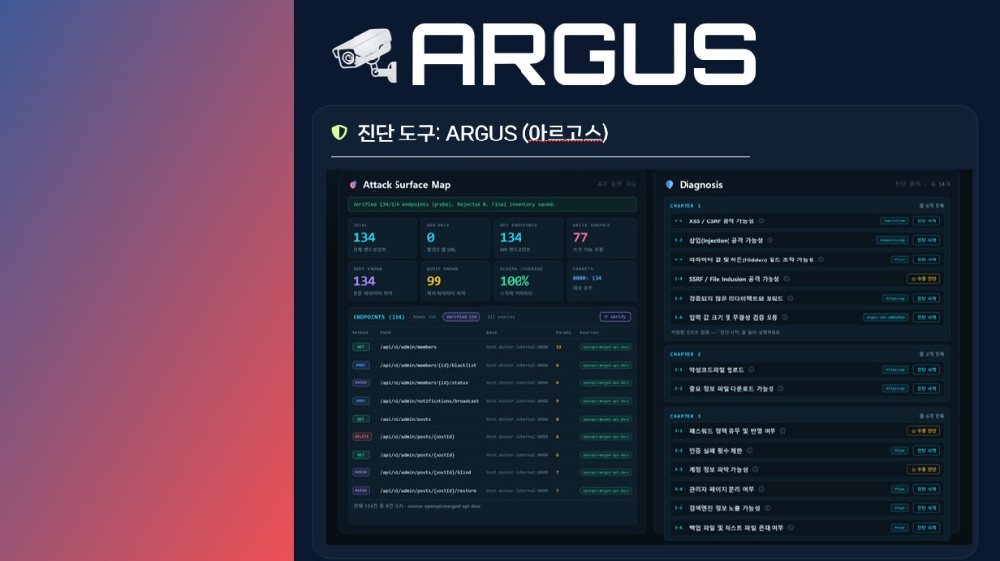
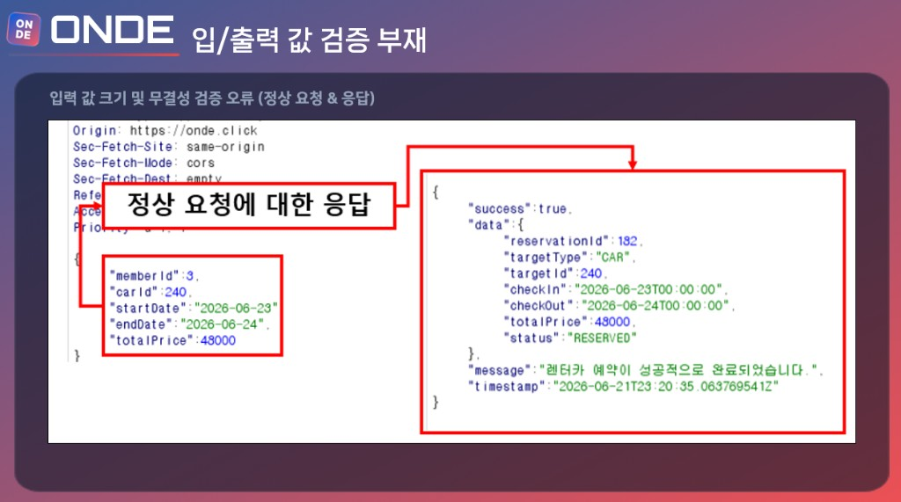
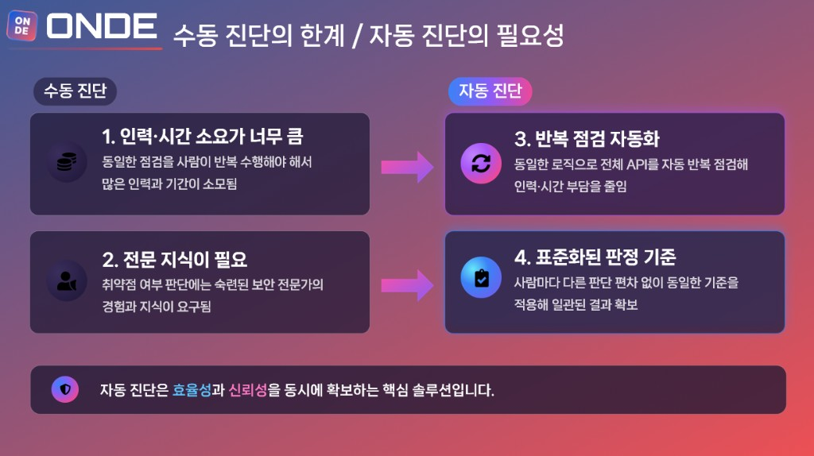
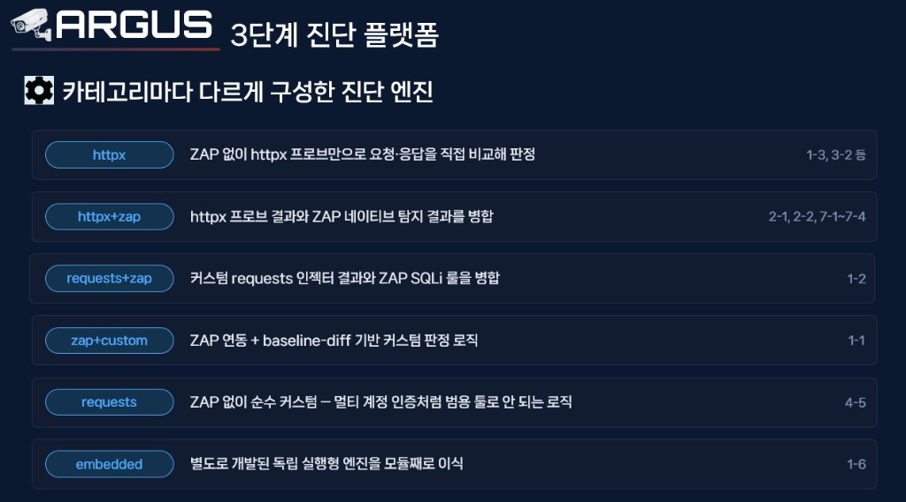
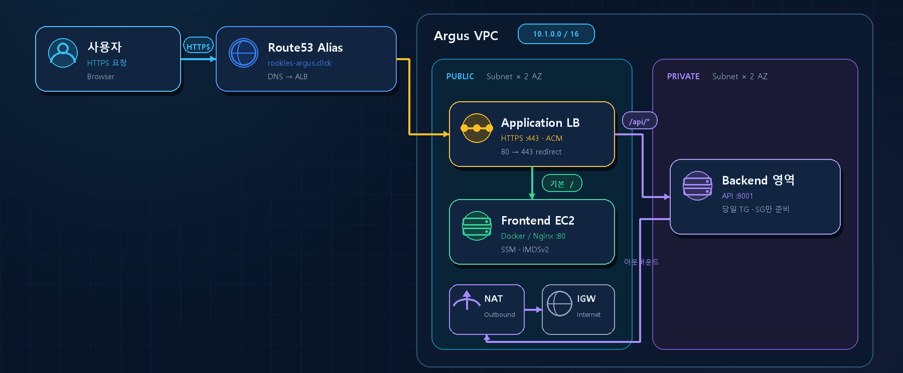
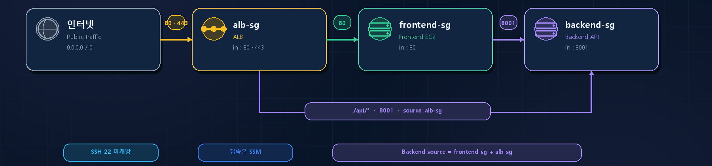

---
title: "[Devlog] SK 쉴더스 루키즈 5기 오프라인 세션 Day 43 — 최종 PPT 보강과 ARGUS 인프라 착수"
date: 2026-07-20
tags:
  - KDT
  - "SK Rookies"
  - "SK shieldus"
  - "국비지원"
  - "루키즈 개발 5기"
  - argus
  - terraform
  - aws
  - presentation
thumbnail: thumbnail.png
---

---

# 서론

> **"Day 42 멘토링에서 정리한 발표 구성을 기준으로, 오늘은 최종 발표 PPT를 한 번 더 다듬고 미뤄 두었던 ARGUS AWS 인프라를 실제로 시작했습니다. PPT는 Argus가 무엇을 보고 무엇을 점검하는지, 왜 자동이어야 하고 엔진을 어떻게 나눴는지가 화면으로 보이도록 손봤고, 인프라는 Networking & Edge와 Frontend EC2를 Terraform으로 올렸습니다."**
>
> 발표가 코앞이라 자료를 다듬는 작업처럼 보이지만, 실제로는 Argus 소개 흐름을 다시 맞추면서 같은 날 VPC·보안그룹·ACM·Route53·ALB·프론트 EC2까지 코드로 고정한, 발표와 배포를 함께 진행한 날이었습니다.

# 1. 오늘 작업의 방향

오늘의 중심은 **발표에서 Argus를 더 분명하게 보여 주기**와 **실배포 기반 착수** 두 가지였습니다.

- Argus 소개 장표를 실제 진단 화면 중심으로 더 크게 키웠습니다.
- 점검한 취약점을 정상 요청·응답 예시로 구체화했습니다.
- 수동 진단에서 자동 진단으로 넘어가는 이유를 한 장에 정리했습니다.
- "자동"이 엔진 하나가 아니라 카테고리별 조합이라는 점을 별도 장표로 펼쳤습니다.
- [ARGUS_Infra](https://github.com/UR-ARGUS/ARGUS_Infra)에 Networking & Edge Terraform을 처음 구성했습니다.
- Onde와 VPC CIDR·tfstate를 분리하고, 도메인을 `rookies-argus.click`으로 맞췄습니다.
- Frontend EC2(Docker/SSM)를 만들어 ALB 타겟에 연결했습니다.

Day 42에서 "다음 주는 인프라"라고 적어 둔 Next Step을, 발표 준비와 병행해 오늘 착수했습니다. Frontend / Backend / Merge 앱 저장소에는 당일 커밋이 없고, 인프라 작업은 ARGUS_Infra에 모였습니다.

# 2. 최종 PPT — Argus를 화면 중심으로 보강

멘토링 공통 지시는 **긴 설명을 줄이고 핵심과 실제 화면을 먼저 보여 달라**는 것이었습니다. 그래서 Argus 소개를 네 장으로 나눠, 문장 대신 화면과 흐름이 먼저 읽히도록 다시 배치했습니다.

## ① ARGUS 플랫폼 화면을 더 자세히

Argus 소개는 기능 목록만으로는 전달이 약합니다. 실제 진단 UI를 크게 두고, 공격 표면 지도와 챕터별 진단 항목이 한 화면에 들어오게 키웠습니다.

<figure class="article-figure-center article-figure-center--full">
  
</figure>

왼쪽 Attack Surface Map은 OpenAPI 기반 인벤토리입니다. 검증된 엔드포인트 수, WRITE surface, 스키마 커버리지가 먼저 보이고, 그 아래 Method·Path·Params·Sources 테이블로 "무엇을 때릴지"가 목록화됩니다. 오른쪽 Diagnosis에는 XSS/CSRF·Injection처럼 자동으로 돌리는 항목과, SSRF·비밀번호 정책처럼 **수동 진단** 뱃지가 붙은 항목이 함께 놓입니다. 이후 수동/자동을 나눌 때 이 구분이 화면에서 먼저 보여야 설명이 짧아집니다.

## ② 점검한 부분을 예시로 설명

"취약하다"고만 말하면 근거가 약합니다. **입/출력 값 검증 부재**를 정상 요청·응답 한 세트로 풀어, 무엇이 오가고 어떻게 성공으로 닫히는지 먼저 보여 줍니다.

<figure class="article-figure-center article-figure-center--full">
  
</figure>

왼쪽 요청 바디에는 `memberId` · `carId` · `startDate` · `endDate` · `totalPrice`가 들어가고, 오른쪽 응답은 `success: true`와 예약 데이터·완료 메시지로 끝납니다. 이 장은 "정상 경로"를 고정하는 역할입니다. 같은 필드에 크기·무결성 검증이 없으면, 이후 변조·과대 입력·권한 불일치 시나리오가 왜 위험한지가 한 장으로 이어집니다. 발표에서는 이 정상 흐름을 짧게 보여 준 뒤 "검증이 없다면 어떤 변조가 통과하는지"로 넘어가도록 대본을 맞췄습니다.

## ③ 수동에서 자동으로

Day 42에서 앞으로 당기라고 했던 **수동 진단의 한계 / 자동 진단의 필요성**을 한 장으로 유지·보강했습니다.

<figure class="article-figure-center article-figure-center--full">
  
</figure>

왼쪽은 인력·시간 소요와 전문 지식 의존, 오른쪽은 반복 점검 자동화와 표준화된 판정 기준입니다. 핵심 메시지는 한 줄, **자동 진단은 효율성과 신뢰성을 동시에 확보하는 핵심 솔루션**이라는 점입니다. 수동을 없애자는 뜻이 아니라, 반복·비교 가능한 구간은 자동으로 돌리고 판단이 필요한 항목만 수동으로 남기는 역할 분담이라는 것을, fig1의 수동 뱃지 항목과 맞물려 설명합니다.

## ④ 3단계 진단 플랫폼을 더 디테일하게

"자동"이라고만 하면 엔진이 하나로 들립니다. **카테고리마다 진단 엔진을 다르게 구성**했다는 점을 별도 장표로 펼쳤습니다.

<figure class="article-figure-center article-figure-center--full">
  
</figure>

- **httpx:** ZAP 없이 httpx 프로브만으로 요청·응답을 직접 비교해 판정 (1-3, 3-2 등)
- **httpx + zap:** httpx 프로브 결과와 ZAP 네이티브 탐지 결과를 병합 (2-1, 2-2, 7-1~7-4)
- **requests + zap:** 커스텀 requests 인젝터와 ZAP SQLi 룰을 병합 (1-2)
- **zap + custom:** ZAP 연동 + baseline-diff 기반 커스텀 판정 (1-1)
- **requests:** ZAP 없이 순수 커스텀 — 멀티 계정 인증처럼 범용 툴로 안 되는 로직 (4-5)
- **embedded:** 별도 개발한 독립 실행형 엔진을 모듈째 이식 (1-6)

이 장표가 있어야 Day 42에서 정리한 httpx / ZAP 역할 분담이 "도구 두 개"가 아니라 **항목별 조합**으로 읽힙니다. 범용 스캐너만으로 부족한 인증·비즈니스 로직은 requests·embedded로 빼고, 탐지와 병합이 필요한 곳은 ZAP과 붙였습니다.

정리하면 PPT 네 장은 **화면(fig1) → 점검 예시(fig2) → 자동화 동기(fig3) → 엔진 구성(fig4)** 순으로, Argus가 무엇을 보고 왜 자동이며 어떻게 쪼갰는지를 차례로 보여 줍니다.

# 3. ARGUS 인프라 착수 — 하루 동안 올린 것

같은 날 [UR-ARGUS](https://github.com/UR-ARGUS)의 ARGUS_Infra에 Terraform을 처음 세웠습니다. 인프라는 한 사람이 전 구간을 쓰지 않고, 아래처럼 파트별로 나눈 뒤 PR로 모으는 방식입니다. 오늘은 그중 **Networking & Edge**와 **Frontend Compute**까지가 코드로 들어갔습니다.

| 파트 | 담당 모듈 | 세부 작업 |
|------|-----------|-----------|
| **Networking & Edge** | VPC / ALB / DNS | VPC, Public/Private Subnet, IGW, NAT Gateway, 보안그룹, Route53, ACM, ALB·타겟그룹 |
| **Frontend Compute** | EC2 (Public) | Public Subnet 프론트엔드 EC2, Nginx, ALB 타겟그룹 연결, IAM Role(SSM) |
| **Backend Compute** | EC2 (Private) | Private Subnet 백엔드 EC2, docker compose(api/worker/redis/zap/selenium) 부트스트랩, IAM Role(SSM) |
| **Storage & Secrets** | EBS / S3 / Secrets / CloudWatch | EBS, 리포트용 S3, tfstate 백엔드(S3+DynamoDB), AWS Secrets Manager, GitHub OIDC·Repo Secrets 관리, Secrets 주입 스크립트, CloudWatch 대시보드·알람, 백업/스냅샷 정책 |
| **CI (빌드)** | GitHub Actions + ECR | 프론트·백엔드 lint/test, docker 이미지 빌드&push, terraform plan, ECR 리포지토리 리소스 + 라이프사이클 정책 |
| **CD & 배포 테스트** | GitHub Actions + CloudWatch | SSM 배포, ALB 헬스체크, 프론트→백엔드 연동 테스트, ZAP·Selenium 동작 검증, 배포 검증용 CloudWatch Alarm/Synthetics Canary 리소스, ALB 헬스체크 경로 설정 |
| **(전체 통합)** | — | 파트별 PR 리뷰·코드 통합, terraform apply 실행 |

그래서 오늘 실제로 올린 것도 표의 앞 두 행과 맞습니다.

1. **Networking & Edge** — VPC · 보안그룹 · ACM · Route53 · ALB 경로 분기
2. **Frontend Compute** — 퍼블릭 서브넷의 EC2(Docker/SSM)와 ALB 타겟 등록

동시에 Onde와 대역·상태 저장소를 섞지 않도록 CIDR·tfstate 경계를 정리하고, 서비스 도메인을 `rookies-argus.click`으로 맞췄습니다. Frontend / Backend / Merge 앱 저장소에는 당일 커밋이 없고, 인프라 작업은 ARGUS_Infra에 모였습니다. 당일 tip 기준으로 레포에는 다음 파일이 들어갔습니다.

```text
.
├── .gitignore
├── README.md
└── terraform/
    ├── .terraform.lock.hcl
    ├── provider.tf
    ├── variables.tf
    ├── vpc.tf
    ├── security.tf
    ├── acm.tf
    ├── dns.tf
    ├── alb.tf
    ├── ec2_frontend.tf
    └── outputs.tf
```

요청 흐름은 아래와 같습니다.

1. 사용자가 `https://rookies-argus.click` 접속 → Route53 A(Alias) → ALB
2. ALB가 443에서 ACM 인증서로 HTTPS 종료 (80은 443으로 301)
3. 경로 분기: `/` → Frontend TG, `/api/*` → Backend TG
4. 프라이빗 구간 아웃바운드는 NAT → IGW만 허용 (백엔드 직접 인터넷 진입 없음)

<figure class="article-figure-center article-figure-center--full">
  
</figure>

# 4. Networking & Edge — 파일별로 만든 것

## Provider · 변수 · tfstate 경계

`provider.tf`에서 Terraform `>= 1.3`, AWS provider `~> 5.0`을 고정하고, 모든 리소스에 `Project` / `Environment` / `ManagedBy=Terraform` / `Owner=networking-edge` 기본 태그를 붙이도록 했습니다.

원격 state(S3 + DynamoDB 락) 블록은 주석 상태로 두되, 규칙을 주석에 못 박았습니다.

- Argus 전용 버킷·락 테이블을 새로 쓸 것
- Onde의 tfstate 버킷/락을 **절대 재사용하지 말 것** (같은 state를 공유하면 apply 시 상대 리소스를 삭제·덮어쓸 수 있음)
- 실제 버킷/락 생성은 Storage & Secrets 담당 이후 값 채워서 활성화

`variables.tf`의 핵심 기본값은 다음과 같습니다.

| 변수 | 기본값 | 의미 |
|------|--------|------|
| `aws_region` | `ap-northeast-2` | 서울 |
| `project_name` | `argus` | 리소스 이름 prefix |
| `vpc_cidr` | `10.1.0.0/16` | Onde(`10.0.0.0/16`)와 분리 |
| `public_subnet_cidrs` | `10.1.1.0/24`, `10.1.2.0/24` | ALB · 프론트 EC2 |
| `private_subnet_cidrs` | `10.1.11.0/24`, `10.1.12.0/24` | 백엔드 자리 |
| `availability_zones` | `ap-northeast-2a`, `2c` | 2 AZ |
| `domain_name` | `rookies-argus.click` | ACM · Route53 대상 |
| `frontend_port` / `backend_port` | `80` / `8001` | TG·SG 포트 |
| 헬스체크 경로 | `/`, `/health` | FE / BE TG |

프론트 EC2용으로 `frontend_instance_type`(기본 `t3.small`), `frontend_root_volume_size`(기본 20GB, 최소 8GB validation)도 같은 파일에 넣었습니다.

## VPC (`vpc.tf`)

2-Tier · 2 AZ 골격을 코드로 고정했습니다.

- **VPC** — DNS support/hostnames 활성화
- **Public subnet × 2** — `map_public_ip_on_launch = true` (ALB · Frontend)
- **Private subnet × 2** — 퍼블릭 IP 없음 (Backend)
- **IGW** — 퍼블릭 ↔ 인터넷
- **EIP + 단일 NAT** — 프라이빗 아웃바운드 전용 (비용 절감, prod HA 시 AZ별 NAT로 확장 여지)
- **라우트** — Public `0.0.0.0/0 → IGW`, Private `0.0.0.0/0 → NAT`

초기에는 CIDR이 다른 값이었고, 같은 날 **`10.1.0.0/16`으로 바꿔 Onde와 겹치지 않게** 맞췄습니다. 향후 Peering / Transit Gateway를 염두에 둔 분리입니다.

## 보안그룹 (`security.tf`)

CIDR을 넓게 열지 않고 **앞단 보안그룹을 source로 참조**해 접근 경로를 강제했습니다. SSH(22)는 열지 않았고, 인스턴스 접속은 SSM을 전제로 했습니다.

<figure class="article-figure-center article-figure-center--full">
  
</figure>

| 보안그룹 | 인바운드 | 출처 |
|----------|----------|------|
| `alb-sg` | 80, 443 | 인터넷 `0.0.0.0/0` |
| `frontend-sg` | 80 | `alb-sg`만 |
| `backend-sg` | 8001 | `frontend-sg` + `alb-sg` |

ALB가 `/api/*`를 백엔드 타겟 그룹으로 바로 forward하므로, 백엔드 SG에는 frontend-sg뿐 아니라 alb-sg도 source로 넣었습니다.

## ACM · DNS · ALB

**ACM (`acm.tf`)** 은 루트 도메인 + `*.도메인` SAN을 DNS 검증으로 발급합니다. Route53에 검증 CNAME을 자동 생성하고(`for_each` + `allow_overwrite`), `aws_acm_certificate_validation`이 끝난 ARN을 ALB HTTPS 리스너가 참조합니다. `create_before_destroy`로 갱신 시 무중단 교체 여지도 남겨 두었습니다.

**DNS (`dns.tf`)** 는 같은 날 모델을 고친 지점이 중요합니다. 처음에는 호스티드 존을 Terraform이 생성하는 형태였습니다. 그런데 도메인을 Route53에서 등록하면 존이 이미 생기므로, 같은 이름으로 존을 또 만들면 NS가 어긋납니다. 그래서 `data "aws_route53_zone"`으로 **기존 존만 참조**하고, 루트 / `www` A 레코드를 ALB Alias로 연결하도록 바꿨습니다. 도메인 기본값도 초기 `argus.click` 가정에서 **`rookies-argus.click`**으로 통일했습니다.

**ALB (`alb.tf`)** 라우팅은 다음과 같습니다.

| 구성 | 동작 |
|------|------|
| Internet-facing ALB | 모든 퍼블릭 서브넷에 배치, `alb-sg` 부착 |
| Frontend TG | HTTP :80, 헬스 `/` matcher `200` |
| Backend TG | HTTP :8001, 헬스 `/health` matcher `200-399` |
| Listener 80 | → 443 HTTPS **301 redirect** |
| Listener 443 | TLS1.3 정책, ACM 검증 ARN, **기본 forward → Frontend TG** |
| Rule priority 10 | path `/api/*` → **Backend TG** |

타겟 그룹은 우선 정의만 하고, 백엔드 EC2 attachment는 후속으로 남겼습니다. 프론트는 같은 날 EC2를 붙여 attachment까지 완료했습니다.

## Outputs · README

`outputs.tf`에는 후속 모듈이 바로 물릴 값을 빼 두었습니다. VPC / public·private subnet IDs, ALB·Frontend·Backend SG IDs, ALB DNS / zone ID, FE·BE target group ARN, (프론트 EC2 추가 후) instance id·IP·SSM IAM role 이름, Route53 zone id / name servers, ACM ARN, `https://{domain}` URL입니다.

같은 날 Networking & Edge README도 추가했습니다. Mermaid 아키텍처, 파일별 역할, SG 표, `terraform init/plan/apply` 절차, Argus 전용 tfstate·도메인 NS·TG/EC2 경계 주의를 문서로 남겨, 레포만 열어도 따라갈 수 있게 했습니다.

# 5. Frontend EC2 — 프론트 호스트까지 연결

Networking 위에 실제 프론트 컴퓨트를 `ec2_frontend.tf`로 올렸습니다.

## AMI · IAM · 인스턴스

- **AMI:** Amazon Linux 2023 최신 x86_64 (`data.aws_ami`)
- **IAM Role:** `ec2.amazonaws.com` assume + `AmazonSSMManagedInstanceCore`
- **Instance Profile** 연결
- **배치:** `public[0]` 서브넷, 퍼블릭 IP 부여, `frontend-sg`
- **루트 볼륨:** gp3, 암호화, 크기 변수화, 종료 시 삭제
- **IMDSv2 필수** (`http_tokens = required`)

## user_data · ALB 등록

부팅 시 하는 일은 최소화했습니다.

1. `dnf update`
2. Docker 설치 · enable/start
3. `ec2-user`를 docker 그룹에 추가
4. SSM Agent enable/restart

주석상 실제 Nginx는 ARGUS 프론트 Docker 이미지 안에서 돌리는 전제입니다. Terraform은 "Docker·SSM 준비된 호스트 + ALB에 붙일 인스턴스"까지가 범위입니다. 마지막으로 `aws_lb_target_group_attachment`로 Frontend TG에 `:80` 등록해, `사용자 → Route53 → ALB → Frontend TG → EC2:80`까지 코드상 연결했습니다.

# 6. 설계에서 특히 챙긴 점

1. **Onde와 분리** — CIDR `10.1.0.0/16`, tfstate 버킷/락 재사용 금지. 한 AWS 계정에 팀 인프라가 공존할 때 state 충돌을 막기 위한 운영 규칙입니다.
2. **최소 권한 SG 체인** — IP 와이드오픈 대신 SG 참조로 "누가 누구를 때릴 수 있는지"를 코드에 고정했습니다.
3. **경로 기반 단일 진입점** — 프론트·백엔드를 각각 공개하지 않고 ALB 하나에서 `/`와 `/api/*`로 나눕니다.
4. **HTTPS 강제** — ACM DNS 검증 + HTTP→HTTPS 301 + TLS1.3 정책.
5. **SSH 없는 운영** — 프론트 EC2에 SSM 코어 정책을 달고 user_data로 Agent를 살립니다.
6. **도메인 등록 방식에 맞춘 DNS** — Route53에 도메인을 살 때 생기는 호스티드 존을 data로 참조해, Terraform이 존을 중복 생성하지 않게 고쳤습니다.
7. **계층 경계** — 당일 Networking은 TG·SG·서브넷까지, Frontend Compute는 FE EC2 attachment까지. Backend EC2·스토리지·Secrets는 다음날 이후로 넘겼습니다.

# 7. 오늘 정리하면서 느낀 점

첫째, Argus 소개는 문장을 늘리는 것보다 **화면 → 예시 → 동기 → 엔진** 순서로 나눠 보여 줄 때 전달이 빨랐습니다. 같은 내용을 네 장에 나눠도 각 장이 하나의 질문에만 답하니 발표가 짧아집니다.

둘째, 인프라는 발표용 그림이 아니라 **실배포 골격**입니다. Onde와 CIDR·state를 분리하고, 도메인·인증서·ALB 경로·프론트 호스트까지 코드로 고정해야 다음 사람이 그 위에 백엔드를 얹을 수 있습니다.

셋째, Route53처럼 "이미 존재하는 리소스"는 만들지 않고 참조해야 한다는 것도 실수하기 쉬운 지점이었습니다. 존을 중복 생성했으면 도메인 검증부터 어긋났을 것입니다.

# 8. 다음 작업

당일 기준으로 아직 안 한 것도 범위를 분명히 해 둡니다.

- Backend EC2 생성·프라이빗 서브넷 배치·BE TG attachment
- tfstate S3/DynamoDB 실제 생성 및 backend 블록 활성화
- Secrets Manager · 보고서 S3 · EBS · GitHub OIDC · Backup 등 Storage & Secrets 계층
- 프론트 Docker 이미지 배포 파이프라인 (인프라는 호스트·TG까지만)

즉 **7월 20일은 "인터넷 → HTTPS ALB → 경로 분기 → 프론트 호스트"까지를 IaC로 세운 날**입니다. Day 43은 최종 발표 PPT에서 Argus를 화면 중심으로 더 구체화하고, 그 위에 ARGUS AWS 인프라의 첫 계층을 실제로 올린 기록입니다.
