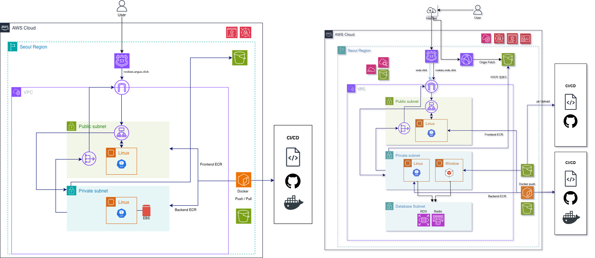
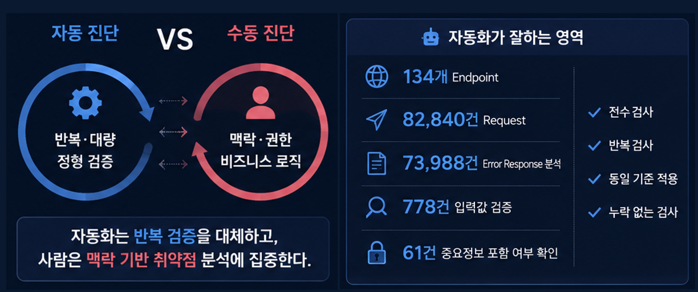
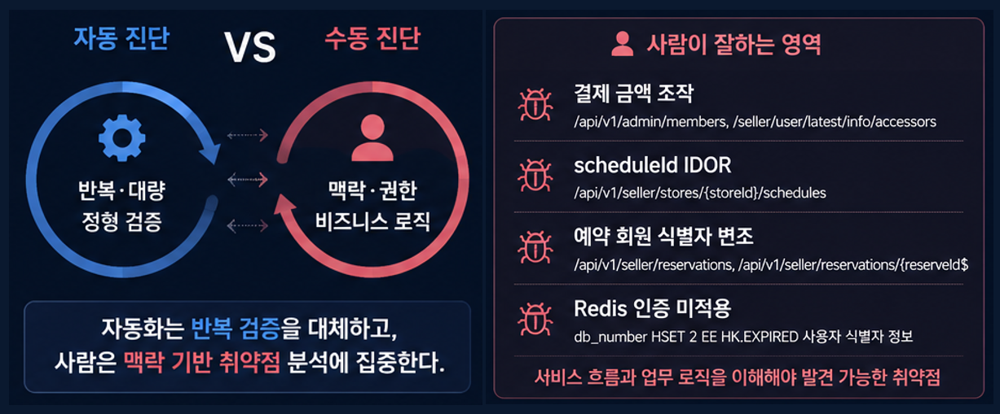
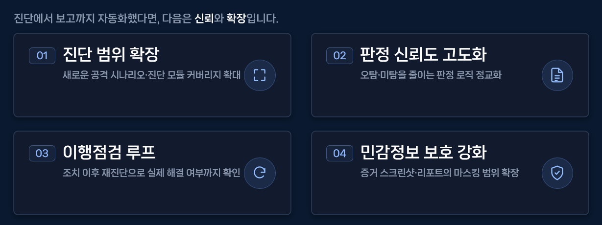

---

# 서론

> **"Day 43에서 Networking·Frontend까지 올린 ARGUS 인프라 위에, 오늘은 Storage & Secrets·Backend EC2·CI/ECR까지 이어 붙였습니다. 같은 날 최종 발표 PPT도 인프라 비교·자동/수동 역할 분담·개선 방향까지 다듬고 시연 영상으로 마감했습니다. 파트 표 기준으로 이제 남은 건 CD & 배포 테스트뿐입니다."**
>
> 발표 장표를 닫는 날처럼 보이지만, 실제로는 저장·시크릿·백엔드 호스트·이미지 레지스트리까지 IaC로 고정하고, 배포 파이프라인이 물릴 뼈대만 남긴 날이기도.

# 1. 오늘 작업의 방향

오늘의 중심은 **최종 PPT를 발표 가능한 상태까지 닫기**와 **인프라 2일차로 배포 직전 계층을 채우기**였습니다.

- Onde와 Argus 인프라 아키텍처를 한 장에서 나란히 비교했습니다.
- 자동 진단과 수동 진단을 역할·수치·사례로 나눠 보여 주었습니다.
- 진단→보고 자동화 다음의 개선 방향 네 가지를 장표로 고정했습니다.
- 시연 영상까지 넣어 발표 흐름을 마감했습니다.
- [ARGUS_Infra](https://github.com/UR-ARGUS/ARGUS_Infra)에 tfstate·리포트 S3·Secrets·OIDC·EBS·Backup을 올렸습니다.
- Private Subnet Backend EC2를 ALB `/api/*`에 붙이고 EBS 마운트까지 부트스트랩했습니다.
- ECR 리포·pull 권한과 Terraform Plan CI를 연결했습니다.

Day 43에서 남겼던 Backend·Storage·CI가 오늘 코드로 들어갔고, Frontend / Backend / Merge 앱 저장소에는 당일 커밋이 없습니다. 인프라 작업은 다시 ARGUS_Infra에 모였습니다.

# 2. 최종 PPT — 비교·역할 분담·개선·시연으로 마감

Day 43이 Argus **화면·점검 예시·자동화 동기·엔진 구성**을 키웠다면, 오늘은 발표 후반부를 **인프라 비교 → 자동/수동 역할 → 앞으로의 → 시연**으로 닫았습니다.

## ① Onde와 Argus 인프라 아키텍처

최종 발표에서 "우리도 AWS에 올렸다"만으로는 설득력이 약합니다. **같은 팀 계정·리전 안에서 Onde와 Argus가 어떻게 다르게 생겼는지**를 한 장에 나란히 두었습니다.

<figure class="article-figure-center article-figure-center--full">
  
</figure>

왼쪽 Argus는 `rookies-argus.click` → Route53 → ALB → Public Frontend EC2 / Private Backend EC2(+EBS) 흐름이 중심입니다. 오른쪽 Onde는 CloudFront·이미지 S3, Private의 Windows EC2, DB 서브넷(RDS·ElastiCache)까지 더 두꺼운 구성입니다. 발표에서 강조할 포인트는 두 가지입니다.

1. **대역·상태를 섞지 않는다** — Argus는 `10.1.0.0/16`과 전용 tfstate로 Onde와 분리한다.
2. **Argus는 진단 플랫폼에 맞춘 2-Tier** — FE/BE Docker + ECR 배포 축을 단순하게 유지하고, RDS·CloudFront까지는 Onde 쪽 복잡도를 빌려 오지 않는다.

이 장이 있으면 Day 43에서 올린 Networking/Frontend와 오늘 올린 Backend/Storage가 "그림의 어느 칸인지"가 바로 읽힙니다.

## ② 자동 진단이 잘하는 영역

자동 vs 수동을 한 장에 몰아넣으면 메시지가 흐려집니다. 그래서 **자동이 담당하는 구간**을 수치와 함께 먼저 보여 줍니다.

<figure class="article-figure-center article-figure-center--full">
  
</figure>

왼쪽은 역할 분담의 한 줄 정의입니다. 자동화는 **반복·대량 정형 검증**, 사람은 **맥락·권한·비즈니스 로직**. 오른쪽은 그 "반복"이 실제로 어느 규모인지입니다.

- 134개 Endpoint
- 82,840건 Request
- 73,988건 Error Response 분석
- 778건 입력값 검증
- 61건 중요정보 포함 여부 확인

체크리스트는 전수·반복·동일 기준·누락 없는 검사입니다. 발표 대본은 "사람이 이 요청량을 손으로 돌릴 수 없다 → 그래서 httpx/ZAP 조합이 필요하다"로 이어집니다.

## ③ 사람이 잘하는 영역

같은 비교 프레임을 유지한 채, 오른쪽만 **수동이 남는 이유**로 바꿉니다.

<figure class="article-figure-center article-figure-center--full">
  
</figure>

예시로 올린 것은 결제 금액 조작, scheduleId IDOR, 예약 회원 식별자 변조, Redis 인증 미적용처럼 **서비스 흐름과 업무 권한을 알아야 보이는 취약점**입니다. Day 43 fig1의 수동 뱃지 항목과 맞물리면, "자동을 키웠다"가 아니라 **역할을 나눴다**는 메시지가 됩니다.

## ④ 개선 방향 — 신뢰와 확장

진단에서 보고까지 자동화했다면, 다음은 **신뢰**와 **확장**입니다.

<figure class="article-figure-center article-figure-center--full">
  
</figure>

| 번호 | 방향 | 한 줄 |
|------|------|--------|
| 01 | 진단 범위 확장 | 새 공격 시나리오·진단 모듈 커버리지 |
| 02 | 판정 신뢰도 고도화 | 오탐·미탐을 줄이는 판정 로직 |
| 03 | 이행점검 루프 | 조치 후 재진단으로 실제 해결 확인 |
| 04 | 민감정보 보호 강화 | 증거 스크린샷·리포트 마스킹 범위 확대 |

이 장은 "끝났다"가 아니라 **다음 스프린트 우선순위**를 발표에 남기는 역할입니다.

## ⑤ 시연 영상으로 마무리

장표만으로는 Argus가 "돌아가는 제품"으로 안 보입니다. 오늘은 진단 흐름을 담은 **시연 영상까지 넣어 발표 구성을 닫았습니다.** PPT의 설명 → 비교 → 개선 → 실제 화면 순으로, 듣는 사람이 제품과 인프라를 같은 이야기로 이어 듣도록 맞췄습니다.

# 3. ARGUS 인프라 2일차 — 하루 동안 올린 것

같은 날 [UR-ARGUS](https://github.com/UR-ARGUS) ARGUS_Infra에 Day 43에서 비워 둔 계층을 채웠습니다. 파트 표로 보면 오늘은 **Storage & Secrets · Backend Compute · CI**까지이고, **CD & 배포 테스트만** 남았습니다.

| 파트 | 담당 모듈 | 세부 작업 | Day 44 |
|------|-----------|-----------|--------|
| **Networking & Edge** | VPC / ALB / DNS | VPC, Subnet, IGW, NAT, SG, Route53, ACM, ALB | Day 43 완료 |
| **Frontend Compute** | EC2 (Public) | Public FE EC2, ALB TG, SSM | Day 43 완료 |
| **Backend Compute** | EC2 (Private) | Private BE EC2, compose 부트스트랩, IAM(SSM), TG attachment, EBS 마운트 | **오늘** |
| **Storage & Secrets** | EBS / S3 / Secrets | tfstate, 리포트 S3, Secrets Manager, OIDC, EBS, Backup, inject-secrets | **오늘** |
| **CI (빌드)** | GitHub Actions + ECR | ECR 리포·lifecycle, terraform plan, EC2 ECR pull | **오늘** |
| **CD & 배포 테스트** | GitHub Actions + CloudWatch | SSM 배포, ALB 헬스체크, FE→BE 연동, ZAP·Selenium 검증, Alarm/Synthetics, 헬스 경로 | **남음** |
| **(전체 통합)** | — | 파트 PR 통합 · terraform apply | 병행 |

당일 tip 기준 레포 골격은 대략 다음과 같습니다.

```text
.
├── .gitignore
├── README.md
├── .github/workflows/
│   └── terraform-plan.yml
├── scripts/
│   └── inject-secrets.sh
└── terraform/
    ├── provider.tf / variables.tf / outputs.tf
    ├── vpc.tf / security.tf / acm.tf / dns.tf / alb.tf
    ├── ec2_frontend.tf / ec2_backend.tf
    ├── tfstate.tf / s3_reports.tf / secrets.tf
    ├── github_oidc.tf / ecr.tf
    ├── ebs.tf / backup.tf
    └── example.tfvars
```

요청·배포가 만날 흐름은 이렇게 이어집니다.

1. 사용자 → `https://rookies-argus.click` → Route53 → ALB(HTTPS)
2. `/` → Frontend TG → Public FE EC2, `/api/*` → Backend TG → Private BE EC2
3. CI가 이미지를 ECR에 push하면, (다음 CD가) SSM으로 compose up · secrets 주입
4. ZAP·Selenium 리포트는 reports S3, 상태 파일은 전용 tfstate 버킷

# 4. Storage & Secrets — 저장·비밀·OIDC

전날 provider에만 주석으로 남겼던 **Argus 전용 원격 상태**와, 시크릿·리포트·백업 계층을 코드로 올렸습니다.

## tfstate (`tfstate.tf`)

- S3: `argus-tfstate-bucket-<계정ID>` — 버전잉·AES256·퍼블릭 차단·`prevent_destroy`
- DynamoDB 락: `LockID`, PAY_PER_REQUEST
- 순서: backend 주석 상태로 최초 apply → backend 주석 해제 → `terraform init -migrate-state`
- Onde tfstate 재사용 금지는 그대로

## 리포트 S3 · Secrets · inject

- **reports S3** — ZAP·Selenium 결과물, IA 전환 후 만료, `reports_s3_access` 정책만 정의하고 Role attach는 컴퓨트·CD가 수행
- **Secrets Manager** — `argus/app`에 `DB_PASSWORD` / `JWT_SECRET` / `REDIS_PASSWORD`. 값은 Git 밖 `*.tfvars`
- **`inject-secrets.sh`** — Secrets JSON → `/opt/argus/.env`. CD가 SSM RunCommand로 호출하는 전제

## GitHub OIDC · EBS · Backup

- OIDC Provider + Actions Role — ECR push/pull, tfstate, SSM SendCommand, reports S3
- 허용 리포에 **ARGUS_Merge** 추가 (머지 레포도 같은 Role)
- **EBS** — 백엔드 데이터 볼륨 정의만 (attachment는 컴퓨트)
- **Backup** — vault + daily plan, `Project` 태그로 대상 자동 포함

시크릿은 Git에 안 넣고, EC2에는 배포 시 `.env`로만 내리는 경계를 코드·스크립트로 맞춰 두었습니다.

# 5. Backend EC2 — Private Subnet 컴퓨트

`ec2_backend.tf`로 ALB `/api/*` 타겟이 실제로 붙을 호스트를 올렸습니다.

## 배치 · IAM · attachment

- Amazon Linux 2023, **Private subnet[0]**, 퍼블릭 IP 없음 → 아웃바운드 NAT, 접속은 SSM만
- Role: SSM + secret read + reports S3 (+ 이후 ECR pull)
- Backend TG `:8001` attachment
- Storage 파트 EBS를 `aws_volume_attachment`로 연결 (API device `/dev/xvdf`, OS에서는 Nitro라 `/dev/nvme1n1`)

## user_data

1. Docker + python3
2. docker-compose 플러그인(릴리스 바이너리) 설치
3. `inject-secrets.sh`를 `/opt/argus/scripts/`에 배치
4. SSM Agent enable
5. EBS 대기 → ext4(없을 때만) → `/opt/argus/data` 마운트 → fstab

주석상 컨테이너는 **zap + backend + worker + selenium을 이 EC2 한 대**에서 compose로 기동하기로 결정했습니다. 실제 `docker compose up`은 CD(SSM) 영역이고, Terraform은 런타임·시크릿 주입·데이터 볼륨까지가 범위입니다. Frontend·Backend 모두 `lifecycle { ignore_changes = [ami] }`로 패치 AMI 때문에 운영 인스턴스가 통째로 재생성되는 것도 막았습니다.

# 6. CI / ECR — Plan과 이미지 저장소

## ECR (`ecr.tf`)

- `argus-dev-frontend` / `argus-dev-backend`
- scan_on_push, untagged 7일 만료 · 최근 30개 유지
- **ecr_pull** 정책을 FE/BE EC2 Role에 attach — push는 OIDC Actions Role, pull은 배포 대상 EC2

## Terraform Plan 워크플로

`terraform/**` 변경 PR에서 OIDC로 Role assume → `init` → `plan` → 결과를 PR 코멘트로 남깁니다. 중간에 앱 lint/build 워크플로도 올렸다가 tip에서는 정리된 상태라, **인프라 CI 확정본은 Terraform Plan + ECR 리소스·권한**으로 보는 편이 맞습니다. 앱 이미지 빌드/푸시 본문은 CD·앱 레포와 맞춰 이어갈 구간입니다.

# 7. 설계에서 특히 챙긴 점

1. **파트 경계** — Storage는 볼륨·정책·시크릿 정의, Compute는 attachment·부트스트랩, CI는 ECR·Plan.
2. **시크릿은 Git 밖** — Secrets Manager + gitignore tfvars, 런타임은 `.env` 주입.
3. **키 없는 CI** — OIDC로 ECR/tfstate/SSM을 묶고 허용 리포를 변수로 관리.
4. **Private Backend** — 퍼블릭 IP 없이 ALB `/api/*`만 인바운드.
5. **한 대 compose** — 비용·운영 단순화. ZAP·worker 동시 기동 시 스펙 재검증은 Next Step.
6. **Nitro 디바이스명** — `/dev/xvdf` ≠ `/dev/nvme1n1`. 마운트 스크립트가 실제 블록 디바이스를 기다림.
7. **AMI ignore_changes** — 운영 중 불필요한 인스턴스 교체 방지.

# 8. 오늘 정리하면서 느낀 점

첫째, PPT 후반부는 **비교 → 역할 → 다음 → 시연** 순이 짧았습니다. Onde/Argus를 나란히 두고, 자동/수동을 수치와 사례로 나눈 뒤, 개선 네 칸과 시연으로 닫으니 "무엇을 만들었고 앞으로 무엇을 할지"가 한 호흡으로 이어졌습니다.

둘째, 인프라 2일차는 새 VPC를 또 그리는 날이 아니라 **배포가 물릴 저장·비밀·백엔드·레지스트리**를 채우는 날이었습니다. Day 43의 Networking/Frontend 위에 오늘 계층이 붙어야 CD가 SSM·헬스·연동 검증으로 넘어갈 수 있습니다.

셋째, "남은 게 CD뿐"이라는 말은 할 일이 없다는 뜻이 아닙니다. compose up, ALB 헬스, FE→BE 연동, ZAP·Selenium, Synthetics까지가 실제로 서비스가 도는지 확인하는 구간입니다.

# 9. 다음 작업

파트 표 기준으로 **CD & 배포 테스트**만 남았습니다.

- SSM으로 secrets 주입 · `docker compose up` 배포
- ALB 헬스체크 경로·상태 확인
- 프론트 → 백엔드 연동 테스트
- ZAP·Selenium 동작 검증 및 리포트 S3 연동
- 배포 검증용 CloudWatch Alarm / Synthetics Canary
- 앱 이미지 빌드·push 워크플로 위치 재정리 (Infra vs 앱 레포)
- Backend 인스턴스 스펙 재검증 (worker/selenium 반영 후)
- provider S3 backend 활성화 · `migrate-state` 실제 수행 확인

즉 **7월 21일은 최종 PPT를 시연까지 닫고, ARGUS 인프라에서 Storage·Backend·CI까지 이어 붙여 CD만 남긴 날**입니다. Day 44는 발표 자료의 마감과, 실배포 직전 뼈대를 완성한 기록이기도 합니다.
