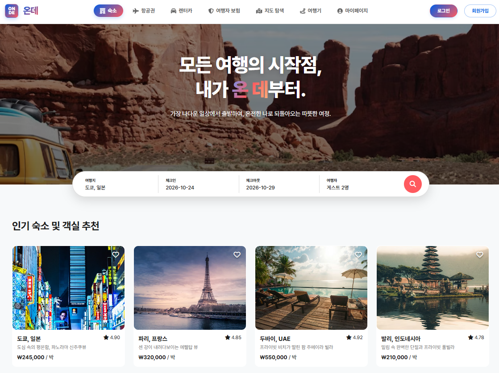

---

# 서론

> **"기획 단계를 마무리하고 본격적인 개발 단계로 진입했습니다. 플랫폼의 정체성을 담은 이름을 확정하고, 상세 설계를 바탕으로 첫 코드를 작성하기 시작했습니다."**
>
> 오늘은 프로젝트 명칭을 **온데(onde)**로 확정하고, 통합 WBS와 상세 설계(요구사항·API·도메인)를 마무리한 뒤 로컬 개발 환경 세팅과 첫 구현에 착수했습니다.

# 1. 프로젝트 명칭 확정: 온데 (onde)

팀 회의를 통해 프로젝트 명칭을 **온데(onde)**로 최종 결정했습니다.

'온데'는 **'온 곳'**이라는 뜻의 순우리말로, 우리가 개발할 여행 플랫폼의 핵심 가치를 담고 있습니다. 플랫폼의 지향점을 가장 잘 나타내는 슬로건은 다음과 같습니다.

> **"모든 여행의 시작점, 내가 온 데부터. 가장 나다운 일상에서 출발하여, 온전한 나로 되돌아오는 따뜻한 여정."**

단순한 기능 구현을 넘어, 사용자가 일상에서 출발해 온전한 자신으로 되돌아오는 여정을 돕는 완성도 높은 플랫폼을 목표로 개발에 착수했습니다.

# 2. 통합 개발 일정 및 WBS 수립

효율적인 진행을 위해 풀스택과 인프라 트랙의 일정을 동기화하고 세부 WBS를 확정했습니다.

- **기능 개발:** 6월 1일까지 각 파트별 개별 기능 구현 완료
- **코드 통합:** 6월 2일 ~ 5일 소스코드 통합 및 연동 테스트
- **취약점 진단:** 6월 8일 ~ 12일 실무 가이드 기반 진단 및 보완 조치

이번 프로젝트의 핵심 주제가 **취약점 진단**인 만큼, 빠르게 웹 서비스 개발을 마치고 취약점 진단을 위한 심도 있는 학습과 실제 진단 과정을 중점적으로 진행할 예정입니다.

# 3. 상세 설계 및 UI/UX 결과물

요구사항 정의서, API 명세서, 도메인 설계서 등 프로젝트의 뼈대가 되는 기술 산출물들을 최종 확정했습니다. 단순한 기능 나열을 넘어, 대규모 트래픽 처리와 보안성을 고려한 설계를 반영했습니다.

## 요구사항 정의 (Functional & Non-Functional)

- **핵심 비즈니스:** 항공권 실시간 검색 및 선점(Redis), 여행자 보험 동기 계산, 숙소/렌터카 통합 예약 파이프라인 구축
- **보안 요구사항:** BCrypt 암호화, JWT 기반 세션 관리, 관리자 3계층 권한 분리(RBAC), 결제 금액 위변조 방지 검증(2-Step)
- **성능/안정성:** 오버부킹 방지를 위한 분산 락(Redisson) 적용, 대용량 데이터 추출 시 OOM 방지(JPA Stream), 서비스 간 느슨한 결합(Logical FK)

## API 설계 (Restful API Standards)

- **기술 스택:** Java / Spring Boot, JWT, Redis, MySQL, AWS S3
- **통합 표준:** 모든 엔드포인트에 `/api/v1/` 접두사 적용 및 Snake Case 사용
- **응답 구조:** 성공/오류 시 일관된 JSON 스펙 준수 및 상세 에러 코드(Validation, Auth 등) 정의
- **인증 방식:** Access Token(30분) & Refresh Token(14일) 이원화 및 Redis를 통한 실시간 세션 제어

## 도메인 및 데이터베이스 설계 (Domain Architecture)

- **도메인 분할:** 인증/회원, 항공/보험, 숙소/렌터카, 결제/정산/리워드, LBS/커뮤니티 등 5대 핵심 도메인으로 독립적 설계
- **데이터 무결성:** 결제-마일리지-예약 상태 변경을 단일 `@Transactional` 범위로 묶어 원자성 보장
- **주요 엔티티:** `members`, `flight_schedules`, `seat_inventories`, `payments`, `settlements` 등 20여 개의 마스터 테이블 정의

확정된 서비스 UI 화면은 아래와 같습니다.

<figure class="article-figure-center article-figure-center--wide">
  
</figure>

# 4. 개발 환경 세팅 및 개발 개시

팀 공통의 개발 컨벤션과 브랜치 전략을 수립하고, 실제 구현에 착수했습니다.

- **공통 구조(Base Code):** Spring Boot와 React의 기본 아키텍처를 공유하여 개발 생산성을 높였습니다.
- **로컬 환경 동기화:** 프로젝트 구동에 필수적인 Java(JDK) 및 Node.js 등의 런타임 버전을 통일하여, 모든 팀원이 동일한 개발 환경을 유지하도록 세팅했습니다.
- **개별 도메인 개발:** 인증, 항공, 숙박, 정산 등 담당 영역별 비즈니스 로직 구현을 시작했습니다.

# 5. 오늘의 주요 성과

- **플랫폼 명칭 확정:** '온데(onde)' 리브랜딩 완료
- **상세 설계 완료:** 요구사항, API, DB, 화면 설계 등 개발 전 작성할 설계 완료
- **일정 계획 수립:** 통합 WBS를 통한 마일스톤 공유
- **구현 단계 진입:** 로컬 개발 환경 구축 및 기초 코드 작성 시작

# 6. Next Step: 도메인별 구현 가속화 및 인프라·CI/CD 착수

- **풀스택:** 도메인별 API 구현 및 UI 컴포넌트 개발 가속화
- **인프라:** AWS 기초 인프라(VPC, EC2 등) 구축 및 클라우드 사용 계획서 보완
- **공통:** GitHub Actions를 이용한 CI/CD 환경 구축 리서치
