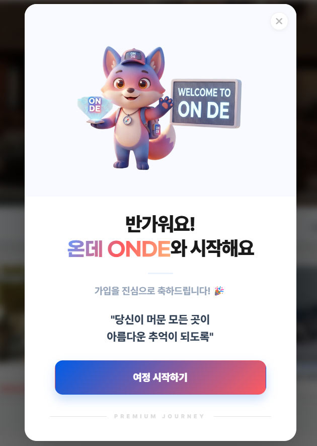
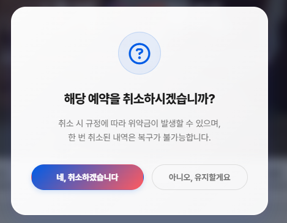
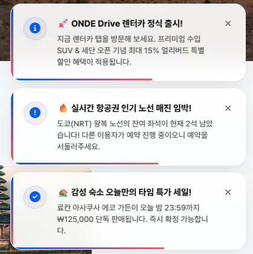
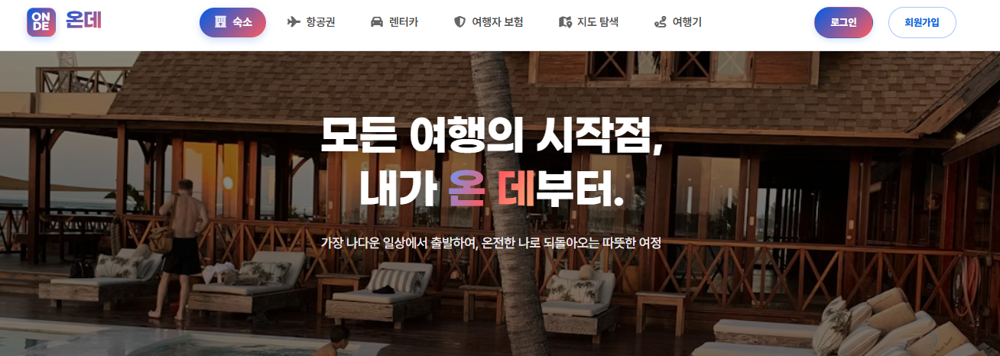
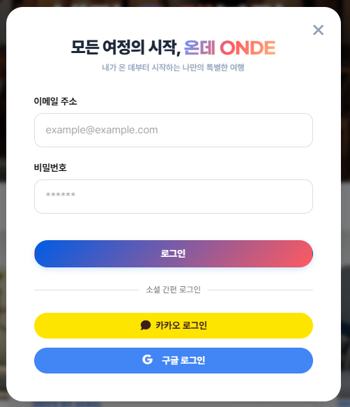
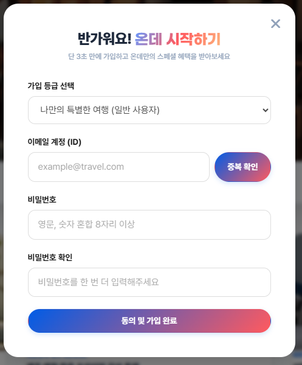
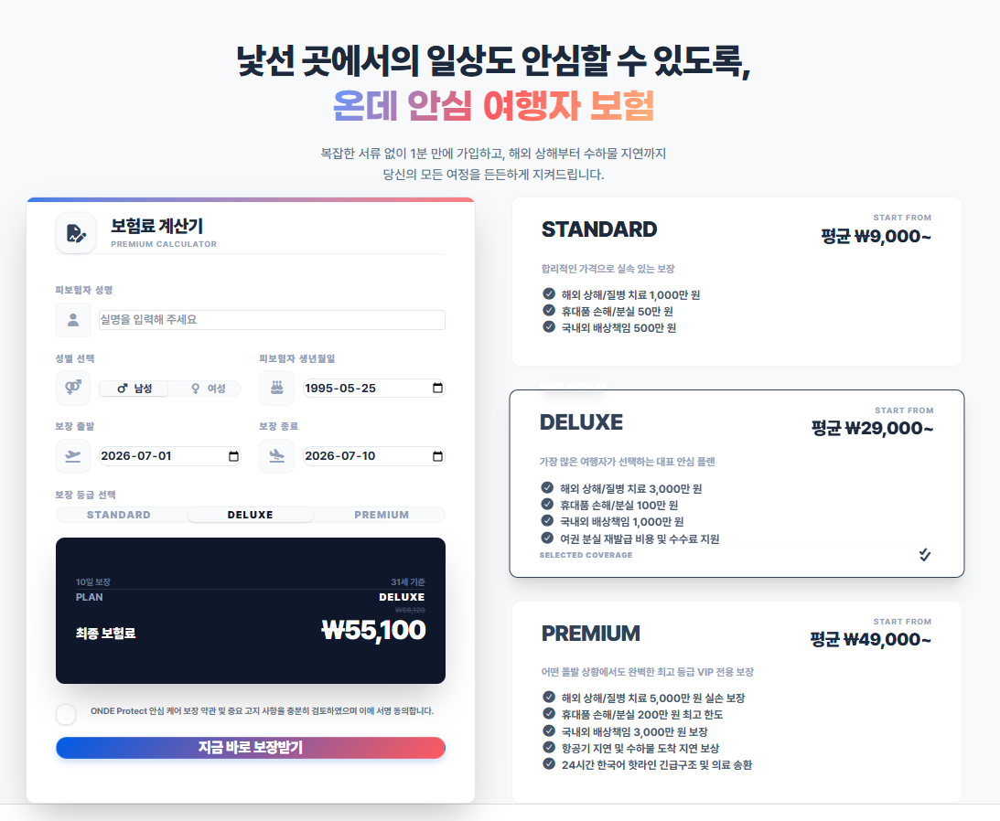
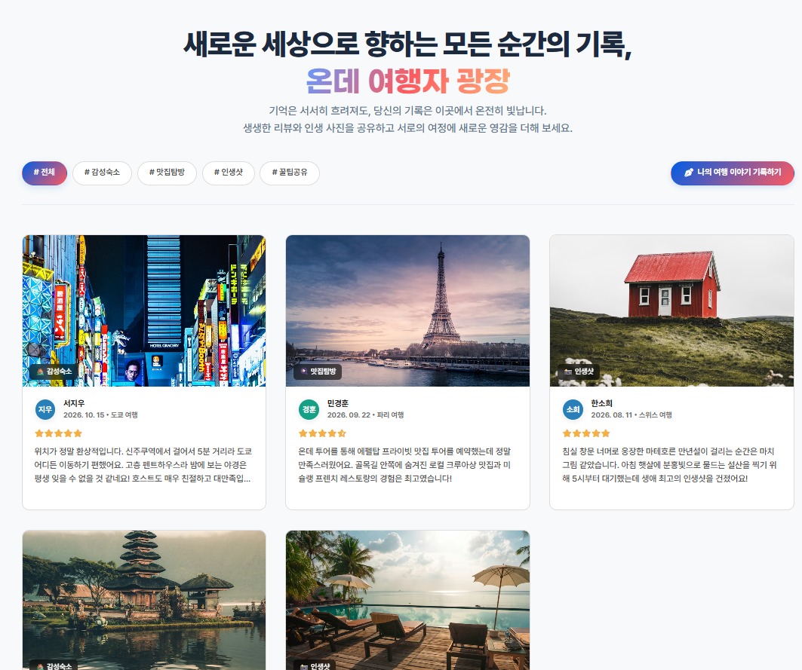
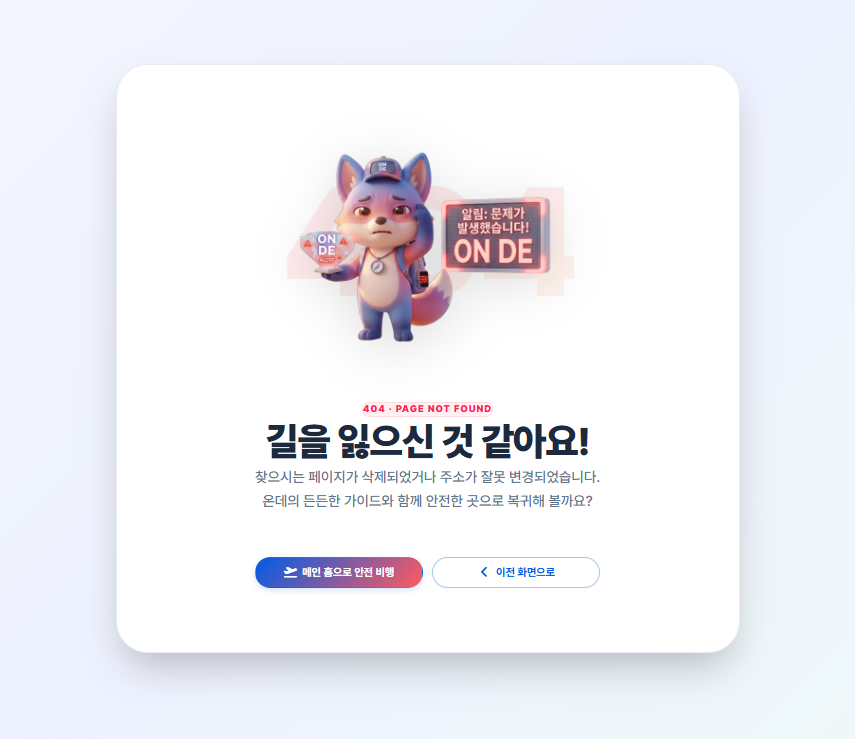

---

# 서론

> **"개발 속도를 높이기 위해 팀의 작업 방식을 바꿨습니다. 인프라를 준비한 뒤 각자 강점이 있는 분야에 집중해 개발을 시작했습니다."**
>
> 인프라 설계 산출물을 마무리하고, 풀스택 ownership에서 **프론트/백엔드 전문화**로 전환했습니다. 저는 프론트엔드에 집중해 인증·웰컴 팝업·도메인 UI·커스텀 인터랙션·에러 페이지를 구현했습니다. 상세 코드는 양이 많아, 이후 취약점 진단 단계에서 함께 소개할 예정입니다.

# 1. 인프라 트랙: 안정적인 서비스를 위한 핵심 설계 완료

프로젝트에 필요한 인프라 설계 문서 작성을 마무리했습니다. 덕분에 개발팀은 배포 환경을 준비하면서 기능 구현도 진행할 수 있게 됐습니다.

- **CI/CD 파이프라인 구축 완료:** GitHub Actions를 활용하여 코드 push 시 자동으로 빌드 및 환경별 배포 스크립트가 실행되는 자동화 파이프라인을 구축했습니다.
- **인프라 아키텍처 정의서 작성:** 전체 시스템의 논리적/물리적 구조를 적은 문서를 작성해 팀 내 기술 규격을 맞췄습니다.
- **인프라 구성도 및 토폴로지 설계:** 전체 자원 배치를 한눈에 볼 수 있는 구성도와 네트워크 토폴로지를 정리했습니다.
- **클라우드 자원 활용 및 비용 계획:** AWS 비용 산출 및 효율적인 자원 활용 계획서를 작성하여 프로젝트의 운영 지속성을 확보했습니다.
- **애자일 기반 프로젝트 계획서:** 실제 업무 흐름에 맞춘 프로젝트 관리 규칙을 정리했습니다.

# 2. 개발 전략의 전환: 풀스택에서 프론트/백엔드 전문화로

개발 초기에는 기능별 ownership을 위해 각자가 담당 도메인의 풀스택을 담당하기로 했으나, **더 빠른 개발 속도와 완성도 높은 UI/UX를 위해 전략을 수정**했습니다.

- **전환 이유:** 각자의 강점에 집중해 개발 병목을 줄이고, 프론트엔드의 디자인 일관성과 백엔드 로직 처리에 집중하기 위해서입니다.
- **새로운 역할 분담:** 저는 다시 **프론트엔드(Front-end) 개발**을 집중적으로 맡게 되었습니다. UI 컴포넌트 재사용성을 높이고 사용자 경험을 개선하는 데 집중하고 있습니다.

# 3. 오늘의 프론트엔드 주요 개발 성과

오늘 저는 서비스의 첫인상을 좌우하는 기본 UI 구조와 주요 기능 페이지들을 구현했습니다.

## 인증 시스템 핵심 기능 (Login & Signup)

로그인과 회원가입은 단순한 폼 입력을 넘어, 사용자 편의성과 보안을 최우선으로 설계했습니다.

| 구분 | 핵심 기능 | 상세 구현 내용 및 상태 |
| --- | --- | --- |
| **공통** | **로그인 편의성** | 키보드 `Enter` 키를 이용한 즉시 폼 제출 지원 |
| | **로딩 상태 처리** | 처리 중 스피너 표시 및 중복 클릭 방지 |
| | **포커스 최적화** | 모달 오픈/탭 전환 시 첫 번째 입력창 자동 포커스 (`autoFocus`) |
| | **폼 유효성 검사** | 필수 항목 미입력 시 가이드 토스트 알림 송출 |
| | **상태 초기화** | 창 닫기/`Esc` 입력 시 데이터 리셋 (`Unmount` 처리) |
| **로그인** | **검증 로직** | 이메일 정규식(Regex) 체크 및 계정 정보 대조 (Mock) |
| | **인증 관리** | 로그인 성공 시 **인증 토큰(Token)의 쿠키(Cookie) 저장** 및 관리 |
| **회원가입** | **보안 및 검증** | 비밀번호(8~20자) 제한 및 확인 일치 검증 |
| | **중복 확인** | 이메일 중복 확인 필수화 및 수정 시 체크 상태 초기화 |

## 웰컴 팝업 (Welcome Popup)

웰컴 팝업은 전역 상태 관리(**Zustand**)와 결합하여 **원자적 상태 변경(Atomic State Action)** 패턴으로 제어됩니다.

<figure class="article-figure-center">
  
</figure>

- **상태 제어의 중앙화:** 팝업의 노출 여부는 오직 전역 스토어의 `isWelcomePopupOpen` 상태 하나에 의해서만 결정됩니다.
- **메모리 최적화:** `if (!isWelcomePopupOpen) return null;` 조건을 통해 팝업이 닫힌 상태에서는 DOM에서 완전히 언마운트되도록 설계했습니다.
- **가입 프로세스와의 연동 (Atomic Action):** 회원가입 완료 시 `signupSuccess`라는 단일 액션을 실행합니다. 로그인 처리, 토스트 알림 송출 후 **자연스러운 전환을 위해 0.45초 지연(delay)** 후 웰컴 팝업을 띄우는 디테일을 추가했습니다.

## 비즈니스 도메인 및 반응형 UI

데스크탑부터 모바일까지 대응하는 레이아웃을 적용했습니다.

- **React Router 연동:** 전체적인 서비스 이동 흐름을 정의하고 각 도메인별 라우트를 체계적으로 추가했습니다.
- **헤더(Header) 반응형:** 데스크탑, 태블릿, 모바일 환경에 최적화된 네비게이션 UI 구축
- **메인 페이지:** 서비스의 얼굴이자 핵심인 '숙소' 정보를 한눈에 볼 수 있는 구성
- **여행자 보험:** 스탠다드, 디럭스, 프리미엄 등 등급별/성별/나이/날짜에 따른 **실시간 보험료 미리보기**, 서명 동의 로직 및 로그인 여부 검증 기능 포함
- **여행기(Community):** 다양한 필터링 기능 및 작성 폼 유효성 검사, 비어 있는 경우의 Empty State 화면 처리, 이미지 로드 실패 시 에러 이미지 대체 로직 적용

## 사용자 인터랙션 개선 (Custom UI)

브라우저 기본 UI 대신 서비스 디자인에 맞는 UI를 적용했습니다.

- **브라우저 기본 팝업 대체:** `alert`, `confirm` 대신 서비스 디자인 시스템에 맞춘 **커스텀 컨펌 창**을 구현했습니다.
- **토스트(Toast) 메시지:** 사용자 행동에 바로 반응을 보여 주는 토스트 알림 시스템을 넣어 더 자연스러운 UX를 제공합니다.

  <figure class="article-figure-row__item">
    
  </figure>
  <figure class="article-figure-row__item">
    
  </figure>

## 에러 핸들링 및 예외 처리

오류가 나도 사용자가 다음 행동을 알 수 있도록 에러 페이지를 만들었습니다.

- **404 (Not Found):** 존재하지 않는 페이지 접근 시 안내
- **500 (Internal Server Error):** 서버 내부 오류 시 대응
- **503 (Service Unavailable):** 일시적인 서비스 점검/불능 상태 안내
- 모든 에러 페이지는 서비스의 전체 톤앤매너와 어울리는 디자인으로 통합 구현되었습니다.

## 핵심 화면 스크린샷

**메인 레이아웃**

**로그인 / 회원가입 UI**

  <figure class="article-figure-row__item">
    
  </figure>
  <figure class="article-figure-row__item">
    
  </figure>

**여행자 보험 화면**

<figure class="article-figure-center article-figure-center--wide">
  
</figure>

**여행기**

<figure class="article-figure-center article-figure-center--wide">
  
</figure>

**에러 페이지**

<figure class="article-figure-center">
  
</figure>

# 4. 전체 개발 현황 및 동료들의 성과

팀원들 역시 각자의 파트에서 핵심 로직들을 성공적으로 구현해 나가고 있습니다.

- **인증/보안:** 회원 엔티티 및 DB 스키마 셋업, JWT 기반 로그인/회원가입 로직 및 Redis Refresh Token 인프라 구축 완료
- **핵심 로직:** 결제 검증, 환불/원복 로직 구현 및 정산 대금 집계 배치 처리 로직 구현
- **서비스 도메인:** 숙소/렌터카 예약 시스템, 실시간 재고/요금 제어 모니터링 API 및 지도 기반 검색/마커 관리 기능 구현
- **공통/인프라:** 시큐리티 권한 제어, 메일 전송 및 PDF 영수증 빌더 구현

# 5. 다음 단계: 개별 기능 보완 및 통합 준비

인프라 설계와 화면 뼈대는 올라온 상태이니, 앞으로는 도메인 CRUD를 채우면서 FE–BE를 붙이는 쪽으로 속도를 냅니다.

- **프론트엔드:** 남은 서브 도메인 UI 보완, 로그인·예약·결제 흐름을 실제 API 응답에 맞춰 연동 테스트
- **백엔드:** 도메인별 CRUD·검증 로직 완성, 트랜잭션·권한 경계가 깨지지 않는지 점검
- **통합:** 로컬에서 프론트–백엔드 E2E 스모크(회원가입→검색→예약) 후 중간 점검 회의
- **인프라:** VPC·배포 초안과 로컬 설정을 맞춰, 이후 스테이징 올리기 전에 막히는 지점 미리 정리
