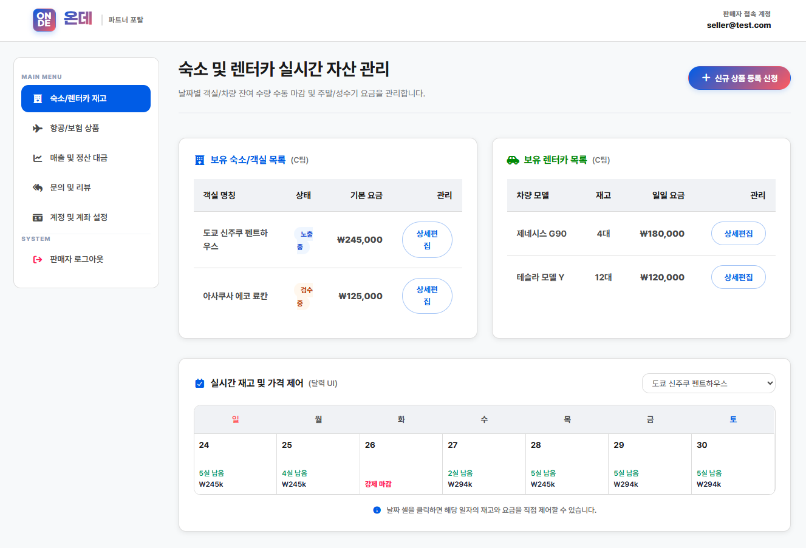
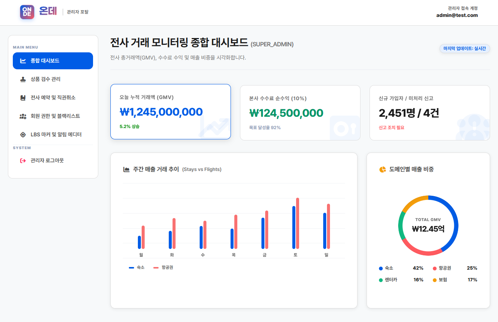
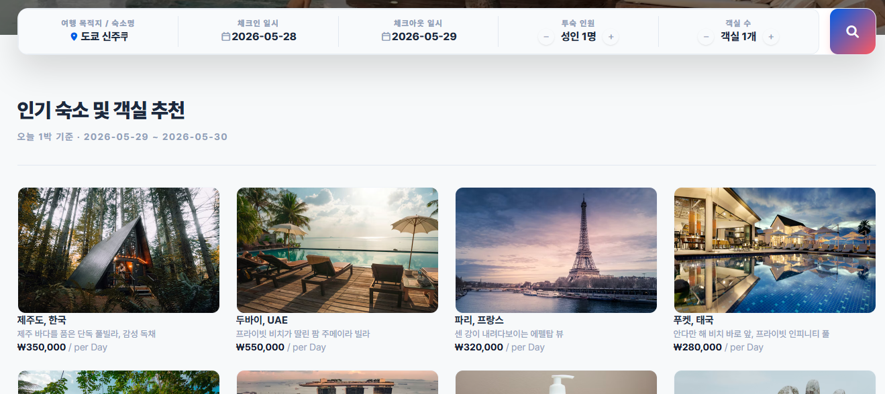
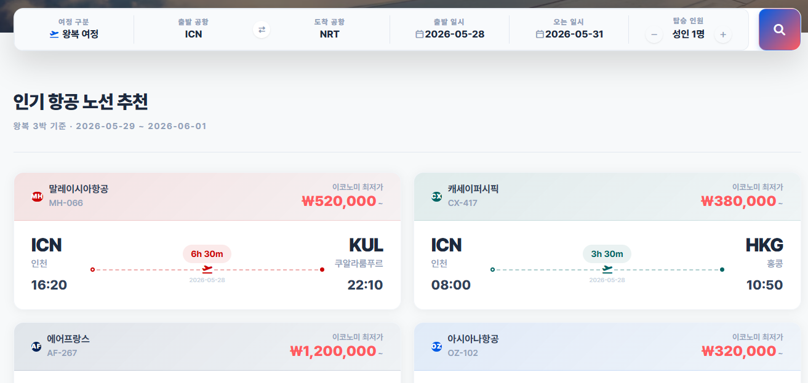
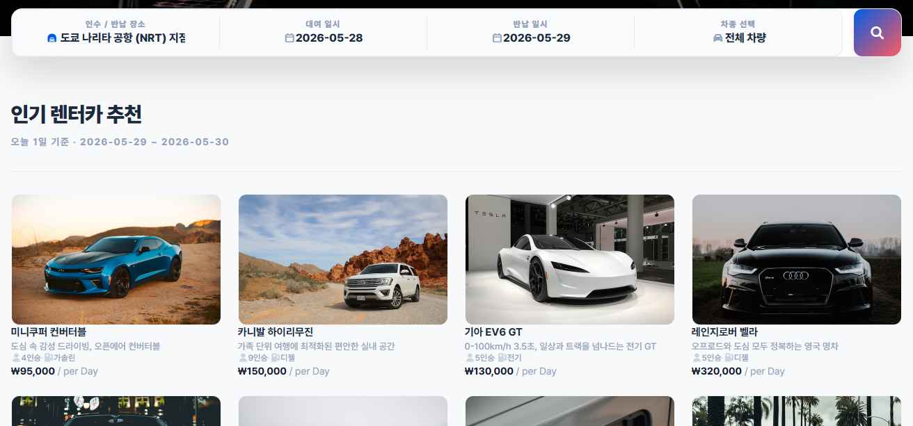
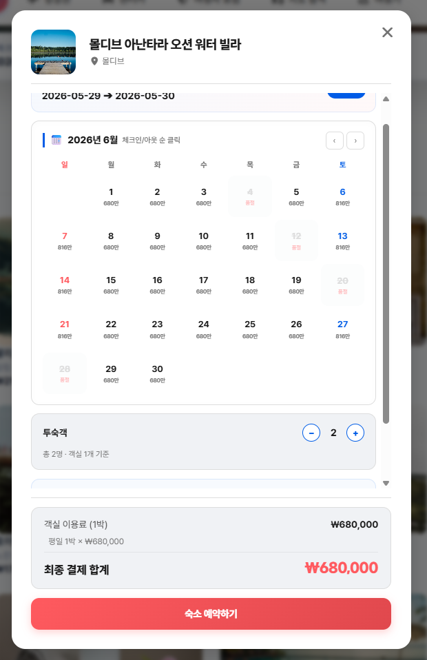
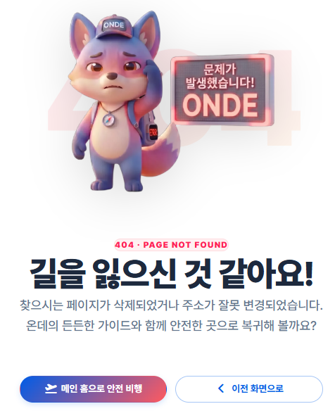
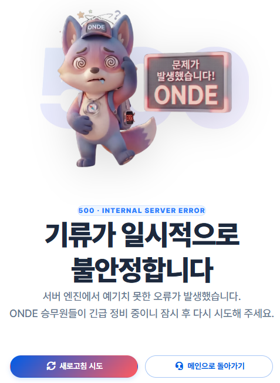
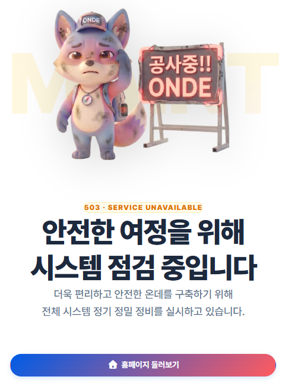
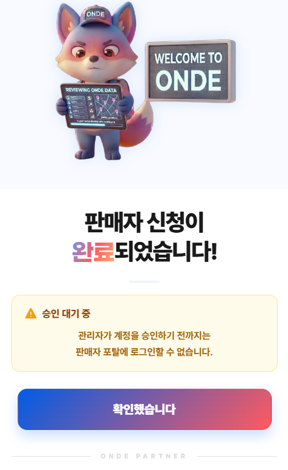

---

# 서론

> **"HTML 프로토타입으로 존재하던 가상의 화면들을 컴포넌트 기반의 React 아키텍처로 완벽히 이식했습니다. 백오피스 관리 체계부터 3대 상품(숙소·항공·렌터카)의 통합 예약 파이프라인까지 구축하며, '온데(onde)'의 유기적인 서비스 흐름을 견고하게 완성했습니다."**
>
> 오늘은 관리자·판매자 백오피스, 숙소·항공·렌터카 상품 흐름과 통합 예약 모달, 인증·에러·온보딩 UI를 React로 옮기고, 백엔드·인프라 쪽 통합 현황도 함께 정리했습니다.

# 1. 프론트엔드 집중 개발의 결실

지난 6일차에 팀의 개발 속도를 높이기 위해 풀스택 구조에서 **프론트/백엔드 전문화**로 전략을 전환했습니다. 이에 따라 7일차에는 기존 HTML 프로토타입에 머물러 있던 UI 요소들을 컴포넌트 기반의 **React 아키텍처로 완전히 전환**하는 스프린트를 진행했습니다.

이번 작업은 크게 세 축을 중심으로 전개되었습니다.

- **관리자·판매자 백오피스** (공통 쉘 → 권한별 관리 패널)
- **숙소·항공·렌터카 상품 흐름** (검색 → 추천 → 상세 예약 모달)
- **공통 UI·인증·에러 페이지** (로그인/회원가입 → 온보딩 → 에러 핸들링)

# 2. 관리자 · 판매자 백오피스(Back-Office) 아키텍처 수립

관리자와 판매자가 시스템을 효율적으로 제어할 수 있도록 공통 쉘(Shell) 구조인 `BackOfficeLayout.tsx`를 설계하고, 권한별로 명확히 분리된 대시보드 패널을 구현했습니다.

## 공통 백오피스 레이아웃 (`BackOfficeLayout.tsx`)

- 관리자와 판매자 공통 백오피스의 틀이 되는 shell 구조를 설계했습니다.
- 접속 계정 정보가 화면에 명확히 출력되도록 UI를 수정하여 관리 가시성을 높였습니다.

## 권한별 관리 패널 분할 구성

효율적인 데이터 관리와 가독성을 위해 각 관리 영역을 독립된 서브 패널 컴포넌트로 세분화했습니다.

| 대상 | 패널 명칭 | 주요 역할 및 기능 |
| --- | --- | --- |
| **관리자** (`AdminPage`) | `AdminDashboardPanel` | 대시보드 요약 정보 및 통계 지표 출력 |
| | `AdminHQPanel` | 판매자 가입 및 상품 정보에 대한 검수·승인 기능 개편 |
| | `AdminUserPanel` | 전사 가입 회원 관리 및 제어 |
| | `AdminLBSPanel` | 위치 기반 서비스(LBS) 관련 관리 기능 제공 |
| **판매자** (`SellerPage`) | `SellerStayCarPanel` | 숙소 및 렌터카 상품의 직접적인 등록 및 관리 |
| | `SellerStatPanel` | 일별/월별 매출 통계 및 실적 시각화 |
| | `SellerQAPanel` | 사용자 문의 내역 확인 및 답변 관리 기능 |
| | `SellerAccountPanel` | 정산 계좌 연동 및 판매자 개인 계정 정보 관리 |
| | `SellerSchedulePanel` | 항공 스케줄 관리 및 리팩터링 작업 수행 |

  <figure class="article-figure-row__item">
    
  </figure>
  <figure class="article-figure-row__item">
    
  </figure>

# 3. 숙소 · 항공 · 렌터카 3대 상품 흐름 및 통합 예약 모달 구축

사용자가 상품을 탐색하고 예약하기까지의 사용자 경험(UX) 패턴을 하나로 통일하고, 비즈니스 로직 검증 기능이 포함된 **상세 예약 모달**을 고도화했습니다.

## 공통 UX 탐색 패턴 표준화

- **검색 전/후 상태 분리:** 검색 전에는 랜덤 추천 리스트와 디폴트 날짜를 보여주고, 사용자가 검색 버튼을 명확히 클릭했을 때만 필터와 날짜 조건이 반영되도록 제어했습니다.
- **통합 서치폼 디자인:** 숙소, 항공권, 렌터카의 서치폼 레이아웃과 디자인 스타일을 하나로 통일하여 시인성을 향상했습니다.
- **구분선 추가:** 모바일과 태블릿 환경의 UI를 개선하기 위해 항목 간 데스크탑과 동일한 톤의 구분선을 추가했습니다.
- **레이지 로딩 적용:** `IntersectionObserver`를 활용하여 대량의 상품 카드가 화면에 순차적으로 등장하도록 구현했습니다.
- **검색 피드백 최적화:** 검색 시 `"실시간 [숙소/항공/렌터카]를 조회 중입니다..."`라는 토스트 메시지를 출력하고, 상품 카드를 클릭하면 불필요한 토스트 없이 즉시 상세 예약 모달로 진입하게 설계했습니다.

<figure class="article-figure-center article-figure-center--wide">
  
</figure>

<figure class="article-figure-center article-figure-center--wide">
  
</figure>

<figure class="article-figure-center article-figure-center--wide">
  
</figure>

## 상품별 기본 데이터 및 날짜 정책 설정

- **숙소:** 별점과 좋아요 요소를 제거하고 가격을 `per Day` 기준으로 표기했으며, 인원수 라벨을 「투숙객」으로 변경하고 디폴트 값을 1명으로 수정했습니다. 디폴트 날짜는 오늘부터 내일까지의 1박 기준입니다.
- **항공권:** 항공사 고유의 폰트와 여백, 악센트 컬러를 반영하여 노선 카드 UI를 개선했고 수하물 옵션을 제거했습니다. 편도/왕복 조건은 검색 시 고정되어 모달 내에서 변경할 수 없으며, 디폴트 날짜는 오늘부터 3일 후 귀국하는 왕복 기준입니다.
- **렌터카:** 카드 타입 뱃지와 완전 자차 보험 토글을 제거하여 화면을 정돈했습니다. 디폴트 날짜는 오늘부터 내일까지의 1일 기준입니다.

## 캘린더 가용성 검사 유틸리티 (`calendarUtils.ts`) 구축

- 로컬 타임존 기반의 날짜 연산 함수(`todayStr`, `addDaysStr`)를 작성하고 월별 캘린더 그리드 생성 로직을 설계했습니다.
- 구간 선택 시 주말 할증 요금을 계산하고, 매진되거나 예약이 마감된 날짜는 자동으로 선택할 수 없도록 비활성화(`disabled`) 처리했습니다. 매진 구간을 선택하려 하면 경고 토스트 메시지와 함께 선택이 리셋됩니다.

<figure class="article-figure-center">
  
</figure>

## 공통 마일리지 적용 패널 (`MileageUsagePanel`) 구현

- 숙소, 항공, 렌터카 모달에 공통으로 적용되는 마일리지 직접 입력 창을 구현했습니다.
- `±1,000P` 단위 조정 및 전액 사용 버튼을 지원하며, 입력 상한선은 사용자가 보유한 마일리지와 결제 금액 중 최솟값(`min`)으로 자동 제약되도록 설계했습니다.

## 비로그인 예약 방어 로직

- 로그인하지 않은 상태에서 상세 예약 모달의 CTA 버튼(「숙소 예약하기」, 「항공권 예약하기」, 「차량 예약하기」)을 클릭하면 경고 토스트 알림을 띄운 뒤 모달을 자동으로 닫고 로그인 모달을 호출하도록 연동했습니다.

# 4. UI/UX 디테일 및 예외 처리 고도화

## 표준화된 에러 핸들링 페이지 (`ErrorPage.tsx`) 분기

- HTTP 상태 코드별 오류 상황에 유연하게 대응하기 위해 `404.png`, `500.png`, `503.png`로 이미지를 분리 지정했습니다.
- `ErrorPage.tsx`에서 상태 코드에 맞춰 알맞은 에러 일러스트 이미지가 다이내믹하게 매핑되도록 예외 처리를 강화했습니다.

  <figure class="article-figure-row__item">
    
  </figure>
  <figure class="article-figure-row__item">
    
  </figure>
  <figure class="article-figure-row__item">
    
  </figure>

## 온보딩 애니메이션 속도 최적화

- 회원가입 완료 후 자연스럽게 등장하는 웰컴 팝업(Welcome Popup)의 트랜지션 애니메이션 노출 속도를 **0.2초**로 세밀하게 조정하여 컴포넌트의 반응 속도를 최적화했습니다.

# 5. 인증 · 회원가입 및 UI/UX 디테일 고도화

보안 계층의 출발점이자 백오피스 권한 인가의 기초가 되는 **인증 및 온보딩 파이프라인**을 촘촘하게 정돈했습니다.

## 회원가입 폼 문구 및 가이드 최적화

- 사용자 편의성을 높이기 위해 로그인 및 회원가입 폼 진입 시 노출되는 기본 설명(`default`) 문구를 직관적이고 친절하게 수정했습니다.

## 판매자 회원가입 로직 및 승인 대기 파이프라인 구축

- **정보 전달 팝업 구현:** 판매자 회원가입 팝업을 통해 입력된 가입 신청 데이터가 백엔드로 유연하게 안전 전송되도록 로직을 다졌습니다.
- **승인 대기 모달(`SellerPendingModal.tsx`) 추가:** 판매자가 가입을 완료하면 무조건 서비스에 진입하는 것이 아니라, 관리자의 최종 승인이 떨어지기 전까지 진입을 제한하고 안내하는 **판매자 승인 대기 전용 팝업**을 구축했습니다. 이 모달은 향후 관리자 페이지의 검수 패널(`AdminHQPanel`)과 유기적으로 연동되어 권한 제어의 한 축을 담당하게 됩니다.

<figure class="article-figure-center">
  
</figure>

# 6. 동료들의 개발 성과 및 백엔드 통합 현황

프론트엔드가 폭발적인 속도로 화면 UI 및 클라이언트 비즈니스 로직을 구축하는 동안, 백엔드와 인프라 파트에서도 결합을 위한 인프라 구축이 체계적으로 전개되었습니다.

- **백엔드 트랙:** 현재 서브 도메인 B, D, E에 대한 백엔드 코드 통합이 완료되었고, 보안 및 공통 에러 표준(Error Envelope)을 적용하며 도메인 A 코드를 병합하는 작업을 진행하고 있습니다. 또한 항공권, 숙소, 렌터카의 외부 웹 스크래핑 데이터 수집 및 정제 작업이 완료되었습니다.
- **인프라 트랙:** 인프라 구조 수정과 함께 VMware 로컬 설정 파일 작성을 완료했고, 코드 푸시 시 자동으로 동작하는 빌드 및 배포 자동화 CI/CD 파이프라인 작성을 수행했습니다.

# 7. Next Step: 연동 테스트 및 취약점 진단 페이즈 준비

기초적인 UI/UX 프레임워크와 개별 모달 컴포넌트 구현이 마무리되었으므로, 다음 단계부터는 시스템 결합과 취약점 진단이라는 프로젝트 본연의 목표에 집중합니다.

- **API 실연동 및 데이터 바인딩:** Placeholder로 설계된 `stayApi`, `carApi`, `flightApi`, `sellerApi` 레이어에 백엔드 실제 엔드포인트를 동시 연동
- **추가 도메인 구현 및 연동:** 준비 중인 지도 서비스(`MapPage`)의 연동 및 예약 완료 데이터를 마이페이지 내역에 동적으로 반영
- **통합 연동 테스트:** 로컬 및 배포 서버 환경에서 프론트엔드와 백엔드를 연동하여 세부 동작 및 데이터 무결성 검증
- **실무 취약점 진단 시나리오 가동:** 웹 서비스 연동 완료 후 SK쉴더스 실무 가이드라인을 따라 SQL 인젝션, 가격/파라미터 변조 등 다각도의 수동 취약점 진단 및 모의해킹 수행 준비
