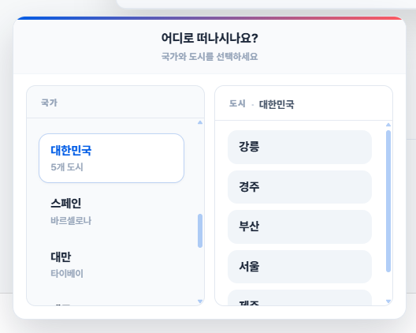
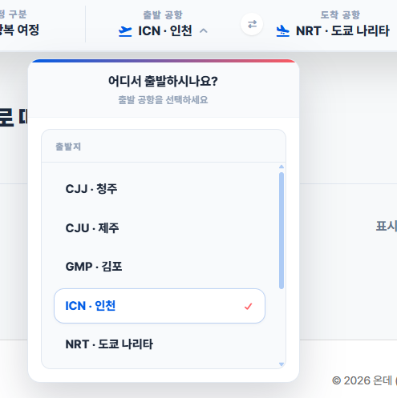
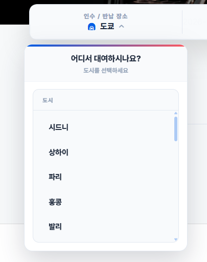
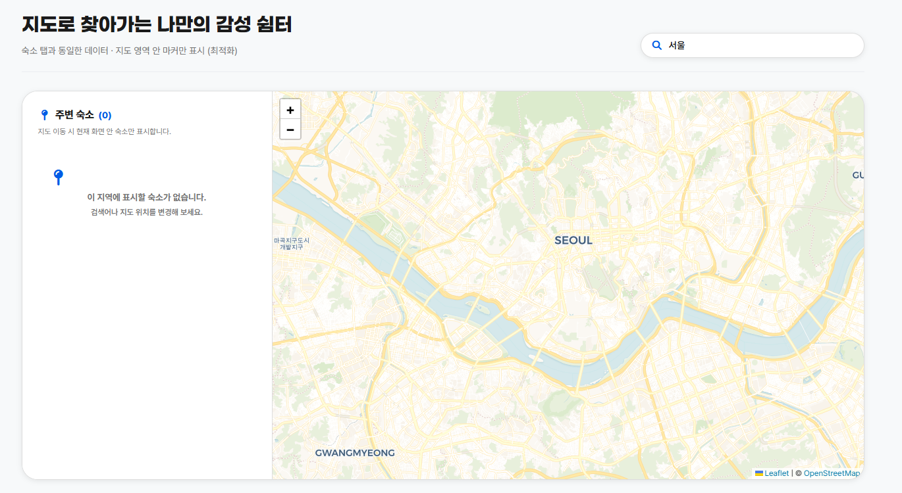

---

# 서론

> **"정적이었던 가상의 데이터를 과감히 걷어내고, 백엔드 실제 운영 서버와의 연동을 위한 대대적인 리팩터링을 단행했습니다. Leaflet 지도 엔진을 프론트엔드에 완전히 안착시켰으며, 팀 전체적으로는 백엔드 전 서브 도메인의 결합과 AWS 보안 인프라 구축을 완료하며 실전 취약점 진단 전 마지막 통합 고지에 도달했습니다."**
>
> 오늘은 프론트 Mock 아키텍처를 걷어내고 실서버 연동 체계로 전환했으며, 피커 기반 검색 UX·Leaflet 지도·마이페이지 고도화를 진행했습니다. 팀 단위로는 백엔드 전 모듈 병합과 AWS 보안 인프라 가동까지 마쳤습니다.

# 1. Mock 데이터 전면 제거와 백엔드 통합 체계 전환

프로젝트의 개발 속도를 높이기 위해 프론트/백엔드 전문화 전략으로 전환한 지 이틀 만에, 프론트엔드 레이어의 준비가 끝나 기존에 프론트엔드의 독립적인 UI 테스트를 받쳐주던 **목업 아키텍처**(`src/mock/*`)를 전면 걷어내고 백엔드 실서버 연동을 위한 **대규모 리팩터링(83개 파일 수정 및 병합)**을 수행했습니다.

이 과정에서 유저 및 셀러 클라이언트 포트를 `8080`(`VITE_USER_API_BASE`)으로 단일 인스턴스화하고, 본사 어드민 포트를 `8081`(`VITE_ADMIN_API_BASE`)로 명확히 이원화하여 분리 정렬하는 등 실제 서비스 배포 토폴로지에 맞춘 환경 변수(`env`) 체계 개편까지 무사히 완료했습니다.

# 2. 오늘의 프론트엔드 핵심 개발 성과

오늘 저는 사용자 경험(UX)의 구조화, 외부 PG 연동, 공간 데이터 시각화, 마이페이지 고도화라는 네 가지 축의 핵심 기능을 집중 구현했습니다.

## 구조화된 피커(Picker) 기반 검색 UX 구현

투박한 텍스트 입력 방식을 배제하고 데이터 무결성을 보장하는 구조화된 드롭다운 피커 시스템을 도입했습니다.

- **숙소 도메인:** `StayDestinationPicker.tsx` 및 국가/도시 상수(`travelDestinations.ts`)를 신설하여 셀렉트 박스 기반으로 유연하게 목적지를 결정할 수 있도록 전환했습니다.
- **렌터카 도메인:** 공통 컴포넌트인 `SearchListPicker.tsx`를 설계하여 픽업 지역 및 차종 선택 로직에 다각도로 재사용했습니다.
- **항공 도메인:** 전 세계 공항 코드 및 주요 항공사 데이터를 상수화하여 출발지/도착지 공항 선택 컴포넌트에 완벽 매핑했습니다.

  <figure class="article-figure-row__item">
    
  </figure>
  <figure class="article-figure-row__item">
    
  </figure>
  <figure class="article-figure-row__item">
    
  </figure>

## Leaflet 기반 실시간 지도 탐색 레이어 이식

하드코딩 메시지로 대체되어 있던 지도 탐색 페이지(`MapPage.tsx`)에 오픈소스 지도 라이브러리인 Leaflet 엔진을 올렸습니다.

- `react-leaflet` 의존성을 기반으로 뷰포트 내 좌표 범위(Bounds) API(`properties` API)를 연동했습니다.
- 지도 화면 내 영역에 맞춰 숙소 위치 마커가 동적으로 로드되고, 사이드 리스트와 실시간 인터랙션하는 구조를 설계했습니다.
- **모바일 UI 최적화:** 태블릿 및 모바일 환경에서 지도가 잘리거나 레이아웃이 깨지는 문제를 해결하기 위해 미디어 쿼리를 전면 수정하고 좌우 여백 패딩을 깔끔하게 통일했습니다.

<figure class="article-figure-center article-figure-center--wide">
  
</figure>

## 마이페이지 고도화 및 추천 섹션 감성 카피 반영

- `MyPageDashboard.tsx` 컴포넌트의 레이아웃을 대폭 개편하고 예약 내역 및 마일리지 조회 데이터 연동을 위한 CSS 스타일(~489줄)을 추가 정돈했습니다.
- 플랫폼 '온데(onde)'가 추구하는 여행의 감성을 극대화하기 위해 추천 리스트 섹션 헤더에 매력적인 마케팅 카피 체계를 정립했습니다.
- **숙소 탭:** "잠들기 좋은 밤만 골랐어요"
- **항공 탭:** "구름 위로 떠나볼까요"
- **렌터카 탭:** "운전석이 비어 있어요"

# 3. 팀 협업 마일스톤: 백엔드 전 모듈 통합 및 AWS 보안 인프라 가동

## 백엔드 트랙: 5대 도메인 소스 완전 병합 완료

분산되어 있던 풀스택 도메인 백엔드 코드를 **시큐리티 권한 제어 필터**와 **공통 에러 표준(Error Envelope)** 기준으로 하나로 묶어, 아래 5개 축의 병합을 완료했습니다.

- **인증·회원·본사 보안:** 공통 로그인/회원가입·JWT/세션 인프라와 일반·판매자·관리자 등급 체계를 결합했습니다. 카카오 OAuth2 소셜 로그인 및 필수 이메일 추가 수집을 연동했고, 본사 쪽 Role별 회원 조회·규정 위반자 블랙리스트 차단·강제 로그아웃/탈퇴 로직을 심도 있게 빌드했습니다.
- **항공·여행자 보험:** 노선 스케줄·좌석 재고·보험료 산출 등 Core 1 도메인 API를 공통 보안·에러 규격에 맞춰 병합했습니다.
- **숙소·렌터카:** 날짜 기반 객실/차량 재고·예약 파이프라인 등 Core 2 도메인 API를 동일 규격으로 통합했습니다.
- **정산·리워드·통계:** 결제·마일리지·정산 흐름을 병합했고, 판매자 정산 계좌 관리와 국세청 사업자 진위 확인 API 실연동을 완료했습니다.
- **LBS·커뮤니티·알림:** 지도/위치 기반 조회, 커뮤니티·파일 업로드, 알림·메일/영수증 템플릿 쪽 인프라 API를 공통 레이어에 합류시켰습니다.

## 인프라 트랙: AWS 클라우드 토폴로지 구축 및 보안 가동

- **네트워크 자원 프로비저닝:** 전체 시스템을 호스팅할 AWS VPC, 가설 RDS, 가상 서브넷 구조 설계를 마쳤으며 라우팅 제어를 위한 ALB(Application Load Balancer) 및 세션 캐싱용 Redis 인프라 구축을 완수했습니다.
- **서버 자원 공식 개설:** EC2 리눅스 인스턴스 공식 프로비저닝을 마쳤으며, 윈도우 서버 환경 세부 사양 동기화를 검증하고 있습니다.
- **데이터 및 감시 보안 세팅:** AWS S3 버킷 리소스를 개설함과 동시에, 향후 보안 감사 및 모니터링 취약점 분석의 핵심 지표가 될 **CloudTrail 및 KMS(Key Management Service) 암호화 연동 체계**를 전격 가동했습니다.

# 4. 기능 영역별 최종 상태 점검

| 영역 | 기능 컴포넌트 / API 단락 | 개발 및 연동 상태 | 비고 |
| --- | --- | --- | --- |
| **고객 포탈** | 숙소 / 렌터카 / 항공 서치폼 피커 구조화 | **완료** | `StayDestinationPicker`, `SearchListPicker` 구현 완료 |
| | 통합 상세 예약 모달 ↔ 결제 플로우 연결 | **완료** | `PaymentPage`, PortOne SDK 실결제 연동 완료 |
| | Leaflet 기반 지도 뷰포트 마커 탐색 | **완료** | 모바일/태블릿 반응형 패딩 개선 완료 |
| | 마이페이지 대시보드 UI 및 스타일 전면 개편 | **완료** | `MyPageDashboard.tsx` 리팩터링 완료 |
| **백오피스** | 본사 어드민 규정 위반 블랙리스트 강제 로그아웃 | **완료** | 도메인 A 보안 필터 테스트 완수 |
| | 판매자 정산 계좌 국세청 사업자 진위 확인 API | **완료** | 판매자 회원가입 및 승인 대기 팝업 연동 |
| **인프라** | GitHub Actions 기반 자동화 CI/CD 파이프라인 | **완료** | 코드 Push 시 가동 확인 (프로덕션 빌드 성공) |
| | AWS S3 / CloudTrail / KMS 보안 아키텍처 | **완료** | 가상 머신(VMware) 로컬 설정 파일 이식 완료 |

# 5. Next Step: 완벽한 통합 테스트(Local Lock-in) 및 실전 진단 로드맵

팀의 공통 목표인 **"오는 6월 1일(월)까지 개별 로컬 개발 환경을 완전 빌드하고 API 실시간 엔드포인트를 매핑하는 것"**을 달성하기 위해 다음 스프린트로 직진합니다.

- **데이터베이스 최종 마이그레이션:** 데이터 트랙에서 수집 및 정제 완료한 외부 숙소·항공·렌터카 스크래핑 매물 합본 데이터를 통합 데이터베이스에 최종 병합 적재 예정
- **헬스체크 프로브 구현:** 전사 시스템의 안정적인 마이크로서비스 구동 상황을 상시 모니터링하기 위한 서비스 헬스체크 API(`api/health`) 구현
- **Local Lock-in 완료 및 교차 검증:** 개인 노트북 환경 내 가상 머신(VMware) 인프라 세팅 및 설정 이식을 끝마치고, 백엔드-프론트엔드 간 실시간 통신 데이터 무결성 최종 점검
- **실전 컴플라이언스 취약점 스캔 착수 예비 단계:** 다가오는 6월 8일 본격적인 모의해킹 및 취약점 진단 페이즈에 앞서 인프런(Infrun) 실무 실습 환경 매핑 및 스캔 툴 사전 검증 세팅 준비
