---

# 서론

**SK쉴더스 루키즈 5기**에서 미니 프로젝트를 마친 뒤 이어진 **최종 프로젝트**입니다. 주제는 **클라우드 구축을 통한 취약점 진단 및 모의해킹**이었습니다.

최종은 **하나의 주제** 아래 두 산출물로 나뉩니다. ONDE는 진단할 **대상**, ARGUS는 그 대상을 검사하는 **플랫폼**입니다.

<table class="article-ref-table">
  <thead>
    <tr>
      <th scope="col">산출물</th>
      <th scope="col">역할</th>
      <th scope="col">글</th>
    </tr>
  </thead>
  <tbody>
    <tr>
      <th scope="row">ONDE</th>
      <td>바이브 코딩으로 올린 여행 플랫폼 · 진단 실증 대상</td>
      <td><a href="https://hyeonseok93.github.io/posts/rookies-showcase-final1/">ONDE 글 보기</a></td>
    </tr>
    <tr>
      <th scope="row">ARGUS</th>
      <td>웹·API 취약점 진단 플랫폼 · 증적·결과서</td>
      <td><a href="https://hyeonseok93.github.io/posts/rookies-showcase-final2/">ARGUS 글 보기</a></td>
    </tr>
  </tbody>
</table>

바이브 코딩은 서비스를 빨리 올리지만, 잘 돌아간다고 해서 취약점이 없는 것은 아닙니다. 그래서 **바이브 코딩으로 만든 코드에 어떤 취약점이 생기는지 검증할 대상**이 필요했고, 숙소 · 항공 · 렌터카 · 보험까지 이어지는 여행 플랫폼을 직접 올려 그 실증 대상으로 삼았습니다. **ONDE(온데)** 는 그 여행 예약 서비스입니다.

React(Vite) 프론트와 Spring Boot REST API가 나뉘어 있고, MariaDB · Redis · JWT · Flyway를 중심으로 회원 · 예약 · 재고 · 결제 · 셀러/어드민을 다룹니다. 로컬 파일은 MinIO, 운영은 S3에 두고, 배포는 AWS · Terraform · GitHub Actions 위에 올렸습니다.

📦 **GitHub:** [SK-Rookies5-FINAL_ONDE](https://github.com/Hyeonseok93/SK-Rookies5-FINAL_ONDE)  
🌐 **배포:** `onde.click` — 최종 제출 이후 인프라를 내려 **현재는 접속되지 않습니다**

# 1. 메인 화면

<figure class="article-figure-center article-figure-center--wide">
  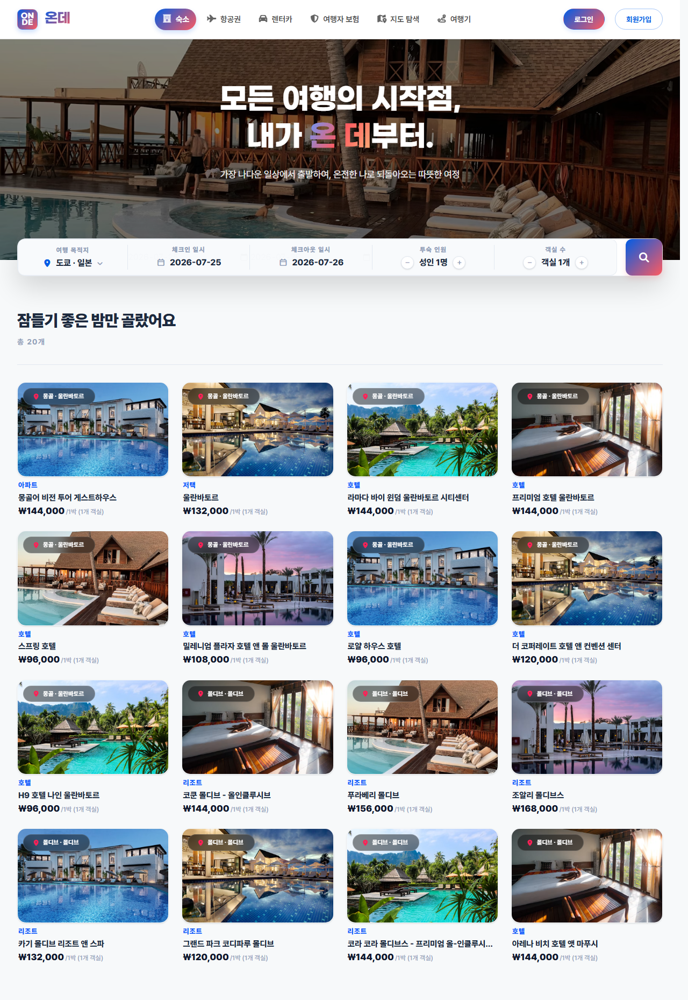
</figure>

# 2. 왜 만들었나

### 바이브 코딩의 속도와 착각

바이브 코딩은 자연어로 요구만 던지면 돌아가는 코드를 빨리 만들어 줍니다. 다만 **컴파일이 되고 화면이 열린다**고 해서 안전한 것은 아닙니다. AI가 짜 준 코드일수록 “잘 돌아가니 괜찮다”는 **보안 착시**에 빠지기 쉽고, 취약점은 배포 뒤에야 드러나는 경우가 많습니다.

### 진단할 실증 대상이 필요했다

최종 주제는 **클라우드 구축을 통한 취약점 진단 및 모의해킹**이었습니다. 진단 도구만 만들면 빈 이론이 되기 쉬워서, **실제로 예약을 돌릴 수 있는 여행 플랫폼**을 먼저 바이브 코딩으로 올려 두기로 했습니다. 숙소 · 항공 · 렌터카 · 보험 · 결제 · 셀러/어드민까지 한 서비스로 묶은 이유가, 진단할 API·화면을 충분히 갖춘 **타깃**이 필요했기 때문입니다.

### ONDE와 ARGUS의 역할 분담

ONDE는 취약점이 생길 수 있는 **대상**이고, ARGUS는 그 대상을 검사하는 **진단 플랫폼**입니다. 사람이 수동으로 패킷을 바꿔 보는 진단과, 플랫폼으로 돌린 자동 진단을 같은 대상 위에서 비교할 수 있게 하려는 구성이었습니다. 그래서 ONDE는 “예쁜 데모”보다 **실제 흐름이 도는 서비스**로 올리는 데 무게를 뒀습니다.

# 3. 서비스 흐름

ONDE의 핵심 흐름은 숙소를 찾는 데서 끝나지 않습니다. **검색 → 예약·여행자 보험 → 결제 → 운영 콘솔**으로 이어지며, 여행자 화면과 셀러·어드민 화면이 같은 서비스 위에서 만납니다.

<figure class="article-figure-center article-figure-center--full">
  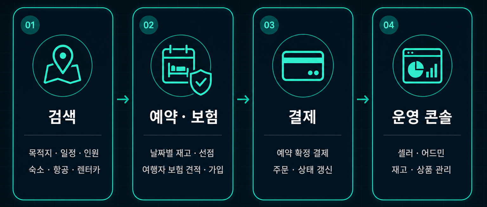
</figure>

### 1. 사용자가 여행 상품을 검색한다

목적지 · 일정 · 인원을 정해 숙소 · 항공 · 렌터카를 검색합니다. 목록과 상세에서 상품·요금·일정을 확인하고, 지도 · 여행기 같은 탐색 화면으로도 이어질 수 있습니다.

### 2. 예약과 여행자 보험을 이어 간다

숙소·렌터카는 날짜별 재고·가격을, 항공은 좌석 등급을 기준으로 예약을 잡습니다. 결제 전에는 자리를 잠시 잡아 두고, 같은 여행 흐름에서 여행자 보험 견적·가입도 이어 갈 수 있게 두었습니다.

### 3. 결제로 예약을 확정한다

예약이 잡히면 결제 화면으로 이어집니다. 결제가 끝나면 주문·예약 상태가 확정되고, 이후 마이페이지에서 내역을 확인할 수 있습니다.

### 4. 셀러·어드민이 운영 콘솔을 쓴다

판매자·관리자는 백오피스에서 상품·재고·예약을 다룹니다. 여행자용 화면과 같은 백엔드 위에서 돌아가, 진단 대상으로 쓸 API·화면이 충분히 생기도록 구성했습니다.

이 과정에서 React 화면은 Spring Boot REST API를 호출하고, 회원·예약·결제·정산 정보는 MariaDB에 저장됩니다. 이미지는 로컬 MinIO · 운영 S3에 두고, Flyway로 스키마를 맞춥니다.

# 4. 도메인 · ERD

핵심은 **회원이 숙소·렌터카·항공을 잡고, 같은 흐름에서 보험·결제까지 이어지는** 구조입니다. 관계·상태·설계 이유는 아래에 정리합니다.

<figure class="article-figure-center article-figure-center--full">
  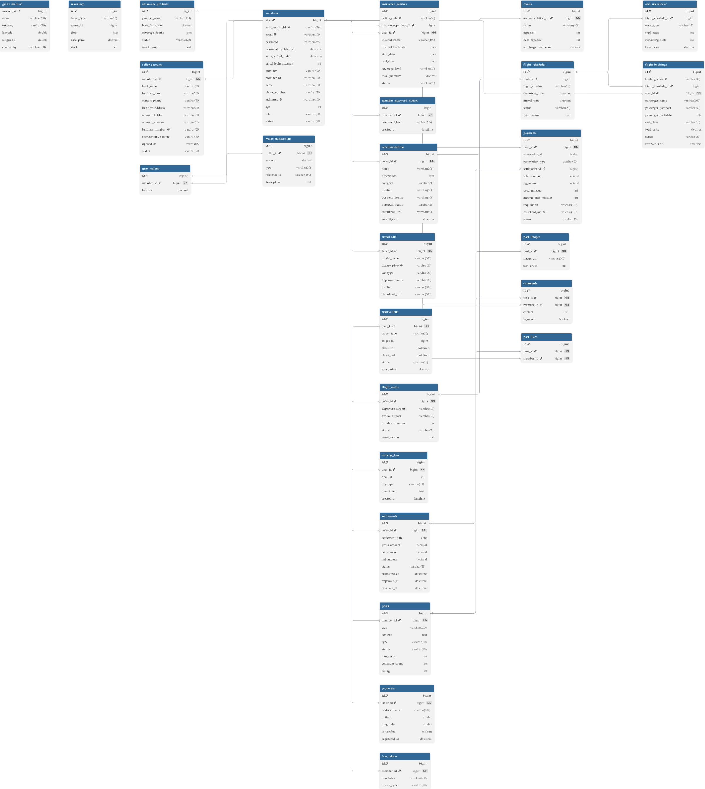
</figure>

### 핵심 엔티티

| 엔티티 | 테이블 | 역할 |
|--------|--------|------|
| **Member** | `members` | 여행자 회원. 이메일 unique, JWT `auth_subject_id`, 로그인 잠금·비밀번호 정책 |
| **SellerAccount** | `seller_accounts` | 판매자 계정. Member와 1:1에 가깝게 연결 |
| **Accommodation / Room** | `accommodations` / `rooms` | 숙소·객실. 승인 상태(`PENDING` 등), 판매자 소속 |
| **RentalCar** | `rental_cars` | 렌터카. 판매자 소속, 승인 상태 |
| **Inventory** | `inventory` | 날짜별 재고·가격. `target_type` + `target_id`로 숙소/렌터카를 가리킴 |
| **Reservation** | `reservations` | 숙소·렌터카 예약. 동일하게 `target_type` + `target_id` |
| **FlightRoute / Schedule** | `flight_routes` / `flight_schedules` | 노선·스케줄 |
| **SeatInventory / FlightBooking** | `seat_inventories` / `flight_bookings` | 좌석 재고·항공 예약 |
| **InsuranceProduct / Policy** | `insurance_products` / `insurance_policies` | 보험 상품·가입 건 |
| **Payment** | `payments` | 결제. 예약·항공 예약과 이어지며 `PENDING` → `PAID` 등 |
| **Settlement** | `settlements` | 판매자 정산. 매출·수수료·순액 |
| **Post / Comment** | `posts` / `comments` | 여행기·댓글. 피드·지도(`properties`)와 함께 탐색 영역을 담당 |

숙소·렌터카 예약은 타입별 테이블을 늘리지 않고 **`target_type` + `target_id`** 로 묶었습니다. 항공은 좌석·스케줄 제약이 달라 `flight_bookings`를 따로 둡니다. 이미지는 DB에 바이너리를 두지 않고 URL·키만 둡니다.

### 관계와 상태 전이

1. 회원이 숙소·렌터카를 고르면 `inventory`로 날짜·재고·가격을 보고, `reservations`를 남깁니다. 초기 상태는 대략 **`RESERVED`** 계열입니다.
2. 항공은 `flight_schedules` · `seat_inventories` 위에서 `flight_bookings`를 잡습니다. 결제 전 좌석을 잠시 잡아 두는 흐름이 있습니다.
3. 같은 여행 흐름에서 `insurance_policies`로 여행자 보험을 이어 갈 수 있습니다.
4. `payments`가 **`PENDING` → `PAID`** 로 확정되면, 연결된 예약·항공 예약이 **`CONFIRMED`** 쪽으로 맞춰집니다. 취소·환불 시에는 `CANCELLED` / `REFUNDED` 와 예약 취소가 같이 움직입니다.
5. 판매자·어드민은 상품 승인 · `settlements` 정산 · 피드·지도 운영을 같은 MariaDB 위에서 다룹니다.

`Reservation`과 `Payment`를 **일부러 나눈** 이유입니다. 예약은 “자리를 잡았는지”의 기록이고, 결제는 PG·마일리지·정산으로 이어지는 **확정 거래**입니다. 한 테이블에 섞으면 결제 전 홀드와 결제 완료 뒤 상태를 구분하기 어렵습니다. **예약 = 자리**, **결제 = 확정**으로 역할을 갈랐습니다.

# 5. 주요 API

프론트가 쓰는 REST는 `/api/v1` 아래에 모았습니다. 아래는 **실제 컨트롤러 매핑** 기준 요약입니다. JWT는 `Authorization: Bearer`를 우선하고, 없으면 `accessToken` 쿠키를 봅니다. 로그인·리프레시는 `accessToken` · `refreshToken` HttpOnly 쿠키로 발급합니다.

### Auth · Member

| Method | Endpoint | 설명 |
|--------|----------|------|
| POST | `/api/v1/auth/signup` | 회원가입 (USER / SELLER) |
| GET | `/api/v1/auth/check-email` | 이메일 중복 확인 |
| GET | `/api/v1/auth/check-nickname` | 닉네임 중복 확인 |
| POST | `/api/v1/auth/login` | 로그인 · 쿠키에 JWT 발급 |
| POST | `/api/v1/auth/logout` | 로그아웃 · 쿠키 삭제 |
| POST | `/api/v1/auth/refresh` | Access Token 재발급 |
| GET | `/api/v1/members/me` | 로그인 회원 기본 정보 |
| GET | `/api/v1/members/me/profile` | 마이페이지 프로필 |
| PATCH | `/api/v1/members/me/profile` | 프로필 수정 |
| GET | `/api/v1/members/me/reservations/rooms` | 내 숙소 예약 |
| GET | `/api/v1/members/me/reservations/cars` | 내 렌터카 예약 |
| GET | `/api/v1/members/me/reservations/flights` | 내 항공 예약 |
| GET | `/api/v1/members/me/insurances` | 내 보험 가입 |
| GET | `/api/v1/members/me/mileage` | 마일리지 잔액 |

### Stay · Car · Reservation

| Method | Endpoint | 설명 |
|--------|----------|------|
| GET | `/api/v1/accommodations/search` | 숙소 검색 (공개) |
| GET | `/api/v1/cars/search` | 렌터카 검색 (공개) |
| GET | `/api/v1/inventory/check` | 재고 가용 여부 (공개) |
| GET | `/api/v1/inventory/calendar` | 재고 캘린더 (공개) |
| POST | `/api/v1/reservations/rooms` | 숙소 예약 생성 |
| POST | `/api/v1/reservations/cars` | 렌터카 예약 생성 |
| DELETE | `/api/v1/reservations/{id}` | 예약 취소 |
| GET | `/api/v1/properties` | LBS 매물·마커 (공개) |

### Flight · Insurance

| Method | Endpoint | 설명 |
|--------|----------|------|
| GET | `/api/v1/flights/search` | 항공편 검색 (공개) |
| POST | `/api/v1/reservations/flights` | 항공 좌석 선점·예약 |
| POST | `/api/v1/reservations/flights/{booking_code}/confirm` | 항공 결제·예약 확정 |
| POST | `/api/v1/insurances/calculate` | 보험료 사전 계산 (공개) |
| POST | `/api/v1/reservations/insurances` | 여행자 보험 가입 |

### Payment · Settlement

| Method | Endpoint | 설명 |
|--------|----------|------|
| POST | `/api/v1/payments/prepare` | 결제 사전 등록·금액 검증 |
| POST | `/api/v1/payments/validate` | 결제 사후 검증·완료 |
| POST | `/api/v1/payments/{paymentId}/cancel` | 결제 취소·환불 |
| GET | `/api/v1/members/me/wallet` | 지갑 잔액 |
| POST | `/api/v1/members/me/wallet/charge` | 지갑 충전 |
| GET | `/api/v1/seller/settlements` | 판매자 정산 목록 |
| POST | `/api/v1/seller/settlements/{settlementId}/request` | 정산 지급 신청 |
| GET | `/api/v1/seller/dashboard` | 판매자 대시보드 |

### Feed · Seller

| Method | Endpoint | 설명 |
|--------|----------|------|
| GET | `/api/v1/posts` | 여행기 목록 (공개) |
| POST | `/api/v1/posts` | 여행기 작성 |
| GET | `/api/v1/posts/{postId}/comments` | 댓글 목록 (공개) |
| POST | `/api/v1/posts/{postId}/comments` | 댓글 작성 |
| POST | `/api/v1/seller/accommodations` | 판매자 숙소 등록 |
| PUT | `/api/v1/seller/inventories/rooms` | 객실 재고·가격 수정 |
| POST | `/api/v1/seller/cars` | 판매자 렌터카 등록 |
| POST | `/api/v1/seller/flights` | 판매자 항공 스케줄 등록 |

검색·재고·게시글 GET 등은 공개이고, `/api/v1/seller/**` 는 `ROLE_SELLER`, 예약·결제·마이페이지는 인증이 필요합니다. 진단 대상으로서 API 표면이 넓도록 여행자·셀러·어드민 경로를 같은 `/api/v1` 아래에 두었습니다.

# 6. 인프라 아키텍처

ONDE는 앱만 올리는 데서 끝내지 않고, **Terraform으로 AWS를 잡고 EC2 · ALB · CI/CD까지** 한 제품으로 묶었습니다. 리전은 **서울(`ap-northeast-2`)** 이고, 도메인은 `onde.click`(여행자) · `rookies.onde.click`(어드민 진입)입니다. 인프라 레포에는 VPC·ALB·EC2·RDS·Redis·S3·ECR과 GitHub Actions 배포 워크플로가 함께 있습니다. 최종 제출 이후 인프라는 내려 **현재는 접속되지 않습니다**.

<figure class="article-figure-center article-figure-center--full">
  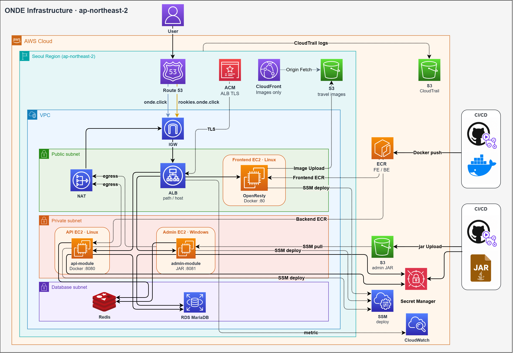
</figure>

### 구성의 축

| 축 | 역할 |
|----|------|
| **Terraform** | VPC, Public·Private·DB 서브넷, IGW, NAT, ALB, EC2, RDS, Redis, S3, ECR |
| **EC2 3티어** | Frontend(Linux·OpenResty Docker), API(Linux·Docker), Admin(Windows·JAR) |
| **Route53 + ACM** | `onde.click` / `rookies.onde.click` DNS · ALB HTTPS |
| **S3 · CloudFront** | travel 이미지 원본 · 이미지 전용 CDN |
| **GitHub Actions + SSM** | 이미지·JAR 배포 · EC2에 SSM으로 pull/deploy |
| **관측** | CloudWatch 메트릭 · CloudTrail 로그(S3) |

미니 3차(MACTA)가 EKS · Argo CD 중심이었다면, 최종 ONDE는 **EC2 + ALB path 라우팅**으로 여행자 프론트·공개 API·Windows 어드민을 한 진입점에 모았습니다.

### Public / Private / Database 분리

**Public subnet**에는 외부 진입점인 **ALB**와, Private 아웃바운드용 **NAT Gateway**, 그리고 **Frontend EC2**(OpenResty Docker `:80`)를 둡니다. **Private subnet**에는 **API EC2**(api-module Docker `:8080`)와 **Admin EC2**(admin-module JAR `:8081`)를 두고, **Database subnet**에는 **RDS MariaDB**와 **Redis**만 둡니다.

외부 사용자는 ALB까지만 닿고, API·Admin·DB는 사설망 안에서만 통신합니다. Private에서 ECR pull · 외부 API 호출이 필요할 때는 **NAT → IGW**로만 나가게 해 공격 표면을 좁혔습니다.

### 요청 라우팅

사용자 요청은 대략 다음 순서입니다.

```text
Browser
  → Route53 (onde.click / rookies.onde.click)
  → IGW
  → Public ALB (ACM HTTPS)
       /*                 → Frontend EC2  → OpenResty :80
       /api/*             → API EC2       → api-module :8080
       /api/v1/admin/*    → Admin EC2     → admin-module :8081
```

같은 ALB에서 화면과 API·어드민을 나누되, 진입점은 하나입니다. `rookies.onde.click` 루트(`/`)는 어드민 로그인 쪽으로 리다이렉트하는 규칙을 두어, 여행자 도메인과 운영 진입을 갈랐습니다.

백엔드가 DB·캐시·스토리지에 붙는 모습은 대략 이렇게입니다.

```text
API EC2 / Admin EC2
  → RDS MariaDB
  → Redis
  → S3 (travel images)  ·  Frontend도 이미지 업로드
  → (egress) NAT → IGW
```

이미지는 **CloudFront(Images only)** 가 S3 travel 버킷을 Origin으로 받아 갑니다. 사이트 전체를 CDN 앞에 두지 않고, **정적 이미지 전송만** CloudFront로 분리했습니다.

### CI/CD — Docker와 JAR를 나눈 이유

프론트·API는 Linux Docker로 올리고, 어드민은 Windows에서 JAR로 띄웁니다. 그래서 배포 파이프라인도 **두 갈래**입니다.

```text
[FE / API]
GitHub Actions
  → Docker build · push → ECR (FE / BE)
  → SSM deploy → Frontend EC2 / API EC2  (ECR pull)

[Admin]
GitHub Actions
  → admin-module.jar Upload → S3 (admin JAR)
  → SSM pull · SSM deploy → Admin EC2
```

한 파이프라인에 억지로 합치지 않은 이유는 OS·패키징이 다르기 때문입니다. Linux 쪽은 이미지 태그로 버전을 맞추고, Windows 쪽은 S3 오브젝트를 SSM으로 받아 교체하는 쪽이 운영에 맞았습니다.

### Secret · 관측

DB 비밀번호·JWT·OAuth 클라이언트 값처럼 민감한 값은 워크플로·인스턴스에 하드코딩하지 않고, **Secrets Manager / GitHub Secrets** 쪽으로 두는 구성을 썼습니다. EC2 역할에는 필요한 시크릿 읽기 권한을 최소로 붙입니다.

운영 관측은 **CloudWatch**(ALB·RDS 등 메트릭)와 **CloudTrail → S3**(감사 로그)로 모았습니다. 배포·장애 추적을 위해 “누가 언제 무엇을 바꿨는지”가 로그에 남도록 했습니다.

### 리소스 요약

| 구분 | 연동 | 역할 |
|------|------|------|
| 네트워크 | VPC / Public·Private·DB Subnet / IGW / NAT | 진입점과 앱·DB 분리 |
| DNS · TLS | Route53 / ACM | `onde.click` · HTTPS |
| 진입 | ALB (path / host) | FE · API · Admin 분기 |
| 컴퓨트 | EC2 × 3 (Linux FE/API · Windows Admin) | OpenResty · api-module · admin-module |
| 데이터 | RDS MariaDB / Redis / S3 | 영속·캐시·이미지·admin JAR |
| CDN | CloudFront | travel 이미지 전용 |
| 배포 | ECR / S3 / GitHub Actions / SSM | Docker push · JAR upload · deploy |
| 관측 | CloudWatch / CloudTrail | 메트릭 · API 감사 로그 |

# 7. 핵심 구현

인프라·라우팅은 **6번**에서 다뤘으므로, 여기서는 앱에서 **왜 그렇게 짰는지**만 깊게 갑니다. 포트폴리오 Why의 세 축에, 선점과 이어지는 **결제 prepare → validate** 를 더해 네 가지로 정리합니다.

### 항공 좌석 임시 선점

같은 편·같은 등급에 예약이 한꺼번에 들어오면 남은 자리가 어긋나기 쉽고, 결제 전에 자리를 잡아 두고 나가 버리면 그 좌석이 계속 막힐 수 있습니다. 그래서 `POST /api/v1/reservations/flights` (`FlightService.bookSeat`)에서는 **한 줄로 줄을 세운 뒤** 재고를 줄이고, 결제가 끝나기 전에는 **잠시 잡아 둔 상태**만 남깁니다.

- **분산 락** — `DistributedLockExecutor`가 Redisson으로 `flight:lock:{scheduleId}:{seatClass}` 키를 잡습니다. wait 5초 · lease 10초. 여러 인스턴스에 요청이 흩어져도 같은 스케줄·등급은 한 번에 하나만 재고를 건드립니다.
- **행 잠금** — 락 안에서 `SeatInventoryRepository.findWithLockByFlightScheduleIdAndClassType`(`PESSIMISTIC_WRITE`)로 좌석 행을 잠근 뒤 `remainingSeats`를 줄입니다.
- **선점** — 예약 상태는 **`PENDING_PAYMENT`**, `reservedUntil`은 약 **10분** 뒤로 둡니다. 자리가 있을 때만 예약을 만듭니다.
- **만료 복구** — `FlightExpiryScheduler`가 **1분마다** `PENDING_PAYMENT`이면서 `reservedUntil`이 지난 건을 찾아 좌석을 되돌리고 상태를 **`CANCELLED_BY_TIMEOUT`** 으로 바꿉니다. 이미 결제까지 끝난(`CONFIRMED`) 예약은 건드리지 않습니다.

오버부킹과 “결제 안 한 채 좌석만 영원히 잡아 두는” 일을 같은 흐름에서 줄이려는 설계입니다.

### 결제 prepare → validate

선점으로 자리를 잡았다면, 다음은 **돈을 확정**하는 단계입니다. 예약 테이블에 결제 필드를 섞지 않고 `Payment`를 따로 둔 이유를, `POST /api/v1/payments/prepare` → `POST /api/v1/payments/validate` 로 구현했습니다.

- **prepare** — 예약 종류(`ROOM` / `CAR` / `FLIGHT` / `INSURANCE`)에 맞는 행을 `findByIdForUpdate`로 잠근 뒤, 마일리지·지갑 잔액을 검증하고 `PaymentStatus.PENDING`을 만듭니다. `merchantUid`는 서버가 발급합니다.
- **validate** — `PaymentRepository.findByMerchantUidForUpdate`로 결제 행을 다시 잠급니다. `PENDING`만 허용하고, 금액·`impUid`를 맞춘 뒤 `WalletService.deduct`로 지갑을 차감하고 결제를 **`PAID`** 로 올립니다.
- **예약 확정** — 같은 트랜잭션에서 `confirmReservation`이 타입별로 상태를 맞춥니다. 숙소·렌터카는 `ReservationStatus.CONFIRMED`, 항공은 `BookingStatus.CONFIRMED`, 보험은 `InsurancePolicyStatus.ACTIVE`.
- **마일리지** — 사용(`USE`)과 결제 금액 기준 적립(`EARN`)을 `MileageLog`로 남깁니다.

프론트의 “결제 완료” 버튼이 곧 DB의 **자리 확정**이 되게, prepare(의도)와 validate(확정)를 나눈 것입니다. 항공은 `PENDING_PAYMENT` 선점이 validate에서 `CONFIRMED`로 이어집니다.

### 숙소·렌터카 날짜별 재고 달력

숙소와 렌터카는 상품은 다르지만, “어느 날에 몇 개·얼마인지”를 달력으로 보여 줘야 한다는 점은 같습니다. API를 상품마다 나누면 구매자 상세용·판매자 조정용 달력 로직이 갈라지기 쉬워, **`target_type` + `target_id` + 날짜** 공통 규칙으로 묶었습니다.

- **공개 API** — `GET /api/v1/inventory/calendar` (`targetType`, `targetId`, `month=YYYY-MM`). `InventoryCalendarService.getMonthCalendar`가 월 단위 칸을 채웁니다.
- **판매자 API** — `GET|PATCH /api/v1/seller/inventory/calendar`. `stay-{id}` / `car-{id}`를 `ROOM` / `CAR`로 풀어 같은 달력 데이터를 봅니다.
- **빈날 = 마감** — DB에 해당 일 row가 없으면 `stock=0`, `price=0`, **`isClosed=true`**. “기록 없음 = 팔 수 있음”이 아니라 **열어 둔 날만 판매**입니다.
- **효과** — 구매자 달력과 판매자 재고 조정이 같은 월 데이터를 봐, 한쪽만 고치면 다른 쪽이 어긋나는 일을 줄입니다. 숙소·차량 마스터 정보는 엔티티를 따로 두면서도 UX 규칙은 공유합니다.

### MinIO 로컬 테스트 · 시드 데이터 프로비저닝

운영에서는 파일을 S3에 올리고 CloudFront URL로 내려줍니다. 로컬에서는 같은 업로드 경로를 **MinIO**에 붙여, 이미지·첨부 흐름을 클라우드 없이도 검증했습니다.

- **저장소 분기** — `AwsS3Service` / `S3Uploader`가 `AWS_S3_ENDPOINT`로 로컬 MinIO(`localhost:9000`, 버킷 `onde-local`)와 운영 S3를 가리킵니다. compose의 `minio` 서비스·`S3_Mock` 볼륨으로 콘솔까지 올립니다.
- **프론트** — `STORAGE_BASE_URL`이 로컬에서는 MinIO 주소를 보고, 목록·상세에 같은 키 체계로 이미지를 붙입니다.
- **시드** — `DB_Seed` CSV와 `load_data.sql`, compose `db-seeder`로 스키마 위에 대량 적재합니다. 긁어 온 원본을 그대로 쓰지 않고, 상품 종류·판매자·회원·날짜별 재고·좌석 구조에 맞게 다듬어 넣습니다.
- **효과** — 로그인·검색·예약·업로드가 **실제로 돌아갈 만큼**의 데이터와 미디어 경로를 로컬에서 먼저 맞춘 뒤, 운영 S3·CloudFront로 옮길 수 있습니다.

이 네 가지는 “예약을 안전하게 잡고 → 결제로 확정하고 → 날짜 재고 UX를 맞추고 → 로컬에서 같은 흐름을 돌린다”는 ONDE 앱의 뼈대입니다.

# 8. 화면으로 보는 기능

검색·예약·결제·피드·셀러/어드민까지, 서비스가 화면에서 어떻게 이어지는지 봅니다. 페이지 순서와 기능 설명은 [Onde Frontend](https://github.com/UR-VULN/Onde_Frontend) README의 **주요 페이지 구성**과 같습니다. (홈·추천 메인은 **1. 메인 화면** `fig1`과 동일합니다.)

### 1. 숙소 예약 페이지 (Stay Page) — `/`

성수기/비성수기·카테고리(호텔·펜션·게스트하우스 등)로 목록을 큐레이션하고, 숙소 소개·객실 정원·요금을 토글해 봅니다. 체크인/아웃을 고르면 성수기 매핑과 숙박 일수로 객실별 합산 요금이 실시간으로 바뀌고, 객실·인원을 정해 결제 단계로 넘깁니다.

<figure class="article-figure-center article-figure-center--wide">
  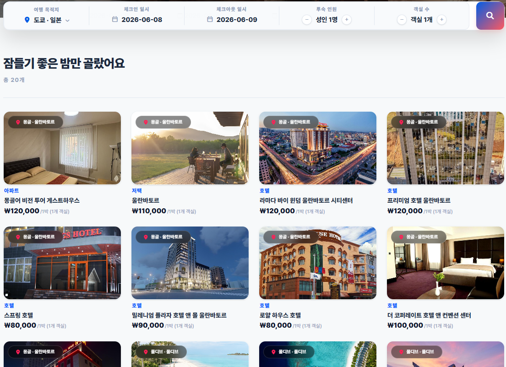
</figure>

### 2. 항공권 예약 페이지 (Flight Page) — `/flight`

출발지/도착지 공항·일자·탑승 인원으로 노선을 필터 조회하고, 편도/왕복을 바꿔 가며 통합 예약 번호로 이어 갑니다.

<figure class="article-figure-center article-figure-center--wide">
  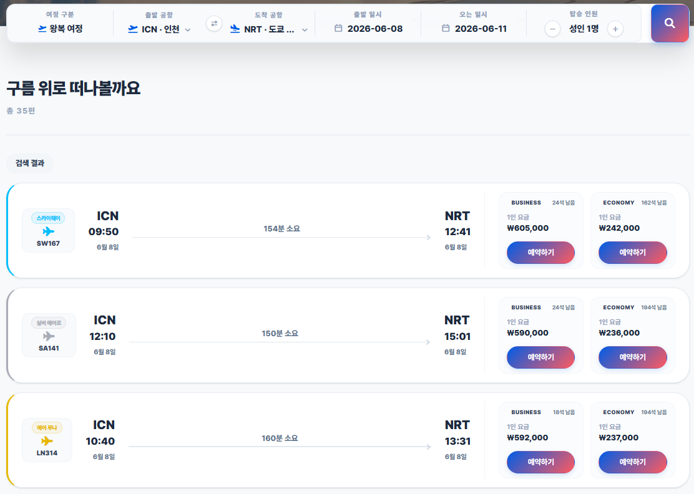
</figure>

### 3. 렌터카 탐색 페이지 (Car Page) — `/car`

경형·소형·준중형·SUV·대형 등 차종 필터와 하루 기본 렌트비 정렬, 연식·유종·인수 위치로 오예약을 줄입니다. 픽업/반납 일시가 정해지면 일 단가 × 이용 기간으로 총액을 동적 표시하고 Hold 예약을 만듭니다.

<figure class="article-figure-center article-figure-center--wide">
  
</figure>

### 4. 여행자 보험 안내 페이지 (Insurance Page) — `/insurance`

여행 일정 중 사고에 대비하는 단기 여행자 보험 상품 소개와 신청 안내를 여행 상품 흐름에 붙여 둡니다.

<figure class="article-figure-center article-figure-center--wide">
  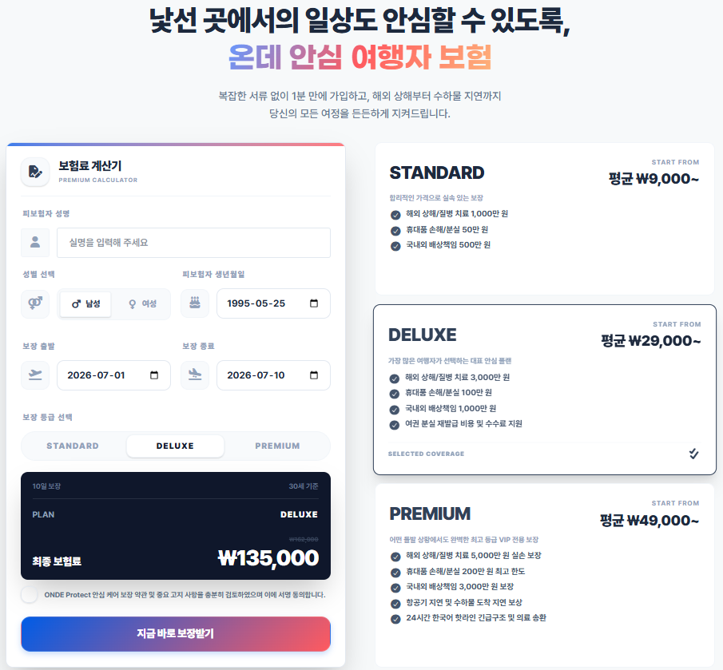
</figure>

### 5. 지도 기반 통합 탐색 페이지 (Map Search Page) — `/map`

Leaflet 마커로 숙소 위치를 올리고, 드래그·확대 시 Bounds와 필터를 맞춥니다. 영역·일정에 걸리는 자산을 찾고 flyTo로 스케일을 맞춘 뒤, 마커 클릭 시 퀵 프리뷰 → 상세로 이어집니다.

<figure class="article-figure-center article-figure-center--wide">
  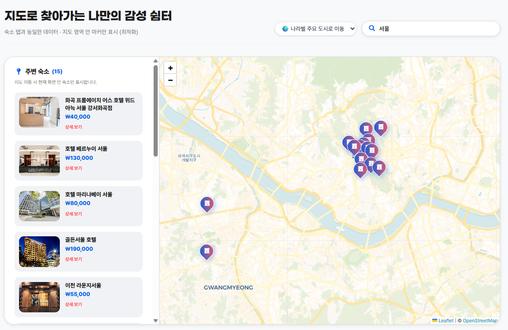
</figure>

### 6. 여행기 (포토 다이어리 & 여행 피드) (Feed Page) — `/feed`

인스타 스타일 카드 타임라인으로 숙박·여행 포토 후기를 보고, MinIO 오브젝트 스토리지와 연동해 드래그앤드롭 이미지 업로드·후기 작성을 지원합니다.

<div class="article-figure-row">
  <figure class="article-figure-row__item">
    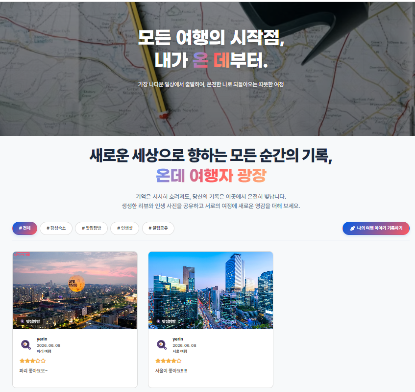
  </figure>
  <figure class="article-figure-row__item">
    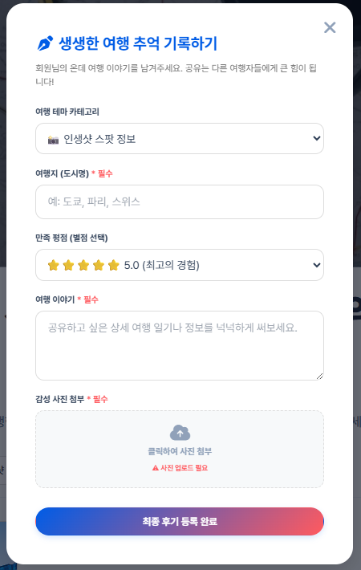
  </figure>
</div>

### 7. 판매자 백오피스 (Seller Page) — `/seller`

판매자 등급 가드 아래에서 객실 크기·침대 타입·기준 인원 등을 폼 배열로 동적 추가해 숙소/객실을 신청하고, 렌터카 모델·요금도 승인 큐에 올립니다.

<figure class="article-figure-center article-figure-center--wide">
  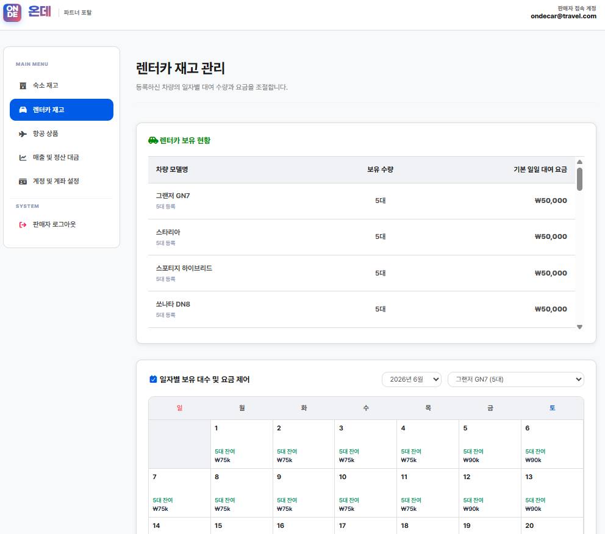
</figure>

### 8. 관리자 대시보드 (Admin Page) — `/admin`

최고 관리자 가드에서 판매자 신규 숙박/렌터카 신청을 검증·승인/반려하고, 누적 예약·일간 결제 등 KPI와 파트너 정산을 봅니다.

<figure class="article-figure-center article-figure-center--wide">
  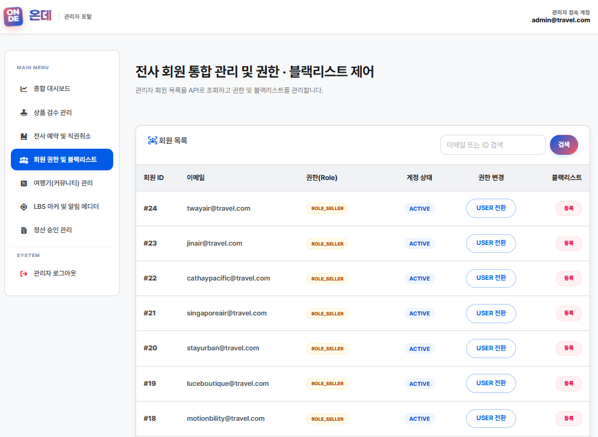
</figure>

### 9. 결제 및 검증 페이지 (Payment & Callback Page) — `/payment`, `/payment/callback`

외주 PG 대신 ONDE 가상 지갑 잔액을 차감하고, 마일리지 입력을 즉시 반영한 뒤 prepare → validate로 지갑 DB 트랜잭션과 맞춰 결제를 확정합니다. (7절 핵심 구현과 동일 흐름입니다.)

<figure class="article-figure-center article-figure-center--wide">
  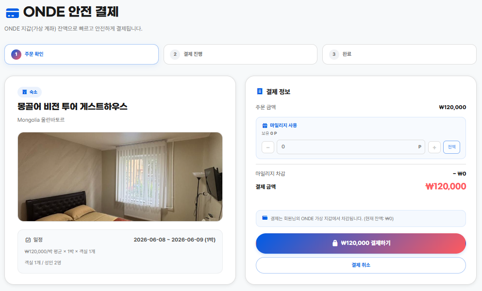
</figure>

### 10. 마이페이지 (My Page) — `/mypage`

항공·숙소·렌터카 예약을 `PENDING` / `CONFIRMED` / `CANCELLED` 상태로 추적하고, 프로필·비밀번호 재설정을 한곳에서 다룹니다.

<figure class="article-figure-center article-figure-center--wide">
  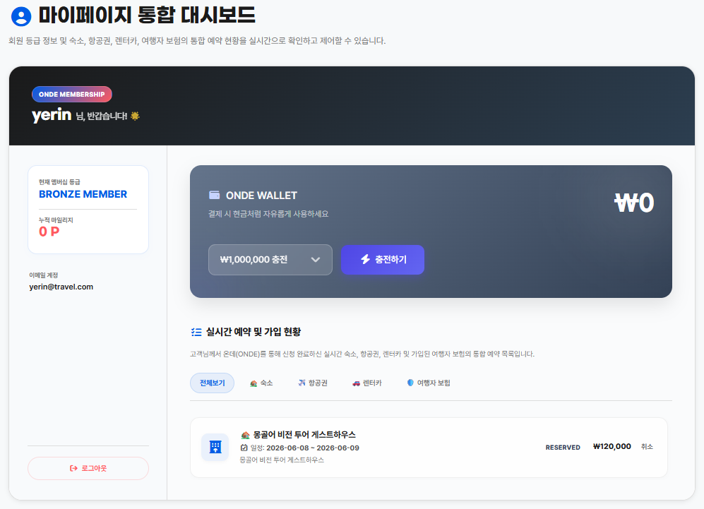
</figure>

### 11. 통합 예외 대응 및 권한 제어 (Error Page) — `/error`

상태 코드별 일러스트·원인 메시지로 홈·이전 화면 복귀를 유도합니다. 스크린샷은 **403 · 404 · 500 · 503**입니다. (README의 401 화면은 별도 캡처가 없어 생략했습니다.)

<div class="article-figure-row article-figure-row--4">
  <figure class="article-figure-row__item">
    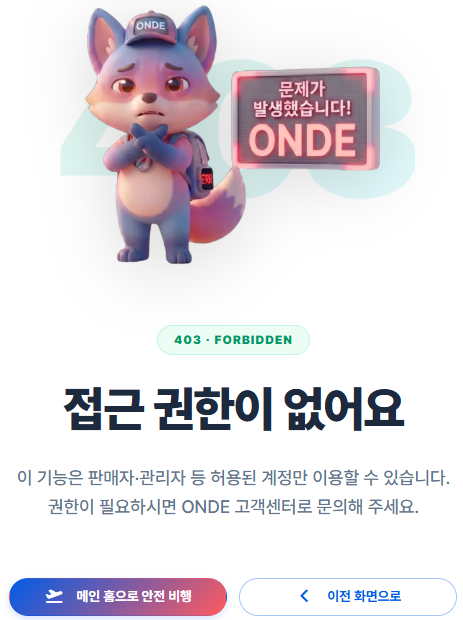
  </figure>
  <figure class="article-figure-row__item">
    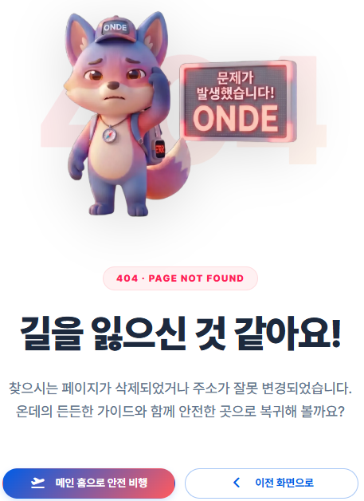
  </figure>
  <figure class="article-figure-row__item">
    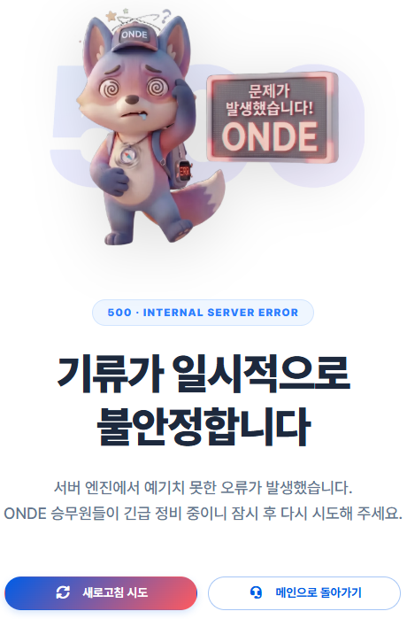
  </figure>
  <figure class="article-figure-row__item">
    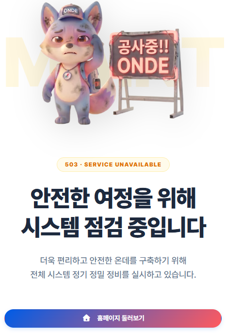
  </figure>
</div>

### 12. 공통 헤더 및 인증 모달 (Header & Auth Modal)

역할(일반·판매자·관리자)에 맞춰 헤더 메뉴·마이페이지가 바뀌고, 글라스모피즘 AuthModal에서 로그인(`LoginForm`)·회원가입(`SignupForm`)을 전환합니다.

<div class="article-figure-row">
  <figure class="article-figure-row__item">
    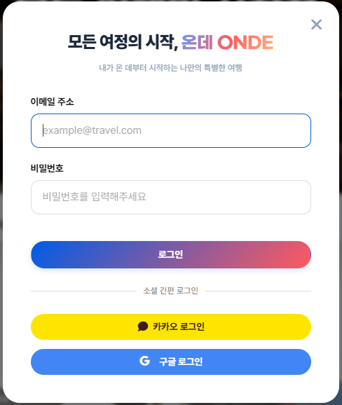
  </figure>
  <figure class="article-figure-row__item">
    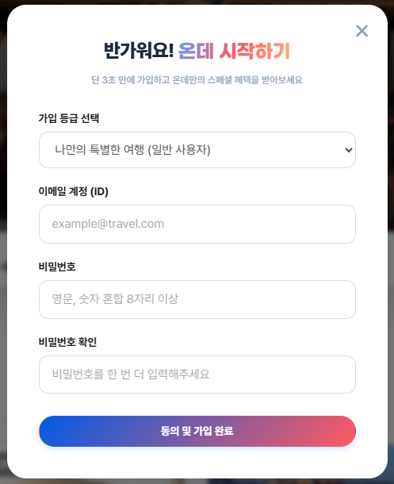
  </figure>
</div>

### 회원가입 웰컴 팝업 (Signup Welcome Popups)

역할에 맞춰 환영 팝업이 갈립니다. 일반(`cust`)은 WelcomeModal, 판매자(`sell`)는 승인 대기(`PENDING`) SellerPendingModal입니다.

<div class="article-figure-row">
  <figure class="article-figure-row__item">
    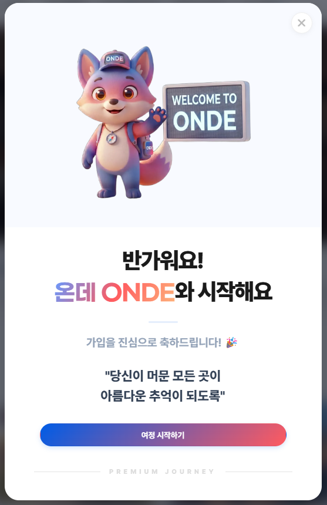
  </figure>
  <figure class="article-figure-row__item">
    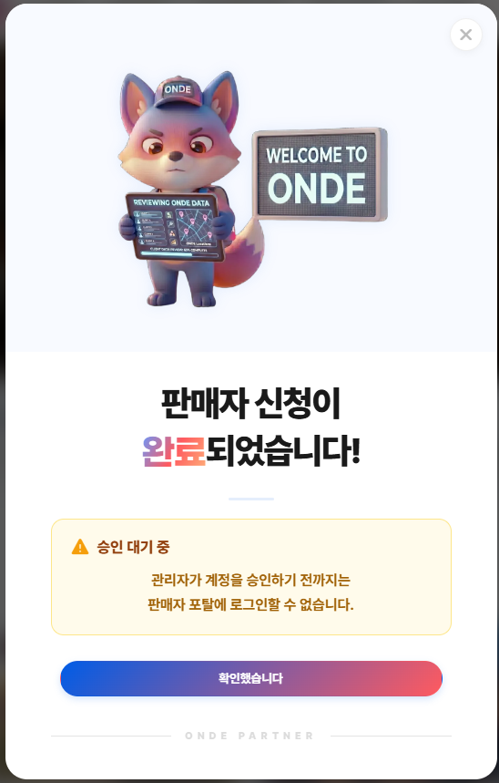
  </figure>
</div>

# 9. 취약점 진단 이후의 이행점검 — 세션·PII·입력 경계를 서버로

최종 기간에는 **진단할 대상 서비스**를 바이브 코딩으로 빨리 올리는 것이 우선이었습니다. 숙소·항공·렌터카·결제·셀러/어드민까지 흐름은 돌았지만, 취약점 진단 뒤에는 Access Token이 JS에 남을 여지, 화면·응답의 PII 평문 노출, FE만 믿은 입력·업로드처럼 데모만으로는 안 보이던 구멍이 드러났습니다.

[UR-VULN](https://github.com/UR-VULN) 조직의 FE/BE `audit/*/hs` 브랜치에 **이행점검**을 반영했습니다. 순서는 **쿠키 세션·JWT subject → PII 마스킹/reveal → 입력·업로드·에러 sanitization → Admin BO·엣지**였고, API 경로와 기존 데이터는 최대한 유지한 채 문제별로 고친 뒤 테스트로 확인했습니다.

## 토큰을 JS에서 빼다

로그인 응답 body에 Access Token이 실리고 FE가 Bearer를 붙이던 경로가 있으면, XSS 한 번에 세션이 그대로 탈취됩니다. 미니3에서 HttpOnly로 맞춘 것과 같은 종류의 부채입니다.

- Access/Refresh를 **HttpOnly 쿠키**로 발급·갱신·폐기하고, axios는 `withCredentials`만 사용합니다. FE 스토어에 raw JWT를 오래 두지 않습니다.
- JWT **subject / `auth_subject_id`** 로 멤버를 바인딩하고, refresh 세션이 없으면 **fail-closed** 합니다. 필터는 Authorization 헤더뿐 아니라 쿠키에서 토큰을 읽습니다.
- 회원가입 시 임의 역할 elevation을 막고, 로그인 실패 잠금·비밀번호 복잡도/재사용 금지·이력까지 서버 정책으로 묶었습니다.

인증은 “화면에서 로그인되면 충분”이 아니라, **브라우저가 읽을 수 없는 쿠키 + 서버가 주체를 다시 검증**하는 쪽으로 고정했습니다.

## PII는 기본 마스킹, 볼 때만 reveal

마이페이지·셀러 대시보드·어드민 회원/정산에는 이메일·전화·계좌가 그대로 실릴 수 있습니다. 목록·상세 응답을 평문으로 두면 화면 캡처·XSS·내부자 조회만으로도 개인정보가 새어 나갑니다.

서버 `PersonalDataMasker`로 응답 DTO를 기본 마스킹하고, FE도 같은 규칙의 마스킹 UI를 둡니다. 평문이 필요할 때만 **비밀번호 재확인(reveal)** 후 잠시 보여 줍니다. 어드민 회원·정산 패널도 동일한 마스킹 + reveal 훅/API로 맞췄습니다.

“일단 다 보여 주고 가린다”가 아니라, **기본은 가리고 인증된 순간에만 연다**는 경계입니다.

## 입력·업로드·에러를 서버에서 막다

피드·숙소 이미지·프로필 필드처럼 사용자 입력이 많은 서비스에서, 검증을 FE에만 두면 패킷만 바꿔도 우회됩니다. 예외 메시지에 스택·SQL이 실리면 진단 대상으로서도, 운영 서비스로서도 정보 노출이 됩니다.

- **입력:** `InputSanitizer` / 엔티티 리스너로 스크립트성 입력을 정화하고, URL은 `SafeUrlValidator`로 오픈리다이렉트·SSRF성 값을 막습니다.
- **업로드:** MIME·매직바이트·확장자·크기를 `ImageUploadValidator`에서 검사합니다.
- **에러:** `ClientSafeErrorMessage`로 클라이언트에는 안전한 문구만 돌립니다.
- **기동·경계:** CORS 화이트리스트, AES/JWT 등 `RequiredSecretValidator`, 진단 샌드박스는 `local` 프로필 + 플래그가 둘 다 있을 때만 엽니다.

프론트는 envelope 파싱과 에러 네비게이션에서 원문 노출을 줄이고, 본체 검증은 백엔드에 둡니다. 어드민 진입 경로 분리·robots 차단, nginx **Server 헤더 마스킹**·TRACE 405도 같은 이행 묶음에서 엣지 표면을 줄였습니다.

진단으로 드러난 **세션·개인정보·입력 표면**을 서버·엣지 경계로 끌어올린 것이 9절의 핵심입니다. 결제 금액 위조·행 락·CSRF처럼 그다음에 손본 항목은 10절에서 이어집니다.

# 10. 미니 이후의 리팩토링 — 결제 서버 신뢰와 운영 fail-closed

이행점검(hs) 이후, 모노레포 `SK-Rookies5-FINAL_ONDE`에서 **추가 코드 감사**를 돌리며 Critical·구조·FE 최적화 구멍을 다시 메웠습니다. 순서는 **결제/항공 서버 신뢰·행 락 → CSRF·Admin denyAll·fallback 게이트 → Controller→Service · FE/엣지**였습니다.

## 결제는 클라이언트가 아니라 서버 금액이다

결제 prepare에 클라이언트가 `totalAmount`를 보내면, 화면 요금과 상관없이 더 싼 금액을 밀어 넣을 수 있습니다. FE에서 `wallet_tx_${Date.now()}` 같은 거래 ID를 만들면 위조·재사용 여지도 생깁니다. 7절에서 말한 prepare → validate가 이 경계를 지키는 쪽입니다.

- prepare 요청 DTO에서 **`totalAmount` 필드를 제거**하고, 서버가 예약/부킹/보험 금액으로 재계산합니다. 소유권·마일리지 잔액·상한을 서버에서 클램프합니다.
- 예약당 **PENDING 결제 1건**만 허용하고, validate·cancel은 Payment 행 `PESSIMISTIC_WRITE` 뒤에 상태 전이합니다. 지갑도 `findByMemberIdForUpdate`로 동시 차감·환불을 직렬화합니다.
- **PENDING cancel은 void만**(환불·마일리지 원복 없음), **PAID만** 지갑 환불. 구매자만 cancel 가능하고, 셀러가 ROOM/CAR 결제로 구매자 지갑을 불릴 수 없게 막았습니다.
- 항공 confirm은 `@LoginMember` 소유권, 서버 `expectedAmount` 일치, PAID 존재 확인 후 CONFIRMED(idempotent)입니다.
- FE는 prepare가 준 `walletTxId`만 쓰고, stay/car/insurance는 서버 `totalPrice`/`totalPremium`을 우선합니다.

“결제 화면이 돌아가면 된다”가 아니라, **금액·거래 ID·환불 권한을 서버가 소유**하게 바꾼 것이 핵심입니다.

## CSRF · Admin denyAll · fallback 게이트 · Controller→Service

쿠키 세션으로 옮긴 뒤에도 CSRF를 꺼 두면, 다른 사이트가 로그인된 브라우저로 상태 변경 요청을 보낼 수 있습니다. 어드민은 permit이 느슨하면 미매핑 경로가 열리고, Redis/S3 mock fallback이 운영에서 켜지면 락·업로드가 조용히 무력화됩니다.

- CSRF: `csrf.disable`을 걷고 `SpaCsrfSupport`(쿠키 `XSRF-TOKEN` + SPA 핸들러). FE axios가 `X-XSRF-TOKEN`을 붙입니다. OAuth2 redirect만 ignore합니다.
- Admin Security는 `.anyRequest().denyAll()`로 기본 거절, Cookie SameSite는 local/dev `Lax` · 운영 `None`+Secure입니다.
- `onde.lock.allow-fallback` / `onde.s3.allow-mock-fallback`은 운영 `false`, local/dev만 `true`. JPA `ddl-auto`도 운영 `validate`입니다.
- 셀러·어드민·재고·정산·마이페이지 등 **Controller에 있던 비즈니스 로직을 Service로 이전**하고, Settlement는 스케줄러와 HTTP 컨트롤러를 분리했습니다. 정산 계좌는 AES 암호화로 통일했습니다.

권한·락·계층을 “일단 열어서 데모”가 아니라 **운영 기본 fail-closed**로 맞춘 구간입니다.

## FE·엣지 마감

라우트는 `React.lazy` + `Suspense`, Zustand는 필드 셀렉터, Stay/Car/Flight/Feed 거대 모달은 섹션으로 나눴습니다. nginx에는 CSP(`script-src 'self'`, `frame-ancestors 'none'` 등)·`X-Frame-Options: DENY`·`Referrer-Policy`·`Permissions-Policy`를 보강했습니다. (Server 마스킹·TRACE 차단은 9절 이행 엣지에 포함됩니다.)

9절이 진단 항목의 **세션·PII·입력**을 닫았다면, 10절은 그 위에 **결제 무결성·운영 fail-closed·구조**를 덧씌운 추가 감사입니다. 기능을 더 붙이기보다, 서버가 신뢰 경계를 쥐게 만드는 쪽에 무게를 뒀습니다.

# 11. 마무리 소감

이번 최종에서는 바이브 코딩으로 여행 플랫폼을 **처음부터 끝까지** 올리며, “화면이 열리고 API가 응답한다”는 것과 **안전한 서비스**가 얼마나 다른지 직접 볼 수 있었습니다. 기능은 빨리 붙었지만, 그 과정에서 자연스럽게 생기는 취약점을 진단 대상 위에서 마주한 것이 ONDE를 만든 이유이기도 했습니다.

처음으로 **취약점 진단**을 해 보며, 생각보다 구멍이 많다는 점도 컸습니다. 특히 **입력값 검증**은 바이브 코딩이 약하게 남기기 쉬운 지점이었고, 화면·API·결제·재고처럼 **로직과 로직이 이어지는 구간**을 꼼꼼히 보지 않으면 금액 위조·소유권 누락·동시성 같은 문제가 금세 드러났습니다. 기능 구현만으로는 보이지 않던 것들이 진단을 거치며 잡혔고, 그래서 진단과 이행점검이 서비스 완성도에 얼마나 중요한지도 체감했습니다.

의견이 갈리는 순간도 있었지만, 역할을 나누고 맞춰 가며 진단·개선·배포까지 이어 갈 수 있었습니다. 같이 조율하고 끝까지 밀어 준 팀원들 덕분에 ONDE를 끝까지 구축할 수 있었습니다. 함께해 줘서 고맙습니다.

