---

# 서론

**SK쉴더스 루키즈 5기**에서 미니 프로젝트를 마친 뒤 이어진 **최종 프로젝트**입니다. 주제는 **클라우드 구축을 통한 취약점 진단 및 모의해킹**이었습니다.

최종은 **하나의 주제** 아래 두 산출물로 나뉩니다. ONDE는 진단할 **대상**, ARGUS는 그 대상을 검사하는 **플랫폼**입니다.

<table class="article-ref-table">
  <thead>
    <tr>
      <th scope="col">산출물</th>
      <th scope="col">역할</th>
      <th scope="col">글</th>
    </tr>
  </thead>
  <tbody>
    <tr>
      <th scope="row">ONDE</th>
      <td>바이브 코딩으로 올린 여행 플랫폼 · 진단 실증 대상</td>
      <td><a href="https://hyeonseok93.github.io/posts/rookies-showcase-final1/">ONDE 글 보기</a></td>
    </tr>
    <tr>
      <th scope="row">ARGUS</th>
      <td>웹·API 취약점 진단 플랫폼 · 증적·결과서</td>
      <td><a href="https://hyeonseok93.github.io/posts/rookies-showcase-final2/">ARGUS 글 보기</a></td>
    </tr>
  </tbody>
</table>

바이브 코딩은 서비스를 빨리 올리지만, 잘 돌아간다고 해서 취약점이 없는 것은 아닙니다. 그래서 **바이브 코딩으로 만들어진 취약점을 검증할 플랫폼**이 필요했고, ONDE 같은 대상의 URL · API · Swagger를 모아 항목별 모듈로 검사한 뒤 증적 스크린샷과 결과서 PDF까지 남기도록 만들었습니다. **ARGUS**는 그 웹·API 취약점 진단 플랫폼입니다.

React(Vite) 프론트와 FastAPI 백엔드가 나뉘어 있고, 진단에는 OWASP ZAP · Playwright · httpx를 씁니다. 배포는 Docker · Nginx · Terraform · AWS · GitHub Actions(SSM CD) 위에 올렸습니다.

📦 **GitHub:** [SK-Rookies5-FINAL_ARGUS](https://github.com/Hyeonseok93/SK-Rookies5-FINAL_ARGUS)  
🌐 **배포:** `rookies-argus.click` — 최종 제출 이후 인프라를 내려 **현재는 접속되지 않습니다**

# 1. 메인 화면

<figure class="article-figure-center article-figure-center--wide">
  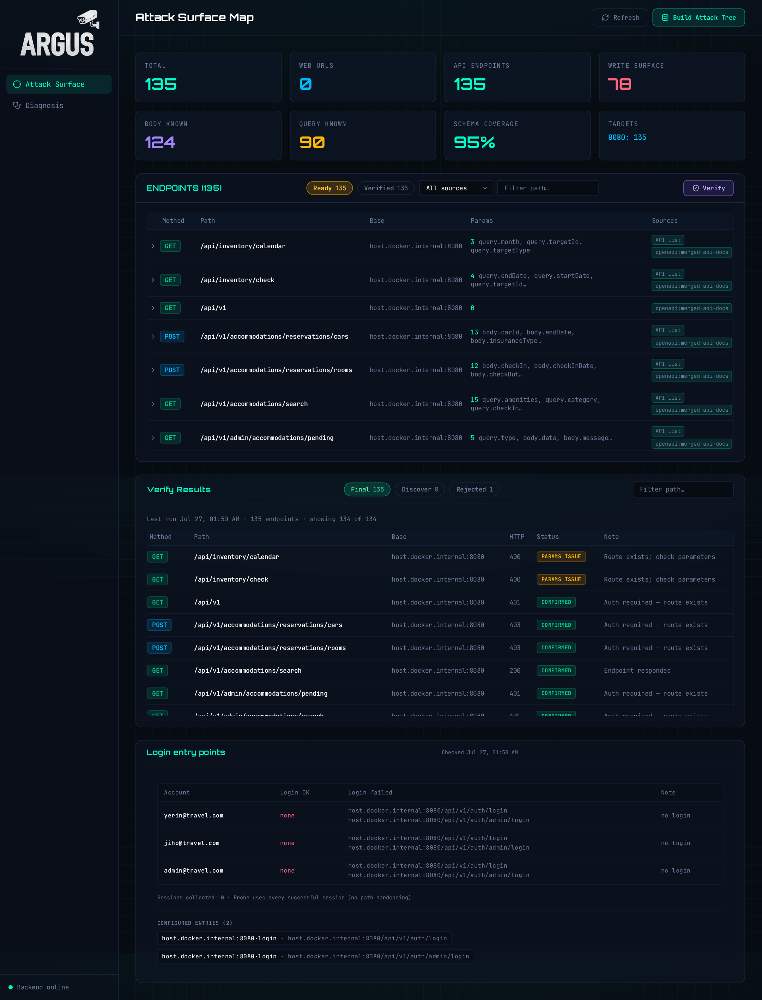
</figure>

# 2. 왜 만들었나

### 수동 진단의 한계

ONDE처럼 API·화면이 많은 서비스를 사람이 엔드포인트마다 눌러 보고, 패킷을 바꿔 가며 취약점을 찾는 데는 시간이 많이 듭니다. 항목이 늘수록 같은 검사를 반복하게 되고, 증적 캡처와 결과서 작성까지 손으로 맞추면 진단 자체가 병목이 됩니다.

### 자동으로, 많이, 빠르게

그래서 **URL · API · Swagger**로 대상을 모은 뒤, 항목별 진단 모듈이 응답 검증된 목록 위에서 검사를 돌리도록 잡았습니다. 사람이 하던 반복을 모듈 실행으로 바꿔 **수만 건 규모**까지 빠르게 돌릴 수 있게 하는 것이 ARGUS의 핵심이었습니다.

### 판정만 남기지 않기

진단 도구는 “취약하다/아니다”만 찍고 끝나면 보고·재현이 어렵습니다. 그래서 모듈 판정 뒤에 **증적 스크린샷**을 붙이고, **결과서 PDF**로 내려받을 수 있게 이어 두었습니다. ONDE를 타깃으로 수동 진단과 자동 진단을 같은 선상에서 비교할 수 있는 플랫폼을 목표로 한 이유입니다.

# 3. 서비스 흐름

ARGUS의 핵심 흐름은 대상을 등록하는 데서 끝나지 않습니다. **데이터 수집 → 응답 검증 → 진단 → 스크린샷 캡처 → 결과서 작성**으로 이어지며, 판정과 증적·결과서가 같은 파이프라인에서 만납니다.

<figure class="article-figure-center article-figure-center--full">
  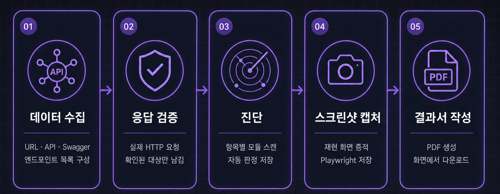
</figure>

### 1. 대상 API·엔드포인트를 수집한다

기준 URL과 **URL · API · Swagger** 목록으로 대상 서비스의 API·화면 경로를 한 목록으로 모읍니다. 이후 진단이 쓸 입력의 출발점입니다.

### 2. 응답으로 쓸 수 있는 대상만 남긴다

모아 둔 경로에 실제 HTTP 요청을 보내, 연결 실패·404처럼 쓸 수 없는 경로는 빼고 응답이 확인된 것만 남깁니다. 진단 모듈은 이 확정 목록을 우선해 읽습니다.

### 3. 항목별 모듈로 취약점을 진단한다

확정된 목록 위에서 항목별 진단 모듈이 검사를 돌립니다. 사람이 엔드포인트를 하나씩 누르던 반복을 모듈 실행으로 바꿔, 심각도·신뢰도에 따라 통과·주의·실패를 자동으로 매깁니다.

### 4. 증적 스크린샷을 남긴다

진단이 끝나면 Playwright로 재현에 필요한 화면을 캡처해 해당 진단 결과 아래에 저장합니다. 판정만 남기지 않고, 보고·재현에 쓸 화면 증거를 붙입니다.

### 5. 결과서 PDF를 만들고 내려받는다

진단 결과와 증적을 묶어 PDF 결과서를 만들고, 진단 화면에서 섹션별로 바로 내려받을 수 있게 연동합니다. 수집부터 결과서까지가 같은 플랫폼 안에서 이어집니다.

이 과정에서 React 화면은 FastAPI를 호출하고, 입력·검증·진단·증적·결과서는 **MariaDB 같은 RDB가 아니라** 백엔드 옆 `data/` 폴더의 JSON · YAML · PNG · PDF로 쌓입니다. 운영에서는 EC2 EBS(`/opt/argus/data`)가 컨테이너 `/app/data`로 붙습니다.

# 4. 데이터 · 저장 구조

핵심은 **수집한 대상을 검증한 뒤, 항목별 진단 결과·증적·결과서를 같은 `data/` 아래에서 이어 두는** 구조입니다. ARGUS에는 테이블 ERD의 실체가 없어서, 파일 역할을 논리 엔티티처럼 정리한 그림입니다.

<figure class="article-figure-center article-figure-center--full">
  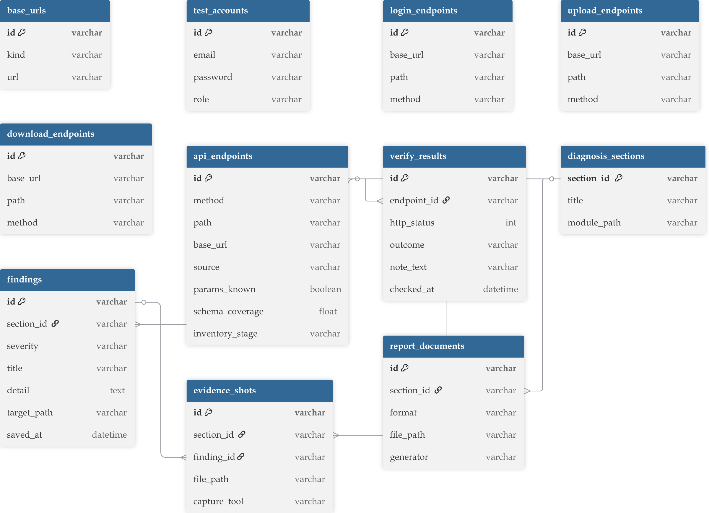
</figure>

### 핵심 저장 단위

| 논리 단위 | 실제 저장 | 역할 |
|-----------|-----------|------|
| **base_urls** | `data/*.json` 등 | 진단할 서비스의 기준 URL |
| **test_accounts** | 계정 JSON | 로그인·권한 검증에 쓸 테스트 계정 |
| **login / upload / download_endpoints** | 엔드포인트 JSON | 로그인·업로드·다운로드처럼 진단에 필요한 특수 경로 |
| **api_endpoints** | `api-tree*.json` | 수집된 API·경로 목록(인벤토리) |
| **verify_results** | `verify-report.json` | 응답 검증 결과. 쓸 수 있는 엔드포인트만 남김 |
| **diagnosis_sections** | 모듈·설정 | 항목별 진단 모듈(`section_id`, 모듈 경로) |
| **findings** | `data/report/{항목}/latest.yaml` | 진단 판정·상세. 섹션마다 YAML |
| **evidence_shots** | `.../evidence/` | Playwright 등 증적 스크린샷 |
| **report_documents** | 같은 `report/{항목}/` 아래 PDF·HTML | 결과서 파일 |

진행률 UI만 백엔드 프로세스 RAM에 잠깐 두고, Redis나 별도 DB에는 쌓지 않습니다. 재시작하면 진행률은 날아가도, `data/`에 쓴 파일은 남습니다.

### 관계와 흐름

1. 대시보드에서 기준 URL · 계정 · 로그인/전송 경로를 등록하면 JSON으로 저장됩니다.
2. 수집된 경로는 `api_endpoints` 인벤토리가 되고, 응답 검증이 `verify_results`를 남깁니다. 진단 모듈은 검증된 목록을 우선해 읽습니다.
3. 항목별 모듈이 돌면 `diagnosis_sections` 기준으로 `findings`가 `latest.yaml`에 쌓입니다.
4. 판정 뒤에 `evidence_shots`가 해당 섹션·finding에 붙고, `report_documents`로 PDF·HTML 결과서가 이어집니다.
5. 다운로드 API는 같은 `data/report/...` 파일을 읽어 사용자 PC로 보냅니다.

인벤토리(`api_endpoints`)와 검증(`verify_results`), 진단 결과(`findings`)를 **일부러 나눈** 이유입니다. 수집 목록과 “응답이 확인된 목록”, “취약점으로 판정된 결과”를 한 파일에 섞으면, 재진단·증적·결과서 범위를 나누기 어렵습니다. **수집 = 후보**, **검증 = 입력**, **finding = 판정**으로 역할을 갈랐습니다.

# 5. 주요 API

프론트가 쓰는 REST는 `/api` 아래에 모았습니다. 아래는 **실제 라우터 매핑** 기준 요약입니다. 대시보드 API는 **Bearer JWT**로 보호하고, 대상 서비스 로그인·계정은 `test-accounts` · `login-endpoints` 등으로 진단 입력에 씁니다.

### Auth

| Method | Endpoint | 설명 |
|--------|----------|------|
| POST | `/api/auth/register` | 회원가입 (로컬·개발만 허용하는 구성) |
| POST | `/api/auth/login` | 로그인 · JWT 발급 |
| GET | `/api/auth/me` | 현재 사용자 |

### Dashboard · Inventory

| Method | Endpoint | 설명 |
|--------|----------|------|
| PUT | `/api/base-urls` | 대상 base URL 저장 |
| GET | `/api/base-urls` | 대상 base URL 조회 |
| PUT | `/api/test-accounts` | 테스트 계정 저장 |
| PUT | `/api/login-endpoints` | 로그인 API 저장 |
| PUT | `/api/upload-endpoints` | 업로드 API 저장 |
| PUT | `/api/download-endpoints` | 다운로드 API 저장 |
| POST | `/api/inventory/build` | 대상 등록·API 수집 |
| GET | `/api/inventory/tree` | API 트리 조회 |
| GET | `/api/inventory/endpoints` | 엔드포인트 목록 |
| GET | `/api/inventory/stats` | 인벤토리 통계 (`ready` / `verified`) |

### Verify · Diagnosis

| Method | Endpoint | 설명 |
|--------|----------|------|
| POST | `/api/inventory/verify` | 응답 검증 (쓸 수 있는 경로만 남김) |
| GET | `/api/inventory/verify-report` | 검증 리포트 조회 |
| GET | `/api/inventory/discover/progress` | 검증·디스커버 진행률 |
| GET | `/api/diagnosis/catalog` | 진단 모듈 카탈로그 |
| POST | `/api/diagnosis/modules/{section_id}/run` | 섹션 진단 실행 |
| POST | `/api/diagnosis/run-all` | 전체 섹션 진단 |
| GET | `/api/diagnosis/progress` | 진단 진행률 |
| POST | `/api/diagnosis/cancel` | 진행 중 진단 취소 |
| GET | `/api/diagnosis/modules/{section_id}/report` | 섹션 진단 결과 (JSON) |
| POST | `/api/diagnosis/modules/{section_id}/replay` | finding 리플레이 |

### Evidence · Report

| Method | Endpoint | 설명 |
|--------|----------|------|
| GET | `/api/diagnosis/modules/{section_id}/evidence` | 증적 스크린샷 등 조회 |
| GET | `/api/diagnosis/modules/{section_id}/report/pdf` | 섹션 결과서 PDF |
| GET | `/api/diagnosis/modules/{section_id}/report/document` | 증적 포함 문서 PDF |
| GET | `/api/diagnosis/modules/{section_id}/final-report.pdf` | 최종 결과서 PDF |
| GET | `/api/diagnosis/modules/{section_id}/final-report/manifest` | 최종 결과서 매니페스트 |
| GET | `/api/health` | 헬스체크 |

수집 → 검증 → 진단 → 증적·결과서가 같은 `/api` 아래에서 이어지도록 잡았습니다. 오픈 리다이렉트 프로브용 `/argus-redirect-sink/...` 만 `/api` 밖에 있습니다.

# 6. 인프라 아키텍처

ARGUS도 앱만 올리는 데서 끝내지 않고, **Terraform으로 AWS를 잡고 EC2 · ALB · CI/CD까지** 한 제품으로 묶었습니다. 리전은 **서울(`ap-northeast-2`)** 이고, 도메인은 `rookies-argus.click`입니다. 인프라 레포에는 VPC·ALB·EC2·EBS·ECR·Secrets Manager와 GitHub Actions(SSM compose 배포) 워크플로가 함께 있습니다. 최종 제출 이후 인프라는 내려 **현재는 접속되지 않습니다**.

<figure class="article-figure-center article-figure-center--full">
  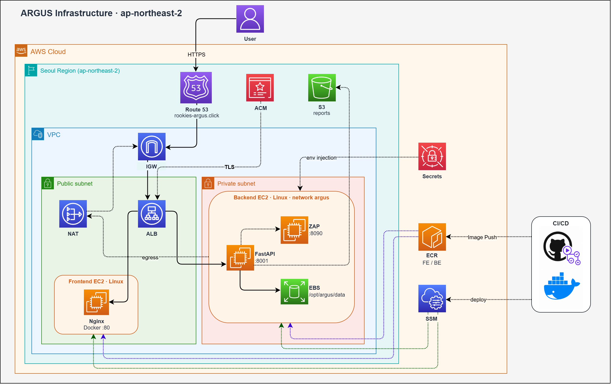
</figure>

### 구성의 축

| 축 | 역할 |
|----|------|
| **Terraform** | VPC, Public·Private 서브넷, IGW, NAT, ALB, EC2, EBS, ECR, Secrets Manager |
| **EC2 2티어** | Frontend(Linux·Nginx Docker `:80`), Backend(Linux·FastAPI `:8001` + ZAP `:8090`) |
| **Route53 + ACM** | `rookies-argus.click` DNS · ALB HTTPS |
| **EBS** | Backend에 붙는 `/opt/argus/data` — 인벤토리·진단·증적·결과서 파일 |
| **GitHub Actions + SSM** | FE/BE 이미지 ECR push · EC2에 SSM으로 compose 배포 |
| **관측** | CloudWatch 메트릭 · (선택) CloudTrail 등 감사 로그 |

미니 3차(MACTA)가 EKS · Argo CD 중심이었다면, 최종 ARGUS는 **EC2 + ALB path 라우팅**으로 진단 대시보드와 진단 API를 한 진입점에 모았습니다. ONDE처럼 RDS·Redis를 두지 않고, 진단 산출물은 **Backend 옆 EBS 파일**로 쌓는 쪽이 맞았습니다.

### Public / Private 분리

**Public subnet**에는 외부 진입점인 **ALB**와, Private 아웃바운드용 **NAT Gateway**, 그리고 **Frontend EC2**(Nginx Docker `:80`)를 둡니다. **Private subnet**에는 **Backend EC2**만 두고, 같은 호스트(또는 Compose 네트워크)에서 **FastAPI**와 **OWASP ZAP**을 함께 돌립니다. 진단·Discover가 쓰는 데이터는 Backend에 붙인 **EBS**(`/opt/argus/data` → 컨테이너 `/app/data`)에 둡니다.

외부 사용자는 ALB까지만 닿고, Backend·ZAP·데이터는 사설망 안에서만 통신합니다. Private에서 ECR pull · 대상 서비스 프로브가 필요할 때는 **NAT → IGW**로만 나가게 해 공격 표면을 좁혔습니다. **ZAP `:8090`은 ALB·호스트 포트로 열지 않고**, Backend가 Compose 내부 `http://zap:8090`으로만 API Key와 함께 붙습니다.

### 요청 라우팅

사용자 요청은 대략 다음 순서입니다.

```text
Browser
  → Route53 (rookies-argus.click)
  → IGW
  → Public ALB (ACM HTTPS)
       /*        → Frontend EC2  → Nginx :80
       /api/*    → Backend EC2   → FastAPI :8001
```

같은 ALB에서 화면과 API를 나누되, 진입점은 하나입니다. 프론트는 공개 SPA만 서빙하고, 진단·인벤토리·결과서 API는 `/api/*`로만 Backend에 붙습니다.

Backend가 진단 엔진·저장에 붙는 모습은 대략 이렇게입니다.

```text
Backend EC2
  → FastAPI :8001
  → ZAP :8090          (Compose 내부 전용, ALB 미노출)
  → EBS /opt/argus/data  (JSON · YAML · PNG · PDF)
  → (egress) NAT → IGW   (ECR pull · 대상 URL 프로브)
```

ONDE가 RDS·Redis·S3 이미지 파이프라인을 썼다면, ARGUS는 **진단 산출물 파일 + 공유 ZAP 데몬**이 중심입니다. 데이터가 DB 행이 아니라 `data/` 트리이므로, 볼륨을 EBS에 고정해 컨테이너를 갈아끼워도 결과가 남게 했습니다.

### CI/CD — FE/BE 이미지와 compose 배포

프론트·백엔드 모두 Linux Docker로 올리고, Backend 쪽 compose에는 **ZAP 컨테이너**도 같이 붙입니다. 배포 파이프라인은 대략 한 갈래입니다.

```text
[FE / BE]
GitHub Actions (OIDC)
  → Docker build · push → ECR (frontend / backend)
  → SSM → Backend/Frontend EC2
       compose pull · up   (prod compose, Secrets 주입)
```

어드민 JAR 갈래가 있던 ONDE와 달리, ARGUS는 **이미지 태그 + compose**로 FE·BE·ZAP를 맞춥니다. 시크릿은 워크플로에 박지 않고 **Secrets Manager / EC2 역할** 쪽으로 두고, prod에서는 `ARGUS_ENV=production` · 공개 register 비활성 · JWT/자격증명 fail-closed로 올립니다.

### Secret · ZAP 경계

JWT 시크릿 · 자격증명 키 · ZAP API Key처럼 민감한 값은 이미지·레포에 하드코딩하지 않고, **Secrets Manager** 등에서 주입하는 구성을 썼습니다. EC2 역할에는 ECR pull · 시크릿 읽기 · SSM 등 필요한 권한만 최소로 붙입니다.

ZAP은 진단 엔진에 꼭 필요하지만 **관리 UI·포트를 밖에 열면** 곧바로 공격 표면이 됩니다. 그래서 ALB 리스너·보안 그룹에서도 `:8090`을 빼고, Backend만 같은 Docker 네트워크에서 API Key로 호출하게 했습니다. 여러 진단·Discover 잡은 한 ZAP을 동시에 건드리지 않도록 **직렬화(락)** 도 앱 쪽에 두었습니다.

### 리소스 요약

| 구분 | 연동 | 역할 |
|------|------|------|
| 네트워크 | VPC / Public·Private Subnet / IGW / NAT | 진입점과 Backend·ZAP·데이터 분리 |
| DNS · TLS | Route53 / ACM | `rookies-argus.click` · HTTPS |
| 진입 | ALB (path) | `/*` → FE · `/api/*` → BE |
| 컴퓨트 | EC2 × 2 (Linux FE / BE) | Nginx · FastAPI + ZAP |
| 데이터 | EBS (`/opt/argus/data`) | 인벤토리·findings·증적·PDF |
| 배포 | ECR / GitHub Actions / SSM | Docker push · compose deploy |
| 시크릿 | Secrets Manager | JWT · ZAP API Key · 자격증명 키 |

# 7. 핵심 구현

인프라·라우팅은 **6번**에서 다뤘으므로, 여기서는 앱에서 **왜 그렇게 짰는지**만 깊게 갑니다. README Key Implementation의 다섯 축 — **수집·검증**, **가이드라인 모듈**, **증적·결과서**, **멀티유저 워크스페이스**, **공유 ZAP 직렬화** — 로 정리합니다.

### Attack Surface 수집 · Verify / Discover

진단 모듈에 “있는 듯한 URL”을 그대로 넣으면 타임아웃·404만 쌓이고 판정이 흔들립니다. 그래서 대상을 **모으고(수집) → 응답을 확인하고(Verify) → 필요하면 더 넓히고(Discover)** 난 뒤, 검증된 목록만 진단 입력으로 쓰게 했습니다.

- **수집** — Base URL · OpenAPI/Swagger · 업로드 목록으로 `api-tree` 인벤토리를 만듭니다. 로그인·업로드·다운로드처럼 특수 경로는 별도 JSON으로 등록합니다.
- **Verify** — httpx(및 필요 시 ZAP)로 실제 HTTP 응답을 보고, 연결 실패·쓸 수 없는 경로를 걸러 `verify-report` / verified 트리를 남깁니다.
- **Discover** — ZAP OpenAPI import · seed probe · spider 흐름으로 인벤토리를 보강합니다. 결과는 다시 트리·검증 경로로 합칩니다.
- **효과** — **후보(수집)** 와 **입력(검증)** 을 파일 단위로 갈라, 재진단 때 “무엇을 돌렸는지”를 추적하기 쉽게 했습니다.

### 가이드라인별 진단 모듈 (1-1 … 8-1)

한 덩어리 스캐너로 모든 항목을 돌리면 옵션·판정·증적이 섞입니다. KISA 웹/API 개발보안 가이드라인 항목을 **`section_id` 모듈**로 나눠, 대시보드에서 섹션 단위로 실행·취소·리플레이하게 했습니다.

- **모듈 경계** — XSS/CSRF, Injection, 업로드, IDOR/다운로드, 인증·세션, 헤더·설정 등이 `diagnosis/modules/{section_id}/` 아래에 독립합니다.
- **프로브 조합** — 항목마다 httpx 직접 프로브와 ZAP 패시브/액티브 시그널 비중을 다르게 둡니다. “ZAP만” 또는 “httpx만”으로 고정하지 않았습니다.
- **산출** — 섹션마다 `data/report/{section}/latest.yaml`에 findings를 쌓고, 진행률은 프로세스 RAM에만 잠깐 둡니다.
- **효과** — 실패한 항목만 다시 돌리고, 결과서·증적 범위도 섹션 단위로 자를 수 있습니다.

### 증적 스크린샷 · 결과서 PDF

판정 YAML만 있으면 보고·재현이 어렵습니다. 진단 뒤에 **Playwright로 증거 화면을 캡처**하고, **ReportLab 기반 PDF**로 묶어 대시보드에서 바로 받게 이어 두었습니다.

- **증적** — 섹션·finding 아래 `evidence/`에 PNG를 쌓고, `/api/diagnosis/modules/{section_id}/evidence`로 조회합니다.
- **결과서** — 섹션 PDF · 증적 포함 문서 · final-report 등 다운로드 API를 같은 `report/{section}/` 트리에서 읽습니다.
- **리플레이** — finding을 다시 보내 보는 replay API로, 스크린샷과 판정을 같은 맥락에서 재확인합니다.
- **효과** — “취약하다”는 라벨에 **화면 증거와 내려받을 문서**를 붙여, 수동 진단 결과와 나란히 비교할 수 있게 했습니다.

### 멀티유저 워크스페이스

한 `data/`를 모두가 쓰면 인벤토리·계정·결과서가 섞입니다. JWT 로그인 뒤 사용자마다 **`data/users/{user_id}/`** 워크스페이스를 두고, 요청 경로의 파일·진행률이 그 아래로만 가게 했습니다.

- **인증** — `/api/auth/login` · Bearer JWT. 운영에서는 공개 register를 끄고, JWT/자격증명 시크릿이 없으면 fail-closed입니다.
- **격리** — base URL · test accounts · api-tree · report·evidence가 유저 디렉터리 기준입니다. `ARGUS_DATA_DIR`로 런타임 루트를 고정합니다.
- **비밀** — 테스트 계정 비밀번호는 at-rest `enc:` 저장 + API 마스킹합니다.
- **효과** — 같은 Backend·ZAP를 공유하면서도, 진단 산출물이 계정 단위로 분리됩니다.

### 공유 ZAP · 직렬화

ZAP을 진단마다 띄우면 무겁고, 포트를 밖에 열면 위험합니다. Backend Compose 네트워크에 **공용 `zaproxy/zap-stable`** 을 두고 API Key로만 붙이되, 동시에 여러 진단·Discover가 세션을 건드리지 않도록 **전역 락으로 직렬화**했습니다.

- **경계** — `:8090`은 ALB·호스트에 매핑하지 않습니다. Backend만 `http://zap:8090`으로 호출합니다.
- **락** — `zap_exclusive()` 등으로 진단/Discover 구간을 한 번에 하나만 돌립니다.
- **효과** — 인프라 비용·공격 표면을 줄이면서도, ZAP 패시브/액티브 시그널을 모듈 파이프라인에 붙일 수 있습니다.

이 다섯 가지는 “대상을 검증해 모으고 → 가이드라인 모듈로 돌리고 → 증적·PDF로 남기고 → 유저별로 Isolated data에 쌓고 → 공유 ZAP을 안전하게 쓴다”는 ARGUS 앱의 뼈대입니다.

# 8. 화면으로 보는 기능

Attack Surface 설정부터 Diagnosis 카탈로그까지, 대시보드에서 진단 입력을 어떻게 잡는지 봅니다. (수집·검증이 끝난 **채워진 Attack Surface** 는 **1. 메인 화면** `fig1`과 동일합니다.)

### 1. Attack Surface Map — Attack Surface

로그인 뒤 기본 화면입니다. TOTAL · API ENDPOINTS · SCHEMA COVERAGE 같은 요약 카드와, Ready/Verified 엔드포인트 테이블 · Verify Results · Login entry points 패널이 한 페이지에 있습니다. 파일을 고르고 **Merge & Build** 하기 전에는 표가 비어 있고, 빌드·Verify가 끝나면 `fig1`처럼 채워집니다.

<figure class="article-figure-center article-figure-center--wide">
  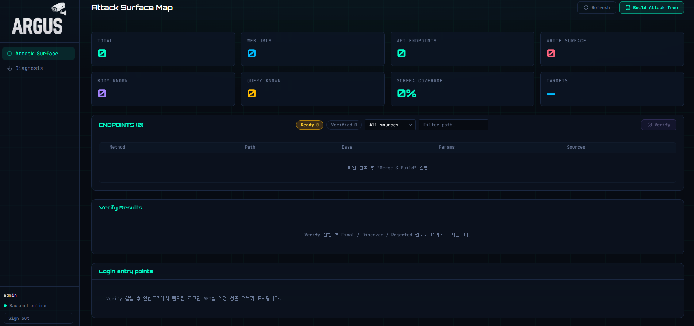
</figure>

### 2. Build Attack Tree · Base URLs

**Build Attack Tree**에서 URL List · API List · Swagger와 Gradle/Maven/pip/npm 의존성(`deps.txt`)을 고른 뒤 Merge & Build로 인벤토리를 만듭니다. 아래 **Base URLs**에는 스캔·진단 대상 API/웹 베이스를 등록합니다. 로그인 API는 인벤토리(`api-tree`)에서 자동 탐지하는 흐름을 기본으로 둡니다.

<figure class="article-figure-center article-figure-center--wide">
  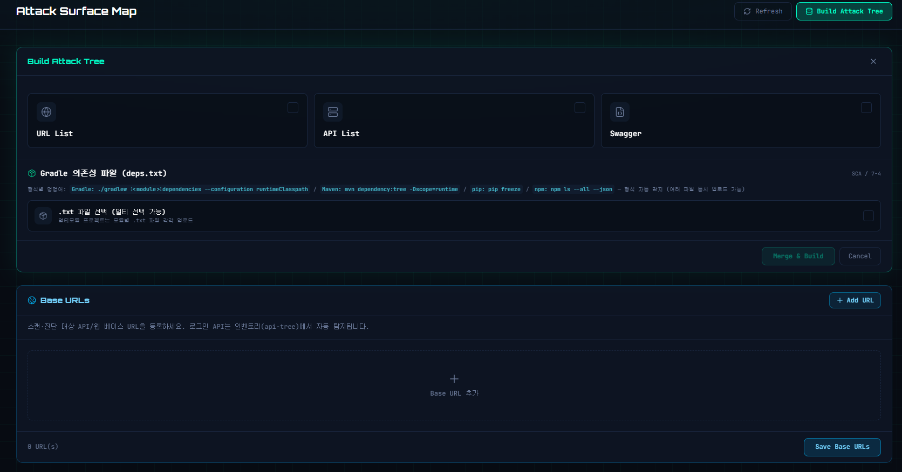
</figure>

### 3. Test Accounts · Login Endpoints

진단·Verify 로그인 프로브에 쓸 **테스트 계정**과, 인벤토리에 없는 모달 로그인 등을 보완하는 **Login Endpoints**를 등록합니다. 저장한 계정은 이후 로그인 엔드포인트에 순서대로 시도됩니다. (6-2 Verify-로그인 프로브와 동일 입력을 공유합니다.)

<figure class="article-figure-center article-figure-center--wide">
  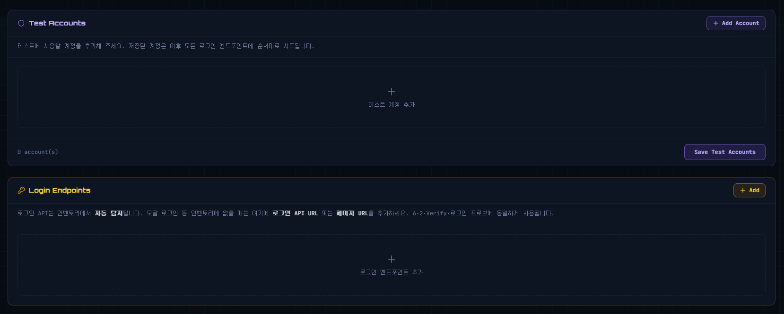
</figure>

### 4. Upload · Download Endpoints

파일 **업로드(2-1)** · **다운로드/export(2-2)** 진단에 쓸 API를 수동으로 붙입니다. 인벤토리에 없거나 multipart만 있는 경우 여기에 등록하고, 해당 기능이 없는 대상은 비워 둡니다.

<figure class="article-figure-center article-figure-center--wide">
  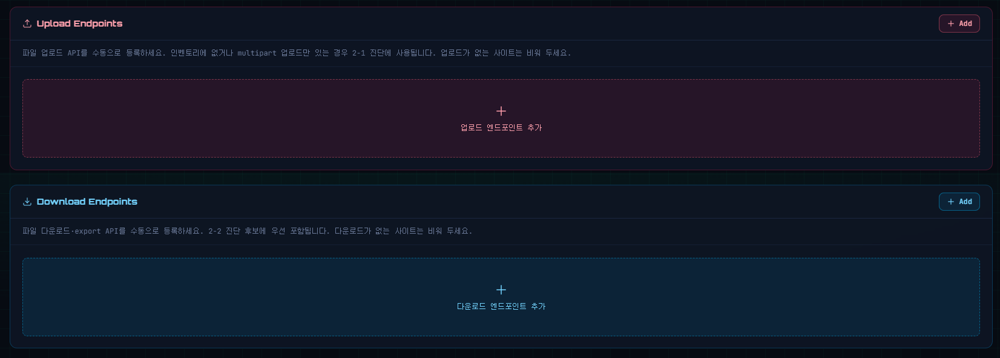
</figure>

### 5. Diagnosis 카탈로그 — Chapter 1–2

사이드바 **Diagnosis**로 들어가면 KISA 가이드라인 항목이 챕터별로 나열됩니다. Chapter 1은 XSS/CSRF · Injection · 파라미터 조작 · SSRF/File Inclusion · Redirect · 입력 크기/무결성, Chapter 2는 악성 업로드 · 중요 파일 다운로드입니다. 항목마다 `zap+custom` · `httpx+zap` 같은 엔진 태그와 **진단 시작** / **수동 진단** 버튼이 붙습니다.

<figure class="article-figure-center article-figure-center--wide">
  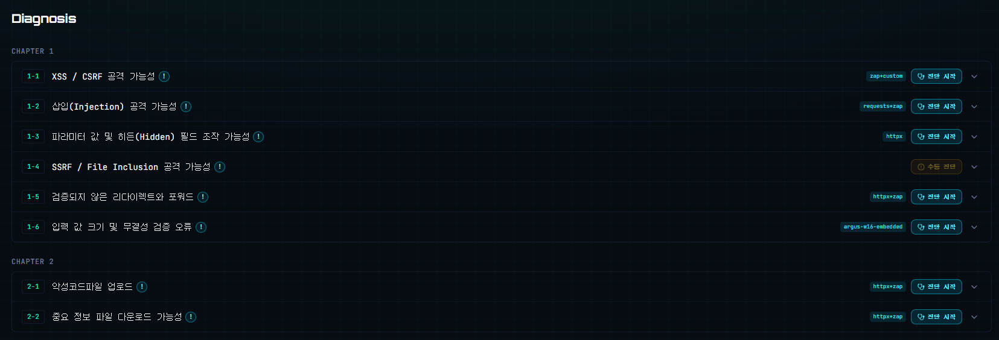
</figure>

### 6. Diagnosis 카탈로그 — Chapter 3–4

Chapter 3은 패스워드 정책 · 인증 실패 제한 · 관리자 분리 · 검색엔진/백업 노출 등 **인증** 축, Chapter 4는 쿠키·스토리지 · 세션/토큰 · 접근제어 · 비인증 접근 · 권한 상승 등 **세션·인가** 축입니다. 자동 모듈은 `https` / `requests` 태그로 시작하고, 수동 항목은 주황 **수동 진단**으로 표시합니다.

<figure class="article-figure-center article-figure-center--wide">
  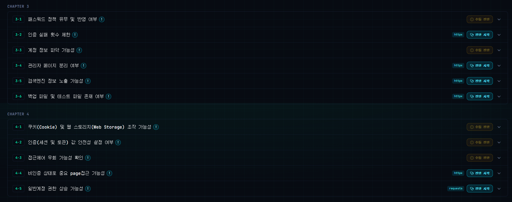
</figure>

### 7. Diagnosis 카탈로그 — Chapter 5–8

Chapter 5–7은 소스/응답 정보 노출 · 오류 페이지 · Method · 디렉터리 리스팅 · 헤더 · 보안설정, Chapter 8은 가이드에 없는 기타 항목입니다. 행을 펼치면 옵션·진행률·결과·증적·PDF 다운로드로 이어지고, Attack Surface에서 쌓은 verified 인벤토리·계정이 여기 모듈 입력으로 넘어갑니다.

<figure class="article-figure-center article-figure-center--wide">
  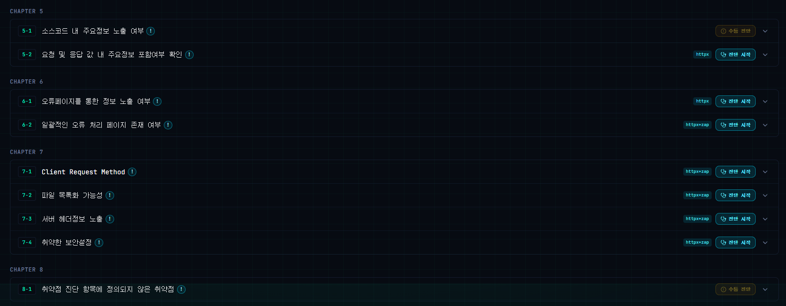
</figure>

# 9. 미니 이후의 리팩토링 — 멀티유저 격리와 운영 fail-closed

최종 제출 이후, 모노레포 `SK-Rookies5-FINAL_ARGUS`에서 **멀티유저·보안 감사**를 돌리며 Critical·High 구멍을 다시 메웠습니다. 순서는 **JWT 게이트 → 유저별 `data/` 격리 → 계정 at-rest 암호화 → progress/ZAP 경계 → prod fail-closed**였습니다.

기존 ARGUS는 **단일 공유 워크스페이스**였습니다. ALB `/api/*`에 인증이 없고, `data/`·진단 progress·verify/report 삭제가 전역이라 A와 B가 같은 inventory·계정을 덮어쓰고, `test-accounts.json`은 평문으로 API에 노출됐습니다. Terraform에 JWT 시크릿이 있어도 앱이 안 쓰면 게이트는 없는 것과 같았습니다. (진단 대상 URL allowlist / 프라이빗 IP SSRF 차단은 **의도적으로 제외**했습니다. 제한 없이 대상을 물려야 했기 때문입니다.)

## API는 익명이 아니라 JWT다

배포본에서 누구나 inventory·diagnosis를 읽고 쓰면, 공유 mutable state가 그대로 공격 표면이 됩니다. Infra에 있던 `JWT_SECRET`을 실제로 쓰기 위해 멀티 유저 계정(B안)을 올렸습니다.

- `users.json` + bcrypt + JWT(`POST /api/auth/register|login`, `GET /api/auth/me`). 보호: inventory · test-accounts · base-urls · login/upload/download · diagnosis 등 거의 전 `/api/*`.
- 공개 유지: `/api/health`, auth login/register, 그리고 외부 타깃이 치는 redirect sink hit 경로.
- 유저 0명이고 `ADMIN_USERNAME` / `ADMIN_PASSWORD`가 있으면 부트스트랩 admin 1명. FE는 Bearer 첨부 · 401 시 로그인 · `LoginPage` 게이트.

“대시보드만 열리면 된다”가 아니라, **누가 API를 쓰는지**를 서버가 먼저 묻게 바꾼 것이 출발점입니다.

## 데이터는 `data/`가 아니라 `data/users/{id}/`다

한 폴더를 공유하면 Last-writer-wins가 팀 단위로 터집니다. 격리(A안)로 인증된 요청마다 `UserDataDir`를 ContextVar에 바인딩하고, 서비스·백그라운드 진단 워커는 그 루트만 읽습니다.

- api-tree · test-accounts · base-urls · login/upload/download · uploads · report가 **유저 디렉터리 안**으로 이동했습니다.
- 예전처럼 대시보드가 `config.yaml` / `config.docker.yaml`을 **전역 덮어쓰지 않습니다**. base/login은 유저 JSON만 저장하고, 진단 시 메모리 config에 merge합니다.
- 빌드 시 `_invalidate_previous_target_artifacts`도 **자기 workspace** verify/report만 지웁니다.
- progress/cancel도 `_states[user_id]`로 갈라, A가 6-1을 돌리는 동안 B의 폴링·cancel이 A를 건드리지 않게 했습니다.

수집·검증·findings를 파일로 둔 설계(4절)는 유지하되, **파일이 누구 것인지**를 계정에 묶은 리팩터입니다.

## 비밀번호는 평문 JSON이 아니다

인증만 넣어도 “본인 workspace에 평문 계정”이 남으면 위험합니다. `CREDENTIALS_KEY`(없으면 JWT에서 파생)로 Fernet at-rest 암호화를 붙였습니다.

- 디스크: `enc:<token>`. API GET: `********`. PUT 시 빈 값/`********`이면 기존 유지.
- 진단·로그인 프로브만 decrypt 평문을 내부에서 씁니다.

유저 간 횡단은 workspace 격리가, 같은 유저 디스크 노출은 암호화·마스킹이 막는 이중 구조입니다.

## ZAP·redirect sink·업로드 경계를 닫다

ZAP `api.disablekey=true` + 호스트 `8090` 공개는 스캐너 남용으로 이어질 수 있습니다. redirect sink는 외부 hit가 필요하지만 아무나 probe를 쌓거나 hits를 조회하면 안 됩니다.

- ZAP: API key 필수, compose는 `expose`만(ALB·호스트 미매핑), diagnosis/Discover는 `zap_exclusive()`로 직렬화(6·7절과 동일 축).
- Redirect sink: 등록된 probe만 hit 기록(미등록 404). hits 조회·register는 JWT. 1-5 스캐너가 job 직후 `register_probes` 호출.
- 업로드: 파일당 10MB, OpenAPI 파싱 실패 시 거부·삭제. 확장자 화이트리스트 유지.

인프라 Secrets에도 실제 사용 키(`JWT_SECRET`, `CREDENTIALS_KEY`, `ZAP_API_KEY`, admin)를 맞추고, 쓰이지 않는 DB/Redis 비밀번호는 reserved로 명시했습니다.

## 운영은 fail-closed

로컬 compose는 register·약한 기본값을 허용해도, prod는 열려 있으면 안 됩니다.

- `ARGUS_ENV=production`(또는 시크릿 fail-closed)에서 공개 register 기본 403, `JWT_SECRET` / `CREDENTIALS_KEY` 없으면 기동·발급 실패.
- CD는 `deploy.yml` → prod compose 단일 경로(SSM). docker run 이중 경로를 걷어 ZAP key·미공개 포트와 맞춤.

8절 화면의 Sign in / workspace는 이 리팩터 이후의 전제입니다. 기능을 더 붙이기보다, **인증·격리·시크릿·ZAP 경계를 운영 기본값으로 닫는** 쪽에 무게를 뒀습니다. (evidence capture의 `ARGUS_DATA_DIR` 구멍·ZAP 볼륨에 `users/`가 보이는 문제 등은 후속 High로 남겼습니다.)

# 10. 마무리 소감

이번 최종에서는 ONDE를 타깃으로, 웹·API 취약점을 **모듈로 돌리고 증적·결과서까지 남기는** 진단 플랫폼을 올렸습니다. KISA 가이드라인 **28개 항목 중 자동 모듈로 만든 것은 20개**였습니다. 처음에는 “항목만 나누면 금방 붙일 수 있겠지” 싶었지만, 인벤토리 검증·ZAP 연동·판정 기준·옵션 UI가 서로 묶여 있어 생각보다 발목을 잡는 구간이 많았습니다. 모듈 하나를 완성하려면 취약점 지식뿐 아니라, 그 항목이 먹을 **입력(verified 트리·계정·특수 엔드포인트)** 과 **출력(findings·증적·PDF)** 까지 같은 파이프라인에 맞춰야 했습니다.

각자 맡은 섹션을 개발하면서, 해당 취약점이 실제로 어떻게 드러나고 왜 그렇게 판정해야 하는지 공부할 수밖에 없었습니다. XSS·Injection·업로드·인가처럼 이름이 익숙한 항목도, 자동으로 돌리려면 프로브 설계와 오탐·미탐 사이의 선을 정해야 했고, 그 과정에서 진단 대상(ONDE)을 보는 눈이 달라졌습니다. 특히 **스크린샷 증적**은 판정만으로는 부족한 보고를 메우는 핵심인데, Playwright로 재현 화면을 안정적으로 남기는 일이 예상보다 까다로웠습니다. 캡처 타이밍·로그인 세션·모듈별 DOM이 조금만 어긋나도 증거가 비었고, 그래서 더 공을 들일 수밖에 없었습니다.

의견이 갈리는 순간도 있었지만, Attack Surface · Diagnosis · 인프라 · 배포를 나눠 맡으며 끝까지 맞춰 갈 수 있었습니다. 같이 조율하고 밀어 준 팀원들 덕분에 ARGUS를 여기까지 올릴 수 있었습니다. 함께해 줘서 고맙습니다.
