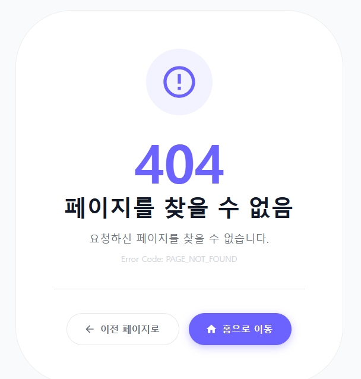
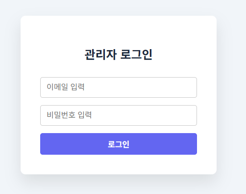
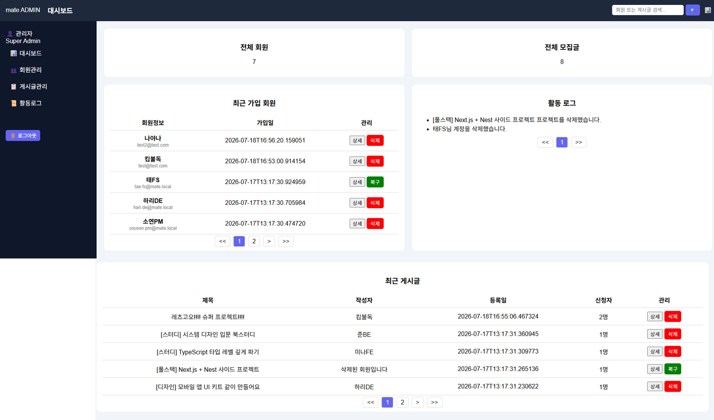

---

# 서론

**SK쉴더스 루키즈 5기**에서 스프링부트 교육을 마친 뒤 이어진 **두 번째 미니 프로젝트**입니다.

사이드 프로젝트·스터디 팀원을 찾으려면 여러 커뮤니티에 모집글을 올리고, 지원자 정보와 합류 현황을 따로 관리해야 합니다. **MATE**는 개발자·디자이너·기획자가 **모집 → 지원 → 수락/거절 → 팀 확정 → 팀 전용 게시판**까지 한곳에서 이어 갈 수 있도록 만든 매칭 플랫폼입니다.

React(MUI) 프론트와 Spring Boot REST API가 나뉘어 있고, JWT 인증·JPA 도메인·MariaDB를 중심으로 회원·모집글·지원서·멤버·게시판을 다룹니다.

📦 **GitHub:** [SK-Rookies5-MINI2_MATE](https://github.com/Hyeonseok93/SK-Rookies5-MINI2_MATE)

# 1. 메인 화면

<figure class="article-figure-center article-figure-center--wide">
  
</figure>

# 2. 왜 만들었나

### 흩어진 모집 채널

프로젝트·스터디 팀원은 주로 **오픈 카카오톡 채팅방·에브리타임** 같은 커뮤니티 게시판에서 모집됩니다. 이런 방식은 지원자가 채팅·댓글에 흩어져 **지원자를 관리하기 어렵고**, 각 지원자의 **기술 스택이나 포지션을 한눈에 파악하기 힘듭니다**. 수락/거절도 방장이 메모로 관리하고, 합류한 뒤에는 또 다른 방으로 옮기게 됩니다.

### 포지션과 이력 관리

기존 팀 빌딩 방식은 **포지션 관리에 한계**가 있습니다. MATE는 이를 극복하기 위해 **프로젝트별로 독립적인 역할(포지션) 수행**과 **지원·매칭 이력 관리**를 한 서비스로 묶는 데서 출발했습니다. 모집글 · 지원서 · 멤버 · 팀 공간이 끊기지 않게 이어지도록 하는 것이 목표였습니다.

### 백엔드 중심 미니의 목표

1차(CVS)가 데이터 수집·대시보드였다면, 2차는 **REST API · JPA 관계 · JWT 인증 · 권한**을 한 제품 흐름으로 묶는 쪽이었습니다. 화면만 늘리는 것보다 **User–Project–Application–ProjectMember** 관계와 Soft Delete·토큰 갱신 같은 운영 규칙을 코드로 고정하는 데 집중했습니다.

# 3. 전체 아키텍처

흐름은 짧게 **React SPA → Spring Boot REST → MariaDB**이고, 프로필 이미지는 **Cloudinary**, 관리자 화면은 **Thymeleaf**로 서버 렌더링합니다.

<figure class="article-figure-center article-figure-center--full">
  
</figure>

| 구분 | 기술 | 역할 |
|------|------|------|
| **Frontend Core** | JavaScript, React/React DOM 19.2.4, Vite 8.0.3 | 컴포넌트 기반 SPA 렌더링·개발 서버·프로덕션 번들 |
| **Routing & UI** | React Router DOM 7.13.2, MUI/MUI Icons 7.3.9, Emotion 11.14 | 페이지 라우팅·보호 경로·공통 컴포넌트·테마와 CSS-in-JS |
| **State & HTTP** | Zustand 5.0.12, Axios 1.14.0 | 인증·게시글 전역 상태, API 모듈, JWT 인터셉터와 토큰 재발급 |
| **Frontend Dev & Quality** | MSW 2.12.14, Vitest 4, jsdom, Testing Library, ESLint 9.39.4 | 선택형 API 모킹, 유틸·컴포넌트 단위 테스트, 정적 분석·Hooks 규칙 검사 |
| **Backend Core** | Java 17, Spring Boot 3.5.13, Spring Web MVC, Bean Validation | REST API·서비스 계층·요청값 검증·전역 예외 처리 |
| **Persistence** | Spring Data JPA, Hibernate ORM 6.6.45, MariaDB JDBC 3.5.7, Flyway | 엔티티 매핑·운영 데이터 영속화와 버전형 스키마 마이그레이션 |
| **Database Support** | H2 2.3.232 | 테스트 프로필의 인메모리 DB로 로컬 MariaDB와 격리된 회귀 테스트 실행 |
| **Security** | Spring Security, JJWT 0.12.7, BCrypt | HttpOnly Refresh 쿠키·회전/재사용 감지, 인증 API rate limit, 권한 제어 |
| **Admin View** | Thymeleaf, Spring Security Form Login | 관리자 로그인·대시보드·회원·프로젝트·감사 로그 서버 렌더링 |
| **Media** | Cloudinary Java SDK 1.36 | 프로필 이미지 업로드·CDN URL 관리, 로컬 정적 업로드 경로 지원 |
| **Backend Utilities** | Jackson, Lombok, Servlet Multipart | JSON 직렬화·보일러플레이트 절감·멀티파트 파일 처리 |
| **Build & Development** | Maven Wrapper 3.9.14, Spring Boot DevTools | 백엔드 빌드·의존성 관리·로컬 개발 편의 기능 |
| **Backend Test** | Spring Boot Test, Spring Security Test, JUnit 5, AssertJ, H2 | 권한·JWT 쿠키 회전·rate limit·CSRF·삭제/복구 수명주기 회귀 검증 |

프론트는 초기에 **MSW**로 API를 모킹해 백엔드와 병렬로 화면을 붙였고, 연결 후에는 Axios Interceptor가 `401` 시 Refresh로 Access를 갱신한 뒤 원 요청을 재시도합니다.

# 4. 도메인 · ERD

핵심은 **모집글에 지원하고, 수락된 사람만 팀 멤버가 되는** 흐름입니다. README에는 요약만 두고, 관계·상태·설계 이유는 아래에 정리합니다.

<figure class="article-figure-center article-figure-center--full">
  
</figure>

### 핵심 엔티티

| 엔티티 | 테이블 | 역할 |
|--------|--------|------|
| **User** | `users` | 회원. 이메일·닉네임·전화번호 unique, 포지션·기술스택·역할(`ROLE_USER`) |
| **Project** | `projects` | 모집글. `owner` → User, 카테고리·모집인원·온/오프라인·상태·마감일 |
| **Application** | `applications` | 지원서. Project + applicant(User), 동기·포지션·상태(`PENDING/ACCEPTED/REJECTED`) |
| **ProjectMember** | `project_members` | 확정 멤버. Project–User N:M 해소, `project_id+user_id` 유니크, `OWNER/MEMBER` |
| **BoardPost** | `board_posts` | 팀 전용 게시글. Project + author |
| **Comment** | `comments` | 게시글 댓글. BoardPost + author |
| **RefreshToken** | `refresh_tokens` | 토큰 원문 대신 SHA-256 해시 저장, 패밀리 단위 회전·재사용 감지 |
| **AdminLog** | `admin_logs` | 관리자 삭제·복구 등 감사 로그 |

기술 스택은 User·Project 모두 `@ElementCollection`으로 `user_tech_stacks` / `project_tech_stacks`에 문자열 집합으로 둡니다. Soft Delete가 필요한 도메인은 `BaseEntity`의 `deleted_at` + `@Where(clause = "deleted_at IS NULL")`를 공통 적용합니다.

### 관계와 상태 전이

<figure class="article-figure-center article-figure-center--full">
  
</figure>

1. 회원이 모집글(`Project`)을 올리면 `owner`가 되고, 생성 시점에 방장용 `ProjectMember(OWNER)`가 붙는 흐름입니다.
2. 다른 회원은 `Application`을 남깁니다. 초기 상태는 **`PENDING`**.
3. 방장이 `accept`하면 `ACCEPTED` + **`ProjectMember(MEMBER)`** 생성 + `Project.currentCount++`. 정원에 도달하면 상태를 **`CLOSED`**로 자동 마감합니다. `reject`면 `REJECTED`만 기록합니다.
4. **팀 게시판·댓글**은 멤버만 접근합니다. 지원만 하고 수락되지 않은 유저는 BoardPost API에서 걸러집니다.

Application과 ProjectMember를 **일부러 나눈** 이유입니다. 지원 이력(동기·거절)과 확정 멤버십(권한·게시판 접근)을 같은 테이블에 섞으면, 거절된 지원을 “멤버가 아니었다”와 “지원한 적도 없다”로 구분하기 어렵습니다. **지원서 = 이력**, **멤버 = 권한**으로 역할을 갈랐습니다.

### Soft Delete · 관리자 복구

일반 삭제 API는 `deleted_at`만 채웁니다. `@Where` 때문에 일반 조회에서는 빠지고, 관리자 Thymeleaf 화면은 `findAllIncludingDeleted`로 Soft Delete 행까지 본 뒤 **복구(`deleted_at = null`)** 할 수 있습니다. 회원 삭제 시 소유 프로젝트도 함께 Soft Delete하고, 동작은 `AdminLog`에 남깁니다.

# 5. 주요 API

프론트가 쓰는 REST는 `/api` 아래에 모으고, 관리자는 `/admin` Thymeleaf로 분리했습니다. 아래는 **실제 컨트롤러 매핑** 기준 요약입니다.

### Auth · User

| Method | Endpoint | 설명 |
|--------|----------|------|
| POST | `/api/auth/signup` | 회원가입 |
| GET | `/api/auth/check-email` | 이메일 중복 확인 |
| GET | `/api/auth/check-nickname` | 닉네임 중복 확인 |
| GET | `/api/auth/check-phone` | 전화번호 중복 확인 |
| POST | `/api/auth/find-email` | 계정 복구 안내(전달 채널 연결 전 비활성) |
| POST | `/api/auth/reset-password` | 비밀번호 복구 안내(전달 채널 연결 전 비활성) |
| POST | `/api/auth/login` | 로그인 · Access 응답 + Refresh HttpOnly 쿠키 발급 |
| POST | `/api/auth/logout` | 로그아웃 · Refresh 폐기 및 쿠키 제거 |
| POST | `/api/auth/refresh` | 쿠키 회전 + Access 재발급 |
| GET | `/api/users/me` | 내 프로필 |
| PATCH | `/api/users/me` | 프로필 부분 수정 |
| PATCH | `/api/users/profile-image` | 프로필 이미지 업로드(Cloudinary) |
| DELETE | `/api/users/profile-image` | 기본 이미지로 복구 |
| GET | `/api/users/me/posts/owned` | 내가 만든 모집글 |
| GET | `/api/users/me/posts/joined` | 참여 중 프로젝트 |
| GET | `/api/users/me/applications` | 내 신청 현황(대기·거절) |
| DELETE | `/api/users/me` | 회원 탈퇴(Soft Delete) |

### Project · Application · Member

| Method | Endpoint | 설명 |
|--------|----------|------|
| POST | `/api/projects` | 모집글 생성 |
| GET | `/api/projects` | 목록(카테고리·키워드·페이징) |
| GET | `/api/projects/{id}` | 상세 |
| PATCH | `/api/projects/{id}` | 부분 수정(OWNER) |
| DELETE | `/api/projects/{id}` | Soft Delete(OWNER) |
| PATCH | `/api/projects/{id}/close` | 수동 마감 |
| PATCH | `/api/projects/{id}/reopen` | 재모집(인원·마감일 검증) |
| POST | `/api/applications/{projectId}` | 지원하기 |
| GET | `/api/applications/projects/{projectId}` | 지원자 목록(방장) |
| PATCH | `/api/applications/{id}/status` | `accept` / `reject` |
| DELETE | `/api/applications/{id}` | 지원 취소(PENDING) |
| GET | `/api/posts/{projectId}/members` | 멤버 목록 |
| DELETE | `/api/posts/members/{memberId}` | 멤버 강제 퇴출(OWNER) |

### Board · Comment · Admin

| Method | Endpoint | 설명 |
|--------|----------|------|
| POST | `/api/posts/{projectId}/board` | 팀 게시글 작성 |
| GET | `/api/posts/{projectId}/board` | 게시글 목록(페이징·멤버만) |
| GET | `/api/posts/{projectId}/board/{postId}` | 상세(+조회수) |
| PATCH | `/api/posts/{projectId}/board/{postId}` | 수정 |
| DELETE | `/api/posts/{projectId}/board/{postId}` | 삭제 |
| POST | `/api/posts/{projectId}/board/{postId}/comments` | 댓글 작성 |
| GET | `/api/posts/{projectId}/board/{postId}/comments` | 댓글 목록 |
| PUT | `/api/posts/comments/{commentId}` | 댓글 수정 |
| DELETE | `/api/posts/comments/{commentId}` | 댓글 삭제 |
| GET | `/admin/dashboard` | 관리자 대시보드(Thymeleaf) |
| POST | `/admin/users/restore/{id}` | 삭제 회원 복구 |
| POST | `/admin/projects/restore/{id}` | 삭제 프로젝트 복구 |

응답은 공통 `SuccessResponse`로 감싸고, 목록은 프론트 `postStore`가 기대하는 `PageResponseDto`(`data.page`) 형태로 맞췄습니다. 인증이 필요한 API는 `@AuthenticationPrincipal CustomUserDetails`로 유저 ID를 받아 서비스에 넘깁니다.

# 6. 핵심 구현

README Key Implementation과 같은 6개 축을, 블로그에서는 **왜 그렇게 했는지**와 코드 관점까지 붙여 풉니다.

### MSW로 프론트·백엔드 병렬 개발

백엔드 API가 완성되기를 기다리면 프론트 일정이 통째로 밀립니다. 그래서 API 연동 전에, 기획 단계 명세만 가지고 **MSW(Mock Service Worker)** 로 가짜 서버를 먼저 세웠습니다.

- **명세 그대로의 모킹 레이어** — `mocks/handlers.js`에 auth·projects·applications·board·comments 전 구간을 33개 핸들러로 깔았습니다. 단순히 고정 JSON을 뱉는 게 아니라, `localStorage`를 가짜 DB(`mock-db`)로 써서 로그인·모집글 CRUD·지원·수락/거절이 **상태를 유지하며** 돌도록 만들었습니다. 덕분에 백엔드 없이도 "지원하면 목록에 뜨고, 수락하면 멤버가 되는" 실제 시나리오를 로컬에서 검증할 수 있었습니다.
- **응답 규격 선합의** — 모킹부터 설계서 v1.1 공통 포맷(`{ success, data, message, timestamp }`)과 `AUTH_001` 같은 에러 코드를 그대로 흉내 냈습니다. 그래서 실제 API로 붙일 때 화면 로직이 아니라 **네트워크 계층만** 바꾸면 됐습니다.
- **런타임 스위치** — 초기에는 `main.jsx`의 `enableMocking()`을 주석 처리해 모킹을 끄고 실서버로 전환했습니다. 이후 리팩토링에서 이 토글을 `VITE_ENABLE_MSW` 환경 변수로 옮겨, `main.jsx`가 `isMswEnabled`일 때만 워커를 등록하도록 정리했습니다. 이제 코드를 건드리지 않고 환경 변수만으로 모킹/실서버를 오갈 수 있고, 프로덕션에서는 항상 꺼집니다.

### Axios Interceptor · Silent JWT 갱신

Access Token은 수명이 짧아 자주 만료됩니다. 만료될 때마다 로그아웃시키면 UX가 최악이라, `axiosInstance`의 **Response Interceptor**에서 만료를 소리 없이 처리합니다.

- **정확한 트리거** — 모든 `401`이 아니라 `status === 401 && error.code === 'AUTH_002'`(액세스 만료)일 때만 갱신을 시도합니다. `AUTH_003`(유효하지 않은 토큰)은 즉시 강제 로그아웃으로 갈랐습니다.
- **브라우저에서 숨긴 Refresh Token** — Refresh Token을 Zustand와 `localStorage`에서 제거하고 **HttpOnly·SameSite 쿠키**로 옮겼습니다. 운영에서는 `Secure` 플래그를 환경 변수로 켭니다. 프론트 JavaScript는 토큰 값을 읽지 않고 `withCredentials`로 쿠키만 전송합니다.
- **회전과 재사용 감지** — 갱신할 때마다 Refresh Token을 교체하고 DB에는 원문 대신 SHA-256 해시와 `familyId`를 저장합니다. 이미 회전된 토큰이 다시 들어오면 탈취 가능성으로 보고 같은 패밀리의 활성 토큰을 모두 폐기합니다.
- **원 요청 자동 재시도** — 쿠키로 Access를 재발급한 뒤, 실패했던 **원래 요청을 그대로 다시 던집니다**. 재발급 호출만은 인터셉터가 다시 낚아채 무한 루프에 빠지지 않도록 `axiosInstance`가 아닌 **axios 원본**으로 보냅니다.
- **동시 요청 큐잉** — 토큰 만료 순간 여러 요청이 동시에 터지면, `isRefreshing` 플래그와 `failedQueue`로 **첫 요청만 갱신**하고 나머지는 큐에 넣어 대기시킵니다. 새 토큰이 나오면 큐를 한 번에 풀어 재시도해, 리프레시가 중복 호출되지 않습니다.

### Mapper로 Entity ↔ DTO 관심사 분리

서비스 계층에 변환 코드가 섞이면 비즈니스 로직이 지저분해집니다. 그래서 Entity ↔ DTO 변환을 **Mapper 클래스**로 모았습니다. Lombok `@Builder`로 명시적 변환을 유지해, Entity 필드 변경과 API 응답 스펙 변경 지점을 갈랐습니다. 응답 포맷을 손볼 때 서비스가 아니라 매퍼만 먼저 보면 되도록 책임을 분리한 것입니다.

### Cloudinary 프로필 이미지 업로드

프로필 이미지를 앱 서버 디스크에 쌓으면 스토리지·백업·배포가 전부 무거워집니다. 그래서 업로드는 **Cloudinary**로 넘기고, 서버 DB에는 **CDN URL만** 저장합니다. 이미지 로딩 부하를 CDN으로 넘겨 앱 서버는 API에만 집중하고, 이미지를 지우면 기본 이미지 URL로 되돌립니다.

### Zustand 정규화 브릿지 (API 스펙 완충)

백엔드 필드명·페이징 포맷이 엔드포인트마다 조금씩 달랐습니다. 이 흔들림을 화면까지 끌고 가지 않도록, 스토어를 **완충 계층**으로 씁니다.

- `postStore`는 목록 응답이 배열이든 `content` 페이징이든 상관없이 `rawPosts`로 통일하고, `id`↔`projectId`처럼 엔드포인트마다 다른 식별자를 서로 채워 **한 객체에 둘 다** 존재하도록 매핑합니다. 페이징도 `response.page.totalPages`와 `response.totalPages`를 모두 흡수합니다.
- `authStore` / `postStore`에서 `id`↔`userId`, `profileImg`↔`profileImageUrl` 등을 **프론트 내부 표준**으로 정규화합니다. 화면 컴포넌트는 스토어 표준 필드만 보므로, API 스펙이 흔들려도 수정 지점이 스토어 한 곳으로 좁혀집니다.

### MUI Custom Theme · 디자인 토큰

컴포넌트마다 색·라운드·그림자를 인라인으로 박으면 화면이 금방 파편화됩니다. 그래서 `styles/theme.js`의 `createTheme`로 **브랜드 토큰을 한곳에 고정**하고, 전 화면이 이 토큰만 바라보게 했습니다.

- **컬러 · 타이포 토큰** — Primary `#6C63FF`, Primary Soft `#EDE9FF`, Accent `#FF6B9D`, 배경 `#EEF2F8` / Surface `#FFFFFF`, 텍스트 `primary/secondary/muted` 3단계를 팔레트로 정의했습니다. 폰트는 **Pretendard**를 최상위로 둔 시스템 폰트 폴백 체인으로 고정하고, 제목 `h1`은 `letterSpacing: -1.5px`까지 토큰화했습니다.
- **셰이프 토큰** — 전역 `borderRadius: 16`을 기준으로, 카드·표면은 16, 버튼·칩은 `99`(pill)로 라운드 규칙을 나눴습니다.
- **컴포넌트 styleOverrides** — `MuiButton` / `MuiCard` / `MuiChip`을 테마 단에서 재정의했습니다. Primary 버튼은 `0 4px 14px rgba(108,99,255,0.35)` 그림자에 hover 시 더 깊어지고, 카드는 공통 그림자·1px 보더, 칩은 pill+`fontWeight 600`으로 통일했습니다. 개별 컴포넌트에서 스타일을 다시 쓰지 않아도 **버튼 하나·카드 하나가 어디서든 같은 톤**을 갖도록 만든 것이 핵심입니다.
- **적용 지점** — 이 테마는 `App.jsx`의 `ThemeProvider` + `CssBaseline`로 앱 최상단에 한 번만 주입합니다. 토큰 하나만 바꾸면 전 화면 톤이 함께 움직입니다.

# 7. 화면으로 보는 기능

모집 → 지원 → 매칭 → 팀 게시판이 화면으로 이어집니다.

### 홈 · 모집글 탐색

카테고리(프로젝트/스터디)·기술 스택·키워드로 모집글을 필터하고 카드 목록으로 탐색합니다.

<figure class="article-figure-center article-figure-center--wide">
  
</figure>

### 모집글 작성

프로젝트/스터디 유형, 제목, 모집 인원, 마감일, 진행 방식, 기술 스택과 상세 소개를 한 번에 입력합니다. 우측의 작성 팁과 등록 전 체크리스트가 필수 입력 항목을 안내해, 긴 폼에서도 현재 작성 상태를 놓치지 않게 했습니다.

<figure class="article-figure-center article-figure-center--wide">
  
</figure>

### 마이페이지 · 내 모집글 · 내 신청 현황

프로필(닉네임·포지션·기술 스택·프로필 이미지)을 관리하고, 탭으로 **내가 올린 모집글**과 **내 신청 현황**을 한 화면에서 오갑니다. 내 신청 현황은 지원한 글의 `PENDING` / `ACCEPTED` / `REJECTED` 상태를 그대로 보여 주고, 아직 대기 중인 지원은 취소할 수 있습니다.

<figure class="article-figure-center article-figure-center--wide">
  
</figure>

### 지원자 관리

내가 올린 모집글에 들어온 지원자 목록을 열어 지원 동기·포지션·연락처를 확인하고 **수락/거절**합니다. 수락하면 `Application`이 `ACCEPTED`로 바뀌며 **ProjectMember**가 생성되고 `currentCount`가 올라가, 정원이 차는 순간 모집이 자동으로 마감됩니다. 거절은 이력만 `REJECTED`로 남깁니다.

<figure class="article-figure-center article-figure-center--wide">
  
</figure>

### 팀 전용 게시판

매칭된 멤버만 접근하는 협업 게시글·댓글입니다. 외부 유저의 목록·상세 조회를 막아 팀 공지·링크 공유용 공간으로 씁니다. 방장은 이 화면에서 팀원을 제외할 수도 있습니다.

<figure class="article-figure-center article-figure-center--wide">
  
</figure>

### 커스텀 메시지

알림과 확인 절차는 **브라우저 기본 `alert` / `confirm`을 쓰지 않고** 전부 자체 컴포넌트로 대체했습니다. 기본 대화상자는 디자인을 브랜드에 맞출 수 없고, 버튼 문구·위치가 OS마다 달라 전문적인 느낌을 주기 어렵고, 창이 뜨는 순간 페이지 전체를 막아 UX 흐름도 끊깁니다.

**ToastMessage** — MUI `Snackbar` + `Alert` 기반 공용 토스트입니다. 화면 상단 중앙에 뜨고 약 3초 뒤 자동으로 닫히며, `success / error / info / warning` 네 종류를 아이콘·색으로 구분합니다. 흐름을 막지 않는 **비차단(non-blocking)** 피드백이라, 저장·삭제·에러 같은 결과를 알린 뒤 사용자는 그대로 작업을 이어 갑니다.

<figure class="article-figure-center article-figure-center--wide">
  
</figure>

**ConfirmModal** — 되돌릴 수 없는 작업(게시글·댓글 삭제, 지원 취소, 회원 탈퇴, 팀원 제외, 조기 마감/재모집)에 쓰는 커스텀 확인 모달입니다. 제목·설명·확인/취소 버튼을 브랜드 톤으로 통일하고, 파괴적 동작은 `color="error"`로 빨간 버튼을 노출해 실수를 줄였습니다. 브라우저 기본 `confirm`처럼 "확인/취소"만 던지는 대신, 무엇을 왜 되돌릴 수 없는지까지 문구로 설명합니다.

<figure class="article-figure-center article-figure-center--wide">
  
</figure>

**전역 마운트 · 상태 관리** — 두 컴포넌트는 `MainLayout`에 한 번만 마운트하고, 상태는 Zustand `uiStore`(`toast` / `modal`)로 관리합니다. 그래서 어느 페이지든 `showToast(message, type)` 한 줄, `openModal('confirm', { title, message, onConfirm })` 한 줄로 동일한 UI를 띄웁니다. 닫히는 순간 직전 내용을 로컬 상태로 유지해 사라질 때 문구가 깜빡이지 않게 처리했습니다.

### 상태별 커스텀 에러 페이지

존재하지 않는 주소에서 브라우저 기본 오류 화면이나 빈 화면이 나오지 않도록 **공통 `ErrorPage`**를 만들었습니다. `App.jsx`의 마지막 `path="*"` 라우트가 등록되지 않은 모든 경로를 받아, 기본적으로 404 화면을 렌더링합니다.

- **상태별 메시지·색상 분기** — 기본 404는 Primary 보라색으로 "페이지를 찾을 수 없음", 403은 Amber로 "접근 권한 없음", 500은 Red로 "서버 오류 발생"을 표시합니다. 라우터나 API 처리부가 `location.state`에 `status / code / message`를 전달하면 같은 컴포넌트가 상황에 맞는 화면으로 바뀝니다.
- **사용자에게 다음 행동 제공** — 오류 코드만 보여 주고 막다른 길로 만들지 않고, `navigate(-1)`을 호출하는 **이전 페이지로** 버튼과 `/`로 이동하는 **홈으로 이동** 버튼을 함께 제공합니다.
- **디자인 시스템 유지** — MUI `Paper`·`Typography`·`Stack`과 공통 `CustomButton`을 사용해 정상 화면과 같은 라운드·색상·버튼 톤을 유지합니다. 모바일에서는 버튼을 세로로, 넓은 화면에서는 가로로 배치해 오류 상황에서도 조작이 불편하지 않게 했습니다.

<figure class="article-figure-center article-figure-center--wide">
  
</figure>

### Thymeleaf 관리자 화면

사용자용 React SPA와 별도로, 운영 기능은 Spring Boot가 렌더링하는 **Thymeleaf 관리자 화면**으로 분리했습니다. `/admin/**` 전용 `SecurityFilterChain`을 우선순위 `@Order(1)`로 두고, JWT 대신 DB 계정을 조회하는 **Form Login**을 적용했습니다. 로그인한 계정에 `ROLE_ADMIN` 권한이 있어야 관리자 URL에 접근할 수 있습니다.

<figure class="article-figure-center">
  
</figure>

로그인 성공 시 `/admin/dashboard`로 이동합니다. 사용자 화면과 같은 Primary 보라색을 사용하되, 이메일·비밀번호 입력과 로그인 버튼의 폭을 동일하게 맞춰 독립된 운영 진입점이라는 인상을 유지했습니다.

<figure class="article-figure-center article-figure-center--full">
  
</figure>

대시보드는 **전체 회원·전체 모집글 수**, 최근 가입 회원, 최근 게시글, 활동 로그를 한 화면에 모읍니다. 회원·게시글은 각각 상세 조회와 Soft Delete/복구가 가능하며, 삭제 시 연관 프로젝트·멤버십을 함께 처리하고 작업 이력을 `AdminLog`에 남깁니다. 회원·게시글·활동 로그는 페이징하고, 상단 통합 검색으로 이메일·닉네임·프로젝트 제목·작성자·로그 내용을 찾을 수 있게 했습니다.

# 8. 미니 이후의 리팩토링 — 기능에서 안전한 구조로

미니 프로젝트 기간에는 모집 → 지원 → 수락 → 팀 게시판이라는 흐름을 완성하는 것이 우선이었습니다. 기능은 돌아갔지만, 프로젝트가 끝난 뒤 전체 코드를 다시 보니 **권한 검증이 빠진 조회 API**, Access/Refresh를 구분하지 않는 JWT, 관리자 삭제와 일반 삭제의 서로 다른 동작, Write/Edit 화면의 복제처럼 데모만으로는 드러나지 않는 문제가 남아 있었습니다.

리팩토링은 **보안·데이터 무결성 → 백엔드 도메인 수명주기 → 프론트 중복 제거 → 테스트·CI** 순서로 진행했습니다. API 경로와 기존 DB 데이터는 최대한 유지하고, 한 번에 갈아엎기보다 문제별 회귀 테스트를 먼저 붙이는 쪽을 택했습니다.

## 지원자 목록은 방장만 볼 수 있어야 한다

지원자 목록에는 닉네임뿐 아니라 지원 동기·포지션·연락처·링크가 들어갑니다. 그런데 기존 `GET /api/applications/projects/{projectId}`는 프로젝트 존재 여부만 검사하고, **현재 사용자가 그 프로젝트의 방장인지 확인하지 않았습니다**. 로그인만 하면 다른 프로젝트의 지원자 정보까지 조회할 수 있는 IDOR(Insecure Direct Object Reference) 문제였습니다.

수락·거절 로직에서 이미 쓰던 소유자 검증을 목록 조회에도 동일하게 적용했습니다. 현재 사용자 ID와 `project.owner.id`가 다르면 `AUTH_ACCESS_DENIED`로 막고, **방장만 지원자 목록을 열 수 있음**을 테스트로 고정했습니다.

## Access Token과 Refresh Token을 구분하다

처음 구현은 Access와 Refresh가 만료 시간만 다르고, JWT 내부 구조는 같았습니다. 인증 필터도 서명과 만료만 맞으면 토큰을 받아서, 수명이 긴 Refresh Token을 Bearer Access Token처럼 쓸 여지가 있었습니다.

토큰에 `tokenType=access|refresh` claim을 추가하고 역할을 분리했습니다.

- 인증 필터는 **access** 타입만 보호 API의 Bearer 토큰으로 받습니다.
- `/api/auth/refresh`는 **refresh** 타입만 허용합니다.
- Access Token을 재발급 API에 넣거나 Refresh Token으로 일반 API를 호출하면 인증에 실패합니다.
로그인·재설정 경로에 남아 있던 평문 비밀번호 디버그 로그도 제거했습니다. 처음에는 임시 비밀번호를 응답에서만 숨긴 채 DB 비밀번호와 RefreshToken을 바꾸도록 수정했지만, 전달 채널이 없는 상태에서는 제3자가 이메일·전화번호 조합만 알아도 계정을 잠글 수 있었습니다.

이메일/SMS가 연결되기 전까지 `/find-email`과 `/reset-password`는 사용자 조회나 상태 변경을 하지 않고, 존재 여부와 관계없이 같은 안내를 반환하도록 막았습니다. 운영 단계에서는 일회용 토큰을 검증된 채널로 전달한 뒤에만 비밀번호를 바꾸는 흐름으로 교체해야 합니다.

## 관리자 화면의 CSRF와 저장형 XSS

REST API는 Bearer JWT를 사용하지만, Thymeleaf 관리자는 세션 쿠키 기반 Form Login입니다. 둘을 같은 기준으로 보고 관리자 CSRF까지 꺼 둔 것이 문제였습니다. 관리자 체인에는 CSRF를 다시 켜고, 삭제·복구 POST 폼에 토큰을 포함시켰습니다.

회원·프로젝트 상세 모달은 서버에서 받은 제목·본문을 `innerHTML` 문자열로 조립하고 있었습니다. 사용자가 모집글에 HTML 이벤트 속성을 넣으면 관리자 브라우저에서 실행될 수 있어, DOM 노드를 만들고 `textContent`로 값을 넣는 방식으로 교체했습니다. 이제 사용자 입력은 **마크업이 아니라 텍스트**로만 렌더링됩니다.

## Soft Delete는 삭제보다 복구가 더 어려웠다

기존 관리자 삭제는 REST 삭제와 처리 범위가 달랐습니다. 회원을 관리자 화면에서 지우면 RefreshToken·지원서·멤버십·게시글 일부가 살아 있었고, 프로젝트를 복구해도 멤버는 삭제 상태인데 `currentCount`만 0인 모순이 생겼습니다.

삭제·복구 책임을 `DomainDeletionService` 한곳으로 모았습니다.

1. 회원 삭제는 소유 프로젝트, 지원서, 멤버십, 게시글·댓글을 같은 시각으로 Soft Delete하고 RefreshToken을 폐기합니다.
2. 프로젝트 삭제도 지원서·멤버십·게시글·댓글을 같은 cascade timestamp로 기록합니다.
3. 복구할 때는 **부모와 동일한 삭제 시각을 가진 행만** 되살립니다. 과거에 개별 삭제된 데이터를 추측해서 복구하지 않기 위한 기준입니다.
4. 프로젝트 복구 후 활성 `ProjectMember` 수를 다시 세어 `currentCount`를 맞춥니다.

또 하나는 `(project_id, user_id)` UNIQUE와 Soft Delete의 충돌이었습니다. 탈퇴한 멤버 행은 DB에 남아 있는데 일반 조회에서는 보이지 않아, 같은 사용자를 다시 수락하면 새 INSERT가 UNIQUE 제약에 걸렸습니다. 이제 삭제 포함 조회로 기존 멤버십을 찾고, 있으면 새로 만들지 않고 **기존 행을 복구해 역할·포지션을 갱신**합니다.

## 오래된 테스트가 운영 DB를 보고 있었다

`MappingTest`는 `Application.position`과 `ProjectMember.position`이 필수가 된 뒤에도 해당 값을 넣지 않아 실패했습니다. 더 큰 문제는 테스트 프로필을 고정하지 않아, 환경에 따라 로컬 MariaDB를 바라볼 수 있었다는 점입니다.

테스트를 H2 기반 `test` 프로필로 고정하고, 오래된 빌더와 `data.sql`에 필수 포지션을 반영했습니다. 이후 권한·JWT·CSRF·비밀번호 노출·삭제/복구·멤버 재수락 테스트를 추가했습니다.

최종 백엔드 결과는 **23 tests passed / 0 failed**입니다. 로컬 MariaDB나 `.env` 없이도 같은 테스트가 돌아가도록 만들었습니다.

## 프론트 페이지 복제에서 공통 모듈로

프론트는 `PostWritePage`와 `PostEditPage`가 날짜 계산·유효성 검증·진행 방식 매핑·입력 UI를 거의 그대로 복제하고 있었습니다. `MyPage`는 프로필·지원 현황·지원자 모달을 한 파일에서 다루고, `BoardPage`도 멤버·게시글·댓글 로직을 함께 품고 있었습니다.

리팩토링 후에는 다음 경계를 만들었습니다.

- `ProjectFormFields` — 작성/수정 화면의 공통 입력 UI와 날짜·기술 스택 처리
- `apiUtils` — API 에러 메시지, project/application ID, 페이징 응답, 날짜 정규화
- `runtime` — API 기준 URL과 이미지 URL 해석, MSW 활성화 여부
- `features/board` — 멤버 사이드바와 게시글 목록
- `sharedStyles` — 반복되던 입력 필드 스타일

배포 환경에서도 프로필 이미지가 `localhost:8080`을 보던 하드코딩을 제거하고 `VITE_API_BASE_URL`에서 에셋 기준 주소를 계산합니다. `application.id`를 `projectId` fallback으로 사용해 “이미 지원함”이 잘못 뜨던 조건도 분리했습니다. 필터 변경 시 store와 `useEffect`가 각각 요청하던 이중 fetch도 한 경로로 줄였습니다.

연결되지 않으면서 마이페이지 탭과 기능이 겹치던 `MyPostsPage`·`MyAppliesPage`, 사용되지 않던 `FormInput`·`SkeletonCard`·커스텀 Pagination도 제거했습니다. MSW는 프로젝트의 병렬 개발 기록을 보존하기 위해 삭제하지 않고, `VITE_ENABLE_MSW=true`일 때만 켜지는 **선택형 개발 도구**로 정리했습니다.

프론트 구조 리팩토링 구간은 대략 **+388줄 / −1024줄**로, 전체 코드가 **636줄** 줄었습니다. 코드를 줄이는 것 자체보다, 에러·URL·폼 규칙을 한곳만 고쳐도 전체 화면에 적용되게 만드는 것이 목적이었습니다.

## 테스트와 CI로 다시 깨지지 않게

프론트에는 Vitest + jsdom을 추가해 API 에러 추출, 에셋 URL, ID 정규화, 상태 계산, 빈 닉네임 Avatar 등을 **40개 단위 테스트**로 묶었습니다. 백엔드 23개 테스트와 함께 GitHub Actions에서 다음 순서로 자동 검증합니다.

```text
Backend: Java 17 → Maven test (H2)
Frontend: npm ci → ESLint → Vitest → Vite production build
```

최종 확인은 **백엔드 23/23**, **프론트 40/40**, ESLint 0 errors, 프로덕션 빌드 성공입니다.

## 추가로 적용한 운영 개선

- **인증 API rate limit** — 로그인은 IP·경로별 분당 5회, 계정 찾기·재설정은 분당 3회로 제한했습니다. 단일 인스턴스용 메모리 윈도 방식이며 초과 시 `429 / AUTH_006`을 반환합니다.
- **Flyway baseline** — 기존 MariaDB 스키마를 V1 baseline으로 잡고 Refresh Token 구조 변경을 V2 마이그레이션으로 분리했습니다. Hibernate는 `ddl-auto=validate`만 사용해 애플리케이션 기동 중 임의로 스키마를 바꾸지 않습니다.
- **라우트 단위 lazy loading** — `React.lazy`와 `Suspense`로 페이지를 분리하고 Vite에서 React·MUI·데이터 라이브러리 chunk를 나눴습니다. 기존 약 780 kB 단일 앱 번들 대신 페이지별 파일과 최대 381 kB 수준의 vendor chunk로 분리됐습니다.

## 아직 남은 한계

- 이메일/SMS 전달 채널이 없어 이메일 찾기와 셀프서비스 비밀번호 재설정은 현재 비활성입니다. 검증된 전달 채널과 만료 시간이 짧은 일회용 링크를 연결해야 실제 복구 기능으로 전환할 수 있습니다.
- CAPTCHA처럼 외부 서비스 연동이 필요한 자동화 요청 방어는 적용하지 않았습니다.
- 현재 rate limit은 단일 서버 메모리를 기준으로 합니다. 서버를 여러 대 운영한다면 Redis 같은 공용 저장소 기반 제한으로 바꿔야 합니다.

---

# 9. 마무리 소감

프론트엔드와 백엔드로 역할을 나눠 협업하며, 서비스가 어떤 메커니즘으로 맞물려 동작하는지 직접 체감할 수 있었던 시간이었습니다. 실제 구현에 들어가 보니 기획 단계에서 생각했던 것보다 훨씬 세세한 데이터와 다양한 예외 상황을 고려해야 한다는 것도 알게 되었습니다.

개발 과정에서 백엔드 팀에 수정과 추가 요청을 계속 전달할 수밖에 없었지만, 이 조율을 반복하면서 프론트엔드와 백엔드가 어떻게 연결되고 각 영역이 어떤 차이를 가지는지 더 깊이 이해할 수 있었습니다.

서로 다른 파트의 코드를 하나로 합치고 데이터가 흐르는 전체 구조를 파악하는 과정에서도 많은 것을 배웠습니다. 여러 번의 수정 요청이 번거로울 수 있었음에도 매번 유연하게 대응하고 함께 고민해 준 팀원들 덕분에 프로젝트를 무사히 마칠 수 있었습니다.

함께한 팀원들에게 고맙다는 말을 전하고 싶습니다. 이번 경험을 통해 협업에서의 커뮤니케이션이 프로젝트의 완성도를 높이는 데 얼마나 큰 힘이 되는지 배울 수 있었습니다.
