---

# 서론

**SK쉴더스 루키즈 5기**에서 스프링부트 교육을 마친 뒤 이어진 **두 번째 미니 프로젝트**입니다.

사이드 프로젝트·스터디 팀원을 찾으려면 여러 커뮤니티에 모집글을 올리고, 지원자 정보와 합류 현황을 따로 관리해야 합니다. **MATE**는 개발자·디자이너·기획자가 **모집 → 지원 → 수락/거절 → 팀 확정 → 팀 전용 게시판**까지 한곳에서 이어 갈 수 있도록 만든 매칭 플랫폼입니다.

React(MUI) 프론트와 Spring Boot REST API가 나뉘어 있고, JWT 인증·JPA 도메인·MariaDB를 중심으로 회원·모집글·지원서·멤버·게시판을 다룹니다.

📦 **GitHub:** [SK-Rookies5-MINI2_MATE](https://github.com/Hyeonseok93/SK-Rookies5-MINI2_MATE)

# 1. 메인 화면

<figure class="article-figure-center article-figure-center--wide">
  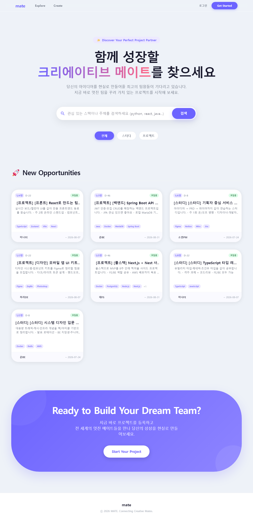
</figure>

# 2. 왜 만들었나

### 흩어진 모집 채널

프로젝트·스터디 팀원은 주로 **오픈 카카오톡 채팅방·에브리타임** 같은 커뮤니티 게시판에서 모집됩니다. 이런 방식은 지원자가 채팅·댓글에 흩어져 **지원자를 관리하기 어렵고**, 각 지원자의 **기술 스택이나 포지션을 한눈에 파악하기 힘듭니다**. 수락/거절도 방장이 메모로 관리하고, 합류한 뒤에는 또 다른 방으로 옮기게 됩니다.

### 포지션과 이력 관리

기존 팀 빌딩 방식은 **포지션 관리에 한계**가 있습니다. MATE는 이를 극복하기 위해 **프로젝트별로 독립적인 역할(포지션) 수행**과 **지원·매칭 이력 관리**를 한 서비스로 묶는 데서 출발했습니다. 모집글 · 지원서 · 멤버 · 팀 공간이 끊기지 않게 이어지도록 하는 것이 목표였습니다.

### 백엔드 중심 미니의 목표

1차(CVS)가 데이터 수집·대시보드였다면, 2차는 **REST API · JPA 관계 · JWT 인증 · 권한**을 한 제품 흐름으로 묶는 쪽이었습니다. 화면만 늘리는 것보다 **User–Project–Application–ProjectMember** 관계와 Soft Delete·토큰 갱신 같은 운영 규칙을 코드로 고정하는 데 집중했습니다.

# 3. 전체 아키텍처

흐름은 짧게 **React SPA → Spring Boot REST → MariaDB**이고, 프로필 이미지는 **Cloudinary**, 관리자 화면은 **Thymeleaf**로 서버 렌더링합니다.

<figure class="article-figure-center article-figure-center--full">
  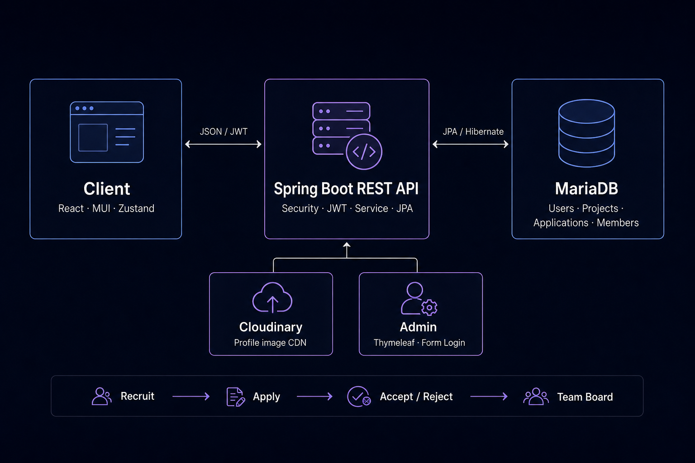
</figure>

| 구분 | 기술 | 역할 |
|------|------|------|
| **Frontend Core** | JavaScript, React/React DOM 19.2.4, Vite 8.0.3 | 컴포넌트 기반 SPA 렌더링·개발 서버·프로덕션 번들 |
| **Routing & UI** | React Router DOM 7.13.2, MUI/MUI Icons 7.3.9, Emotion 11.14 | 페이지 라우팅·보호 경로·공통 컴포넌트·테마와 CSS-in-JS |
| **State & HTTP** | Zustand 5.0.12, Axios 1.14.0 | 인증·게시글 전역 상태, API 모듈, JWT 인터셉터와 토큰 재발급 |
| **Frontend Dev & Quality** | MSW 2.12.14, ESLint 9.39.4, React Hooks/Refresh Plugins | API 모킹 레이어(현재 런타임 비활성), 정적 분석·Hooks 규칙 검사 |
| **Backend Core** | Java 17, Spring Boot 3.5.13, Spring Web MVC, Bean Validation | REST API·서비스 계층·요청값 검증·전역 예외 처리 |
| **Persistence** | Spring Data JPA, Hibernate ORM 6.6.45, MariaDB JDBC 3.5.7 | 엔티티 매핑·리포지토리·도메인 관계와 운영 데이터 영속화 |
| **Database Support** | H2 2.3.232, Flyway 11.7.2 | 테스트용 인메모리 DB; Flyway는 의존성만 있으며 개발 환경에서 비활성·마이그레이션 파일 없음 |
| **Security** | Spring Security, JJWT 0.12.7, BCrypt | Access/Refresh Token 발급·검증, 인증 필터, 비밀번호 해싱, 권한 제어 |
| **Admin View** | Thymeleaf, Spring Security Form Login | 관리자 로그인·대시보드·회원·프로젝트·감사 로그 서버 렌더링 |
| **Media** | Cloudinary Java SDK 1.36 | 프로필 이미지 업로드·CDN URL 관리, 로컬 정적 업로드 경로 지원 |
| **Backend Utilities** | Jackson, Lombok, Servlet Multipart | JSON 직렬화·보일러플레이트 절감·멀티파트 파일 처리 |
| **Build & Development** | Maven Wrapper 3.9.14, Spring Boot DevTools | 백엔드 빌드·의존성 관리·로컬 개발 편의 기능 |
| **Monitoring Dependencies** | Spring Boot Actuator, Spring Boot Admin Client 3.5.8 | 의존성만 선언된 상태이며 관리 엔드포인트·Admin 서버 연결 설정은 없음 |
| **Backend Test** | Spring Boot Test, JUnit 5, AssertJ, H2 | 애플리케이션 컨텍스트와 JPA 엔티티·DTO 매핑 검증 |

프론트는 초기에 **MSW**로 API를 모킹해 백엔드와 병렬로 화면을 붙였고, 연결 후에는 Axios Interceptor가 `401` 시 Refresh로 Access를 갱신한 뒤 원 요청을 재시도합니다.

# 4. 도메인 · ERD

핵심은 **모집글에 지원하고, 수락된 사람만 팀 멤버가 되는** 흐름입니다. README에는 요약만 두고, 관계·상태·설계 이유는 아래에 정리합니다.

<figure class="article-figure-center article-figure-center--full">
  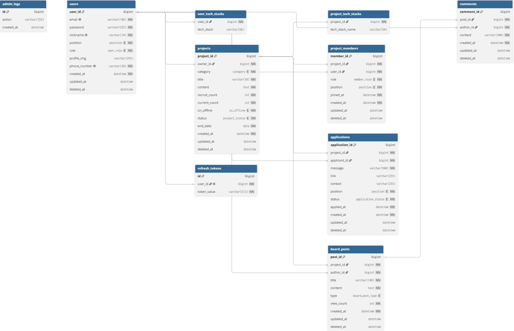
</figure>

### 핵심 엔티티

| 엔티티 | 테이블 | 역할 |
|--------|--------|------|
| **User** | `users` | 회원. 이메일·닉네임·전화번호 unique, 포지션·기술스택·역할(`ROLE_USER`) |
| **Project** | `projects` | 모집글. `owner` → User, 카테고리·모집인원·온/오프라인·상태·마감일 |
| **Application** | `applications` | 지원서. Project + applicant(User), 동기·포지션·상태(`PENDING/ACCEPTED/REJECTED`) |
| **ProjectMember** | `project_members` | 확정 멤버. Project–User N:M 해소, `project_id+user_id` 유니크, `OWNER/MEMBER` |
| **BoardPost** | `board_posts` | 팀 전용 게시글. Project + author |
| **Comment** | `comments` | 게시글 댓글. BoardPost + author |
| **RefreshToken** | `refresh_tokens` | 유저당 1토큰(`user_id` unique) |
| **AdminLog** | `admin_logs` | 관리자 삭제·복구 등 감사 로그 |

기술 스택은 User·Project 모두 `@ElementCollection`으로 `user_tech_stacks` / `project_tech_stacks`에 문자열 집합으로 둡니다. Soft Delete가 필요한 도메인은 `BaseEntity`의 `deleted_at` + `@Where(clause = "deleted_at IS NULL")`를 공통 적용합니다.

### 관계와 상태 전이

<figure class="article-figure-center article-figure-center--full">
  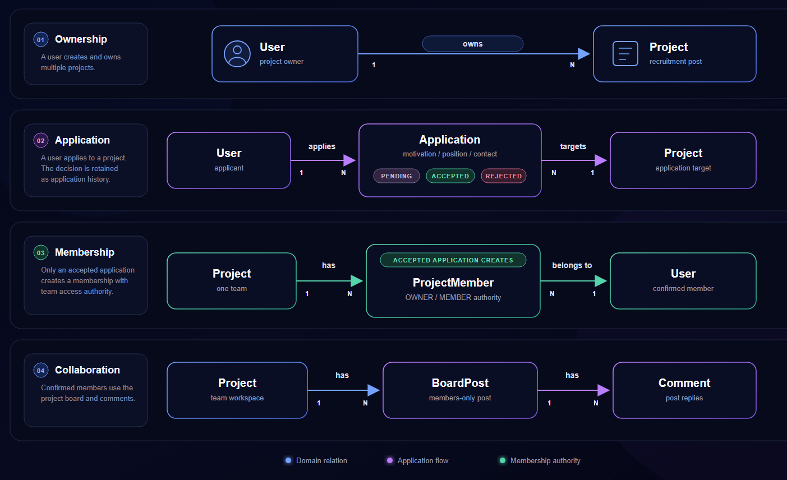
</figure>

1. 회원이 모집글(`Project`)을 올리면 `owner`가 되고, 생성 시점에 방장용 `ProjectMember(OWNER)`가 붙는 흐름입니다.
2. 다른 회원은 `Application`을 남깁니다. 초기 상태는 **`PENDING`**.
3. 방장이 `accept`하면 `ACCEPTED` + **`ProjectMember(MEMBER)`** 생성 + `Project.currentCount++`. 정원에 도달하면 상태를 **`CLOSED`**로 자동 마감합니다. `reject`면 `REJECTED`만 기록합니다.
4. **팀 게시판·댓글**은 멤버만 접근합니다. 지원만 하고 수락되지 않은 유저는 BoardPost API에서 걸러집니다.

Application과 ProjectMember를 **일부러 나눈** 이유입니다. 지원 이력(동기·거절)과 확정 멤버십(권한·게시판 접근)을 같은 테이블에 섞으면, 거절된 지원을 “멤버가 아니었다”와 “지원한 적도 없다”로 구분하기 어렵습니다. **지원서 = 이력**, **멤버 = 권한**으로 역할을 갈랐습니다.

### Soft Delete · 관리자 복구

일반 삭제 API는 `deleted_at`만 채웁니다. `@Where` 때문에 일반 조회에서는 빠지고, 관리자 Thymeleaf 화면은 `findAllIncludingDeleted`로 Soft Delete 행까지 본 뒤 **복구(`deleted_at = null`)** 할 수 있습니다. 회원 삭제 시 소유 프로젝트도 함께 Soft Delete하고, 동작은 `AdminLog`에 남깁니다.

# 5. 주요 API

프론트가 쓰는 REST는 `/api` 아래에 모으고, 관리자는 `/admin` Thymeleaf로 분리했습니다. 아래는 **실제 컨트롤러 매핑** 기준 요약입니다.

### Auth · User

| Method | Endpoint | 설명 |
|--------|----------|------|
| POST | `/api/auth/signup` | 회원가입 |
| GET | `/api/auth/check-email` | 이메일 중복 확인 |
| GET | `/api/auth/check-nickname` | 닉네임 중복 확인 |
| GET | `/api/auth/check-phone` | 전화번호 중복 확인 |
| POST | `/api/auth/find-email` | 전화번호로 이메일 찾기 |
| POST | `/api/auth/reset-password` | 임시 비밀번호 발급 |
| POST | `/api/auth/login` | 로그인 · Access/Refresh 발급 |
| POST | `/api/auth/logout` | 로그아웃 · Refresh 제거 |
| POST | `/api/auth/refresh` | Access 재발급 |
| GET | `/api/users/me` | 내 프로필 |
| PATCH | `/api/users/me` | 프로필 부분 수정 |
| PATCH | `/api/users/profile-image` | 프로필 이미지 업로드(Cloudinary) |
| DELETE | `/api/users/profile-image` | 기본 이미지로 복구 |
| GET | `/api/users/me/posts/owned` | 내가 만든 모집글 |
| GET | `/api/users/me/posts/joined` | 참여 중 프로젝트 |
| GET | `/api/users/me/applications` | 내 신청 현황(대기·거절) |
| DELETE | `/api/users/me` | 회원 탈퇴(Soft Delete) |

### Project · Application · Member

| Method | Endpoint | 설명 |
|--------|----------|------|
| POST | `/api/projects` | 모집글 생성 |
| GET | `/api/projects` | 목록(카테고리·키워드·페이징) |
| GET | `/api/projects/{id}` | 상세 |
| PATCH | `/api/projects/{id}` | 부분 수정(OWNER) |
| DELETE | `/api/projects/{id}` | Soft Delete(OWNER) |
| PATCH | `/api/projects/{id}/close` | 수동 마감 |
| PATCH | `/api/projects/{id}/reopen` | 재모집(인원·마감일 검증) |
| POST | `/api/applications/{projectId}` | 지원하기 |
| GET | `/api/applications/projects/{projectId}` | 지원자 목록(방장) |
| PATCH | `/api/applications/{id}/status` | `accept` / `reject` |
| DELETE | `/api/applications/{id}` | 지원 취소(PENDING) |
| GET | `/api/posts/{projectId}/members` | 멤버 목록 |
| DELETE | `/api/posts/members/{memberId}` | 멤버 강제 퇴출(OWNER) |

### Board · Comment · Admin

| Method | Endpoint | 설명 |
|--------|----------|------|
| POST | `/api/posts/{projectId}/board` | 팀 게시글 작성 |
| GET | `/api/posts/{projectId}/board` | 게시글 목록(페이징·멤버만) |
| GET | `/api/posts/{projectId}/board/{postId}` | 상세(+조회수) |
| PATCH | `/api/posts/{projectId}/board/{postId}` | 수정 |
| DELETE | `/api/posts/{projectId}/board/{postId}` | 삭제 |
| POST | `/api/posts/{projectId}/board/{postId}/comments` | 댓글 작성 |
| GET | `/api/posts/{projectId}/board/{postId}/comments` | 댓글 목록 |
| PUT | `/api/posts/comments/{commentId}` | 댓글 수정 |
| DELETE | `/api/posts/comments/{commentId}` | 댓글 삭제 |
| GET | `/admin/dashboard` | 관리자 대시보드(Thymeleaf) |
| POST | `/admin/users/restore/{id}` | 삭제 회원 복구 |
| POST | `/admin/projects/restore/{id}` | 삭제 프로젝트 복구 |

응답은 공통 `SuccessResponse`로 감싸고, 목록은 프론트 `postStore`가 기대하는 `PageResponseDto`(`data.page`) 형태로 맞췄습니다. 인증이 필요한 API는 `@AuthenticationPrincipal CustomUserDetails`로 유저 ID를 받아 서비스에 넘깁니다.

# 6. 핵심 구현

README Key Implementation과 같은 6개 축을, 블로그에서는 **왜 그렇게 했는지**와 코드 관점까지 붙여 풉니다.

### MSW로 프론트·백엔드 병렬 개발

백엔드 API가 완성되기를 기다리면 프론트 일정이 통째로 밀립니다. 그래서 API 연동 전에, 기획 단계 명세만 가지고 **MSW(Mock Service Worker)** 로 가짜 서버를 먼저 세웠습니다.

- **명세 그대로의 모킹 레이어** — `mocks/handlers.js`에 auth·projects·applications·board·comments 전 구간을 33개 핸들러로 깔았습니다. 단순히 고정 JSON을 뱉는 게 아니라, `localStorage`를 가짜 DB(`mock-db`)로 써서 로그인·모집글 CRUD·지원·수락/거절이 **상태를 유지하며** 돌도록 만들었습니다. 덕분에 백엔드 없이도 "지원하면 목록에 뜨고, 수락하면 멤버가 되는" 실제 시나리오를 로컬에서 검증할 수 있었습니다.
- **응답 규격 선합의** — 모킹부터 설계서 v1.1 공통 포맷(`{ success, data, message, timestamp }`)과 `AUTH_001` 같은 에러 코드를 그대로 흉내 냈습니다. 그래서 실제 API로 붙일 때 화면 로직이 아니라 **네트워크 계층만** 바꾸면 됐습니다.
- **런타임 스위치** — 실서버 연결 뒤에는 `main.jsx`의 `enableMocking()`을 주석 처리해 모킹을 끄고 실서버로 전환했습니다. 워커 등록 코드만 걷어내면 되도록 진입점에 스위치를 몰아 둔 구조라, 모킹/실서버를 오가는 비용이 거의 없었습니다.

### Axios Interceptor · Silent JWT 갱신

Access Token은 수명이 짧아 자주 만료됩니다. 만료될 때마다 로그아웃시키면 UX가 최악이라, `axiosInstance`의 **Response Interceptor**에서 만료를 소리 없이 처리합니다.

- **정확한 트리거** — 모든 `401`이 아니라 `status === 401 && error.code === 'AUTH_002'`(액세스 만료)일 때만 갱신을 시도합니다. `AUTH_003`(유효하지 않은 토큰)은 즉시 강제 로그아웃으로 갈랐습니다.
- **원 요청 자동 재시도** — Refresh Token으로 Access를 재발급한 뒤, 실패했던 **원래 요청을 그대로 다시 던집니다**. 사용자는 요청이 한 번 실패했다는 사실조차 모릅니다. 재발급 호출만은 인터셉터가 다시 낚아채 무한 루프에 빠지지 않도록 `axiosInstance`가 아닌 **axios 원본**으로 보냅니다.
- **동시 요청 큐잉** — 토큰 만료 순간 여러 요청이 동시에 터지면, `isRefreshing` 플래그와 `failedQueue`로 **첫 요청만 갱신**하고 나머지는 큐에 넣어 대기시킵니다. 새 토큰이 나오면 큐를 한 번에 풀어 재시도해, 리프레시가 중복 호출되지 않습니다.

### Mapper로 Entity ↔ DTO 관심사 분리

서비스 계층에 변환 코드가 섞이면 비즈니스 로직이 지저분해집니다. 그래서 Entity ↔ DTO 변환을 **Mapper 클래스**로 모았습니다. Lombok `@Builder`로 명시적 변환을 유지해, Entity 필드 변경과 API 응답 스펙 변경 지점을 갈랐습니다. 응답 포맷을 손볼 때 서비스가 아니라 매퍼만 먼저 보면 되도록 책임을 분리한 것입니다.

### Cloudinary 프로필 이미지 업로드

프로필 이미지를 앱 서버 디스크에 쌓으면 스토리지·백업·배포가 전부 무거워집니다. 그래서 업로드는 **Cloudinary**로 넘기고, 서버 DB에는 **CDN URL만** 저장합니다. 이미지 로딩 부하를 CDN으로 넘겨 앱 서버는 API에만 집중하고, 이미지를 지우면 기본 이미지 URL로 되돌립니다.

### Zustand 정규화 브릿지 (API 스펙 완충)

백엔드 필드명·페이징 포맷이 엔드포인트마다 조금씩 달랐습니다. 이 흔들림을 화면까지 끌고 가지 않도록, 스토어를 **완충 계층**으로 씁니다.

- `postStore`는 목록 응답이 배열이든 `content` 페이징이든 상관없이 `rawPosts`로 통일하고, `id`↔`projectId`처럼 엔드포인트마다 다른 식별자를 서로 채워 **한 객체에 둘 다** 존재하도록 매핑합니다. 페이징도 `response.page.totalPages`와 `response.totalPages`를 모두 흡수합니다.
- `authStore` / `postStore`에서 `id`↔`userId`, `profileImg`↔`profileImageUrl` 등을 **프론트 내부 표준**으로 정규화합니다. 화면 컴포넌트는 스토어 표준 필드만 보므로, API 스펙이 흔들려도 수정 지점이 스토어 한 곳으로 좁혀집니다.

### MUI Custom Theme · 디자인 토큰

컴포넌트마다 색·라운드·그림자를 인라인으로 박으면 화면이 금방 파편화됩니다. 그래서 `styles/theme.js`의 `createTheme`로 **브랜드 토큰을 한곳에 고정**하고, 전 화면이 이 토큰만 바라보게 했습니다.

- **컬러 · 타이포 토큰** — Primary `#6C63FF`, Primary Soft `#EDE9FF`, Accent `#FF6B9D`, 배경 `#EEF2F8` / Surface `#FFFFFF`, 텍스트 `primary/secondary/muted` 3단계를 팔레트로 정의했습니다. 폰트는 **Pretendard**를 최상위로 둔 시스템 폰트 폴백 체인으로 고정하고, 제목 `h1`은 `letterSpacing: -1.5px`까지 토큰화했습니다.
- **셰이프 토큰** — 전역 `borderRadius: 16`을 기준으로, 카드·표면은 16, 버튼·칩은 `99`(pill)로 라운드 규칙을 나눴습니다.
- **컴포넌트 styleOverrides** — `MuiButton` / `MuiCard` / `MuiChip`을 테마 단에서 재정의했습니다. Primary 버튼은 `0 4px 14px rgba(108,99,255,0.35)` 그림자에 hover 시 더 깊어지고, 카드는 공통 그림자·1px 보더, 칩은 pill+`fontWeight 600`으로 통일했습니다. 개별 컴포넌트에서 스타일을 다시 쓰지 않아도 **버튼 하나·카드 하나가 어디서든 같은 톤**을 갖도록 만든 것이 핵심입니다.
- **적용 지점** — 이 테마는 `App.jsx`의 `ThemeProvider` + `CssBaseline`로 앱 최상단에 한 번만 주입합니다. 토큰 하나만 바꾸면 전 화면 톤이 함께 움직입니다.

# 7. 화면으로 보는 기능

모집 → 지원 → 매칭 → 팀 게시판이 화면으로 이어집니다.

### 홈 · 모집글 탐색

카테고리(프로젝트/스터디)·기술 스택·키워드로 모집글을 필터하고 카드 목록으로 탐색합니다.

<figure class="article-figure-center article-figure-center--wide">
  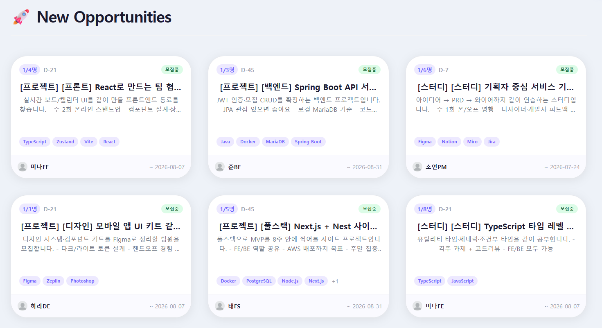
</figure>

### 모집글 상세 · 지원

진행 기간·온/오프라인·모집 인원·스택·본문을 확인하고, 지원 동기·포지션·연락처/포트폴리오를 제출합니다.

<figure class="article-figure-center article-figure-center--wide">
  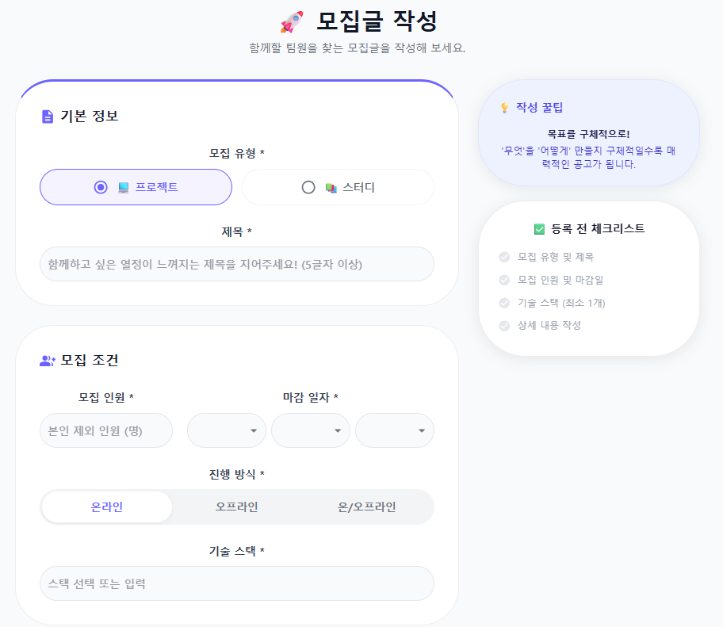
</figure>

### 마이페이지 · 내 모집글 · 내 신청 현황

프로필(닉네임·포지션·기술 스택·프로필 이미지)을 관리하고, 탭으로 **내가 올린 모집글**과 **내 신청 현황**을 한 화면에서 오갑니다. 내 신청 현황은 지원한 글의 `PENDING` / `ACCEPTED` / `REJECTED` 상태를 그대로 보여 주고, 아직 대기 중인 지원은 취소할 수 있습니다.

<figure class="article-figure-center article-figure-center--wide">
  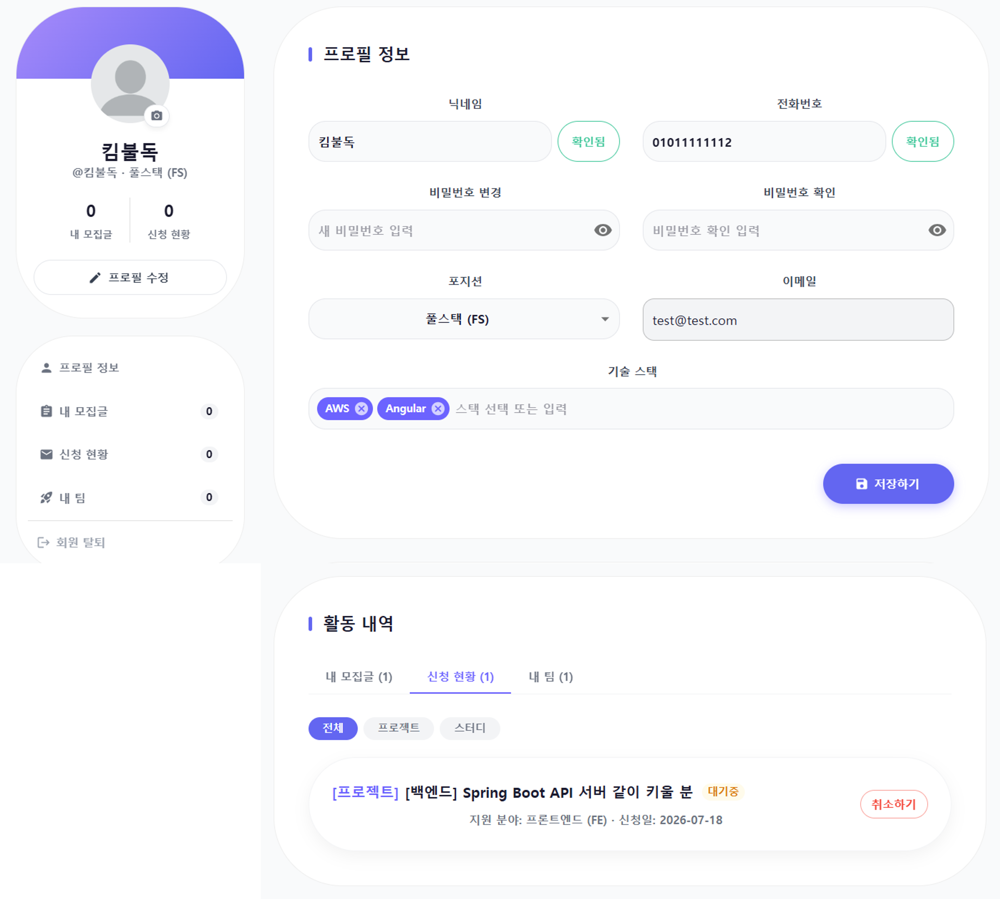
</figure>

### 지원자 관리

내가 올린 모집글에 들어온 지원자 목록을 열어 지원 동기·포지션·연락처를 확인하고 **수락/거절**합니다. 수락하면 `Application`이 `ACCEPTED`로 바뀌며 **ProjectMember**가 생성되고 `currentCount`가 올라가, 정원이 차는 순간 모집이 자동으로 마감됩니다. 거절은 이력만 `REJECTED`로 남깁니다.

<figure class="article-figure-center article-figure-center--wide">
  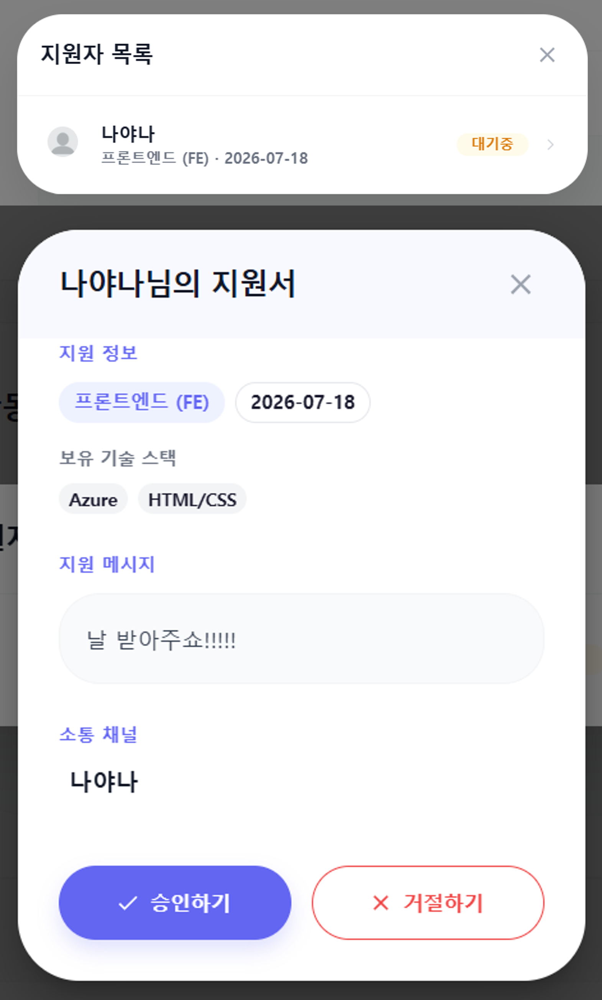
</figure>

### 팀 전용 게시판

매칭된 멤버만 접근하는 협업 게시글·댓글입니다. 외부 유저의 목록·상세 조회를 막아 팀 공지·링크 공유용 공간으로 씁니다. 방장은 이 화면에서 팀원을 제외할 수도 있습니다.

<figure class="article-figure-center article-figure-center--wide">
  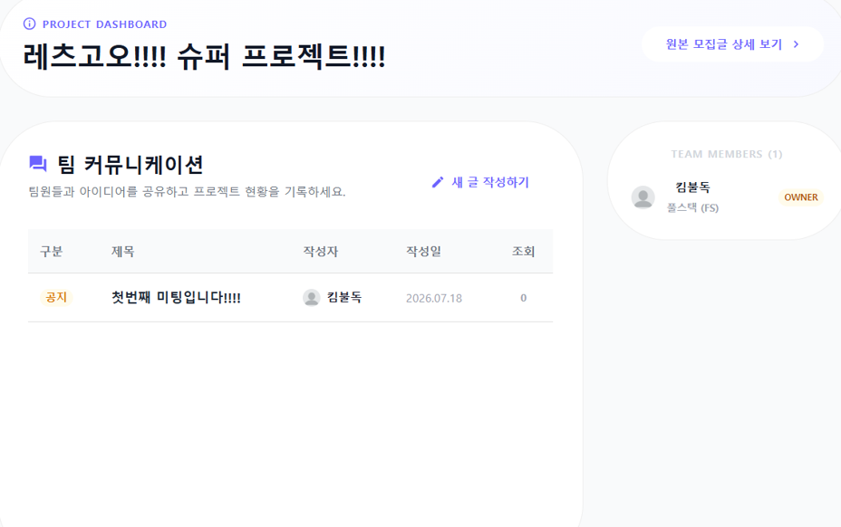
</figure>

### 커스텀 메시지

알림과 확인 절차는 **브라우저 기본 `alert` / `confirm`을 쓰지 않고** 전부 자체 컴포넌트로 대체했습니다. 기본 대화상자는 디자인을 브랜드에 맞출 수 없고, 버튼 문구·위치가 OS마다 달라 전문적인 느낌을 주기 어렵고, 창이 뜨는 순간 페이지 전체를 막아 UX 흐름도 끊깁니다.

**ToastMessage** — MUI `Snackbar` + `Alert` 기반 공용 토스트입니다. 화면 상단 중앙에 뜨고 약 3초 뒤 자동으로 닫히며, `success / error / info / warning` 네 종류를 아이콘·색으로 구분합니다. 흐름을 막지 않는 **비차단(non-blocking)** 피드백이라, 저장·삭제·에러 같은 결과를 알린 뒤 사용자는 그대로 작업을 이어 갑니다.

<figure class="article-figure-center article-figure-center--wide">
  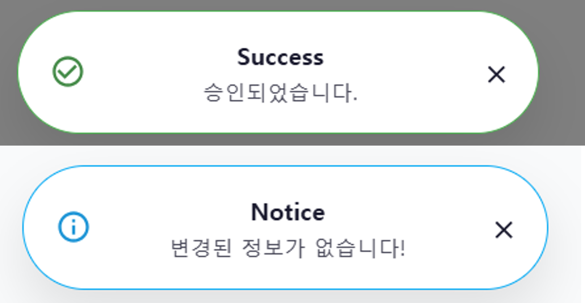
</figure>

**ConfirmModal** — 되돌릴 수 없는 작업(게시글·댓글 삭제, 지원 취소, 회원 탈퇴, 팀원 제외, 조기 마감/재모집)에 쓰는 커스텀 확인 모달입니다. 제목·설명·확인/취소 버튼을 브랜드 톤으로 통일하고, 파괴적 동작은 `color="error"`로 빨간 버튼을 노출해 실수를 줄였습니다. 브라우저 기본 `confirm`처럼 "확인/취소"만 던지는 대신, 무엇을 왜 되돌릴 수 없는지까지 문구로 설명합니다.

<figure class="article-figure-center article-figure-center--wide">
  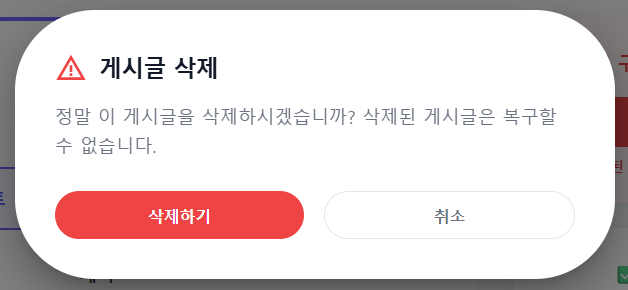
</figure>

**전역 마운트 · 상태 관리** — 두 컴포넌트는 `MainLayout`에 한 번만 마운트하고, 상태는 Zustand `uiStore`(`toast` / `modal`)로 관리합니다. 그래서 어느 페이지든 `showToast(message, type)` 한 줄, `openModal('confirm', { title, message, onConfirm })` 한 줄로 동일한 UI를 띄웁니다. 닫히는 순간 직전 내용을 로컬 상태로 유지해 사라질 때 문구가 깜빡이지 않게 처리했습니다.

# 8. 마무리 소감

2차 미니는 **화면보다 도메인**이 먼저였습니다. 지원서와 멤버를 나누고, Soft Delete와 관리자 복구를 붙이고, JWT 갱신으로 세션을 끊기지 않게 만드는 과정이 1차의 “모아 보여 주기”와는 다른 종류의 설계 연습이었습니다.

프론트는 MSW로 먼저 흐름을 고정하고, 백엔드는 Entity·상태 전이·권한을 코드로 고정했습니다. README에는 요약과 이 글로의 링크만 남겨 두었습니다.

함께 백엔드·프론트를 맞춰 준 팀원들 덕분에 모집에서 팀 게시판까지 한 줄로 이을 수 있었습니다.
