---

# 서론

**SK쉴더스 루키즈 5기**에서 AWS 기반 클라우드 인프라 구축과 CI/CD 파이프라인 교육을 진행한 뒤 이어진 **세 번째 미니 프로젝트**입니다.

개인이 경매 물품을 등록하고, 다른 사용자가 마감 전까지 **실시간으로 입찰**하는 서비스를 만드는 것이 목표였습니다. **MACTA**는 그 흐름을 한곳에서 이어 가도록 만든 경매 플랫폼입니다.

React(Vite) 프론트와 Spring Boot REST API가 나뉘어 있고, JWT 인증·낙관적 락 기반 입찰·스케줄러 마감·결제/배송 흐름을 중심으로 합니다. 배포는 AWS · EKS · GitOps(Argo CD) 위에 올렸습니다.

📦 **GitHub:** [SK-Rookies5-MINI3_MACTA](https://github.com/Hyeonseok93/SK-Rookies5-MINI3_MACTA)  
🌐 **배포:** `macta.store` — 미니 프로젝트 종료 후 인프라를 내려 **현재는 접속되지 않습니다**

# 1. 메인 화면

<figure class="article-figure-center article-figure-center--wide">
  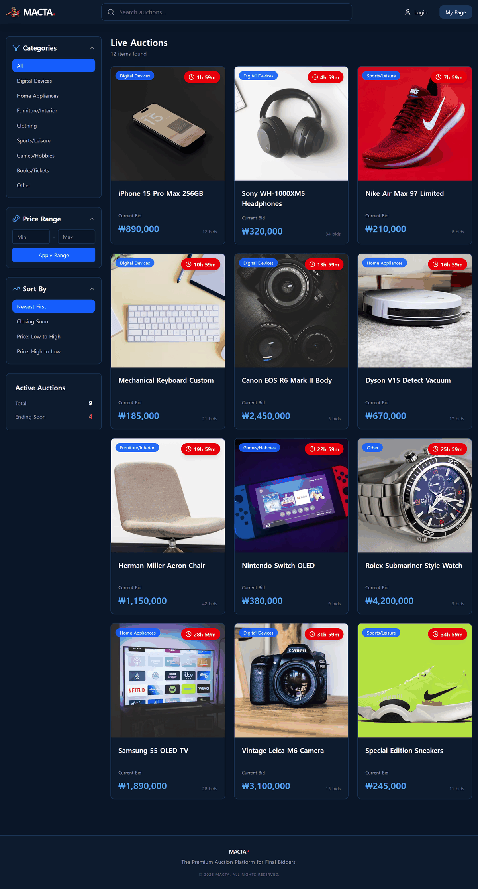
</figure>

# 2. 왜 만들었나

### 개인이 올리는 경매

중고·한정 상품을 “고정가 한 장”으로만 팔기보다, **시작가와 마감 시각을 정해 두고 입찰을 받는** 방식이 필요한 경우가 있습니다. MACTA는 판매자가 물품을 직접 등록하고, 구매자는 진행 중 경매에 참여하는 **개인 간 경매**를 제품의 중심 흐름으로 잡았습니다.

### 마감 직전의 입찰 경쟁

경매는 마감이 가까워질수록 입찰이 몰립니다. 같은 상품에 여러 요청이 동시에 들어오면 **현재 최고가·낙찰자**가 어긋나기 쉽습니다. 그래서 입찰 쓰기에는 **낙관적 락(`@Version`)** 으로 동시 갱신을 잡고, 마감은 스케줄러가 상태와 낙찰자를 확정하는 쪽으로 설계했습니다.

### 앱과 인프라를 한 제품으로

1차(CVS)가 데이터 수집·대시보드, 2차(MATE)가 REST·JPA·JWT였다면, 3차는 **앱 기능뿐 아니라 AWS 인프라와 CI/CD까지** 한 서비스로 묶는 쪽이었습니다. WAF·HTTPS·EKS·Argo CD처럼 교육에서 다룬 구성을, 실제로 입찰·결제·배송이 돌아가는 제품 위에 올려 보는 것이 목표였습니다.

# 3. 서비스 흐름

MACTA의 핵심 흐름은 상품을 올리는 데서 끝나지 않습니다. **상품 등록 → 실시간 입찰 → 낙찰 확정 → 결제 → 배송**으로 이어지며, 역할에 따라 판매자·입찰자·낙찰자가 해야 할 액션이 나뉩니다.

<figure class="article-figure-center article-figure-center--full">
  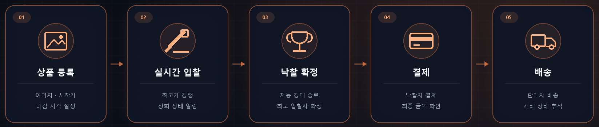
</figure>

### 1. 판매자가 상품을 등록한다

로그인한 사용자가 이미지·제목·설명·카테고리·시작가와 **마감 시각**을 정해 경매를 등록합니다. 시작 시각이 미래면 `READY`, 이미 시작 가능하면 `LIVE`로 두고, 목록·상세에서 다른 사용자가 확인할 수 있습니다.

### 2. 사용자가 실시간으로 입찰한다

구매자는 진행 중(`LIVE`) 경매에 현재가보다 높은 금액으로 입찰합니다. 서버는 종료 여부·가격 검증과 함께 **낙관적 락**으로 최고가를 갱신하고, 상위 입찰이 나면 관련 사용자에게 알림을 보냅니다. 판매자 본인 입찰은 막습니다.

### 3. 마감 시 낙찰자를 확정한다

백엔드 스케줄러가 종료 시각이 지난 경매를 찾아 상태를 바꾸고, **현재 최고 입찰자**를 낙찰자로 확정합니다. 입찰이 없으면 유찰로 끝내 결제·배송 단계가 생기지 않도록 분기합니다.

### 4. 낙찰자가 결제한다

낙찰이 확정되면 거래가 **결제 대기**로 이어집니다. 낙찰자는 마이페이지·거래 화면에서 최종 금액을 확인하고 결제를 진행하며, 완료되면 판매자가 배송할 수 있는 상태로 넘어갑니다.

### 5. 판매자가 배송하고 거래를 닫는다

판매자가 배송을 시작하면 구매자 화면에도 상태가 반영됩니다. **결제 대기 → 결제 완료 → 배송 → 거래 완료**처럼 단계별로 노출되는 액션을 나누어, 낙찰자만 결제하고 판매자만 배송 처리할 수 있게 했습니다.

이 과정에서 React 화면은 Spring Boot REST API를 호출하고, 회원·경매·입찰·결제 정보는 MariaDB에 저장됩니다. 상품 이미지는 S3에 두고, 배포 환경에서는 ALB·WAF·EKS 위에서 같은 흐름이 동작하도록 구성했습니다.

# 4. 도메인 · ERD

핵심은 **판매자가 올린 경매에 입찰이 쌓이고, 마감 후 낙찰자만 결제·배송으로 이어지는** 흐름입니다. 관계·상태·설계 이유는 아래에 정리합니다.

<figure class="article-figure-center article-figure-center--full">
  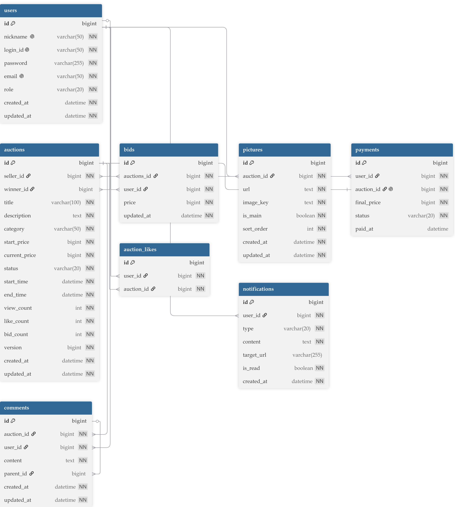
</figure>

### 핵심 엔티티

| 엔티티 | 테이블 | 역할 |
|--------|--------|------|
| **User** | `users` | 회원. `login_id`·닉네임·이메일 unique, 역할(`ROLE_USER` / `ROLE_ADMIN`) |
| **Auction** | `auctions` | 경매. `seller` / `winner` → User, 시작가·현재가·상태·시작/마감 시각, **`version`(낙관적 락)** |
| **Bid** | `bids` | 입찰 이력. Auction(`auctions_id`) + User, 입찰가 |
| **Picture** | `pictures` | 상품 이미지. S3 `url` / `image_key`, 대표 여부·정렬 |
| **Comment** | `comments` | Q&A. Auction + User, `parent_id`로 질문–답변 |
| **AuctionLike** | `auction_likes` | 찜. User–Auction |
| **Payment** | `payments` | 낙찰 후 결제. Auction과 **1:1**, 상태(`PENDING` / `COMPLETED` / `FAILED`) |
| **Notification** | `notifications` | 수신자별 알림. 타입·내용·`target_url`·읽음 여부 |

`Auction`의 `view_count` / `like_count`는 입찰 `@Version`과 충돌하지 않도록 **OptimisticLock에서 제외**했고, `bid_count`는 목록에서 입찰 수를 바로 쓰기 위한 카운터입니다. 이미지는 DB에 바이너리를 두지 않고 S3 키만 둡니다.

### 관계와 상태 전이

1. 회원이 경매(`Auction`)를 올리면 `seller`가 되고, 시작 시각에 따라 초기 상태는 **`READY`** 또는 **`LIVE`**입니다.
2. 다른 회원은 `Bid`를 남깁니다. 유효 입찰만 `current_price` / `bid_count`를 갱신하고, 충돌 시 낙관적 락으로 실패합니다.
3. 스케줄러가 마감되면 **`FINISHED`** + `winner` 확정(유찰이면 winner 없음). 낙찰이 있으면 `Payment`가 생기고 **`PENDING`**부터 시작합니다.
4. 결제·배송이 진행되면 경매 상태는 **`PAID` → `SHIPPING` → `COMPLETED`**처럼 거래 단계로 이어집니다.
5. **Q&A**는 루트 `Comment`가 질문이고, `parent_id`가 있는 행이 답변입니다. 답변은 **해당 경매 판매자만** 쓸 수 있게 막았습니다.

입찰 이력(`Bid`)과 낙찰자(`winner_id`)를 **일부러 나눈** 이유입니다. 입찰은 “누가 얼마에 도전했는지”의 기록이고, 낙찰자는 마감 시점의 **확정 결과**입니다. 같은 필드로 섞으면 마감 전·후 의미를 구분하기 어렵습니다. **입찰 = 이력**, **낙찰자 = 결과**로 역할을 갈랐습니다.

# 5. 주요 API

프론트가 쓰는 REST는 `/api/v1` 아래에 모았습니다. 아래는 **실제 컨트롤러 매핑** 기준 요약입니다. 로그인·세션은 JWT를 **HttpOnly 쿠키**로 두고, 응답 body에는 토큰을 넣지 않습니다.

### Auth · User

| Method | Endpoint | 설명 |
|--------|----------|------|
| POST | `/api/v1/auth/signup` | 회원가입 |
| GET | `/api/v1/auth/check-login-id` | 로그인 아이디 중복 확인 |
| GET | `/api/v1/auth/check-nickname` | 닉네임 중복 확인 |
| GET | `/api/v1/auth/check-email` | 이메일 중복 확인 |
| POST | `/api/v1/auth/login` | 로그인 · HttpOnly 쿠키(`macta_access_token`) 발급 |
| POST | `/api/v1/auth/logout` | 로그아웃 · 쿠키 클리어 |
| GET | `/api/v1/auth/me` | 세션 복구 · 쿠키 재발급 (미인증 시 401) |
| GET | `/api/v1/users/me` | 내 프로필 |
| PUT | `/api/v1/users/me` | 닉네임 등 정보 수정 |
| PATCH | `/api/v1/users/password` | 비밀번호 변경 |
| GET | `/api/v1/users/me/summary` | 마이페이지 요약 |
| GET | `/api/v1/users/me/auctions` | 내가 등록한 경매 (status 필터) |
| GET | `/api/v1/users/me/bids` | 내 입찰 내역 (status 필터) |
| GET | `/api/v1/users/me/likes` | 관심(찜) 목록 |

### Auction · Bid · Q&A · Image

| Method | Endpoint | 설명 |
|--------|----------|------|
| GET | `/api/v1/categories` | 카테고리 목록 |
| GET | `/api/v1/auctions` | 목록 (category·q·가격·sort·페이징) |
| GET | `/api/v1/auctions/stats` | 진행 중·마감 임박 통계 |
| POST | `/api/v1/auctions` | 경매 등록 |
| GET | `/api/v1/auctions/{id}` | 상세 |
| POST | `/api/v1/auctions/{id}/bids` | 입찰 |
| POST | `/api/v1/auctions/{id}/likes` | 찜 토글 |
| GET | `/api/v1/auctions/{auctionId}/comments` | Q&A 목록 |
| POST | `/api/v1/auctions/{auctionId}/comments` | 질문 등록 |
| POST | `/api/v1/auctions/{auctionId}/comments/{commentId}/answers` | 답변 (판매자) |
| POST | `/api/v1/images` | 이미지 업로드 (S3) |

### Trade · Notification

| Method | Endpoint | 설명 |
|--------|----------|------|
| POST | `/api/v1/payments` | 낙찰자 결제 (`FINISHED` → `PAID`) |
| PATCH | `/api/v1/auctions/{id}/shipping` | 판매자 배송 시작 (`PAID` → `SHIPPING`) |
| PATCH | `/api/v1/auctions/{id}/complete` | 낙찰자 수령 확인 (`SHIPPING` → `COMPLETED`) |
| GET | `/api/v1/notifications` | 알림 목록 (페이징) |
| PATCH | `/api/v1/notifications/{id}` | 단건 읽음 |
| PATCH | `/api/v1/notifications/read` | 전체 읽음 |
| DELETE | `/api/v1/notifications/{id}` | 단건 삭제 |
| DELETE | `/api/v1/notifications/read` | 읽은 알림 일괄 삭제 |

입찰 이후 화면 갱신은 REST만으로 돌리지 않고, SockJS/STOMP **`/ws`** 로 구독한 뒤 커밋 후 **`/topic/auctions/{id}`** fan-out으로 현재가·입찰 수를 받습니다.

# 6. 인프라 아키텍처

3차는 앱 API만 올리는 데서 끝내지 않고, **Terraform으로 AWS를 잡고 EKS · GitOps로 배포**까지 한 제품으로 묶었습니다. 인프라 레포에는 VPC·EKS·RDS·S3·ECR·WAF·IRSA와 Kubernetes manifest, Argo CD Application이 함께 있습니다. 도메인은 `macta.store`였고, 미니 종료 후 인프라는 내려 **현재는 접속되지 않습니다**.

<figure class="article-figure-center article-figure-center--full">
  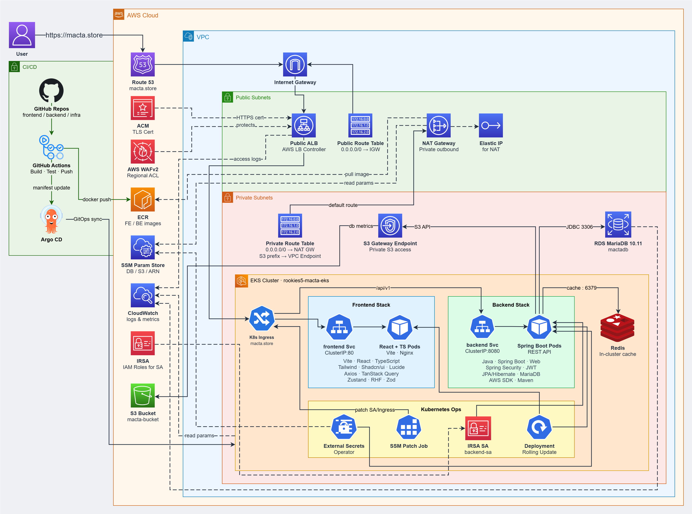
</figure>

### 구성의 축

| 축 | 역할 |
|----|------|
| **Terraform** | VPC, EKS, RDS, S3, ECR, WAF, IRSA, AWS Load Balancer Controller · External Secrets Helm |
| **EKS** | 프론트/백엔드 Deployment, Ingress, External Secrets |
| **SSM + External Secrets** | DB·S3·ARN·이미지 URI를 Parameter Store → Kubernetes Secret으로 동기화 |
| **Route53 + ACM** | `macta.store` DNS · HTTPS 인증서 |
| **GitHub Actions + Argo CD** | 이미지 빌드/푸시 · manifest sync |

ALB는 Terraform이 직접 만들지 않습니다. Terraform은 **AWS Load Balancer Controller**가 돌아갈 IAM·Helm까지 준비하고, 실제 ALB는 `Ingress`를 보고 컨트롤러가 생성합니다.

### Public / Private 네트워크 분리

**Public Subnet**에는 외부 진입점인 **ALB**와, Private의 아웃바운드용 **NAT Gateway**만 둡니다. **Private Subnet**에는 EKS 워커·프론트/백엔드 Pod·**RDS MariaDB**·클러스터 내 Redis를 두고, DB와 앱은 외부에 직접 열지 않았습니다.

외부 사용자는 ALB까지만 닿고, Pod·DB는 사설망 안에서만 통신합니다. Private에서 ECR pull·SSM 조회가 필요할 때는 NAT 또는 VPC Endpoint로만 나가게 해 공격 표면을 좁혔습니다.

### 요청 라우팅

사용자 요청은 대략 다음 순서입니다.

```text
Browser
  → Route53 (macta.store)
  → WAFv2
  → Public ALB (ACM HTTPS)
  → Kubernetes Ingress
       /        → frontend Service → Nginx(React 정적)
       /api/v1  → backend Service  → Spring Boot
```

같은 도메인에서 화면과 API를 나누되, 진입점은 ALB 하나입니다. 프론트 Nginx는 SPA `try_files`만 담당하고, API base는 상대경로 `/api/v1`을 쓰는 쪽을 기준으로 맞췄습니다.

백엔드 Pod는 대략 이렇게 붙습니다.

```text
backend Pod
  → RDS MariaDB :3306
  → Redis
  → S3 (S3 Gateway VPC Endpoint)
  → Secret은 External Secrets가 SSM에서 동기화
```

### GitOps CI/CD

<figure class="article-figure-center article-figure-center--full">
  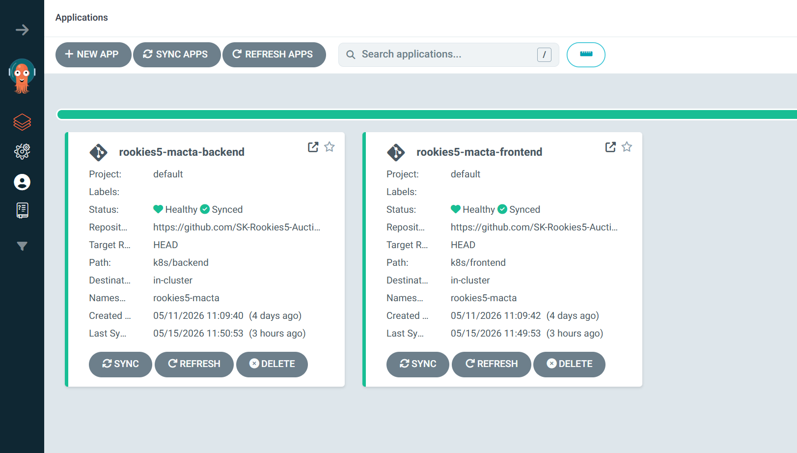
</figure>

흐름은 이렇게 잡았습니다.

```text
frontend / backend 코드 push
  → GitHub Actions (build · test · Docker push to ECR)
  → infra 레포 manifest 이미지 태그 갱신
  → (GitHub webhook) Argo CD refresh
  → Argo CD sync → EKS
```

앱 코드와 **배포 선언(infra manifest)** 을 레포로 나눠, 배포 이력·롤백을 Git 기준으로 추적할 수 있게 했습니다. Argo CD는 polling만 쓰면 sync가 늦을 수 있어, infra push 시 **webhook으로 Application refresh**를 걸어 감지 지연을 줄였습니다.

### Argo CD로 본 배포 상태

Argo CD UI에서는 Application 단위로 sync 상태와 클러스터 리소스를 확인했습니다.

<figure class="article-figure-center article-figure-center--full">
  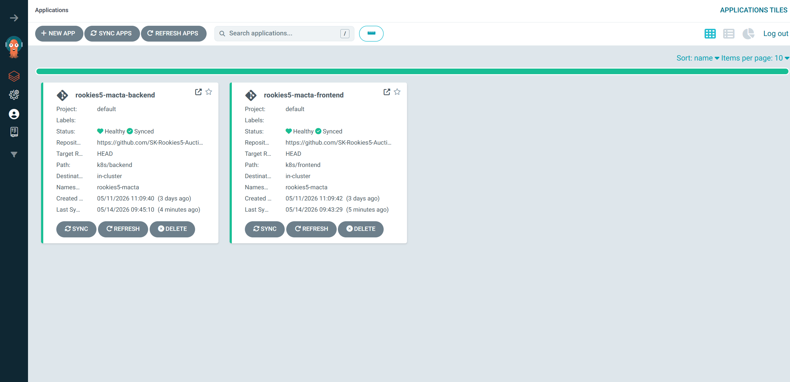
</figure>

<figure class="article-figure-center article-figure-center--full">
  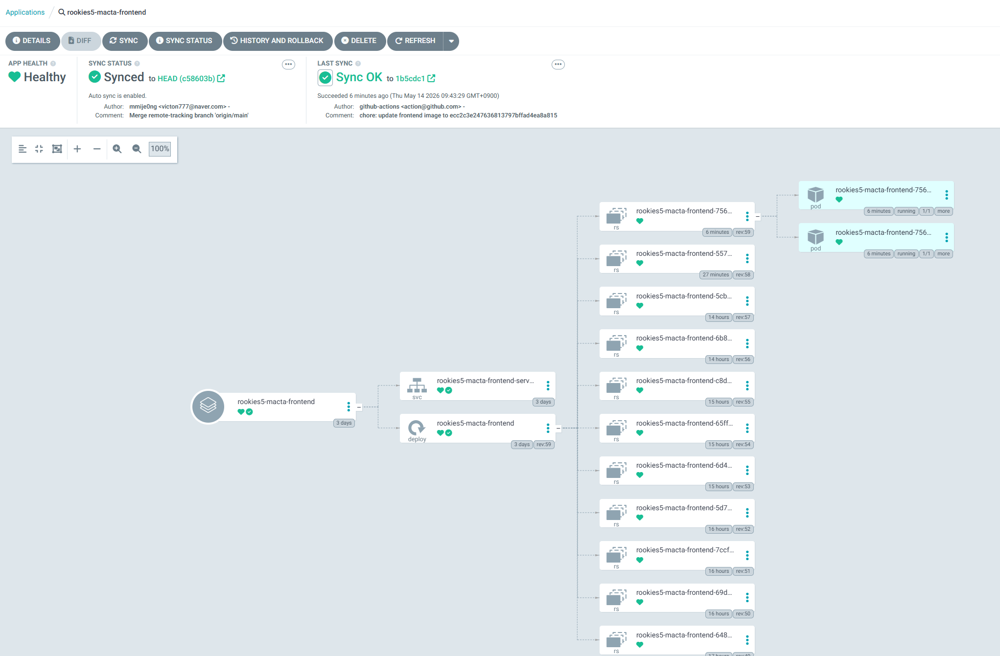
</figure>

infra 레포의 `argocd/` 아래 Application 정의로 프론트·백엔드 manifest 경로를 가리키고, Desired(Git)와 Live(EKS)가 어긋나면 sync로 맞춥니다. 배포가 “누가 언제 어떤 이미지로 올렸는지”가 UI·Git에 같이 남는 점이 팀 운영에 편했습니다.

### 무중단 배포 (Rolling Update)

<figure class="article-figure-center article-figure-center--full">
  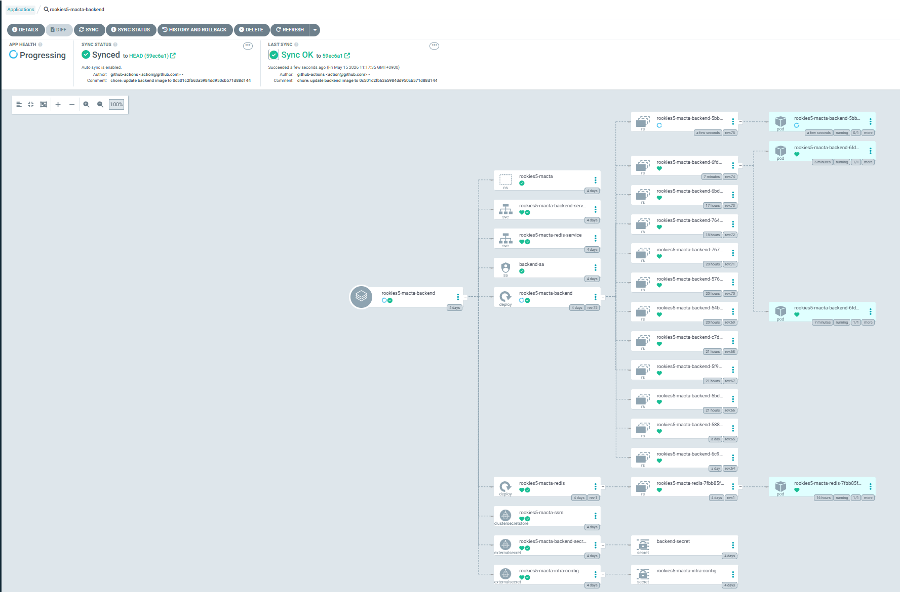
</figure>

프론트·백엔드 Deployment는 **Rolling Update**입니다. 새 Pod가 **Readiness Probe**를 통과한 뒤에야 Service 트래픽을 받고, 한 번에 전부 내리지 않습니다. 새 버전이 Ready가 되지 못하면 기존 Ready Pod가 트래픽을 유지해, 실패한 배포가 곧바로 전체 중단으로 이어지지 않게 했습니다. 경매·WebSocket 특성상 배포 중에도 입찰 요청이 최대한 살아 있도록 가용성 쪽을 우선했습니다.

### Secret · IRSA · Private S3

DB 비밀번호·JWT·버킷명·WAF/ACM ARN·이미지 URI처럼 환경마다 다른 값은 **Kubernetes YAML에 하드코딩하지 않고** SSM Parameter Store에 둡니다. **External Secrets Operator**(IRSA)가 `ClusterSecretStore` / `ExternalSecret`으로 `backend-secret`, `rookies5-macta-infra-config` 같은 Secret을 만들고, 필요하면 **ssm-annotation-patch-job**이 Ingress annotation(WAF ACL ARN, ACM ARN 등)에 주입합니다.

백엔드의 S3 접근은 Pod에 Access Key를 심지 않고 **IRSA**(`backend-sa` ↔ IAM Role)로 최소 권한만 줍니다. S3 트래픽은 **Gateway VPC Endpoint**로 Private 경로를 쓰고, 버킷 Public Access는 막아 두었습니다.

### WAF · HTTPS / WSS

**WAFv2**는 ALB 앞단에서 SQL Injection·XSS·비정상 User-Agent·**Rate Limit**을 거릅니다. WAF ACL은 생성만으로 ALB에 붙지 않아서, ARN을 SSM에 두고 Ingress annotation으로 연결하는 방식을 썼습니다. 사용자–서비스 구간은 **ACM HTTPS**이고, 실시간 구간은 **WSS**를 전제로 암호화했습니다. 로그·메트릭은 CloudWatch(및 WAF 로깅)로 모았습니다.

### 리소스 요약

| 구분 | 연동 | 역할 |
|------|------|------|
| 네트워크 | VPC / Public·Private Subnet / IGW / NAT | 진입점과 앱·DB 분리 |
| DNS · TLS | Route53 / ACM | `macta.store` · HTTPS |
| 진입 | ALB + Load Balancer Controller | Ingress 기반 ALB |
| 컴퓨트 | EKS | FE/BE Pod, Rolling Update |
| 데이터 | RDS MariaDB / Redis / S3 | 영속·캐시·이미지 |
| 보안 | WAFv2 / IRSA / SSM / External Secrets | 필터링·권한·비밀 값 |
| 배포 | ECR / GitHub Actions / Argo CD | 이미지 · GitOps sync |
| 관측 | CloudWatch | 클러스터·ALB·RDS·WAF |

# 7. 핵심 구현

팀 발표·README의 Key Implementation을, 블로그에서는 **왜 그렇게 했는지**와 코드 관점까지 붙여 풉니다. WAF·GitOps·Rolling Update는 **6. 인프라**에서 다뤘으므로 여기서는 앱 쪽만 깊게 갑니다.

### 낙관적 락으로 동시 입찰 무결성

마감 직전 여러 입찰이 동시에 들어오면, “읽은 최고가”와 “쓰는 최고가”가 어긋나기 쉽습니다. 그래서 `Auction`에 **`@Version`** 을 두고, `BidService.placeBid`에서 **검증과 갱신을 한 트랜잭션**으로 묶었습니다.

- **비즈니스 검증 먼저** — 경매가 `LIVE`인지, `endTime`이 지났는지, 입찰가가 `currentPrice`보다 큰지, 판매자 본인인지(`SELF_BID_NOT_ALLOWED`)를 확인한 뒤에야 가격을 올립니다. 낮거나 같은 금액은 `INVALID_BID_PRICE`로 막습니다.
- **버전 충돌 → 409** — 동시에 같은 행을 수정하면 Hibernate가 `OptimisticLockingFailureException`을 던지고, `GlobalExceptionHandler`가 이를 **`BID_CONFLICT`(409)** 로 바꿉니다. FE Axios 인터셉터는 “다른 사용자가 먼저 입찰을 완료했습니다. 다시 시도해주세요.”로 보여 재입찰을 유도합니다.
- **조회수·찜과 잠금 분리** — 상세 조회·좋아요가 입찰 `@Version`을 끌어올리면, 입찰과 무관한 트래픽이 낙찰 경쟁을 망가뜨립니다. 그래서 `view_count` / `like_count`에는 `@OptimisticLock(excluded = true)`를 걸어, 입찰 핫패스만 버전을 쓰게 했습니다.
- **TX는 얇게, 부수 효과는 AFTER_COMMIT** — 트랜잭션 안에서는 `current_price`·`bid_count`·`Bid` INSERT만 합니다. `BidPlacedEvent`는 **`AFTER_COMMIT`** 리스너에서 Redis pub/sub → STOMP fan-out과 판매자·상위 입찰자 알림을 보냅니다. 커밋 실패한 입찰이 화면·알림으로 새지 않게 한 것입니다.
- **동시성 검증** — `BidServiceConcurrencyTest`로 여러 스레드가 같은 경매에 입찰할 때 최종 최고가가 일관되는지 확인하는 쪽을 두었습니다. “락을 걸었다”가 아니라 **충돌 시 한 건만 남는 동작**을 테스트로 고정한 셈입니다.

### 서버 시간 동기화 · 실시간 입찰 UX

클라이언트 PC 시계가 틀어지면 마감 카운트다운과 “아직 입찰 가능” 판단이 함께 틀어집니다. 그래서 시간 계산과 최고가 갱신을 **서버 기준**으로 맞춰 두었습니다.

- **오프셋 동기화** — Axios 응답의 `timestamp`와 요청 RTT의 절반을 보정해 `useTimeStore.serverOffset`을 갱신합니다. `CountdownTimer`는 `new Date()` 대신 **`getServerNow()`** 로 잔여 시간을 그려, 카운트다운·마감 임박 표시가 같은 기준을 씁니다.
- **미니 당시: 폴링** — WebSocket이 없을 때 **새 입찰가를 실시간처럼 보여 주려던 땜빵**이 짧은 주기 REST 폴링이었습니다. 구현은 단순했지만, 마감 직전에는 불필요한 GET 부하가 커지는 한계가 있었습니다.
- **이후: STOMP fan-out** — UX 계약(최고가·입찰 수·상태)은 유지한 채 전달 채널만 바꿨습니다. FE `useAuctionSocket`이 SockJS로 `/ws`에 붙고 `/topic/auctions/{id}`를 구독합니다. 핸드셰이크 때 **HttpOnly 쿠키 JWT**를 `JwtHandshakeInterceptor`가 읽어 세션에 넣고, Bearer를 JS에 심지 않습니다.
- **화면 갱신** — 소켓 메시지·본인 입찰 성공 시 React Query `setQueryData`로 `['auction', id]`의 `currentPrice` / `bidCount`만 패치합니다. 전체 상세를 다시 긁지 않아도 카드·입찰 패널이 따라갑니다.
- **효과** — “시계상으론 남았는데 서버는 이미 마감” 같은 불일치를 줄이고, 새로고침 없이 경쟁 중인 최고가를 따라갑니다.

### 스케줄러 기반 자동 시작·마감

관리자가 경매를 일일이 열고 닫지 않도록, `AuctionScheduler`가 **매 분(KST)** 상태를 맞춥니다. 한 건이 실패해도 나머지가 멈추지 않게, 시작·마감은 `AuctionProcessService`의 **`REQUIRES_NEW`** 트랜잭션으로 건별 처리합니다.

- **READY → LIVE** — `startTime ≤ now`인 `READY` ID만 모아 `processStart`로 진행 중으로 바꿉니다. 생성 시점에 이미 시작 가능하면 처음부터 `LIVE`로 두고, 예약 등록만 스케줄러가 열어 줍니다.
- **LIVE → FINISHED** — `endTime`이 지난 `LIVE`만 마감합니다. 상태가 바뀐 뒤 다시 잡히지 않도록, 조회 조건 자체로 중복 마감을 피합니다.
- **낙찰 / 유찰 분기** — 최고가 `Bid`가 있으면 `finish(winner)` + `Payment(PENDING)` 생성 + 낙찰 알림. 입찰이 없으면 winner 없이 `FINISHED`만 남겨 **결제·배송 단계가 생기지 않게** 합니다.
- **CLOSING_SOON** — 매 시간 주기로 1시간 이내 마감 `LIVE`의 입찰자에게 알림을 보내고, 동일 user+대상 URL이 이미 있으면 스킵해 알림 폭탄을 막습니다.

### 낙찰 후 결제·배송 역할 분리

경매 종료 후에도 거래는 **낙찰자 결제 → 판매자 배송 → 낙찰자 수령 확인**으로 이어집니다. `TradeService`에서 상태·권한·금액을 한 번에 검증해, 역할이 바뀌면 API가 바로 거절합니다.

- **결제 (`FINISHED` → `PAID`)** — `winner`만 가능. 요청 `amount`가 `currentPrice`와 다르면 `PAYMENT_AMOUNT_MISMATCH`로 막습니다. `Payment`가 `PENDING`일 때만 완료 처리하고 경매 상태를 `PAID`로 올립니다.
- **배송 (`PAID` → `SHIPPING`)** — **판매자**만. 다른 상태·다른 유저면 `ALREADY_PROCESSED` / `ACCESS_DENIED`.
- **수령 확인 (`SHIPPING` → `COMPLETED`)** — **낙찰자**만. 단계가 건너뛰이지 않도록 직전 상태를 강제합니다.
- **마이페이지** — `me/auctions`·`me/bids`에 status 필터를 두어, 출품 건의 “배송 시작”과 낙찰 건의 “결제·수령”이 서로 다른 목록·버튼으로 보이게 했습니다. 화면에서 역할을 섞지 않은 이유가 서버 가드와 같게 맞춰져 있습니다.

### HttpOnly 쿠키 세션

입찰·결제처럼 민감한 API가 많은 서비스에서, JWT를 `localStorage`에 두면 XSS에 그대로 노출됩니다. 그래서 Access Token은 **`macta_access_token` HttpOnly 쿠키**로만 두고, 로그인·`/auth/me` 응답 body에는 토큰을 넣지 않습니다(`@JsonIgnore`).

- **복구** — 새로고침 시 `GET /api/v1/auth/me`가 쿠키를 검증하고 필요하면 쿠키를 재발급합니다. 미인증이면 **401**이라 FE가 세션을 정리합니다.
- **403 ≠ 로그아웃** — 권한 부족(판매자만 답변 등)으로 403이 나와도 인터셉터에서 강제 로그아웃하지 않습니다. **401만** 세션 종료로 봅니다.
- **WebSocket과 동일 계약** — REST의 `withCredentials`와 SockJS 핸드셰이크가 같은 쿠키를 쓰므로, 입찰 REST와 실시간 구독이 인증 방식을 갈라놓지 않습니다.

# 8. 화면으로 보는 기능

로그인부터 상세 입찰·마감·결제·알림·마이페이지까지, 서비스 흐름이 화면에서 어떻게 이어지는지 봅니다. (메인 Live Auctions는 **1. 메인 화면**의 `fig1`과 같습니다.)

### 로그인

입찰·마이페이지·관심 등록처럼 인증이 필요한 동작은 로그인으로 이어집니다. 아이디·비밀번호로 로그인하면 Access Token이 **HttpOnly 쿠키**로 심기고, 아직 회원이 아니면 회원가입으로 넘어갑니다. 비로그인 상태로 보호된 기능을 누르면 토스트로 “로그인이 필요한 서비스”를 안내한 뒤 이 화면으로 보냅니다.

<figure class="article-figure-center article-figure-center--wide">
  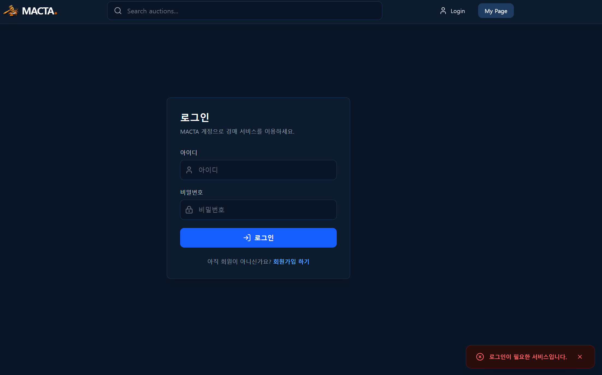
</figure>

### 상세 · 실시간 입찰 · Q&A

상세는 **이미지 갤러리 + 입찰 패널**과, 아래로 이어지는 **입찰 활동 · 상품 설명 · Q&A**가 한 흐름입니다.

위쪽에서는 카테고리·찜·서버 기준 **남은 시간**·현재 최고가·입찰 입력·Place Bid가 보입니다. 최고가가 본인이면 “by You”처럼 표시해, 7번에서 말한 오프셋 타이머와 STOMP 갱신이 이 패널을 따라가게 했습니다.

<figure class="article-figure-center article-figure-center--wide">
  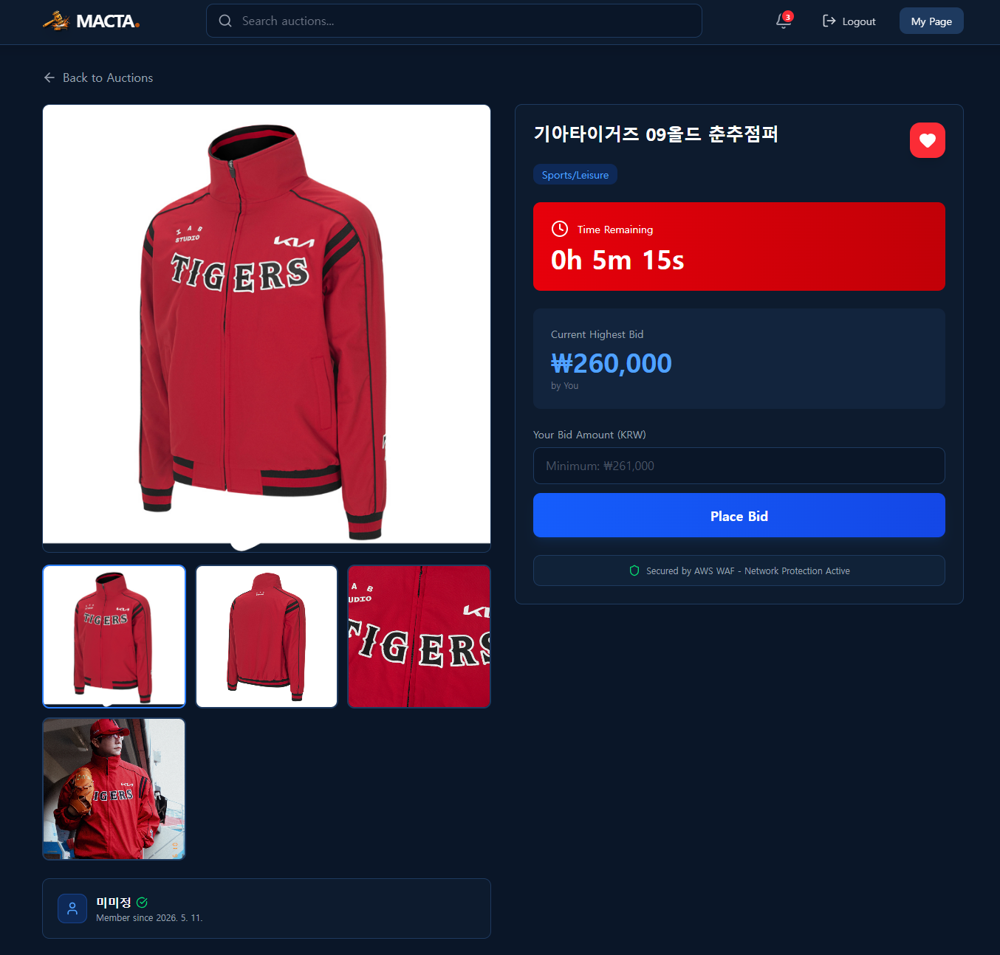
</figure>

아래쪽 **Live Bidding Activity**는 최근 입찰을 카드로 나열하고, **Product Description**에 상품 설명을 둡니다. **Questions & Answers**에서는 누구나 질문을 남길 수 있고, 답변은 **판매자만** 달 수 있습니다. 판매자 답변은 들여쓰기와 Seller 표기로 질문과 구분됩니다.

<figure class="article-figure-center article-figure-center--wide">
  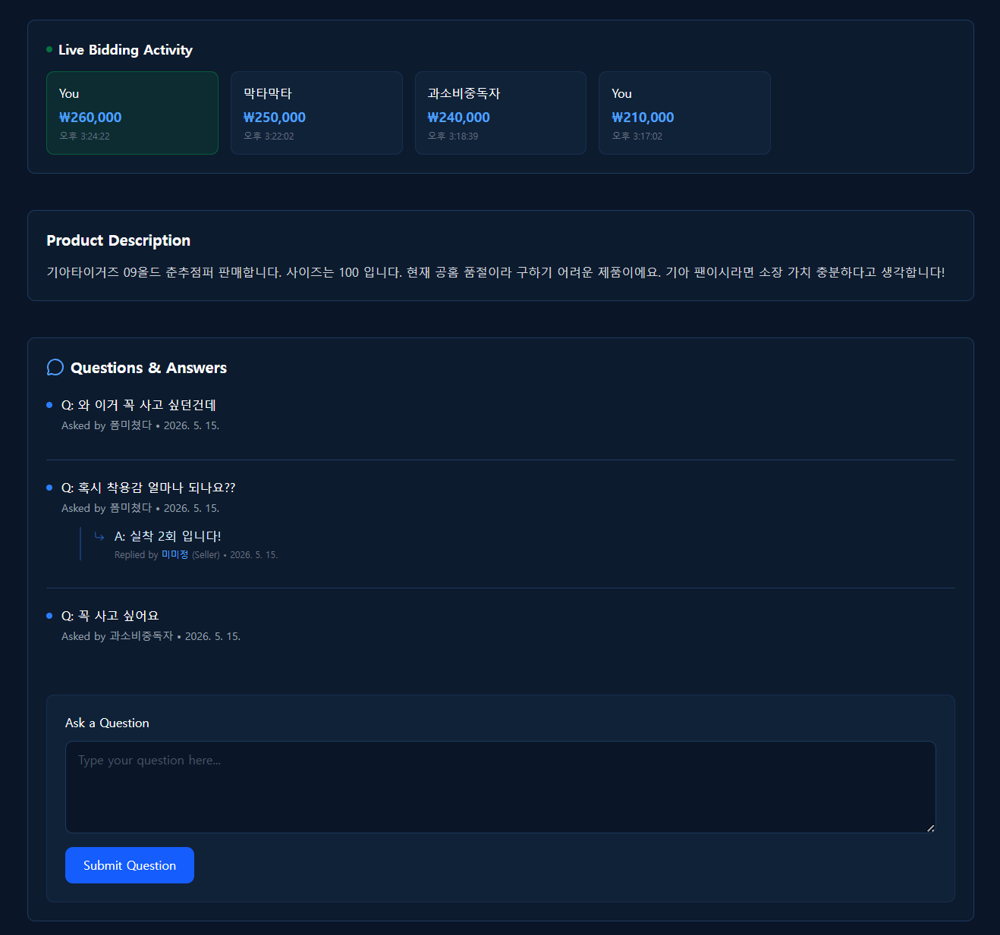
</figure>

### 경매 종료 · 낙찰

스케줄러가 마감하면 상세 입찰 UI는 **AUCTION ENDED**로 바뀝니다. 낙찰자와 최종가가 보이고, 낙찰자 본인이면 “지금 바로 결제하세요”로 결제 화면으로 이어집니다. 입찰 입력은 더 이상 받지 않습니다.

<figure class="article-figure-center article-figure-center--wide">
  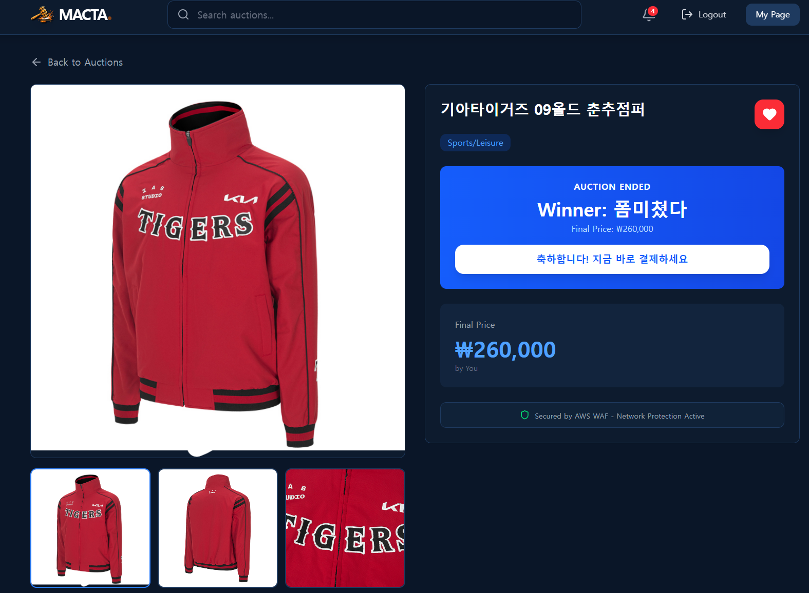
</figure>

### 낙찰자 결제

낙찰자는 주문 요약(상품·최종 낙찰가)을 확인하고 결제 수단을 고른 뒤 Complete Payment로 진행합니다. 서버에서는 `winner`·금액 일치·`FINISHED` 상태를 검사한 뒤 `PAID`로 올립니다. 이 화면이 **낙찰자만 결제**하는 역할 분리의 진입점입니다.

<figure class="article-figure-center article-figure-center--wide">
  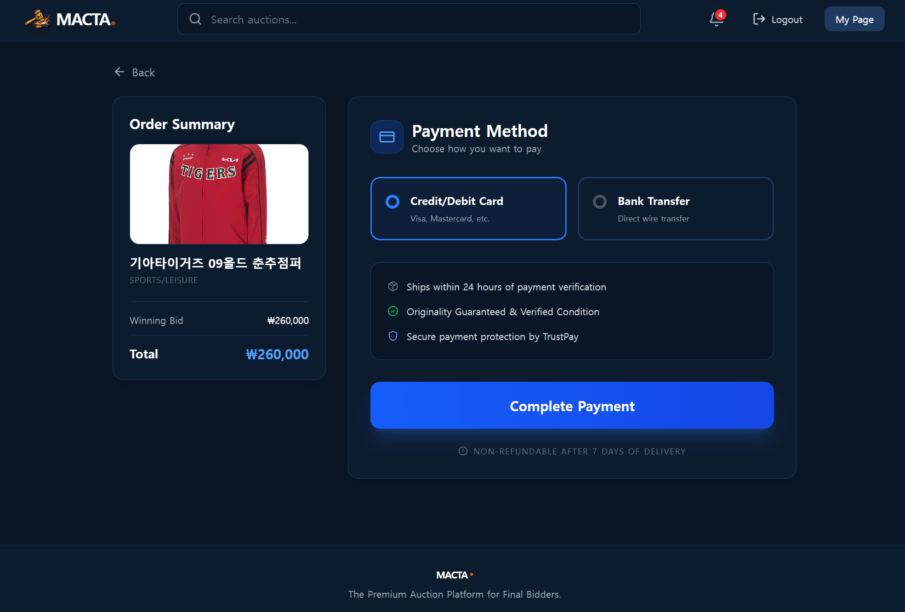
</figure>

### 알림

헤더 벨에서 상위 입찰·문의 답변 같은 이벤트를 바로 확인합니다. OUTBID, Q&A 답변, 마감·낙찰 계열 알림이 쌓이고, 전체 목록으로 이어갈 수 있습니다. 입찰 경쟁 중에도 새로고침 없이 “내가 밀렸다 / 답변이 왔다”를 받도록 한 화면입니다.

<figure class="article-figure-center article-figure-center--wide">
  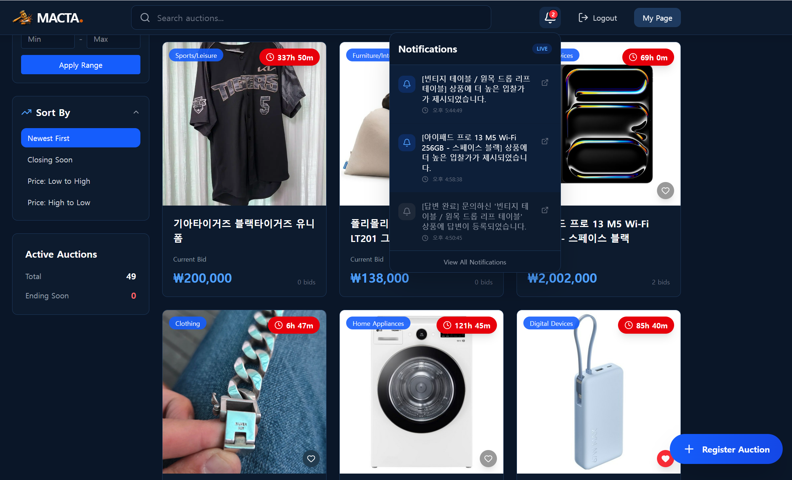
</figure>

### 마이페이지 · 입찰 내역

마이페이지에서는 요약 카드(Bidding / Won / Hosted / Likes)와 사이드 메뉴로 **내 출품 · 입찰 내역 · 관심**을 나눕니다. 입찰 내역은 All / Live / Won / Lost / Paid / Shipping / Completed / Outbid 같은 상태 탭으로 좁히고, **MY PRICE**와 **CURRENT PRICE**를 나란히 보여 줍니다. Live에서 최고가인지, Lost·Paid처럼 거래 단계가 어디인지 한눈에 구분할 수 있습니다.

<figure class="article-figure-center article-figure-center--wide">
  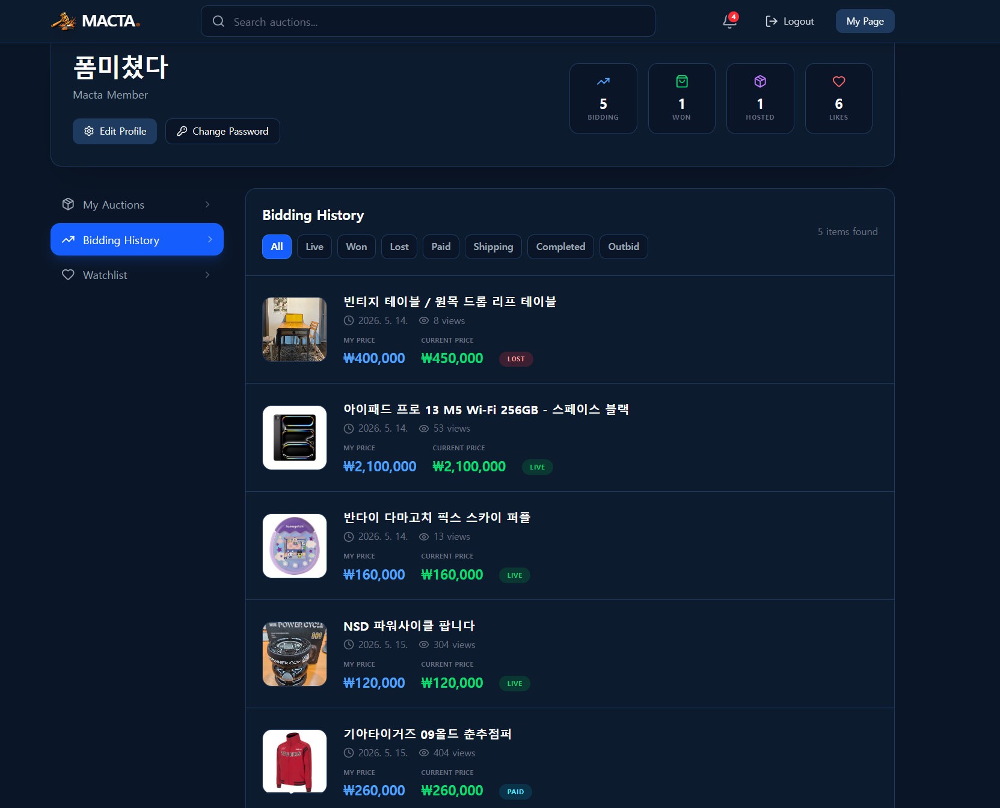
</figure>

출품 목록(My Auctions)에서는 같은 상태 축으로 Live·Finished·Paid·Shipping·Completed를 보고, `PAID`인 건에 **배송 시작**처럼 판매자 액션만 노출합니다. 결제·배송 버튼을 낙찰자/판매자 화면에 나눠 둔 것과 맞춰 두었습니다.

# 9. 미니 이후의 리팩토링 — 폴링에서 실시간·안전한 구조로

미니 기간에는 **등록 → 입찰 → 마감 → 결제·배송** 흐름과 AWS·EKS 배포를 한 제품으로 올리는 것이 우선이었습니다. 기능은 돌아갔지만, 끝난 뒤 코드를 다시 보니 새 입찰가를 보이기 위한 **1초 REST 폴링 땜빵**, JWT가 JS에 노출될 여지, Q&A·스케줄러·목록 조회에 데모만으로는 안 보이던 구멍이 남아 있었습니다.

리팩토링은 **실시간 전달 → 낙관적 락 경계 → 세션·권한 → 도메인/스케줄러 검증 → 구조·성능·FE 분해** 순으로 진행했습니다. API 경로와 기존 데이터는 최대한 유지하고, 한 번에 갈아엎기보다 문제별로 고친 뒤 컴파일·빌드로 확인하는 쪽이었습니다.

## 실시간은 1초 폴링이었다

목적은 **새 입찰가가 화면에 바로 반영되는 것처럼 보이게** 하는 것이었고, WebSocket fan-out이 아직 없을 때의 **땜빵**이 1초 REST 폴링이었습니다. `ProductDetail`이 짧은 주기로 상세(·댓글)를 다시 받아 최고가를 맞추는 식이라, BE에 WebSocket 의존성이 있어도 STOMP 설정·발행 코드는 없었고, 마감 직전일수록 불필요한 GET만 폭증했습니다.

조치는 입찰 쓰기는 REST로 두고, **커밋 이후**에만 상태를 밀어 주는 쪽이었습니다.

- BE: SockJS `/ws` + broker `/topic`, `BidPlacedEvent`를 `AFTER_COMMIT`에서 받아 Redis/STOMP로 `/topic/auctions/{id}` fan-out
- 핸드셰이크는 **HttpOnly 쿠키 JWT** (`JwtHandshakeInterceptor`), CONNECT는 세션 auth 우선
- FE: `useAuctionSocket` 구독, 1초 폴링 제거, React Query `setQueryData`로 최고가·입찰 수만 패치
- 댓글은 REST 유지하되 작성 후 캐시 갱신만 하고, 30초 댓글 poll도 제거

“화면이 자주 바뀌면 실시간”이 아니라, **검증된 입찰이 커밋된 뒤에만** 구독자에게 보이게 바꾼 것이 핵심입니다.

## 조회수·좋아요가 입찰 락을 건드렸다

입찰은 `@Version` 낙관적 락으로 최고가 경쟁을 지키는데, 상세 조회·찜이 같은 엔티티를 건드리면 **입찰과 무관한 트래픽이 `BID_CONFLICT`를 유발**할 수 있었습니다.

`view_count` / `like_count`에 `@OptimisticLock(excluded = true)`를 걸어 입찰 버전과 분리했고, 조회수 증가는 `AuctionViewService`의 **`REQUIRES_NEW`** UPDATE로 상세 읽기 트랜잭션과 갈랐습니다. 입찰 핫패스 TX 안에서는 가격·`bid_count`·INSERT만 남기고, 알림·WS는 커밋 후로 빼 잠금 시간을 줄였습니다.

## JWT를 쿠키만 쓰게 정리하다

로그인 응답 body에 Access Token이 실리고, FE가 메모리/쿠키 헬퍼로 Bearer를 붙이던 경로가 남아 있으면 XSS 때 토큰이 그대로 노출됩니다. WebSocket까지 Bearer 헤더를 요구하면 JS에 토큰을 다시 쥐여 줘야 했습니다.

- 로그인·`/auth/me`는 **`macta_access_token` HttpOnly** `Set-Cookie`만 사용하고, `LoginResponse.accessToken`은 `@JsonIgnore`
- FE는 `withCredentials` + 쿠키만. `tokenCookie.ts` 삭제. `macta_user`는 UX용 프로필 캐시
- `/auth/me` 미인증은 **401**, 로그아웃은 쿠키 클리어. **403은 로그아웃하지 않음** (판매자 전용 API 등과 구분)
- SockJS도 같은 쿠키로 핸드셰이크해 REST와 실시간 인증 계약을 맞춤
- Authentication은 JWT claims(`uid`,`role`,…)로 구성해 요청마다 유저 DB 로드를 줄이고, `/me`만 DB 재조회

## Q&A 답변 IDOR와 판매자 가드

답변 API에 판매자 검증이 약하거나, `parent_id`가 **다른 경매의 댓글**을 가리켜도 통과하면 IDOR가 됩니다. 미니2의 “지원자 목록은 방장만”과 같은 종류의 구멍입니다.

- 답변은 **해당 경매 판매자만** (`NOT_AUCTION_SELLER`)
- `parentComment.auctionId`가 path의 `auctionId`와 같아야 하고, **루트 질문**에만 답변 허용
- 판매자 본인 입찰은 UI 숨김 + `handlePlaceBid` / `SELF_BID_NOT_ALLOWED`
- `CustomUserDetails`의 `ROLE_ROLE_USER` 이중 prefix 수정
- 생성·댓글·결제 요청에 `@Valid` / Bean Validation, 결제 금액·권한은 `TradeService`에서 재검증

## READY → LIVE와 알림·예외를 도메인에 고정하다

미래 `startTime` 경매를 곧바로 `LIVE`로 두거나, 스케줄러가 시작 전환 없이 마감만 하면 예약 경매 상태가 어긋납니다. `CLOSING_SOON`을 매 주기 같은 유저에게 반복 보내면 알림 폭탄이 됩니다.

- 생성 시 미래 시작이면 **`READY`**, 아니면 **`LIVE`**
- 매 분 스케줄러: `READY`+startTime 경과 → `LIVE`, 그다음 `LIVE` 마감. 건별 `REQUIRES_NEW`
- `CLOSING_SOON`은 동일 user+targetUrl 있으면 스킵
- not-found 등을 `IllegalArgumentException` 대신 **`BusinessException` + ErrorCode**로 통일해 FE가 `BID_CONFLICT` 등을 `error.code`로 구분

## 알림·목록 N+1·프론트 경계를 걷어 내다

알림 생성 코드가 입찰·댓글·스케줄러·거래에 흩어져 타입이 들쭉날쭉했고, 목록은 입찰 수·찜·대표 이미지를 건마다 조회하는 N+1에 가깝습니다. 프론트는 ProductDetail·MyPage가 비대해지고 API 모듈도 한곳에 몰려 있었습니다.

**Backend**

- `NotificationFacade`로 알림 일원화, `NotificationType`에 `NEW_BID`·결제·배송·거래 완료 등 추가
- `PageResponseFactory` · `SecurityUtils` · `PictureUrlResolver` 추출
- 목록: bid COUNT·like ID·main image key **배치** 조회. MyPage도 이미지/결제/최고가 배치
- `bid_count` 컬럼 + 기동 시 `BidCountBackfillRunner` 백필, 목록은 엔티티 카운터 사용

**Frontend**

- `BidPanel` / `QaSection` 분리, `notification.ts` / `payment.ts` / `apiError.ts`
- Home·알림·MyPage·상세를 **React Query**로 통일
- MyPage를 Header·Sidebar·ItemList·프로필/비밀번호 모달로 분해

기능을 더 붙이기보다, **미니 때 쌓인 실시간·보안·조회 부채를 갚으면서** 화면에 보이던 폴링과 권한 구멍을 같이 메운 과정이었습니다.

---

# 10. 마무리 소감

1, 2차에서 기능 구현을 익혔다면, 3차는 **인프라의 중요성**을 체감한 과정이었습니다.

특히 배포와 업데이트가 자동화되는 말도 안 되는 효율성을 보며, 안정적인 환경 구축과 보안이 서비스 완성도에 얼마나 직결되는지 배웠습니다. 생소했던 인프라의 힘을 실감한 값진 시간이었습니다.

많은 시행착오를 겪으면서 끝까지 같이 고생하며 마무리해 준 팀원들에게 고맙다는 말을 전하고 싶습니다.
